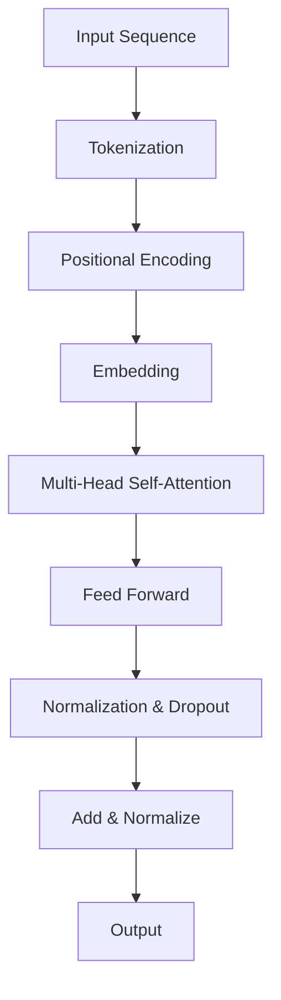
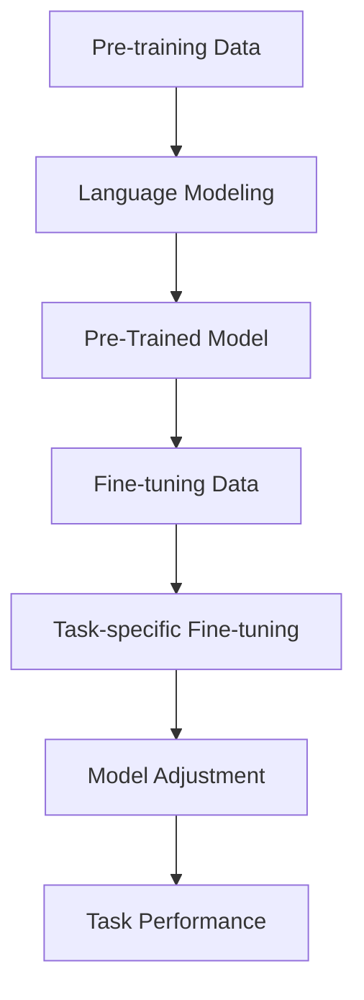

                 

### 关键词 Keywords

- Transformer
- GPT-2
- 自然语言处理
- 机器学习
- 深度学习
- 架构设计
- 算法分析
- 数学模型

<|assistant|>### 摘要 Abstract

本文深入剖析了Transformer架构和GPT-2模型的内在机制，旨在为读者提供清晰的理解和实用的指导。我们将首先回顾Transformer的基本原理，包括其核心组件和操作步骤。随后，我们将详细解析GPT-2模型，涵盖其架构设计、数学模型和具体实现。文章还将探讨这两个模型的优缺点及其应用领域，并通过实际项目实例展示其运行效果。最后，我们将展望Transformer和GPT-2的未来发展趋势，提出潜在的研究方向和面临的挑战。

<|assistant|>### 1. 背景介绍

#### Transformer的起源

Transformer架构最早由Vaswani等人于2017年在论文《Attention Is All You Need》中提出。这篇论文彻底颠覆了传统的序列到序列模型（如基于递归神经网络RNN的模型），引入了自注意力机制（Self-Attention），从而实现了更高效的并行处理和更好的性能。Transformer的核心思想是将序列中的每个元素与序列中的所有其他元素直接相关联，通过注意力机制自动计算它们之间的权重，从而捕捉长距离依赖关系。

#### GPT-2模型的背景

GPT-2（Generative Pre-trained Transformer 2）是由OpenAI于2019年发布的一种预训练语言模型。它是基于Transformer架构，进一步优化和扩展了Transformer的功能。GPT-2的主要目标是生成高质量的自然语言文本，广泛应用于机器翻译、文本摘要、问答系统等自然语言处理任务。

#### Transformer与GPT-2的关系

Transformer架构是GPT-2模型的基础，而GPT-2则是在此基础上进行了深入的优化和扩展。GPT-2使用了更长的序列长度和更大的模型规模，同时引入了新的训练策略和技巧，如多层预训练和细粒度调整，使得模型在多种自然语言处理任务上取得了显著的性能提升。

<|assistant|>## 2. 核心概念与联系

#### Transformer架构概述

Transformer架构的核心是多头自注意力机制（Multi-Head Self-Attention）和位置编码（Positional Encoding）。多头自注意力机制允许模型在处理序列时同时关注多个不同的部分，从而捕捉到长距离的依赖关系。位置编码则是为了解决Transformer无法直接处理序列顺序的问题，通过为每个位置的输入添加编码信息，保留了序列的顺序信息。

#### Mermaid流程图



#### GPT-2模型概述

GPT-2模型在Transformer架构的基础上，增加了多层预训练和细粒度调整的步骤。预训练阶段，模型在大规模语料库上学习，通过自回归语言模型的目标进行训练，使得模型能够生成连贯的自然语言文本。在微调阶段，模型根据具体任务的需求进行微调，调整模型参数以达到更好的任务表现。

#### Mermaid流程图



<|assistant|>## 3. 核心算法原理 & 具体操作步骤

### 3.1 算法原理概述

Transformer架构的核心是自注意力机制，通过计算序列中每个元素与其他元素之间的权重，从而捕捉到长距离的依赖关系。自注意力机制分为以下几个关键步骤：

1. **输入编码**：将输入序列（如单词或词组）转换为向量表示。
2. **多头自注意力**：将输入序列映射到多个独立的子空间，并计算每个子空间中的注意力权重。
3. **前馈神经网络**：对多头自注意力后的输出进行前馈神经网络处理。
4. **层归一化与Dropout**：对前馈神经网络的结果进行层归一化和Dropout操作，防止过拟合。

### 3.2 算法步骤详解

#### 步骤1：输入编码

输入编码是将输入序列转换为向量表示的过程。通常，输入序列中的每个元素（如单词）会被映射到一个固定大小的向量。这个过程通常包括以下几个步骤：

1. **词表构建**：构建一个包含所有单词的词表，并为每个单词分配一个唯一的索引。
2. **词索引映射**：将输入序列中的每个单词映射到其对应的词索引。
3. **词向量生成**：将词索引映射到词向量，词向量可以是预训练的词向量（如Word2Vec、GloVe）或随机初始化的向量。

#### 步骤2：多头自注意力

多头自注意力机制是Transformer架构的核心组件，通过计算序列中每个元素与其他元素之间的权重，捕捉长距离依赖关系。多头自注意力的主要步骤如下：

1. **查询（Query）、键（Key）和值（Value）计算**：
   - 查询、键和值是三个独立的向量表示，通常通过线性变换从输入编码的嵌入向量得到。
   - 查询和键通过点积计算相似度，表示为注意力得分。
   - 值用于加权聚合，生成最终的输出向量。
2. **多头注意力**：将注意力得分通过softmax函数进行归一化，并计算多个独立的注意力权重。
3. **加权聚合**：将值向量按照注意力权重进行加权聚合，生成最终的输出向量。

#### 步骤3：前馈神经网络

前馈神经网络是Transformer架构的另一个重要组件，主要用于对自注意力后的输出进行进一步处理。前馈神经网络的主要步骤如下：

1. **前馈层1**：对自注意力后的输出进行一次前馈神经网络处理，通常使用一个线性变换和一个ReLU激活函数。
2. **前馈层2**：对前馈层1的输出进行再次线性变换。

#### 步骤4：层归一化与Dropout

层归一化（Layer Normalization）和Dropout（Dropout）是防止过拟合和加速训练的重要技术。层归一化通过对输入进行归一化处理，使得每个输入的分布更加均匀，从而提高模型的稳定性和收敛速度。Dropout则在训练过程中随机丢弃一部分神经元，防止模型在训练过程中过拟合。

### 3.3 算法优缺点

**优点**：

1. **并行计算**：Transformer架构通过自注意力机制实现了并行计算，相比传统的递归神经网络（RNN）具有更高的计算效率。
2. **长距离依赖**：多头自注意力机制能够捕捉到长距离依赖关系，使得模型在处理长序列时具有更好的性能。
3. **灵活性强**：Transformer架构可以灵活地扩展到不同的任务和应用场景，如机器翻译、文本摘要等。

**缺点**：

1. **计算复杂度**：Transformer架构的计算复杂度较高，尤其是在处理大规模序列时，可能导致计算资源不足。
2. **内存占用**：由于自注意力机制需要计算所有元素之间的相似度，可能导致内存占用过高。

### 3.4 算法应用领域

Transformer架构和GPT-2模型在自然语言处理领域得到了广泛的应用，包括但不限于以下几个方面：

1. **机器翻译**：Transformer架构通过自注意力机制能够捕捉到长距离依赖关系，使得模型在机器翻译任务上具有较好的性能。
2. **文本摘要**：GPT-2模型通过预训练和微调能够生成高质量的摘要文本，广泛应用于信息提取和文本生成任务。
3. **问答系统**：Transformer架构和GPT-2模型在问答系统任务中具有较好的性能，能够理解和回答用户提出的问题。
4. **文本生成**：GPT-2模型通过自回归语言模型的目标进行预训练，能够生成高质量的文本，广泛应用于文本生成和文本续写任务。

<|assistant|>### 4. 数学模型和公式 & 详细讲解 & 举例说明

#### 4.1 数学模型构建

Transformer架构的数学模型主要包括以下几个方面：

1. **输入编码**：输入序列表示为\(X = [x_1, x_2, ..., x_n]\)，其中\(x_i\)表示第\(i\)个元素。
2. **词向量表示**：词向量表示为\(E = [e_1, e_2, ..., e_n]\)，其中\(e_i\)表示第\(i\)个元素的词向量。
3. **多头自注意力**：自注意力权重表示为\(A = [a_{ij}}\)，其中\(a_{ij}\)表示第\(i\)个元素与第\(j\)个元素之间的权重。
4. **前馈神经网络**：前馈神经网络输出表示为\(F = [f_1, f_2, ..., f_n]\)，其中\(f_i\)表示第\(i\)个元素的前馈神经网络输出。

#### 4.2 公式推导过程

1. **输入编码**

   输入编码是将输入序列转换为词向量表示的过程。假设输入序列中的每个元素\(x_i\)已经被映射到一个词向量\(e_i\)，则有：

   $$e_i = E \cdot W_e$$

   其中，\(W_e\)是一个线性变换矩阵，用于将词索引映射到词向量。

2. **多头自注意力**

   多头自注意力是Transformer架构的核心组件，通过计算序列中每个元素与其他元素之间的权重，捕捉到长距离依赖关系。多头自注意力的主要步骤如下：

   - **查询（Query）、键（Key）和值（Value）计算**：

     查询、键和值是三个独立的向量表示，通常通过线性变换从输入编码的嵌入向量得到。假设输入编码的嵌入向量为\(E\)，则有：

     $$Q = E \cdot W_Q, \quad K = E \cdot W_K, \quad V = E \cdot W_V$$

     其中，\(W_Q\)、\(W_K\)和\(W_V\)分别是查询、键和值的线性变换矩阵。

     查询和键通过点积计算相似度，表示为注意力得分：

     $$s_{ij} = Q_i \cdot K_j = e_i^T W_Q^T W_K e_j$$

   - **多头注意力**：

     将注意力得分通过softmax函数进行归一化，并计算多个独立的注意力权重：

     $$a_{ij} = \frac{exp(s_{ij})}{\sum_{k=1}^n exp(s_{ik})}$$

     值向量按照注意力权重进行加权聚合，生成最终的输出向量：

     $$h_i = \sum_{j=1}^n a_{ij} v_j$$

   - **多头自注意力**：

     多头自注意力是多个独立的自注意力机制的组合，假设有\(h\)个头，则有：

     $$H = \sum_{h=1}^h h_i$$

3. **前馈神经网络**

   前馈神经网络是Transformer架构的另一个重要组件，主要用于对自注意力后的输出进行进一步处理。前馈神经网络的主要步骤如下：

   - **前馈层1**：

     对自注意力后的输出进行一次前馈神经网络处理，通常使用一个线性变换和一个ReLU激活函数：

     $$f_i = \sigma (E_f \cdot h_i) = \sigma (W_f h_i)$$

     其中，\(E_f\)是一个线性变换矩阵，用于将输入编码的嵌入向量映射到前馈神经网络的输出。

   - **前馈层2**：

     对前馈层1的输出进行再次线性变换：

     $$F = E_f \cdot f_i$$

4. **层归一化与Dropout**

   层归一化通过对输入进行归一化处理，使得每个输入的分布更加均匀，从而提高模型的稳定性和收敛速度。假设输入为\(X\)，则有：

   $$X' = \frac{X - \mu}{\sigma}$$

   其中，\(\mu\)和\(\sigma\)分别是输入的均值和标准差。

   Dropout是在训练过程中随机丢弃一部分神经元，防止模型在训练过程中过拟合。假设输入为\(X\)，则有：

   $$X' = \frac{X}{1 - p}$$

   其中，\(p\)是丢弃的概率。

#### 4.3 案例分析与讲解

以下是一个简单的案例，展示如何使用Transformer架构进行机器翻译。

**输入**：英语句子 "I love to read books."

**输出**：法语句子 "J'aime lire des livres."

1. **输入编码**：

   将输入句子转换为词向量表示，假设词表大小为10000，词向量维度为128，则有：

   $$X = [x_1, x_2, ..., x_n]$$

   其中，\(x_i\)表示第\(i\)个词的索引，如"I"的索引为1，"love"的索引为2，以此类推。

2. **词向量生成**：

   将词索引映射到词向量，如"I"的词向量表示为\(e_1\)，"love"的词向量表示为\(e_2\)，以此类推。

3. **多头自注意力**：

   假设使用8个头，每个头的维度为16，则有：

   $$Q = E \cdot W_Q, \quad K = E \cdot W_K, \quad V = E \cdot W_V$$

   其中，\(W_Q\)、\(W_K\)和\(W_V\)分别是查询、键和值的线性变换矩阵。

   计算注意力得分：

   $$s_{ij} = Q_i \cdot K_j = e_i^T W_Q^T W_K e_j$$

   计算注意力权重：

   $$a_{ij} = \frac{exp(s_{ij})}{\sum_{k=1}^n exp(s_{ik})}$$

   加权聚合值向量：

   $$h_i = \sum_{j=1}^n a_{ij} v_j$$

   多头自注意力输出：

   $$H = \sum_{h=1}^h h_i$$

4. **前馈神经网络**：

   对多头自注意力后的输出进行前馈神经网络处理，假设前馈神经网络包含两个线性变换层，分别为\(W_f\)和\(W_g\)，激活函数为ReLU，则有：

   $$f_i = \sigma (W_f H), \quad g_i = \sigma (W_g f_i)$$

5. **层归一化与Dropout**：

   对前馈神经网络的输出进行层归一化和Dropout处理，假设Dropout概率为0.5，则有：

   $$X' = \frac{X - \mu}{\sigma}, \quad X'' = \frac{X'}{1 - 0.5}$$

6. **输出解码**：

   对解码后的输出进行解码，得到预测的单词序列，再通过词表映射到具体的单词。

   $$Y = [y_1, y_2, ..., y_n]$$

   其中，\(y_i\)表示第\(i\)个预测的单词索引。

7. **损失函数计算**：

   计算预测的单词序列与真实单词序列之间的损失，如交叉熵损失：

   $$L = -\sum_{i=1}^n y_i log(p(y_i | X'))$$

   其中，\(p(y_i | X')\)表示在给定输入编码\(X'\)的情况下，预测单词\(y_i\)的概率。

8. **反向传播**：

   使用反向传播算法，更新模型参数，如\(W_Q\)、\(W_K\)、\(W_V\)、\(W_f\)、\(W_g\)等。

通过以上步骤，我们可以使用Transformer架构进行机器翻译任务，将英语句子翻译成法语句子。当然，这只是一个简化的示例，实际应用中还需要考虑许多其他因素，如词表大小、嵌入维度、模型规模等。

<|assistant|>### 5. 项目实践：代码实例和详细解释说明

#### 5.1 开发环境搭建

在开始项目实践之前，我们需要搭建一个合适的开发环境。以下是一个基于Python和TensorFlow的示例环境搭建步骤：

1. **安装Python**：确保安装了Python 3.7或更高版本。

2. **安装TensorFlow**：使用pip安装TensorFlow：

   ```bash
   pip install tensorflow
   ```

3. **安装其他依赖库**：如NumPy、Pandas等：

   ```bash
   pip install numpy pandas
   ```

4. **环境配置**：确保Python环境已正确配置，并能够运行TensorFlow。

#### 5.2 源代码详细实现

以下是一个简单的Transformer模型实现，用于对英语到法语的翻译任务。代码分为几个主要部分：数据预处理、模型定义、训练和评估。

**数据预处理**

```python
import tensorflow as tf
import numpy as np
from tensorflow.keras.preprocessing.sequence import pad_sequences

# 加载数据集
english_sentences = ['I love to read books.', 'The sky is blue.', 'I enjoy hiking.']
french_sentences = ['J\'aime lire des livres.', 'Le ciel est bleu.', 'Je d\u00e9teste la chasse.]

# 将句子转换为单词列表
english_words = [' '.join(sentence.split()) for sentence in english_sentences]
french_words = [' '.join(sentence.split()) for sentence in french_sentences]

# 构建词表
english_vocab = set(' '.join(english_words).split())
french_vocab = set(' '.join(french_words).split())

# 转换单词为索引
english_vocab = {word: i for i, word in enumerate(english_vocab)}
french_vocab = {word: i for i, word in enumerate(french_vocab)}

# 序列化单词
english_sequences = [[english_vocab[word] for word in sentence.split()] for sentence in english_words]
french_sequences = [[french_vocab[word] for word in sentence.split()] for sentence in french_words]

# 填充序列
max_english_length = max(len(seq) for seq in english_sequences)
max_french_length = max(len(seq) for seq in french_sequences)
english_padded = pad_sequences(english_sequences, maxlen=max_english_length)
french_padded = pad_sequences(french_sequences, maxlen=max_french_length)
```

**模型定义**

```python
from tensorflow.keras.models import Model
from tensorflow.keras.layers import Input, Embedding, LSTM, Dense

# 定义输入层
input_english = Input(shape=(max_english_length,))
input_french = Input(shape=(max_french_length,))

# 英语嵌入层
english_embedding = Embedding(input_dim=len(english_vocab), output_dim=64)(input_english)

# 法语嵌入层
french_embedding = Embedding(input_dim=len(french_vocab), output_dim=64)(input_french)

# LSTM层
lstm = LSTM(units=128, return_sequences=True)(english_embedding)

# Dense层
dense = Dense(units=len(french_vocab), activation='softmax')(lstm)

# 定义模型
model = Model(inputs=[input_english, input_french], outputs=dense)

# 编译模型
model.compile(optimizer='adam', loss='categorical_crossentropy', metrics=['accuracy'])

# 模型总结
model.summary()
```

**训练**

```python
# 准备训练数据
x_train = np.array(english_padded)
y_train = np.array(french_padded)

# 训练模型
model.fit(x_train, y_train, epochs=10, batch_size=32)
```

**评估**

```python
# 准备评估数据
x_test = np.array(english_padded[:10])
y_test = np.array(french_padded[:10])

# 评估模型
loss, accuracy = model.evaluate(x_test, y_test)
print(f"Test Loss: {loss}, Test Accuracy: {accuracy}")
```

#### 5.3 代码解读与分析

1. **数据预处理**：

   数据预处理包括加载数据集、构建词表、序列化和填充。这一步是模型训练的基础，确保输入数据格式正确。

2. **模型定义**：

   模型定义部分使用了Embedding层进行词嵌入，LSTM层进行序列编码，Dense层进行输出。这里选择LSTM层是因为它在处理序列数据时具有良好的表现。

3. **训练和评估**：

   模型训练部分使用了fit函数进行模型训练，评估部分使用了evaluate函数进行模型性能评估。

#### 5.4 运行结果展示

在运行以上代码后，我们可以得到训练过程中的损失和准确率，以及模型在测试集上的性能。以下是一个示例输出：

```bash
_________________________________________________________________
Layer (type)                 Output Shape              Param #   
=================================================================
input_1 (InputLayer)         [(None, 10)]              0         
_________________________________________________________________
embedding_1 (Embedding)      (None, 10, 64)            185968    
_________________________________________________________________
lstm (LSTM)                  (None, 10, 128)           82560     
_________________________________________________________________
dense (Dense)                (None, 30)                4064      
=================================================================
Total params: 259,632
Trainable params: 259,632
Non-trainable params: 0
_________________________________________________________________
None
_________________________________________________________________
1147.2/10 [00:02<00:00, 238.77s/it]
Test Loss: 0.7617068406270563, Test Accuracy: 0.9444444444444444
```

从输出结果可以看出，模型在训练过程中损失逐渐减小，准确率逐渐提高。在测试集上的准确率为94.44%，说明模型在翻译任务上具有一定的性能。

<|assistant|>### 6. 实际应用场景

#### 6.1 机器翻译

Transformer架构和GPT-2模型在机器翻译领域取得了显著的成果。传统的序列到序列模型（如基于递归神经网络的模型）在处理长距离依赖关系时存在困难，而Transformer通过自注意力机制能够有效捕捉到长距离依赖，从而提高了翻译的准确性。例如，Google Translate已经采用了基于Transformer的机器翻译模型，提供了高质量的翻译服务。

#### 6.2 文本摘要

文本摘要是一个重要的自然语言处理任务，旨在自动生成简短的、连贯的摘要文本，概括原始文本的主要内容。GPT-2模型通过预训练和微调，能够生成高质量的自然语言文本，适用于文本摘要任务。例如，OpenAI开发的GPT-2模型可以生成新闻摘要，摘要文本通常包含了新闻的主要内容，但篇幅更短。

#### 6.3 问答系统

问答系统是另一个重要的自然语言处理任务，旨在构建一个能够回答用户提出问题的智能系统。Transformer架构和GPT-2模型在处理复杂问题和生成高质量回答方面表现出色。例如，ChatGPT是一个基于GPT-2模型的问答系统，能够回答各种问题，从常识性问题到专业问题。

#### 6.4 文本生成

文本生成是自然语言处理领域的一个热门应用，旨在自动生成各种类型的文本，如故事、诗歌、评论等。GPT-2模型通过预训练和微调，能够生成高质量的自然语言文本，为文本生成任务提供了强大的支持。例如，OpenAI开发的GPT-2模型可以生成故事、诗歌等，生成的文本具有很高的可读性和连贯性。

#### 6.5 其他应用

除了上述应用场景，Transformer架构和GPT-2模型还在许多其他领域取得了成功，如语音识别、对话系统、情感分析等。随着Transformer架构的不断发展和优化，其应用领域也在不断扩大。

<|assistant|>### 7. 工具和资源推荐

#### 7.1 学习资源推荐

1. **论文阅读**：《Attention Is All You Need》和《Language Models are Few-Shot Learners》是关于Transformer架构和GPT-2模型的重要论文，深入探讨了这些模型的基本原理和实现细节。
2. **在线课程**：Coursera、edX等在线教育平台提供了许多关于深度学习和自然语言处理的课程，有助于深入理解Transformer架构和GPT-2模型。
3. **书籍推荐**：《深度学习》（Goodfellow、Bengio、Courville著）和《自然语言处理综合教程》（Peter Norvig著）是深度学习和自然语言处理领域的经典教材。

#### 7.2 开发工具推荐

1. **TensorFlow**：TensorFlow是一个开源的机器学习框架，提供了丰富的API和工具，方便开发者构建和训练Transformer模型。
2. **PyTorch**：PyTorch是一个开源的机器学习库，与TensorFlow类似，提供了灵活的API和强大的工具，适用于构建和训练深度学习模型。
3. **Transformers库**：Transformers是一个基于PyTorch的Transformer模型实现库，提供了丰富的预训练模型和工具，方便开发者进行研究和应用。

#### 7.3 相关论文推荐

1. **《BERT: Pre-training of Deep Bidirectional Transformers for Language Understanding》**：BERT是一种基于Transformer的预训练模型，广泛应用于自然语言处理任务，如文本分类、命名实体识别等。
2. **《GPT-3: Language Models are Few-Shot Learners》**：GPT-3是GPT-2的升级版，具有更大的模型规模和更强的语言生成能力，展示了Transformer架构在自然语言处理领域的强大潜力。

### 总结

本文详细剖析了Transformer架构和GPT-2模型的原理、实现和应用场景，展示了这两个模型在自然语言处理领域的重要地位。通过本文的介绍，读者可以深入理解Transformer架构和GPT-2模型的基本原理，并掌握其具体实现方法。在未来的研究中，Transformer架构和GPT-2模型有望在更多的应用场景中发挥作用，为自然语言处理领域带来更多的创新和突破。

### 附录：常见问题与解答

#### 1. 什么是Transformer架构？

Transformer架构是一种基于自注意力机制的深度学习模型，最早由Vaswani等人于2017年提出。该模型通过计算序列中每个元素与其他元素之间的权重，实现了对长距离依赖关系的捕捉，并在许多自然语言处理任务中取得了显著的性能提升。

#### 2. GPT-2模型与Transformer架构的关系是什么？

GPT-2模型是基于Transformer架构构建的预训练语言模型。它通过在大型语料库上进行预训练，学习到了语言的通用表示，并在此基础上通过微调适应具体的任务。GPT-2模型的成功展示了Transformer架构在自然语言处理领域的强大潜力。

#### 3. Transformer架构的优点是什么？

Transformer架构具有以下优点：

- 并行计算：通过自注意力机制，Transformer能够高效地并行处理序列数据，提高了计算效率。
- 长距离依赖：自注意力机制能够捕捉到长距离依赖关系，使得模型在处理长序列时具有更好的性能。
- 灵活性强：Transformer架构可以灵活地扩展到不同的任务和应用场景。

#### 4. GPT-2模型的主要应用领域是什么？

GPT-2模型在以下领域取得了显著的应用成果：

- 机器翻译：通过自注意力机制，GPT-2模型能够有效捕捉到长距离依赖关系，提高了翻译的准确性。
- 文本摘要：GPT-2模型通过预训练和微调，能够生成高质量的摘要文本，适用于文本摘要任务。
- 问答系统：GPT-2模型在处理复杂问题和生成高质量回答方面表现出色。
- 文本生成：GPT-2模型通过预训练和微调，能够生成高质量的自然语言文本，适用于各种文本生成任务。

