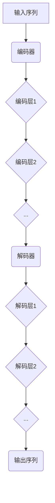

                 

关键词：Transformer, 编码器，解码器，神经网络，自然语言处理，结构对比，功能分析

摘要：本文将深入探讨Transformer编码器与解码器的结构与功能，通过详细的对比分析，揭示这两种关键组件在自然语言处理任务中的工作原理和优缺点。我们将结合具体实例，阐述它们在实际应用中的表现，并展望未来的发展趋势和面临的挑战。

## 1. 背景介绍

随着深度学习技术的不断发展，自然语言处理（NLP）领域取得了显著进展。近年来，Transformer模型以其出色的性能在NLP任务中崭露头角，成为许多研究者和开发者的首选。Transformer模型的核心组成部分包括编码器（Encoder）和解码器（Decoder），它们分别承担着输入序列的处理和输出序列的生成任务。本文将重点关注这两个组件的结构与功能，深入探讨它们在Transformer模型中的角色和作用。

## 2. 核心概念与联系

### 2.1 Transformer模型架构

Transformer模型是基于自注意力机制（Self-Attention）的一种新型神经网络架构，它由编码器（Encoder）和解码器（Decoder）两部分组成。编码器负责处理输入序列，解码器则负责生成输出序列。

### 2.2 编码器（Encoder）

编码器的核心作用是将输入序列（如单词、词组等）映射为固定长度的向量表示。这种表示方式称为“编码表示”（Encoded Representation）。编码器由多个编码层（Encoder Layer）组成，每一层都包括多头自注意力机制（Multi-Head Self-Attention）和前馈神经网络（Feedforward Neural Network）。

### 2.3 解码器（Decoder）

解码器的核心作用是生成输出序列，并将其映射回原始文本形式。解码器同样由多个解码层（Decoder Layer）组成，每一层都包括自注意力机制、编码器-解码器注意力机制（Encoder-Decoder Attention）和前馈神经网络。

### 2.4 Mermaid 流程图

下面是编码器和解码器的 Mermaid 流程图，展示了它们的基本结构和相互关系。

## 3. 核心算法原理 & 具体操作步骤

### 3.1 算法原理概述

Transformer编码器和解码器都采用自注意力机制（Self-Attention）来处理输入和输出序列。自注意力机制允许模型在处理序列时，动态地计算序列中各个元素之间的相关性，从而实现更强大的表示学习能力。

### 3.2 算法步骤详解

#### 3.2.1 编码器

1. **输入序列预处理**：将输入序列映射为词向量表示。
2. **编码层处理**：每一层编码器包括多头自注意力机制和前馈神经网络。
   - **多头自注意力机制**：计算序列中各个元素之间的相似度，并加权求和，形成新的编码表示。
   - **前馈神经网络**：对编码表示进行非线性变换，增强模型的表达能力。
3. **编码表示输出**：将编码器的输出序列传递给解码器。

#### 3.2.2 解码器

1. **输入序列预处理**：与编码器相同，将输入序列映射为词向量表示。
2. **解码层处理**：每一层解码器包括自注意力机制、编码器-解码器注意力机制和前馈神经网络。
   - **自注意力机制**：计算解码器中当前词与其他词之间的相似度。
   - **编码器-解码器注意力机制**：计算编码器输出序列与解码器当前词之间的相似度，为解码器的输出提供上下文信息。
   - **前馈神经网络**：对解码表示进行非线性变换。
3. **解码表示输出**：生成输出序列。

### 3.3 算法优缺点

#### 3.3.1 优点

- **并行计算**：由于自注意力机制不需要序列顺序，编码器和解码器可以并行处理输入和输出序列，提高计算效率。
- **长距离依赖**：自注意力机制可以捕捉序列中的长距离依赖关系，增强模型的表示学习能力。
- **灵活性**：编码器和解码器的设计较为灵活，可以适应不同的任务和数据集。

#### 3.3.2 缺点

- **计算复杂度**：自注意力机制的计算复杂度较高，对于长序列可能导致计算资源不足。
- **对数据集依赖**：Transformer模型对数据集的大小和多样性要求较高，否则可能无法取得理想的效果。

### 3.4 算法应用领域

Transformer编码器和解码器在NLP领域具有广泛的应用，如机器翻译、文本生成、情感分析等。同时，它们也在图像识别、语音识别等跨领域任务中显示出强大的性能。

## 4. 数学模型和公式 & 详细讲解 & 举例说明

### 4.1 数学模型构建

#### 4.1.1 编码器

编码器的主要数学模型包括词向量表示、多头自注意力机制和前馈神经网络。

1. **词向量表示**：$$ \text{input\_embeddings} = \text{word\_embeddings} \times \text{positional\_embeddings} $$
2. **多头自注意力机制**：$$ \text{atten

