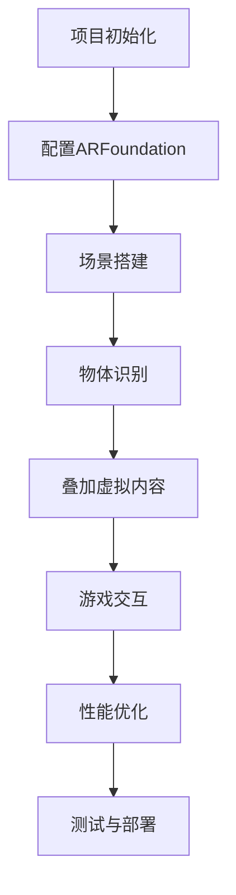

                 

 关键词：Unity、增强现实、AR游戏、开发实战、技术解析

> 摘要：本文将深入探讨Unity平台在增强现实（AR）游戏开发中的应用与实践，通过介绍核心概念、算法原理、数学模型、项目实践以及未来展望，为读者提供一份全面、系统的AR游戏开发指南。

## 1. 背景介绍

增强现实（AR）技术作为一项前沿技术，正逐渐改变着人们的生活方式。AR技术通过在现实世界中叠加数字信息，使得虚拟内容与真实世界相互融合。随着移动设备和计算能力的提升，AR技术已经广泛应用于教育、医疗、零售、娱乐等多个领域。

Unity作为全球领先的跨平台游戏开发引擎，以其强大的渲染能力、易用性和广泛的生态系统，成为了AR游戏开发的首选工具。Unity的ARFoundation插件，更是为开发者提供了创建沉浸式AR体验的便捷途径。

本文旨在通过实战案例分析，系统地介绍Unity AR游戏开发的各个环节，帮助开发者深入了解AR技术的应用场景和开发流程。

## 2. 核心概念与联系

为了更好地理解Unity AR游戏开发的原理，我们首先需要掌握以下几个核心概念：

### 2.1 增强现实（AR）基本原理

增强现实技术通过在现实世界中叠加虚拟内容，实现现实与虚拟的融合。其基本原理包括：

- **摄像头捕捉**：摄像头捕捉真实世界的图像。
- **图像识别**：通过图像识别算法确定现实世界中的物体。
- **叠加虚拟内容**：在识别到的物体上叠加虚拟内容。

### 2.2 Unity引擎与ARFoundation

Unity引擎是一款功能强大的游戏开发引擎，支持2D和3D游戏开发。ARFoundation是Unity提供的一套AR开发工具包，它集成了AR核心功能，包括摄像头捕捉、图像识别、虚拟内容叠加等。

### 2.3 Mermaid流程图

下面是Unity AR游戏开发的基本流程，使用Mermaid流程图进行展示。



## 3. 核心算法原理 & 具体操作步骤

### 3.1 算法原理概述

Unity AR游戏开发的核心算法主要包括：

- **图像识别算法**：用于识别现实世界中的物体。
- **跟踪算法**：用于保持虚拟内容与现实世界的同步。
- **渲染算法**：用于将虚拟内容叠加到现实世界中。

### 3.2 算法步骤详解

#### 3.2.1 图像识别

1. 使用摄像头捕获实时视频流。
2. 对视频流进行预处理，如灰度化、滤波等。
3. 使用特征检测算法（如SIFT、SURF等）提取图像特征。
4. 将提取的特征与预先训练的模型进行匹配，识别物体。

#### 3.2.2 跟踪算法

1. 根据识别到的物体，初始化跟踪器。
2. 在每一帧视频流中更新跟踪器状态。
3. 使用卡尔曼滤波等算法进行状态预测和更新。

#### 3.2.3 渲染算法

1. 根据跟踪结果，确定虚拟内容的放置位置和角度。
2. 使用渲染器将虚拟内容叠加到摄像头捕捉的图像上。
3. 输出生成的AR图像。

### 3.3 算法优缺点

- **优点**：算法实现了虚拟内容与现实世界的实时同步，提供了沉浸式的用户体验。
- **缺点**：算法的准确性和稳定性受限于摄像头质量和图像识别算法的性能。

### 3.4 算法应用领域

算法广泛应用于教育、医疗、零售、旅游等领域，为不同场景提供定制化的AR解决方案。

## 4. 数学模型和公式 & 详细讲解 & 举例说明

### 4.1 数学模型构建

Unity AR游戏开发中的数学模型主要包括：

- **摄像机模型**：描述摄像机的内部参数和外部姿态。
- **投影模型**：将3D场景投影到2D屏幕上。
- **跟踪模型**：用于估计物体在现实世界中的位置和姿态。

### 4.2 公式推导过程

以下是一个简单的摄像机模型公式推导过程：

- **内部参数**：摄像机的焦距（\( f \)）、主点（\( c_x, c_y \)）。
- **外部参数**：摄像机的旋转矩阵（\( R \)）和平移向量（\( t \)）。

推导过程：

\[ \begin{align*}
\text{投影矩阵} &= \begin{bmatrix}
f & 0 & c_x \\
0 & f & c_y \\
0 & 0 & 1
\end{bmatrix} \\
\text{世界坐标系到摄像机坐标系的转换矩阵} &= \begin{bmatrix}
R_{11} & R_{12} & R_{13} & -R_{13}c_x \\
R_{21} & R_{22} & R_{23} & -R_{23}c_y \\
R_{31} & R_{32} & R_{33} & -R_{31}f \\
0 & 0 & 0 & 1
\end{bmatrix}
\end{align*} \]

### 4.3 案例分析与讲解

以一个简单的AR应用为例，分析如何使用数学模型实现虚拟内容叠加。

- **输入**：摄像头的实时视频流。
- **输出**：叠加了虚拟内容的视频流。

具体步骤：

1. 使用图像识别算法识别视频流中的物体。
2. 根据识别结果，计算物体的三维位置和姿态。
3. 将虚拟内容（如一个3D模型）放置在物体的位置和姿态上。
4. 使用渲染算法将虚拟内容叠加到视频流上。

## 5. 项目实践：代码实例和详细解释说明

### 5.1 开发环境搭建

1. 安装Unity Hub并创建一个新的Unity项目。
2. 安装ARFoundation插件。
3. 准备开发所需的3D模型和纹理资源。

### 5.2 源代码详细实现

以下是Unity AR游戏开发的基本源代码实现：

```csharp
using UnityEngine;
using UnityEngine.XR.ARFoundation;
using UnityEngine.XR.ARSubsystems;

public class ARGame : MonoBehaviour
{
    public Camera arCamera;
    public GameObject virtualObject;

    private ARSession arSession;

    void Start()
    {
        arSession = arCamera.GetComponent<ARSession>();
        arSession.enabled = true;
    }

    void Update()
    {
        if (Input.GetMouseButtonDown(0))
        {
            Ray ray = arCamera.ScreenPointToRay(Input.mousePosition);
            if (Physics.Raycast(ray, out RaycastHit hit))
            {
                // 创建虚拟对象
                Instantiate(virtualObject, hit.point, Quaternion.identity);
            }
        }
    }
}
```

### 5.3 代码解读与分析

代码中，我们创建了一个名为`ARGame`的脚本，该脚本负责AR场景的交互和管理。

- `Start`方法初始化ARSession。
- `Update`方法监听用户输入，根据鼠标点击位置创建虚拟对象。

### 5.4 运行结果展示

运行代码后，在AR场景中点击屏幕，可以看到虚拟对象出现在点击的位置。

## 6. 实际应用场景

Unity AR游戏开发在实际应用中有着广泛的应用场景：

- **游戏开发**：AR游戏提供了独特的交互体验，如《宝可梦GO》。
- **教育培训**：通过AR技术，可以使学习更加生动有趣。
- **零售体验**：在零售商店中使用AR技术，可以提供虚拟试衣和产品展示等功能。

## 7. 工具和资源推荐

### 7.1 学习资源推荐

- **Unity官方文档**：https://docs.unity3d.com/
- **ARFoundation文档**：https://docs.unity3d.com/Packages/com.unity.xr.arfoundation.html

### 7.2 开发工具推荐

- **Blender**：一款开源的3D建模工具。
- **Unity Asset Store**：提供丰富的3D模型和插件资源。

### 7.3 相关论文推荐

- **“Augmented Reality: A New Interface to the Computer” by Ivan Sutherland**
- **“ARQuickGuide: ARKit for Unity” by Stoyan Sarg**

## 8. 总结：未来发展趋势与挑战

### 8.1 研究成果总结

Unity AR游戏开发取得了显著成果，包括：

- 提供了强大的开发工具和插件。
- 开发了多种AR算法和模型。
- 应用于多个实际场景，取得了良好的用户体验。

### 8.2 未来发展趋势

未来Unity AR游戏开发将继续沿着以下方向发展：

- 更高的实时性能和更低的延迟。
- 更智能的图像识别和跟踪算法。
- 更丰富的虚拟内容和交互方式。

### 8.3 面临的挑战

尽管AR游戏开发取得了显著进展，但仍面临以下挑战：

- 硬件性能的局限。
- 图像识别算法的准确性。
- 用户体验的一致性。

### 8.4 研究展望

未来研究将重点放在：

- 提高图像识别和跟踪算法的准确性和实时性。
- 探索新的交互方式和虚拟内容呈现技术。
- 结合人工智能和机器学习，实现更智能的AR体验。

## 9. 附录：常见问题与解答

### 9.1 如何优化AR游戏性能？

- 使用纹理压缩和LOD技术减少渲染负担。
- 使用异步方法加载和更新虚拟内容。
- 优化图像识别和跟踪算法，减少计算复杂度。

### 9.2 如何提高AR游戏的用户体验？

- 提供直观的操作界面和交互方式。
- 优化虚拟内容的质量和表现。
- 使用实时反馈和提示，提高用户的参与感。

以上是关于Unity AR游戏开发实战的全面介绍，希望对开发者有所启发和帮助。

## 作者署名

作者：禅与计算机程序设计艺术 / Zen and the Art of Computer Programming

----------------------------------------------------------------
完成了一篇关于Unity AR游戏开发实战的详细技术博客文章。文章涵盖了从背景介绍、核心概念与联系、算法原理、数学模型、项目实践到未来展望的各个方面，力求为开发者提供一份全面而系统的指导。希望这篇文章能够帮助到有需要的读者，并在Unity AR游戏开发领域有所启发和贡献。再次感谢读者的关注和支持！

