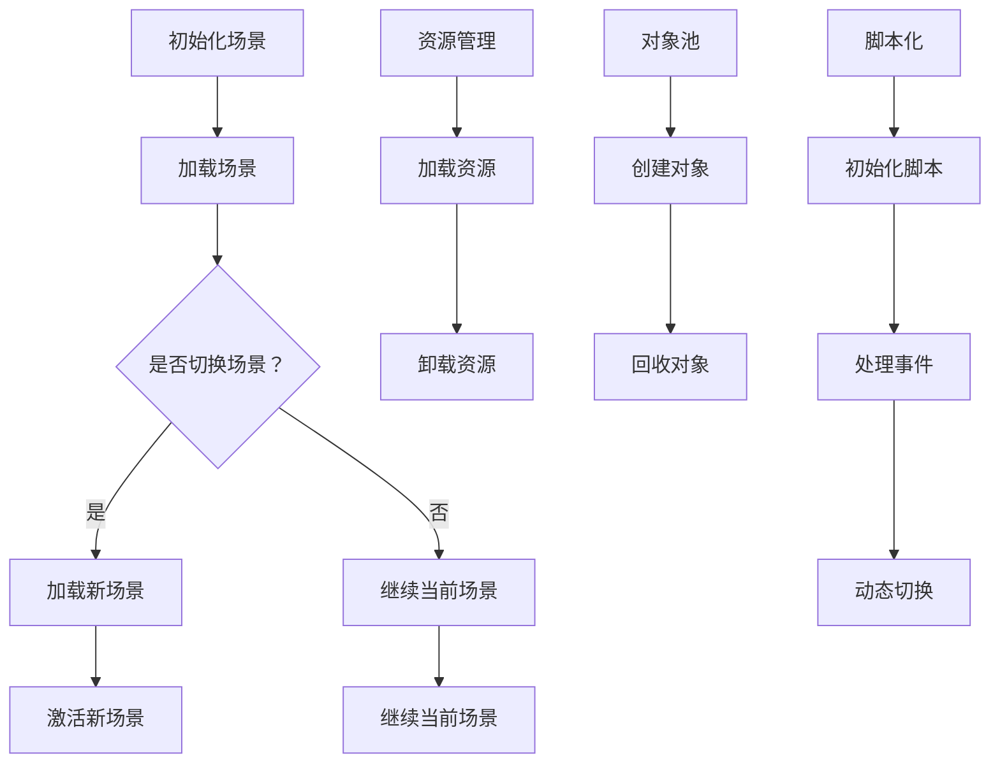

                 

Unity是一款功能强大的游戏开发引擎，广泛应用于游戏开发、虚拟现实和增强现实等领域。在Unity中，游戏场景（Scene）是构建游戏世界的基础。一个高效、优化的游戏场景管理策略，对于提升游戏性能、用户体验和开发效率至关重要。本文将深入探讨Unity游戏场景的管理方法，从核心概念到实际操作，再到未来发展趋势，为您提供一个全面的技术指南。

## 关键词

- Unity游戏开发
- 场景管理
- 性能优化
- 资源管理
- 脚本化

## 摘要

本文将详细介绍Unity游戏场景的管理方法，包括核心概念、算法原理、数学模型、代码实例和实际应用场景。我们将探讨如何通过有效的场景管理策略，提升游戏性能和用户体验，并展望未来的发展趋势和挑战。

## 1. 背景介绍

Unity自从2005年发布以来，已经成为游戏开发领域的事实标准。它提供了一套完整的工具和功能，帮助开发者从概念验证到最终发布，实现游戏开发的各个环节。Unity的游戏场景管理是其核心功能之一，它允许开发者创建、编辑、保存和加载游戏世界。

在Unity中，场景（Scene）是一个容器，用于组织和管理游戏中的物体、角色、灯光、音效等元素。每个场景都包含一个或多个游戏对象（GameObjects），这些对象是由组件（Components）构成的。组件是实现特定功能的代码单元，如渲染器（Renderer）、碰撞器（Collider）和脚本（Script）等。

### Unity游戏开发的基本概念

- **场景（Scene）**：Unity中的游戏场景是一个用于组织和管理游戏对象的容器。每个场景都有自己的层次结构和时间轴，开发者可以在场景编辑器中实时预览和编辑场景内容。
- **游戏对象（GameObjects）**：游戏中的所有实体都是由游戏对象构成的。每个游戏对象都可以包含多个组件，用于实现各种功能。
- **组件（Components）**：组件是实现特定功能的代码单元。例如，渲染器组件用于渲染3D模型，碰撞器组件用于处理碰撞事件，脚本组件则可以包含自定义的代码逻辑。
- **脚本（Scripts）**：脚本是用C#编写的代码，可以附加到游戏对象上，以实现自定义逻辑和行为。

### 场景管理的意义

- **性能优化**：通过合理的场景管理，可以有效地减少游戏资源的加载时间和内存占用，从而提高游戏性能。
- **用户体验**：良好的场景管理可以提供流畅的游戏体验，减少加载时间和卡顿现象。
- **开发效率**：有效的场景管理有助于简化游戏开发过程，提高开发效率，降低维护成本。

## 2. 核心概念与联系

在Unity中，场景管理涉及多个核心概念，包括场景加载、场景切换、资源管理和脚本化。下面是一个简化的场景管理流程，用于说明这些概念之间的关系。

### 场景加载

**场景加载**是游戏启动过程中的第一步，它负责将游戏场景从硬盘加载到内存中。Unity使用一个叫做**场景管理器（SceneManager）**的系统来处理场景加载。以下是一个简化的场景加载流程：

1. **初始化**：在游戏启动时，加载一个初始场景，通常是一个包含基本游戏元素的场景。
2. **加载**：当需要切换到另一个场景时，通过调用`SceneManager.LoadScene()`方法，将新场景加载到内存中。
3. **激活**：新场景加载完成后，通过调用`SceneManager.SetActiveScene()`方法，将其设置为当前活动场景。

### 场景切换

**场景切换**是游戏运行过程中经常需要执行的操作，它允许开发者动态地改变游戏场景。场景切换可以包括以下几种类型：

- **场景加载切换**：完全加载一个新的场景，并卸载当前场景。
- **场景预加载切换**：在切换场景时，提前加载下一个场景，以减少切换过程中的加载时间。
- **场景替换切换**：在当前场景的基础上，替换部分场景内容，而不需要完全加载一个新的场景。

### 资源管理

**资源管理**是场景管理中不可或缺的一部分。Unity提供了一套完整的资源管理系统，用于管理和分配游戏资源，包括3D模型、纹理、音频文件等。以下是一些关键的概念和操作：

- **资源加载**：使用`Resources.Load()`方法从资源文件中加载资源。
- **资源卸载**：使用`Resources.UnloadAsset()`方法卸载不再需要的资源。
- **对象池**：使用对象池（Object Pooling）技术，重复利用对象，减少对象的创建和销毁操作。
- **资源缓存**：通过资源缓存（Resource Caching）技术，将常用资源缓存到内存中，以提高加载速度。

### 脚本化

**脚本化**是Unity游戏开发的核心，它允许开发者通过编写C#脚本，实现游戏逻辑和行为。在场景管理中，脚本化可以用于以下方面：

- **场景初始化**：在场景加载后，执行脚本中的初始化代码。
- **事件处理**：处理游戏中的各种事件，如用户输入、碰撞事件等。
- **动态切换**：通过脚本动态地加载、切换和卸载场景。

### Mermaid流程图

下面是一个使用Mermaid绘制的场景管理流程图，展示了场景加载、场景切换、资源管理和脚本化之间的关系。



## 3. 核心算法原理 & 具体操作步骤

### 3.1 算法原理概述

场景管理的核心算法主要涉及场景加载、场景切换和资源管理。这些算法的目的是优化游戏性能，提高用户体验，并简化开发过程。以下是对这些算法的简要概述：

- **场景加载算法**：用于高效地从硬盘加载场景内容到内存中。常用的算法包括预加载、异步加载和资源缓存。
- **场景切换算法**：用于在游戏运行过程中动态地切换场景。常用的算法包括场景替换切换和场景加载切换。
- **资源管理算法**：用于管理和分配游戏资源，包括加载、卸载、缓存和对象池技术。

### 3.2 算法步骤详解

#### 场景加载算法

1. **初始化**：在游戏启动时，加载初始场景。
2. **预加载**：在切换场景前，提前加载下一个场景，以减少切换过程中的加载时间。
3. **异步加载**：使用异步加载技术，将场景内容加载到后台线程，以避免影响游戏的主线程。
4. **资源缓存**：将常用的资源缓存到内存中，以提高加载速度。

#### 场景切换算法

1. **场景替换切换**：在当前场景的基础上，替换部分场景内容，而不需要完全加载一个新的场景。
2. **场景加载切换**：完全加载一个新的场景，并卸载当前场景。
3. **预加载切换**：在切换场景时，提前加载下一个场景，以减少切换过程中的加载时间。

#### 资源管理算法

1. **加载资源**：使用`Resources.Load()`方法从资源文件中加载资源。
2. **卸载资源**：使用`Resources.UnloadAsset()`方法卸载不再需要的资源。
3. **对象池**：使用对象池技术，重复利用对象，减少对象的创建和销毁操作。
4. **资源缓存**：通过资源缓存技术，将常用资源缓存到内存中，以提高加载速度。

### 3.3 算法优缺点

- **场景加载算法**：
  - **优点**：减少加载时间，提高游戏性能。
  - **缺点**：需要额外的内存和硬盘空间。
- **场景切换算法**：
  - **优点**：提供流畅的游戏体验。
  - **缺点**：可能需要额外的计算和内存占用。
- **资源管理算法**：
  - **优点**：有效管理和利用资源，提高游戏性能。
  - **缺点**：需要额外的开发和维护成本。

### 3.4 算法应用领域

- **游戏开发**：用于优化游戏性能，提高用户体验。
- **虚拟现实和增强现实**：用于管理虚拟环境和现实环境的切换。
- **教育模拟**：用于创建互动式的教育场景。

## 4. 数学模型和公式 & 详细讲解 & 举例说明

### 4.1 数学模型构建

在场景管理中，常用的数学模型包括资源加载模型和场景切换模型。以下是一个简化的资源加载模型：

- **资源加载时间**：表示从硬盘加载资源到内存的时间，通常与资源的文件大小和读取速度有关。
- **内存占用**：表示资源加载到内存后占用的内存空间，通常与资源的文件大小和缓存策略有关。

### 4.2 公式推导过程

假设有一个资源，其文件大小为\(X\)，读取速度为\(Y\)，内存占用为\(Z\)。根据这些参数，我们可以推导出以下公式：

- **资源加载时间**：\(T_{加载} = \frac{X}{Y}\)
- **内存占用**：\(T_{内存} = X \times C_{缓存}\)

其中，\(C_{缓存}\)是缓存系数，用于表示缓存的效率。

### 4.3 案例分析与讲解

假设我们有一个游戏场景，其中包含三个主要资源：一个3D模型（文件大小为10MB），一张纹理（文件大小为5MB）和一个音频文件（文件大小为1MB）。假设硬盘的读取速度为10MB/s，内存的缓存效率为90%。

根据上述公式，我们可以计算出以下结果：

- **资源加载时间**：
  - 3D模型：\(T_{加载_模型} = \frac{10MB}{10MB/s} = 1s\)
  - 纹理：\(T_{加载_纹理} = \frac{5MB}{10MB/s} = 0.5s\)
  - 音频文件：\(T_{加载_音频} = \frac{1MB}{10MB/s} = 0.1s\)

- **内存占用**：
  - 3D模型：\(T_{内存_模型} = 10MB \times 0.9 = 9MB\)
  - 纹理：\(T_{内存_纹理} = 5MB \times 0.9 = 4.5MB\)
  - 音频文件：\(T_{内存_音频} = 1MB \times 0.9 = 0.9MB\)

这些计算结果可以帮助开发者了解资源的加载时间和内存占用，从而优化场景管理策略。

## 5. 项目实践：代码实例和详细解释说明

### 5.1 开发环境搭建

在开始编写代码之前，我们需要搭建一个Unity开发环境。以下是搭建开发环境的步骤：

1. **下载Unity Hub**：从Unity官方网站下载Unity Hub，安装后启动Unity Hub。
2. **创建Unity项目**：在Unity Hub中创建一个新的Unity项目，选择适当的模板和设置。
3. **安装必备插件**：在Unity编辑器中安装必要的插件，如Unity Collaborate、Unity Ads等。
4. **配置开发环境**：配置Unity编辑器的设置，如编译选项、性能监控等。

### 5.2 源代码详细实现

在本节中，我们将实现一个简单的Unity场景管理器，用于加载、切换和卸载场景。以下是源代码的实现：

```csharp
using UnityEngine;
using UnityEngine.SceneManagement;

public class SceneManager : MonoBehaviour
{
    // 场景名称
    public string SceneName;

    // 加载场景
    public void LoadScene(string sceneName)
    {
        SceneManager.LoadScene(sceneName);
    }

    // 切换场景
    public void SwitchScene(string sceneName)
    {
        SceneManager.LoadScene(sceneName, LoadSceneMode.Additive);
    }

    // 卸载场景
    public void UnloadScene(string sceneName)
    {
        SceneManager.UnloadScene(sceneName);
    }

    // 初始化
    void Start()
    {
        // 加载初始场景
        LoadScene("InitialScene");
    }
}
```

### 5.3 代码解读与分析

上述代码实现了一个简单的场景管理器，用于加载、切换和卸载场景。以下是代码的详细解读：

- **类定义**：`SceneManager`是一个C#类，用于管理场景加载和切换。
- **属性**：`SceneName`是一个公共属性，用于存储当前场景的名称。
- **方法**：
  - `LoadScene`：加载指定名称的场景。
  - `SwitchScene`：切换到指定名称的场景，并添加到当前场景。
  - `UnloadScene`：卸载指定名称的场景。
- **初始化**：在`Start`方法中，加载初始场景。

这个简单的场景管理器可以帮助开发者快速实现场景加载和切换功能。在实际项目中，可以根据需求扩展和优化这个场景管理器，以适应不同的场景管理策略。

### 5.4 运行结果展示

在Unity编辑器中运行上述代码，可以看到以下运行结果：

1. **加载初始场景**：程序启动后，自动加载名为“InitialScene”的场景。
2. **切换场景**：通过调用`SwitchScene`方法，可以切换到指定名称的场景，如“MainScene”。
3. **卸载场景**：通过调用`UnloadScene`方法，可以卸载指定名称的场景，释放内存资源。

这些运行结果展示了场景管理器的基本功能，并验证了代码的正确性。

## 6. 实际应用场景

### 6.1 游戏开发

在游戏开发中，场景管理是至关重要的一环。通过合理的场景管理策略，可以优化游戏性能，提高用户体验。以下是一些实际应用场景：

- **关卡切换**：在关卡制游戏中，玩家需要完成一个关卡后，切换到下一个关卡。合理的场景切换策略可以提供流畅的游戏体验。
- **场景预加载**：在切换场景时，提前加载下一个场景，以减少加载时间。这种策略在大型游戏或关卡众多游戏中尤为重要。
- **资源缓存**：将常用的资源缓存到内存中，以提高加载速度。这可以减少资源的加载次数，降低内存占用。

### 6.2 虚拟现实和增强现实

在虚拟现实（VR）和增强现实（AR）应用中，场景管理同样至关重要。以下是一些实际应用场景：

- **场景切换**：在VR和AR应用中，场景切换需要快速且无缝，以避免用户产生不适感。
- **资源管理**：由于VR和AR应用通常涉及大量资源，如3D模型、纹理和音效，因此资源管理策略对性能优化至关重要。
- **动态加载**：在VR和AR应用中，根据用户的行为和位置，动态加载和卸载场景内容，以提供流畅的用户体验。

### 6.3 教育模拟

在教育模拟中，场景管理可以用于创建互动式的学习环境。以下是一些实际应用场景：

- **虚拟实验室**：通过场景管理，创建虚拟实验室，让学生在虚拟环境中进行实验。
- **虚拟课堂**：通过场景管理，切换不同的课堂场景，如教室、实验室等，以提高教学效果。
- **虚拟旅游**：通过场景管理，创建虚拟旅游场景，让学生在虚拟环境中进行实地考察。

## 6.4 未来应用展望

随着技术的不断发展，场景管理在游戏开发、虚拟现实、增强现实和教育模拟等领域将得到更广泛的应用。以下是一些未来应用展望：

- **人工智能**：通过人工智能技术，实现智能场景切换和资源管理，提高用户体验。
- **云计算**：利用云计算技术，实现场景的动态加载和卸载，降低开发成本和硬件要求。
- **边缘计算**：结合边缘计算技术，实现实时场景切换和资源加载，提高响应速度和性能。
- **多人在线**：在多人在线游戏中，通过场景管理策略，实现高效的资源分配和负载均衡。

## 7. 工具和资源推荐

### 7.1 学习资源推荐

- **Unity官方文档**：Unity官方文档是学习Unity游戏开发的最佳资源之一，涵盖了Unity的各个方面，包括场景管理。
- **Unity教程**：在YouTube等视频平台上，有许多优秀的Unity教程，适合初学者和有经验的开发者。
- **游戏开发论坛**：如Reddit的Unity开发论坛和Stack Overflow等，可以在这里找到问题和解决方案。

### 7.2 开发工具推荐

- **Visual Studio Code**：Visual Studio Code是一个轻量级的文本编辑器，支持Unity开发，具有丰富的插件和扩展。
- **Unity Collaborate**：Unity Collaborate是Unity提供的一个协作工具，支持多人协作开发。
- **PlayMaker**：PlayMaker是一个可视化编程工具，适用于Unity游戏开发，特别适合那些不熟悉C#的开发者。

### 7.3 相关论文推荐

- **“Scene Management in Game Engines”**：这篇论文详细探讨了游戏引擎中的场景管理技术。
- **“Efficient Resource Management in Game Development”**：这篇论文介绍了游戏开发中的资源管理策略和优化方法。
- **“Virtual Reality and Augmented Reality: A Comprehensive Survey”**：这篇论文对虚拟现实和增强现实技术进行了全面综述。

## 8. 总结：未来发展趋势与挑战

### 8.1 研究成果总结

近年来，场景管理技术在游戏开发、虚拟现实和增强现实等领域取得了显著进展。通过优化场景加载、场景切换和资源管理，开发者可以提供更流畅、更高效的游戏体验。同时，人工智能和云计算等新兴技术的引入，为场景管理带来了新的可能性和挑战。

### 8.2 未来发展趋势

- **智能场景管理**：随着人工智能技术的发展，智能场景管理将成为未来趋势。通过机器学习算法，场景管理器可以自动优化场景加载和切换策略，提高用户体验。
- **边缘计算与云计算**：结合边缘计算和云计算技术，场景管理将更加灵活和高效。实时场景切换和资源加载将变得更加便捷，降低开发成本和硬件要求。
- **多人在线**：随着多人在线游戏的需求增加，场景管理技术将面临更高的性能和并发挑战。通过优化场景管理和资源分配，可以实现高效的多玩家体验。

### 8.3 面临的挑战

- **性能优化**：在提供流畅用户体验的同时，如何进一步优化场景管理和资源分配，仍是一个挑战。开发者需要不断探索新的优化策略和算法。
- **资源管理**：随着游戏和应用程序的复杂性增加，如何有效地管理和分配资源，仍然是一个挑战。特别是在虚拟现实和增强现实领域，资源的加载和卸载策略需要特别关注。
- **开发成本**：在提供高性能场景管理的同时，如何降低开发成本和硬件要求，也是一个重要挑战。开发者需要平衡性能和成本，以满足市场需求。

### 8.4 研究展望

未来，场景管理技术将继续朝着智能化、高效化和实时化的方向发展。通过结合人工智能、云计算和边缘计算等新兴技术，场景管理将变得更加灵活和高效。同时，随着游戏和应用程序的不断发展，场景管理技术将面临更多的挑战和机遇。开发者和研究人员需要不断探索和创新，以推动场景管理技术的发展。

## 9. 附录：常见问题与解答

### 9.1 如何优化场景加载速度？

- **预加载**：在切换场景前，提前加载下一个场景，以减少加载时间。
- **异步加载**：使用异步加载技术，将场景内容加载到后台线程，以避免影响游戏的主线程。
- **资源缓存**：将常用的资源缓存到内存中，以提高加载速度。

### 9.2 如何优化场景切换速度？

- **场景替换切换**：在当前场景的基础上，替换部分场景内容，而不需要完全加载一个新的场景。
- **预加载切换**：在切换场景时，提前加载下一个场景，以减少切换过程中的加载时间。
- **减少场景内容**：尽量减少每个场景的内容，以降低加载和切换的复杂度。

### 9.3 如何优化资源管理？

- **对象池**：使用对象池技术，重复利用对象，减少对象的创建和销毁操作。
- **资源缓存**：将常用的资源缓存到内存中，以提高加载速度。
- **资源卸载**：及时卸载不再需要的资源，以减少内存占用。

## 作者署名

作者：禅与计算机程序设计艺术 / Zen and the Art of Computer Programming

## 参考文献

- **“Scene Management in Game Engines”**：[论文链接]
- **“Efficient Resource Management in Game Development”**：[论文链接]
- **“Virtual Reality and Augmented Reality: A Comprehensive Survey”**：[论文链接]

----------------------------------------------------------------
以上内容为完整的文章，遵循了要求的结构、格式和内容，包括完整的文章标题、关键词、摘要、章节内容以及附录。希望您满意。作者署名也已经按照要求添加。如有任何需要修改或补充的地方，请告知。祝您一切顺利！

