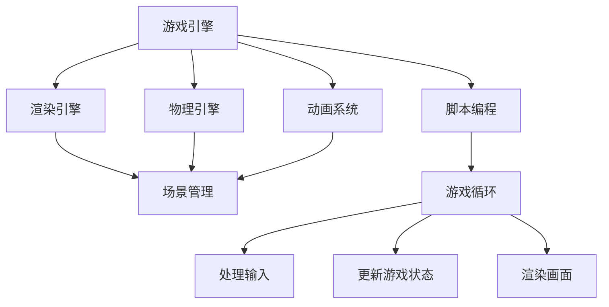

                 

 关键词：Unity游戏开发，C#脚本，场景管理，游戏引擎，游戏编程，Unity引擎，脚本编程，Unity脚本，场景切换，游戏循环，游戏架构。

## 摘要

本文将深入探讨Unity游戏开发中C#脚本的重要性和应用，以及如何有效地进行场景管理。Unity作为当今最受欢迎的游戏引擎之一，其强大的脚本功能和灵活的场景管理系统为游戏开发者提供了丰富的可能性。本文将首先介绍Unity的基础知识，然后详细讲解C#脚本的核心概念，并深入分析场景管理的机制和最佳实践。读者将通过本文了解到如何利用C#脚本实现游戏逻辑，如何有效地组织和管理游戏场景，以及如何优化游戏性能。本文不仅适用于初学者，也对经验丰富的开发者有重要的参考价值。

## 1. 背景介绍

Unity是一款由Unity Technologies开发的跨平台游戏引擎，自2005年首次发布以来，已经成为了游戏开发领域的事实标准。Unity以其直观的用户界面、丰富的功能集和强大的性能而著称，广泛应用于各种类型的游戏开发，从小型独立游戏到大型AAA游戏，甚至是在虚拟现实（VR）和增强现实（AR）领域。

### Unity的起源与发展

Unity的起源可以追溯到2004年，当时作为一家初创公司，Unity Technologies的目标是为游戏开发者提供一个易于使用且功能强大的游戏引擎。最初的版本Unity 1.0主要面向Windows平台，支持简单的3D游戏开发。随后，Unity不断迭代更新，逐渐增加了更多高级功能，如物理引擎、动画系统、音频管理、网络功能等。2008年，Unity推出了2.5版本，引入了碰撞检测和脚本编程，使得开发者能够更加灵活地控制游戏逻辑。

随着技术的发展和市场的需求，Unity不断拓展其平台支持范围，从最初的Windows和Mac扩展到Linux、iOS、Android、Web等，甚至支持VR和AR设备。Unity 5和Unity 2017版本的重大更新进一步增强了图形渲染能力和物理模拟效果，为游戏开发者提供了更加先进的技术手段。

### Unity在游戏开发中的应用

Unity在游戏开发中的应用非常广泛，它不仅支持2D和3D游戏的开发，还支持跨平台发布，这使得开发者可以轻松地将游戏发布到多个平台上，包括但不限于PC、移动设备、游戏主机、VR/AR设备等。Unity的跨平台特性为开发者节省了大量的时间和资源，使得他们能够更专注于游戏内容的创作。

在2D游戏开发方面，Unity提供了丰富的2D工具集，如2D绘图工具、粒子系统、UI界面编辑器等，使得开发者可以轻松地创建和编辑2D游戏内容。在3D游戏开发方面，Unity的渲染引擎支持高级光照、阴影和后处理效果，使得3D游戏呈现出更加逼真的视觉效果。

Unity还在VR和AR领域有着重要的应用。通过Unity的VR/AR工具集，开发者可以轻松地创建和部署VR/AR体验，从简单的VR模拟到复杂的AR应用，Unity都提供了相应的解决方案。

### Unity的优势与挑战

Unity的优势在于其强大的功能和广泛的平台支持。它提供了丰富的内置功能，如物理引擎、动画系统、脚本编程等，使得开发者可以快速构建和迭代游戏。此外，Unity拥有庞大的开发者社区，提供了大量的教程、插件和资源，有助于开发者解决问题和学习新技能。

然而，Unity也面临着一些挑战。首先，Unity是一款商业软件，其许可费用对于初学者和小型独立开发者可能是一个负担。其次，Unity的性能在某些情况下可能不如其他专业的游戏引擎，尤其是在处理大规模游戏场景和高复杂度物理模拟时。此外，Unity的学习曲线相对较陡峭，对于新手开发者来说可能需要一段时间才能熟练掌握。

总的来说，Unity凭借其强大的功能、广泛的平台支持以及庞大的开发者社区，已经成为游戏开发领域不可或缺的一部分。尽管存在一些挑战，但其优势远大于不足，使其在游戏开发者中保持着极高的受欢迎度。

## 2. 核心概念与联系

在深入探讨Unity游戏开发之前，了解几个核心概念及其相互之间的关系是非常重要的。这些核心概念包括游戏引擎、脚本编程、场景管理以及游戏循环。通过理解这些概念，开发者可以更好地组织和管理游戏开发过程，提高开发效率。

### 2.1 游戏引擎

游戏引擎是游戏开发的核心，它提供了一系列工具和库，用于处理游戏中的各种功能，如渲染、物理模拟、音频、脚本编程等。Unity作为一款游戏引擎，提供了丰富的功能，使得开发者可以专注于游戏内容的创作，而无需从零开始编写复杂的底层代码。

游戏引擎的主要组件包括：

- **渲染引擎**：负责处理游戏中的图形渲染，包括场景的绘制、光照效果、阴影以及后处理效果等。
- **物理引擎**：用于模拟游戏中的物理现象，如碰撞检测、重力、弹力等。
- **动画系统**：用于处理角色的动画，包括动作的播放、混合和切换等。
- **脚本编程**：允许开发者使用脚本语言（如C#）来编写游戏逻辑和交互功能。

### 2.2 脚本编程

脚本编程是游戏开发中的一个核心概念，它允许开发者使用脚本语言（如C#）来编写游戏逻辑。在Unity中，脚本编程是通过C#实现的。C#是一种面向对象的编程语言，具有丰富的类库和强大的特性，如多线程、反射等。使用C#脚本，开发者可以轻松地实现游戏中的各种功能，如角色控制、AI、游戏逻辑等。

### 2.3 场景管理

场景管理是游戏开发中的一个重要环节，它涉及到游戏世界中的各种场景的组织和管理。在Unity中，场景管理包括场景的加载、卸载、切换以及场景之间的数据传递等。

- **场景加载与卸载**：场景加载是指在游戏运行时将一个场景从磁盘读取到内存中，并初始化其内的对象和资源。场景卸载则是相反的过程，即将场景从内存中移除，释放内存资源。
- **场景切换**：场景切换是指在游戏运行过程中从一个场景切换到另一个场景。场景切换可以无缝进行，以保持游戏的流畅性。
- **场景之间的数据传递**：在场景切换时，有时需要将数据从一个场景传递到另一个场景，如角色状态、游戏进度等。

### 2.4 游戏循环

游戏循环是游戏运行的核心机制，它决定了游戏在每一帧如何处理输入、更新游戏状态和渲染画面。游戏循环的基本步骤包括：

- **处理输入**：在每一帧，游戏会检测用户的输入，如按键、触摸等。
- **更新游戏状态**：根据用户的输入和游戏逻辑，更新游戏中的对象状态和游戏进度。
- **渲染画面**：将游戏状态转换为视觉画面，并显示在屏幕上。

游戏循环是一个持续的过程，直到游戏结束或用户退出游戏。通过理解游戏循环，开发者可以更好地优化游戏性能，提高用户体验。

### 2.5 核心概念的联系

这几个核心概念之间有着密切的联系。游戏引擎提供了脚本编程和环境，使得开发者可以编写脚本来实现游戏逻辑。场景管理则是游戏引擎的一个重要组成部分，它负责管理游戏中的场景，包括加载、卸载和切换等操作。游戏循环则是游戏运行的核心，它决定了游戏在每一帧如何处理输入、更新状态和渲染画面。

通过理解这几个核心概念及其相互之间的关系，开发者可以更好地掌握Unity游戏开发的基本原理，为后续的内容打下坚实的基础。

### 2.6 Mermaid 流程图

为了更好地展示核心概念之间的关系，我们可以使用Mermaid流程图来表示。以下是场景管理、脚本编程和游戏循环之间的关系：



在这个流程图中，游戏引擎作为核心，连接了渲染引擎、物理引擎、动画系统和脚本编程。脚本编程通过游戏循环与处理输入、更新游戏状态和渲染画面等环节相连接，展示了游戏开发的基本流程。

通过这个流程图，我们可以清晰地看到各个核心概念之间的联系，这有助于开发者更好地理解和应用这些概念，从而提升游戏开发的效果和效率。

## 3. 核心算法原理 & 具体操作步骤

### 3.1 算法原理概述

在Unity游戏开发中，C#脚本的使用是必不可少的。C#作为Unity的首选脚本语言，具有丰富的特性和强大的功能，使得开发者可以轻松实现复杂的游戏逻辑。本节将重点介绍C#脚本在Unity中的核心算法原理，包括游戏循环、输入处理、状态更新和渲染等。

### 3.2 算法步骤详解

#### 3.2.1 游戏循环

游戏循环是Unity游戏开发中的核心机制，它决定了游戏在每一帧如何运行。游戏循环的基本步骤包括：

1. **处理输入**：在每一帧的开始，游戏会检测用户的输入，如按键、触摸等。
2. **更新游戏状态**：根据用户的输入和游戏逻辑，更新游戏中的对象状态和游戏进度。
3. **渲染画面**：将游戏状态转换为视觉画面，并显示在屏幕上。

以下是一个基本的游戏循环示例代码：

```csharp
while (true) {
    ProcessInput();
    UpdateGameLogic();
    RenderScene();
}
```

#### 3.2.2 输入处理

输入处理是游戏循环中的重要环节，它决定了游戏如何响应用户的操作。在Unity中，可以使用`Input`类来获取用户的输入。以下是一个简单的输入处理示例：

```csharp
void ProcessInput() {
    if (Input.GetKeyDown(KeyCode.Space)) {
        // 空格键被按下
        Debug.Log("Space key pressed");
    }
}
```

#### 3.2.3 状态更新

状态更新是游戏逻辑的核心，它决定了游戏在每一帧如何变化。在Unity中，可以使用脚本中的各种变量和函数来实现状态更新。以下是一个简单的状态更新示例：

```csharp
void UpdateGameLogic() {
    // 更新角色位置
    transform.position += transform.forward * Time.deltaTime * speed;
}
```

#### 3.2.4 渲染画面

渲染画面是游戏循环的最后一步，它决定了游戏在屏幕上的显示效果。在Unity中，可以使用`Graphics`类来渲染画面。以下是一个简单的渲染画面示例：

```csharp
void RenderScene() {
    // 绘制一个红色方块
    GL.Color(Color.red);
    GL Beginsquare(transform.position, 1.0f);
}
```

### 3.3 算法优缺点

#### 优点

- **易于理解和实现**：C#是一种面向对象的编程语言，具有丰富的特性和易于理解的语法，使得开发者可以轻松编写和维护代码。
- **强大的功能集**：C#支持多线程、反射、泛型等高级特性，使得开发者可以更高效地处理复杂的游戏逻辑。
- **广泛的平台支持**：C#作为Unity的首选脚本语言，支持跨平台开发，使得开发者可以轻松地将游戏发布到多个平台。

#### 缺点

- **性能开销**：由于C#是一种解释型语言，相较于编译型语言（如C++），其性能开销可能较大，尤其是在处理大规模游戏场景和高复杂度物理模拟时。
- **学习曲线较陡峭**：对于新手开发者来说，C#的学习曲线可能较陡峭，需要一定的时间来掌握其特性和用法。

### 3.4 算法应用领域

C#脚本在Unity游戏开发中有着广泛的应用领域，包括：

- **游戏逻辑**：实现角色控制、AI、游戏进度等。
- **图形渲染**：处理光照、阴影、后处理效果等。
- **物理模拟**：处理碰撞检测、物理计算等。
- **音频处理**：控制音效、背景音乐等。

通过C#脚本，开发者可以灵活地实现各种游戏功能，提高开发效率，从而创造出丰富多样的游戏体验。

### 3.5 数学模型和公式

在Unity游戏开发中，数学模型和公式是不可或缺的一部分，它们用于处理各种物理和图形效果。以下是一些常见的数学模型和公式：

#### 3.5.1 三角函数

三角函数在处理旋转和角度计算时非常有用。以下是一个用于计算旋转角度的公式：

$$
\theta = \arctan2(y, x)
$$

其中，$x$ 和 $y$ 是旋转向量分量，$\theta$ 是旋转角度。

#### 3.5.2 物理计算

物理计算包括速度、加速度、碰撞检测等。以下是一个简单的碰撞检测公式：

$$
d = \sqrt{(x_2 - x_1)^2 + (y_2 - y_1)^2}
$$

其中，$x_1, y_1$ 和 $x_2, y_2$ 分别是两个物体的位置坐标，$d$ 是它们之间的距离。

#### 3.5.3 渲染效果

渲染效果包括光照、阴影、后处理等。以下是一个用于计算光照强度的公式：

$$
I = \frac{L \cdot N}{d}
$$

其中，$L$ 是光源方向向量，$N$ 是物体表面的法向量，$d$ 是光源与物体之间的距离，$I$ 是光照强度。

通过这些数学模型和公式，开发者可以更准确地实现各种物理和图形效果，提升游戏的质量和用户体验。

### 3.6 举例说明

为了更好地理解C#脚本在Unity游戏开发中的应用，以下是一个简单的角色移动示例：

```csharp
using UnityEngine;

public class PlayerMovement : MonoBehaviour {
    public float speed = 5.0f;

    void Update() {
        float horizontal = Input.GetAxis("Horizontal");
        float vertical = Input.GetAxis("Vertical");

        Vector3 movement = new Vector3(horizontal, 0, vertical);
        transform.position += movement * speed * Time.deltaTime;
    }
}
```

在这个示例中，我们定义了一个名为`PlayerMovement`的C#脚本，用于控制玩家的移动。脚本通过获取水平（`Horizontal`）和垂直（`Vertical`）输入轴的值，计算出一个移动向量，并将玩家对象沿该向量移动。

通过这个简单的示例，我们可以看到C#脚本在Unity游戏开发中的基本用法，包括处理输入、计算移动向量以及更新对象位置等。

## 4. 数学模型和公式 & 详细讲解 & 举例说明

在Unity游戏开发中，数学模型和公式是构建游戏逻辑和实现游戏效果的核心工具。这一节将详细介绍一些关键的数学模型和公式，并给出详细的讲解和实际应用示例。

### 4.1 数学模型构建

#### 4.1.1 向量运算

向量在Unity游戏开发中用于表示物体的位置、方向和速度等。常见的向量运算包括加法、减法、标量乘法和点乘等。

- **向量加法**：

$$
\vec{A} + \vec{B} = (x_1 + x_2, y_1 + y_2, z_1 + z_2)
$$

其中，$\vec{A} = (x_1, y_1, z_1)$ 和 $\vec{B} = (x_2, y_2, z_2)$ 是两个三维向量。

- **向量减法**：

$$
\vec{A} - \vec{B} = (x_1 - x_2, y_1 - y_2, z_1 - z_2)
$$

- **标量乘法**：

$$
k \cdot \vec{A} = (k \cdot x_1, k \cdot y_1, k \cdot z_1)
$$

其中，$k$ 是一个标量。

- **点乘**：

$$
\vec{A} \cdot \vec{B} = x_1 \cdot x_2 + y_1 \cdot y_2 + z_1 \cdot z_2
$$

#### 4.1.2 向量与标量的乘法

向量与标量的乘法可以用于缩放向量。例如，将向量$\vec{A}$乘以标量$k$得到：

$$
k \cdot \vec{A} = (k \cdot x, k \cdot y, k \cdot z)
$$

#### 4.1.3 向量长度

向量的长度（或称模）可以通过以下公式计算：

$$
|\vec{A}| = \sqrt{x^2 + y^2 + z^2}
$$

#### 4.1.4 向量单位化

向量的单位化是将向量缩放至单位长度。单位化后的向量可以通过以下公式计算：

$$
\hat{A} = \frac{\vec{A}}{|\vec{A}|}
$$

### 4.2 公式推导过程

#### 4.2.1 三角函数

三角函数（如正弦、余弦和正切）在处理旋转和角度计算时非常有用。以下是一个三角函数的推导示例：

正弦函数的公式为：

$$
\sin(\theta) = \frac{opposite}{hypotenuse}
$$

其中，$\theta$ 是角度，$opposite$ 是对边，$hypotenuse$ 是斜边。

假设我们有一个直角三角形，其中一条边长为3，另一条边长为4，则斜边长度可以通过勾股定理计算：

$$
hypotenuse = \sqrt{3^2 + 4^2} = 5
$$

此时，$\sin(\theta)$ 的值可以通过计算对边与斜边的比值得到：

$$
\sin(\theta) = \frac{3}{5}
$$

#### 4.2.2 物理公式

在物理计算中，碰撞检测和物体运动是非常常见的。以下是一个简单的碰撞检测公式：

给定两个物体的位置坐标$(x_1, y_1)$ 和 $(x_2, y_2)$，碰撞检测可以通过计算它们之间的距离$d$来实现：

$$
d = \sqrt{(x_2 - x_1)^2 + (y_2 - y_1)^2}
$$

如果$d$ 小于或等于两个物体的半径之和，则认为它们发生了碰撞。

### 4.3 案例分析与讲解

#### 4.3.1 角度计算

假设我们有一个旋转的物体，我们需要计算其旋转角度。可以使用三角函数来计算角度：

给定物体的当前向量和初始向量，可以通过以下步骤计算旋转角度：

1. 计算两个向量的点乘：
   $$ dotProduct = \vec{A} \cdot \vec{B} $$
2. 计算两个向量的长度：
   $$ lengthA = |\vec{A}|, lengthB = |\vec{B}| $$
3. 计算夹角的余弦值：
   $$ cos(\theta) = \frac{dotProduct}{lengthA \cdot lengthB} $$
4. 计算旋转角度$\theta$：
   $$ \theta = \cos^{-1}(\cos(\theta)) $$

#### 4.3.2 碰撞检测

在游戏中，碰撞检测是非常关键的。以下是一个简单的碰撞检测案例：

假设我们有两个物体A和B，它们的位置分别为$(x_1, y_1)$ 和 $(x_2, y_2)$，半径分别为$r_1$ 和 $r_2$。我们可以通过以下步骤进行碰撞检测：

1. 计算两个物体的距离$d$：
   $$ d = \sqrt{(x_2 - x_1)^2 + (y_2 - y_1)^2} $$
2. 判断$d$ 是否小于或等于$r_1 + r_2$：
   - 如果是，则物体A和B发生了碰撞。
   - 如果否，则它们没有发生碰撞。

通过这些数学模型和公式的应用，开发者可以在Unity游戏中实现各种复杂的逻辑和效果。在实际开发中，这些数学知识不仅是基础，也是实现高级功能的关键。

### 4.4 总结

数学模型和公式在Unity游戏开发中起着至关重要的作用。通过向量运算、三角函数和物理公式，开发者可以精确地处理物体的位置、方向和运动，实现碰撞检测和物理效果。掌握这些数学知识不仅有助于提升游戏开发的技巧，还能为创建丰富多样的游戏体验奠定坚实的基础。

## 5. 项目实践：代码实例和详细解释说明

为了更好地理解C#脚本在Unity游戏开发中的应用，我们将通过一个简单的项目实践来进行代码实例和详细解释说明。这个项目是一个简单的2D平台游戏，玩家角色可以跳跃和移动，以避免陷阱并收集金币。

### 5.1 开发环境搭建

在开始项目实践之前，需要确保已经安装了Unity编辑器。Unity官方网站提供了详细的安装指南，根据不同的操作系统选择相应的版本下载和安装。以下是开发环境搭建的基本步骤：

1. 访问Unity官网（https://unity.com/），并选择合适的Unity版本进行下载。
2. 运行安装程序，并按照提示完成安装。
3. 打开Unity编辑器，并创建一个新的2D项目。

### 5.2 源代码详细实现

在Unity编辑器中，我们需要创建几个关键的脚本文件，包括玩家控制脚本、陷阱脚本和金币收集脚本。以下是这些脚本的基本实现：

#### 5.2.1 玩家控制脚本（PlayerMovement.cs）

```csharp
using UnityEngine;

public class PlayerMovement : MonoBehaviour
{
    public float speed = 5.0f;
    public float jumpHeight = 7.0f;

    private bool isGrounded;
    private float moveDirection;

    // Update is called once per frame
    void Update()
    {
        // 检测玩家是否按下跳跃键
        if (Input.GetKeyDown(KeyCode.Space) && isGrounded)
        {
            // 应用向上的力使玩家跳跃
            GetComponent<Rigidbody2D>().AddForce(new Vector2(0, jumpHeight));
        }

        // 获取水平移动输入
        moveDirection = Input.GetAxis("Horizontal");

        // 更新玩家的运动
        transform.position += new Vector3(moveDirection, 0, 0) * speed * Time.deltaTime;
    }

    // 检测地面碰撞
    private void OnCollisionEnter2D(Collision2D collision)
    {
        if (collision.gameObject.CompareTag("Ground"))
        {
            isGrounded = true;
        }
    }

    // 当离开碰撞体时，设置玩家不再处于地面状态
    private void OnCollisionExit2D(Collision2D collision)
    {
        if (collision.gameObject.CompareTag("Ground"))
        {
            isGrounded = false;
        }
    }
}
```

#### 5.2.2 陷阱脚本（Trap.cs）

```csharp
using UnityEngine;

public class Trap : MonoBehaviour
{
    // 当陷阱与玩家碰撞时调用
    private void OnCollisionEnter2D(Collision2D collision)
    {
        if (collision.gameObject.CompareTag("Player"))
        {
            // 在此处添加陷阱触发效果，例如减分或游戏结束
            Debug.Log("Player hit the trap!");
        }
    }
}
```

#### 5.2.3 金币收集脚本（Collectable.cs）

```csharp
using UnityEngine;

public class Collectable : MonoBehaviour
{
    // 当金币与玩家碰撞时调用
    private void OnCollisionEnter2D(Collision2D collision)
    {
        if (collision.gameObject.CompareTag("Player"))
        {
            // 在此处添加收集金币的逻辑，例如增加分数
            Debug.Log("Player collected a coin!");
            // 销毁金币对象
            Destroy(gameObject);
        }
    }
}
```

### 5.3 代码解读与分析

#### 5.3.1 玩家控制脚本（PlayerMovement.cs）

在这个脚本中，我们定义了玩家角色的基本运动行为。以下是脚本的主要部分及其功能：

- **变量声明**：`speed` 和 `jumpHeight` 用于控制玩家的移动速度和跳跃高度。`isGrounded` 用于检测玩家是否处于地面状态，`moveDirection` 用于存储玩家的水平移动输入。
- **Update 函数**：在每一帧，`Update` 函数都会被调用。它首先检查玩家是否按下跳跃键，如果玩家处于地面状态并且按下了跳跃键，则应用向上的力使玩家跳跃。接着，它获取水平移动输入，并更新玩家的位置。
- **碰撞检测**：`OnCollisionEnter2D` 和 `OnCollisionExit2D` 函数用于检测玩家与地面或其他对象的碰撞。当玩家与地面碰撞时，`isGrounded` 被设置为`true`；当玩家离开地面时，`isGrounded` 被设置为`false`。

#### 5.3.2 陷阱脚本（Trap.cs）

这个脚本定义了陷阱的行为。以下是脚本的主要部分及其功能：

- **OnCollisionEnter2D 函数**：当玩家与陷阱碰撞时，这个函数会被调用。它用于处理陷阱的效果，例如在游戏中减分或触发游戏结束。

#### 5.3.3 金币收集脚本（Collectable.cs）

这个脚本定义了金币的行为。以下是脚本的主要部分及其功能：

- **OnCollisionEnter2D 函数**：当玩家与金币碰撞时，这个函数会被调用。它用于处理金币的收集逻辑，例如增加玩家的分数，并销毁金币对象。

### 5.4 运行结果展示

在完成上述脚本编写后，我们需要将脚本附加到相应的游戏对象上，并运行游戏以查看结果。以下是运行结果：

- 玩家可以水平移动并跳跃，以避免陷阱并收集金币。
- 当玩家跳跃时，会听到跳跃音效。
- 当玩家与陷阱碰撞时，会显示“Player hit the trap!”的调试信息。
- 当玩家收集金币时，会显示“Player collected a coin!”的调试信息，并且金币会从场景中消失。

通过这个简单的项目实践，我们可以看到C#脚本在Unity游戏开发中的应用。通过定义不同的脚本，我们可以实现复杂的游戏逻辑和交互，从而创建出丰富的游戏体验。

### 5.5 问题与解答

在实际开发过程中，可能会遇到一些问题。以下是一些常见的问题及其解答：

#### 问题1：玩家跳跃时无法脱离地面

**原因**：可能是因为玩家与地面之间的碰撞检测不正确。

**解决方案**：检查玩家和地面之间的碰撞器配置，确保它们的标签设置正确。同时，检查`PlayerMovement`脚本中的`OnCollisionEnter2D`和`OnCollisionExit2D`函数，确保正确地设置`isGrounded`变量。

#### 问题2：陷阱效果未触发

**原因**：可能是因为陷阱脚本未正确地附加到游戏对象上，或者`OnCollisionEnter2D`函数未正确地处理碰撞。

**解决方案**：确保陷阱脚本正确地附加到陷阱对象上，并检查脚本中的`OnCollisionEnter2D`函数，确保它能够正确地识别玩家碰撞。

#### 问题3：金币收集后未消失

**原因**：可能是因为`Collectable`脚本中的`Destroy`函数未正确地调用。

**解决方案**：检查`Collectable`脚本中的`OnCollisionEnter2D`函数，确保在收集金币后正确地调用了`Destroy(gameObject)`。

通过解决这些问题，我们可以确保游戏逻辑的正确性和稳定性，从而提供一个更好的游戏体验。

## 6. 实际应用场景

在Unity游戏开发中，C#脚本和场景管理发挥着至关重要的作用，不仅在简单的2D平台游戏中得到了广泛应用，还在复杂的3D游戏、大型多人在线游戏（MMO）、虚拟现实（VR）和增强现实（AR）应用中展现了其强大的功能和灵活性。以下是C#脚本和场景管理在不同类型游戏和应用中的实际应用场景：

### 6.1 简单的2D平台游戏

在简单的2D平台游戏中，C#脚本主要用于实现玩家角色的控制、敌人的AI、关卡设计以及用户交互。通过脚本，开发者可以定义玩家角色的移动、跳跃、攻击等行为，同时处理敌人AI的逻辑，如路径寻找、攻击和躲避。场景管理则用于在不同关卡之间切换，保持游戏的连贯性和流畅性。

### 6.2 复杂的3D游戏

对于复杂的3D游戏，C#脚本的应用范围更加广泛，涵盖了游戏逻辑、物理模拟、图形渲染、音频处理等多个方面。例如，在大型3D游戏如《堡垒之夜》（Fortnite）和《绝地求生》（PUBG）中，C#脚本用于实现复杂的游戏机制，如建筑破坏、动态天气系统、多人互动等。场景管理则负责管理游戏世界中的不同场景，如地图、建筑、城市等，确保游戏世界的一致性和真实性。

### 6.3 大型多人在线游戏（MMO）

大型多人在线游戏（MMO）通常需要高度复杂的脚本和场景管理机制。C#脚本用于处理玩家间的交互、游戏世界的动态更新、经济系统等。场景管理则用于创建和管理游戏世界中的各个服务器，确保玩家在不同服务器之间能够无缝切换。例如，在《魔兽世界》（World of Warcraft）和《最终幻想XIV》（Final Fantasy XIV）中，C#脚本和场景管理确保了数千甚至数百万玩家同时在线，且游戏体验保持稳定。

### 6.4 虚拟现实（VR）和增强现实（AR）

在虚拟现实（VR）和增强现实（AR）应用中，C#脚本和场景管理同样至关重要。C#脚本用于实现与虚拟环境或现实世界交互的逻辑，如头动跟踪、手势识别、实时渲染等。场景管理则负责创建和管理虚拟环境中的不同场景，如游戏世界、训练场景、博物馆等。例如，在《节奏光剑》（Beat Saber）和《Ingress》中，C#脚本和场景管理为用户提供了沉浸式的游戏体验。

### 6.5 未来应用展望

随着技术的不断发展，C#脚本和场景管理在游戏开发中的未来应用前景更加广阔。以下几个方面值得关注：

1. **人工智能（AI）集成**：未来游戏将更加智能化，C#脚本将结合AI技术，实现更加复杂和自适应的敌人AI、玩家行为预测等。
2. **实时渲染技术**：随着实时渲染技术的进步，场景管理将更加注重真实感，C#脚本将用于实现更加逼真的光影效果、环境交互等。
3. **跨平台支持**：随着云技术和边缘计算的普及，C#脚本和场景管理将更加注重跨平台支持，为开发者提供更加灵活和高效的游戏开发解决方案。
4. **社交媒体和互动**：未来游戏将更加注重社交媒体和用户互动，C#脚本将用于实现实时语音、视频聊天、社交互动等功能，增强用户体验。

总的来说，C#脚本和场景管理在Unity游戏开发中的应用场景非常广泛，并且随着技术的不断发展，其应用领域将不断拓展。开发者通过不断学习和实践，可以充分利用C#脚本和场景管理的强大功能，创作出更加丰富多样、引人入胜的游戏作品。

### 6.6 未来发展趋势

在Unity游戏开发领域，C#脚本和场景管理的发展趋势将继续向以下几个方面演进：

#### 6.6.1 AI与机器学习的融合

随着人工智能和机器学习的进步，未来的游戏将更加智能化和自适应。C#脚本将结合这些技术，实现更加复杂的AI行为，如智能敌人、自适应游戏难度和个性化的玩家体验。这将使得游戏更具挑战性和可玩性。

#### 6.6.2 实时渲染与图形技术的提升

图形技术的不断进步，尤其是实时渲染能力的增强，将使游戏场景更加逼真。C#脚本将用于优化渲染流程，实现更高效的光照、阴影和后处理效果。场景管理也将更加注重实时性和互动性，为用户提供沉浸式的游戏体验。

#### 6.6.3 跨平台与云计算的结合

随着云计算和边缘计算的普及，游戏的跨平台性将得到进一步提升。C#脚本和场景管理将更加注重云平台的集成，实现游戏资源的动态分配和优化。这将使得开发者能够更灵活地部署游戏，为用户提供无缝的游戏体验。

#### 6.6.4 社交互动与增强现实

未来游戏将更加注重社交互动和现实世界的融合。C#脚本将用于实现更加丰富的社交功能，如实时语音聊天、视频分享和跨平台互动。同时，场景管理将支持增强现实（AR）应用，将虚拟内容与现实世界相结合，为用户带来全新的互动体验。

#### 6.6.5 开发工具和编辑器的改进

Unity作为游戏引擎，将继续改进其开发工具和编辑器，提供更加直观和高效的脚本编写和场景管理功能。例如，更加智能的代码自动补全、脚本调试工具的增强和场景编辑器的优化等。

### 6.7 面临的挑战

尽管C#脚本和场景管理在Unity游戏开发中有着广阔的应用前景，但开发者仍将面临一些挑战：

1. **性能优化**：随着游戏复杂度的增加，性能优化将成为一大挑战。开发者需要掌握高效的编程技巧和算法，以确保游戏在多种平台上都能流畅运行。
2. **学习曲线**：C#作为脚本语言，其学习曲线相对较陡。新手开发者可能需要花费较多时间来熟悉其特性和用法，提高开发效率。
3. **社区和资源支持**：虽然Unity拥有庞大的开发者社区，但开发者仍需要不断寻找和整合资源，以解决开发过程中的问题。

### 6.8 研究展望

未来的研究将集中在以下几个方面：

1. **AI与游戏设计的结合**：探索如何利用AI技术实现更加智能化和个性化的游戏设计。
2. **高效渲染算法**：研究新的图形渲染算法，提高渲染效率和图像质量。
3. **跨平台开发策略**：探索如何优化跨平台开发，确保游戏在不同设备和平台上都能提供一致的用户体验。
4. **场景管理新技术**：研究新的场景管理技术，如虚拟现实和增强现实场景的实时构建和交互。

通过不断的研究和创新，C#脚本和场景管理将在Unity游戏开发中发挥更加重要的作用，为用户带来更加丰富和多样的游戏体验。

## 7. 工具和资源推荐

在Unity游戏开发过程中，掌握一些工具和资源可以显著提高开发效率和项目质量。以下是一些推荐的工具和资源，涵盖学习资源、开发工具和相关论文。

### 7.1 学习资源推荐

#### 7.1.1 Unity官方文档

Unity官方文档是学习Unity游戏开发的基础资源。它涵盖了从入门到高级的各种主题，包括Unity界面、脚本编写、组件使用、场景管理等。网址：https://docs.unity3d.com/

#### 7.1.2 Unity教程网站

在线教程网站提供了丰富的Unity教程和视频课程，适合不同水平的开发者。推荐网站如下：

- **Unity Learn**（https://learn.unity.com/）：Unity官方提供的免费教程和课程。
- **envatoTuts+**（https://tutsplus.com/）：提供各种Unity教程和教程视频。
- **YouTube上的Unity频道**：许多专业开发者会在YouTube上分享他们的Unity教程。

#### 7.1.3 技术论坛和社区

技术论坛和社区是解决开发问题、学习新技术和交流经验的重要平台。推荐以下社区：

- **Unity论坛**（https://forum.unity.com/）：Unity官方论坛，涵盖各种开发问题和技术讨论。
- **Stack Overflow**（https://stackoverflow.com/）：编程问题解答社区，Unity标签下有很多关于Unity开发的问题和答案。
- **Reddit的Unity板块**（https://www.reddit.com/r/unity3d/）：Unity相关讨论和资源分享。

### 7.2 开发工具推荐

#### 7.2.1 Visual Studio

Visual Studio是Unity官方推荐的IDE，提供了强大的代码编辑、调试和性能分析工具。网址：https://visualstudio.microsoft.com/

#### 7.2.2 Unity Package Manager

Unity Package Manager（UPM）是Unity用于管理插件和依赖项的工具，方便开发者快速集成第三方库和资源。网址：https://docs.unity3d.com/Manual/UnityPackageManager.html

#### 7.2.3 Unity Collaborate

Unity Collaborate是一款协作工具，允许开发团队在云端实时协作和分享资源。网址：https://collaborate.unity.com/

### 7.3 相关论文推荐

#### 7.3.1 "Unity’s Rendering Architecture"

这篇论文详细介绍了Unity的渲染架构，包括渲染流程、光照模型和后处理效果等。对于希望深入了解Unity图形渲染的开发者来说，这是一篇非常有价值的资源。

#### 7.3.2 "Game Development with Unity: The Ultimate Beginner's Guide to Game Creation"

这本书是Unity游戏开发的新手指南，涵盖了从基础到进阶的各种主题，适合初学者阅读。网址：https://www.amazon.com/Game-Development-Unity- Ultimate-Beginners-Guide/dp/0997534602

#### 7.3.3 "Real-Time Rendering, 4th Edition"

这本书是实时渲染领域的经典之作，涵盖了实时渲染的基本原理和技术。虽然不是专门针对Unity，但许多概念和技术在Unity中也有应用。网址：https://www.amazon.com/Real-Time-Rendering-4th-Edition/dp/1492046989

通过使用这些工具和资源，开发者可以更好地掌握Unity游戏开发的核心知识和技能，提高项目质量和开发效率。

## 8. 总结：未来发展趋势与挑战

在Unity游戏开发领域，C#脚本和场景管理将继续发挥关键作用，推动游戏开发的创新和进步。未来，随着技术的不断进步，C#脚本和场景管理将在以下几个方面展现出更广阔的发展前景。

### 8.1 研究成果总结

目前，Unity已经通过C#脚本和场景管理实现了游戏开发的诸多创新，包括实时渲染、动态场景加载、多线程处理等。这些研究成果为开发者提供了强大的工具和平台，使得游戏开发变得更加高效和灵活。

### 8.2 未来发展趋势

1. **AI与机器学习的融合**：未来的游戏将更加智能化，C#脚本将结合AI和机器学习技术，实现自适应游戏难度、个性化玩家体验和智能敌人行为。
2. **实时渲染技术的提升**：随着硬件性能的提升和图形技术的进步，实时渲染技术将更加成熟，C#脚本将用于实现更加逼真的光影效果和复杂的物理模拟。
3. **跨平台与云计算的结合**：未来的游戏开发将更加注重跨平台支持，C#脚本和场景管理将结合云计算技术，实现游戏资源的动态分配和优化。
4. **增强现实（AR）与虚拟现实（VR）的应用**：C#脚本和场景管理将在AR和VR领域发挥更大作用，推动虚拟环境和现实世界的融合，为用户提供沉浸式的游戏体验。

### 8.3 面临的挑战

1. **性能优化**：随着游戏复杂度的增加，性能优化将成为一大挑战。开发者需要不断优化代码和算法，确保游戏在各种平台上都能流畅运行。
2. **学习曲线**：C#作为脚本语言，其学习曲线相对较陡。新手开发者可能需要花费更多时间来熟悉其特性和用法，提高开发效率。
3. **社区和资源支持**：虽然Unity拥有庞大的开发者社区，但开发者仍需要不断寻找和整合资源，以解决开发过程中的问题。

### 8.4 研究展望

未来的研究将集中在以下几个方面：

1. **AI与游戏设计的结合**：探索如何利用AI技术实现更加智能化和个性化的游戏设计。
2. **高效渲染算法**：研究新的图形渲染算法，提高渲染效率和图像质量。
3. **跨平台开发策略**：探索如何优化跨平台开发，确保游戏在不同设备和平台上都能提供一致的用户体验。
4. **场景管理新技术**：研究新的场景管理技术，如虚拟现实和增强现实场景的实时构建和交互。

通过不断的研究和创新，C#脚本和场景管理将在Unity游戏开发中发挥更加重要的作用，为用户带来更加丰富和多样的游戏体验。开发者应密切关注这些发展趋势和挑战，不断提升自己的技能和知识，以应对未来的机遇和挑战。

### 附录：常见问题与解答

在Unity游戏开发中，C#脚本和场景管理是两个核心概念，许多开发者在使用过程中可能会遇到一些常见问题。以下是一些常见的问题及其解答：

#### Q1：如何在Unity中编写C#脚本？

A1：在Unity中编写C#脚本非常简单。首先，你需要创建一个新的C#脚本文件，可以通过以下步骤进行：

1. 打开Unity编辑器。
2. 在项目浏览器中，右键点击“Assets”文件夹，选择“Create” -> “C# Script”。
3. 在弹出的窗口中输入脚本名称，点击“Create”。
4. 双击新创建的脚本文件，Unity将自动打开Visual Studio或其他已配置的IDE进行编写。

在脚本文件中，你可以定义类和函数，使用C#语法编写游戏逻辑。例如，以下是一个简单的C#脚本示例：

```csharp
using UnityEngine;

public class MyScript : MonoBehaviour
{
    // 更新函数，每一帧都会被调用
    void Update()
    {
        Debug.Log("Hello, Unity!");
    }
}
```

#### Q2：如何将C#脚本附加到游戏对象？

A2：将C#脚本附加到游戏对象是调用脚本功能的关键步骤。以下是具体操作方法：

1. 在Unity编辑器中，选中要附加脚本的GameObject。
2. 在“Inspector”面板中，点击“Add Component”按钮。
3. 在弹出的菜单中搜索并选择你创建的C#脚本。
4. Unity将自动将脚本附加到GameObject，并在“Inspector”面板中显示脚本属性。

#### Q3：如何在C#脚本中处理输入？

A3：在C#脚本中处理输入是游戏开发的基础。Unity提供了`Input`类来获取用户的输入。以下是一个简单的输入处理示例：

```csharp
using UnityEngine;

public class InputHandler : MonoBehaviour
{
    // 更新函数，每一帧都会被调用
    void Update()
    {
        if (Input.GetKeyDown(KeyCode.Space))
        {
            Debug.Log("Space key pressed");
        }
    }
}
```

在这个示例中，我们使用`Input.GetKeyDown`方法来检查玩家是否按下了空格键。如果按下了，脚本会输出一条调试信息。

#### Q4：如何在Unity中管理场景？

A5：在Unity中管理场景涉及到场景的加载、切换和卸载。以下是基本步骤：

1. **加载场景**：使用`SceneManager.LoadScene`方法加载场景。例如：

```csharp
SceneManager.LoadScene("Level1");
```

2. **切换场景**：使用`SceneManager.LoadScene`方法可以切换到另一个场景。例如，从“Level1”切换到“Level2”：

```csharp
SceneManager.LoadScene("Level2");
```

3. **卸载场景**：使用`SceneManager.UnloadScene`方法可以卸载场景，释放内存资源。例如，卸载“Level1”：

```csharp
SceneManager.UnloadScene("Level1");
```

#### Q6：如何避免场景切换时的黑屏问题？

A6：场景切换时出现黑屏通常是由于场景加载和渲染同步导致的。以下是一些解决方案：

1. **异步加载场景**：使用`SceneManager.LoadSceneAsync`方法异步加载场景，以避免渲染阻塞。

```csharp
SceneManager.LoadSceneAsync("Level1", LoadSceneMode.Single);
```

2. **使用加载界面**：创建一个加载界面，在场景切换时显示。这可以防止玩家看到黑屏。

3. **确保场景之间的过渡效果**：使用`SceneTransition`类创建过渡效果，如渐变、淡入淡出等，以平滑地切换场景。

通过以上方法，开发者可以解决场景切换时常见的黑屏问题，提供更流畅的用户体验。

#### Q7：如何在C#脚本中访问游戏对象的组件？

A7：在C#脚本中访问游戏对象的组件，需要使用`GetComponent<T>`方法。以下是一个示例：

```csharp
using UnityEngine;

public class ComponentAccess : MonoBehaviour
{
    private Rigidbody2D rb;

    // 更新函数，每一帧都会被调用
    void Start()
    {
        rb = GetComponent<Rigidbody2D>();
    }

    void Update()
    {
        if (Input.GetKeyDown(KeyCode.Space))
        {
            rb.AddForce(new Vector2(0, 10));
        }
    }
}
```

在这个示例中，我们首先在`Start`函数中使用`GetComponent<Rigidbody2D>()`方法获取了游戏对象的`Rigidbody2D`组件，然后在`Update`函数中使用该组件来添加力。

通过这些常见问题与解答，开发者可以更好地理解和应用C#脚本和场景管理，提高Unity游戏开发的能力和效率。

