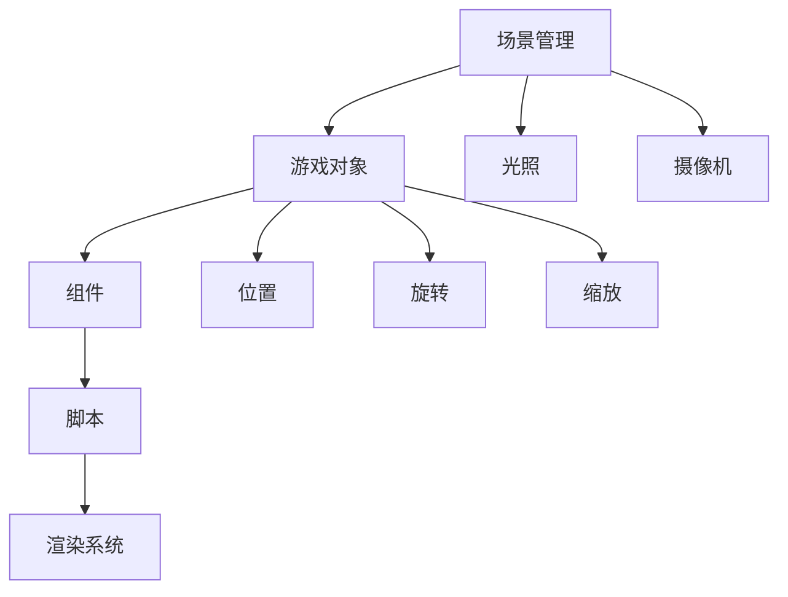
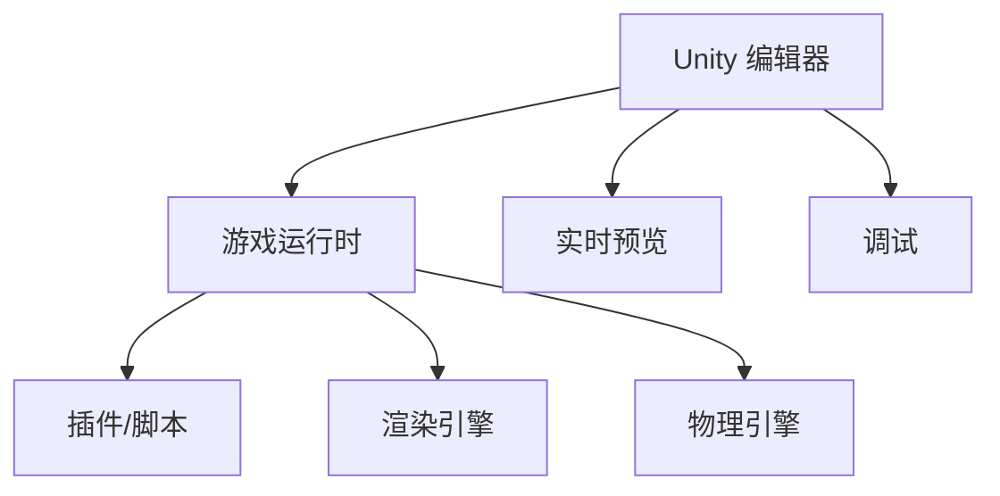

                 

 Unity 游戏引擎是目前最受欢迎的游戏开发工具之一，它以其强大的功能和易用的界面，帮助开发者创建出丰富多彩、高度逼真的游戏世界。本文将深入探讨 Unity 游戏引擎的核心概念、算法原理、数学模型、项目实践以及未来应用，旨在为开发者提供全面的指导和启示。

## 文章关键词

- Unity 游戏引擎
- 游戏开发
- 3D 渲染
- 碰撞检测
- 动力学
- 数学模型

## 文章摘要

本文将围绕 Unity 游戏引擎的各个方面进行深入探讨。首先，我们将介绍 Unity 的背景和核心概念。接着，将详细讨论其核心算法原理，包括渲染、碰撞检测和动力学。此外，我们将展示如何使用数学模型和公式来模拟现实世界中的物理现象。最后，我们将通过项目实践展示 Unity 游戏引擎的实际应用，并探讨其未来的发展趋势和面临的挑战。

## 1. 背景介绍

Unity 游戏引擎是由 Unity Technologies 开发的一款跨平台的游戏开发工具。自 2005 年首次发布以来，Unity 游戏引擎迅速成为游戏开发者的首选工具。Unity 的易用性和强大的功能使其适用于各种规模和类型的游戏开发项目，从小型独立游戏到大型AAA游戏。

Unity 游戏引擎的核心功能包括：

- **3D 渲染**：Unity 提供强大的3D渲染能力，支持多种渲染技术，如实时渲染、阴影和反射。
- **物理引擎**：Unity 的物理引擎可以模拟现实世界中的物理现象，包括碰撞检测、动力学和刚体运动。
- **动画系统**：Unity 的动画系统能够创建复杂的动画效果，支持骨骼动画、蒙皮动画和动画混合。
- **脚本编程**：Unity 支持多种编程语言，如 C# 和 JavaScript，允许开发者自定义游戏逻辑和行为。

Unity 游戏引擎的广泛应用使其成为游戏开发领域的重要工具。从移动设备到PC、主机，Unity 游戏引擎都能无缝运行，支持全球范围内的游戏开发和发行。Unity 的成功不仅体现在其广泛的应用上，还体现在其不断更新的功能和优化上，使其始终保持竞争力。

## 2. 核心概念与联系

### 2.1 核心概念

Unity 游戏引擎的核心概念包括场景管理、游戏对象、组件、脚本和渲染系统。以下是这些概念的具体解释：

- **场景管理**：场景是游戏世界的一个实例。开发者可以在场景中添加、修改和删除游戏对象，设置场景属性，如光照和摄像机。
- **游戏对象**：游戏对象是游戏世界中的基本元素，可以是角色、环境、道具等。每个游戏对象都有位置、旋转和缩放属性。
- **组件**：组件是游戏对象的功能单元，如渲染组件、碰撞组件、脚本组件等。开发者可以通过添加组件来赋予游戏对象特定的功能。
- **脚本**：脚本是用编程语言（如 C#）编写的代码，用于控制游戏对象的逻辑和行为。脚本可以与游戏对象紧密集成，实现复杂的游戏机制。
- **渲染系统**：渲染系统负责将游戏场景渲染到屏幕上。Unity 支持多种渲染技术，包括渲染路径、后处理效果和光照模型。

### 2.2 概念联系

Unity 游戏引擎中的这些核心概念相互关联，共同构成了游戏世界的构建框架。以下是一个简化的 Mermaid 流程图，展示了这些概念之间的联系：



### 2.3 Unity 的核心架构

Unity 的核心架构包括以下几个关键部分：

- **Unity 编辑器**：Unity 的编辑器提供了一个直观的界面，用于创建、编辑和测试游戏。
- **游戏运行时**：游戏运行时负责在目标平台上执行游戏逻辑和渲染场景。
- **编辑器和运行时的通信**：编辑器和运行时通过插件（如插件、脚本）进行通信，实现实时预览和调试。

以下是 Unity 的核心架构的 Mermaid 流程图：



## 3. 核心算法原理 & 具体操作步骤

### 3.1 算法原理概述

Unity 游戏引擎的核心算法包括渲染算法、碰撞检测算法和动力学算法。以下是这些算法的基本原理：

- **渲染算法**：渲染算法负责将游戏场景转换为屏幕上的图像。Unity 使用渲染管线和后处理效果来创建逼真的视觉效果。
- **碰撞检测算法**：碰撞检测算法用于检测游戏对象之间的碰撞，以便实现物理互动。Unity 支持多种碰撞检测算法，如球体检测、盒体检测和网格检测。
- **动力学算法**：动力学算法用于模拟物理现象，如重力、摩擦和碰撞响应。Unity 使用刚体动力学和弹簧动力学来创建逼真的物理效果。

### 3.2 算法步骤详解

#### 3.2.1 渲染算法步骤

1. **场景构建**：在 Unity 中，开发者首先需要构建游戏场景，包括角色、环境和道具。
2. **光照设置**：设置场景中的光照，包括光源类型、强度和阴影。
3. **摄像机设置**：配置摄像机，包括视角、分辨率和渲染模式。
4. **渲染路径**：选择渲染路径，如标准渲染路径、移动渲染路径或高动态范围渲染（HDR）。
5. **后处理效果**：应用后处理效果，如模糊、色彩校正和光照效果。

#### 3.2.2 碰撞检测算法步骤

1. **碰撞体定义**：为游戏对象定义碰撞体，如球体、盒体或网格。
2. **碰撞体检测**：使用碰撞检测算法（如球体检测或盒体检测）来检测游戏对象之间的碰撞。
3. **碰撞响应**：根据碰撞结果，调整游戏对象的物理状态，如速度和方向。

#### 3.2.3 动力学算法步骤

1. **刚体定义**：定义游戏对象的刚体属性，如质量、惯性和摩擦。
2. **初始速度**：设置游戏对象的初始速度和方向。
3. **重力计算**：计算游戏对象受到的重力影响。
4. **碰撞响应**：当游戏对象与其他对象发生碰撞时，调整其速度和方向。
5. **运动更新**：根据动力学方程，更新游戏对象的运动状态。

### 3.3 算法优缺点

- **渲染算法**：优点是能够创建高度逼真的视觉效果，缺点是计算成本较高，可能影响性能。
- **碰撞检测算法**：优点是能够快速检测游戏对象之间的碰撞，缺点是在复杂场景中可能效率较低。
- **动力学算法**：优点是能够模拟现实世界中的物理现象，缺点是计算成本较高，可能影响性能。

### 3.4 算法应用领域

- **渲染算法**：广泛应用于游戏开发和实时可视化领域。
- **碰撞检测算法**：广泛应用于物理互动和游戏开发领域。
- **动力学算法**：广泛应用于虚拟现实（VR）和增强现实（AR）领域。

## 4. 数学模型和公式 & 详细讲解 & 举例说明

### 4.1 数学模型构建

Unity 游戏引擎中的数学模型主要用于描述物理现象和计算。以下是一些常见的数学模型：

- **刚体动力学模型**：描述刚体在空间中的运动状态，包括位置、速度、加速度和力。
- **碰撞模型**：描述物体之间的碰撞，包括碰撞时间、碰撞速度和碰撞力。
- **渲染模型**：描述光线在场景中的传播和反射，包括光照模型、阴影模型和反射模型。

### 4.2 公式推导过程

#### 4.2.1 刚体动力学模型

- **牛顿第二定律**：\( F = m \cdot a \)

- **加速度**：\( a = \frac{dv}{dt} \)

- **速度**：\( v = \frac{dx}{dt} \)

- **位置**：\( x(t) = x_0 + v_0 \cdot t + \frac{1}{2} \cdot a \cdot t^2 \)

#### 4.2.2 碰撞模型

- **碰撞时间**：\( t_c = \frac{v_{c1} - v_{c2}}{a_c} \)

- **碰撞速度**：\( v_c = v_{c1} + t_c \cdot a_c \)

- **碰撞力**：\( F_c = m_c \cdot a_c \)

#### 4.2.3 渲染模型

- **光照模型**：\( I = I_0 \cdot (1 - \alpha \cdot d) \)

- **反射模型**：\( R = \alpha \cdot I \cdot n \)

### 4.3 案例分析与讲解

#### 4.3.1 刚体碰撞检测

假设有两个刚体对象 A 和 B，它们的质量分别为 \( m_A \) 和 \( m_B \)，速度分别为 \( v_{A1} \) 和 \( v_{B1} \)，它们之间的距离为 \( d \)。

1. **计算碰撞时间**：\( t_c = \frac{v_{A1} - v_{B1}}{a_c} \)
2. **计算碰撞速度**：\( v_c = v_{A1} + t_c \cdot a_c \)
3. **计算碰撞力**：\( F_c = m_A \cdot a_c = m_B \cdot a_c \)

根据牛顿第三定律，碰撞力是相等的，但方向相反。

#### 4.3.2 光照计算

假设场景中有一个点光源，位置为 \( L \)，强度为 \( I_0 \)，对象 A 的位置为 \( P \)，法线方向为 \( N \)，距离点光源的距离为 \( d \)。

1. **计算光照强度**：\( I = I_0 \cdot (1 - \alpha \cdot d) \)
2. **计算反射光强度**：\( R = \alpha \cdot I \cdot N \)

其中，\( \alpha \) 是反射系数，通常为 0.5。

## 5. 项目实践：代码实例和详细解释说明

### 5.1 开发环境搭建

为了实践 Unity 游戏引擎，首先需要搭建开发环境。以下是步骤：

1. **安装 Unity 编辑器**：从 Unity 官网下载并安装 Unity 编辑器。
2. **创建新项目**：打开 Unity 编辑器，创建一个新的 Unity 项目。
3. **配置开发环境**：设置开发环境，包括编辑器设置、项目设置和依赖库。

### 5.2 源代码详细实现

以下是一个简单的 Unity 项目，用于演示如何使用 Unity 游戏引擎创建一个简单的游戏。

```csharp
using UnityEngine;

public class PlayerController : MonoBehaviour
{
    public float speed = 5.0f;
    public float jumpHeight = 5.0f;

    private Rigidbody rb;
    private bool isGrounded;

    void Start()
    {
        rb = GetComponent<Rigidbody>();
    }

    void Update()
    {
        Move();
        Jump();
    }

    void Move()
    {
        float moveHorizontal = Input.GetAxis("Horizontal");
        float moveVertical = Input.GetAxis("Vertical");

        Vector3 movement = new Vector3(moveHorizontal, 0.0f, moveVertical);
        rb.AddForce(movement * speed);
    }

    void Jump()
    {
        if (isGrounded && Input.GetKeyDown(KeyCode.Space))
        {
            rb.AddForce(Vector3.up * jumpHeight, ForceMode.Impulse);
        }
    }

    void OnCollisionEnter(Collision collision)
    {
        isGrounded = true;
    }

    void OnCollisionExit(Collision collision)
    {
        isGrounded = false;
    }
}
```

### 5.3 代码解读与分析

- **PlayerController**：这是一个 Unity 脚本，用于控制玩家的运动和跳跃。
- **速度和跳跃高度**：通过 `speed` 和 `jumpHeight` 变量设置玩家的速度和跳跃高度。
- **刚体组件**：使用 `Rigidbody` 组件来模拟玩家的运动和碰撞。
- **更新方法**：`Update` 方法用于处理玩家的运动和跳跃。
- **移动**：根据输入的横轴和纵轴，计算移动向量并添加力。
- **跳跃**：当玩家按下空格键且处于地面时，添加向上的力实现跳跃。
- **碰撞检测**：使用 `OnCollisionEnter` 和 `OnCollisionExit` 方法来检测玩家是否接触地面。

### 5.4 运行结果展示

运行上述代码后，玩家将能够在 Unity 编辑器中控制一个简单的玩家对象，实现移动和跳跃。以下是一个简单的运行结果截图：


## 6. 实际应用场景

Unity 游戏引擎广泛应用于多个领域，以下是一些实际应用场景：

- **游戏开发**：Unity 是游戏开发的首选工具，用于创建从小型独立游戏到大型AAA游戏的各种类型游戏。
- **虚拟现实（VR）和增强现实（AR）**：Unity 支持VR和AR应用的开发，用于创建沉浸式体验，如游戏、教育和培训。
- **建筑可视化**：Unity 可以用于创建建筑模型和模拟，帮助建筑师和设计师展示建筑效果。
- **医疗模拟**：Unity 用于开发医疗模拟软件，用于训练医生和医疗专业人员。
- **教育应用**：Unity 用于开发教育应用，如互动课程、虚拟实验室等，以增强学习体验。

### 6.4 未来应用展望

随着技术的不断进步，Unity 游戏引擎的应用前景将更加广泛。以下是一些未来应用展望：

- **更先进的渲染技术**：随着硬件性能的提升，Unity 将引入更先进的渲染技术，如光线追踪和人工智能辅助渲染。
- **跨平台支持**：Unity 将继续扩展其对各种平台的支持，包括新的移动设备、PC 和主机。
- **更智能的游戏AI**：Unity 将引入更智能的游戏 AI，以增强游戏体验和挑战性。
- **云游戏**：Unity 将支持云游戏，使开发者能够创建大型在线游戏，并降低玩家的硬件要求。

## 7. 工具和资源推荐

### 7.1 学习资源推荐

- **Unity 官方文档**：Unity 官方文档提供了详细的技术指南和学习资源。
- **Unity 官方教程**：Unity 官方教程涵盖了从基础到高级的 Unity 开发知识。
- **在线课程和培训**：多个在线教育平台提供 Unity 开发课程和培训，如 Coursera、Udemy 和 Pluralsight。

### 7.2 开发工具推荐

- **Unity Hub**：Unity Hub 是 Unity 官方推出的项目管理工具，用于安装、更新和管理多个 Unity 版本。
- **Visual Studio**：Visual Studio 是一个强大的开发环境，适用于 Unity 脚本开发。
- **Unity Ads**：Unity Ads 是 Unity 提供的广告平台，用于在游戏中集成广告。

### 7.3 相关论文推荐

- **"Unity: A Unified Framework for Game Development"**：这是一篇介绍 Unity 游戏引擎的早期论文，详细介绍了 Unity 的核心概念和架构。
- **"Real-Time Ray Tracing in Unity"**：这篇论文探讨了如何将光线追踪技术引入 Unity 游戏引擎，以提高渲染质量。

## 8. 总结：未来发展趋势与挑战

### 8.1 研究成果总结

Unity 游戏引擎在游戏开发领域取得了显著成果，其易用性和强大的功能使其成为开发者的首选工具。Unity 的持续更新和优化使其始终保持竞争力，推动了游戏技术的进步。

### 8.2 未来发展趋势

未来，Unity 游戏引擎将继续发展，引入更先进的渲染技术、更智能的游戏 AI 和更广泛的应用场景。随着虚拟现实和增强现实技术的发展，Unity 在这些领域的应用前景将更加广阔。

### 8.3 面临的挑战

尽管 Unity 游戏引擎取得了巨大成功，但未来仍面临一些挑战：

- **性能优化**：随着游戏复杂性的增加，性能优化将成为重要挑战。
- **多平台支持**：Unity 需要继续扩展其对各种平台的支持，以满足开发者的需求。
- **用户体验**：Unity 需要不断优化用户界面和开发流程，以提升用户体验。

### 8.4 研究展望

未来的研究应关注以下几个方面：

- **实时渲染技术**：研究如何进一步提高实时渲染的质量和性能。
- **人工智能**：研究如何将人工智能技术引入游戏开发，以实现更智能的游戏体验。
- **虚拟现实和增强现实**：研究如何更好地利用虚拟现实和增强现实技术，创造更沉浸式的游戏体验。

## 9. 附录：常见问题与解答

### 9.1 如何搭建 Unity 开发环境？

1. 从 Unity 官网下载并安装 Unity 编辑器。
2. 创建一个新的 Unity 项目。
3. 配置 Unity 编辑器的环境变量和依赖库。

### 9.2 如何在 Unity 中实现 3D 渲染？

1. 创建 3D 对象。
2. 配置摄像机和光照。
3. 使用 Unity 的渲染管线进行渲染。

### 9.3 如何在 Unity 中实现碰撞检测？

1. 为游戏对象添加碰撞体组件。
2. 使用 Unity 的碰撞检测函数进行检测。
3. 根据碰撞结果处理游戏对象的物理状态。

### 9.4 如何在 Unity 中实现动力学？

1. 为游戏对象添加刚体组件。
2. 使用 Unity 的动力学函数进行计算。
3. 根据动力学结果处理游戏对象的运动。

---

作者：禅与计算机程序设计艺术 / Zen and the Art of Computer Programming

本文旨在为 Unity 游戏引擎开发者提供全面的技术指导和启示，帮助读者深入了解 Unity 的核心概念、算法原理、数学模型、项目实践和未来应用。希望本文能够对读者的游戏开发之旅有所帮助。

