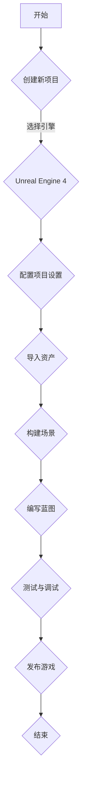

                 

关键词：Unreal Engine 4，游戏开发，视觉效果，游戏玩法设计，电影级渲染，编程教程，3D 游戏引擎

摘要：本文将深入探讨如何使用 Unreal Engine 4（UE4）这一强大的3D游戏引擎，从零开始进行游戏开发。文章不仅介绍了UE4的基本概念和操作，还详细解析了如何实现电影级的视觉效果和游戏玩法设计。通过本篇文章，读者将能够掌握游戏开发的核心理念，并具备创建高质量游戏项目的能力。

## 1. 背景介绍

Unreal Engine 4（UE4）是一款由Epic Games开发的高级3D游戏引擎，广泛应用于游戏开发、虚拟现实（VR）、增强现实（AR）以及电影制作等领域。自2014年发布以来，UE4以其卓越的图形渲染能力、直观的用户界面以及强大的编辑工具，迅速成为游戏开发者的首选工具之一。

### UE4的发展历程

UE4的前身是Unreal Engine 3（UE3），它为《战争机器》系列、《蝙蝠侠：阿卡姆》系列等众多知名游戏提供了强大的技术支持。UE3的成功使得Epic Games决心在UE4中引入更多创新功能和改进。

### UE4的特点

- **强大的图形渲染能力**：UE4支持实时全局光照、光线追踪和基于物理的渲染（PBR），能够产生接近电影质量的视觉效果。
- **直观的用户界面**：UE4的蓝图（Blueprint）系统允许非程序员通过可视化的方式编写逻辑，大大降低了游戏开发的技术门槛。
- **丰富的编辑工具**：包括世界编辑器、动画编辑器、材质编辑器等，为开发者提供了全面的创作工具。
- **跨平台支持**：UE4支持多种平台，包括PC、游戏主机、移动设备和虚拟现实设备。

### UE4的应用领域

- **游戏开发**：UE4广泛应用于大型AAA游戏开发，同时也支持独立游戏开发和小型工作室的项目。
- **虚拟现实与增强现实**：UE4提供了强大的VR和AR支持，可以创建沉浸式的虚拟体验。
- **电影制作**：许多电影和电视剧使用UE4作为预览工具，甚至直接作为制作平台。

## 2. 核心概念与联系

### UE4的核心概念

**场景（Scene）**：场景是UE4中的一个容器，用于组织和控制所有游戏元素。场景中可以包含角色、环境、灯光、特效等。

**资产（Assets）**：资产是游戏中的各种资源，包括模型、纹理、音效、脚本等。

**关卡（Level）**：关卡是游戏中的一个部分，通常包含一系列场景，每个场景负责一个特定的游戏阶段。

**蓝图（Blueprint）**：蓝图是UE4的一种可视化编程工具，允许开发者通过拖放节点和逻辑连接来构建游戏逻辑。

### UE4的架构

**编辑器（Editor）**：编辑器是UE4中用于创建和编辑游戏内容的工具集，包括世界编辑器、材质编辑器、动画编辑器等。

**游戏运行时（Runtime）**：游戏运行时是执行游戏逻辑和渲染图形的组件，它不包含编辑器的功能。

### Mermaid流程图



## 3. 核心算法原理 & 具体操作步骤

### 3.1 算法原理概述

UE4的游戏开发涉及到多个核心算法，其中最关键的是渲染算法和物理引擎。

- **渲染算法**：UE4使用基于物理的渲染（PBR）来模拟真实世界的光照和材质，并支持光线追踪技术以实现电影级的视觉效果。
- **物理引擎**：UE4内置了物理引擎，用于处理角色的运动、碰撞检测和物理交互。

### 3.2 算法步骤详解

#### 渲染算法步骤

1. **场景捕捉**：使用摄像机捕捉场景，确定渲染的视角。
2. **光照计算**：计算场景中的光照效果，包括直接光照、间接光照和阴影。
3. **材质渲染**：对场景中的每个物体应用材质，并使用PBR算法计算渲染结果。
4. **光线追踪**：对于需要高精度渲染的部分，使用光线追踪算法进行后期处理。

#### 物理引擎步骤

1. **角色运动**：根据输入和物理引擎的计算，更新角色的位置和速度。
2. **碰撞检测**：检测角色与其他物体或场景障碍物的碰撞，并响应碰撞。
3. **物理交互**：处理角色与环境的物理交互，如跳跃、滑动等。

### 3.3 算法优缺点

- **渲染算法**：优点包括高真实感、高效能，缺点是对硬件要求较高，渲染成本较大。
- **物理引擎**：优点是提供了丰富的物理效果，缺点是可能需要较多的计算资源。

### 3.4 算法应用领域

- **游戏开发**：UE4的渲染算法和物理引擎广泛应用于大型游戏和独立游戏。
- **虚拟现实**：在VR场景中，UE4的渲染算法和物理引擎能够提供沉浸式体验。
- **电影制作**：许多电影制作公司使用UE4进行预览和制作，以实现电影级的视觉效果。

## 4. 数学模型和公式 & 详细讲解 & 举例说明

### 4.1 数学模型构建

在UE4中，渲染算法和物理引擎涉及到多个数学模型，主要包括：

- **光线追踪模型**：用于模拟光线的传播和反射。
- **物理引擎模型**：用于模拟角色的运动和碰撞。

### 4.2 公式推导过程

#### 光线追踪模型

光线追踪的基本公式为：

\[ \text{交点} = \text{光线方向} \times \text{物体表面法线} \]

#### 物理引擎模型

物理引擎中的运动公式为：

\[ \text{速度} = \text{加速度} \times \text{时间} \]

### 4.3 案例分析与讲解

#### 光线追踪案例

假设有一束光线从原点出发，目标是找到它与场景中一个平面的交点。

1. **确定光线方向**：光线的方向由目标点的坐标减去原点坐标得到。
2. **计算交点**：使用光线方向和物体表面法线计算交点。
3. **渲染交点**：将交点渲染到屏幕上。

#### 物理引擎案例

假设有一个物体，其初始速度为0，受到恒定加速度的影响，要求计算物体在5秒后的速度。

1. **确定加速度**：根据物体的质量和受力情况确定加速度。
2. **计算速度**：使用加速度公式计算5秒后的速度。
3. **更新物体状态**：将计算出的速度更新到物体上。

## 5. 项目实践：代码实例和详细解释说明

### 5.1 开发环境搭建

要开始使用UE4进行游戏开发，首先需要搭建开发环境。

1. **下载并安装UE4**：访问Epic Games官网下载UE4，并按照安装向导安装。
2. **配置编辑器**：启动UE4编辑器，根据需要配置编辑器设置，如分辨率、快捷键等。
3. **安装必要的插件**：根据项目需求安装必要的插件，如粒子系统插件、物理引擎插件等。

### 5.2 源代码详细实现

下面是一个简单的UE4项目示例，用于实现一个基本的3D游戏场景。

```cpp
// 主要游戏类
class MyGame : public AActor
{
public:
    // 构造函数
    MyGame()
    {
        // 初始化游戏逻辑
    }

    // 开始游戏
    virtual void BeginPlay() override
    {
        // 创建角色
        APlayerCharacter* Player = GetPlayerCharacter<APlayerCharacter>();
        if (Player)
        {
            // 初始化角色
            Player->InitPlayer();
        }

        // 创建场景
        CreateScene();
    }

    // 创建场景
    void CreateScene()
    {
        // 导入场景资产
        UWorld* World = GetWorld();
        if (World)
        {
            // 创建角色
            FTransform Transform;
            Transform.SetLocation(FVector(0.0f, 0.0f, 100.0f));
            World->SpawnActor<APlayerCharacter>(Transform);
        }
    }
};
```

### 5.3 代码解读与分析

上述代码实现了一个简单的3D游戏场景，主要包括以下部分：

- **主要游戏类**：定义了游戏的主要逻辑和功能。
- **构造函数**：初始化游戏逻辑。
- **开始游戏**：在游戏开始时创建角色和场景。
- **创建场景**：导入场景资产并创建角色。

### 5.4 运行结果展示

运行上述代码，会在UE4编辑器中创建一个3D游戏场景，其中包含一个角色。玩家可以控制角色在场景中移动。

## 6. 实际应用场景

### 6.1 游戏开发

UE4广泛应用于游戏开发，从大型AAA游戏到独立游戏。它的强大渲染能力和丰富的编辑工具使得开发者能够轻松创建高质量的视觉效果和复杂的游戏玩法。

### 6.2 虚拟现实

UE4的VR支持使得开发者能够创建沉浸式的虚拟体验。VR游戏、教育应用和模拟训练等场景都可以使用UE4进行开发。

### 6.3 电影制作

许多电影制作公司使用UE4作为预览工具，甚至直接作为制作平台。UE4的渲染能力可以生成高质量的电影级视觉效果。

## 7. 工具和资源推荐

### 7.1 学习资源推荐

- **Epic Games 官方文档**：Epic Games 提供了详尽的官方文档，是学习 UE4 的首选资源。
- **Unreal Engine 社区论坛**：社区论坛是寻找帮助和分享经验的绝佳地方。
- **在线课程**：许多在线教育平台提供了 UE4 相关的课程，适合不同水平的开发者。

### 7.2 开发工具推荐

- **Visual Studio**：Visual Studio 是开发 UE4 项目的主要集成开发环境（IDE）。
- **Unity**：Unity 是另一款流行的游戏引擎，与 UE4 相互补充，适用于不同类型的项目。
- **Blender**：Blender 是一款免费的3D建模和渲染软件，适用于创建游戏资产。

### 7.3 相关论文推荐

- **"Real-Time Ray Tracing in Unreal Engine 4"**：探讨了 UE4 中光线追踪的实现方法。
- **"Unreal Engine 4: The Complete Game Developer's Guide"**：全面介绍了 UE4 的功能和用法。

## 8. 总结：未来发展趋势与挑战

### 8.1 研究成果总结

UE4在游戏开发、VR、AR和电影制作等领域取得了显著成果，其强大的渲染能力和直观的用户界面得到了广泛认可。

### 8.2 未来发展趋势

随着技术的不断发展，UE4有望在以下几个方面取得突破：

- **更高效的渲染算法**：引入新的渲染技术，如基于AI的渲染优化。
- **跨平台支持**：进一步优化跨平台性能，支持更多设备。
- **更丰富的内容创作工具**：引入更多自动化工具，降低开发门槛。

### 8.3 面临的挑战

尽管UE4已经非常成熟，但仍然面临以下挑战：

- **硬件限制**：高质量渲染需要高性能的硬件支持，这限制了其在一些低端设备上的应用。
- **学习曲线**：对于初学者来说，UE4的学习曲线较为陡峭，需要投入大量时间来掌握。

### 8.4 研究展望

未来，UE4将继续在游戏开发、虚拟现实和电影制作等领域发挥重要作用。通过技术创新和优化，UE4有望成为更全面、更强大的游戏引擎。

## 9. 附录：常见问题与解答

### 9.1 如何安装 UE4？

- 访问 Epic Games 官网下载 UE4。
- 运行安装程序并按照提示安装。
- 安装完成后，启动 UE4 编辑器。

### 9.2 如何创建新项目？

- 在 UE4 编辑器中，点击“文件”菜单，选择“新建项目”。
- 在“新建项目”窗口中，选择引擎版本和项目类型，设置项目名称和位置，然后点击“创建”。

### 9.3 如何导入资产？

- 在 UE4 编辑器中，点击“文件”菜单，选择“导入”。
- 在弹出的导入窗口中，选择要导入的资产文件，然后点击“导入”按钮。

### 9.4 如何编写蓝图？

- 在 UE4 编辑器中，双击“内容浏览器”中的“蓝图”文件夹，创建一个新的蓝图类。
- 在蓝图编辑器中，通过拖放节点和连接逻辑，构建游戏逻辑。

### 9.5 如何优化渲染性能？

- 减少场景中的物体数量。
- 使用LOD（细节层次）技术。
- 关闭不必要的后处理效果。

---

作者：禅与计算机程序设计艺术 / Zen and the Art of Computer Programming

