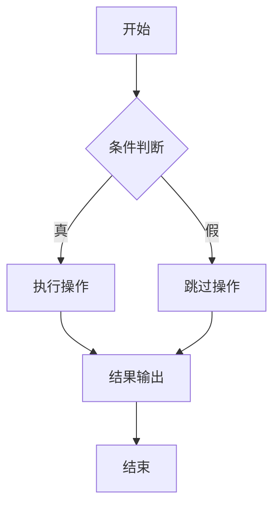
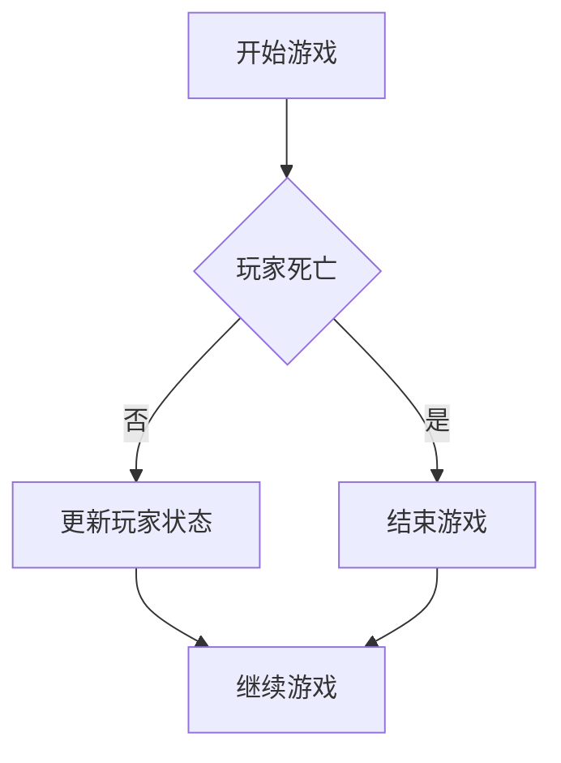

                 

关键词：Unreal Engine、可视化编程、蓝图系统、游戏开发、交互设计、编程语言、工程实践

> 摘要：本文深入探讨了Unreal Engine的蓝图系统，揭示了这一强大可视化编程工具的核心概念、应用场景以及实现原理。通过详细的实例分析和工程实践，本文旨在为开发者提供一窥蓝图系统精髓的窗口，帮助他们在游戏开发、交互设计和复杂系统构建中充分发挥其优势。

## 1. 背景介绍

Unreal Engine 是一款由Epic Games开发的强大游戏引擎，广泛应用于游戏开发、电影制作、建筑可视化等领域。其核心特色之一便是其独特的蓝图（Blueprint）系统，一种无需写代码即可实现复杂功能的可视化编程工具。蓝图的引入极大地降低了游戏开发的门槛，使得非专业程序员或设计师也能参与到游戏逻辑的实现中。

蓝图系统通过节点（Nodes）和连接线（Links）构建出程序的逻辑流，其直观性和灵活性深受开发者喜爱。这种可视化的编程方式不仅简化了开发流程，还使得程序的调试和维护变得更加直观和高效。

## 2. 核心概念与联系

### 2.1 蓝图系统的核心概念

- **节点（Nodes）**：蓝图系统中的基本构建块，代表具体的操作或功能。例如，"加法运算"、"函数调用"、"条件判断"等。

- **连接线（Links）**：连接不同节点，指示数据流和控制流的传递方向。

- **事件触发器（Event Triggers）**：用于指定程序的启动和停止，以及节点间的事件传递。

- **变量（Variables）**：用于存储和传递数据，可以是数值、文本、对象等。

### 2.2 蓝图系统的结构

- **事件节点**：事件触发器的实现，如"开始"、"按下按钮"、"游戏结束"等。

- **功能节点**：执行具体操作的节点，如"加法"、"乘法"、"创建物体"等。

- **条件节点**：用于实现条件判断的节点，如"如果-否则"语句。

- **控制流节点**：影响程序执行流程的节点，如"循环"、"跳转"、"等待"等。

- **数据流节点**：处理数据传递的节点，如"获取组件"、"设置属性"等。

### 2.3 蓝图系统的流程图

## 3. 核心算法原理 & 具体操作步骤

### 3.1 算法原理概述

蓝图系统通过节点和连接线实现程序的逻辑流。每个节点代表一个具体的操作或功能，连接线则指示数据的传递方向。通过组合不同的节点和连接线，开发者可以构建出复杂的程序逻辑。

### 3.2 算法步骤详解

1. **创建蓝图**：在Unreal Engine中创建一个新的蓝图类，作为程序的起点。

2. **添加节点**：根据程序的需求，在蓝图中添加相应的节点。例如，"加法运算"、"条件判断"等。

3. **连接节点**：通过拖动连接线将不同的节点连接起来，构建出程序的逻辑流。

4. **设置属性**：为每个节点设置相应的属性，如数值、文本、对象等。

5. **调试运行**：在编辑器中运行蓝图，检查程序的逻辑和行为是否正确。

### 3.3 算法优缺点

- **优点**：
  - **可视化**：通过节点和连接线直观地表示程序的逻辑，易于理解和修改。
  - **易用性**：无需编程基础即可上手，降低了开发门槛。
  - **灵活性**：可以根据需求随时修改和调整程序逻辑。

- **缺点**：
  - **性能**：相对于传统编程语言，蓝图系统的性能可能较低。
  - **复杂性**：对于复杂的程序逻辑，使用蓝图系统可能会变得繁琐。

### 3.4 算法应用领域

- **游戏开发**：蓝图系统在游戏开发中广泛应用，用于实现游戏逻辑、AI行为等。
- **交互设计**：用于构建复杂的人机交互系统，如VR体验、触摸界面等。
- **模拟仿真**：用于模拟现实世界中的物理现象和系统行为。

## 4. 数学模型和公式 & 详细讲解 & 举例说明

### 4.1 数学模型构建

蓝图系统中的数学模型主要通过节点和连接线实现。例如，一个简单的线性模型可以通过以下节点构建：

- **输入节点**：接收外部输入值。
- **加法运算节点**：执行加法操作。
- **输出节点**：输出计算结果。

### 4.2 公式推导过程

假设我们有一个线性模型，其公式为：

\[ y = x + b \]

其中，\( x \) 为输入值，\( b \) 为常数项。

### 4.3 案例分析与讲解

**案例 1：计算两个数的和**

1. **创建输入节点**：创建两个输入节点，分别代表两个加数。

2. **创建加法运算节点**：连接两个输入节点到加法运算节点。

3. **创建输出节点**：将加法运算节点的结果连接到输出节点。

4. **设置属性**：为加法运算节点设置常数项 \( b \)。

5. **调试运行**：运行蓝图，检查输出结果是否正确。

**案例 2：实现条件判断**

1. **创建输入节点**：创建一个输入节点，代表条件值。

2. **创建条件判断节点**：连接输入节点到条件判断节点。

3. **创建两个输出节点**：分别为"真"和"假"创建输出节点。

4. **连接节点**：根据条件判断的结果，将输入节点连接到相应的输出节点。

5. **设置属性**：为条件判断节点设置条件表达式。

6. **调试运行**：运行蓝图，检查输出结果是否正确。

## 5. 项目实践：代码实例和详细解释说明

### 5.1 开发环境搭建

1. **安装Unreal Engine**：从Epic Games官网下载并安装Unreal Engine。

2. **创建新项目**：在Unreal Engine编辑器中创建一个新的项目。

3. **导入资源**：导入所需的资源和素材。

### 5.2 源代码详细实现

**案例：实现一个简单的游戏逻辑**

1. **创建蓝图类**：在项目中创建一个新的蓝图类，用于实现游戏逻辑。

2. **添加节点**：
   - **事件触发器**：添加"开始游戏"和"结束游戏"事件触发器。
   - **条件判断节点**：添加"玩家死亡"条件判断节点。
   - **功能节点**：添加"创建玩家"、"更新玩家状态"等功能节点。

3. **连接节点**：将事件触发器、条件判断节点和功能节点连接起来，构建出程序的逻辑流。

4. **设置属性**：为每个节点设置相应的属性，如玩家属性、游戏规则等。

5. **调试运行**：在编辑器中运行蓝图，检查程序的逻辑和行为是否正确。

### 5.3 代码解读与分析

**代码解读：**

**分析：**

- **开始游戏**：游戏开始时，触发"开始游戏"事件。
- **玩家死亡判断**：根据玩家状态判断是否死亡。
- **更新玩家状态**：如果玩家未死亡，更新玩家状态。
- **结束游戏**：如果玩家死亡，触发"结束游戏"事件。
- **继续游戏**：游戏继续，等待下一次事件触发。

### 5.4 运行结果展示

在编辑器中运行蓝图，观察游戏逻辑的运行结果。确保程序能够正确处理玩家的状态变化，并在玩家死亡时结束游戏。

## 6. 实际应用场景

### 6.1 游戏开发

蓝图系统在游戏开发中广泛应用，用于实现游戏逻辑、角色行为、环境交互等。通过蓝图，开发者可以快速实现复杂的游戏机制，降低开发成本和时间。

### 6.2 交互设计

蓝图系统在交互设计中也具有重要作用，如实现VR体验、触摸界面等。通过蓝图，设计师可以轻松构建复杂的人机交互系统，提升用户体验。

### 6.3 模拟仿真

蓝图系统在模拟仿真领域也有广泛应用，如模拟物理现象、化学反应等。通过蓝图，开发者可以快速构建出复杂的仿真系统，为科学研究提供支持。

## 7. 工具和资源推荐

### 7.1 学习资源推荐

- **官方文档**：Epic Games 提供了详细的蓝图系统文档，涵盖了从基础概念到高级应用的各个方面。

- **在线教程**：许多开发者社区和博客提供了丰富的蓝图系统教程，适合不同层次的开发者学习。

- **蓝印社区**：蓝印社区（Blueprint Community）是开发者交流和分享蓝图项目的地方，是学习蓝图系统的好去处。

### 7.2 开发工具推荐

- **Unreal Engine 编辑器**：Epic Games 提供的官方编辑器是进行蓝图开发的必备工具。

- **版本控制系统**：如Git，用于管理蓝图的版本和变更。

- **调试工具**：如Visual Studio Code，提供强大的调试功能，帮助开发者更高效地开发蓝图。

### 7.3 相关论文推荐

- **"Unreal Engine 4 Blueprint System: A Visual Programming Language for Game Development"**：该论文详细介绍了Unreal Engine 4的蓝图系统，对理解蓝图系统的核心概念和应用场景有很大帮助。

- **"Visual Programming for Game Development: A Survey"**：该论文对可视化编程在游戏开发中的应用进行了全面的综述，包括蓝图系统在内的多种可视化编程工具。

## 8. 总结：未来发展趋势与挑战

### 8.1 研究成果总结

蓝图系统在游戏开发、交互设计和模拟仿真等领域取得了显著成果。通过其可视化的编程方式，大大降低了开发门槛，提高了开发效率。

### 8.2 未来发展趋势

- **性能优化**：随着游戏和交互设计需求的不断增长，蓝图系统的性能优化将成为重要研究方向。
- **功能扩展**：未来蓝图系统将进一步扩展其功能，如支持更复杂的数学计算和算法实现。
- **跨平台应用**：蓝图系统有望在更多领域得到应用，如机器人控制、智能家居等。

### 8.3 面临的挑战

- **性能瓶颈**：随着程序的复杂度增加，蓝图系统的性能瓶颈可能成为制约其发展的关键因素。
- **安全性**：在开源环境下，蓝图系统的安全性需要得到充分保障，以防止潜在的安全漏洞。

### 8.4 研究展望

未来，蓝图系统有望在多个领域发挥更大的作用，成为开发者不可或缺的工具。通过不断的性能优化和功能扩展，蓝图系统将迎来更加广阔的发展前景。

## 9. 附录：常见问题与解答

### 9.1 蓝图系统如何调试？

- 在Unreal Engine编辑器中，可以使用调试工具进行蓝图的调试。
- 可以设置断点、观察变量、单步执行等，以帮助分析程序逻辑。

### 9.2 蓝图系统是否支持多线程？

- 蓝图系统支持多线程编程，但需要注意线程安全性和同步问题。

### 9.3 如何将蓝图代码转换为C++代码？

- Unreal Engine提供了将蓝图代码转换为C++代码的功能。
- 在蓝图编辑器中，可以选择"生成C++代码"，然后根据提示进行相应的设置。

----------------------------------------------------------------

以上便是针对 Unreal Engine 蓝图系统的一份详细的技术博客文章。希望这份文章能够为开发者提供关于蓝图系统的深入理解和实践指导。作者：禅与计算机程序设计艺术 / Zen and the Art of Computer Programming。如果您有任何疑问或建议，欢迎在评论区留言交流。|

