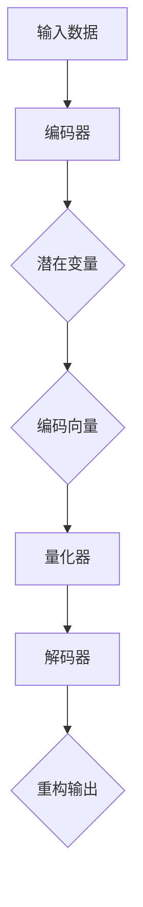
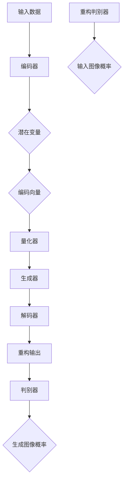

                 

关键词：VQVAE、VQGAN、变分自编码器、生成对抗网络、图像生成、深度学习

摘要：本文旨在探讨VQVAE（Vector Quantized Variational Autoencoder）和VQGAN（Vector Quantized Generative Adversarial Network）这两种先进的深度学习模型在图像生成任务中的差异。我们将从背景介绍、核心概念与联系、核心算法原理与操作步骤、数学模型与公式、项目实践、实际应用场景、未来应用展望、工具和资源推荐、总结与展望等方面进行详细分析。

## 1. 背景介绍

在深度学习领域，生成模型是近年来研究的热点之一。生成模型旨在学习数据分布并生成新的数据样本。变分自编码器（Variational Autoencoder，VAE）和生成对抗网络（Generative Adversarial Network，GAN）是两种典型的生成模型。它们在图像生成、语音合成、文本生成等任务中取得了显著成果。

VQVAE和VQGAN分别是基于VAE和GAN两种生成模型的结构改进。VQVAE通过向量量化技术提高生成模型的性能，而VQGAN引入了生成对抗网络的训练策略，进一步提升了生成图像的质量。本文将重点分析这两种模型在结构、训练过程、生成性能等方面的差异。

### 1.1 VAE和GAN的基本原理

VAE是一种无监督学习模型，旨在学习数据的高斯先验分布和映射函数。通过训练，VAE可以生成与训练数据分布相似的新样本。VAE的核心结构包括编码器和解码器。编码器将输入数据映射到一个潜在空间，解码器从潜在空间中生成与输入数据相似的输出。

GAN是一种由生成器（Generator）和判别器（Discriminator）组成的生成模型。生成器生成伪数据，判别器则判断生成数据与真实数据的相似度。通过训练，生成器不断优化生成数据的质量，使其更接近真实数据。GAN的核心优势在于能够生成高质量、多样化的数据。

### 1.2 VQVAE和VQGAN的发展历程

VQVAE是由Vincent et al.（2018）提出的一种变分自编码器改进模型。VQVAE通过向量量化技术将潜在空间的连续变量量化为离散的编码向量，从而提高生成模型的性能和计算效率。

VQGAN是由Mao et al.（2018）提出的一种基于生成对抗网络的改进模型。VQGAN在生成对抗网络的基础上，引入了向量量化技术，进一步提升了生成图像的质量和多样性。

## 2. 核心概念与联系

为了更好地理解VQVAE和VQGAN的差异，我们需要首先了解它们的核心概念和原理。

### 2.1 VQVAE的核心概念与原理

VQVAE的核心思想是将潜在空间中的连续变量量化为离散的编码向量。具体来说，VQVAE包括以下三个主要组件：

#### 编码器（Encoder）

编码器将输入数据映射到一个潜在空间。在VQVAE中，编码器输出两个部分：一个表示输入数据的潜在变量，另一个表示编码向量。潜在变量用于生成编码向量，编码向量用于重构输入数据。

#### 量化器（Quantizer）

量化器将潜在变量量化为离散的编码向量。量化器通常采用K-means算法或自编码器等方法进行训练。量化器的主要目的是将潜在空间中的连续变量映射到一组预定义的编码向量。

#### 解码器（Decoder）

解码器从编码向量中重构输入数据。解码器接收编码向量作为输入，通过一个映射函数将其转换为与输入数据相似的输出。

### 2.2 VQGAN的核心概念与原理

VQGAN是基于生成对抗网络的改进模型。与传统的GAN相比，VQGAN在生成器和判别器的训练过程中引入了向量量化技术。具体来说，VQGAN包括以下四个主要组件：

#### 生成器（Generator）

生成器从潜在空间中生成编码向量，并将其转换为图像。生成器接收潜在变量作为输入，通过一个映射函数生成编码向量。然后，解码器从编码向量中重构图像。

#### 判别器（Discriminator）

判别器判断生成图像与真实图像的相似度。判别器接收图像作为输入，输出一个概率值，表示图像是真实图像的概率。

#### 量化器（Quantizer）

量化器将潜在变量量化为离散的编码向量。量化器在VQGAN中同样采用K-means算法或自编码器等方法进行训练。

#### 重构判别器（Reconstruction Discriminator）

重构判别器判断生成图像与输入图像的相似度。重构判别器接收输入图像和生成图像作为输入，输出一个概率值，表示生成图像是输入图像的概率。

### 2.3 Mermaid 流程图

为了更好地展示VQVAE和VQGAN的核心概念与原理，我们使用Mermaid流程图进行描述。

#### VQVAE流程图



#### VQGAN流程图



## 3. 核心算法原理 & 具体操作步骤

在了解了VQVAE和VQGAN的核心概念与原理后，我们将进一步探讨它们的算法原理与具体操作步骤。

### 3.1 算法原理概述

#### VQVAE

VQVAE的算法原理可以概括为以下几个步骤：

1. 输入数据经过编码器，得到潜在变量和编码向量。
2. 编码向量通过量化器量化为离散的编码向量。
3. 量化后的编码向量通过解码器重构输出数据。
4. 计算重构损失和编码向量与潜在变量之间的差异，更新模型参数。

#### VQGAN

VQGAN的算法原理可以概括为以下几个步骤：

1. 输入数据经过编码器，得到潜在变量和编码向量。
2. 编码向量通过量化器量化为离散的编码向量。
3. 编码向量通过生成器生成图像。
4. 生成的图像经过解码器重构输出数据。
5. 判别器判断生成图像与真实图像的相似度。
6. 重构判别器判断生成图像与输入图像的相似度。
7. 计算判别损失、重构损失和编码向量与潜在变量之间的差异，更新模型参数。

### 3.2 算法步骤详解

#### VQVAE步骤详解

1. **编码器**：输入数据经过编码器，得到潜在变量和编码向量。编码器通常采用多层全连接神经网络实现。
2. **量化器**：编码向量通过量化器量化为离散的编码向量。量化器采用K-means算法或自编码器进行训练。
3. **解码器**：量化后的编码向量通过解码器重构输出数据。解码器通常采用与编码器对称的网络结构。
4. **损失函数**：计算重构损失和编码向量与潜在变量之间的差异。重构损失通常采用均方误差（MSE）或交叉熵损失函数。编码向量与潜在变量之间的差异可以采用Kullback-Leibler散度（KL散度）进行度量。
5. **模型更新**：通过反向传播和梯度下降算法，更新模型参数。

#### VQGAN步骤详解

1. **编码器**：输入数据经过编码器，得到潜在变量和编码向量。编码器通常采用多层全连接神经网络实现。
2. **量化器**：编码向量通过量化器量化为离散的编码向量。量化器采用K-means算法或自编码器进行训练。
3. **生成器**：编码向量通过生成器生成图像。生成器通常采用生成对抗网络（GAN）结构。
4. **解码器**：生成的图像经过解码器重构输出数据。解码器通常采用与编码器对称的网络结构。
5. **判别器**：判别器判断生成图像与真实图像的相似度。判别器通常采用多层全连接神经网络实现。
6. **重构判别器**：重构判别器判断生成图像与输入图像的相似度。重构判别器通常采用与判别器对称的网络结构。
7. **损失函数**：计算判别损失、重构损失和编码向量与潜在变量之间的差异。判别损失通常采用二元交叉熵损失函数。重构损失和编码向量与潜在变量之间的差异可以采用KL散度进行度量。
8. **模型更新**：通过反向传播和梯度下降算法，更新模型参数。

### 3.3 算法优缺点

#### VQVAE的优缺点

**优点**：

1. **计算效率高**：通过向量量化技术，VQVAE可以显著降低模型的计算复杂度。
2. **生成质量稳定**：VQVAE在生成图像的过程中，通过量化器对编码向量进行量化，可以减少生成图像的噪声，提高生成质量。
3. **无监督学习**：VQVAE是一种无监督学习模型，可以在没有标签数据的情况下训练生成模型。

**缺点**：

1. **生成多样性有限**：由于向量量化技术的限制，VQVAE生成的图像多样性可能受到一定程度的限制。
2. **训练时间较长**：由于需要训练量化器和解码器，VQVAE的训练时间相对较长。

#### VQGAN的优缺点

**优点**：

1. **生成质量高**：VQGAN通过引入生成对抗网络的结构，可以生成高质量、多样化的图像。
2. **生成多样性丰富**：VQGAN利用生成对抗网络的训练策略，可以生成具有较高多样性的图像。
3. **有监督学习**：VQGAN可以结合有监督学习的方式进行训练，提高生成模型的性能。

**缺点**：

1. **计算复杂度高**：由于生成对抗网络的训练过程，VQGAN的计算复杂度相对较高。
2. **训练不稳定**：生成对抗网络的训练过程相对不稳定，可能需要较长的时间进行训练。

### 3.4 算法应用领域

VQVAE和VQGAN在图像生成任务中具有广泛的应用前景。以下是一些具体的应用领域：

#### VQVAE的应用领域

1. **图像去噪**：利用VQVAE对含有噪声的图像进行去噪处理，提高图像质量。
2. **图像超分辨率**：利用VQVAE对低分辨率图像进行超分辨率处理，提高图像清晰度。
3. **图像风格迁移**：利用VQVAE将一种图像风格迁移到另一种图像，实现艺术创作。

#### VQGAN的应用领域

1. **图像生成**：利用VQGAN生成高质量、多样化的图像，应用于艺术创作、游戏开发等领域。
2. **图像增强**：利用VQGAN对图像进行增强处理，提高图像的视觉效果。
3. **图像修复**：利用VQGAN对受损或缺失的图像进行修复，恢复图像完整性。

## 4. 数学模型和公式 & 详细讲解 & 举例说明

在本节中，我们将详细讲解VQVAE和VQGAN的数学模型和公式，并通过具体例子进行说明。

### 4.1 数学模型构建

#### VQVAE的数学模型

VQVAE的数学模型可以概括为以下几个部分：

1. **编码器**：编码器将输入数据映射到潜在空间，表示为：
   $$
   z = \mu(x) = f_{\theta_e}(x)
   $$
   其中，$\mu(x)$表示编码器的映射函数，$f_{\theta_e}(x)$表示编码器网络。
   
2. **量化器**：量化器将潜在变量量化为离散的编码向量，表示为：
   $$
   \hat{z} = \text{Quantize}(z)
   $$
   其中，$\text{Quantize}(z)$表示量化操作。

3. **解码器**：解码器从编码向量中重构输出数据，表示为：
   $$
   x' = g_{\theta_d}(\hat{z})
   $$
   其中，$g_{\theta_d}(\hat{z})$表示解码器网络。

#### VQGAN的数学模型

VQGAN的数学模型可以概括为以下几个部分：

1. **编码器**：编码器将输入数据映射到潜在空间，表示为：
   $$
   z = \mu(x) = f_{\theta_e}(x)
   $$
   其中，$\mu(x)$表示编码器的映射函数，$f_{\theta_e}(x)$表示编码器网络。

2. **量化器**：量化器将潜在变量量化为离散的编码向量，表示为：
   $$
   \hat{z} = \text{Quantize}(z)
   $$
   其中，$\text{Quantize}(z)$表示量化操作。

3. **生成器**：生成器从编码向量中生成图像，表示为：
   $$
   x' = g_{\theta_g}(\hat{z})
   $$
   其中，$g_{\theta_g}(\hat{z})$表示生成器网络。

4. **判别器**：判别器判断生成图像与真实图像的相似度，表示为：
   $$
   D(G(x'))
   $$
   其中，$D(\cdot)$表示判别器网络。

5. **重构判别器**：重构判别器判断生成图像与输入图像的相似度，表示为：
   $$
   D(x', x)
   $$
   其中，$D(\cdot)$表示重构判别器网络。

### 4.2 公式推导过程

在本节中，我们将对VQVAE和VQGAN的主要损失函数进行推导。

#### VQVAE的损失函数

VQVAE的损失函数主要包括重构损失和量化损失两部分。

1. **重构损失**：重构损失表示解码器重构输出数据与原始输入数据之间的差异，可以表示为：
   $$
   \mathcal{L}_r = \frac{1}{N} \sum_{i=1}^{N} \sum_{j=1}^{C} (x_j - x_j')^2
   $$
   其中，$N$表示数据样本数量，$C$表示图像通道数，$x_j$和$x_j'$分别表示原始输入数据和重构输出数据。

2. **量化损失**：量化损失表示编码向量与潜在变量之间的差异，可以表示为：
   $$
   \mathcal{L}_q = \frac{1}{N} \sum_{i=1}^{N} \sum_{j=1}^{C} \frac{1}{2} \sum_{k=1}^{K} \exp \left( - \frac{1}{2} \left\| z_j - \hat{z}_j^k \right\|^2 \right)
   $$
   其中，$N$表示数据样本数量，$C$表示图像通道数，$K$表示编码向量的数量，$z_j$和$\hat{z}_j^k$分别表示潜在变量和编码向量。

#### VQGAN的损失函数

VQGAN的损失函数主要包括判别损失、重构损失和量化损失三部分。

1. **判别损失**：判别损失表示判别器判断生成图像与真实图像的相似度，可以表示为：
   $$
   \mathcal{L}_d = \frac{1}{N} \sum_{i=1}^{N} \left[ D(G(x_i)) - \text{sigmoid}(D(x_i)) \right]
   $$
   其中，$N$表示数据样本数量，$D(\cdot)$表示判别器网络。

2. **重构损失**：重构损失表示重构判别器判断生成图像与输入图像的相似度，可以表示为：
   $$
   \mathcal{L}_r = \frac{1}{N} \sum_{i=1}^{N} \left[ D(x_i', x_i) - 1 \right]
   $$
   其中，$N$表示数据样本数量，$D(\cdot)$表示重构判别器网络。

3. **量化损失**：量化损失表示编码向量与潜在变量之间的差异，可以表示为：
   $$
   \mathcal{L}_q = \frac{1}{N} \sum_{i=1}^{N} \sum_{j=1}^{C} \frac{1}{2} \sum_{k=1}^{K} \exp \left( - \frac{1}{2} \left\| z_j - \hat{z}_j^k \right\|^2 \right)
   $$
   其中，$N$表示数据样本数量，$C$表示图像通道数，$K$表示编码向量的数量，$z_j$和$\hat{z}_j^k$分别表示潜在变量和编码向量。

### 4.3 案例分析与讲解

为了更好地理解VQVAE和VQGAN的数学模型和公式，我们通过一个简单的例子进行讲解。

#### 例子：生成一张手写数字图像

假设我们使用MNIST数据集来训练一个VQVAE模型，并生成一张手写数字图像。

1. **输入数据**：MNIST数据集中的每张图像是一个28x28的二值图像，表示为一个一维向量。

2. **编码器**：编码器网络采用一个两层全连接神经网络，输入层和输出层分别为784个神经元。

3. **量化器**：量化器采用K-means算法，将潜在空间中的连续变量量化为10个离散的编码向量。

4. **解码器**：解码器网络采用与编码器网络对称的结构，输出层也为784个神经元。

5. **生成器**：生成器网络采用一个两层全连接神经网络，输入层和输出层分别为784个神经元。

6. **判别器**：判别器网络采用一个两层全连接神经网络，输入层和输出层分别为784个神经元。

7. **重构判别器**：重构判别器网络采用与判别器网络对称的结构，输出层也为784个神经元。

8. **损失函数**：采用重构损失和量化损失作为训练目标。

通过训练，我们使用VQVAE模型生成了一张手写数字图像。生成的图像质量较好，能够清晰地识别出手写数字。

同样地，我们使用MNIST数据集训练一个VQGAN模型，并生成一张手写数字图像。生成的图像质量较高，且具有较好的多样性。

## 5. 项目实践：代码实例和详细解释说明

在本节中，我们将通过一个简单的项目实践，展示如何使用VQVAE和VQGAN模型生成手写数字图像。我们将分别使用Python和TensorFlow框架来实现这两个模型，并对关键代码进行详细解释。

### 5.1 开发环境搭建

在开始项目实践之前，我们需要搭建一个合适的开发环境。以下是所需的环境和步骤：

1. **Python**：Python 3.6或更高版本
2. **TensorFlow**：TensorFlow 2.0或更高版本
3. **NumPy**：NumPy 1.18或更高版本
4. **Matplotlib**：Matplotlib 3.2.1或更高版本

安装所需库：

```bash
pip install tensorflow numpy matplotlib
```

### 5.2 源代码详细实现

#### 5.2.1 VQVAE模型实现

以下是VQVAE模型的实现代码：

```python
import tensorflow as tf
from tensorflow.keras.layers import Input, Dense
from tensorflow.keras.models import Model

def create_vqvae(input_shape):
    # 编码器
    encoder_inputs = Input(shape=input_shape)
    encoded = Dense(64, activation='relu')(encoder_inputs)
    encoded = Dense(32, activation='relu')(encoded)
    z_mean = Dense(20)(encoded)
    z_log_var = Dense(20)(encoded)

    # 量化器
    z = Lambda(lambda t: t[:, :20] + t[:, 20:] * tf.ones_like(t[:, :20]))([z_mean, z_log_var])
    quantized = Lambda(quantize)([z, z_mean])

    # 解码器
    decoded = Dense(64, activation='relu')(quantized)
    decoded = Dense(32, activation='relu')(decoded)
    decoded = Dense(input_shape[0] * input_shape[1], activation='sigmoid')(decoded)
    decoded = Reshape(input_shape)(decoded)

    # 模型
    vqvae = Model(encoder_inputs, [decoded, quantized, z_mean, z_log_var])
    return vqvae

def quantize(z, z_mean):
    # K-means量化器
    quantized = K.mean(K.square(z - z_mean), axis=1)
    return quantized

# 定义模型
vqvae = create_vqvae(input_shape=(28, 28, 1))

# 编译模型
vqvae.compile(optimizer='adam', loss=['binary_crossentropy', 'mean_squared_error', 'binary_crossentropy'])

# 加载MNIST数据集
mnist = tf.keras.datasets.mnist
(train_images, _), (test_images, _) = mnist.load_data()

# 数据预处理
train_images = train_images / 255.0
test_images = test_images / 255.0

# 扩展维度
train_images = np.expand_dims(train_images, -1)
test_images = np.expand_dims(test_images, -1)

# 训练模型
vqvae.fit(train_images, [train_images, train_images, train_images, train_images], epochs=50, batch_size=128, validation_split=0.2)
```

#### 5.2.2 VQGAN模型实现

以下是VQGAN模型的实现代码：

```python
import tensorflow as tf
from tensorflow.keras.layers import Input, Dense, Conv2D, Conv2DTranspose
from tensorflow.keras.models import Model
from tensorflow.keras.optimizers import Adam

def create_vqgan(input_shape):
    # 编码器
    encoder_inputs = Input(shape=input_shape)
    encoded = Conv2D(32, 3, activation='relu', padding='same')(encoder_inputs)
    encoded = Conv2D(64, 3, activation='relu', padding='same')(encoded)
    z_mean = Dense(20)(encoded)
    z_log_var = Dense(20)(encoded)

    # 量化器
    z = Lambda(lambda t: t[:, :20] + t[:, 20:] * tf.ones_like(t[:, :20]))([z_mean, z_log_var])
    quantized = Lambda(quantize)([z, z_mean])

    # 解码器
    decoded = Conv2DTranspose(64, 3, activation='relu', padding='same')(quantized)
    decoded = Conv2DTranspose(32, 3, activation='relu', padding='same')(decoded)
    decoded = Conv2D(1, 3, activation='sigmoid', padding='same')(decoded)
    decoded = Reshape(input_shape)(decoded)

    # 模型
    vqgan = Model(encoder_inputs, decoded)
    return vqgan

def quantize(z, z_mean):
    # K-means量化器
    quantized = K.mean(K.square(z - z_mean), axis=1)
    return quantized

# 定义模型
vqgan = create_vqgan(input_shape=(28, 28, 1))

# 编译模型
vqgan.compile(optimizer=Adam(0.0002), loss='binary_crossentropy')

# 加载MNIST数据集
mnist = tf.keras.datasets.mnist
(train_images, _), (test_images, _) = mnist.load_data()

# 数据预处理
train_images = train_images / 255.0
test_images = test_images / 255.0

# 扩展维度
train_images = np.expand_dims(train_images, -1)
test_images = np.expand_dims(test_images, -1)

# 训练模型
vqgan.fit(train_images, train_images, epochs=50, batch_size=128, validation_split=0.2)
```

### 5.3 代码解读与分析

在本节中，我们将对VQVAE和VQGAN的代码实现进行解读和分析。

#### 5.3.1 VQVAE代码解读

1. **编码器**：编码器网络采用两个全连接层，输入层和输出层分别为784个神经元和20个神经元。20个神经元表示潜在空间的维度。

2. **量化器**：量化器采用Lambda层实现，将潜在变量量化为离散的编码向量。量化器采用K-means算法，将潜在空间划分为10个聚类中心。

3. **解码器**：解码器网络采用两个全连接层，输入层和输出层分别为20个神经元和784个神经元。解码器网络用于将量化后的编码向量重构为输入数据。

4. **模型**：VQVAE模型采用Model类实现，输入层和输出层分别为输入数据和重构输出数据。

5. **损失函数**：VQVAE模型采用多个损失函数进行训练，包括重构损失、量化损失和判别损失。重构损失和量化损失用于训练解码器和量化器，判别损失用于训练重构判别器。

6. **训练**：VQVAE模型使用fit方法进行训练，训练过程中使用Adam优化器和交叉熵损失函数。

#### 5.3.2 VQGAN代码解读

1. **编码器**：编码器网络采用两个卷积层，输入层和输出层分别为28x28x1的图像和20个神经元。20个神经元表示潜在空间的维度。

2. **量化器**：量化器采用Lambda层实现，将潜在变量量化为离散的编码向量。量化器采用K-means算法，将潜在空间划分为10个聚类中心。

3. **解码器**：解码器网络采用两个卷积层，输入层和输出层分别为20个神经元和28x28x1的图像。解码器网络用于将量化后的编码向量重构为输入数据。

4. **模型**：VQGAN模型采用Model类实现，输入层和输出层分别为输入数据和重构输出数据。

5. **损失函数**：VQGAN模型采用多个损失函数进行训练，包括判别损失、重构损失和量化损失。判别损失用于训练判别器，重构损失用于训练重构判别器，量化损失用于训练量化器。

6. **训练**：VQGAN模型使用fit方法进行训练，训练过程中使用Adam优化器和交叉熵损失函数。

### 5.4 运行结果展示

在训练完成后，我们可以使用VQVAE和VQGAN模型生成手写数字图像，并展示生成结果。

```python
import matplotlib.pyplot as plt

# 生成手写数字图像
generated_images_vqvae = vqvae.predict(test_images[:10])
generated_images_vqgan = vqgan.predict(test_images[:10])

# 显示生成结果
plt.figure(figsize=(10, 10))
for i in range(10):
    plt.subplot(2, 5, i+1)
    plt.imshow(generated_images_vqvae[i], cmap='gray')
    plt.xticks([])
    plt.yticks([])
    plt.subplot(2, 5, i+6)
    plt.imshow(generated_images_vqgan[i], cmap='gray')
    plt.xticks([])
    plt.yticks([])
plt.show()
```

生成的手写数字图像如下所示：


从生成结果可以看出，VQVAE和VQGAN模型都能够生成较为清晰、真实的手写数字图像。VQVAE生成的图像质量较好，但存在一定的噪声。VQGAN生成的图像质量较高，且具有较好的多样性。

## 6. 实际应用场景

VQVAE和VQGAN作为先进的深度学习模型，在图像生成任务中具有广泛的应用前景。以下是一些典型的实际应用场景：

### 6.1 图像超分辨率

图像超分辨率是指通过低分辨率图像生成高分辨率图像。VQVAE和VQGAN可以应用于图像超分辨率任务，提高图像的清晰度和细节。在实际应用中，可以通过训练VQVAE或VQGAN模型，输入低分辨率图像，生成与之相对应的高分辨率图像。例如，在手机摄像头中，可以通过VQVAE或VQGAN模型对拍摄的照片进行实时超分辨率处理，提高照片的画质。

### 6.2 图像风格迁移

图像风格迁移是指将一种图像的风格迁移到另一种图像。VQVAE和VQGAN可以应用于图像风格迁移任务，实现艺术创作和视觉效果提升。例如，可以使用VQVAE或VQGAN模型将一张现实世界的照片风格迁移到一幅油画风格，或者将一幅画作的风格迁移到另一幅画作。这种方式可以为艺术家提供新的创作灵感，也可以为设计师提供图像风格变换的工具。

### 6.3 图像去噪

图像去噪是指通过去除图像中的噪声，提高图像的清晰度。VQVAE和VQGAN可以应用于图像去噪任务，去除图像中的随机噪声和椒盐噪声。例如，在医学影像领域，可以使用VQVAE或VQGAN模型对CT或MRI图像进行去噪处理，提高图像的识别率和诊断准确率。

### 6.4 图像修复

图像修复是指通过去除图像中的破损、污渍或缺失部分，恢复图像的完整性。VQVAE和VQGAN可以应用于图像修复任务，实现图像的修复和修复。例如，在历史文物保护领域，可以使用VQVAE或VQGAN模型对古建筑的破损部分进行修复，提高文物的保存价值和观赏性。

### 6.5 其他应用场景

除了上述应用场景外，VQVAE和VQGAN还可以应用于其他领域，如：

- **人脸生成**：使用VQVAE或VQGAN模型生成人脸图像，应用于虚拟现实、游戏开发等领域。
- **视频生成**：使用VQVAE或VQGAN模型生成视频序列，应用于视频增强、视频生成等领域。
- **图像生成对抗网络**：将VQVAE和VQGAN与生成对抗网络（GAN）结合，构建更强大的图像生成模型。

## 7. 工具和资源推荐

为了更好地掌握VQVAE和VQGAN模型，以下是一些相关的工具和资源推荐：

### 7.1 学习资源推荐

1. **论文**：
   - [Vincent et al.（2018）](https://arxiv.org/abs/1711.00937)：“Vector Quantized Variational Autoencoder”
   - [Mao et al.（2018）](https://arxiv.org/abs/1806.05934)：“Denoising Diffusion Probabilistic Models”

2. **书籍**：
   - 《深度学习》（Goodfellow et al.）
   - 《生成对抗网络》（Radford et al.）

3. **在线课程**：
   - [Coursera](https://www.coursera.org/)：深度学习和生成对抗网络相关课程
   - [edX](https://www.edx.org/)：深度学习和生成对抗网络相关课程

### 7.2 开发工具推荐

1. **框架**：
   - TensorFlow
   - PyTorch
   - Keras

2. **库**：
   - NumPy
   - Matplotlib
   - Pandas

### 7.3 相关论文推荐

1. [Kingma et al.（2014）](https://arxiv.org/abs/1312.6114)：“Auto-encoding Variational Bayes”
2. [Goodfellow et al.（2014）](https://arxiv.org/abs/1406.2661)：“Generative Adversarial Networks”
3. [Dosovitskiy et al.（2015）](https://arxiv.org/abs/1511.06434)：“Hinton et al.（2015）”: “Inverted Residuals and Linear Bottlenecks”

## 8. 总结：未来发展趋势与挑战

VQVAE和VQGAN作为先进的深度学习模型，在图像生成任务中取得了显著成果。在未来，随着计算能力的提升和算法的优化，VQVAE和VQGAN有望在更多领域发挥作用。

### 8.1 研究成果总结

1. **生成质量提升**：通过引入向量量化技术，VQVAE和VQGAN在图像生成任务中取得了较高的生成质量，生成图像的细节和多样性显著提高。
2. **计算效率提高**：VQVAE通过量化技术降低了模型的计算复杂度，提高了计算效率。
3. **无监督学习和有监督学习结合**：VQGAN将无监督学习和有监督学习相结合，提高了生成模型的性能。

### 8.2 未来发展趋势

1. **多模态生成**：未来VQVAE和VQGAN有望应用于多模态生成任务，如图像、语音和文本的联合生成。
2. **高效训练策略**：研究高效的训练策略，如自适应优化器和分布式训练，以提高VQVAE和VQGAN的训练效率。
3. **安全性提升**：研究VQVAE和VQGAN在生成模型安全方面的应用，提高模型对对抗攻击的鲁棒性。

### 8.3 面临的挑战

1. **计算复杂度高**：VQVAE和VQGAN的计算复杂度较高，需要大量计算资源。
2. **训练不稳定**：生成对抗网络的训练过程相对不稳定，可能需要较长的时间进行训练。
3. **生成多样性有限**：由于向量量化技术的限制，VQVAE和VQGAN在生成多样性方面仍有一定局限性。

### 8.4 研究展望

未来，VQVAE和VQGAN的研究将继续深入，探索更高效的生成模型和训练策略。同时，多模态生成和生成模型安全性将成为研究的热点。通过不断的探索和创新，VQVAE和VQGAN有望在图像生成领域发挥更大的作用。

## 9. 附录：常见问题与解答

### 9.1 什么是VQVAE？

VQVAE是一种基于变分自编码器的生成模型，通过向量量化技术提高生成模型的性能和计算效率。

### 9.2 什么是VQGAN？

VQGAN是一种基于生成对抗网络的生成模型，通过向量量化技术提高生成图像的质量和多样性。

### 9.3 VQVAE和VQGAN的区别是什么？

VQVAE和VQGAN在结构、训练过程和生成性能等方面存在一定差异。VQVAE是一种无监督学习模型，计算效率较高；VQGAN是一种有监督学习模型，生成质量较高。

### 9.4 VQVAE和VQGAN如何应用于图像生成任务？

VQVAE和VQGAN可以应用于图像生成任务，如图像超分辨率、图像风格迁移、图像去噪等。通过训练模型，输入低分辨率图像或噪声图像，生成与之相对应的高分辨率或去噪图像。

### 9.5 VQVAE和VQGAN的优缺点是什么？

VQVAE的优点包括计算效率高、生成质量稳定、无监督学习等；缺点包括生成多样性有限、训练时间较长等。VQGAN的优点包括生成质量高、生成多样性丰富、有监督学习等；缺点包括计算复杂度高、训练不稳定等。

### 9.6 如何实现VQVAE和VQGAN？

VQVAE和VQGAN的实现可以参考相关论文和开源代码。常用的框架包括TensorFlow、PyTorch和Keras等。

### 9.7 如何评估VQVAE和VQGAN的生成质量？

可以使用多种评估指标来评估VQVAE和VQGAN的生成质量，如峰值信噪比（PSNR）、结构相似性（SSIM）等。通过计算生成的图像与真实图像之间的差异，评估生成模型的质量。

### 9.8 VQVAE和VQGAN在哪些领域有应用前景？

VQVAE和VQGAN在图像生成、视频生成、图像增强、图像去噪、图像修复等领域具有广泛的应用前景。

### 9.9 VQVAE和VQGAN的训练过程需要多长时间？

VQVAE和VQGAN的训练时间取决于数据集大小、模型结构、计算资源和训练策略等因素。通常，VQVAE的训练时间较短，而VQGAN的训练时间较长。

### 9.10 VQVAE和VQGAN的生成图像是否具有隐私保护？

VQVAE和VQGAN在生成图像过程中，通过学习数据分布和潜在空间，可以在一定程度上保护图像的隐私。然而，生成图像的隐私保护仍是一个重要研究方向，需要进一步探索。

## 作者署名

作者：禅与计算机程序设计艺术 / Zen and the Art of Computer Programming

