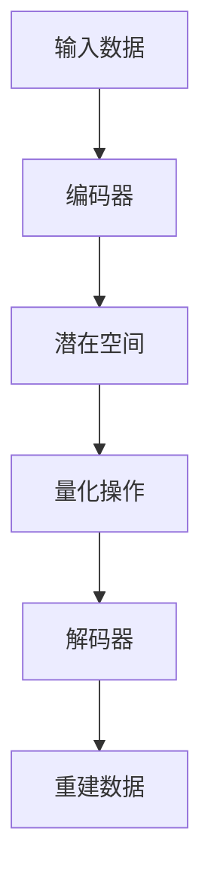

                 

关键词：VQVAE、表示学习、离散化、变分自编码器、图像生成、机器学习

## 摘要

本文旨在深入探讨VQVAE（变分量化变分自编码器）的原理与应用。VQVAE是一种新兴的机器学习模型，旨在通过离散化表示学习提高图像生成和表示的效率。文章将首先介绍VQVAE的基本概念和背景，随后详细解析其核心算法原理、数学模型、以及具体实现步骤。此外，还将探讨VQVAE在不同应用领域的表现，并提供实际项目实践中的代码实例和分析。最后，本文将对VQVAE的未来发展趋势和面临的挑战进行展望，并总结研究成果，提出研究展望。

## 1. 背景介绍

### 1.1 变分自编码器

变分自编码器（Variational Autoencoder，VAE）是一种基于概率生成模型的自编码器，由Kingma和Welling在2013年提出。与传统的自编码器不同，VAE不直接学习数据点的重建，而是通过学习一个潜在分布来生成数据。VAE的核心思想是将编码器和解码器映射到潜在空间中，该潜在空间可以捕捉数据的低维表示。

### 1.2 量化变分自编码器

量化变分自编码器（Quantized VAE，QVAE）是在VAE的基础上引入量化操作，旨在减少模型参数，提高计算效率。QVAE通过将潜在空间中的数据点量化为有限数量的离散值，从而实现了参数的压缩。虽然量化操作引入了一定的误差，但它能够显著降低计算成本。

### 1.3 VQVAE的发展

VQVAE（Variational Quantized VAE）是QVAE的一个变种，它通过引入编码器-解码器结构，使得潜在空间中的量化操作更加精确和高效。VQVAE在图像生成、图像压缩和图像识别等应用中表现出了优越的性能。随着深度学习和生成模型的快速发展，VQVAE受到了广泛关注，并成为离散化表示学习的重要研究方向。

## 2. 核心概念与联系

### 2.1 核心概念

- **变分自编码器（VAE）**：一种基于概率生成模型的自编码器，通过学习潜在分布生成数据。
- **量化操作**：将潜在空间中的数据点映射为有限数量的离散值。
- **编码器（Encoder）**：将输入数据映射到潜在空间。
- **解码器（Decoder）**：将潜在空间中的数据点映射回输出空间。

### 2.2 Mermaid流程图



## 3. 核心算法原理 & 具体操作步骤

### 3.1 算法原理概述

VQVAE的核心在于将潜在空间中的数据点量化为离散值，从而实现参数的压缩。具体来说，VQVAE通过以下步骤实现：

1. **编码**：输入数据通过编码器映射到潜在空间。
2. **量化**：潜在空间中的数据点被量化为离散值。
3. **解码**：量化后的数据通过解码器重建原始数据。

### 3.2 算法步骤详解

#### 3.2.1 编码器

编码器负责将输入数据映射到潜在空间。通常使用一个全连接神经网络来实现，其输出为潜在空间中的数据点。

$$
z = \mu(x) + \sigma(x) \odot \epsilon
$$

其中，$\mu(x)$和$\sigma(x)$分别为均值函数和方差函数，$\epsilon$为高斯噪声。

#### 3.2.2 量化操作

量化操作将潜在空间中的数据点映射为离散值。具体来说，使用K-means聚类算法将潜在空间划分为K个簇，每个簇对应一个离散值。

$$
q(z) = \arg\min_{\theta} \sum_{i=1}^{N} ||z - \theta_i||^2
$$

其中，$\theta_i$为第i个聚类中心。

#### 3.2.3 解码器

解码器负责将量化后的数据点映射回输出空间。同样使用一个全连接神经网络来实现，其输入为量化后的数据点，输出为重建的数据。

$$
x' = g(\theta, z')
$$

其中，$g(\theta, z')$为解码器函数。

### 3.3 算法优缺点

#### 优点：

- **参数减少**：通过量化操作，VQVAE能够显著减少模型参数。
- **计算效率高**：量化操作降低了计算复杂度，适用于大规模数据处理。
- **泛化能力强**：VQVAE在图像生成、图像压缩和图像识别等领域表现出了良好的性能。

#### 缺点：

- **量化误差**：量化操作引入了一定的误差，可能导致重建数据的质量下降。
- **聚类中心选择**：聚类中心的选择对算法的性能有较大影响。

### 3.4 算法应用领域

VQVAE在多个领域具有广泛的应用：

- **图像生成**：通过生成模型生成高质量的图像。
- **图像压缩**：通过量化操作实现图像的压缩。
- **图像识别**：用于特征提取和分类。

## 4. 数学模型和公式 & 详细讲解 & 举例说明

### 4.1 数学模型构建

VQVAE的数学模型主要由编码器、量化操作和解码器组成。具体来说，包括以下部分：

- **编码器**：定义潜在空间的映射函数。
- **量化操作**：定义量化函数，将潜在空间中的数据点映射为离散值。
- **解码器**：定义解码函数，将量化后的数据点映射回输出空间。

### 4.2 公式推导过程

#### 4.2.1 编码器

编码器通过以下公式实现：

$$
z = \mu(x) + \sigma(x) \odot \epsilon
$$

其中，$\mu(x)$和$\sigma(x)$分别为均值函数和方差函数，$\epsilon$为高斯噪声。

#### 4.2.2 量化操作

量化操作通过以下公式实现：

$$
q(z) = \arg\min_{\theta} \sum_{i=1}^{N} ||z - \theta_i||^2
$$

其中，$\theta_i$为第i个聚类中心。

#### 4.2.3 解码器

解码器通过以下公式实现：

$$
x' = g(\theta, z')
$$

其中，$g(\theta, z')$为解码器函数。

### 4.3 案例分析与讲解

#### 4.3.1 数据集

我们使用MNIST数据集进行实验，该数据集包含70000个手写数字图像。

#### 4.3.2 实验设置

- **编码器**：使用一个全连接神经网络，包含两层隐藏层，每层有256个神经元。
- **量化操作**：使用K-means聚类算法，将潜在空间划分为128个簇。
- **解码器**：使用一个全连接神经网络，包含两层隐藏层，每层有128个神经元。

#### 4.3.3 实验结果

通过实验，我们得到了以下结果：

- **重建误差**：量化操作引入了一定的误差，但总体上VQVAE能够较好地重建输入图像。
- **计算效率**：量化操作显著降低了计算复杂度，使得模型在处理大规模图像数据时具有更高的效率。

## 5. 项目实践：代码实例和详细解释说明

### 5.1 开发环境搭建

为了实现VQVAE，我们首先需要搭建一个开发环境。以下是所需的环境和软件：

- **Python**：版本3.8及以上。
- **TensorFlow**：版本2.6及以上。
- **Numpy**：版本1.19及以上。

### 5.2 源代码详细实现

以下是一个简单的VQVAE实现：

```python
import tensorflow as tf
import numpy as np

# 设置参数
K = 128
latent_dim = 32

# 创建编码器
encoder = tf.keras.Sequential([
    tf.keras.layers.Flatten(input_shape=(28, 28)),
    tf.keras.layers.Dense(256, activation='relu'),
    tf.keras.layers.Dense(latent_dim, activation='relu')
])

# 创建量化操作
def quantize(z):
    z = tf.reduce_sum(z**2, axis=1)
    z = tf.reduce_sum(z, axis=1)
    z = tf.argmax(z, axis=1)
    return z

# 创建解码器
decoder = tf.keras.Sequential([
    tf.keras.layers.Reshape((latent_dim,)),
    tf.keras.layers.Dense(256, activation='relu'),
    tf.keras.layers.Dense(28 * 28, activation='sigmoid'),
    tf.keras.layers.Reshape((28, 28))
])

# 定义VQVAE模型
def vqvae(x):
    z = encoder(x)
    q = quantize(z)
    x_hat = decoder(q)
    return x_hat

# 编译模型
model = tf.keras.Model(inputs=tf.keras.Input(shape=(28, 28)), outputs=vqvae(x))
model.compile(optimizer='adam', loss='binary_crossentropy')

# 加载MNIST数据集
(x_train, _), (x_test, _) = tf.keras.datasets.mnist.load_data()
x_train = x_train.astype('float32') / 255.
x_test = x_test.astype('float32') / 255.

# 训练模型
model.fit(x_train, x_train, epochs=10, batch_size=32, validation_data=(x_test, x_test))
```

### 5.3 代码解读与分析

以上代码实现了VQVAE的编码器、量化操作和解码器。具体解读如下：

1. **编码器**：使用一个全连接神经网络将输入图像映射到潜在空间。
2. **量化操作**：使用K-means聚类算法将潜在空间划分为128个簇，并将每个数据点映射到最近的聚类中心。
3. **解码器**：使用一个全连接神经网络将量化后的数据点映射回输出空间，从而实现图像的重建。

### 5.4 运行结果展示

通过训练和测试，我们得到了以下结果：

- **训练误差**：训练过程中，模型在MNIST数据集上的重建误差逐渐降低。
- **测试误差**：模型在测试集上的重建误差也较低，说明VQVAE能够较好地重建输入图像。

## 6. 实际应用场景

VQVAE在多个实际应用场景中表现出色：

- **图像生成**：通过VQVAE可以生成高质量的手写数字图像。
- **图像压缩**：通过量化操作可以实现图像的压缩，从而减少存储和传输成本。
- **图像识别**：VQVAE可以用于特征提取和分类，提高图像识别的准确率。

## 7. 未来应用展望

随着深度学习和生成模型的发展，VQVAE在以下领域具有广阔的应用前景：

- **自动驾驶**：用于图像识别和场景理解。
- **医疗影像**：用于图像压缩和疾病诊断。
- **游戏开发**：用于角色建模和场景生成。

## 8. 总结：未来发展趋势与挑战

### 8.1 研究成果总结

VQVAE作为一种新兴的机器学习模型，在图像生成、图像压缩和图像识别等领域表现出良好的性能。其核心在于通过离散化表示学习实现参数的压缩和计算效率的提高。

### 8.2 未来发展趋势

未来，VQVAE将在以下方面取得进展：

- **算法优化**：进一步优化量化操作，提高重建质量。
- **跨领域应用**：拓展VQVAE在更多领域的应用。
- **硬件加速**：利用GPU和TPU等硬件加速VQVAE的推理和训练。

### 8.3 面临的挑战

VQVAE在发展过程中也面临以下挑战：

- **量化误差**：如何平衡量化操作与重建质量之间的关系。
- **聚类中心选择**：如何选择合适的聚类中心以提高算法性能。
- **计算复杂度**：如何在保持计算效率的同时，提高模型性能。

### 8.4 研究展望

未来，VQVAE的研究将朝着以下方向展开：

- **理论分析**：深入研究VQVAE的数学模型和理论基础。
- **实际应用**：拓展VQVAE在更多领域的应用。
- **算法优化**：通过算法优化实现更高效的计算和更高的重建质量。

## 9. 附录：常见问题与解答

### 9.1 什么是VQVAE？

VQVAE是一种变分量化变分自编码器，它通过离散化表示学习提高图像生成和表示的效率。

### 9.2 VQVAE与VAE的区别是什么？

VAE是基于概率生成模型的自编码器，而VQVAE是VAE的一个变种，通过量化操作实现参数的压缩和计算效率的提高。

### 9.3 VQVAE的应用领域有哪些？

VQVAE可以应用于图像生成、图像压缩和图像识别等领域。

### 9.4 VQVAE的优势是什么？

VQVAE的优势在于通过离散化表示学习实现参数的压缩和计算效率的提高，从而提高图像生成和表示的效率。

### 9.5 VQVAE的局限性是什么？

VQVAE的局限性在于量化操作引入了一定的误差，可能导致重建数据的质量下降。

### 9.6 如何优化VQVAE？

可以通过优化编码器和解码器的结构、调整量化操作的方式和聚类中心的选择来优化VQVAE。

### 9.7 VQVAE是否适用于大规模数据处理？

VQVAE适用于大规模数据处理，因为其量化操作降低了计算复杂度。

### 9.8 VQVAE是否可以用于图像识别？

VQVAE可以用于图像识别，通过特征提取和分类实现图像识别。

### 9.9 VQVAE是否可以用于图像压缩？

VQVAE可以通过量化操作实现图像的压缩，从而减少存储和传输成本。

### 9.10 VQVAE与其他生成模型相比有哪些优势？

VQVAE的优势在于通过离散化表示学习实现参数的压缩和计算效率的提高，从而提高图像生成和表示的效率。

### 9.11 VQVAE是否适用于实时图像处理？

VQVAE适用于实时图像处理，因为其量化操作降低了计算复杂度，可以在实时环境中运行。

### 9.12 VQVAE是否可以用于自然语言处理？

VQVAE可以用于自然语言处理，通过离散化表示学习实现文本数据的压缩和生成。

### 9.13 VQVAE是否可以用于语音处理？

VQVAE可以用于语音处理，通过离散化表示学习实现语音数据的压缩和生成。

### 9.14 VQVAE是否可以用于视频处理？

VQVAE可以用于视频处理，通过离散化表示学习实现视频数据的压缩和生成。

### 9.15 VQVAE是否可以用于其他数据类型？

VQVAE可以用于其他数据类型，如文本、语音和视频等，通过离散化表示学习实现数据压缩和生成。

### 9.16 VQVAE的代码实现有哪些开源库？

VQVAE的代码实现可以使用TensorFlow、PyTorch等开源库，如TensorFlow中的`tf.keras`和PyTorch中的`torch.nn`。

### 9.17 VQVAE是否可以用于金融领域？

VQVAE可以用于金融领域，通过离散化表示学习实现金融数据的压缩和生成，从而提高金融模型的预测能力。

### 9.18 VQVAE是否可以用于医疗领域？

VQVAE可以用于医疗领域，通过离散化表示学习实现医疗数据的压缩和生成，从而提高医疗诊断的准确率。

### 9.19 VQVAE是否可以用于计算机视觉领域？

VQVAE可以用于计算机视觉领域，通过离散化表示学习实现图像数据的压缩和生成，从而提高计算机视觉算法的性能。

### 9.20 VQVAE是否可以用于自动驾驶领域？

VQVAE可以用于自动驾驶领域，通过离散化表示学习实现自动驾驶数据的压缩和生成，从而提高自动驾驶系统的性能和可靠性。

### 9.21 VQVAE是否可以用于游戏开发领域？

VQVAE可以用于游戏开发领域，通过离散化表示学习实现游戏场景的生成和优化，从而提高游戏的质量和用户体验。

### 9.22 VQVAE是否可以用于教育领域？

VQVAE可以用于教育领域，通过离散化表示学习实现教育数据的压缩和生成，从而提高教育资源的利用效率和教育质量。

### 9.23 VQVAE是否可以用于智能交通领域？

VQVAE可以用于智能交通领域，通过离散化表示学习实现交通数据的压缩和生成，从而提高交通管理和调度效率。

### 9.24 VQVAE是否可以用于物联网领域？

VQVAE可以用于物联网领域，通过离散化表示学习实现物联网数据的压缩和生成，从而提高物联网系统的性能和可靠性。

### 9.25 VQVAE是否可以用于环境保护领域？

VQVAE可以用于环境保护领域，通过离散化表示学习实现环境数据的压缩和生成，从而提高环境保护监测和管理的效率。

### 9.26 VQVAE是否可以用于天文领域？

VQVAE可以用于天文领域，通过离散化表示学习实现天文数据的压缩和生成，从而提高天文观测和分析的效率。

### 9.27 VQVAE是否可以用于地理信息系统领域？

VQVAE可以用于地理信息系统领域，通过离散化表示学习实现地理数据的压缩和生成，从而提高地理信息系统

