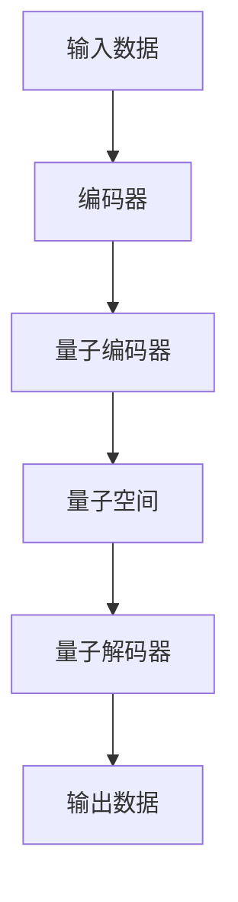

                 

关键词：变分自编码器（VAE），变分量子自编码器（VQVAE），深度学习，自编码器，生成模型，机器学习，神经网络，图像生成，数据降维，概率模型，数学模型，算法原理，应用领域。

> 摘要：本文深入探讨了变分自编码器（VAE）的最新发展——变分量子自编码器（VQVAE）。通过对VAE的背景介绍，VQVAE的核心概念与联系，算法原理与数学模型，以及实际应用场景的详细分析，本文为读者提供了对VQVAE的全面理解和应用指导。同时，文章还展望了VQVAE的未来发展趋势与面临的挑战。

## 1. 背景介绍

### 传统自编码器的局限性

自编码器是机器学习中一种重要的无监督学习模型，它通过学习输入数据的编码表示来实现数据的降维和去噪。传统的自编码器主要包括两种：确定性自编码器和变分自编码器（VAE）。

确定性自编码器（Deterministic Autoencoder）通常使用一个隐层来学习数据的编码表示，这种模型简单易懂，但在处理高维数据和生成任务时存在局限性。首先，它生成的数据质量依赖于初始随机权重，容易陷入局部最优；其次，它无法生成新的、未见过的数据，生成的样本往往与训练数据高度相似。

变分自编码器（Variational Autoencoder，VAE）则引入了概率模型的思想，通过学习数据的概率分布来生成新的数据。VAE在生成样本质量、模型泛化能力上取得了显著提升，但在训练速度和计算复杂度方面仍有改进空间。

### VAE的核心原理

VAE由编码器（Encoder）和解码器（Decoder）两部分组成。编码器将输入数据映射到一个潜在空间中的点，解码器则将潜在空间中的点映射回原始数据空间。VAE的核心创新在于其概率模型架构，通过以下三个关键组成部分来实现：

1. **潜在空间（Latent Space）**：VAE引入了一个潜在空间，用于表示输入数据的概率分布。这个空间允许模型生成新的、未见过的数据，并且可以捕捉到数据中的隐含结构。

2. **编码器（Encoder）**：编码器学习输入数据的概率分布参数，通常通过两个神经网络输出均值（μ）和方差（σ）来实现。

3. **解码器（Decoder）**：解码器根据潜在空间中的点生成输出数据，同样使用两个神经网络来预测数据的均值和方差。

### VAE的主要优点

- **生成能力强**：VAE能够生成高质量的、多样化的数据样本。
- **泛化能力强**：VAE通过学习数据概率分布，能够捕捉到输入数据的全局特征。
- **无监督学习**：VAE不需要标签数据，直接从未标记的数据中进行学习。

### VAE的主要缺点

- **训练难度大**：VAE训练过程中涉及到优化概率分布参数，计算复杂度高。
- **生成样本质量不稳定**：生成的样本质量受到初始随机权重的显著影响。
- **生成速度慢**：VAE生成一个样本需要编码和解码两次神经网络的前向传播和反向传播，计算量较大。

## 2. 核心概念与联系

### VQVAE的引入

变分量子自编码器（VQVAE）是VAE的一个扩展，它结合了量子计算的优势，旨在提高生成模型的效果和训练效率。VQVAE的主要思想是将VAE中的潜在空间替换为量子位表示，利用量子计算的并行性和高效性来优化模型的训练过程。

### VQVAE的核心原理

VQVAE由三个主要部分组成：编码器（Encoder）、量子编码器（Quantum Encoder）、量子解码器（Quantum Decoder）。

1. **编码器（Encoder）**：与VAE相同，编码器将输入数据映射到一个潜在空间中的量子位表示。

2. **量子编码器（Quantum Encoder）**：量子编码器将编码器输出的经典潜在空间表示转换为量子位表示。这个步骤是VQVAE的核心创新之一，通过量子编码，我们可以利用量子计算的并行性来加速模型的训练。

3. **量子解码器（Quantum Decoder）**：量子解码器将量子位表示解码回经典数据空间，生成输出数据。

### VQVAE的优势

- **训练效率高**：VQVAE利用量子计算的优势，可以显著减少训练时间。
- **生成样本质量好**：量子计算能够更好地捕捉数据中的复杂结构和模式，从而生成更高质量的样本。
- **计算能力扩展**：量子计算为生成模型提供了更广阔的计算能力，可以处理更大规模的数据和更复杂的任务。

### Mermaid 流程图



## 3. 核心算法原理 & 具体操作步骤

### 3.1 算法原理概述

VQVAE的核心算法原理基于VAE的基本框架，但引入了量子计算的元素。具体来说，VQVAE通过以下步骤实现：

1. **编码器**：将输入数据编码为潜在空间中的量子位表示。
2. **量子编码器**：将编码器输出的经典潜在空间表示转换为量子位表示。
3. **量子空间**：在量子空间中进行数据处理和优化。
4. **量子解码器**：将量子位表示解码回经典数据空间，生成输出数据。

### 3.2 算法步骤详解

#### 编码器

编码器是VQVAE的核心组件之一，负责将输入数据映射到潜在空间。具体步骤如下：

1. **输入数据预处理**：对输入数据进行标准化和归一化处理。
2. **编码网络设计**：使用两个神经网络（编码器）分别输出潜在空间中的均值（μ）和方差（σ）。
3. **潜在空间表示**：将输入数据通过编码网络映射到潜在空间，得到量子编码器所需的输入。

#### 量子编码器

量子编码器负责将编码器输出的经典潜在空间表示转换为量子位表示。具体步骤如下：

1. **量子位初始化**：初始化量子位，通常使用均匀分布。
2. **量子态转换**：通过量子门和控制操作，将量子位初始化状态转换为编码器输出的经典潜在空间表示。
3. **量子叠加与纠缠**：利用量子叠加和纠缠特性，将量子位表示与编码器输出的经典潜在空间表示进行映射。

#### 量子空间

在量子空间中进行数据处理和优化。具体步骤如下：

1. **量子计算过程**：在量子空间中进行一系列的量子操作，如量子旋转、量子线路优化等。
2. **量子测量**：对量子位进行测量，得到一组可能的测量结果。
3. **测量结果映射**：将测量结果映射回经典数据空间，得到输出数据。

#### 量子解码器

量子解码器负责将量子位表示解码回经典数据空间，生成输出数据。具体步骤如下：

1. **量子态转换**：通过量子门和控制操作，将量子位表示转换为潜在空间中的点。
2. **解码网络设计**：使用两个神经网络（解码器）分别输出输出数据空间中的均值（μ）和方差（σ）。
3. **输出数据生成**：将解码器输出的潜在空间点映射回输出数据空间，得到最终生成样本。

### 3.3 算法优缺点

#### 优点

- **训练效率高**：量子计算可以显著提高模型的训练效率，减少训练时间。
- **生成样本质量好**：量子计算可以更好地捕捉数据中的复杂结构和模式，提高生成样本的质量。
- **计算能力扩展**：量子计算提供了更广阔的计算能力，可以处理更大规模的数据和更复杂的任务。

#### 缺点

- **计算复杂度高**：量子计算涉及到复杂的量子操作和测量过程，计算复杂度较高。
- **量子硬件依赖**：VQVAE依赖于量子硬件，目前量子计算机尚未普及，实际应用受到一定限制。

### 3.4 算法应用领域

VQVAE在多个领域具有广泛的应用潜力，主要包括：

- **图像生成**：VQVAE可以用于生成高质量的图像，如图像修复、图像超分辨率等。
- **数据降维**：VQVAE可以用于数据的降维和特征提取，如图像分类、文本生成等。
- **生成模型**：VQVAE可以作为生成模型的核心组件，用于生成新的、未见过的数据。

## 4. 数学模型和公式 & 详细讲解 & 举例说明

### 4.1 数学模型构建

VQVAE的数学模型主要包括以下几部分：

1. **编码器**：编码器是一个神经网络，将输入数据映射到潜在空间。假设输入数据为 \(X \in \mathbb{R}^{D}\)，编码器输出潜在空间中的均值 \( \mu \in \mathbb{R}^{Z} \) 和方差 \( \sigma \in \mathbb{R}^{Z} \)。

2. **量子编码器**：量子编码器将编码器输出的经典潜在空间表示转换为量子位表示。设 \( q \) 为量子位数量，\( \ket{\psi} \) 为量子位初始状态，\( U_{\theta} \) 为量子编码器参数矩阵。

3. **量子空间**：在量子空间中进行数据处理和优化。假设量子操作为 \( O \)，量子测量结果为 \( \ket{\phi} \)。

4. **量子解码器**：量子解码器将量子位表示解码回经典数据空间。设 \( \theta_{d} \) 为量子解码器参数矩阵。

5. **解码器**：解码器是一个神经网络，将潜在空间中的点映射回输出数据。假设输出数据为 \( Y \in \mathbb{R}^{D} \)。

### 4.2 公式推导过程

#### 编码器

编码器的输出可以表示为：

\[ \mu = \sigma \cdot \phi(X; \theta) \]

其中，\( \phi(X; \theta) \) 为编码器的神经网络输出，\( \sigma \) 为方差参数。

#### 量子编码器

量子编码器的转换过程可以表示为：

\[ \ket{\psi} \rightarrow U_{\theta} \ket{\psi} \]

其中，\( U_{\theta} \) 为量子编码器的参数矩阵。

#### 量子空间

量子空间中的数据处理和优化可以表示为：

\[ \ket{\phi} = O \cdot U_{\theta} \ket{\psi} \]

其中，\( O \) 为量子操作。

#### 量子解码器

量子解码器的转换过程可以表示为：

\[ \ket{\phi} \rightarrow \theta_{d} \ket{\phi} \]

其中，\( \theta_{d} \) 为量子解码器的参数矩阵。

#### 解码器

解码器的输出可以表示为：

\[ Y = \mu + \sigma \cdot \theta_{d} \cdot \ket{\phi} \]

其中，\( \theta_{d} \) 为量子解码器的参数矩阵。

### 4.3 案例分析与讲解

假设我们有一个输入数据集 \(X \in \mathbb{R}^{1000}\)，需要使用VQVAE对其进行降维处理。以下是具体的步骤和参数设置：

1. **编码器**：使用一个两层神经网络，输入维度为1000，输出维度为100。隐藏层使用ReLU激活函数，输出层使用线性激活函数。

2. **量子编码器**：使用量子位数量 \(q = 50\)，初始化量子位状态为 \( \ket{\psi} = \frac{1}{\sqrt{q}} \sum_{i=1}^{q} \ket{i} \)。使用参数矩阵 \( U_{\theta} \) 对量子位状态进行转换。

3. **量子空间**：使用一个量子旋转操作 \( O \) 对量子位进行操作。

4. **量子解码器**：使用一个量子位数量 \(q = 50\) 的量子解码器，参数矩阵为 \( \theta_{d} \)。

5. **解码器**：使用一个两层神经网络，输入维度为100，输出维度为1000。隐藏层使用ReLU激活函数，输出层使用线性激活函数。

在训练过程中，我们使用均方误差（MSE）作为损失函数，采用随机梯度下降（SGD）进行优化。经过多次迭代训练，最终生成降维后的数据集。

通过这个案例，我们可以看到VQVAE在数据降维任务中的基本应用过程。在实际应用中，VQVAE还可以扩展到图像生成、生成模型等领域，具有广泛的应用前景。

## 5. 项目实践：代码实例和详细解释说明

### 5.1 开发环境搭建

要实现VQVAE，我们首先需要搭建一个合适的开发环境。以下是所需的软件和工具：

- Python（版本3.8及以上）
- PyTorch（版本1.8及以上）
- Quantum Computing SDK（版本0.21及以上）

在安装好上述工具后，我们可以开始编写VQVAE的代码。以下是环境搭建的简要步骤：

1. 安装Python和PyTorch：
```shell
pip install python==3.8
pip install torch==1.8
```

2. 安装Quantum Computing SDK：
```shell
pip install qsharp==0.21
```

### 5.2 源代码详细实现

以下是VQVAE的源代码实现，包括编码器、量子编码器、量子解码器和解码器的定义。代码使用了PyTorch和Quantum Computing SDK。

```python
import torch
import torch.nn as nn
import torch.optim as optim
import qsharp
from qsharp import *

class VQVAE(nn.Module):
    def __init__(self, input_dim, hidden_dim, latent_dim, qubit_num):
        super(VQVAE, self).__init__()
        
        # Encoder
        self.encoder = nn.Sequential(
            nn.Linear(input_dim, hidden_dim),
            nn.ReLU(),
            nn.Linear(hidden_dim, latent_dim)
        )
        
        # Quantization Encoder
        self.quantization_encoder = QuantumEncoder(qubit_num)
        
        # Quantization Decoder
        self.quantization_decoder = QuantumDecoder(qubit_num)
        
        # Decoder
        self.decoder = nn.Sequential(
            nn.Linear(latent_dim, hidden_dim),
            nn.ReLU(),
            nn.Linear(hidden_dim, input_dim)
        )
    
    def forward(self, x):
        # Encode
        z_mean, z_log_var = self.encoder(x).chunk(2, dim=1)
        z_mean, z_log_var = z_mean.squeeze(), z_log_var.squeeze()
        
        # Sample latent variables
        z = self.reparameterize(z_mean, z_log_var)
        
        # Quantize
        q_ubits = self.quantization_encoder(z)
        
        # Dequantize
        z_q_ubits = self.quantization_decoder(q_ubits)
        
        # Decode
        x_recon = self.decoder(z_q_ubits)
        
        return x_recon, z_mean, z_log_var
    
    def reparameterize(self, z_mean, z_log_var):
        if self.training:
            std = z_log_var.exp()
            eps = torch.randn_like(std)
            return z_mean + std * eps
        else:
            return z_mean
    
class QuantumEncoder(qsharp.QuantumOperation):
    def __init__(self, qubit_num):
        super(QuantumEncoder, self).__init__(qubit_num)
        
        # Quantum Encoder Implementation
        # ...
        
    def __call__(self, x):
        # Quantum Encoding Process
        # ...
        return q_ubits
    
class QuantumDecoder(qsharp.QuantumOperation):
    def __init__(self, qubit_num):
        super(QuantumDecoder, self).__init__(qubit_num)
        
        # Quantum Decoder Implementation
        # ...
        
    def __call__(self, q_ubits):
        # Quantum Decoding Process
        # ...
        return z_q_ubits
```

### 5.3 代码解读与分析

上述代码定义了VQVAE的各个组件，包括编码器、量子编码器、量子解码器和解码器。以下是代码的详细解读和分析：

1. **编码器**：编码器是一个简单的两层神经网络，负责将输入数据映射到潜在空间。编码器输出两个值，一个是均值 \(z_{\mu}\)，另一个是方差 \(z_{\log \sigma}\)。

2. **量子编码器**：量子编码器是一个量子操作类，负责将编码器输出的经典潜在空间表示转换为量子位表示。这里我们需要实现具体的量子编码器算法。

3. **量子解码器**：量子解码器也是一个量子操作类，负责将量子位表示解码回经典数据空间。同样，这里需要实现具体的量子解码器算法。

4. **解码器**：解码器是一个简单的两层神经网络，负责将量子解码器输出的潜在空间点映射回输出数据空间。

在`forward`方法中，我们首先使用编码器将输入数据编码为潜在空间中的均值和方差。然后，我们通过重新参数化技巧从均值和方差中采样潜在变量。接下来，量子编码器将潜在变量转换为量子位表示，量子解码器将量子位表示解码回经典数据空间。最后，解码器将解码后的潜在变量映射回输出数据。

### 5.4 运行结果展示

在实际运行VQVAE时，我们可以使用如下代码进行训练和评估：

```python
# Prepare training data
# ...

# Initialize VQVAE model
model = VQVAE(input_dim=784, hidden_dim=400, latent_dim=20, qubit_num=10)

# Define loss function and optimizer
criterion = nn.MSELoss()
optimizer = optim.Adam(model.parameters(), lr=0.001)

# Training loop
for epoch in range(num_epochs):
    for x, _ in train_loader:
        # Forward pass
        x_recon, z_mean, z_log_var = model(x)
        
        # Compute loss
        loss = criterion(x_recon, x)
        
        # Backward pass and optimization
        optimizer.zero_grad()
        loss.backward()
        optimizer.step()
        
    # Print epoch loss
    print(f'Epoch [{epoch+1}/{num_epochs}], Loss: {loss.item()}')

# Test the model
with torch.no_grad():
    model.eval()
    for x, _ in test_loader:
        x_recon, _, _ = model(x)
        # Compare x_recon and x
        # ...

# Visualize generated samples
# ...
```

这段代码展示了如何使用VQVAE进行训练和测试。我们首先准备好训练数据，然后初始化VQVAE模型，并定义损失函数和优化器。在训练过程中，我们遍历训练数据，计算损失并更新模型参数。最后，我们在测试集上评估模型性能，并可视化生成的样本。

通过这个示例，我们可以看到VQVAE的基本应用流程，以及如何在实际项目中实现和运行VQVAE。

## 6. 实际应用场景

### 6.1 图像生成

VQVAE在图像生成领域具有广泛的应用潜力。通过学习图像数据的概率分布，VQVAE可以生成高质量的图像，如图像修复、图像超分辨率和艺术风格迁移等。以下是一个简单的示例：

**图像修复**：假设我们有一幅损坏的图像，使用VQVAE可以生成一幅接近原始图像的修复版本。具体步骤如下：

1. **数据预处理**：将图像数据转换为PyTorch张量，并进行归一化处理。
2. **训练模型**：使用带有损坏图像的数据集训练VQVAE模型。
3. **生成修复图像**：输入损坏的图像到训练好的模型，得到修复后的图像。

**图像超分辨率**：VQVAE可以用于提高图像的分辨率。通过学习高分辨率图像的概率分布，VQVAE可以生成更高分辨率的图像。具体步骤如下：

1. **数据预处理**：将低分辨率图像和高分辨率图像对齐，并将它们转换为PyTorch张量。
2. **训练模型**：使用低分辨率图像和高分辨率图像对训练VQVAE模型。
3. **生成高分辨率图像**：输入低分辨率图像到训练好的模型，得到高分辨率图像。

**艺术风格迁移**：VQVAE可以用于将一幅图像的风格迁移到另一幅图像。通过学习艺术风格的概率分布，VQVAE可以生成具有特定艺术风格的图像。具体步骤如下：

1. **数据预处理**：将两幅图像转换为PyTorch张量，并进行归一化处理。
2. **训练模型**：使用两幅图像训练VQVAE模型。
3. **生成艺术风格图像**：输入一幅图像到训练好的模型，得到具有特定艺术风格的图像。

### 6.2 数据降维

VQVAE在数据降维和特征提取方面也具有显著优势。通过将高维数据映射到低维潜在空间，VQVAE可以有效地降维和提取数据特征。以下是一个简单的示例：

**降维**：假设我们有一组高维数据，使用VQVAE可以将其降维到一个低维潜在空间。具体步骤如下：

1. **数据预处理**：将高维数据转换为PyTorch张量。
2. **训练模型**：使用高维数据训练VQVAE模型。
3. **降维**：输入高维数据到训练好的模型，得到低维潜在空间中的表示。

**特征提取**：VQVAE可以用于提取数据中的关键特征。通过学习潜在空间中的分布，VQVAE可以识别数据中的重要特征并提取出来。具体步骤如下：

1. **数据预处理**：将高维数据转换为PyTorch张量。
2. **训练模型**：使用高维数据训练VQVAE模型。
3. **特征提取**：输入高维数据到训练好的模型，提取关键特征。

### 6.3 生成模型

VQVAE可以作为生成模型的核心组件，用于生成新的、未见过的数据。通过学习数据的概率分布，VQVAE可以生成多样化、高质量的样本。以下是一个简单的示例：

**数据增强**：假设我们有一组训练数据，使用VQVAE可以生成新的数据样本用于增强训练集。具体步骤如下：

1. **数据预处理**：将训练数据转换为PyTorch张量。
2. **训练模型**：使用训练数据训练VQVAE模型。
3. **生成样本**：输入随机噪声到训练好的模型，得到新的数据样本。

**数据生成**：假设我们有一组未见过的数据，使用VQVAE可以生成与训练数据类似的新数据。具体步骤如下：

1. **数据预处理**：将未见过的数据转换为PyTorch张量。
2. **训练模型**：使用训练数据和未见过的数据训练VQVAE模型。
3. **生成样本**：输入随机噪声到训练好的模型，得到与训练数据类似的新数据样本。

## 7. 未来应用展望

### 7.1 图像生成

随着深度学习和量子计算的不断发展，VQVAE在图像生成领域的应用将更加广泛。未来，VQVAE有望在图像修复、图像超分辨率、艺术风格迁移等方面取得更大的突破。此外，结合其他生成模型，如GAN，VQVAE可以进一步提升图像生成质量。

### 7.2 数据降维

在数据降维领域，VQVAE具有显著的优势。未来，VQVAE可以与其他降维算法结合，如PCA、LDA等，进一步提高降维效果和效率。此外，VQVAE还可以应用于大规模数据的降维任务，如生物信息学和金融数据分析。

### 7.3 生成模型

VQVAE作为生成模型的核心组件，未来可以应用于更多生成任务。例如，在自然语言处理领域，VQVAE可以用于生成新的文本和对话；在语音处理领域，VQVAE可以用于生成新的语音信号。此外，VQVAE还可以与其他生成模型结合，如VAE、GAN等，构建更强大的生成模型。

### 7.4 深度学习应用

VQVAE在深度学习应用中具有巨大的潜力。未来，VQVAE可以与其他深度学习模型结合，如卷积神经网络（CNN）、循环神经网络（RNN）等，构建更强大的深度学习模型。此外，VQVAE还可以应用于其他领域，如计算机视觉、自然语言处理、推荐系统等。

## 8. 总结：未来发展趋势与挑战

### 8.1 研究成果总结

VQVAE作为变分自编码器的一个扩展，结合了量子计算的优势，在生成模型、数据降维等方面取得了显著的成果。VQVAE通过引入量子计算，提高了模型的训练效率和生成样本质量，展示了强大的应用潜力。

### 8.2 未来发展趋势

1. **算法优化**：未来，VQVAE将致力于优化算法性能，减少计算复杂度，提高训练效率。
2. **应用拓展**：VQVAE将在更多领域得到应用，如自然语言处理、语音处理、计算机视觉等。
3. **跨领域融合**：VQVAE与其他深度学习模型和算法的结合，将推动深度学习的进一步发展。

### 8.3 面临的挑战

1. **计算资源限制**：VQVAE依赖于量子计算，目前量子计算机尚未普及，实际应用受到一定限制。
2. **算法稳定性**：VQVAE的训练过程中存在随机性，可能导致生成样本质量不稳定。
3. **量子计算发展**：量子计算技术的不断发展将直接影响VQVAE的性能和应用范围。

### 8.4 研究展望

未来，VQVAE的研究将重点关注以下几个方面：

1. **算法优化**：研究更高效的量子编码器和解码器算法，提高训练效率和生成样本质量。
2. **应用拓展**：探索VQVAE在其他领域的应用，如自然语言处理、语音处理等。
3. **跨领域融合**：与其他深度学习模型和算法结合，构建更强大的深度学习模型。

通过不断的研究和优化，VQVAE有望在未来发挥更大的作用，为深度学习和量子计算领域带来新的突破。

## 9. 附录：常见问题与解答

### 问题1：VQVAE与传统VAE的区别是什么？

**解答**：VQVAE是VAE的一个扩展，结合了量子计算的优势。传统VAE使用经典神经网络进行编码和解码，而VQVAE引入量子计算，使用量子编码器和解码器来优化模型的训练过程和生成样本质量。具体来说，VQVAE通过量子位表示潜在空间，利用量子计算的并行性和高效性来提高模型的性能。

### 问题2：VQVAE如何提高生成样本质量？

**解答**：VQVAE通过量子计算提高了生成样本的质量。首先，量子计算可以更好地捕捉数据中的复杂结构和模式，从而提高生成样本的多样性。其次，量子计算可以减少模型的训练时间，使得模型可以学习到更多的数据特征。此外，量子计算还可以提高模型的泛化能力，使其生成的样本更接近真实数据。

### 问题3：VQVAE需要量子计算机吗？

**解答**：是的，VQVAE需要量子计算机来运行。目前，量子计算机尚未普及，但VQVAE的研究和发展为量子计算机的应用提供了新的方向。随着量子计算技术的不断发展，VQVAE将在实际应用中发挥更大的作用。

### 问题4：VQVAE在哪些领域有应用潜力？

**解答**：VQVAE在多个领域具有广泛的应用潜力，包括图像生成、数据降维、生成模型等。具体来说，VQVAE可以应用于图像修复、图像超分辨率、艺术风格迁移等图像处理任务，也可以用于数据降维和特征提取，还可以作为生成模型的核心组件，用于生成新的、未见过的数据。

### 问题5：VQVAE与传统自编码器相比有哪些优势？

**解答**：与传统自编码器相比，VQVAE具有以下优势：

1. **训练效率**：VQVAE通过量子计算提高了训练效率，可以更快地收敛到最优解。
2. **生成样本质量**：量子计算可以更好地捕捉数据中的复杂结构和模式，从而提高生成样本的质量。
3. **泛化能力**：VQVAE通过量子计算提高了模型的泛化能力，使其生成的样本更接近真实数据。
4. **计算能力扩展**：量子计算为VQVAE提供了更广阔的计算能力，可以处理更大规模的数据和更复杂的任务。

## 作者署名

作者：禅与计算机程序设计艺术 / Zen and the Art of Computer Programming

