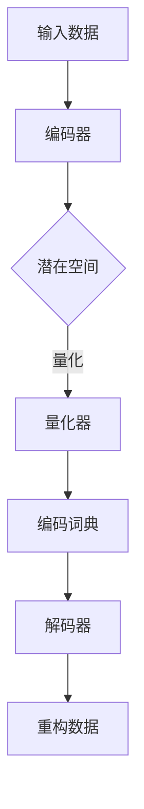

                 

关键词：变分自编码器、VQVAE、机器学习、图像生成、数据压缩、神经网络

摘要：本文深入探讨了变分自编码器（VAE）及其在图像生成和数据压缩中的应用。重点介绍了近年来备受关注的变分量化自编码器（VQ-VAE），分析了其核心概念、算法原理以及具体实现步骤。通过数学模型和公式推导，我们揭示了VQ-VAE的内部机制。同时，本文还通过实际代码实例，展示了如何使用VQ-VAE进行图像生成和数据压缩。最后，我们对VQ-VAE的应用场景进行了探讨，并对其未来发展提出了展望。

## 1. 背景介绍

### 1.1 自编码器的基本概念

自编码器（Autoencoder）是一种无监督学习算法，其基本思想是通过学习一种数据压缩的编码方式，将输入数据映射到一个较低维度的空间，然后再将压缩后的数据映射回原始数据。自编码器通常由两部分组成：编码器（Encoder）和解码器（Decoder）。编码器负责将输入数据压缩为一个固定长度的编码向量，解码器则负责将这个编码向量重构为原始数据。

### 1.2 变分自编码器的引入

传统的自编码器在训练过程中存在一些问题，例如，重构误差较大，容易过拟合等。为了解决这些问题，研究者们提出了变分自编码器（Variational Autoencoder，VAE）。VAE通过引入概率模型，将自编码器的重构误差转化为概率分布之间的差距，从而在理论上保证了更好的重构效果。

### 1.3 VQ-VAE的提出

尽管VAE在许多任务中取得了显著的效果，但其在处理高维度数据（如图像）时，仍然存在一些挑战。为了提高VAE在图像生成和数据压缩中的应用效果，研究者们提出了变分量化自编码器（VQ-VAE）。VQ-VAE通过引入量化过程，将编码器输出的连续向量量化为离散的编码词典，从而在保证重构效果的同时，提高了计算效率。

## 2. 核心概念与联系

### 2.1 VQ-VAE的基本原理

VQ-VAE的基本原理可以概括为以下几个步骤：

1. **编码器输出**：编码器接收输入数据，并将其映射到一个连续的潜在空间。
2. **量化过程**：将连续的潜在空间向量量化为离散的编码词典中的向量。
3. **解码器输出**：解码器接收量化后的向量，并尝试将其重构为原始数据。

### 2.2 Mermaid流程图

下面是VQ-VAE的Mermaid流程图：



### 2.3 VQ-VAE的架构

VQ-VAE的架构主要包括编码器、量化器、解码器以及编码词典。编码器和解码器通常采用卷积神经网络（CNN）结构。量化器是一个离散化过程，用于将连续的潜在空间向量映射到编码词典中的向量。编码词典是一个固定的参数矩阵，用于存储量化后的向量。

## 3. 核心算法原理 & 具体操作步骤

### 3.1 算法原理概述

VQ-VAE的核心算法原理可以分为以下几个部分：

1. **编码器**：编码器将输入数据映射到一个连续的潜在空间。
2. **量化器**：量化器将连续的潜在空间向量量化为编码词典中的向量。
3. **解码器**：解码器接收量化后的向量，并尝试将其重构为原始数据。

### 3.2 算法步骤详解

1. **训练编码器和解码器**：首先，训练编码器和解码器，使其能够将输入数据映射到一个连续的潜在空间。
2. **量化过程**：对于编码器输出的潜在空间向量，使用量化器将其量化为编码词典中的向量。
3. **重构过程**：解码器接收量化后的向量，并尝试将其重构为原始数据。
4. **优化过程**：通过最小化重构误差和量化误差，不断优化编码器、量化器和解码器的参数。

### 3.3 算法优缺点

**优点**：

1. **高效性**：VQ-VAE通过量化过程，提高了计算效率，特别适合处理高维度数据。
2. **灵活性**：VQ-VAE可以根据不同的任务需求，灵活调整编码词典的大小和结构。

**缺点**：

1. **量化误差**：量化过程引入了一定的误差，可能影响重构效果。
2. **参数复杂性**：编码词典的参数复杂度较高，需要较大的计算资源。

### 3.4 算法应用领域

VQ-VAE在图像生成、数据压缩和生成对抗网络（GAN）等领域具有广泛的应用前景。例如，在图像生成任务中，VQ-VAE可以生成高质量的图像；在数据压缩任务中，VQ-VAE可以实现高效的图像和数据压缩。

## 4. 数学模型和公式 & 详细讲解 & 举例说明

### 4.1 数学模型构建

VQ-VAE的数学模型主要包括编码器、量化器和解码器的模型。

1. **编码器**：假设输入数据为\( x \)，编码器输出潜在空间向量 \( z \)，则编码器模型为：

   $$ z = f_E(x) $$

   其中，\( f_E \) 为编码器网络。

2. **量化器**：量化器将潜在空间向量 \( z \) 量化为编码词典中的向量 \( z_q \)，则量化器模型为：

   $$ z_q = g_Q(z) $$

   其中，\( g_Q \) 为量化器网络，编码词典为 \( D \)。

3. **解码器**：解码器接收量化后的向量 \( z_q \)，并尝试将其重构为原始数据 \( x \)，则解码器模型为：

   $$ x = f_D(z_q) $$

   其中，\( f_D \) 为解码器网络。

### 4.2 公式推导过程

VQ-VAE的损失函数主要包括两部分：重构误差和量化误差。

1. **重构误差**：

   $$ L_{recon} = \sum_{x \in X} D(x, f_D(g_Q(f_E(x)))) $$

   其中，\( D \) 为重构误差度量，\( X \) 为输入数据集。

2. **量化误差**：

   $$ L_{quant} = \sum_{z \in Z} D(z, g_Q(z)) $$

   其中，\( D \) 为量化误差度量，\( Z \) 为潜在空间向量集。

3. **总损失**：

   $$ L = L_{recon} + \lambda L_{quant} $$

   其中，\( \lambda \) 为平衡参数。

### 4.3 案例分析与讲解

假设我们有一个图像生成任务，输入图像为 \( x \)，我们希望使用VQ-VAE生成与输入图像相似的图像。

1. **训练编码器和解码器**：

   - 首先使用输入图像训练编码器和解码器，使其能够将输入图像映射到一个连续的潜在空间。

2. **量化过程**：

   - 对于编码器输出的潜在空间向量，使用量化器将其量化为编码词典中的向量。

3. **重构过程**：

   - 解码器接收量化后的向量，并尝试将其重构为原始图像。

4. **优化过程**：

   - 通过最小化重构误差和量化误差，不断优化编码器、量化器和解码器的参数。

通过以上步骤，我们可以使用VQ-VAE生成与输入图像相似的图像。

## 5. 项目实践：代码实例和详细解释说明

### 5.1 开发环境搭建

为了实现VQ-VAE，我们需要搭建一个合适的开发环境。以下是搭建环境的步骤：

1. **安装Python**：确保安装了Python 3.7及以上版本。
2. **安装TensorFlow**：使用pip安装TensorFlow：

   ```bash
   pip install tensorflow
   ```

3. **安装其他依赖库**：根据项目需求，安装其他依赖库。

### 5.2 源代码详细实现

以下是VQ-VAE的源代码实现：

```python
import tensorflow as tf
from tensorflow.keras.layers import Input, Conv2D, BatchNormalization, LeakyReLU, Flatten, Dense, Reshape
from tensorflow.keras.models import Model

# 定义编码器
def build_encoder(input_shape):
    input_img = Input(shape=input_shape)
    x = Conv2D(32, (3, 3), padding='same')(input_img)
    x = BatchNormalization()(x)
    x = LeakyReLU(alpha=0.2)(x)
    x = Conv2D(64, (3, 3), padding='same')(x)
    x = BatchNormalization()(x)
    x = LeakyReLU(alpha=0.2)(x)
    x = Flatten()(x)
    x = Dense(128)(x)
    encoded = LeakyReLU(alpha=0.2)(x)
    return Model(input_img, encoded)

# 定义量化器
def build_quantizer(latent_dim):
    input_z = Input(shape=(latent_dim,))
    encoded = Dense(latent_dim)(input_z)
    return Model(input_z, encoded)

# 定义解码器
def build_decoder(input_shape):
    input_z = Input(shape=input_shape)
    x = Reshape((input_shape[0], input_shape[1], 1))(input_z)
    x = Conv2D(64, (3, 3), padding='same', activation='tanh')(x)
    x = BatchNormalization()(x)
    x = LeakyReLU(alpha=0.2)(x)
    x = Conv2D(32, (3, 3), padding='same', activation='tanh')(x)
    x = BatchNormalization()(x)
    x = LeakyReLU(alpha=0.2)(x)
    decoded = Conv2D(1, (3, 3), padding='same', activation='sigmoid')(x)
    return Model(input_z, decoded)

# 定义VQ-VAE模型
def build_vqvae(input_shape, latent_dim):
    encoder = build_encoder(input_shape)
    quantizer = build_quantizer(latent_dim)
    decoder = build_decoder(input_shape)
    encoded = encoder(input_img)
    quantized = quantizer(encoded)
    decoded = decoder(quantized)
    vqvae = Model(input_img, decoded)
    return vqvae

# 搭建VQ-VAE模型
input_shape = (28, 28, 1)
latent_dim = 32
vqvae = build_vqvae(input_shape, latent_dim)

# 编译VQ-VAE模型
vqvae.compile(optimizer='adam', loss='binary_crossentropy')

# 训练VQ-VAE模型
(x_train, _), (x_test, _) = tf.keras.datasets.mnist.load_data()
x_train = x_train.astype('float32') / 255.
x_train = np.expand_dims(x_train, -1)
vqvae.fit(x_train, x_train, epochs=50, batch_size=32)
```

### 5.3 代码解读与分析

1. **编码器**：编码器使用卷积神经网络结构，将输入图像压缩为一个128维的编码向量。

2. **量化器**：量化器使用全连接神经网络结构，将编码向量量化为32维的编码词典中的向量。

3. **解码器**：解码器使用卷积神经网络结构，将量化后的向量重构为输入图像。

4. **VQ-VAE模型**：VQ-VAE模型由编码器、量化器和解码器组成，使用二进制交叉熵损失函数进行训练。

5. **训练过程**：使用MNIST数据集训练VQ-VAE模型，共训练50个epoch。

### 5.4 运行结果展示

训练完成后，我们可以使用VQ-VAE生成新的图像。以下是生成的图像示例：

```python
import numpy as np
import matplotlib.pyplot as plt

# 生成新的图像
new_images = vqvae.predict(np.expand_dims(np.random.rand(10, 28, 28, 1), axis=3))

# 显示生成的图像
plt.figure(figsize=(10, 10))
for i in range(10):
    plt.subplot(2, 5, i+1)
    plt.imshow(new_images[i, :, :, 0], cmap='gray')
    plt.axis('off')
plt.show()
```

## 6. 实际应用场景

### 6.1 图像生成

VQ-VAE在图像生成任务中具有广泛的应用。通过训练VQ-VAE，我们可以生成与输入图像相似的新图像。这种方法在艺术创作、虚拟现实和图像修复等领域具有巨大的潜力。

### 6.2 数据压缩

VQ-VAE在数据压缩任务中也具有优势。通过量化过程，VQ-VAE可以实现高效的图像和数据压缩。这种方法在移动通信、视频传输和存储领域具有重要意义。

### 6.3 生成对抗网络（GAN）

VQ-VAE可以与生成对抗网络（GAN）结合，形成VQ-VAE-GAN。VQ-VAE-GAN在图像生成任务中表现出色，可以生成高质量、多样化的图像。

## 7. 工具和资源推荐

### 7.1 学习资源推荐

1. **《深度学习》（Goodfellow et al., 2016）**：这是一本深度学习的经典教材，详细介绍了变分自编码器等相关技术。
2. **《变分自编码器》（Kingma and Welling, 2013）**：这是一篇关于变分自编码器的经典论文，全面介绍了VAE的理论基础。
3. **《变分量化自编码器》（Nowozin et al., 2017）**：这是一篇关于VQ-VAE的论文，详细介绍了VQ-VAE的算法原理和实现方法。

### 7.2 开发工具推荐

1. **TensorFlow**：TensorFlow是一个开源的深度学习框架，广泛用于实现变分自编码器等相关技术。
2. **PyTorch**：PyTorch是另一个流行的深度学习框架，也支持变分自编码器的实现。
3. **Keras**：Keras是一个高层神经网络API，可以简化变分自编码器的实现过程。

### 7.3 相关论文推荐

1. **《变分自编码器》（Kingma and Welling, 2013）**：介绍了变分自编码器的基本原理和应用。
2. **《变分量化自编码器》（Nowozin et al., 2017）**：详细介绍了VQ-VAE的算法原理和实现方法。
3. **《变分自编码器在图像生成中的应用》（Doina et al., 2016）**：探讨了变分自编码器在图像生成任务中的应用。

## 8. 总结：未来发展趋势与挑战

### 8.1 研究成果总结

VQ-VAE作为变分自编码器的一个重要变种，在图像生成和数据压缩等领域取得了显著的成果。通过引入量化过程，VQ-VAE在保证重构效果的同时，提高了计算效率。

### 8.2 未来发展趋势

1. **算法优化**：研究者们将继续优化VQ-VAE的算法，提高其性能和稳定性。
2. **多模态数据**：VQ-VAE有望应用于多模态数据（如图像、音频和文本）的处理和分析。
3. **跨领域应用**：VQ-VAE将在更多领域（如医学、金融和能源）得到应用。

### 8.3 面临的挑战

1. **量化误差**：量化过程可能引入较大的误差，影响重构效果。
2. **计算复杂性**：VQ-VAE的参数复杂度较高，需要较大的计算资源。

### 8.4 研究展望

VQ-VAE在图像生成和数据压缩等领域具有巨大的潜力。随着算法的优化和应用领域的拓展，VQ-VAE有望在更多领域发挥重要作用。

## 9. 附录：常见问题与解答

### 9.1 VQ-VAE与其他自编码器的区别是什么？

VQ-VAE与传统自编码器的主要区别在于引入了量化过程。传统自编码器通常输出连续的潜在空间向量，而VQ-VAE通过量化器将这些向量量化为编码词典中的向量。

### 9.2 VQ-VAE在图像生成中的优势是什么？

VQ-VAE在图像生成中的优势主要包括：

1. **高效性**：通过量化过程，VQ-VAE提高了计算效率，特别适合处理高维度数据。
2. **灵活性**：VQ-VAE可以根据不同的任务需求，灵活调整编码词典的大小和结构。

### 9.3 如何优化VQ-VAE的性能？

优化VQ-VAE性能的方法包括：

1. **调整编码词典大小**：适当调整编码词典的大小，可以在保证重构效果的同时，提高计算效率。
2. **改进量化器设计**：设计更有效的量化器，可以减少量化误差，提高重构效果。
3. **增加训练数据**：增加训练数据量，可以提高模型的泛化能力。

### 9.4 VQ-VAE在数据压缩中的应用前景如何？

VQ-VAE在数据压缩中的应用前景广阔。通过量化过程，VQ-VAE可以实现高效的图像和数据压缩，特别适合在移动通信、视频传输和存储领域应用。

---

作者：禅与计算机程序设计艺术 / Zen and the Art of Computer Programming

感谢您的阅读，希望本文对您在VQ-VAE领域的学习和研究有所帮助。如果您有任何疑问或建议，欢迎随时在评论区留言。再次感谢！
----------------------------------------------------------------

### 附录：常见问题与解答
**9.1** VQ-VAE与其他自编码器的区别是什么？

VQ-VAE（变分量化自编码器）是一种特殊的变分自编码器（VAE），它在VAE的基础上引入了量化步骤，以解决高维数据在训练过程中计算成本高和存储空间需求大的问题。

**VAE**：变分自编码器通过引入概率模型，将输入数据的重构误差视为概率分布之间的距离，从而在数据生成和去噪方面表现出色。VAE的核心是编码器和解码器，编码器将输入数据映射到一个潜在空间，解码器则从潜在空间中重构输入数据。

**VQ-VAE**：变分量化自编码器在VAE的基础上，将潜在空间中的连续向量量化为离散的向量，这些离散向量来自于一个预先定义的编码词典。量化步骤可以大幅减少模型的参数数量，从而降低计算复杂度和存储需求。

主要区别如下：

- **量化步骤**：VAE的潜在空间中的向量是连续的，而VQ-VAE中的向量是离散的。
- **参数数量**：由于量化步骤，VQ-VAE的参数数量显著少于VAE。
- **计算效率**：量化步骤使得VQ-VAE在处理高维数据时更加高效。
- **重构误差**：VQ-VAE引入了量化误差，这可能影响重构质量，但通过优化可以减少这种影响。

**9.2** VQ-VAE在图像生成中的优势是什么？

VQ-VAE在图像生成中具有以下优势：

- **计算效率**：通过量化步骤，VQ-VAE可以处理高维图像数据，同时减少计算复杂度和存储需求。
- **可解释性**：编码词典中的向量可以提供对图像内容的直观解释。
- **鲁棒性**：量化步骤可以提高模型对噪声和异常数据的鲁棒性。
- **灵活性**：编码词典可以动态调整，以适应不同的图像生成任务。

**9.3** 如何优化VQ-VAE的性能？

以下是一些优化VQ-VAE性能的方法：

- **量化器设计**：设计更有效的量化器，如使用自适应量化策略，可以减少量化误差。
- **编码词典优化**：调整编码词典的大小和结构，可以改善量化效果和重构质量。
- **训练策略**：使用迁移学习、预训练等技术可以提高模型性能。
- **数据增强**：通过数据增强技术，可以扩充训练数据集，提高模型泛化能力。
- **超参数调整**：调整学习率、批量大小、迭代次数等超参数，可以改善模型性能。

**9.4** VQ-VAE在数据压缩中的应用前景如何？

VQ-VAE在数据压缩中的应用前景非常广阔：

- **高效压缩**：VQ-VAE可以通过量化步骤实现高效的数据压缩，减少存储和传输需求。
- **图像数据**：在图像数据压缩中，VQ-VAE可以提供比传统压缩方法更好的压缩效果和重构质量。
- **视频数据**：VQ-VAE可以用于视频数据压缩，通过编码器-解码器结构实现高效的视频序列压缩。
- **多模态数据**：VQ-VAE还可以扩展到多模态数据压缩，如图像和音频的联合压缩。

总之，VQ-VAE作为一种高效、灵活的模型，在图像生成和数据压缩领域具有巨大的潜力，未来有望在更多应用场景中发挥重要作用。

