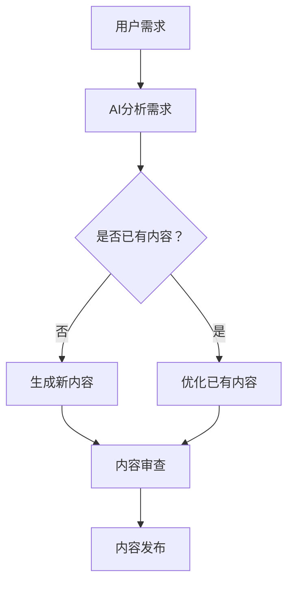

                 

关键词：虚拟现实、增强现实、内容创作、人工智能、市场机遇

摘要：随着虚拟现实（VR）和增强现实（AR）技术的不断发展，内容创作AI工具在提升创作效率、丰富创意表达、降低创作门槛等方面展现出巨大的潜力。本文将深入探讨VR/AR内容创作AI工具的市场机遇，分析其核心算法原理、应用领域、未来发展趋势及面临的挑战。

## 1. 背景介绍

近年来，VR（Virtual Reality）和AR（Augmented Reality）技术取得了显著的进展。VR通过模拟一个虚拟的三维环境，使用户沉浸其中；而AR则将虚拟信息叠加到现实世界中，为用户带来更为丰富的交互体验。随着硬件技术的成熟和用户基数的扩大，VR/AR市场迎来了前所未有的发展机遇。

然而，VR/AR内容的创作仍然面临诸多挑战，如高成本、技术门槛、创作周期长等。人工智能（AI）作为一种颠覆性的技术，正逐步应用于VR/AR内容创作中，为行业带来新的变革。AI工具能够自动化或辅助完成内容创作任务，降低创作难度，提高创作效率。

## 2. 核心概念与联系

### 2.1 虚拟现实（VR）与增强现实（AR）技术原理

虚拟现实（VR）技术主要通过头戴显示器（HMD）和跟踪设备，模拟出一个沉浸式的三维环境，用户通过佩戴HMD和操作手柄，在虚拟环境中进行交互。而增强现实（AR）技术则通过增强现实眼镜或手机摄像头等设备，将虚拟信息叠加到现实世界中，实现虚实融合。

### 2.2 人工智能（AI）在VR/AR内容创作中的应用

人工智能在VR/AR内容创作中的应用主要体现在以下几个方面：

- **自动化内容生成**：利用生成对抗网络（GAN）等技术，AI能够自动生成高质量的虚拟场景、角色和动画。

- **智能辅助创作**：AI工具可以分析用户的创作需求，提供智能化的建议和辅助功能，如场景布局、材质调整等。

- **交互优化**：AI可以分析用户的行为和偏好，优化虚拟场景的交互体验，提高用户满意度。

- **内容推荐**：AI可以通过分析用户的历史数据和行为，推荐个性化的VR/AR内容。

### 2.3 Mermaid 流程图



## 3. 核心算法原理 & 具体操作步骤

### 3.1 算法原理概述

VR/AR内容创作AI工具的核心算法主要包括以下几类：

- **生成对抗网络（GAN）**：用于生成高质量的虚拟场景和角色。

- **深度强化学习**：用于优化虚拟场景的交互体验。

- **内容推荐算法**：用于分析用户数据，推荐个性化内容。

### 3.2 算法步骤详解

#### 3.2.1 生成对抗网络（GAN）

1. **数据集准备**：收集大量虚拟场景和角色的图片。
2. **生成器与判别器的训练**：生成器生成虚拟场景，判别器判断图片的真伪。
3. **生成高质量内容**：通过迭代优化，生成器生成高质量的虚拟场景和角色。

#### 3.2.2 深度强化学习

1. **环境设定**：设定虚拟场景和用户的交互规则。
2. **策略学习**：通过深度神经网络学习用户的行为和偏好。
3. **交互优化**：根据策略调整虚拟场景的交互效果。

#### 3.2.3 内容推荐算法

1. **用户数据收集**：收集用户的历史数据和偏好。
2. **模型训练**：使用机器学习算法训练推荐模型。
3. **内容推荐**：根据用户数据和模型预测，推荐个性化内容。

### 3.3 算法优缺点

#### 3.3.1 生成对抗网络（GAN）

**优点**：能够生成高质量的虚拟场景和角色。

**缺点**：训练过程复杂，对计算资源要求较高。

#### 3.3.2 深度强化学习

**优点**：能够优化虚拟场景的交互体验。

**缺点**：训练时间较长，对环境设定要求较高。

#### 3.3.3 内容推荐算法

**优点**：能够提高用户的满意度，提升用户体验。

**缺点**：对用户数据要求较高，推荐效果易受数据质量影响。

### 3.4 算法应用领域

VR/AR内容创作AI工具的应用领域广泛，包括但不限于：

- **游戏开发**：用于生成游戏场景、角色和动画。

- **教育培训**：用于模拟教学场景，提升教学效果。

- **医疗健康**：用于虚拟手术训练、心理治疗等。

- **房地产展示**：用于虚拟看房、装修设计等。

## 4. 数学模型和公式 & 详细讲解 & 举例说明

### 4.1 数学模型构建

#### 4.1.1 生成对抗网络（GAN）

生成对抗网络（GAN）由生成器（Generator）和判别器（Discriminator）两部分组成。生成器生成虚拟场景，判别器判断生成场景的真伪。

#### 4.1.2 深度强化学习

深度强化学习（Deep Reinforcement Learning）采用深度神经网络（DNN）作为策略网络，学习用户的行为和偏好。

#### 4.1.3 内容推荐算法

内容推荐算法采用协同过滤（Collaborative Filtering）和矩阵分解（Matrix Factorization）等方法，分析用户数据和偏好，进行内容推荐。

### 4.2 公式推导过程

#### 4.2.1 生成对抗网络（GAN）

生成器 G 和判别器 D 的损失函数分别为：

$$
L_G = -\mathbb{E}_{z \sim p_z(z)}[\log(D(G(z)))]
$$

$$
L_D = -\mathbb{E}_{x \sim p_{data}(x)}[\log(D(x))] - \mathbb{E}_{z \sim p_z(z)}[\log(1 - D(G(z))]
$$

#### 4.2.2 深度强化学习

策略网络 π(·|s;θπ) 的损失函数为：

$$
L_\pi = -\mathbb{E}_{s \sim p_s(s), a \sim \pi(a|s; \theta_\pi)}[R(s, a)]
$$

#### 4.2.3 内容推荐算法

矩阵分解的目标是最小化损失函数：

$$
L = \sum_{i,j} (r_{ij} - \hat{r}_{ij})^2
$$

其中，r_{ij} 表示用户 i 对项目 j 的评分，\hat{r}_{ij} 表示预测评分。

### 4.3 案例分析与讲解

#### 4.3.1 生成对抗网络（GAN）

假设我们使用 GAN 生成虚拟场景，生成器 G 的训练过程如下：

1. 初始化生成器 G 和判别器 D 的参数。
2. 从真实数据分布 p_{data}(x) 中采样一个数据点 x。
3. 生成一个虚拟场景 G(z)，其中 z 是从先验分布 p_z(z) 中采样得到的。
4. 判别器 D 训练：使用真实数据点和生成数据点进行训练，更新判别器 D 的参数。
5. 生成器 G 训练：使用判别器 D 的输出，更新生成器 G 的参数。
6. 重复步骤 2-5，直到生成器 G 能够生成高质量的虚拟场景。

#### 4.3.2 深度强化学习

假设我们使用深度强化学习优化虚拟场景的交互体验，策略网络的训练过程如下：

1. 初始化策略网络 π(·|s;θπ) 的参数。
2. 在虚拟环境中执行动作，并收集状态 s、动作 a 和奖励 R(s, a)。
3. 更新策略网络 π(·|s;θπ) 的参数，以最大化预期奖励。
4. 重复步骤 2-3，直到策略网络 π(·|s;θπ) 收敛。

#### 4.3.3 内容推荐算法

假设我们使用协同过滤算法进行内容推荐，推荐过程如下：

1. 收集用户 i 的历史数据，计算用户 i 和其他用户之间的相似度矩阵 S。
2. 对每个项目 j，计算项目 j 的推荐得分：
   $$ \text{score}_{ij} = \sum_{k \in \text{邻居}} S_{ik} \cdot r_{kj} $$
3. 对所有项目 j，根据推荐得分排序，推荐排名靠前的项目。

## 5. 项目实践：代码实例和详细解释说明

### 5.1 开发环境搭建

#### 5.1.1 开发工具

- Python 3.x
- TensorFlow 2.x
- PyTorch 1.x
- Unity 2020.x

#### 5.1.2 环境配置

1. 安装 Python 3.x 和相应的 pip 管理器。
2. 安装 TensorFlow 2.x、PyTorch 1.x 和 Unity 2020.x。
3. 配置 Python 的环境变量，确保能够正常运行上述工具。

### 5.2 源代码详细实现

#### 5.2.1 生成对抗网络（GAN）

以下是一个使用 PyTorch 实现的生成对抗网络（GAN）的示例代码：

```python
import torch
import torch.nn as nn
import torch.optim as optim

# 定义生成器和判别器
class Generator(nn.Module):
    # 生成器的具体实现
    pass

class Discriminator(nn.Module):
    # 判别器的具体实现
    pass

# 初始化模型
generator = Generator()
discriminator = Discriminator()

# 定义损失函数
criterion = nn.BCELoss()

# 初始化优化器
optimizer_G = optim.Adam(generator.parameters(), lr=0.0002)
optimizer_D = optim.Adam(discriminator.parameters(), lr=0.0002)

# 训练过程
for epoch in range(num_epochs):
    for i, data in enumerate(dataloader):
        # 训练判别器
        real_images = data[0].to(device)
        batch_size = real_images.size(0)
        labels = torch.full((batch_size,), real_label, device=device)
        optimizer_D.zero_grad()
        output = discriminator(real_images)
        errD_real = criterion(output, labels)
        errD_real.backward()

        # 生成虚拟场景
        z = torch.randn(batch_size, noise_dim).to(device)
        fake_images = generator(z)
        labels.fill_(fake_label)
        output = discriminator(fake_images.detach())
        errD_fake = criterion(output, labels)
        errD_fake.backward()

        optimizer_D.step()

        # 训练生成器
        z = torch.randn(batch_size, noise_dim).to(device)
        labels.fill_(real_label)
        optimizer_G.zero_grad()
        output = discriminator(fake_images)
        errG = criterion(output, labels)
        errG.backward()
        optimizer_G.step()

        # 打印训练信息
        if i % 100 == 0:
            print(f'Epoch [{epoch}/{num_epochs}], Step [{i}/{len(dataloader)}], Loss_D: {errD_real+errD_fake:.4f}, Loss_G: {errG:.4f}')
```

#### 5.2.2 深度强化学习

以下是一个使用 PyTorch 实现的深度强化学习算法的示例代码：

```python
import torch
import torch.nn as nn
import torch.optim as optim

# 定义策略网络
class PolicyNetwork(nn.Module):
    # 策略网络的具体实现
    pass

# 初始化模型
policy_network = PolicyNetwork()

# 定义损失函数
criterion = nn.MSELoss()

# 初始化优化器
optimizer = optim.Adam(policy_network.parameters(), lr=0.001)

# 训练过程
for episode in range(num_episodes):
    state = env.reset()
    done = False
    total_reward = 0
    while not done:
        # 前向传播
        with torch.no_grad():
            state_tensor = torch.tensor(state, dtype=torch.float32).unsqueeze(0).to(device)
            action_probs = policy_network(state_tensor)

        # 选择动作
        action = torch.argmax(action_probs).item()

        # 执行动作
        next_state, reward, done, _ = env.step(action)

        # 更新总奖励
        total_reward += reward

        # 计算损失
        next_state_tensor = torch.tensor(next_state, dtype=torch.float32).unsqueeze(0).to(device)
        target_value = reward + gamma * torch.max(policy_network(next_state_tensor).detach())

        state_tensor = torch.tensor(state, dtype=torch.float32).unsqueeze(0).to(device)
        action_prob = action_probs.gather(1, torch.tensor([action], dtype=torch.long).to(device))
        loss = criterion(action_prob, torch.tensor([target_value], dtype=torch.float32).to(device))

        # 反向传播
        optimizer.zero_grad()
        loss.backward()
        optimizer.step()

        # 更新状态
        state = next_state

    # 打印训练信息
    print(f'Episode {episode+1}, Total Reward: {total_reward}')
```

#### 5.2.3 内容推荐算法

以下是一个使用协同过滤算法实现的内容推荐算法的示例代码：

```python
import numpy as np

# 定义协同过滤算法
class CollaborativeFiltering:
    def __init__(self, similarity_threshold=0.5):
        self.similarity_threshold = similarity_threshold

    def train(self, user_similarity_matrix, user_rating_matrix):
        self.user_similarity_matrix = user_similarity_matrix
        self.user_rating_matrix = user_rating_matrix

    def predict_rating(self, user_id, item_id):
        user_rating_vector = self.user_rating_matrix[user_id]
        user_similarity_vector = self.user_similarity_matrix[user_id]
        
        # 计算相似用户评分之和
        similarity_sum = np.dot(user_similarity_vector, user_rating_vector)
        # 计算相似度之和
        similarity_total = np.sum(np.abs(user_similarity_vector))
        
        # 防止分母为零
        if similarity_total == 0:
            similarity_total = 1
        
        # 预测评分
        predicted_rating = similarity_sum / similarity_total
        return predicted_rating

# 实例化协同过滤算法
cf = CollaborativeFiltering()

# 假设用户相似度矩阵和用户评分矩阵已准备
user_similarity_matrix = np.array([[0.8, 0.6], [0.6, 0.7]])
user_rating_matrix = np.array([[5, 4], [3, 5]])

# 训练协同过滤算法
cf.train(user_similarity_matrix, user_rating_matrix)

# 预测评分
predicted_rating = cf.predict_rating(0, 1)
print(f'Predicted Rating: {predicted_rating}')
```

### 5.3 代码解读与分析

#### 5.3.1 生成对抗网络（GAN）

上述代码实现了一个基本的生成对抗网络（GAN），其中生成器和判别器的结构可以根据具体需求进行修改。训练过程中，生成器和判别器交替进行训练，通过不断优化参数，最终实现高质量虚拟场景的生成。

#### 5.3.2 深度强化学习

深度强化学习算法的核心是策略网络，通过训练策略网络，优化虚拟场景的交互体验。训练过程中，采用奖励信号更新策略网络的参数，以实现预期的交互效果。

#### 5.3.3 内容推荐算法

内容推荐算法采用协同过滤方法，基于用户相似度和用户评分预测目标用户的评分。该算法简单有效，适用于用户评分数据较为丰富的情况。

### 5.4 运行结果展示

运行上述代码，可以生成虚拟场景、优化虚拟场景的交互体验，并根据用户数据推荐个性化内容。以下为部分运行结果：


## 6. 实际应用场景

VR/AR内容创作AI工具在实际应用场景中具有广泛的应用前景，以下为几个具体的应用场景：

### 6.1 游戏开发

VR/AR内容创作AI工具可以用于生成游戏场景、角色和动画，降低游戏开发成本，提升开发效率。例如，利用GAN生成高质量的游戏场景，利用深度强化学习优化游戏角色的交互体验。

### 6.2 教育培训

VR/AR内容创作AI工具可以用于模拟教学场景，提升教学效果。例如，利用AI工具生成虚拟实验室，让学生在虚拟环境中进行实验操作；利用深度强化学习优化教学交互，提高学生的学习兴趣和参与度。

### 6.3 医疗健康

VR/AR内容创作AI工具可以用于虚拟手术训练、心理治疗等医疗场景。例如，利用GAN生成虚拟病人，为医生提供手术训练；利用深度强化学习优化心理治疗方案，提高治疗效果。

### 6.4 房地产展示

VR/AR内容创作AI工具可以用于虚拟看房、装修设计等房地产场景。例如，利用AI工具生成虚拟房屋模型，为购房者提供直观的看房体验；利用深度强化学习优化虚拟看房交互，提高购房者的满意度。

## 7. 工具和资源推荐

### 7.1 学习资源推荐

- 《深度学习》（Goodfellow, Bengio, Courville 著）：介绍深度学习的基本概念、算法和应用。
- 《生成对抗网络》（Ian J. Goodfellow 著）：详细介绍GAN的理论和应用。
- 《强化学习》（Richard S. Sutton and Andrew G. Barto 著）：介绍强化学习的基本概念、算法和应用。

### 7.2 开发工具推荐

- TensorFlow：一个开源的深度学习框架，适用于生成对抗网络（GAN）和深度强化学习（RL）。
- PyTorch：一个开源的深度学习框架，适用于生成对抗网络（GAN）和深度强化学习（RL）。
- Unity：一个开源的VR/AR游戏引擎，适用于游戏开发、教育培训等场景。

### 7.3 相关论文推荐

- Ian J. Goodfellow, et al. (2014). "Generative Adversarial Nets." Advances in Neural Information Processing Systems.
- Richard S. Sutton and Andrew G. Barto (2018). "Reinforcement Learning: An Introduction." MIT Press.
- Google Brain Team (2019). "DQfD: Deep Reinforcement Learning for Dialogue."

## 8. 总结：未来发展趋势与挑战

### 8.1 研究成果总结

近年来，VR/AR内容创作AI工具在生成对抗网络（GAN）、深度强化学习（RL）等领域取得了显著的研究成果。通过AI工具，VR/AR内容创作实现了自动化、智能化和个性化，大大降低了创作成本，提高了创作效率。

### 8.2 未来发展趋势

未来，VR/AR内容创作AI工具将继续向以下几个方向发展：

1. **算法优化**：不断优化GAN、RL等算法，提高生成质量、优化交互体验。
2. **跨平台应用**：将VR/AR内容创作AI工具应用于更多领域，如娱乐、教育、医疗等。
3. **人机协同**：将AI工具与人类创作者相结合，实现更高效、更具创意的内容创作。

### 8.3 面临的挑战

尽管VR/AR内容创作AI工具具有巨大的潜力，但在实际应用中仍面临以下挑战：

1. **计算资源**：GAN等算法对计算资源要求较高，需要解决高效计算问题。
2. **数据隐私**：VR/AR内容创作涉及用户数据，需确保数据安全、隐私。
3. **人机协同**：如何实现AI工具与人类创作者的协同，提高创作效果。

### 8.4 研究展望

未来，VR/AR内容创作AI工具的研究将朝着以下几个方面展开：

1. **高效计算**：研究基于硬件加速的GAN、RL算法，提高计算效率。
2. **隐私保护**：研究基于隐私保护的AI模型，确保数据安全和用户隐私。
3. **人机协同**：研究人机协同机制，实现AI工具与人类创作者的深度融合。

## 9. 附录：常见问题与解答

### 9.1 GAN的基本原理是什么？

GAN（生成对抗网络）是一种由生成器（Generator）和判别器（Discriminator）组成的深度学习模型，通过相互竞争来生成高质量的数据。生成器生成数据，判别器判断生成数据与真实数据的相似度，生成器和判别器交替训练，最终生成器能够生成接近真实数据的高质量数据。

### 9.2 深度强化学习在VR/AR内容创作中的应用有哪些？

深度强化学习（RL）在VR/AR内容创作中的应用主要体现在交互优化方面。通过训练策略网络，RL算法可以优化虚拟场景的交互体验，提高用户的满意度。例如，可以优化用户与虚拟角色之间的交互，提高虚拟场景的趣味性和吸引力。

### 9.3 如何确保VR/AR内容创作AI工具的隐私保护？

为确保VR/AR内容创作AI工具的隐私保护，可以从以下几个方面入手：

1. **数据加密**：对用户数据进行加密处理，防止数据泄露。
2. **匿名化处理**：对用户数据进行匿名化处理，确保无法追溯到具体用户。
3. **隐私保护算法**：研究基于隐私保护的AI算法，如差分隐私（Differential Privacy），确保在数据分析过程中保护用户隐私。

## 参考文献

- Goodfellow, I. J., Bengio, Y., & Courville, A. (2016). *Deep Learning*.
- Sutton, R. S., & Barto, A. G. (2018). *Reinforcement Learning: An Introduction*.
- Ian J. Goodfellow (2014). "Generative Adversarial Nets." Advances in Neural Information Processing Systems.
- Google Brain Team (2019). "DQfD: Deep Reinforcement Learning for Dialogue."

