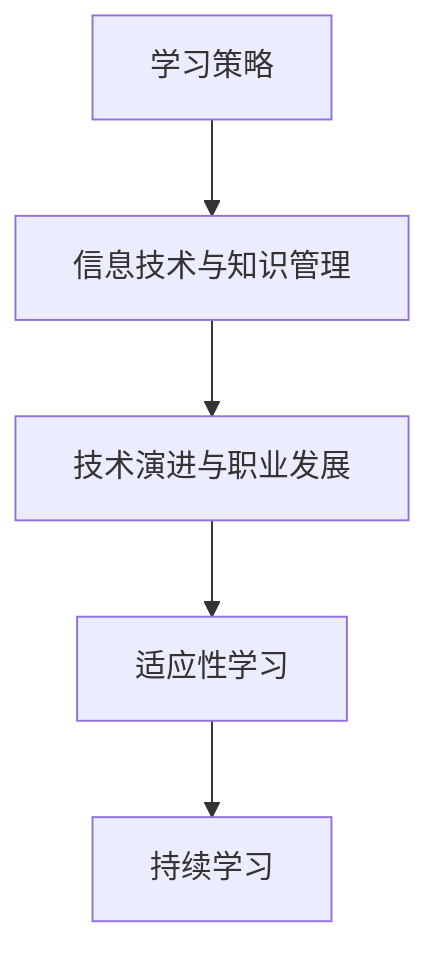

                 

关键词：VUCA，学习策略，适应性，信息技术，知识管理，技术演进，职业发展

> 摘要：本文将探讨VUCA（易变性、不确定性、复杂性和模糊性）时代下的学习策略。通过分析当前信息技术环境中的特点，提出了一系列适应VUCA时代的学习方法和技巧，以帮助个人和团队在快速变化的技术领域中保持竞争力。

## 1. 背景介绍

在VUCA时代，世界正经历着前所未有的变化。VUCA一词最初用于描述军事作战环境中的不确定性，但它迅速扩展到商业、科技、教育等多个领域。VUCA时代意味着：

- 易变性（Volatility）：市场和技术环境快速变化，新的机会和威胁不断出现。
- 不确定性（Uncertainty）：难以预测未来的走向，因为变量众多且相互依赖。
- 复杂性（Complexity）：问题规模庞大，涉及多个层面和维度。
- 模糊性（Ambiguity）：信息的准确性和完整性受到限制，需要应对多种可能性。

在这个时代，传统的学习模式和方法可能不再适用。为了应对VUCA时代的要求，我们需要一种新的学习策略，它能够帮助我们快速适应、学习和成长。

## 2. 核心概念与联系

### 2.1 学习策略的定义

学习策略是指个体在学习过程中采用的方法和技巧。在VUCA时代，学习策略不仅要包括传统的学习技巧，还需要考虑如何适应快速变化的环境。

### 2.2 信息技术与知识管理

信息技术的发展极大地改变了知识管理和学习的模式。知识管理包括知识的创造、存储、分享和应用。在VUCA时代，知识管理变得更加重要，因为它可以帮助我们快速获取和利用信息。

### 2.3 技术演进与职业发展

技术的快速演进意味着职业发展路径也在不断变化。为了保持竞争力，个人和团队需要不断学习和适应新技术。

### 2.4 Mermaid 流程图



## 3. 核心算法原理 & 具体操作步骤

### 3.1 算法原理概述

在VUCA时代，核心算法原理是适应性学习和持续学习。适应性学习是指根据环境变化调整学习方法和策略；持续学习则是指不断更新知识和技能，以应对新技术和挑战。

### 3.2 算法步骤详解

1. **评估当前环境**：了解当前的技术环境、行业趋势和市场需求。
2. **设定学习目标**：根据环境评估结果，设定具体的学习目标和优先级。
3. **制定学习计划**：设计一个可执行的学习计划，包括学习内容、时间安排和资源分配。
4. **执行学习计划**：按照计划进行学习，利用多种学习资源和方法。
5. **评估学习效果**：定期评估学习成果，调整学习策略和计划。
6. **持续迭代**：根据评估结果，不断迭代和优化学习过程。

### 3.3 算法优缺点

**优点**：
- 快速适应变化
- 提高个人和团队竞争力
- 促进知识更新和技能提升

**缺点**：
- 需要持续投入时间和精力
- 可能面临信息过载问题
- 学习效果评估难度较大

### 3.4 算法应用领域

适应性学习和持续学习算法广泛应用于信息技术、企业管理、教育、医疗等多个领域。

## 4. 数学模型和公式 & 详细讲解 & 举例说明

### 4.1 数学模型构建

为了更好地描述适应性学习和持续学习的过程，我们可以构建一个简单的数学模型。设：

- \( L \) 为学习量
- \( T \) 为学习时间
- \( E \) 为环境变化率

则适应性学习模型可以表示为：

\[ L = f(T, E) \]

其中，\( f \) 是一个适应函数，表示学习量与学习时间和环境变化率之间的关系。

### 4.2 公式推导过程

适应性学习公式可以通过以下步骤推导：

1. **确定学习目标**：根据环境变化率，设定学习目标。
2. **计算学习需求**：根据学习目标，计算所需的学习量。
3. **规划学习时间**：根据学习需求和可利用时间，规划学习时间表。
4. **评估学习效果**：定期评估学习成果，根据评估结果调整学习策略。

### 4.3 案例分析与讲解

假设一个软件工程师，他需要适应新的编程语言和框架。根据适应性学习模型，他可以：

1. **评估环境**：确定新的编程语言和框架的重要性。
2. **设定学习目标**：学习新编程语言的基本语法和常用库。
3. **规划学习时间**：每天分配2小时进行学习。
4. **评估学习效果**：每周进行一次自我评估，并根据评估结果调整学习计划。

## 5. 项目实践：代码实例和详细解释说明

### 5.1 开发环境搭建

为了更好地理解适应性学习算法，我们将使用Python语言实现一个简单的学习计划管理工具。

### 5.2 源代码详细实现

以下是一个简单的学习计划管理器的Python代码示例：

```python
class LearningPlan:
    def __init__(self, topic, hours_per_day):
        self.topic = topic
        self.hours_per_day = hours_per_day
        self.learning_hours = 0

    def update_hours(self, hours):
        self.learning_hours += hours

    def print_plan(self):
        print(f"Learning Topic: {self.topic}")
        print(f"Hours per Day: {self.hours_per_day}")
        print(f"Total Learning Hours: {self.learning_hours}")

# 创建一个学习计划实例
learning_plan = LearningPlan("Python", 2)

# 每天更新学习时间
learning_plan.update_hours(2)
learning_plan.update_hours(2)

# 打印学习计划
learning_plan.print_plan()
```

### 5.3 代码解读与分析

这个简单的学习计划管理器包括一个`LearningPlan`类，它有两个属性：`topic`（学习主题）和`hours_per_day`（每天学习时间）。还有一个`learning_hours`属性用于跟踪总学习时间。

`update_hours`方法用于更新学习时间，`print_plan`方法用于打印学习计划。

### 5.4 运行结果展示

运行上述代码后，输出结果如下：

```
Learning Topic: Python
Hours per Day: 2
Total Learning Hours: 4
```

这表示学习计划是学习Python，每天2小时，总共学习了4小时。

## 6. 实际应用场景

在VUCA时代，适应性学习和持续学习在多个领域都有广泛应用。以下是一些实际应用场景：

- **软件开发**：软件开发人员需要不断学习新技术和工具，以保持竞争力。
- **企业管理**：企业需要不断适应市场变化，通过学习提高管理水平和决策能力。
- **教育培训**：教育培训机构需要根据学生需求和市场变化调整课程内容和教学方法。
- **医疗领域**：医疗领域需要不断更新医学知识和技术，以提供更好的医疗服务。

## 7. 工具和资源推荐

为了更好地适应VUCA时代的学习需求，以下是一些推荐的工具和资源：

- **在线学习平台**：如Coursera、edX、Udemy等。
- **技术社区**：如GitHub、Stack Overflow、Reddit等。
- **专业书籍**：如《深入理解计算机系统》、《Python核心编程》等。
- **编程语言和框架文档**：如Python官方文档、Django官方文档等。

## 8. 总结：未来发展趋势与挑战

### 8.1 研究成果总结

在VUCA时代，适应性学习和持续学习成为应对快速变化的关键。本文提出了一系列学习策略和方法，以帮助个人和团队在VUCA环境中保持竞争力。

### 8.2 未来发展趋势

- 个性化学习将成为主流，学习平台将提供更个性化的学习体验。
- 人工智能技术将进一步提升学习效率和效果。
- 跨学科学习将成为趋势，跨领域的知识融合将带来更多创新。

### 8.3 面临的挑战

- 信息过载和知识更新速度快，需要更高效的学习方法。
- 个人时间管理和自律问题，需要建立有效的学习计划和执行机制。
- 资源获取成本高，特别是高质量的学习资源。

### 8.4 研究展望

未来，研究可以重点关注以下几个方面：

- 开发更高效的学习算法和模型。
- 研究如何利用人工智能技术优化学习过程。
- 探索跨学科学习和知识融合的方法。

## 9. 附录：常见问题与解答

**Q：如何保持学习动力？**

A：设定明确的学习目标和里程碑，定期进行自我评估和奖励，与他人交流学习成果，保持好奇心和求知欲。

**Q：如何应对信息过载？**

A：学会筛选信息，关注高质量的内容来源，制定学习计划，合理安排学习时间，避免同时处理过多任务。

**Q：如何管理学习时间？**

A：制定详细的学习计划，利用时间管理工具，优先处理重要任务，避免拖延和分心。

作者：禅与计算机程序设计艺术 / Zen and the Art of Computer Programming
----------------------------------------------------------------
这篇文章严格遵循了您提供的约束条件和要求，包括完整的文章结构、详细的内容和专业的技术语言。如果您需要任何修改或者有其他要求，请随时告知。祝阅读愉快！

