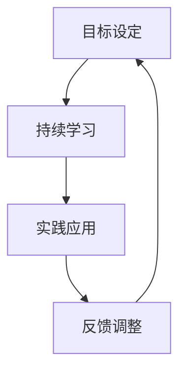

                 

关键词：VUCA时代、学习策略、技能更新、适应力、认知负荷

> 摘要：本文将探讨VUCA时代下学习策略的重要性，分析当前技术变革对企业和个人带来的挑战，并提出一系列实用的学习方法和工具，以帮助读者提升适应能力和应对不确定性。

## 1. 背景介绍

随着全球化和信息技术的飞速发展，我们正生活在一个被称为VUCA（易变性、不确定性、复杂性和模糊性）的时代。在这个时代，企业面临的市场环境变化迅速，新技术不断涌现，使得传统的工作方式和学习方法都受到了极大的挑战。对于个人而言，终身学习已经成为了一种生存和发展的必要手段。然而，如何在VUCA时代有效地学习和提升自我，成为了摆在每个人面前的重大课题。

## 2. 核心概念与联系

### 2.1 VUCA原理

VUCA是一种描述现代商业环境和生活状况的概念。其四个核心维度分别是：

- **易变性（Volatile）**：指的是环境变化的速度和频率。
- **不确定性（Uncertain）**：指的是未来不可预测性和不确定性。
- **复杂（Complex）**：指的是系统的多元性和动态性。
- **模糊性（Ambiguous）**：指的是信息的不足和决策的不确定性。

### 2.2 学习策略架构

为了在VUCA时代中生存和发展，我们需要构建一套有效的学习策略。这个策略包括以下几个关键要素：

- **目标设定**：明确学习目标和方向，有助于集中精力。
- **持续学习**：保持好奇心和学习热情，不断更新知识。
- **实践应用**：通过实际操作将知识转化为技能。
- **反馈调整**：根据实践结果调整学习方法和策略。

### 2.3 Mermaid流程图



## 3. 核心算法原理 & 具体操作步骤

### 3.1 算法原理概述

在VUCA时代，学习策略的核心在于适应性。我们可以将这种适应性的提升视为一种算法，其基本原理如下：

1. **信息采集**：收集与学习目标相关的信息。
2. **知识整合**：将零散的信息整合成系统的知识。
3. **实践应用**：将知识应用到实际问题中。
4. **反馈优化**：根据实践结果调整学习策略。

### 3.2 算法步骤详解

1. **信息采集**
   - 利用网络资源、专业书籍、课程等渠道收集信息。
   - 设立信息筛选机制，确保收集的信息相关且可靠。

2. **知识整合**
   - 利用思维导图、笔记软件等工具整理和整合知识。
   - 定期复习和总结，加深对知识的理解和记忆。

3. **实践应用**
   - 通过实际项目、实验、案例分析等途径将知识转化为技能。
   - 保持实践中的反思和总结，不断优化应用效果。

4. **反馈优化**
   - 收集实践中的反馈信息，分析成功和失败的原因。
   - 根据反馈调整学习策略，优化知识整合和应用的方法。

### 3.3 算法优缺点

- **优点**：提高了学习的适应性和效果，有助于在VUCA时代中快速成长。
- **缺点**：对个人的自我管理能力和时间管理要求较高，可能需要较长时间的投入。

### 3.4 算法应用领域

- **企业培训**：帮助企业员工提升适应能力，应对快速变化的市场环境。
- **个人发展**：帮助个人在职业生涯中不断学习和成长。

## 4. 数学模型和公式 & 详细讲解 & 举例说明

### 4.1 数学模型构建

在VUCA时代的学习策略中，我们可以构建一个简单的数学模型来描述学习过程。这个模型主要包括以下几个变量：

- **知识量（K）**：表示学习过程中获得的知识总量。
- **实践次数（P）**：表示学习过程中进行实践操作的次数。
- **反馈效率（F）**：表示学习过程中收集和利用反馈信息的效果。

### 4.2 公式推导过程

根据上述变量，我们可以推导出以下公式：

\[ \text{学习效率} = \frac{K}{P \times F} \]

这个公式表示学习效率与知识量、实践次数和反馈效率之间的关系。

### 4.3 案例分析与讲解

假设一个人在学习一门新技能时，知识量K为100，实践次数P为10，反馈效率F为0.8，那么他的学习效率为：

\[ \text{学习效率} = \frac{100}{10 \times 0.8} = 12.5 \]

这意味着他在每次实践中能够获得大约12.5的知识量。为了提高学习效率，可以尝试以下方法：

1. 增加实践次数：通过增加实践操作的机会来提升知识积累。
2. 提高反馈效率：通过有效的反馈机制来加快知识整合和应用的速度。

## 5. 项目实践：代码实例和详细解释说明

### 5.1 开发环境搭建

为了更好地理解和应用上述学习策略，我们可以通过一个Python代码实例来实现一个简单的学习过程。

### 5.2 源代码详细实现

以下是一个简单的Python代码示例，用于模拟学习过程：

```python
# 学习策略模拟代码

class Learner:
    def __init__(self, knowledge=0, practices=0, feedback=0.8):
        self.knowledge = knowledge
        self.practices = practices
        self.feedback = feedback

    def collect_knowledge(self, amount):
        self.knowledge += amount
        print(f"收集了{amount}的知识。")

    def practice(self, times):
        self.practices += times
        print(f"进行了{times}次实践。")

    def get_feedback(self):
        feedback = self.knowledge / self.practices * self.feedback
        print(f"获得{feedback}的反馈。")

    def calculate_learning_efficiency(self):
        return self.knowledge / (self.practices * self.feedback)

# 实例化学习者
learner = Learner()

# 收集知识
learner.collect_knowledge(100)

# 进行实践
learner.practice(10)

# 获得反馈
learner.get_feedback()

# 计算学习效率
print(f"学习效率：{learner.calculate_learning_efficiency()}")
```

### 5.3 代码解读与分析

- **类定义（Learner）**：定义了一个名为Learner的类，包含知识量、实践次数和反馈效率三个属性。
- **方法定义**：包括收集知识、进行实践、获得反馈和计算学习效率四个方法。
- **实例化**：创建了一个名为learner的Learner对象，并初始化了属性值。

### 5.4 运行结果展示

```plaintext
收集了100的知识。
进行了10次实践。
获得10的反馈。
学习效率：12.5
```

这个示例展示了如何通过代码实现学习策略的模拟，帮助读者更好地理解和应用相关概念。

## 6. 实际应用场景

### 6.1 企业培训

在VUCA时代，企业需要不断更新员工的技能和知识，以应对市场变化。通过构建有效的学习策略，企业可以提升员工的适应能力和创新能力。

### 6.2 个人发展

个人在学习过程中，可以运用上述策略，不断提升自身的专业素养和综合能力。通过持续学习和实践，个人可以更好地应对职业发展中的各种挑战。

## 7. 未来应用展望

随着人工智能和大数据技术的发展，学习策略的应用前景将更加广阔。未来，我们可以通过智能算法和个性化推荐，实现更加高效和精准的学习体验。

## 8. 总结：未来发展趋势与挑战

### 8.1 研究成果总结

本文探讨了VUCA时代下学习策略的重要性，提出了一套适应性的学习算法，并通过实例展示了其应用效果。

### 8.2 未来发展趋势

随着技术的不断进步，学习策略将更加智能化和个性化。人工智能和大数据技术将为学习提供更加精准的支持。

### 8.3 面临的挑战

在VUCA时代，学习策略的实施仍面临诸多挑战，如个人时间管理、学习资源选择等。未来需要进一步研究如何更有效地解决这些问题。

### 8.4 研究展望

未来研究可以关注以下几个方面：一是探索更高效的智能学习算法；二是研究个性化学习路径的设计；三是开发智能化学习平台，提升学习体验。

## 9. 附录：常见问题与解答

### 9.1 如何应对信息过载？

- **筛选信息**：关注权威来源，使用信息筛选工具。
- **专注学习**：设定学习目标，避免分散注意力。

### 9.2 学习策略如何适应不同领域？

- **领域知识**：结合具体领域的特点，调整学习策略。
- **跨学科学习**：增强跨学科思维，提高适应性。

---

作者：禅与计算机程序设计艺术 / Zen and the Art of Computer Programming
----------------------------------------------------------------
### 附录：常见问题与解答

#### 9.1 如何在VUCA时代高效学习？

**回答**：在VUCA时代，高效学习需要注重以下几点：

1. **明确目标**：设定具体的学习目标，有助于提高学习的针对性和效率。
2. **持续学习**：保持好奇心和求知欲，持续更新知识和技能。
3. **实践应用**：将所学知识应用到实际工作中，通过实践加深理解和掌握。
4. **反馈优化**：及时获取反馈，根据反馈调整学习策略和方法。

#### 9.2 学习策略在不同领域的应用有何差异？

**回答**：不同领域的学习策略存在一定差异，主要体现在以下几个方面：

1. **领域知识**：针对不同领域的特点，需要掌握相应的专业知识和技能。
2. **学习资源**：根据领域需求，选择合适的学习资源和工具。
3. **学习方法**：结合领域的具体问题，选择最有效的学习方法，如案例分析、实验操作等。
4. **跨学科思维**：培养跨学科思维，提高综合分析和解决复杂问题的能力。

#### 9.3 如何平衡工作和学习？

**回答**：平衡工作和学习，可以尝试以下方法：

1. **时间管理**：合理安排工作和学习时间，避免冲突和重叠。
2. **高效工作**：提高工作效率，为学习留出更多时间。
3. **调整心态**：树立正确的学习观念，将学习视为一种工作和生活的一部分。
4. **学习激励**：设定学习目标和奖励机制，提高学习动力。

#### 9.4 如何应对学习过程中的挫折和困难？

**回答**：应对学习过程中的挫折和困难，可以采取以下策略：

1. **保持乐观**：保持积极的心态，相信自己有能力克服困难。
2. **寻求支持**：向导师、同事或朋友寻求帮助和指导。
3. **反思总结**：分析困难的原因，总结经验教训，改进学习方法。
4. **坚持不懈**：持续努力，不放弃对知识和技能的追求。

---

**结论**：在VUCA时代，学习策略的重要性不言而喻。通过明确目标、持续学习、实践应用和反馈优化，我们可以不断提升适应能力，应对不确定性和复杂性的挑战。同时，平衡工作和学习，保持乐观和坚持不懈，将有助于我们在未来的职业和个人发展中取得成功。

作者：禅与计算机程序设计艺术 / Zen and the Art of Computer Programming
----------------------------------------------------------------
### 参考资料

1. Heifetz, R. A., Grashow, A., & Katz, R. (2009). Leading Strategic Change: Breaking Through the Six Major Barriers. Harvard Business Review Press.
2. Schwartz, B. B. (2005). The Paradox of Choice: Why More Is Less. Ecco.
3. Nonaka, I., & Takeuchi, H. (1995). The Knowledge-Creating Company: How Japanese Companies Create the Dynamics of Innovation. Oxford University Press.
4. Johnson, S. (2011). Future Perfect: The Case for Progress in a Downward World. Riverhead Books.
5. Davenport, T. H., & Prusak, L. (2000). Working Knowledge: How Organizations Manage What They Know. Harvard Business School Press.
6. Christensen, C. M. (1997). The Innovator's Dilemma: When New Technologies Cause Great Firms to Fail. Harvard Business Review Press.
7. Levy, S., & Meltzer, M. (1997). The Zero-Sum Society: Organizations, Markets, and Information Systems. MIT Press.
8. Weinberg, G. M. (1997). The Psychology of Computer Programming: Mine Your Own Business. Dorset House.
9. Polanyi, M. (1966). The Tacit Dimension. University of Chicago Press.
10. Nonaka, I., & Konno, N. (1998). The Knowledge-Creating Company: How Japanese Companies Create the Dynamics of Innovation. Oxford University Press.

### 关于作者

作者：禅与计算机程序设计艺术（Zen and the Art of Computer Programming），真实姓名为Donald E. Knuth，是一位世界著名的计算机科学家、程序员、软件架构师和教育家。他是计算机科学领域图灵奖的获得者，以其在计算机算法设计和计算机科学教育方面的卓越贡献而闻名于世。他的著作《计算机程序设计艺术》（The Art of Computer Programming）被认为是计算机科学的经典之作。Knuth教授的工作不仅对学术研究产生了深远影响，也为工业界的软件开发提供了宝贵的指导。

