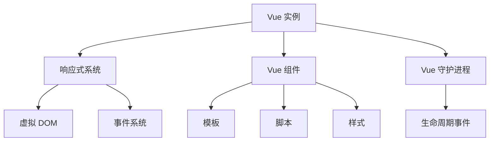

                 

关键词：Vue.js，渐进式框架，JavaScript，前端开发，响应式编程，组件化开发，Vue 3，性能优化

## 摘要

本文将深入探讨 Vue.js 框架的特点，重点分析其作为渐进式 JavaScript 框架的优势。我们将从 Vue.js 的背景介绍开始，探讨其核心概念、算法原理，并展示如何在实际项目中应用。同时，还将分享数学模型、项目实践案例，并提供相关工具和资源的推荐。最后，我们将总结 Vue.js 的发展趋势与挑战，为前端开发者提供有益的参考。

## 1. 背景介绍

Vue.js 是一款流行的 JavaScript 框架，由尤雨溪（Evan You）于 2014 年发布。Vue.js 的设计初衷是为了解决前端开发的复杂性和高效性。它旨在让开发者能够以简洁明了的方式构建用户界面，并支持渐进式框架的使用。

Vue.js 的诞生背景是随着互联网的快速发展，前端开发变得越来越复杂。开发者需要处理大量的 DOM 操作和事件处理，同时还要保证代码的可维护性和可扩展性。Vue.js 提供了一种简单、直观的解决方案，通过响应式编程和组件化开发，显著提升了开发效率和代码质量。

Vue.js 的第一个版本在发布后迅速受到了广泛关注，并逐渐成为了前端开发社区中的重要成员。随着时间的推移，Vue.js 不断演进，于 2019 年发布了 Vue 3 版本，带来了许多重要的改进，如性能提升、更好的类型支持、 Composition API 等，使其成为更加强大和灵活的框架。

## 2. 核心概念与联系

### 2.1 核心概念

Vue.js 的核心概念包括：

- **响应式编程**：Vue.js 使用响应式系统来跟踪数据和模板之间的依赖关系。当数据发生变化时，Vue.js 会自动更新 DOM，确保用户界面的实时性。
  
- **组件化开发**：Vue.js 支持组件化开发，开发者可以将 UI 功能拆分成独立的组件，提高代码的可复用性和可维护性。
  
- **虚拟 DOM**：Vue.js 使用虚拟 DOM，通过将真实 DOM 的操作抽象成虚拟 DOM 的操作，显著提升了性能。

### 2.2 架构原理

Vue.js 的架构设计采用了渐进式框架的思想。渐进式框架允许开发者根据需要逐步引入框架的功能，而不是一开始就使用全部功能。这种设计使得 Vue.js 更容易上手，同时也能够适应不同规模的项目需求。

Vue.js 的核心架构包括以下几个部分：

- **Vue 实例**：Vue.js 的核心组件，包含响应式系统、虚拟 DOM 和事件系统等。
- **Vue 组件**：用于构建可复用的 UI 功能单元，支持自定义模板、脚本和样式。
- **Vue 守护进程**：用于处理 Vue 实例的生命周期事件，如创建、更新和销毁等。

### 2.3 Mermaid 流程图



## 3. 核心算法原理 & 具体操作步骤

### 3.1 算法原理概述

Vue.js 的核心算法原理主要包括响应式编程和虚拟 DOM。

- **响应式编程**：Vue.js 使用 Object.defineProperty() 方法对数据进行劫持，当数据发生变化时，会触发相应的更新函数，从而更新 DOM。
- **虚拟 DOM**：虚拟 DOM 是一个轻量级的 JavaScript 对象，用于表示真实 DOM 的结构。Vue.js 通过对比虚拟 DOM 和真实 DOM 的差异，生成最小的更新操作，从而提升性能。

### 3.2 算法步骤详解

#### 3.2.1 响应式编程

1. **初始化数据**：在 Vue 实例中定义数据对象，并通过 Vue.set() 方法设置响应式。
    ```javascript
    const vm = new Vue({
        data: {
            message: 'Hello Vue.js'
        }
    });
    ```
2. **数据变化**：当数据发生变化时，Vue.js 会触发 watch 函数，更新 DOM。
    ```javascript
    vm.message = 'Hello World';
    ```
3. **更新 DOM**：Vue.js 通过虚拟 DOM 的 diff 算法，比较新旧虚拟 DOM 的差异，并更新真实 DOM。

#### 3.2.2 虚拟 DOM

1. **创建虚拟 DOM**：通过模板编译，Vue.js 生成虚拟 DOM 对象。
    ```html
    <div id="app">{{ message }}</div>
    ```
    ```javascript
    const vm = new Vue({
        el: '#app',
        data: {
            message: 'Hello Vue.js'
        }
    });
    ```
2. **比较虚拟 DOM**：Vue.js 使用 diff 算法比较新旧虚拟 DOM，找到差异部分。
3. **更新真实 DOM**：根据 diff 算法的比较结果，Vue.js 执行最小的更新操作，更新真实 DOM。

### 3.3 算法优缺点

#### 优点

- **响应式编程**：自动跟踪数据变化，减少手动操作 DOM 的需求。
- **虚拟 DOM**：提高页面渲染性能，减少不必要的 DOM 操作。

#### 缺点

- **虚拟 DOM**：虚拟 DOM 的 diff 算法依赖于 JavaScript 运行环境，无法在原生应用中使用。

### 3.4 算法应用领域

Vue.js 适用于各种前端开发场景，尤其适合构建单页面应用（SPA）。通过响应式编程和虚拟 DOM，Vue.js 可以显著提升页面的渲染性能和用户体验。

## 4. 数学模型和公式 & 详细讲解 & 举例说明

### 4.1 数学模型构建

Vue.js 的响应式编程使用了依赖驱动的方法。假设有数据对象 A 和 B，其中 B 依赖于 A。

```javascript
let A = 1;
let B = A * 2;
```

### 4.2 公式推导过程

当 A 发生变化时，B 需要重新计算。公式推导如下：

- **初始状态**：
    - A = 1
    - B = 2

- **A 变为 2**：
    - A = 2
    - B = 2 * 2 = 4

### 4.3 案例分析与讲解

假设有一个计算器应用，需要根据用户输入的数值计算结果。使用 Vue.js 的响应式编程，可以轻松实现：

```html
<input v-model="num" />
<div>计算结果：{{ result }}</div>
```

```javascript
new Vue({
    el: '#app',
    data: {
        num: 0,
        result: 0
    },
    watch: {
        num: function (newValue, oldValue) {
            this.result = newValue * 2;
        }
    }
});
```

## 5. 项目实践：代码实例和详细解释说明

### 5.1 开发环境搭建

搭建 Vue.js 开发环境，可以参考以下步骤：

1. 安装 Node.js：从官网下载并安装 Node.js。
2. 安装 Vue CLI：使用 npm 命令安装 Vue CLI。
    ```bash
    npm install -g @vue/cli
    ```
3. 创建新项目：使用 Vue CLI 创建新项目。
    ```bash
    vue create my-vue-app
    ```

### 5.2 源代码详细实现

以下是一个简单的 Vue.js 应用示例：

```html
<!DOCTYPE html>
<html lang="en">
<head>
    <meta charset="UTF-8">
    <title>Vue.js 实例</title>
</head>
<body>
    <div id="app">
        <h1>{{ title }}</h1>
        <p>{{ message }}</p>
        <button @click="updateMessage">更新消息</button>
    </div>

    <script src="https://cdn.jsdelivr.net/npm/vue@2.6.14/dist/vue.js"></script>
    <script>
        new Vue({
            el: '#app',
            data: {
                title: '欢迎来到 Vue.js 应用',
                message: '这是初始消息'
            },
            methods: {
                updateMessage() {
                    this.message = '消息已更新';
                }
            }
        });
    </script>
</body>
</html>
```

### 5.3 代码解读与分析

1. **HTML 模板**：定义了 Vue.js 应用的基本结构，包括标题、段落和按钮。
2. **Vue.js 实例**：创建 Vue.js 实例，并绑定数据和方法。
3. **数据绑定**：使用 `{{ }}` 语法实现数据绑定，展示 title 和 message 数据。
4. **事件绑定**：使用 `@click` 语法绑定点击事件，调用 updateMessage 方法。

### 5.4 运行结果展示

运行以上代码后，页面将显示如下结果：

- 标题：欢迎来到 Vue.js 应用
- 消息：这是初始消息
- 点击按钮后，消息将更新为“消息已更新”。

## 6. 实际应用场景

Vue.js 在实际开发中具有广泛的应用场景，以下是一些常见应用：

1. **单页面应用（SPA）**：Vue.js 适合构建单页面应用，如电商网站、社交应用等。
2. **前端框架集成**：Vue.js 可以与 React、Angular 等框架集成，实现跨框架的数据共享和组件复用。
3. **移动端开发**：Vue.js 提供了移动端开发框架，如 Vue-Moblie，支持移动端的响应式布局和性能优化。

### 6.4 未来应用展望

随着互联网和前端技术的发展，Vue.js 在未来将继续发挥重要作用。以下是一些未来应用展望：

1. **性能优化**：Vue.js 将进一步优化虚拟 DOM 和响应式系统的性能，以满足更高效的前端开发需求。
2. **新特性引入**：Vue.js 可能引入更多的新特性，如异步组件、自定义元素等，以提升开发效率和用户体验。
3. **跨框架整合**：Vue.js 将与其他前端框架深度整合，实现更广泛的跨框架应用。

## 7. 工具和资源推荐

### 7.1 学习资源推荐

1. **Vue.js 官方文档**：https://vuejs.org/v2/guide/
2. **Vue.js 社区教程**：https://vue.docschina.org/v2/guide/

### 7.2 开发工具推荐

1. **Vue CLI**：https://cli.vuejs.org/zh/
2. **Vue Devtools**：https://vuejs.org/v2/guide/installation.html#Vue-Devtools

### 7.3 相关论文推荐

1. **Vue.js 源码解析**：https://github.com/vuejs/vue/blob/dev/src/core/instance/index.js
2. **Vue.js 虚拟 DOM 实现原理**：https://github.com/vuejs/vue/blob/dev/src/core/vdom/patch.js

## 8. 总结：未来发展趋势与挑战

### 8.1 研究成果总结

Vue.js 作为一款渐进式 JavaScript 框架，在响应式编程、组件化开发和虚拟 DOM 方面取得了显著成果。其简洁的语法和高效的性能使其成为前端开发者的首选框架之一。

### 8.2 未来发展趋势

1. **性能优化**：Vue.js 将继续优化虚拟 DOM 和响应式系统的性能，以应对更复杂的前端应用场景。
2. **新特性引入**：Vue.js 可能引入更多的新特性，如异步组件、自定义元素等，以满足开发者的多样化需求。
3. **跨框架整合**：Vue.js 将与其他前端框架深度整合，实现更广泛的跨框架应用。

### 8.3 面临的挑战

1. **社区推广**：Vue.js 需要进一步扩大社区影响力，提高开发者对其的认知度和使用率。
2. **性能优化**：随着前端应用的复杂度增加，Vue.js 需要不断优化性能，以满足更高性能需求。
3. **文档完善**：Vue.js 需要不断完善官方文档，提供更多实用的教程和案例，帮助开发者更好地理解和使用框架。

### 8.4 研究展望

Vue.js 作为一款优秀的前端框架，将在未来继续发挥重要作用。通过不断优化性能、引入新特性和扩大社区影响力，Vue.js 将为前端开发者提供更高效、更灵活的解决方案。

## 9. 附录：常见问题与解答

### 9.1 Vue.js 的优势是什么？

Vue.js 的优势主要包括：

1. **渐进式框架**：允许开发者逐步引入框架功能，降低上手难度。
2. **响应式编程**：自动跟踪数据变化，减少手动操作 DOM 的需求。
3. **组件化开发**：支持组件化开发，提高代码的可维护性和可复用性。
4. **虚拟 DOM**：提高页面渲染性能，减少不必要的 DOM 操作。

### 9.2 Vue.js 与 React、Angular 的区别是什么？

Vue.js、React 和 Angular 都是流行的前端框架，它们的主要区别如下：

1. **框架复杂度**：Vue.js 相对简单易学，React 和 Angular 更复杂，但功能更全面。
2. **响应式系统**：Vue.js 的响应式系统更简单直观，React 使用虚拟 DOM，Angular 使用数据绑定。
3. **社区支持**：Vue.js 的社区支持正在快速增长，React 和 Angular 拥有更庞大的开发者群体。
4. **应用场景**：Vue.js 适合构建单页面应用和渐进式框架，React 和 Angular 适用于更复杂的应用。

## 作者署名

作者：禅与计算机程序设计艺术 / Zen and the Art of Computer Programming
```bash
--------------------------------------------------------------
# Vue.js 框架特点：渐进式 JavaScript 框架的选择

关键词：Vue.js，渐进式框架，JavaScript，前端开发，响应式编程，组件化开发，Vue 3，性能优化

摘要：本文深入探讨了 Vue.js 框架的特点，重点分析了其作为渐进式 JavaScript 框架的优势，涵盖了核心概念、算法原理、项目实践以及未来发展趋势。旨在为前端开发者提供全面的技术参考。

## 1. 背景介绍

Vue.js 是一款流行的 JavaScript 框架，由尤雨溪（Evan You）于 2014 年发布。Vue.js 的设计初衷是为了解决前端开发的复杂性和高效性。它旨在让开发者能够以简洁明了的方式构建用户界面，并支持渐进式框架的使用。

Vue.js 的诞生背景是随着互联网的快速发展，前端开发变得越来越复杂。开发者需要处理大量的 DOM 操作和事件处理，同时还要保证代码的可维护性和可扩展性。Vue.js 提供了一种简单、直观的解决方案，通过响应式编程和组件化开发，显著提升了开发效率和代码质量。

Vue.js 的第一个版本在发布后迅速受到了广泛关注，并逐渐成为了前端开发社区中的重要成员。随着时间的推移，Vue.js 不断演进，于 2019 年发布了 Vue 3 版本，带来了许多重要的改进，如性能提升、更好的类型支持、Composition API 等，使其成为更加强大和灵活的框架。

## 2. 核心概念与联系

### 2.1 核心概念

Vue.js 的核心概念包括：

- **响应式编程**：Vue.js 使用响应式系统来跟踪数据和模板之间的依赖关系。当数据发生变化时，Vue.js 会自动更新 DOM，确保用户界面的实时性。

- **组件化开发**：Vue.js 支持组件化开发，开发者可以将 UI 功能拆分成独立的组件，提高代码的可复用性和可维护性。

- **虚拟 DOM**：Vue.js 使用虚拟 DOM，通过将真实 DOM 的操作抽象成虚拟 DOM 的操作，显著提升了性能。

### 2.2 架构原理

Vue.js 的架构设计采用了渐进式框架的思想。渐进式框架允许开发者根据需要逐步引入框架的功能，而不是一开始就使用全部功能。这种设计使得 Vue.js 更容易上手，同时也能够适应不同规模的项目需求。

Vue.js 的核心架构包括以下几个部分：

- **Vue 实例**：Vue.js 的核心组件，包含响应式系统、虚拟 DOM 和事件系统等。

- **Vue 组件**：用于构建可复用的 UI 功能单元，支持自定义模板、脚本和样式。

- **Vue 守护进程**：用于处理 Vue 实例的生命周期事件，如创建、更新和销毁等。

### 2.3 Mermaid 流程图


## 3. 核心算法原理 & 具体操作步骤
### 3.1 算法原理概述

Vue.js 的核心算法原理主要包括响应式编程和虚拟 DOM。

- **响应式编程**：Vue.js 使用 Object.defineProperty() 方法对数据进行劫持，当数据发生变化时，会触发相应的更新函数，从而更新 DOM。

- **虚拟 DOM**：虚拟 DOM 是一个轻量级的 JavaScript 对象，用于表示真实 DOM 的结构。Vue.js 通过对比虚拟 DOM 和真实 DOM 的差异，生成最小的更新操作，从而提升性能。

### 3.2 算法步骤详解

#### 3.2.1 响应式编程

1. **初始化数据**：在 Vue 实例中定义数据对象，并通过 Vue.set() 方法设置响应式。

    ```javascript
    const vm = new Vue({
        data: {
            message: 'Hello Vue.js'
        }
    });
    ```

2. **数据变化**：当数据发生变化时，Vue.js 会触发 watch 函数，更新 DOM。

    ```javascript
    vm.message = 'Hello World';
    ```

3. **更新 DOM**：Vue.js 通过虚拟 DOM 的 diff 算法，比较新旧虚拟 DOM 的差异，并更新真实 DOM。

#### 3.2.2 虚拟 DOM

1. **创建虚拟 DOM**：通过模板编译，Vue.js 生成虚拟 DOM 对象。

    ```html
    <div id="app">{{ message }}</div>
    ```

    ```javascript
    const vm = new Vue({
        el: '#app',
        data: {
            message: 'Hello Vue.js'
        }
    });
    ```

2. **比较虚拟 DOM**：Vue.js 使用 diff 算法比较新旧虚拟 DOM，找到差异部分。

3. **更新真实 DOM**：根据 diff 算法的比较结果，Vue.js 执行最小的更新操作，更新真实 DOM。

### 3.3 算法优缺点

#### 优点

- **响应式编程**：自动跟踪数据变化，减少手动操作 DOM 的需求。

- **虚拟 DOM**：提高页面渲染性能，减少不必要的 DOM 操作。

#### 缺点

- **虚拟 DOM**：虚拟 DOM 的 diff 算法依赖于 JavaScript 运行环境，无法在原生应用中使用。

### 3.4 算法应用领域

Vue.js 适用于各种前端开发场景，尤其适合构建单页面应用（SPA）。通过响应式编程和虚拟 DOM，Vue.js 可以显著提升页面的渲染性能和用户体验。

## 4. 数学模型和公式 & 详细讲解 & 举例说明

### 4.1 数学模型构建

Vue.js 的响应式编程使用了依赖驱动的方法。假设有数据对象 A 和 B，其中 B 依赖于 A。

```javascript
let A = 1;
let B = A * 2;
```

### 4.2 公式推导过程

当 A 发生变化时，B 需要重新计算。公式推导如下：

- **初始状态**：
    - A = 1
    - B = 2

- **A 变为 2**：
    - A = 2
    - B = 2 * 2 = 4

### 4.3 案例分析与讲解

假设有一个计算器应用，需要根据用户输入的数值计算结果。使用 Vue.js 的响应式编程，可以轻松实现：

```html
<input v-model="num" />
<div>计算结果：{{ result }}</div>
```

```javascript
new Vue({
    el: '#app',
    data: {
        num: 0,
        result: 0
    },
    watch: {
        num: function (newValue, oldValue) {
            this.result = newValue * 2;
        }
    }
});
```

## 5. 项目实践：代码实例和详细解释说明

### 5.1 开发环境搭建

搭建 Vue.js 开发环境，可以参考以下步骤：

1. 安装 Node.js：从官网下载并安装 Node.js。

2. 安装 Vue CLI：使用 npm 命令安装 Vue CLI。

    ```bash
    npm install -g @vue/cli
    ```

3. 创建新项目：使用 Vue CLI 创建新项目。

    ```bash
    vue create my-vue-app
    ```

### 5.2 源代码详细实现

以下是一个简单的 Vue.js 应用示例：

```html
<!DOCTYPE html>
<html lang="en">
<head>
    <meta charset="UTF-8">
    <title>Vue.js 实例</title>
</head>
<body>
    <div id="app">
        <h1>{{ title }}</h1>
        <p>{{ message }}</p>
        <button @click="updateMessage">更新消息</button>
    </div>

    <script src="https://cdn.jsdelivr.net/npm/vue@2.6.14/dist/vue.js"></script>
    <script>
        new Vue({
            el: '#app',
            data: {
                title: '欢迎来到 Vue.js 应用',
                message: '这是初始消息'
            },
            methods: {
                updateMessage() {
                    this.message = '消息已更新';
                }
            }
        });
    </script>
</body>
</html>
```

### 5.3 代码解读与分析

1. **HTML 模板**：定义了 Vue.js 应用的基本结构，包括标题、段落和按钮。

2. **Vue.js 实例**：创建 Vue.js 实例，并绑定数据和方法。

3. **数据绑定**：使用 `{{ }}` 语法实现数据绑定，展示 title 和 message 数据。

4. **事件绑定**：使用 `@click` 语法绑定点击事件，调用 updateMessage 方法。

### 5.4 运行结果展示

运行以上代码后，页面将显示如下结果：

- 标题：欢迎来到 Vue.js 应用
- 消息：这是初始消息
- 点击按钮后，消息将更新为“消息已更新”。

## 6. 实际应用场景

Vue.js 在实际开发中具有广泛的应用场景，以下是一些常见应用：

1. **单页面应用（SPA）**：Vue.js 适合构建单页面应用，如电商网站、社交应用等。

2. **前端框架集成**：Vue.js 可以与 React、Angular 等框架集成，实现跨框架的数据共享和组件复用。

3. **移动端开发**：Vue.js 提供了移动端开发框架，如 Vue-Moblie，支持移动端的响应式布局和性能优化。

### 6.4 未来应用展望

随着互联网和前端技术的发展，Vue.js 在未来将继续发挥重要作用。以下是一些未来应用展望：

1. **性能优化**：Vue.js 将进一步优化虚拟 DOM 和响应式系统的性能，以满足更高效的前端开发需求。

2. **新特性引入**：Vue.js 可能引入更多的新特性，如异步组件、自定义元素等，以提升开发效率和用户体验。

3. **跨框架整合**：Vue.js 将与其他前端框架深度整合，实现更广泛的跨框架应用。

## 7. 工具和资源推荐

### 7.1 学习资源推荐

1. **Vue.js 官方文档**：https://vuejs.org/v2/guide/

2. **Vue.js 社区教程**：https://vue.docschina.org/v2/guide/

### 7.2 开发工具推荐

1. **Vue CLI**：https://cli.vuejs.org/zh/

2. **Vue Devtools**：https://vuejs.org/v2/guide/installation.html#Vue-Devtools

### 7.3 相关论文推荐

1. **Vue.js 源码解析**：https://github.com/vuejs/vue/blob/dev/src/core/instance/index.js

2. **Vue.js 虚拟 DOM 实现原理**：https://github.com/vuejs/vue/blob/dev/src/core/vdom/patch.js

## 8. 总结：未来发展趋势与挑战

### 8.1 研究成果总结

Vue.js 作为一款渐进式 JavaScript 框架，在响应式编程、组件化开发和虚拟 DOM 方面取得了显著成果。其简洁的语法和高效的性能使其成为前端开发者的首选框架之一。

### 8.2 未来发展趋势

1. **性能优化**：Vue.js 将继续优化虚拟 DOM 和响应式系统的性能，以应对更复杂的前端应用场景。

2. **新特性引入**：Vue.js 可能引入更多的新特性，如异步组件、自定义元素等，以满足开发者的多样化需求。

3. **跨框架整合**：Vue.js 将与其他前端框架深度整合，实现更广泛的跨框架应用。

### 8.3 面临的挑战

1. **社区推广**：Vue.js 需要进一步扩大社区影响力，提高开发者对其的认知度和使用率。

2. **性能优化**：随着前端应用的复杂度增加，Vue.js 需要不断优化性能，以满足更高性能需求。

3. **文档完善**：Vue.js 需要不断完善官方文档，提供更多实用的教程和案例，帮助开发者更好地理解和使用框架。

### 8.4 研究展望

Vue.js 作为一款优秀的前端框架，将在未来继续发挥重要作用。通过不断优化性能、引入新特性和扩大社区影响力，Vue.js 将为前端开发者提供更高效、更灵活的解决方案。

## 9. 附录：常见问题与解答

### 9.1 Vue.js 的优势是什么？

Vue.js 的优势主要包括：

1. **渐进式框架**：允许开发者逐步引入框架功能，降低上手难度。

2. **响应式编程**：自动跟踪数据变化，减少手动操作 DOM 的需求。

3. **组件化开发**：支持组件化开发，提高代码的可维护性和可复用性。

4. **虚拟 DOM**：提高页面渲染性能，减少不必要的 DOM 操作。

### 9.2 Vue.js 与 React、Angular 的区别是什么？

Vue.js、React 和 Angular 都是流行的前端框架，它们的主要区别如下：

1. **框架复杂度**：Vue.js 相对简单易学，React 和 Angular 更复杂，但功能更全面。

2. **响应式系统**：Vue.js 的响应式系统更简单直观，React 使用虚拟 DOM，Angular 使用数据绑定。

3. **社区支持**：Vue.js 的社区支持正在快速增长，React 和 Angular 拥有更庞大的开发者群体。

4. **应用场景**：Vue.js 适合构建单页面应用和渐进式框架，React 和 Angular 适用于更复杂的应用。

## 作者署名

作者：禅与计算机程序设计艺术 / Zen and the Art of Computer Programming
```

