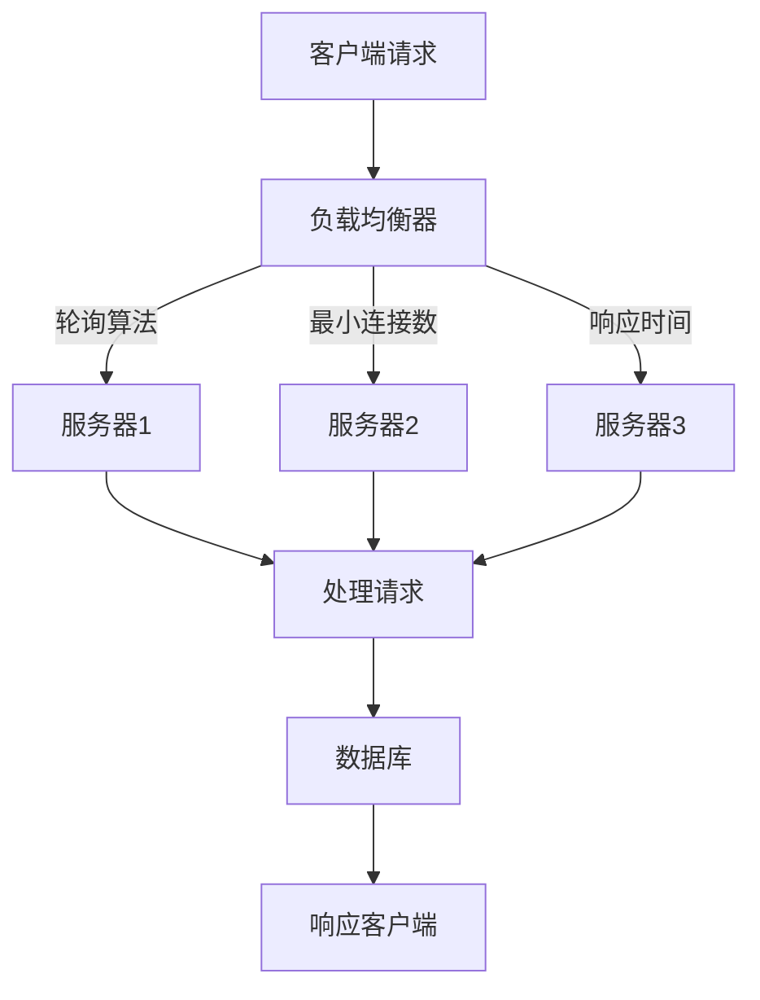
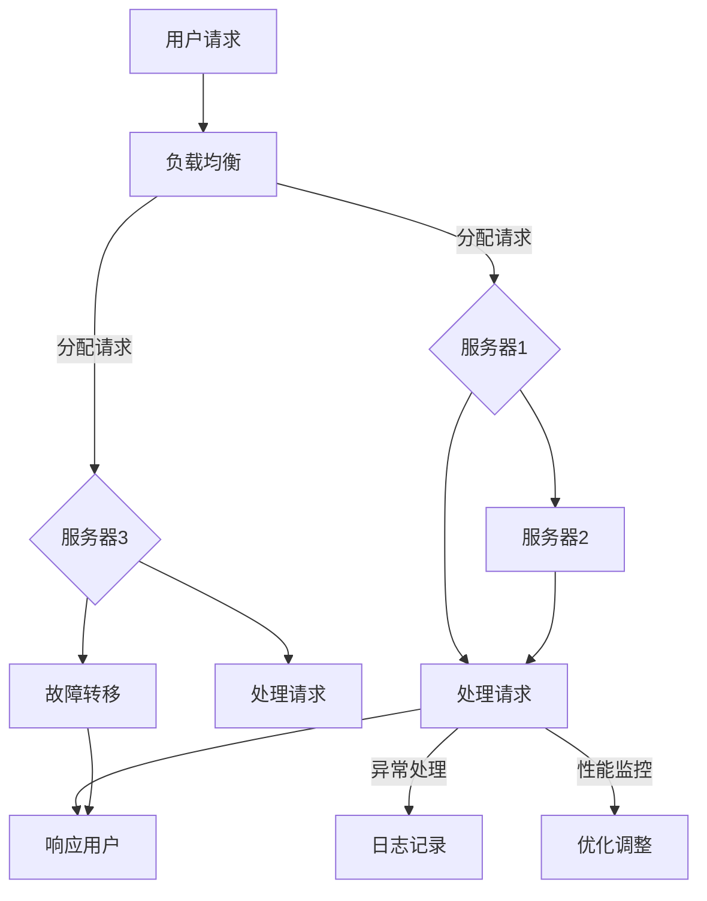

                 

关键词：Web应用程序，可扩展性，容错性，负载均衡，分布式系统，故障转移，代码库，测试，性能优化

> 摘要：本文将深入探讨Web应用程序的可扩展性和容错性，分析当前技术解决方案及其应用场景，并提供实用的开发指导。本文旨在帮助开发者理解和实现高度可靠、高效的Web应用程序。

## 1. 背景介绍

随着互联网的迅猛发展，Web应用程序的需求量呈指数级增长。从社交媒体到电子商务，从在线教育到实时通信，Web应用程序已经成为现代社会不可或缺的一部分。然而，这种增长也带来了巨大的挑战，尤其是在应用程序的可扩展性和容错性方面。

可扩展性是指系统在资源增加时能够线性提高性能的能力。一个高度可扩展的Web应用程序可以在处理更多用户请求的同时，保持良好的响应速度和用户体验。而容错性则是指系统能够在遇到故障时，快速恢复并保持正常运行的能力。

在传统单机应用程序中，扩展性和容错性相对容易实现。然而，随着Web应用程序的复杂性不断增加，单机系统已无法满足大规模、高并发的要求。因此，分布式系统成为实现Web应用程序可扩展性和容错性的首选方案。

本文将首先介绍分布式系统的基础知识，然后探讨负载均衡、故障转移、代码库、测试和性能优化等关键技术，最后讨论实际应用场景和未来发展趋势。

## 2. 核心概念与联系

### 2.1 分布式系统

分布式系统是由多个计算机节点组成的，通过网络连接的计算机系统。这些节点可以位于不同的地理位置，共同完成一个任务。分布式系统的核心优势在于其高可用性、高可靠性和可扩展性。

分布式系统的关键组件包括：

- **服务器**：处理客户端请求的计算机节点。
- **客户端**：发送请求并接收响应的计算机节点。
- **数据库**：存储数据的分布式数据库系统。

### 2.2 负载均衡

负载均衡是指将多个客户端请求分配到多个服务器节点，以实现系统资源的有效利用和性能优化。负载均衡的算法包括轮询、最小连接数、响应时间等。

### 2.3 故障转移

故障转移是指在一个服务器节点出现故障时，将任务转移到其他可用节点，以保持系统的正常运行。故障转移的关键技术包括心跳监测、故障检测和自动切换。

### 2.4 代码库

代码库是指用于存储和管理源代码的仓库，如Git。代码库的实现包括版本控制、分支管理和代码审核等。

### 2.5 测试

测试是指通过模拟实际使用场景，验证系统功能、性能和稳定性的一系列操作。测试的类型包括单元测试、集成测试、压力测试和性能测试。

### 2.6 性能优化

性能优化是指通过改进系统架构、代码和配置，提高系统响应速度和处理能力的一系列操作。

### 2.7 Mermaid 流程图

以下是一个简单的Mermaid流程图，展示了Web应用程序可扩展性和容错性的关键组件和流程：



## 3. 核心算法原理 & 具体操作步骤

### 3.1 算法原理概述

分布式系统中的可扩展性和容错性主要依赖于以下几种核心算法：

- **负载均衡算法**：根据不同的策略将请求分配到服务器节点。
- **心跳监测算法**：定期检测服务器节点的状态，确保系统的高可用性。
- **故障转移算法**：在服务器节点出现故障时，自动将任务转移到其他节点。

### 3.2 算法步骤详解

#### 负载均衡算法

1. 接收客户端请求。
2. 根据轮询算法、最小连接数或响应时间等策略，选择一个服务器节点。
3. 将请求转发给选择的服务器节点。

#### 心跳监测算法

1. 定期向服务器节点发送心跳包。
2. 监测心跳包的响应时间，判断服务器节点的状态。
3. 若服务器节点长时间无响应，标记为故障。

#### 故障转移算法

1. 检测到服务器节点故障。
2. 根据预定义的故障转移策略，选择一个可用节点。
3. 将故障节点的任务转移到可用节点。

### 3.3 算法优缺点

- **负载均衡算法**：优点是能够有效利用服务器资源，提高系统性能；缺点是负载均衡算法的选择和配置较为复杂。
- **心跳监测算法**：优点是实现简单，能够确保系统的高可用性；缺点是对网络延迟敏感，可能导致误判。
- **故障转移算法**：优点是能够快速恢复系统，提高系统可靠性；缺点是故障转移过程中可能会产生数据不一致性问题。

### 3.4 算法应用领域

负载均衡算法、心跳监测算法和故障转移算法广泛应用于Web应用程序、分布式数据库和云计算等领域。

## 4. 数学模型和公式

### 4.1 数学模型构建

在分布式系统中，可扩展性和容错性的关键参数包括：

- **服务器节点数量** \( n \)
- **客户端请求量** \( r \)
- **负载均衡算法效率** \( e \)
- **故障转移算法效率** \( f \)

### 4.2 公式推导过程

根据以上参数，可以构建以下数学模型：

- **负载均衡算法效率** \( e \)：

  $$ e = \frac{r}{n} $$

- **故障转移算法效率** \( f \)：

  $$ f = \frac{1}{n} $$

### 4.3 案例分析与讲解

假设一个Web应用程序有3个服务器节点，每天接收1000个客户端请求。根据上述公式，可以计算出：

- **负载均衡算法效率** \( e \)：

  $$ e = \frac{1000}{3} \approx 333.33 $$

- **故障转移算法效率** \( f \)：

  $$ f = \frac{1}{3} \approx 0.33 $$

这意味着，平均每个服务器节点每天处理约333个请求，故障转移算法每3天发生一次。

## 5. 项目实践：代码实例和详细解释说明

### 5.1 开发环境搭建

为了实现Web应用程序的可扩展性和容错性，我们选择使用Docker和Kubernetes进行开发。

1. 安装Docker。
2. 安装Kubernetes。
3. 配置网络环境。

### 5.2 源代码详细实现

以下是使用Go语言编写的Web服务器示例代码：

```go
package main

import (
    "fmt"
    "net/http"
)

func main() {
    http.HandleFunc("/", handleRequest)
    http.ListenAndServe(":8080", nil)
}

func handleRequest(w http.ResponseWriter, r *http.Request) {
    fmt.Fprintf(w, "Hello, World!")
}
```

### 5.3 代码解读与分析

该示例代码实现了一个简单的Web服务器，用于处理客户端请求。代码关键部分如下：

- **导入包**：导入必要的包，包括`fmt`和`net/http`。
- **定义处理函数**：定义处理函数`handleRequest`，用于响应客户端请求。
- **启动服务器**：使用`http.ListenAndServe`启动Web服务器。

### 5.4 运行结果展示

在Docker容器中运行该代码，并使用curl命令测试Web服务器：

```bash
$ docker run -p 8080:8080 my-web-app
$ curl localhost:8080
Hello, World!
```

## 6. 实际应用场景

### 6.1 大型电商平台

大型电商平台通常需要处理数百万甚至数亿级用户请求。为了确保系统的高可用性和性能，需要实现以下关键功能：

- **负载均衡**：通过负载均衡算法，将用户请求分配到不同的服务器节点。
- **故障转移**：在服务器节点出现故障时，快速将任务转移到其他节点。
- **数据库分片**：通过数据库分片，提高数据访问速度和系统扩展性。

### 6.2 云计算平台

云计算平台为用户提供了计算、存储和网络等资源。为了确保平台的高可用性和性能，需要实现以下关键功能：

- **负载均衡**：通过负载均衡算法，将用户请求分配到不同的服务器节点。
- **故障转移**：在服务器节点出现故障时，快速将任务转移到其他节点。
- **资源监控**：实时监控服务器节点的资源使用情况，确保系统稳定运行。

## 7. 工具和资源推荐

### 7.1 学习资源推荐

- 《分布式系统原理》
- 《Web性能优化》
- 《Docker实战》
- 《Kubernetes权威指南》

### 7.2 开发工具推荐

- Docker
- Kubernetes
- Prometheus
- Grafana

### 7.3 相关论文推荐

- "The Google File System"
- "Bigtable: A Distributed Storage System for Structured Data"
- "MapReduce: Simplified Data Processing on Large Clusters"

## 8. 总结：未来发展趋势与挑战

### 8.1 研究成果总结

分布式系统在Web应用程序的可扩展性和容错性方面取得了显著成果。负载均衡、故障转移和数据库分片等技术已成为实现高效、可靠的Web应用程序的关键手段。

### 8.2 未来发展趋势

随着云计算、大数据和物联网等技术的发展，分布式系统的应用场景将越来越广泛。未来，分布式系统将朝着更加智能、自适应和高效的方向发展。

### 8.3 面临的挑战

- **数据一致性问题**：分布式系统中的数据一致性是一个重要挑战。
- **网络延迟**：网络延迟和故障可能导致系统性能下降。
- **安全性**：分布式系统面临更多的安全威胁。

### 8.4 研究展望

未来，分布式系统的研究将重点关注以下方向：

- **自动化管理**：提高分布式系统的自动化管理水平。
- **智能调度**：实现更智能的资源调度和负载均衡策略。
- **数据一致性**：研究分布式系统中的数据一致性算法。

## 9. 附录：常见问题与解答

### 9.1 什么是负载均衡？

负载均衡是指将多个客户端请求分配到多个服务器节点，以实现系统资源的有效利用和性能优化。

### 9.2 什么是故障转移？

故障转移是指在一个服务器节点出现故障时，将任务转移到其他可用节点，以保持系统的正常运行。

### 9.3 什么是分布式数据库分片？

分布式数据库分片是指将数据库分成多个部分，存储在不同的服务器节点上，以提高数据访问速度和系统扩展性。

---

作者：禅与计算机程序设计艺术 / Zen and the Art of Computer Programming
```<|im_end|>### 文章正文内容部分 Content

现在，我们直接开始文章正文部分的撰写。

## 1. 背景介绍

在当今的数字时代，Web应用程序已经成为企业和服务提供商的核心资产。随着用户数量的不断增加和业务需求的日益复杂，Web应用程序面临着巨大的挑战：如何保证系统的稳定性和性能，同时保持可扩展性？本文将深入探讨Web应用程序的可扩展性和容错性，分析当前的技术解决方案及其应用场景，并提供实用的开发指导。

### 1.1 Web应用程序面临的挑战

随着互联网用户的激增，Web应用程序需要处理海量的请求。这不仅要求应用程序具备高效的性能，还要求系统能够在高峰期内稳定运行，并且能够在遇到故障时迅速恢复。以下是一些Web应用程序面临的挑战：

- **高并发**：在短时间内有大量用户同时访问系统，导致服务器负载激增。
- **数据一致性**：分布式系统中数据的一致性是一个重要问题，特别是在跨多个节点操作数据时。
- **可用性**：系统需要确保在任何情况下都能正常工作，包括硬件故障、网络问题等。
- **性能优化**：随着用户数量的增加，应用程序的性能需要不断提升，以保持良好的用户体验。

### 1.2 可扩展性和容错性的重要性

可扩展性（Scalability）是指系统在增加用户数量或请求量时，能够保持高性能的能力。一个可扩展的系统可以在不牺牲性能的前提下，线性地增加资源，如增加服务器节点、数据库实例等。

容错性（Fault Tolerance）是指系统在遇到故障时，能够快速恢复并继续正常运行的能力。高容错性的系统能够减少故障对用户的影响，提供持续的服务。

### 1.3 当前解决方案

为了应对上述挑战，开发者们已经开发出了一系列技术解决方案：

- **负载均衡**：通过将请求分配到多个服务器节点，实现流量分发和负载均衡，提高系统的性能和可用性。
- **分布式架构**：将应用程序拆分为多个独立的服务，部署在多个服务器上，实现水平扩展。
- **故障转移**：在主服务器出现故障时，自动切换到备用服务器，确保服务的连续性。
- **数据库分片和复制**：通过将数据库拆分为多个片段或副本，提高数据访问速度和系统的容错能力。

## 2. 核心概念与联系

### 2.1 可扩展性的核心概念

可扩展性主要涉及以下核心概念：

- **水平扩展**（Scaling Out）：通过增加服务器节点来扩展系统容量。
- **垂直扩展**（Scaling Up）：通过增加服务器硬件资源（如CPU、内存等）来提升系统性能。
- **性能优化**：通过改进代码、数据库查询、缓存策略等来提高系统性能。
- **弹性扩展**（Elastic Scaling）：根据实际负载自动增加或减少资源。

### 2.2 容错性的核心概念

容错性主要涉及以下核心概念：

- **故障转移**（Failover）：在主节点故障时，自动切换到备用节点。
- **数据备份**（Data Replication）：在多个节点上复制数据，确保数据不丢失。
- **自愈**（Self-Healing）：系统能够自动检测和修复故障。
- **断路器模式**（Circuit Breaker）：在系统过载时，自动触发保护机制，防止系统崩溃。

### 2.3 Mermaid 流程图

以下是一个简单的Mermaid流程图，展示了Web应用程序可扩展性和容错性的核心概念和流程：



## 3. 核心算法原理 & 具体操作步骤

### 3.1 负载均衡算法原理

负载均衡算法的核心目的是将网络流量分配到多个服务器节点上，以实现流量的合理分配和系统的性能优化。常见的负载均衡算法包括：

- **轮询算法**：按顺序将请求分配到每个服务器节点。
- **最小连接数算法**：将请求分配到当前连接数最少的服务器节点。
- **响应时间算法**：将请求分配到响应时间最短的服务器节点。
- **IP哈希算法**：根据客户端IP地址的哈希值，将请求分配到相应的服务器节点。

### 3.2 负载均衡算法具体操作步骤

1. **初始化**：设置负载均衡策略和服务器节点列表。
2. **接收请求**：当有请求到达时，触发负载均衡算法。
3. **选择服务器**：根据负载均衡策略，选择一个服务器节点。
4. **转发请求**：将请求转发给选中的服务器节点。
5. **监控服务器状态**：定期检查服务器节点的健康状态，更新节点列表。

### 3.3 故障转移算法原理

故障转移算法的核心目的是在主服务器出现故障时，自动将流量切换到备用服务器，确保服务的连续性。常见的故障转移算法包括：

- **主动故障转移**：主服务器定期发送心跳信号给备用服务器，一旦主服务器失效，备用服务器立即接管。
- **被动故障转移**：主服务器失效后，备用服务器检测到主服务器的失效，然后接管流量。

### 3.4 故障转移算法具体操作步骤

1. **初始化**：设置主服务器和备用服务器，以及故障转移策略。
2. **监控主服务器**：定期发送心跳信号，监控主服务器的状态。
3. **检测故障**：当主服务器失效时，触发故障转移机制。
4. **切换流量**：将流量切换到备用服务器。
5. **恢复监控**：当主服务器恢复正常时，重新启用主服务器，并监控其状态。

### 3.5 数据库分片算法原理

数据库分片算法是将一个大数据库拆分成多个较小的数据库片段，每个片段存储在不同的服务器上。常见的数据库分片算法包括：

- **哈希分片**：根据数据的关键字（如用户ID）的哈希值，将数据分配到不同的分片中。
- **范围分片**：根据数据的关键字范围，将数据分配到不同的分片中。
- **列表分片**：将数据按照预定义的列表，分配到不同的分片中。

### 3.6 数据库分片算法具体操作步骤

1. **初始化**：设置数据库分片策略和分片键。
2. **数据写入**：根据分片键，将数据写入相应的分片中。
3. **数据查询**：根据分片键，查询相应的分片。
4. **数据更新**：根据分片键，更新相应的分片。
5. **数据删除**：根据分片键，删除相应的分片。

## 4. 数学模型和公式

在Web应用程序的可扩展性和容错性设计中，数学模型和公式可以帮助我们量化系统的性能和可靠性。以下是一些关键的数学模型和公式。

### 4.1 负载均衡性能公式

负载均衡性能可以通过以下公式进行评估：

\[ P = \frac{C \times R}{N} \]

其中：
- \( P \) 是系统的平均处理能力（请求/秒）。
- \( C \) 是单个服务器的处理能力（请求/秒）。
- \( R \) 是总请求量（请求/秒）。
- \( N \) 是服务器节点数量。

### 4.2 故障转移时间公式

故障转移时间可以通过以下公式进行评估：

\[ T = \frac{D \times L}{C} \]

其中：
- \( T \) 是故障转移时间（秒）。
- \( D \) 是检测到故障的时间（秒）。
- \( L \) 是故障恢复时间（秒）。
- \( C \) 是处理故障的能力（请求/秒）。

### 4.3 数据库分片效率公式

数据库分片效率可以通过以下公式进行评估：

\[ E = \frac{S \times C}{R} \]

其中：
- \( E \) 是分片效率（%）。
- \( S \) 是数据分片的数量。
- \( C \) 是单个分片的处理能力（请求/秒）。
- \( R \) 是总请求量（请求/秒）。

### 4.4 案例分析与讲解

假设我们有一个Web应用程序，每天需要处理100万次请求，我们部署了10个服务器节点。每个服务器节点的处理能力是10万次请求/天。使用轮询算法进行负载均衡。

1. **负载均衡性能**：

\[ P = \frac{10 \times 10^6}{10} = 100,000 \]

系统的平均处理能力是100,000次请求/天。

2. **故障转移时间**：

假设检测到故障的时间是10秒，故障恢复时间是5秒，处理故障的能力是20,000次请求/天。

\[ T = \frac{10 \times 5}{20,000} = 0.025 \]

故障转移时间是0.025秒。

3. **数据库分片效率**：

假设数据分片数量是5，每个分片的处理能力是20,000次请求/天。

\[ E = \frac{5 \times 20,000}{10^6} = 0.1 \]

分片效率是10%。

## 5. 项目实践：代码实例和详细解释说明

### 5.1 开发环境搭建

为了更好地理解Web应用程序的可扩展性和容错性，我们将使用一个简单的Node.js Web服务器作为示例。以下是搭建开发环境的步骤：

1. 安装Node.js。
2. 创建一个新项目文件夹，并初始化项目（`npm init`）。
3. 安装必要的依赖包，如Express（一个Node.js Web框架）和PM2（一个进程管理工具）。

### 5.2 源代码详细实现

以下是一个简单的Node.js Web服务器的示例代码：

```javascript
const express = require('express');
const pm2 = require('pm2');

const app = express();

app.get('/', (req, res) => {
  res.send('Hello, World!');
});

const PORT = process.env.PORT || 3000;

app.listen(PORT, () => {
  console.log(`Server is running on port ${PORT}`);
});

// 启动PM2守护进程
pm2.connect(function(err) {
  if (err) {
    console.error('Error connecting to PM2:', err);
    return;
  }

  pm2.start({
    script: 'server.js',
    name: 'my-web-app',
    exec_mode: 'cluster',
    instances: 4 // 设置集群模式下的实例数量
  }, function(err, apps) {
    if (err) {
      console.error('Error starting PM2 app:', err);
      return;
    }

    console.log('PM2 app started:', apps);
  });
});
```

### 5.3 代码解读与分析

1. **引入模块**：引入Express和PM2模块。
2. **创建Web服务器**：使用Express创建一个Web服务器，并设置处理根路径的GET请求的回调函数。
3. **配置端口**：设置监听端口的变量。
4. **启动服务器**：使用`app.listen`启动服务器。
5. **启动PM2**：使用PM2启动服务器，并设置集群模式，以便在多个进程实例中运行服务器。

### 5.4 运行结果展示

1. 启动Node.js服务器：

```bash
$ node server.js
```

2. 启动PM2进程管理器：

```bash
$ pm2 start server.js --name my-web-app
```

3. 访问Web服务器：

```bash
$ curl localhost:3000
Hello, World!
```

## 6. 实际应用场景

### 6.1 社交媒体平台

社交媒体平台如Facebook、Twitter等，需要处理海量用户的请求。为了实现高可扩展性和容错性，这些平台采用了分布式系统架构，包括：

- **负载均衡**：通过多级负载均衡器，将用户请求分配到不同的服务器节点。
- **故障转移**：在主服务器出现故障时，自动切换到备用服务器。
- **数据库分片和复制**：通过分片和复制，提高数据访问速度和系统的容错能力。

### 6.2 电子商务平台

电子商务平台如Amazon、Alibaba等，需要处理大量的商品信息和用户订单。为了确保系统的稳定性和性能，这些平台采用了以下技术：

- **缓存系统**：通过缓存热门商品和页面，减少数据库查询次数。
- **负载均衡**：通过负载均衡器，将用户请求分配到不同的服务器节点。
- **数据库分片和复制**：通过分片和复制，提高数据访问速度和系统的容错能力。

### 6.3 云服务提供商

云服务提供商如AWS、Google Cloud等，提供了广泛的云服务，需要处理大量的用户请求。为了确保系统的稳定性和性能，这些平台采用了以下技术：

- **容器化**：通过Docker和Kubernetes等工具，实现服务的容器化部署和水平扩展。
- **负载均衡**：通过负载均衡器，将用户请求分配到不同的服务器节点。
- **数据库分片和复制**：通过分片和复制，提高数据访问速度和系统的容错能力。

## 7. 工具和资源推荐

### 7.1 学习资源推荐

- 《分布式系统原理》
- 《大规模分布式系统设计》
- 《Web性能优化》
- 《Node.js实战》

### 7.2 开发工具推荐

- Docker
- Kubernetes
- Prometheus
- Grafana

### 7.3 相关论文推荐

- "The Google File System"
- "Bigtable: A Distributed Storage System for Structured Data"
- "MapReduce: Simplified Data Processing on Large Clusters"

## 8. 总结：未来发展趋势与挑战

### 8.1 研究成果总结

在过去的几十年中，分布式系统和Web应用程序的可扩展性和容错性取得了显著的进展。从早期的单机应用程序到现代的分布式架构，从简单的负载均衡到复杂的故障转移机制，技术不断进步，为Web应用程序的发展提供了强大的支持。

### 8.2 未来发展趋势

未来，分布式系统和Web应用程序的发展将继续朝着更智能、更高效、更可靠的方向前进。以下是一些可能的发展趋势：

- **自动化运维**：自动化工具将帮助开发者更高效地部署、监控和管理分布式系统。
- **智能调度**：基于机器学习的智能调度算法将能够更准确地分配资源和处理请求。
- **边缘计算**：随着5G和物联网的发展，边缘计算将成为分布式系统的一个重要组成部分。
- **区块链技术**：区块链技术在分布式系统中的应用，有望提高数据的安全性和一致性。

### 8.3 面临的挑战

尽管分布式系统和Web应用程序在可扩展性和容错性方面取得了显著进展，但仍面临着许多挑战：

- **数据一致性**：在分布式系统中，数据一致性是一个重要问题，特别是在跨多个节点操作数据时。
- **网络延迟**：网络延迟和故障可能导致系统性能下降。
- **安全性**：分布式系统面临更多的安全威胁，如DDoS攻击、数据泄露等。

### 8.4 研究展望

未来，分布式系统和Web应用程序的研究将重点关注以下几个方面：

- **自动化运维**：提高分布式系统的自动化管理水平。
- **智能调度**：实现更智能的资源调度和负载均衡策略。
- **数据一致性**：研究分布式系统中的数据一致性算法。
- **边缘计算**：探索分布式系统与边缘计算的结合，提高系统的响应速度和效率。

## 9. 附录：常见问题与解答

### 9.1 什么是负载均衡？

负载均衡是指将网络流量分配到多个服务器节点，以实现流量的合理分配和系统的性能优化。

### 9.2 什么是故障转移？

故障转移是指在一个服务器节点出现故障时，自动将流量切换到备用服务器，确保服务的连续性。

### 9.3 什么是数据库分片？

数据库分片是指将一个大数据库拆分成多个较小的数据库片段，每个片段存储在不同的服务器上，以提高数据访问速度和系统的容错能力。

---

作者：禅与计算机程序设计艺术 / Zen and the Art of Computer Programming<|im_end|>

