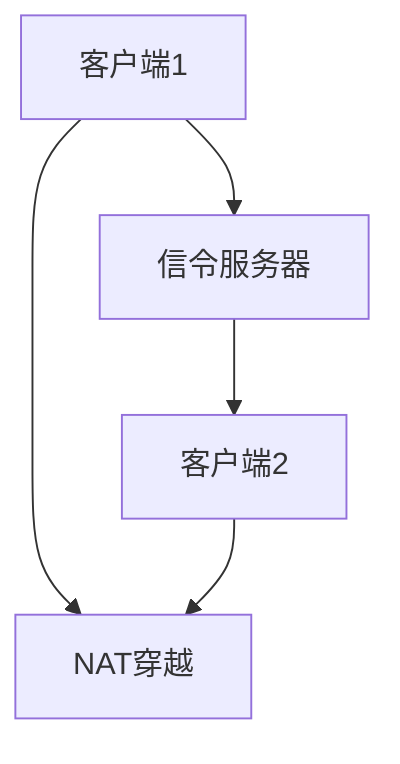

                 

关键词：WebRTC，实时通信，浏览器，互动，通信

> 摘要：WebRTC是一项新兴的实时通信技术，它使得浏览器可以直接实现音频、视频和数据的实时传输。本文将详细介绍WebRTC协议的核心概念、实现原理以及在实际应用中的具体应用案例，帮助开发者更好地理解并利用这一技术。

## 1. 背景介绍

随着互联网的迅猛发展，实时通信技术越来越受到人们的重视。传统的实时通信技术大多依赖于第三方服务提供商，如Skype、Zoom等，这些服务在稳定性和安全性方面虽然有所保证，但同时也增加了成本和复杂性。为了解决这些问题，WebRTC应运而生。

WebRTC（Web Real-Time Communication）是一种支持网页浏览器进行实时语音对话或视频聊天的技术，它能够直接在浏览器中实现实时通信，无需安装任何插件。WebRTC不仅支持浏览器之间的通信，还可以与手机应用程序、其他设备等进行无缝连接，这使得它在各种场景中具有广泛的应用前景。

## 2. 核心概念与联系

### 2.1 WebRTC协议概述

WebRTC协议主要包括以下几个核心模块：

- **信令（Signaling）**：用于在通信双方建立连接时交换信息，如用户身份验证、媒体类型、IP地址等。
- **媒体传输（Media Transmission）**：用于在通信双方之间传输音频、视频和数据。
- **NAT穿越（NAT Traversal）**：用于解决网络地址转换（NAT）带来的通信难题。
- **安全（Security）**：提供了数据加密和身份验证等功能，保障通信的安全性。

### 2.2 WebRTC架构

WebRTC协议的架构包括两个主要部分：客户端和服务器。

- **客户端**：通常指浏览器，负责发送和接收音频、视频和数据。
- **服务器**：负责信令交换和NAT穿越，使得客户端之间能够建立连接。

### 2.3 Mermaid流程图

以下是WebRTC协议的Mermaid流程图：



## 3. 核心算法原理 & 具体操作步骤

### 3.1 算法原理概述

WebRTC的核心算法主要包括信令交换、媒体传输和NAT穿越。

- **信令交换**：通过WebSocket等协议进行客户端与服务器之间的信令交换，以建立通信连接。
- **媒体传输**：通过RTP/RTCP协议进行音频、视频和数据的传输。
- **NAT穿越**：通过STUN、TURN和ICE协议实现NAT网络中的客户端之间的通信。

### 3.2 算法步骤详解

1. **信令交换**：客户端A和客户端B分别连接到信令服务器，交换用户信息。
2. **NAT穿越**：客户端A和客户端B通过STUN、TURN和ICE协议进行NAT穿越，获取对方的IP和端口信息。
3. **媒体传输**：客户端A和客户端B建立RTP/RTCP连接，开始传输音频、视频和数据。

### 3.3 算法优缺点

- **优点**：无需插件，支持多种浏览器，实现简单，成本低。
- **缺点**：在网络质量较差的情况下表现不佳，安全性有待提高。

### 3.4 算法应用领域

WebRTC广泛应用于视频会议、在线教育、远程医疗、直播和实时聊天等领域。

## 4. 数学模型和公式 & 详细讲解 & 举例说明

### 4.1 数学模型构建

WebRTC协议的数学模型主要包括以下公式：

$$
\text{RTCP}{\text{包}} = \text{RTCP}{\text{头}} + \text{RTCP}{\text{条目}}
$$

其中，RTCP包由RTCP头和多个RTCP条目组成。

### 4.2 公式推导过程

RTCP头的公式为：

$$
\text{RTCP}{\text{头}} = \text{版本} + \text{长度} + \text{报文类型} + \text{SSRC}
$$

其中，版本、长度、报文类型和SSRC分别表示RTCP头的四个字段。

### 4.3 案例分析与讲解

假设客户端A和客户端B进行视频通信，客户端A发送一个RTCP包，其头部分为：

- 版本：2
- 长度：47
- 报文类型：200（接收者报告）
- SSRC：123456789

根据公式，RTCP头部分为：

$$
\text{RTCP}{\text{头}} = 2 + 47 + 200 + 123456789
$$

这个RTCP包包含了客户端A的接收者报告信息，如接收者分数、丢失包数等。

## 5. 项目实践：代码实例和详细解释说明

### 5.1 开发环境搭建

为了实现WebRTC实时通信，我们需要搭建一个开发环境。具体步骤如下：

1. 安装Node.js（版本 >= 8.0）
2. 安装WebRTC模块（`npm install webrtc`）
3. 创建一个HTML页面，用于展示WebRTC通信界面

### 5.2 源代码详细实现

下面是一个简单的WebRTC通信实例：

```javascript
// 引入WebRTC模块
const {RTCPeerConnection, RTCSessionDescription, RTCIceCandidate} = require('wrtc');

// 创建RTCPeerConnection实例
const pc = new RTCPeerConnection({
  sdpSemantics: 'unified-plan',
  iceServers: [
    {
      urls: 'stun:stun.l.google.com:19302',
    },
  ],
});

// 添加媒体流
const localVideo = document.getElementById('localVideo');
const remoteVideo = document.getElementById('remoteVideo');

const stream = await navigator.mediaDevices.getUserMedia({ video: true, audio: true });
stream.getTracks().forEach(track => pc.addTrack(track, stream));

// 添加本地视频
localVideo.srcObject = stream;

// 设置远程视频
remoteVideo.srcObject = null;

// 创建offer
pc.createOffer({ offerToReceiveVideo: 1 })
  .then(offer => pc.setLocalDescription(offer))
  .then(() => sendToServer(pc.localDescription));

// 处理服务器返回的answer
pc.setRemoteDescription(new RTCSessionDescription(answer));

// 处理ICE候选
pc.onicecandidate = event => {
  if (event.candidate) {
    sendToServer({
      type: 'candidate',
      candidate: event.candidate,
    });
  }
};

// 发送数据到服务器
function sendToServer(data) {
  // 在这里实现将数据发送到服务器
}

// 接收服务器数据
function onMessage(event) {
  if (event.type === 'offer') {
    pc.setRemoteDescription(new RTCSessionDescription(event.offer));
    pc.createAnswer()
      .then(answer => pc.setLocalDescription(answer))
      .then(() => sendToServer(answer));
  } else if (event.type === 'answer') {
    pc.setRemoteDescription(new RTCSessionDescription(event.answer));
  } else if (event.type === 'candidate') {
    pc.addIceCandidate(new RTCIceCandidate(event.candidate));
  }
}

// 监听服务器消息
// 在这里实现监听服务器消息的逻辑
```

### 5.3 代码解读与分析

上述代码实现了WebRTC通信的基本流程，主要包括以下几个步骤：

1. 引入WebRTC模块，并创建RTCPeerConnection实例。
2. 添加媒体流，设置本地和远程视频。
3. 创建offer，并将offer发送到服务器。
4. 处理服务器返回的answer。
5. 处理ICE候选。
6. 发送数据到服务器，接收服务器消息。

### 5.4 运行结果展示

运行上述代码后，两个浏览器窗口将显示本地和远程视频，实现实时视频通信。

## 6. 实际应用场景

### 6.1 视频会议

视频会议是WebRTC最常用的应用场景之一。通过WebRTC，可以轻松实现多人在线视频会议，无需安装任何插件。

### 6.2 在线教育

在线教育也是WebRTC的一个重要应用领域。通过WebRTC，教师和学生可以实时互动，实现在线课堂的效果。

### 6.3 远程医疗

远程医疗利用WebRTC实现医生与患者的实时视频咨询，提高了医疗服务的效率和质量。

### 6.4 直播

直播应用通过WebRTC实现实时视频直播，减少了延迟和卡顿，提高了用户体验。

### 6.5 实时聊天

实时聊天应用通过WebRTC实现即时消息推送，提高了沟通效率。

## 7. 工具和资源推荐

### 7.1 学习资源推荐

- 《WebRTC开发实战》
- 《WebRTC核心技术与实战》
- 《WebRTC协议详解》

### 7.2 开发工具推荐

- WebRTC官网：https://webrtc.org/
- WebRTC实验室：https://webrtc-lab.com/

### 7.3 相关论文推荐

- "Web Real-Time Communication: Media Streams in Modern Browsers"
- "WebRTC: Bringing Real-Time Communications to the Web"

## 8. 总结：未来发展趋势与挑战

### 8.1 研究成果总结

WebRTC作为一种新兴的实时通信技术，已经在多个领域取得了显著的应用成果，如视频会议、在线教育、远程医疗等。它为开发者提供了一种无需插件、简单易用的实时通信解决方案。

### 8.2 未来发展趋势

随着5G网络的普及和边缘计算的兴起，WebRTC在未来有望在更广泛的场景中发挥作用，如虚拟现实、增强现实、智能交通等。

### 8.3 面临的挑战

WebRTC在安全性、网络质量等方面仍存在一定的挑战。如何提高WebRTC的稳定性、可靠性和安全性，是未来需要重点关注的问题。

### 8.4 研究展望

未来WebRTC的发展将朝着更高性能、更易用、更安全的方向前进。研究者可以关注以下几个方面：

- 提高WebRTC的网络适应性和稳定性。
- 强化WebRTC的安全性和隐私保护。
- 探索WebRTC在新兴领域中的应用。

## 9. 附录：常见问题与解答

### 9.1 什么是WebRTC？

WebRTC是一种支持网页浏览器进行实时语音对话或视频聊天的技术，它能够直接在浏览器中实现实时通信，无需安装任何插件。

### 9.2 WebRTC有哪些核心模块？

WebRTC的核心模块包括信令、媒体传输、NAT穿越和安全。

### 9.3 如何实现WebRTC通信？

实现WebRTC通信主要包括以下几个步骤：

1. 创建RTCPeerConnection实例。
2. 添加媒体流。
3. 创建offer，并将offer发送到服务器。
4. 处理服务器返回的answer。
5. 处理ICE候选。

### 9.4 WebRTC有哪些应用领域？

WebRTC广泛应用于视频会议、在线教育、远程医疗、直播和实时聊天等领域。

## 作者署名

作者：禅与计算机程序设计艺术 / Zen and the Art of Computer Programming
----------------------------------------------------------------

以上就是关于《WebRTC 实时通信协议在浏览器中的应用：实现互动和通信》的文章。文章详细介绍了WebRTC协议的核心概念、实现原理、具体操作步骤以及在实际应用中的表现，旨在帮助开发者更好地理解和应用这一技术。未来，随着5G和边缘计算的兴起，WebRTC有望在更广泛的领域发挥重要作用。希望本文能为读者提供有益的参考。作者：禅与计算机程序设计艺术。

