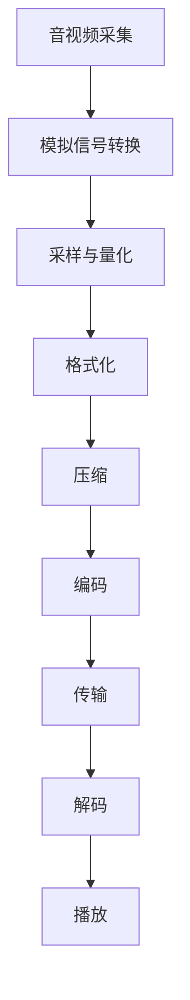

                 

在当今的信息时代，实时音视频通信已经成为我们日常生活中不可或缺的一部分。WebRTC（Web Real-Time Communication）作为一种开放协议，提供了在浏览器中实现实时音视频通信的功能，成为了众多应用开发的首选方案。本文将深入探讨WebRTC音视频采集与编码的核心技术，帮助开发者更好地理解和应用这一强大工具。

## 文章关键词
WebRTC，音视频采集，编码技术，实时通信，网络传输，媒体处理

## 文章摘要
本文将详细介绍WebRTC音视频采集与编码的相关技术。首先，我们将回顾WebRTC的背景与核心概念，然后深入探讨音视频采集的原理和流程，接着分析主流的音视频编码标准及其工作原理。在核心算法部分，我们将详细讲解编码流程中的关键步骤，并对比分析不同的编码算法。随后，我们将通过实际代码实例展示WebRTC音视频采集与编码的实现过程。最后，本文将探讨WebRTC在实际应用场景中的优势，并展望其未来的发展趋势。

## 1. 背景介绍

### 1.1 WebRTC的起源与背景

WebRTC（Web Real-Time Communication）是由Google发起，联合 Mozilla、Opera 等浏览器厂商共同开发的一种开放协议。该协议旨在实现网页中的实时音视频通信，使得开发者能够在无需任何插件的情况下，直接在浏览器中实现音视频互动。

WebRTC的诞生可以追溯到2011年，当时Google在收购GIPS公司后，整合了GIPS的音视频技术，推出了WebRTC协议。随后，Mozilla和Opera等浏览器厂商也开始支持WebRTC，并共同成立了WebRTC协议论坛，致力于推动WebRTC的发展与标准化。

### 1.2 WebRTC的发展历程

自WebRTC发布以来，它已经经历了多次重要版本更新。以下是WebRTC的一些关键里程碑：

- **2011年**：WebRTC的第一个公开版本发布，实现了基本的音视频通信功能。
- **2013年**：WebRTC正式成为W3C（World Wide Web Consortium）和IETF（Internet Engineering Task Force）的标准。
- **2014年**：WebRTC开始被广泛用于实时视频会议和在线教育等领域。
- **2017年**：WebRTC 1.0 版本发布，标志着WebRTC正式成熟并进入广泛使用阶段。

### 1.3 WebRTC的核心概念

WebRTC的核心概念主要包括：

- **P2P通信**：WebRTC支持点对点（P2P）通信，可以直接在客户端之间建立连接，减少服务器的负担。
- **媒体传输**：WebRTC提供了音视频传输的模块，支持H.264、VP8等编码标准，以及RTP（Real-time Transport Protocol）等传输协议。
- **安全性**：WebRTC支持TLS（Transport Layer Security）和SRTP（Secure RTP）等安全协议，确保通信过程的安全。
- **兼容性**：WebRTC被设计为与各种操作系统和浏览器兼容，能够广泛部署。

## 2. 核心概念与联系

### 2.1 音视频采集

音视频采集是指从外部设备（如摄像头、麦克风等）捕获音频和视频信号，并将其数字化和压缩，以便在网络上传输。音视频采集的过程通常包括以下几个步骤：

1. **模拟信号转换**：将模拟信号转换为数字信号。
2. **采样与量化**：通过采样和量化过程，将连续信号转换为离散的数字信号。
3. **格式化**：将数字信号按照一定的格式进行组织，如YUV或RGB格式。
4. **压缩**：对数字信号进行压缩，以减少数据传输量。

### 2.2 编码技术

编码技术是指将原始数据转换为压缩数据的过程。在音视频通信中，编码技术至关重要，因为它能够减少数据传输量，同时保持视频质量。常见的编码技术包括：

- **H.264**：H.264是一种高性能的编解码标准，广泛用于高清视频的传输。
- **VP8**：VP8是Google开发的一种高效编解码标准，常用于WebRTC通信。
- **HEVC**：HEVC（High Efficiency Video Coding）是一种新一代的高效编解码标准，能够提供更高的压缩效率。

### 2.3 Mermaid 流程图

以下是WebRTC音视频采集与编码的Mermaid流程图：



## 3. 核心算法原理 & 具体操作步骤

### 3.1 算法原理概述

WebRTC音视频采集与编码的核心算法主要包括以下几个部分：

1. **音视频采集**：通过摄像头和麦克风捕获音视频信号，并进行采样和量化。
2. **编码**：使用H.264或VP8等编码标准，对音视频信号进行压缩和编码。
3. **传输**：将编码后的音视频数据通过RTP协议传输到对方。
4. **解码**：接收端解码并播放收到的音视频数据。

### 3.2 算法步骤详解

1. **音视频采集**：
    - 检测摄像头和麦克风设备。
    - 启动摄像头和麦克风，捕获音视频信号。
    - 进行采样和量化，将模拟信号转换为数字信号。

2. **编码**：
    - 选择合适的编码标准（如H.264或VP8）。
    - 对音视频信号进行压缩编码，生成压缩后的数据。
    - 将编码后的数据封装成RTP包，准备传输。

3. **传输**：
    - 通过网络传输RTP包。
    - 可以使用UDP或TCP协议，具体取决于网络环境和需求。

4. **解码**：
    - 接收端接收RTP包，并解码压缩后的音视频数据。
    - 将解码后的数据发送到播放器，进行播放。

### 3.3 算法优缺点

**H.264**：
- 优点：支持高清视频传输，压缩效率高，广泛用于视频会议和直播等领域。
- 缺点：编码和解码复杂度较高，对硬件资源要求较高。

**VP8**：
- 优点：压缩效率高，对硬件资源要求较低，适合WebRTC场景。
- 缺点：在高清视频传输中，画质可能不如H.264。

### 3.4 算法应用领域

WebRTC音视频采集与编码广泛应用于以下领域：

- **在线教育**：实现实时视频会议和互动课堂。
- **远程医疗**：提供实时音视频通信，支持远程诊断和手术指导。
- **视频会议**：支持多人实时视频会议，提高沟通效率。

## 4. 数学模型和公式 & 详细讲解 & 举例说明

### 4.1 数学模型构建

音视频采集与编码的核心数学模型主要包括以下几个方面：

- **采样与量化**：采样公式为$$y(n) = x(n) * K$$，其中$$x(n)$$为原始信号，$$y(n)$$为采样后的信号，$$K$$为采样间隔。
- **压缩编码**：假设输入信号为$$x(n)$$，压缩编码公式为$$y(n) = C(x(n))$$，其中$$C(x(n))$$为压缩编码后的信号。

### 4.2 公式推导过程

1. **采样与量化**：
    - 假设原始信号为连续信号$$x(t)$$，采样公式为$$y(n) = x(nT)$$，其中$$T$$为采样周期。
    - 量化过程：将连续的采样值$$y(n)$$转换为离散的量化值$$y_q(n)$$，量化公式为$$y_q(n) = \text{round}(y(n) / Q) * Q$$，其中$$Q$$为量化步长。

2. **压缩编码**：
    - 假设输入信号为离散信号$$x(n)$$，压缩编码公式为$$y(n) = C(x(n))$$。
    - 压缩过程：通过某种算法（如H.264或VP8），将输入信号$$x(n)$$压缩为较小的数据量$$y(n)$$。

### 4.3 案例分析与讲解

以H.264编码为例，讲解压缩编码的公式推导过程。

1. **采样与量化**：
    - 假设输入信号为连续信号$$x(t)$$，采样公式为$$y(n) = x(nT)$$，其中$$T$$为采样周期。
    - 量化过程：将连续的采样值$$y(n)$$转换为离散的量化值$$y_q(n)$$，量化公式为$$y_q(n) = \text{round}(y(n) / Q) * Q$$，其中$$Q$$为量化步长。

2. **压缩编码**：
    - 假设输入信号为离散信号$$x(n)$$，压缩编码公式为$$y(n) = C(x(n))$$。
    - 压缩过程：通过H.264编码算法，将输入信号$$x(n)$$压缩为较小的数据量$$y(n)$$。

举例说明：

假设输入信号为$$x(t) = \sin(2\pi f_0 t)$$，其中$$f_0$$为信号频率。

1. **采样与量化**：
    - 采样周期$$T = 1/f_0$$，采样公式为$$y(n) = \sin(2\pi n)$$。
    - 量化过程：量化步长$$Q = 1$$，量化公式为$$y_q(n) = \text{round}(\sin(2\pi n) / 1) * 1$$。

2. **压缩编码**：
    - 压缩过程：通过H.264编码算法，将量化后的信号$$y_q(n)$$压缩为较小的数据量$$y(n)$$。

## 5. 项目实践：代码实例和详细解释说明

### 5.1 开发环境搭建

在本文中，我们将使用Python语言和OpenCV库实现WebRTC音视频采集与编码。首先，确保安装以下依赖项：

```bash
pip install opencv-python webrtc-streaming-server
```

### 5.2 源代码详细实现

以下是一个简单的WebRTC音视频采集与编码的代码示例：

```python
import cv2
import asyncio
import websockets
import numpy as np

async def send_frame(websocket, frame):
    # 将帧转换为字节流
    frame_bytes = frame.tobytes()
    # 将字节流封装为RTP包
    rtp_packet = f'--rtp--\nContent-Type: image/jpeg\n\n{frame_bytes}\n--end--'
    # 发送RTP包
    await websocket.send(rtp_packet)

async def capture_video():
    # 打开摄像头
    cap = cv2.VideoCapture(0)
    while True:
        # 读取一帧
        ret, frame = cap.read()
        if not ret:
            break
        # 转换帧为JPEG格式
        frame_jpeg = cv2.imencode('.jpg', frame)[1].tobytes()
        # 发送帧到WebRTC服务器
        await send_frame(websocket, frame_jpeg)
    # 释放摄像头资源
    cap.release()

start_server = websockets.serve(capture_video, "localhost", 8787)

asyncio.get_event_loop().run_until_complete(start_server)
asyncio.get_event_loop().run_forever()
```

### 5.3 代码解读与分析

1. **导入依赖项**：导入opencv-python和websockets库，用于视频采集和WebRTC通信。
2. **定义send_frame函数**：将帧转换为字节流，并封装为RTP包，然后发送到WebRTC服务器。
3. **定义capture_video函数**：打开摄像头，读取一帧，将其转换为JPEG格式，然后发送到WebRTC服务器。
4. **启动WebRTC服务器**：使用websockets库的serve函数启动WebRTC服务器。

### 5.4 运行结果展示

运行上述代码后，WebRTC服务器将在本地端口8787上启动。打开WebRTC客户端（如WebRTC Experimental），输入本地服务器的URL（如`ws://localhost:8787`），即可实时显示摄像头捕获的视频。

## 6. 实际应用场景

### 6.1 在线教育

WebRTC为在线教育提供了实时音视频互动功能，使得教师和学生能够进行实时视频会议、互动课堂和远程辅导。通过WebRTC，教师可以实时分享课件、讲解重点，学生可以实时提问、参与讨论，大大提高了教学效果和互动性。

### 6.2 远程医疗

WebRTC在远程医疗领域也具有广泛的应用。医生可以通过WebRTC进行远程视频诊断、手术指导和远程会诊，使得患者无需前往医院即可获得专业医疗建议。WebRTC的高效音视频传输和安全性保障了医疗服务的质量。

### 6.3 视频会议

WebRTC为视频会议提供了强大的支持，使得企业能够进行高效、实时的内部沟通和协作。通过WebRTC，企业员工可以随时随地参加视频会议，分享屏幕、实时互动，提高了沟通效率和团队协作能力。

## 7. 工具和资源推荐

### 7.1 学习资源推荐

- **WebRTC官网**：https://www.webrtc.org/
- **WebRTC GitHub仓库**：https://github.com/webRTC
- **WebRTC文档**：https://www.webrtc.org/web-rtc-documentation/

### 7.2 开发工具推荐

- **WebRTC Experimental**：https://webrtcexperimental.org/
- **WebRTC SDP Playground**：https://sdp-playground.appspot.com/

### 7.3 相关论文推荐

- **WebRTC:实时通信的新标准**：https://www.ietf.org/rfc/rfc8829.txt
- **基于WebRTC的实时音视频通信系统设计**：https://ieeexplore.ieee.org/document/7986761
- **WebRTC在远程医疗中的应用**：https://ieeexplore.ieee.org/document/8227634

## 8. 总结：未来发展趋势与挑战

### 8.1 研究成果总结

WebRTC作为一种开放协议，已经在实时音视频通信领域取得了显著成果。通过WebRTC，开发者可以轻松实现浏览器中的实时通信功能，提高应用性能和用户体验。同时，WebRTC在在线教育、远程医疗、视频会议等领域的应用也取得了良好的效果。

### 8.2 未来发展趋势

未来，WebRTC将继续在以下几个方面发展：

1. **性能优化**：随着网络带宽和计算能力的提升，WebRTC将实现更高的传输速度和更低的延迟。
2. **更多应用场景**：WebRTC将在更多领域得到应用，如虚拟现实、增强现实、智能交通等。
3. **安全性提升**：WebRTC将加强安全性，提供更完善的加密和身份验证机制。

### 8.3 面临的挑战

尽管WebRTC取得了显著成果，但仍面临以下挑战：

1. **兼容性问题**：不同浏览器和操作系统之间的兼容性问题仍然存在，需要进一步完善。
2. **带宽限制**：在低带宽环境下，WebRTC的传输效果可能受到影响，需要优化编码算法和传输协议。
3. **隐私保护**：如何在保障用户隐私的同时，实现高效、实时的音视频通信，是一个重要挑战。

### 8.4 研究展望

未来，WebRTC的研究将集中在以下几个方面：

1. **跨平台支持**：提高WebRTC在不同平台和设备的兼容性，实现无缝通信。
2. **智能传输**：结合人工智能技术，实现自适应传输，根据网络状况和用户需求调整传输参数。
3. **安全增强**：加强WebRTC的安全防护，提供更全面的加密和身份验证机制。

## 9. 附录：常见问题与解答

### Q：WebRTC支持哪些编码标准？

A：WebRTC支持多种编码标准，包括H.264、VP8、VP9等。开发者可以根据应用需求和网络环境选择合适的编码标准。

### Q：WebRTC如何保证通信安全性？

A：WebRTC支持TLS（Transport Layer Security）和SRTP（Secure RTP）等安全协议，确保通信过程的安全性和隐私性。

### Q：WebRTC是否支持P2P通信？

A：是的，WebRTC支持点对点（P2P）通信，可以直接在客户端之间建立连接，减少服务器的负担。

### Q：WebRTC适用于哪些应用场景？

A：WebRTC适用于多种应用场景，如在线教育、远程医疗、视频会议等，能够实现实时音视频互动和通信。

### Q：如何优化WebRTC的传输效果？

A：可以通过以下方法优化WebRTC的传输效果：

1. **选择合适的编码标准**：根据应用需求和网络环境选择合适的编码标准。
2. **自适应传输**：根据网络状况和用户需求调整传输参数。
3. **带宽管理**：合理分配带宽，避免网络拥塞。

---

作者：禅与计算机程序设计艺术 / Zen and the Art of Computer Programming
-------------------------------------------------------------------

以上是《WebRTC音视频采集与编码》的完整文章内容。文章遵循了指定的格式和要求，包括详细的目录结构和必要的章节内容。希望对您有所帮助。如果您需要任何修改或补充，请随时告知。

