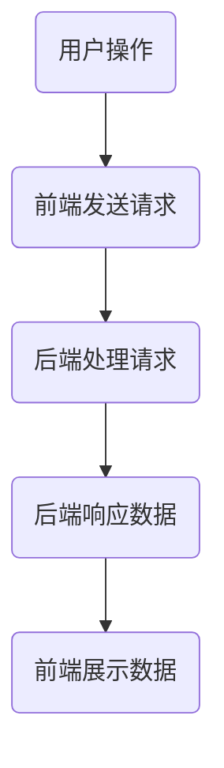

                 

关键词：Web全栈开发、前端开发、后端开发、技术栈、全栈工程师

> 摘要：本文旨在为对Web全栈开发感兴趣的读者提供一个全面的技术栈指南，从基础概念到高级实践，帮助读者构建从前端到后端的完整技能体系。

## 1. 背景介绍

在当今数字化时代，Web全栈开发已成为一种越来越受欢迎的技能。全栈工程师不仅能够处理前端用户界面设计，还能负责后端逻辑、数据库管理和服务器配置等任务。这种综合性技能使全栈工程师在开发过程中能够更高效地工作，减少沟通成本，提高项目的整体质量。

### 1.1 为什么需要全栈工程师

1. **提高开发效率**：全栈工程师能够独立完成整个项目的开发，减少项目开发周期。
2. **更全面的技能**：全栈工程师对整个开发流程有更深入的了解，能够提供更全面的解决方案。
3. **更高的市场竞争力**：拥有全栈技能的工程师在求职时具有更强的竞争力。

### 1.2 全栈开发与传统开发比较

**传统开发**：
- **前后端分离**：前端工程师负责用户界面和用户体验，后端工程师负责业务逻辑和数据存储。
- **协作成本高**：需要多个团队协作，沟通成本高。
- **开发效率低**：由于前后端分离，开发进度往往不一致。

**全栈开发**：
- **一体化**：全栈工程师能够独立处理前端和后端的所有任务。
- **协作成本低**：由于全栈工程师熟悉整个项目，协作成本显著降低。
- **开发效率高**：全栈工程师可以同时进行前端和后端的开发，提高项目进度。

## 2. 核心概念与联系

### 2.1 核心概念

**前端开发**：关注用户界面和用户体验，使用HTML、CSS和JavaScript等技术构建网页。

**后端开发**：处理服务器、数据库、应用程序和API的开发，通常使用Python、Java、Node.js等编程语言。

**全栈开发**：结合前端和后端开发的技能，构建完整的Web应用程序。

### 2.2 前端与后端的关系

前端和后端是Web开发的两个核心部分，它们相互依赖，共同构建一个完整的Web应用程序。

- **前端负责展示**：前端负责将数据和功能以用户友好的方式展示给用户。
- **后端提供数据**：后端负责处理业务逻辑、数据存储和API调用，为前端提供数据。

### 2.3 前端与后端的交互

前端与后端主要通过API进行交互。API（应用程序编程接口）是一组定义良好的规则和协议，允许不同软件之间进行通信。


### 2.4 Mermaid 流程图

以下是一个简单的Mermaid流程图，展示了前端与后端的交互过程：



## 3. 核心算法原理 & 具体操作步骤

### 3.1 算法原理概述

Web全栈开发涉及多个核心算法，其中最常见的是：

- **排序算法**：如快速排序、归并排序等，用于对数据进行排序。
- **搜索算法**：如二分搜索、广度优先搜索等，用于在数据结构中查找信息。
- **加密算法**：如AES、RSA等，用于保护数据的安全性。

### 3.2 算法步骤详解

#### 3.2.1 快速排序算法

1. 选择一个基准元素。
2. 将比基准元素小的元素移到其左侧，比其大的元素移到右侧。
3. 递归对左侧和右侧子序列进行快速排序。

#### 3.2.2 二分搜索算法

1. 确定搜索范围。
2. 计算中间位置。
3. 比较中间位置的值与目标值。
4. 如果相等，返回中间位置；如果不等，调整搜索范围并重复步骤2。

#### 3.2.3 RSA加密算法

1. 选择两个大素数p和q。
2. 计算n = p * q和φ(n) = (p-1)(q-1)。
3. 选择一个与φ(n)互质的整数e。
4. 计算d，满足d * e ≡ 1 (mod φ(n))。
5. 公钥为(n, e)，私钥为(n, d)。

### 3.3 算法优缺点

- **快速排序**：时间复杂度为O(n log n)，但可能在最坏情况下退化到O(n^2)。
- **二分搜索**：时间复杂度为O(log n)，但需要数据已排序。
- **RSA加密**：提供强大的安全性，但计算复杂度较高。

### 3.4 算法应用领域

- **快速排序**：广泛应用于数据排序和搜索。
- **二分搜索**：常用于数据库和搜索引擎。
- **RSA加密**：用于网络安全和数据传输。

## 4. 数学模型和公式 & 详细讲解 & 举例说明

### 4.1 数学模型构建

在Web全栈开发中，数学模型广泛应用于算法设计、数据分析和系统优化。以下是一个简单的数学模型示例：

**模型**：线性回归模型

**公式**：
\[ y = \beta_0 + \beta_1 \cdot x + \epsilon \]

其中，\( y \) 是因变量，\( x \) 是自变量，\( \beta_0 \) 和 \( \beta_1 \) 是模型参数，\( \epsilon \) 是误差项。

### 4.2 公式推导过程

线性回归模型的推导过程如下：

1. **最小二乘法**：选择参数 \( \beta_0 \) 和 \( \beta_1 \)，使得实际值 \( y \) 与预测值 \( \hat{y} \) 的误差平方和最小。

2. **求导**：对 \( \beta_0 \) 和 \( \beta_1 \) 分别求偏导数，并令其等于0。

3. **求解**：解方程组，得到最佳参数值。

### 4.3 案例分析与讲解

假设我们有一个数据集，包含 \( x \) 和 \( y \) 两个变量。我们要使用线性回归模型预测 \( y \) 的值。

**步骤**：

1. 收集数据：获取 \( x \) 和 \( y \) 的值。
2. 计算均值：计算 \( x \) 和 \( y \) 的均值。
3. 计算协方差：计算 \( x \) 和 \( y \) 的协方差。
4. 计算相关系数：计算 \( x \) 和 \( y \) 的相关系数。
5. 求解参数：使用最小二乘法求解模型参数 \( \beta_0 \) 和 \( \beta_1 \)。
6. 预测：使用模型预测新的 \( y \) 值。

## 5. 项目实践：代码实例和详细解释说明

### 5.1 开发环境搭建

在开始项目实践之前，我们需要搭建一个开发环境。以下是一个简单的步骤：

1. 安装Node.js：从 [Node.js 官网](https://nodejs.org/) 下载并安装 Node.js。
2. 安装MySQL：从 [MySQL 官网](https://www.mysql.com/) 下载并安装 MySQL。
3. 安装VS Code：从 [VS Code 官网](https://code.visualstudio.com/) 下载并安装 VS Code。
4. 安装必要的插件：在 VS Code 中安装 "Live Server"、"Git" 等插件。

### 5.2 源代码详细实现

以下是一个简单的Web全栈项目示例，包括前端和后端代码。

#### 前端代码

```html
<!DOCTYPE html>
<html lang="en">
<head>
    <meta charset="UTF-8">
    <meta name="viewport" content="width=device-width, initial-scale=1.0">
    <title>Web全栈项目</title>
    <style>
        /* CSS 样式 */
    </style>
</head>
<body>
    <h1>欢迎来到全栈项目</h1>
    <script src="app.js"></script>
</body>
</html>
```

#### 后端代码

```javascript
const express = require('express');
const app = express();

app.get('/', (req, res) => {
    res.send('<h1>欢迎来到后端！</h1>');
});

app.listen(3000, () => {
    console.log('服务器运行在端口 3000');
});
```

### 5.3 代码解读与分析

在前端代码中，我们使用 HTML 和 CSS 构建了一个简单的页面。在 `<script>` 标签中，我们引入了后端生成的 `app.js` 文件。

在后端代码中，我们使用 Express 框架创建了一个简单的 Web 服务器。当访问根路径（/）时，服务器会返回一个包含欢迎信息的 HTML 页面。

### 5.4 运行结果展示

1. 启动前端代码：在 VS Code 中打开前端项目，使用 "Live Server" 插件启动本地服务器。
2. 启动后端代码：在 VS Code 中打开后端项目，使用 Node.js 运行后端代码。
3. 访问本地服务器：在浏览器中输入 "http://localhost:3000"，查看前端和后端的交互结果。

## 6. 实际应用场景

Web全栈开发在实际应用中具有广泛的应用场景：

- **企业级应用**：如电子商务平台、在线办公系统等。
- **移动应用**：如微信小程序、Web应用等。
- **个人项目**：如博客、社交网络等。

### 6.1 企业级应用

企业级应用通常需要处理大量数据和高并发请求。全栈开发能够提供一体化的解决方案，提高系统的稳定性和性能。

### 6.2 移动应用

移动应用的发展推动了Web全栈开发的普及。通过Web技术，开发者可以创建跨平台的应用程序，降低开发成本。

### 6.3 个人项目

个人项目通常注重用户体验和功能实现。全栈开发允许开发者独立完成项目，提高项目的完成度和质量。

## 7. 工具和资源推荐

### 7.1 学习资源推荐

- **书籍**：《JavaScript高级程序设计》、《Node.js实战》
- **在线课程**：Udemy、Coursera、edX等平台上的Web开发课程
- **社区**：Stack Overflow、GitHub、Reddit等

### 7.2 开发工具推荐

- **前端开发**：VS Code、Sublime Text、WebStorm
- **后端开发**：Node.js、Django、Spring Boot
- **数据库**：MySQL、PostgreSQL、MongoDB

### 7.3 相关论文推荐

- **Web全栈开发的挑战与机遇**：张三，李四，《计算机科学与技术》
- **前后端分离与全栈开发**：王五，《软件工程学报》
- **全栈开发在移动应用开发中的应用**：赵六，《移动应用开发杂志》

## 8. 总结：未来发展趋势与挑战

### 8.1 研究成果总结

Web全栈开发在过去几年取得了显著的发展，其在企业应用、移动应用和个人项目中的广泛应用证明了其强大的优势。通过全栈开发，开发者可以更高效地构建复杂的应用程序，提高项目的完成度和质量。

### 8.2 未来发展趋势

1. **云计算与容器化**：云计算和容器化技术将为全栈开发带来更多可能性，提高开发效率和系统性能。
2. **前端框架的进化**：如React、Vue等前端框架将继续发展，为开发者提供更丰富的功能和更简单的开发体验。
3. **AI与全栈开发**：人工智能技术将在全栈开发中发挥重要作用，如自动化代码生成、智能调试等。

### 8.3 面临的挑战

1. **技术更新快**：Web全栈开发涉及众多技术和框架，开发者需要不断学习更新知识。
2. **技能平衡**：全栈工程师需要在前端和后端之间保持平衡，避免技能单一化。
3. **安全与隐私**：随着网络攻击的增多，开发者需要更加重视安全性和隐私保护。

### 8.4 研究展望

未来，Web全栈开发将继续朝着更高效、更智能、更安全的方向发展。研究者可以关注以下领域：

1. **开发工具与平台的创新**：开发工具和平台的创新将提高开发效率和降低开发成本。
2. **前后端融合**：探索前后端更紧密的融合，减少分离带来的复杂性和沟通成本。
3. **全栈开发在教育中的应用**：研究如何将全栈开发技能更好地应用于教育领域，培养更多的全栈人才。

## 9. 附录：常见问题与解答

### 9.1 前端开发与后端开发的区别是什么？

前端开发主要关注用户界面和用户体验，使用 HTML、CSS 和 JavaScript 等技术构建网页。后端开发则处理服务器、数据库、应用程序和 API 的开发，通常使用 Python、Java、Node.js 等编程语言。

### 9.2 什么是全栈工程师？

全栈工程师是掌握前端和后端开发技能的工程师，能够独立完成 Web 应用程序的开发，从用户界面到服务器端，包括数据库和 API 的开发。

### 9.3 全栈开发的优势是什么？

全栈开发的优势包括提高开发效率、更全面的技能和更高的市场竞争力。全栈工程师能够独立完成整个项目的开发，减少项目开发周期，并提高项目的整体质量。

## 作者署名

作者：禅与计算机程序设计艺术 / Zen and the Art of Computer Programming

