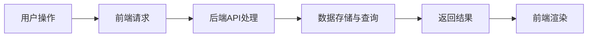

                 

关键词：Web应用架构，API设计，前后端交互，性能优化，安全防护

> 摘要：本文深入探讨了Web应用架构的核心要素，包括后端API设计和前端交互实现。通过详细分析，我们阐述了如何构建高效、安全的Web应用，同时为开发人员提供了实用的工具和资源推荐。

## 1. 背景介绍

在当今数字化时代，Web应用已经成为企业和服务提供商的重要业务支撑。随着互联网技术的不断发展和用户需求的多样化，Web应用架构的设计和实现变得越来越复杂。本文将聚焦于Web应用架构的核心组成部分，即后端API设计和前端交互实现，旨在帮助开发者构建高效、安全的Web应用。

### 什么是Web应用架构？

Web应用架构是指设计、实现和部署Web应用的整体结构和流程。一个良好的Web应用架构应当具备以下特点：

- **模块化**：将系统划分为多个模块，便于管理和扩展。
- **可扩展性**：能够灵活应对业务增长和需求变化。
- **高性能**：提供快速响应，满足用户需求。
- **安全性**：确保数据安全和系统稳定。
- **易于维护**：便于后期维护和升级。

### Web应用架构的重要性

良好的Web应用架构能够带来以下好处：

- **提升开发效率**：清晰的架构设计有助于团队协作和代码复用。
- **优化性能**：合理的架构设计能够减少系统开销，提高响应速度。
- **确保安全性**：明确的权限控制和数据加密策略能够降低安全风险。
- **易于扩展和升级**：模块化的架构设计便于后期扩展和功能升级。

## 2. 核心概念与联系

在Web应用架构中，后端API设计和前端交互是两个至关重要的组成部分。它们各自承担着不同的职责，但又紧密相连，共同构成了完整的Web应用。

### 后端API设计

后端API（应用程序接口）是连接前后端的关键桥梁，主要用于实现后端服务与前端应用的数据交互。良好的API设计应具备以下特点：

- **RESTful风格**：采用RESTful架构风格，确保接口的统一性和易用性。
- **简洁性**：接口命名简洁明了，易于理解和使用。
- **文档化**：提供详细的API文档，帮助开发者快速上手。
- **安全性**：采用身份验证和授权机制，确保接口安全。

### 前端交互实现

前端交互主要负责用户界面的渲染和交互逻辑处理，包括：

- **响应式设计**：适配不同设备和屏幕尺寸，提供良好的用户体验。
- **动态数据绑定**：通过数据绑定技术实现界面与数据的实时同步。
- **异步处理**：采用异步加载和请求处理，提高页面加载速度。

### Mermaid流程图

以下是一个简化的Web应用架构流程图，展示了后端API和前端交互之间的联系：



## 3. 核心算法原理 & 具体操作步骤

### 3.1 算法原理概述

Web应用架构涉及多个算法和设计模式，其中核心算法主要包括：

- **缓存算法**：用于提高数据查询速度，减少数据库负载。
- **负载均衡**：实现分布式部署，提高系统容灾能力。
- **数据加密**：确保数据传输和存储过程中的安全性。

### 3.2 算法步骤详解

#### 3.2.1 缓存算法

缓存算法主要包括以下步骤：

1. **缓存数据**：将频繁访问的数据存储在缓存中。
2. **命中判断**：在查询数据时，先检查缓存是否命中。
3. **更新策略**：定期更新缓存数据，避免数据过时。

#### 3.2.2 负载均衡

负载均衡算法主要包括以下步骤：

1. **流量分配**：将用户请求分配到不同的服务器。
2. **健康检查**：定期检查服务器状态，确保稳定运行。
3. **故障转移**：在服务器故障时，自动切换到备用服务器。

#### 3.2.3 数据加密

数据加密算法主要包括以下步骤：

1. **加密传输**：使用HTTPS协议，确保数据传输过程中的安全。
2. **加密存储**：使用加密算法，确保数据存储过程中的安全。
3. **密钥管理**：定期更换密钥，确保密钥安全。

### 3.3 算法优缺点

#### 缓存算法

**优点**：提高数据查询速度，减少数据库负载。

**缺点**：缓存数据不一致，可能导致数据错误。

#### 负载均衡

**优点**：提高系统容灾能力，提高访问速度。

**缺点**：增加系统复杂度，需要维护多个服务器。

#### 数据加密

**优点**：确保数据传输和存储过程中的安全。

**缺点**：增加数据传输开销，可能降低访问速度。

### 3.4 算法应用领域

缓存算法广泛应用于电商、金融等高并发场景；负载均衡广泛应用于分布式系统、云计算等场景；数据加密广泛应用于互联网安全领域。

## 4. 数学模型和公式 & 详细讲解 & 举例说明

### 4.1 数学模型构建

在Web应用架构中，常用的数学模型包括：

- **响应时间模型**：用于计算系统响应时间。
- **吞吐量模型**：用于计算系统处理能力。
- **安全强度模型**：用于评估系统安全性能。

### 4.2 公式推导过程

#### 响应时间模型

响应时间（\( T \)）的计算公式为：

\[ T = \frac{1}{\lambda} + \frac{1}{\mu} + \frac{W}{\mu} \]

其中：

- \( \lambda \)：到达率（单位时间内到达的请求数量）。
- \( \mu \)：服务率（单位时间内处理的请求数量）。
- \( W \)：等待时间（单位时间内的等待时间）。

#### 吞吐量模型

吞吐量（\( Q \)）的计算公式为：

\[ Q = \frac{\lambda}{1 - \lambda / \mu} \]

其中：

- \( \lambda \)：到达率（单位时间内到达的请求数量）。
- \( \mu \)：服务率（单位时间内处理的请求数量）。

#### 安全强度模型

安全强度（\( S \)）的计算公式为：

\[ S = \frac{1}{1 + \frac{\lambda}{\mu}} \]

其中：

- \( \lambda \)：到达率（单位时间内到达的请求数量）。
- \( \mu \)：服务率（单位时间内处理的请求数量）。

### 4.3 案例分析与讲解

以下是一个简单的Web应用架构案例分析：

- **到达率（\( \lambda \)）**：1000次/分钟。
- **服务率（\( \mu \)）**：500次/分钟。

#### 响应时间（\( T \)）：

\[ T = \frac{1}{1000} + \frac{1}{500} + \frac{W}{500} \]

假设等待时间（\( W \)）为60秒：

\[ T = 0.001 + 0.002 + \frac{60}{500} \]

\[ T = 0.001 + 0.002 + 0.12 \]

\[ T = 0.131 \]

即响应时间为0.131分钟，约为7.88秒。

#### 吞吐量（\( Q \)）：

\[ Q = \frac{1000}{1 - \frac{1000}{500}} \]

\[ Q = \frac{1000}{1 - 2} \]

\[ Q = \frac{1000}{-1} \]

由于吞吐量不能为负值，因此需要调整服务率（\( \mu \)）以满足需求。

#### 安全强度（\( S \)）：

\[ S = \frac{1}{1 + \frac{1000}{500}} \]

\[ S = \frac{1}{1 + 2} \]

\[ S = \frac{1}{3} \]

即安全强度为1/3。

## 5. 项目实践：代码实例和详细解释说明

### 5.1 开发环境搭建

为了实现一个简单的Web应用架构，我们需要搭建以下开发环境：

- **后端**：使用Python和Flask框架。
- **前端**：使用React和Redux。
- **数据库**：使用MySQL。

### 5.2 源代码详细实现

#### 后端API实现

```python
from flask import Flask, jsonify, request

app = Flask(__name__)

@app.route('/api/data', methods=['GET'])
def get_data():
    # 获取请求参数
    user_id = request.args.get('user_id')

    # 从数据库查询数据
    data = get_data_from_db(user_id)

    # 返回数据
    return jsonify(data)

def get_data_from_db(user_id):
    # 数据库查询逻辑
    return {'user_id': user_id, 'data': 'some data'}

if __name__ == '__main__':
    app.run()
```

#### 前端实现

```jsx
import React, { useState } from 'react';
import axios from 'axios';

function App() {
  const [user, setUser] = useState('');

  const fetchData = async () => {
    const response = await axios.get('/api/data', {
      params: { user_id: user },
    });
    setUser(response.data);
  };

  return (
    <div>
      <input type="text" value={user} onChange={(e) => setUser(e.target.value)} />
      <button onClick={fetchData}>Fetch Data</button>
      <pre>{JSON.stringify(user, null, 2)}</pre>
    </div>
  );
}

export default App;
```

### 5.3 代码解读与分析

#### 后端代码解读

后端代码使用Flask框架实现了简单的API接口。`get_data` 函数处理GET请求，从请求参数中获取用户ID，然后调用`get_data_from_db` 函数从数据库查询数据，最后返回JSON格式的数据。

#### 前端代码解读

前端代码使用React实现了一个简单的表单和按钮，用于输入用户ID并获取数据。当用户点击按钮时，`fetchData` 函数使用axios库向后端发送GET请求，获取数据后更新状态，并在界面上展示。

### 5.4 运行结果展示

假设用户输入ID为1001，点击按钮后，前端将向后端发送GET请求，获取用户数据，并在界面上展示返回的JSON格式数据：

```json
{
  "user_id": 1001,
  "data": "some data"
}
```

## 6. 实际应用场景

Web应用架构在实际应用中面临多种挑战和场景，以下是一些典型应用场景：

### 6.1 高并发场景

在高并发场景下，Web应用需要处理大量同时请求，如何保持系统稳定和响应速度是关键。此时，缓存算法和负载均衡算法可以发挥重要作用。

### 6.2 分布式部署

分布式部署可以提高系统容灾能力和扩展性，但同时也增加了系统复杂度。合理的架构设计和管理是确保分布式部署成功的关键。

### 6.3 安全防护

Web应用经常面临各种安全威胁，如SQL注入、跨站脚本攻击等。采用数据加密和身份验证等安全措施可以有效降低安全风险。

### 6.4 实时数据处理

在实时数据处理场景中，Web应用需要快速处理和分析海量数据。此时，分布式计算和流处理技术可以发挥重要作用。

## 7. 工具和资源推荐

### 7.1 学习资源推荐

- 《Web应用架构设计》
- 《RESTful API设计》
- 《React实战》

### 7.2 开发工具推荐

- Postman：用于API测试和调试。
- Axios：用于前端请求。
- MySQL Workbench：用于数据库管理和查询。

### 7.3 相关论文推荐

- "A Comparison of Web Application Frameworks"
- "Secure API Design Principles"
- "A Comprehensive Study of Web Performance Optimization Techniques"

## 8. 总结：未来发展趋势与挑战

### 8.1 研究成果总结

近年来，Web应用架构研究取得了显著成果，如分布式架构、微服务架构、容器化等技术的广泛应用。这些成果为开发者提供了更灵活、高效和安全的解决方案。

### 8.2 未来发展趋势

未来，Web应用架构将继续向以下几个方面发展：

- **智能化**：利用人工智能技术提高系统性能和用户体验。
- **轻量化**：简化架构，降低系统复杂度，提高开发效率。
- **安全性**：加强数据保护和隐私保护，提高系统安全性能。

### 8.3 面临的挑战

尽管Web应用架构取得了显著成果，但仍然面临以下挑战：

- **性能优化**：在高并发场景下，如何提高系统性能仍是一个重要课题。
- **安全性**：随着网络安全威胁日益增多，如何确保系统安全仍然是一个长期挑战。
- **用户体验**：如何在有限的资源下提供更好的用户体验，是一个亟待解决的问题。

### 8.4 研究展望

未来，Web应用架构研究将在以下几个方面展开：

- **性能优化算法**：研究新型性能优化算法，提高系统性能。
- **安全性研究**：加强网络安全防护，提高系统安全性。
- **用户体验优化**：探索新型交互技术和设计理念，提高用户体验。

## 9. 附录：常见问题与解答

### 9.1 什么是RESTful架构？

RESTful架构是一种网络应用的设计风格和原则，旨在实现简单、高效、易扩展的API设计。其主要特点包括：

- **统一接口**：采用统一的接口设计，便于客户端和服务端之间的交互。
- **无状态**：每次请求都是独立的，不依赖于之前的请求状态。
- **可缓存**：允许客户端缓存响应结果，提高系统性能。
- **分层系统**：通过分层架构，降低系统复杂度。

### 9.2 什么是负载均衡？

负载均衡是一种将网络流量分配到多个服务器或实例的机制，以提高系统的性能、可靠性和可用性。其主要目的包括：

- **提高性能**：将请求分配到多个服务器，减少单个服务器的负载。
- **提高可用性**：在服务器故障时，自动切换到备用服务器，确保系统正常运行。
- **提高可靠性**：通过分布式部署，提高系统的容错能力。

### 9.3 什么是缓存？

缓存是一种用于临时存储数据和信息的机制，以提高数据查询速度和系统性能。其主要应用场景包括：

- **提高性能**：通过缓存数据，减少对后端系统的访问，提高系统响应速度。
- **减轻负载**：减少数据库等后端系统的访问压力，延长系统使用寿命。
- **提高可用性**：在服务器故障时，缓存数据可以保证系统的正常运行。

### 9.4 什么是数据加密？

数据加密是一种将数据转换为不可读形式的技术，以保护数据在传输和存储过程中的安全性。其主要目的包括：

- **保护隐私**：确保数据在传输和存储过程中的隐私和安全。
- **防止篡改**：防止数据在传输过程中被篡改或窃取。
- **提高可靠性**：确保数据在传输和存储过程中的完整性和可靠性。

----------------------------------------------------------------
作者：禅与计算机程序设计艺术 / Zen and the Art of Computer Programming


