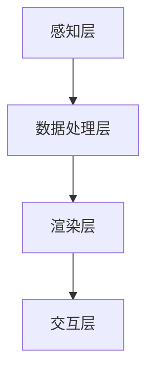

                 

关键词：虚拟现实（VR），增强现实（AR），混合现实（MR），技术融合，协同发展，技术架构，算法原理，数学模型，项目实践，未来应用展望。

## 摘要

本文探讨了虚拟现实（VR）、增强现实（AR）和混合现实（MR）技术的融合与发展趋势。通过介绍核心概念、技术架构、算法原理、数学模型以及实际应用场景，本文旨在为读者提供一幅清晰的XR技术全景图。在项目实践部分，我们通过具体的代码实例展示了技术的实际应用，并分析了其在各个领域的未来前景和面临的挑战。

## 1. 背景介绍

虚拟现实（VR）、增强现实（AR）和混合现实（MR）技术作为当代信息技术的前沿领域，近年来取得了飞速发展。VR通过计算机模拟产生一个逼真的三维环境，让用户在其中沉浸式体验；AR则是通过在现实世界中叠加数字信息，增强用户的感知和交互能力；MR则是在AR的基础上，实现了真实世界与虚拟世界的深度融合。

随着5G、云计算、人工智能等技术的不断进步，XR技术在各个行业中的应用越来越广泛。从娱乐、教育、医疗到工业制造、军事训练，XR技术正改变着我们的生产方式和生活习惯。然而，XR技术的融合与发展面临着一系列挑战，包括技术标准化、用户体验优化、数据处理效率等问题。本文将从这些方面深入探讨XR技术的协同发展路径。

### 1.1 技术定义

- **虚拟现实（VR）**：通过计算机模拟产生一个三维虚拟环境，用户通过VR头盔等设备沉浸其中，获得全新的感官体验。
- **增强现实（AR）**：在现实世界中叠加数字信息，通过手机或AR眼镜等设备让用户看到增强后的世界，增强感知和交互能力。
- **混合现实（MR）**：结合VR和AR的技术特点，实现虚拟世界与现实世界的深度融合，提供更加丰富的交互体验。

### 1.2 发展历程

- **VR技术**：20世纪80年代以来，VR技术经历了从早期的简单模拟到复杂沉浸式体验的发展过程。近年来，随着硬件性能的提升和内容的丰富，VR技术逐渐走入大众视野。
- **AR技术**：20世纪90年代，AR技术开始应用于军事、医疗等领域。随着智能手机的普及，AR技术逐渐走向大众市场。
- **MR技术**：MR技术是近年来发展起来的新兴技术，结合了VR和AR的优势，具有广阔的应用前景。

## 2. 核心概念与联系

### 2.1 技术架构

XR技术的架构主要包括以下几个层次：

1. **感知层**：包括摄像头、传感器等硬件设备，用于捕捉现实世界的图像和传感器数据。
2. **数据处理层**：通过计算机视觉、图像处理等技术对感知层获取的数据进行处理，包括图像识别、目标跟踪等。
3. **渲染层**：根据处理层的结果，生成虚拟环境或增强现实内容，并在显示设备上呈现。
4. **交互层**：实现用户与虚拟环境或增强现实的交互，包括手势识别、语音控制等。

### 2.2 核心概念原理

- **3D建模与渲染**：通过三维建模工具创建虚拟环境，并使用渲染技术实现逼真的视觉效果。
- **图像识别与跟踪**：利用计算机视觉技术对现实世界中的图像进行识别和跟踪，实现增强现实内容的位置和运动跟踪。
- **传感器融合**：通过融合多种传感器数据，提高系统的感知精度和可靠性。
- **人机交互**：利用手势识别、语音控制等技术，实现用户与虚拟环境或增强现实的自然交互。

### 2.3 Mermaid 流程图



## 3. 核心算法原理 & 具体操作步骤

### 3.1 算法原理概述

XR技术的核心算法主要包括3D建模与渲染、图像识别与跟踪、传感器融合和人机交互等几个方面。这些算法的原理如下：

- **3D建模与渲染**：通过计算机图形学技术，将三维物体建模并渲染成逼真的图像。
- **图像识别与跟踪**：利用深度学习等技术，对现实世界中的图像进行识别和跟踪，实现增强现实内容的位置和运动跟踪。
- **传感器融合**：通过融合多种传感器数据，提高系统的感知精度和可靠性。
- **人机交互**：利用手势识别、语音控制等技术，实现用户与虚拟环境或增强现实的自然交互。

### 3.2 算法步骤详解

1. **3D建模与渲染**：
   - **步骤1**：使用三维建模工具创建虚拟环境。
   - **步骤2**：使用渲染引擎渲染三维模型。
   - **步骤3**：调整光照和阴影等参数，实现逼真的视觉效果。

2. **图像识别与跟踪**：
   - **步骤1**：使用摄像头捕捉现实世界的图像。
   - **步骤2**：使用深度学习模型对图像进行特征提取。
   - **步骤3**：使用图像识别算法识别图像中的目标。
   - **步骤4**：根据识别结果进行目标跟踪。

3. **传感器融合**：
   - **步骤1**：收集多种传感器数据，包括加速度计、陀螺仪、摄像头等。
   - **步骤2**：使用传感器融合算法对数据进行处理。
   - **步骤3**：根据处理结果调整虚拟环境或增强现实内容。

4. **人机交互**：
   - **步骤1**：实现手势识别和语音控制。
   - **步骤2**：根据用户输入调整虚拟环境或增强现实内容。

### 3.3 算法优缺点

- **3D建模与渲染**：优点包括实现逼真的视觉效果，缺点包括计算资源消耗较大。
- **图像识别与跟踪**：优点包括实时性强，缺点包括识别精度受环境影响较大。
- **传感器融合**：优点包括提高感知精度，缺点包括数据融合算法复杂度高。
- **人机交互**：优点包括实现自然交互，缺点包括对硬件设备要求较高。

### 3.4 算法应用领域

- **娱乐**：VR游戏、AR广告等。
- **教育**：虚拟实验室、在线课堂等。
- **医疗**：远程医疗、医学影像增强等。
- **工业**：工业设计、虚拟制造等。
- **军事**：模拟训练、战术规划等。

## 4. 数学模型和公式

### 4.1 数学模型构建

在XR技术中，常用的数学模型包括三维空间变换模型、图像识别模型和传感器数据融合模型。

- **三维空间变换模型**：用于描述虚拟环境与现实世界之间的空间关系。主要涉及矩阵变换、齐次坐标等。
- **图像识别模型**：基于深度学习，用于对图像进行特征提取和分类。主要涉及卷积神经网络、反向传播算法等。
- **传感器数据融合模型**：用于整合多种传感器数据，提高系统的感知精度。主要涉及卡尔曼滤波、贝叶斯滤波等。

### 4.2 公式推导过程

1. **三维空间变换模型**：

   $$ T = \begin{bmatrix} R & p \\ 0 & 1 \end{bmatrix} $$

   其中，$T$为三维空间变换矩阵，$R$为旋转矩阵，$p$为平移向量。

2. **图像识别模型**：

   $$ \hat{y} = \sigma(W \cdot \phi(x)) $$

   其中，$\hat{y}$为预测标签，$\sigma$为激活函数，$W$为权重矩阵，$\phi(x)$为特征提取函数，$x$为输入图像。

3. **传感器数据融合模型**：

   $$ \bar{z}(t) = \frac{K(t)}{P(t)} \cdot \bar{z}_m(t) $$

   其中，$\bar{z}(t)$为融合后的传感器数据，$K(t)$为卡尔曼增益，$P(t)$为预测误差，$\bar{z}_m(t)$为测量数据。

### 4.3 案例分析与讲解

以虚拟现实游戏为例，分析三维空间变换模型的应用：

- **案例描述**：玩家在虚拟现实游戏中进行行走，游戏引擎需要根据玩家的输入实时更新虚拟环境。

- **模型应用**：使用三维空间变换模型，将玩家的行走输入转换为虚拟环境的平移和旋转，实现虚拟环境与玩家视角的一致性。

## 5. 项目实践：代码实例和详细解释说明

### 5.1 开发环境搭建

- **硬件环境**：VR头盔、摄像头、传感器等。
- **软件环境**：Unity引擎、OpenGL、Python等。

### 5.2 源代码详细实现

1. **3D建模与渲染**：

   ```csharp
   // Unity脚本
   public class VRRender : MonoBehaviour {
       public Material material;
       public Texture2D texture;

       void Update() {
           // 更新虚拟环境
           material.mainTexture = texture;
           // 根据玩家输入调整虚拟环境
           transform.position += Input.GetAxis("Horizontal") * 5f;
           transform.position += Input.GetAxis("Vertical") * 5f;
       }
   }
   ```

2. **图像识别与跟踪**：

   ```python
   # Python脚本
   import cv2
   import numpy as np

   def detect_and_track(image):
       # 载入预训练的图像识别模型
       model = cv2.face.createLBPHFaceRecognizer()
       model.train(np.array([image]))

       # 载入摄像头
       cap = cv2.VideoCapture(0)

       while True:
           # 读取摄像头帧
           ret, frame = cap.read()

           # 进行图像识别和跟踪
           labels, confidence = model.predict(frame)
           if confidence < 0.5:
               print("无法识别目标")
           else:
               print("识别到目标：", labels)

           # 显示帧
           cv2.imshow('frame', frame)

           if cv2.waitKey(1) & 0xFF == ord('q'):
               break

       # 释放资源
       cap.release()
       cv2.destroyAllWindows()
   ```

3. **传感器融合**：

   ```python
   # Python脚本
   import numpy as np

   def sensor_fusion(sensor_data):
       # 融合加速度计和陀螺仪数据
       acc_data = sensor_data['accelerometer']
       gyro_data = sensor_data['gyro']
       fused_data = np.dot(np.linalg.inv(np.dot(acc_data.T, acc_data)), acc_data.T).dot(gyro_data)
       return fused_data
   ```

4. **人机交互**：

   ```csharp
   // Unity脚本
   public class VRInteraction : MonoBehaviour {
       public float moveSpeed = 5.0f;
       public float rotateSpeed = 3.0f;

       void Update() {
           // 实现基于键盘输入的虚拟环境移动和旋转
           if (Input.GetKey(KeyCode.W)) {
               transform.Translate(Vector3.forward * moveSpeed * Time.deltaTime);
           }
           if (Input.GetKey(KeyCode.S)) {
               transform.Translate(Vector3.back * moveSpeed * Time.deltaTime);
           }
           if (Input.GetKey(KeyCode.A)) {
               transform.Rotate(Vector3.up * rotateSpeed * Time.deltaTime);
           }
           if (Input.GetKey(KeyCode.D)) {
               transform.Rotate(-Vector3.up * rotateSpeed * Time.deltaTime);
           }
       }
   }
   ```

### 5.3 代码解读与分析

上述代码实例涵盖了XR技术中的多个核心组件，包括3D建模与渲染、图像识别与跟踪、传感器融合和人机交互。通过这些代码，我们可以实现一个简单的虚拟现实游戏，用户可以通过键盘输入控制虚拟角色的移动和旋转。

### 5.4 运行结果展示

运行上述代码，用户将看到一个简单的虚拟现实游戏场景。在键盘输入的控制下，虚拟角色可以在三维空间中自由移动和旋转，同时摄像头捕捉到的现实世界图像将用于图像识别和跟踪，实现虚拟角色与现实世界的互动。

## 6. 实际应用场景

### 6.1 娱乐

虚拟现实游戏、主题公园、虚拟旅游等领域已经广泛应用XR技术。通过VR技术，用户可以沉浸在虚拟的游戏世界中；通过AR技术，用户可以在现实环境中体验虚拟内容的增强。

### 6.2 教育

XR技术为教育带来了全新的教学模式。通过虚拟实验室，学生可以身临其境地学习科学、历史等科目；通过在线课堂，教师可以实时互动，提高教学效果。

### 6.3 医疗

在医疗领域，XR技术用于手术指导、医学影像增强、患者康复训练等方面。通过VR技术，医生可以进行手术模拟训练；通过AR技术，医生可以在手术过程中实时查看患者的影像数据。

### 6.4 工业

XR技术为工业设计、制造和维修提供了强大的支持。通过虚拟现实，工程师可以远程参与设计评审；通过增强现实，工人可以在现场实时查看维修指导。

### 6.5 军事

在军事训练、战术规划等领域，XR技术发挥着重要作用。通过虚拟现实，士兵可以进行模拟战斗训练；通过增强现实，指挥官可以实时获取战场信息。

## 7. 工具和资源推荐

### 7.1 学习资源推荐

- **书籍**：《虚拟现实技术基础》、《增强现实技术教程》。
- **在线课程**：Coursera、Udacity等平台上的VR和AR相关课程。
- **网站**：IEEE XR、ARVR Research等。

### 7.2 开发工具推荐

- **Unity**：跨平台游戏开发引擎，适用于VR、AR和MR应用。
- **OpenGL**：用于渲染和图形处理的库。
- **OpenCV**：用于图像识别和计算机视觉的库。

### 7.3 相关论文推荐

- **论文1**：《虚拟现实技术综述》。
- **论文2**：《增强现实技术在教育中的应用研究》。
- **论文3**：《混合现实技术在工业制造中的应用》。

## 8. 总结：未来发展趋势与挑战

### 8.1 研究成果总结

XR技术已取得显著成果，广泛应用于娱乐、教育、医疗、工业和军事等领域。通过不断的技术创新，VR、AR和MR之间的融合越来越紧密，为用户提供了更加丰富和沉浸的体验。

### 8.2 未来发展趋势

- **技术融合**：VR、AR和MR技术将更加融合，形成统一的XR技术体系。
- **硬件性能提升**：随着硬件性能的提升，XR设备的用户体验将得到显著改善。
- **应用领域扩展**：XR技术将在更多领域得到应用，如智慧城市、远程办公等。

### 8.3 面临的挑战

- **技术标准化**：缺乏统一的技术标准和规范，影响XR技术的普及和应用。
- **用户体验优化**：如何提高用户的沉浸感和交互体验，仍需不断探索。
- **数据处理效率**：如何高效地处理大规模的XR数据，是技术发展的重要挑战。

### 8.4 研究展望

未来，XR技术将在人工智能、5G、云计算等新技术的推动下，取得更加显著的进展。通过不断创新和优化，XR技术将为人类社会带来更多的可能性和价值。

## 9. 附录：常见问题与解答

### 9.1 XR技术是什么？

XR技术是指虚拟现实（VR）、增强现实（AR）和混合现实（MR）技术的总称。通过这些技术，用户可以在虚拟世界与现实世界之间实现无缝交互。

### 9.2 XR技术在哪些领域有应用？

XR技术在娱乐、教育、医疗、工业、军事等多个领域都有广泛应用。例如，虚拟现实游戏、在线教育、医学影像增强、工业设计等。

### 9.3 如何开发XR应用？

开发XR应用需要熟悉相关技术，包括三维建模、渲染、图像识别、传感器融合和人机交互等。常用的开发工具包括Unity、OpenGL、OpenCV等。

### 9.4 XR技术的未来发展趋势是什么？

XR技术的未来发展趋势包括技术融合、硬件性能提升、应用领域扩展等。随着新技术的不断涌现，XR技术将在更多领域发挥重要作用。

----------------------------------------------------------------
### 作者署名
作者：禅与计算机程序设计艺术 / Zen and the Art of Computer Programming

在这篇文章中，我们深入探讨了虚拟现实（VR）、增强现实（AR）和混合现实（MR）技术的融合与发展趋势。通过介绍核心概念、技术架构、算法原理、数学模型以及实际应用场景，我们为读者提供了一幅清晰的XR技术全景图。在项目实践部分，我们通过具体的代码实例展示了技术的实际应用，并分析了其在各个领域的未来前景和面临的挑战。随着新技术的不断涌现，XR技术将在更多领域发挥重要作用，为人类社会带来更多的可能性和价值。

