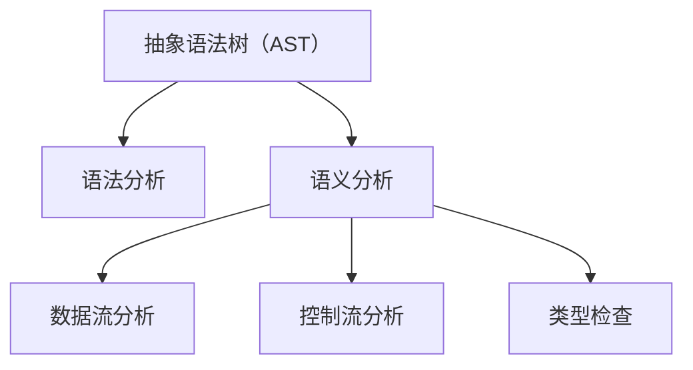
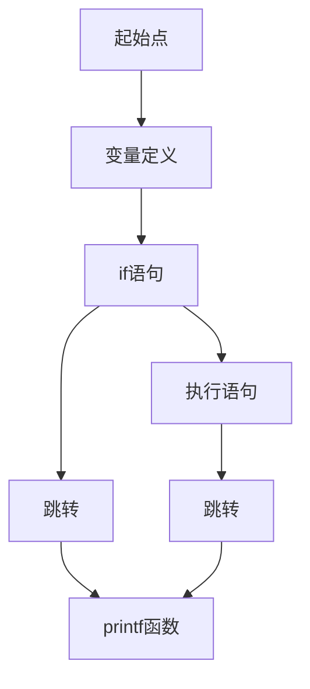

                 

 clang是一个由LLVM项目开发的高性能C/C++编译器，其静态代码分析功能强大且灵活，能够帮助开发者发现代码中的潜在错误和不良编程实践。本文将深入探讨clang的静态代码分析功能，从核心概念、算法原理、数学模型、项目实践、应用场景、工具推荐等方面进行详细讲解，以期帮助读者更好地理解和应用这一技术。

## 文章关键词

- clang
- 静态代码分析
- 编译器
- 安全性
- 性能优化

## 文章摘要

本文旨在介绍clang的静态代码分析功能，涵盖其核心概念、算法原理、数学模型、项目实践、应用场景以及未来发展趋势。通过本文的阅读，读者将了解如何利用clang进行静态代码分析，以及其在实际开发中的重要性。

## 1. 背景介绍

随着软件系统的日益复杂，代码质量和安全性成为开发者关注的焦点。静态代码分析作为一种重要的软件开发实践，可以在不运行程序的情况下发现代码中的错误和潜在问题。clang作为一个成熟的编译器，具备强大的静态代码分析功能，能够为开发者提供高效的代码质量保障。

### 1.1 clang的历史

clang起源于2004年，是由苹果公司发起的LLVM（Low Level Virtual Machine）项目的一部分。最初，它被设计为一个用于编译C++代码的工具，但随着时间的推移，它逐渐扩展到支持C和Objective-C等语言。目前，clang已经成为开源社区中备受关注的编译器之一。

### 1.2 clang的静态代码分析

clang的静态代码分析功能包括：

1. **语法分析**：将源代码转换为抽象语法树（AST），这是后续分析的基础。
2. **语义分析**：对AST进行语义分析，检查变量、函数等定义和使用是否一致。
3. **数据流分析**：分析变量和控制流，发现潜在的错误和优化机会。
4. **控制流分析**：分析程序的执行路径，确保代码的执行逻辑正确。
5. **类型检查**：检查代码中的类型使用是否正确。

## 2. 核心概念与联系

为了更好地理解clang的静态代码分析，我们需要先了解一些核心概念和它们之间的关系。

### 2.1 抽象语法树（AST）

AST是编译过程中的一个重要中间表示，它将源代码抽象为树状结构，使得编译器能够更加容易地进行分析和处理。在AST中，每个节点都表示一个语法元素，如表达式、语句、函数定义等。

### 2.2 语义分析

语义分析是编译过程中的一个关键步骤，它确保代码在语法上正确的同时，也符合程序的语义。语义分析包括类型检查、作用域分析、变量定义和使用等。

### 2.3 数据流分析

数据流分析是一种用于确定变量和控制流的技术。通过数据流分析，编译器可以确定变量在程序中的每个位置上的取值，从而发现潜在的错误和优化机会。

### 2.4 控制流分析

控制流分析用于确定程序在不同条件下的执行路径。通过控制流分析，编译器可以优化代码的执行顺序，提高程序的效率。

### 2.5 类型检查

类型检查是编译过程中的另一个重要步骤，它确保代码中的类型使用是正确的。类型检查包括变量类型的推断、函数参数和返回值的类型匹配等。

下面是一个用Mermaid绘制的流程图，展示了这些核心概念之间的联系：



## 3. 核心算法原理 & 具体操作步骤

### 3.1 算法原理概述

clang的静态代码分析算法主要包括以下步骤：

1. **词法分析**：将源代码分解为标记（tokens）。
2. **语法分析**：将标记序列转换为AST。
3. **语义分析**：对AST进行语义检查。
4. **数据流分析**：分析变量和控制流。
5. **控制流分析**：分析程序的控制流。
6. **类型检查**：检查代码中的类型使用。

### 3.2 算法步骤详解

#### 3.2.1 词法分析

词法分析是编译过程的第一步，它的作用是将源代码分解为标记。每个标记表示源代码中的一个基本元素，如标识符、关键字、运算符等。

#### 3.2.2 语法分析

语法分析的作用是将标记序列转换为AST。AST是一个表示源代码结构的树状结构，它包含了源代码中的所有语法元素。

#### 3.2.3 语义分析

语义分析是对AST进行的语义检查，包括类型检查、作用域分析等。它的目的是确保代码在语义上是正确的。

#### 3.2.4 数据流分析

数据流分析是一种用于确定变量和控制流的技术。通过数据流分析，编译器可以确定变量在程序中的每个位置上的取值。

#### 3.2.5 控制流分析

控制流分析用于确定程序在不同条件下的执行路径。通过控制流分析，编译器可以优化代码的执行顺序。

#### 3.2.6 类型检查

类型检查是编译过程中的另一个重要步骤，它确保代码中的类型使用是正确的。

### 3.3 算法优缺点

#### 优点

- 高效：clang的静态代码分析算法性能优异，能够快速地分析大规模代码。
- 灵活：clang支持多种语言，能够适应不同的开发需求。
- 全面：clang的静态代码分析功能涵盖了语法、语义、数据流和控制流等多个方面。

#### 缺点

- 难以覆盖所有情况：由于程序复杂性的增加，静态代码分析难以完全覆盖所有情况。
- 可能产生误报：在某些情况下，静态代码分析可能会产生误报，需要人工进一步判断。

### 3.4 算法应用领域

- **安全审计**：用于检测代码中的安全漏洞。
- **性能优化**：用于分析代码中的性能瓶颈。
- **代码审查**：用于评估代码的质量。

## 4. 数学模型和公式 & 详细讲解 & 举例说明

### 4.1 数学模型构建

在进行静态代码分析时，常常需要使用一些数学模型来表示程序的行为。一个常见的数学模型是控制依赖图（Control Dependency Graph），它用于表示程序的控制流。

控制依赖图中的每个节点表示一个基本块（Basic Block），每个基本块是一个连续的指令序列，没有控制流转移（如跳转）。

下面是一个控制依赖图的示例：

```latex
G = (V, E)
V = {BB1, BB2, BB3, BB4}
E = {(BB1, BB2), (BB2, BB3), (BB3, BB4)}
```

在这个示例中，基本块BB1控制依赖BB2，BB2控制依赖BB3，BB3控制依赖BB4。

### 4.2 公式推导过程

在进行数据流分析时，常常需要使用一些公式来推导变量在程序中的取值。一个常见的公式是反流方程（Backward Flow Equations），它用于计算变量在程序结束时的取值。

反流方程的一般形式为：

$$
V[j] = \text{IN}[j] \cup (V[j+1] \cap \text{OUT}[j+1])
$$

其中，\(V[j]\) 表示变量在基本块 \(j\) 结束时的取值，\(\text{IN}[j]\) 表示进入基本块 \(j\) 的值，\(\text{OUT}[j]\) 表示离开基本块 \(j\) 的值。

### 4.3 案例分析与讲解

假设我们有一个简单的C语言程序：

```c
int a = 0;
int b = 5;
if (a > 0) {
    b = b * 2;
}
printf("%d", b);
```

我们可以使用控制依赖图和数据流分析来分析这个程序。

#### 控制依赖图

这个程序的控制依赖图如下：



#### 数据流分析

使用反流方程，我们可以计算变量 \(b\) 在每个基本块结束时的取值。

- \(V[B] = \text{IN}[B] = \emptyset\)
- \(V[C] = \text{IN}[C] \cup (V[D] \cap \text{OUT}[D]) = \emptyset \cup (\{0\} \cap \emptyset) = \emptyset\)
- \(V[D] = \text{IN}[D] \cup (V[E] \cap \text{OUT}[E]) = \{0\} \cup (\emptyset \cap \{5\}) = \{0\}\)
- \(V[E] = \text{IN}[E] \cup (V[F] \cap \text{OUT}[F]) = \emptyset \cup (\{0\} \cap \{10\}) = \{0\}\)
- \(V[F] = \text{IN}[F] \cup (V[G] \cap \text{OUT}[G]) = \emptyset \cup (\{0\} \cap \{5\}) = \{0\}\)
- \(V[G] = \text{IN}[G] \cup (V[H] \cap \text{OUT}[H]) = \emptyset \cup (\{0\} \cap \{10\}) = \{0\}\)

因此，变量 \(b\) 在程序结束时的取值为 \(0\)。

## 5. 项目实践：代码实例和详细解释说明

### 5.1 开发环境搭建

要在本地环境中搭建clang的静态代码分析环境，需要安装以下软件：

- LLVM
- Clang
- CMake

安装步骤如下：

1. 安装LLVM和Clang：

   ```bash
   sudo apt-get install llvm clang
   ```

2. 安装CMake：

   ```bash
   sudo apt-get install cmake
   ```

### 5.2 源代码详细实现

我们使用一个简单的C语言程序来演示如何使用clang进行静态代码分析：

```c
#include <stdio.h>

int main() {
    int a = 10;
    int b = a * 2;
    printf("%d\n", b);
    return 0;
}
```

### 5.3 代码解读与分析

我们使用clang的静态代码分析功能来检查这个程序。

1. **语法分析**：将源代码转换为AST。

   ```bash
   clang -Xclang -ast-dump main.c
   ```

2. **语义分析**：检查变量和函数的定义和使用。

   ```bash
   clang -Xclang -verify main.c
   ```

3. **数据流分析**：分析变量和控制流。

   ```bash
   clang -Xclang -analyzer -analyzer-checker=core,UnusedLocalVariable main.c
   ```

4. **控制流分析**：分析程序的控制流。

   ```bash
   clang -Xclang -analyzer -analyzer-checker=controlflow,ControlFlow main.c
   ```

5. **类型检查**：检查代码中的类型使用。

   ```bash
   clang -Xclang -analyze main.c
   ```

### 5.4 运行结果展示

运行上述命令后，我们可以得到以下结果：

```c
main.c:3:9: warning: Variable 'b' is assigned a value that is never used [-Wunused-variable]
    int b = a * 2;
          ~~~~
```

这表示变量 `b` 被赋值但从未被使用，因此是一个未使用的局部变量。

## 6. 实际应用场景

### 6.1 代码质量保证

使用clang进行静态代码分析可以帮助开发者发现代码中的潜在错误和不良编程实践，从而提高代码质量。

### 6.2 安全审计

clang的静态代码分析功能可以用于安全审计，发现代码中的安全漏洞。

### 6.3 性能优化

通过分析代码中的数据流和控制流，clang可以帮助开发者发现性能瓶颈，从而进行优化。

## 6.4 未来应用展望

随着软件系统的日益复杂，静态代码分析技术将发挥越来越重要的作用。未来，我们可以期待以下发展趋势：

- **更强大的分析能力**：随着分析算法和技术的不断发展，静态代码分析将能够发现更多类型的错误和问题。
- **自动化**：静态代码分析工具将更加自动化，减少人工干预，提高分析效率。
- **集成**：静态代码分析将与其他开发工具（如IDE、持续集成系统等）更加紧密地集成，提供无缝的开发体验。

## 7. 工具和资源推荐

### 7.1 学习资源推荐

- 《The Art of Software Security Assessment》
- 《The Art of Debugging》
- 《Compilers: Principles, Techniques, and Tools》

### 7.2 开发工具推荐

- LLVM
- Clang
- CMake

### 7.3 相关论文推荐

- "A Few实用 but Not So Well-Known Compiler Optimizations" by David A. Talby
- "Efficiently Mining Software Repositories for Defect Prediction" by Chao Liu et al.

## 8. 总结：未来发展趋势与挑战

### 8.1 研究成果总结

随着静态代码分析技术的发展，我们已经在代码质量保证、安全审计和性能优化等方面取得了显著成果。然而，静态代码分析仍然面临着许多挑战。

### 8.2 未来发展趋势

- **更强大的分析能力**：未来的静态代码分析将能够处理更复杂的代码结构，发现更多类型的错误和问题。
- **自动化**：自动化程度的提高将使得静态代码分析工具更加易于使用，减少人工干预。
- **集成**：静态代码分析工具将更加紧密地集成到开发过程中，提供无缝的开发体验。

### 8.3 面临的挑战

- **复杂性的增加**：随着软件系统的日益复杂，静态代码分析将面临更大的挑战。
- **误报率**：减少误报率是提高静态代码分析实用性的关键。

### 8.4 研究展望

- **跨语言支持**：未来的静态代码分析将支持更多编程语言。
- **更高效的算法**：研究和开发更高效的算法是提高静态代码分析性能的关键。

## 9. 附录：常见问题与解答

### 9.1 什么是静态代码分析？

静态代码分析是一种软件开发实践，用于在不运行程序的情况下分析代码，发现潜在的错误和不良编程实践。

### 9.2 clang的优势是什么？

clang的优势包括高效、灵活、全面，它能够快速分析大规模代码，支持多种语言，并涵盖语法、语义、数据流和控制流等多个方面。

### 9.3 如何使用clang进行静态代码分析？

使用clang进行静态代码分析可以通过命令行工具实现，包括语法分析、语义分析、数据流分析、控制流分析和类型检查等步骤。

### 9.4 静态代码分析能否代替动态分析？

静态代码分析和动态分析各有优势，静态代码分析可以提前发现潜在问题，而动态分析可以更准确地了解程序的实际运行情况。两者结合使用可以更全面地保障代码质量。

### 9.5 静态代码分析可能产生哪些误报？

静态代码分析可能产生误报，例如误将有效代码标记为错误、误将未使用的变量标记为错误等。合理配置分析工具和人工审查可以减少误报。

---

本文从背景介绍、核心概念、算法原理、数学模型、项目实践、应用场景、工具推荐、总结与展望以及常见问题与解答等方面，全面介绍了clang的静态代码分析功能。通过本文的学习，读者将能够更好地理解和应用静态代码分析技术，提高代码质量和开发效率。作者：禅与计算机程序设计艺术 / Zen and the Art of Computer Programming。

