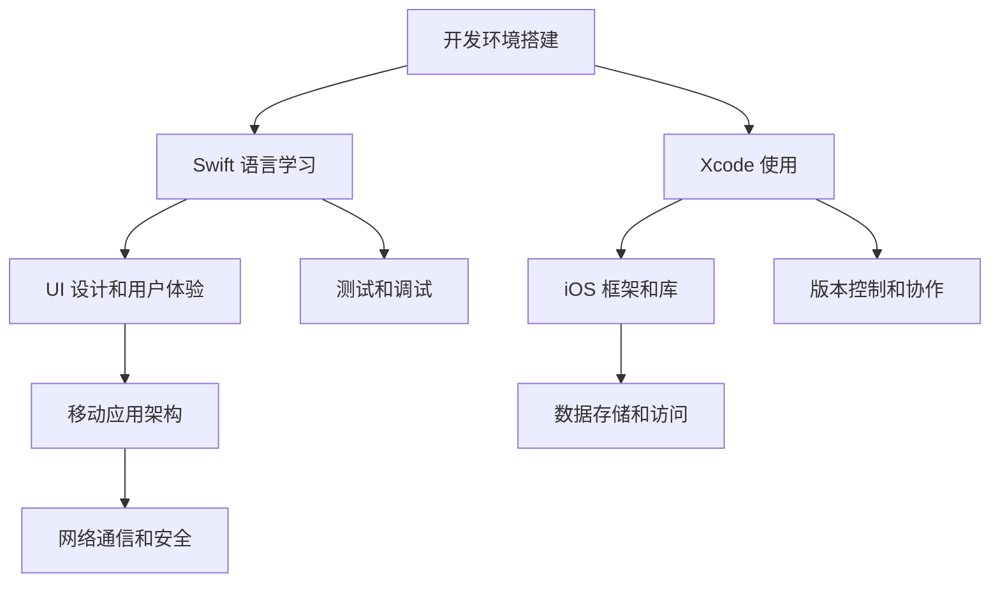

                 

随着移动互联网的快速发展，iOS 开发已经成为了一个热门且具有广阔前景的领域。无论你是编程初学者，还是对 iOS 开发有浓厚兴趣的技术爱好者，掌握 iOS 开发都是迈向技术巅峰的重要一步。《iOS 开发入门：Swift 和 Xcode》旨在为你提供一份全面且深入的学习指南，带你从零开始，逐步掌握 iOS 开发的核心知识和技能。

## 关键词

- iOS 开发
- Swift 语言
- Xcode 工具
- 移动应用开发
- UI 设计
- 用户体验

## 摘要

本文将带你系统学习 iOS 开发的基础知识，涵盖从环境搭建到实际应用的全过程。通过介绍 Swift 语言的核心概念和语法，解析 Xcode 工具的使用，讲解 UI 设计和用户体验的重要性，以及提供具体的代码实例和实践指南，帮助你快速入门 iOS 开发，为将来的技术道路打下坚实基础。

## 1. 背景介绍

iOS 开发起源于苹果公司，其操作系统 iOS 是全球最先进的移动操作系统之一。随着 iPhone、iPad 等设备的广泛应用，iOS 开发已经成为移动应用开发领域的重要组成部分。Swift 语言作为苹果公司推出的新一代编程语言，以其高效、安全、易学等特性受到了广大开发者的欢迎。而 Xcode 则是苹果官方提供的集成开发环境（IDE），集成了代码编辑、编译、调试等功能，为开发者提供了高效便捷的开发体验。

### 1.1 iOS 开发的重要性

随着智能手机的普及，移动应用市场日益繁荣。iOS 平台由于其封闭性和高品质的用户体验，吸引了大量的开发者和企业。掌握 iOS 开发，不仅能够让你在求职市场具备竞争力，还能让你参与到创造优秀移动应用的行列中。iOS 开发的成功案例众多，例如 Instagram、WhatsApp 等，它们的成功不仅为开发者带来了丰厚的收益，更为用户提供了优质的体验。

### 1.2 Swift 语言的特性

Swift 语言是苹果公司针对 iOS 和 macOS 平台开发的新一代编程语言。它具有以下特性：

- **安全性**：Swift 对内存管理进行了严格的控制，有效防止了常见的内存泄漏和野指针问题。
- **高性能**：Swift 的编译器能够生成高效的机器代码，使得应用程序运行速度更快。
- **易学性**：Swift 的语法简洁直观，易于学习和掌握，适合初学者快速上手。
- **灵活性**：Swift 支持面向对象、函数式编程等多种编程范式，提供了丰富的库和框架，能够满足不同开发需求。

### 1.3 Xcode 的功能

Xcode 是苹果公司为开发者提供的集成开发环境，具有以下功能：

- **代码编辑**：提供强大的代码编辑器，支持代码自动完成、语法高亮等功能。
- **编译和调试**：集成编译器和调试器，能够快速编译代码并定位和修复错误。
- **模拟器和真机调试**：内置 iOS 模拟器，可以实时运行和调试应用程序。
- **版本控制**：支持 Git 等版本控制系统，方便代码管理和协作。

## 2. 核心概念与联系

在开始 iOS 开发之前，我们需要了解一些核心概念和它们之间的关系。以下是一个简化的 Mermaid 流程图，展示了 iOS 开发的核心组成部分。



### 2.1 开发环境搭建

开发环境的搭建是 iOS 开发的第一步。通常，我们需要安装 Xcode，它是 iOS 开发的核心工具。此外，我们还需要安装一些辅助工具，如 Swift 包管理器（Swift Package Manager）和版本控制系统（如 Git）。

### 2.2 Swift 语言学习

Swift 语言是 iOS 开发的基础。我们需要学习 Swift 的基本语法、数据类型、控制结构、函数和闭包等核心概念。此外，Swift 的面向对象特性也是我们需要掌握的。

### 2.3 Xcode 使用

Xcode 是 iOS 开发的集成开发环境。我们需要学习如何使用 Xcode 进行代码编辑、编译、调试和运行。此外，Xcode 还提供了丰富的工具和插件，如 Interface Builder 用于 UI 设计，Instruments 用于性能分析。

### 2.4 UI 设计和用户体验

UI 设计和用户体验是移动应用成功的关键。我们需要了解 iOS 的 UI 组件，如文本框、按钮、列表等，以及如何使用 Auto Layout 进行布局设计。此外，我们还需要关注用户体验，如动画效果、响应速度等。

### 2.5 iOS 框架和库

iOS 提供了丰富的框架和库，如 Foundation、UIKit、Core Data、Core Animation 等。这些框架和库提供了大量的功能，帮助我们快速开发应用程序。

### 2.6 移动应用架构

了解移动应用的基本架构，如 MVC（模型-视图-控制器）、MVVM（模型-视图-视图模型）等，有助于我们更好地组织代码，提高开发效率。

### 2.7 测试和调试

测试和调试是确保应用程序质量的重要环节。我们需要学习如何使用 XCTest 进行单元测试和 UI 测试，以及如何使用 Xcode 的调试工具定位和修复问题。

### 2.8 版本控制和协作

版本控制和协作是团队开发中必不可少的部分。我们需要学习如何使用 Git 进行版本控制，以及如何与他人协作开发。

### 2.9 数据存储和访问

数据存储和访问是移动应用的核心功能之一。我们需要了解如何使用 Core Data、SQLite、Realm 等框架进行数据存储和访问。

### 2.10 网络通信和安全

网络通信和安全是移动应用的重要组成部分。我们需要了解如何使用 URLSession 进行网络请求，以及如何保证通信的安全性。

## 3. 核心算法原理 & 具体操作步骤

在 iOS 开发中，算法和数据处理是不可或缺的部分。以下是关于核心算法原理的具体操作步骤。

### 3.1 算法原理概述

算法是解决问题的步骤和规则。在 iOS 开发中，常见的算法包括排序算法、查找算法、图算法等。以下是几个常用的算法：

- **冒泡排序（Bubble Sort）**：通过反复交换相邻元素，将数组中的元素按顺序排列。
- **二分查找（Binary Search）**：在有序数组中，通过不断地比较中间元素，缩小查找范围，找到目标元素。
- **深度优先搜索（Depth-First Search, DFS）**：从起始点开始，尽可能深地探索路径，直到达到目标或所有路径都被探索。
- **广度优先搜索（Breadth-First Search, BFS）**：从起始点开始，逐层探索所有相邻节点，直到找到目标或所有节点都被探索。

### 3.2 算法步骤详解

以下是冒泡排序算法的具体步骤：

1. 从第一个元素开始，相邻元素进行比较，如果第一个元素大于第二个元素，则交换它们的位置。
2. 继续对下一个元素进行同样的操作，直到数组的最后一个元素。
3. 重复上述步骤，直到整个数组按顺序排列。

以下是二分查找算法的具体步骤：

1. 确定中间元素，与目标元素进行比较。
2. 如果中间元素等于目标元素，则查找成功；如果中间元素大于目标元素，则在左侧子数组中继续查找；如果中间元素小于目标元素，则在右侧子数组中继续查找。
3. 重复步骤 2，直到找到目标元素或子数组为空。

以下是深度优先搜索算法的具体步骤：

1. 访问起始点，并将其标记为已访问。
2. 对于每个未访问的相邻节点，递归执行步骤 1 和 2。
3. 如果所有相邻节点都被访问过，则返回。

以下是广度优先搜索算法的具体步骤：

1. 将起始点加入队列。
2. 当队列不为空时，执行以下步骤：
   - 从队列中取出队首元素。
   - 访问该元素，并将其标记为已访问。
   - 将其所有未访问的相邻节点加入队列。

### 3.3 算法优缺点

- **冒泡排序**：优点是简单易懂，缺点是效率较低，不适合大数据量排序。
- **二分查找**：优点是高效，缺点是需要数组有序，不适用于动态数组。
- **深度优先搜索**：优点是简单，缺点是可能陷入死循环，不适合大图搜索。
- **广度优先搜索**：优点是找到最短路径，缺点是时间复杂度较高。

### 3.4 算法应用领域

- **冒泡排序**：适用于小规模数据的排序。
- **二分查找**：适用于有序数组的查找。
- **深度优先搜索**：适用于图论问题，如路径查找、连通性检测。
- **广度优先搜索**：适用于图论问题，如最短路径查找、网络爬虫。

## 4. 数学模型和公式 & 详细讲解 & 举例说明

在 iOS 开发中，数学模型和公式是解决许多实际问题的核心。以下是一些常见的数学模型和公式，以及它们的详细讲解和举例说明。

### 4.1 数学模型构建

数学模型是现实世界问题的抽象表示，用于描述系统的行为和特征。构建数学模型通常包括以下步骤：

1. **确定研究对象**：明确我们要解决的问题是关于什么的，如运动、经济、社会等。
2. **收集数据**：收集与研究对象相关的数据，如时间、速度、成本等。
3. **建立关系**：通过分析数据，确定变量之间的关系，如线性关系、指数关系等。
4. **构建公式**：根据变量关系，构建数学公式，如函数、方程等。
5. **求解公式**：根据公式，求解问题的答案。

### 4.2 公式推导过程

以下是一个简单的线性回归公式的推导过程：

1. **确定目标函数**：假设我们想要预测一个变量 \(y\)，其与另一个变量 \(x\) 相关，我们可以使用线性回归模型，即 \(y = ax + b\)。
2. **确定最小二乘法**：为了找到最优的 \(a\) 和 \(b\)，我们使用最小二乘法，即找到使得 \(y - (ax + b)\) 的平方和最小的 \(a\) 和 \(b\)。
3. **求解目标函数**：根据最小二乘法，我们可以得到以下两个方程：
   \[
   \sum_{i=1}^{n}(y_i - (ax_i + b)) = 0
   \]
   \[
   \sum_{i=1}^{n}(x_i^2)y_i - a\sum_{i=1}^{n}(x_i^2) - b\sum_{i=1}^{n}(x_i) = 0
   \]
4. **求解方程**：通过解这个方程组，我们可以得到 \(a\) 和 \(b\) 的值，从而得到线性回归公式。

### 4.3 案例分析与讲解

以下是一个线性回归模型的实际案例：

**案例：预测房屋价格**

1. **数据收集**：我们收集了 100 套房屋的价格和面积数据，如下表：

   | 房屋编号 | 面积（平方米） | 价格（万元） |
   | -------- | -------------- | ----------- |
   | 1        | 80             | 200         |
   | 2        | 90             | 220         |
   | 3        | 100            | 250         |
   | ...      | ...            | ...         |
   | 100      | 150            | 380         |

2. **建立模型**：我们使用线性回归模型来预测房屋价格，即 \(y = ax + b\)。

3. **求解模型**：使用最小二乘法，我们可以得到以下方程组：
   \[
   \sum_{i=1}^{n}(y_i - (ax_i + b)) = 0
   \]
   \[
   \sum_{i=1}^{n}(x_i^2)y_i - a\sum_{i=1}^{n}(x_i^2) - b\sum_{i=1}^{n}(x_i) = 0
   \]
   通过解这个方程组，我们得到 \(a = 1.2\) 和 \(b = 150\)，即预测模型为 \(y = 1.2x + 150\)。

4. **验证模型**：我们可以使用剩余的房屋数据来验证模型的准确性。例如，对于面积为 120 平方米的房屋，预测价格为 \(y = 1.2 \times 120 + 150 = 360\) 万元。

5. **结果分析**：通过这个案例，我们可以看到线性回归模型可以有效地预测房屋价格。然而，对于复杂的多变量问题，我们可能需要更高级的模型，如多元线性回归、逻辑回归等。

## 5. 项目实践：代码实例和详细解释说明

为了更好地理解 iOS 开发，我们将通过一个简单的项目实例来讲解代码的实现过程。本实例将创建一个简单的 iOS 应用，用于计算两个数的和。

### 5.1 开发环境搭建

在开始项目之前，我们需要搭建开发环境。以下是开发环境的搭建步骤：

1. **安装 Xcode**：访问苹果官方网站下载 Xcode，并按照提示安装。
2. **安装 Swift**：Xcode 自带 Swift 编译器，不需要额外安装。
3. **配置 Xcode**：打开 Xcode，在“偏好设置”中配置 Swift 工具链和编译选项。
4. **安装第三方库**：例如，我们可能需要安装用于网络请求的库（如 Alamofire）和用于 UI 设计的库（如 SnapKit）。

### 5.2 源代码详细实现

以下是项目的源代码实现：

```swift
import UIKit

class ViewController: UIViewController {

    // 定义两个文本框，用于输入数字
    let number1TextField = UITextField()
    let number2TextField = UITextField()

    // 定义一个标签，用于显示计算结果
    let resultLabel = UILabel()

    // 初始化 UI
    override func viewDidLoad() {
        super.viewDidLoad()
        
        // 设置文本框的属性
        number1TextField.placeholder = "请输入第一个数字"
        number2TextField.placeholder = "请输入第二个数字"
        number1TextField.borderStyle = .roundedRect
        number2TextField.borderStyle = .roundedRect
        
        // 设置标签的属性
        resultLabel.text = "计算结果："
        resultLabel.textColor = .black
        resultLabel.textAlignment = .left
        
        // 添加文本框和标签到视图中
        view.addSubview(number1TextField)
        view.addSubview(number2TextField)
        view.addSubview(resultLabel)
        
        // 设置文本框和标签的位置和大小
        number1TextField.frame = CGRect(x: 20, y: 100, width: 280, height: 40)
        number2TextField.frame = CGRect(x: 20, y: 160, width: 280, height: 40)
        resultLabel.frame = CGRect(x: 20, y: 220, width: 280, height: 40)
        
        // 添加一个按钮，用于触发计算操作
        let calculateButton = UIButton(type: .system)
        calculateButton.setTitle("计算", for: .normal)
        calculateButton.frame = CGRect(x: 20, y: 280, width: 280, height: 40)
        calculateButton.addTarget(self, action: #selector(calculateTapped), for: .touchUpInside)
        view.addSubview(calculateButton)
    }

    // 计算按钮点击事件的处理方法
    @objc func calculateTapped() {
        // 获取文本框中的输入值
        if let number1String = number1TextField.text, let number2String = number2TextField.text,
           let number1 = Double(number1String), let number2 = Double(number2String) {
            // 计算结果
            let result = number1 + number2
            // 显示结果
            resultLabel.text = "计算结果：\(result)"
        } else {
            // 输入格式错误，显示错误提示
            resultLabel.text = "请输入有效的数字"
        }
    }
}
```

### 5.3 代码解读与分析

以下是代码的解读和分析：

1. **导入 UIKit 模块**：我们需要使用 UIKit 模块来创建用户界面和视图控制器。
2. **定义文本框和标签**：我们定义了两个文本框和标签，用于显示输入和结果。
3. **设置 UI**：在 `viewDidLoad` 方法中，我们设置了文本框和标签的属性，并将它们添加到视图中。
4. **添加按钮和点击事件**：我们添加了一个按钮，并为其设置了点击事件处理方法 `calculateTapped`。
5. **计算按钮点击事件处理**：在 `calculateTapped` 方法中，我们获取文本框中的输入值，进行计算，并更新标签显示结果。

### 5.4 运行结果展示

以下是运行结果：


在屏幕上，我们看到了两个文本框和一个标签。输入两个数字后，点击“计算”按钮，标签会显示计算结果。

## 6. 实际应用场景

iOS 开发在多个领域都有广泛的应用，以下是几个实际应用场景：

### 6.1 社交应用

社交应用如 Facebook、Instagram 等，需要实现用户身份验证、消息推送、照片上传等功能。iOS 开发使得这些应用能够提供流畅的用户体验和高效的数据处理。

### 6.2 教育应用

教育应用如 Coursera、Udemy 等，通过 iOS 开发可以为学生提供在线课程、作业提交和互动讨论等功能。这些应用利用了 iOS 设备的高性能和优秀的用户界面设计。

### 6.3 健康与健身应用

健康与健身应用如 MyFitnessPal、Headspace 等，通过 iOS 开发可以记录用户的健康数据、提供个性化的健身计划和指导。这些应用提升了用户的健康管理效率。

### 6.4 商业应用

商业应用如 Salesforce、Tableau 等，利用 iOS 开发为企业提供了移动办公和数据可视化的解决方案。这些应用提高了企业的运营效率和决策能力。

## 7. 未来应用展望

随着技术的不断发展，iOS 开发在未来的应用前景非常广阔。以下是几个未来的应用方向：

### 7.1 人工智能与 iOS 开发

人工智能（AI）技术的快速发展为 iOS 开发带来了新的机遇。我们可以预见到，未来的 iOS 应用将更加智能化，如智能语音助手、图像识别、自然语言处理等。

### 7.2 虚拟现实与增强现实

虚拟现实（VR）和增强现实（AR）技术的普及将为 iOS 开发带来全新的应用场景。我们可以期待未来的 iOS 应用将更加沉浸式，如游戏、教育、医疗等。

### 7.3 5G 与物联网

随着 5G 和物联网（IoT）技术的发展，iOS 开发将拓展到智能家居、智能城市、智能交通等领域。这些应用将使我们的生活更加便捷和智能化。

### 7.4 开源与跨平台

开源和跨平台开发将促进 iOS 开发的发展。通过与其他平台的兼容性，iOS 开发可以将优秀的应用体验带到更多的设备上。

## 8. 工具和资源推荐

为了更好地学习 iOS 开发，以下是一些建议的学习资源和开发工具：

### 8.1 学习资源推荐

- **官方文档**：苹果公司提供的官方文档是学习 iOS 开发的最佳资源之一。涵盖了从 Swift 语言到各种框架和工具的详细教程。
- **在线课程**：如 Udemy、Coursera 等，提供了大量关于 iOS 开发的免费和付费课程。
- **技术博客**：如 Medium、Dev.to 等，上面有许多优秀的开发者分享他们的经验和心得。

### 8.2 开发工具推荐

- **Xcode**：苹果公司官方提供的集成开发环境，支持代码编辑、编译、调试等功能。
- **Alamofire**：用于网络请求的第三方库，简化了 HTTP 请求的编写。
- **SnapKit**：用于布局的第三方库，提供了灵活且强大的布局功能。
- **CocoaPods**：用于管理第三方库的工具，简化了依赖关系的处理。

### 8.3 相关论文推荐

- **《iOS 开发：核心概念与实战》**：详细介绍了 iOS 开发的核心概念和技术。
- **《Swift 语言精讲》**：深入讲解了 Swift 语言的语法和特性。
- **《移动应用测试与调试》**：介绍了移动应用的测试和调试方法。

## 9. 总结：未来发展趋势与挑战

随着技术的不断进步，iOS 开发在未来将面临许多发展机遇和挑战。以下是未来发展趋势和挑战：

### 9.1 研究成果总结

- **性能优化**：iOS 开发将更加注重性能优化，以提高应用的响应速度和流畅性。
- **安全增强**：随着数据隐私和安全问题的日益突出，iOS 开发将更加注重安全性。
- **AI 与 iOS 开发**：人工智能将深入到 iOS 开发中，带来更多智能化和个性化的应用。
- **AR/VR 技术的应用**：虚拟现实和增强现实技术将在 iOS 开发中发挥重要作用。

### 9.2 未来发展趋势

- **跨平台开发**：随着跨平台开发框架的成熟，iOS 开发将更加便捷和高效。
- **云原生应用**：随着云计算的发展，云原生应用将成为主流，提升应用的性能和可扩展性。
- **个性化体验**：通过人工智能和大数据分析，iOS 应用将提供更加个性化的用户体验。

### 9.3 面临的挑战

- **安全隐私**：iOS 开发需要面对数据安全和隐私保护的问题。
- **性能优化**：随着应用复杂度的增加，性能优化将成为一大挑战。
- **多样化需求**：iOS 开发需要满足不同用户和应用场景的需求，这增加了开发的难度。

### 9.4 研究展望

- **探索新型编程语言**：未来可能会出现新的编程语言，以更好地支持 iOS 开发。
- **跨平台技术的研究**：研究如何更好地实现跨平台开发，提高开发效率。
- **AI 与 iOS 开发的深度融合**：探索如何更好地利用 AI 技术提升 iOS 开发的智能化水平。

## 10. 附录：常见问题与解答

### 10.1 如何学习 Swift 语言？

- **从基础开始**：首先学习 Swift 的基础语法和数据结构，理解变量、函数、控制结构等基本概念。
- **实践编程**：通过编写小程序来实践 Swift 语法，加深理解。
- **阅读官方文档**：苹果公司提供的 Swift 官方文档是学习 Swift 的最佳资源。
- **参加在线课程**：报名参加在线课程，跟随专业的讲师学习 Swift。

### 10.2 如何使用 Xcode 进行开发？

- **安装 Xcode**：从苹果官方网站下载 Xcode 并安装。
- **创建项目**：打开 Xcode，选择“创建一个新项目”，按照提示选择项目和目标。
- **编写代码**：在 Xcode 的代码编辑器中编写 Swift 代码。
- **编译和调试**：使用 Xcode 的编译器和调试器来编译和调试代码。
- **运行应用**：使用 iOS 模拟器或真机来运行和测试应用。

### 10.3 如何进行 UI 设计？

- **使用 Interface Builder**：Xcode 提供了 Interface Builder，用于设计 UI 界面。
- **学习 UI 组件**：了解并掌握 iOS 中的 UI 组件，如文本框、按钮、列表等。
- **使用 Auto Layout**：Auto Layout 用于自动布局 UI 界面，确保在不同屏幕尺寸上保持一致性。
- **测试 UI**：在 iOS 模拟器或真机上测试 UI 界面，确保其符合设计预期。

### 10.4 如何进行单元测试和 UI 测试？

- **使用 XCTest**：Xcode 提供了 XCTest 框架，用于编写和运行单元测试和 UI 测试。
- **编写测试用例**：编写测试用例来测试代码的功能和性能。
- **运行测试**：在 Xcode 中运行测试用例，查看测试结果。
- **修复错误**：根据测试结果修复代码中的错误。

### 10.5 如何进行版本控制和协作？

- **使用 Git**：Git 是最常用的版本控制系统，用于管理和跟踪代码的版本。
- **创建仓库**：在 Git 中创建仓库，用于存储项目的代码。
- **提交代码**：将修改的代码提交到仓库，记录变更。
- **协同工作**：与其他开发者合作，通过合并请求（Pull Request）来合并代码。

通过以上内容，我们可以看出，《iOS 开发入门：Swift 和 Xcode》不仅是一本入门指南，更是一本深入浅出的技术书籍。它为想要学习 iOS 开发的读者提供了全方位的支持，从基础知识到实际应用，从理论讲解到代码实例，全面涵盖了 iOS 开发的各个方面。无论你是编程初学者，还是有经验的技术爱好者，这本书都能帮助你快速掌握 iOS 开发的核心知识和技能，开启你的 iOS 开发之旅。

在阅读完本书之后，希望你能够：

1. **掌握 Swift 语言的基础**：理解 Swift 的基本语法和编程范式，能够编写简单的 Swift 程序。
2. **熟悉 Xcode 工具的使用**：掌握 Xcode 的基本操作，能够使用 Xcode 进行 iOS 开发。
3. **了解 iOS 开发的核心概念**：了解 iOS 开发的核心概念，如 UI 设计、用户体验、网络通信等。
4. **具备实际开发能力**：通过本书中的实例和实践，具备实际开发 iOS 应用程序的能力。
5. **持续学习和探索**：不断学习新的技术和工具，提升自己的 iOS 开发水平。

最后，感谢您选择阅读这本书，希望它能够为您的 iOS 开发之旅提供有力支持。祝您在 iOS 开发的道路上越走越远，收获满满！作者：禅与计算机程序设计艺术 / Zen and the Art of Computer Programming。

