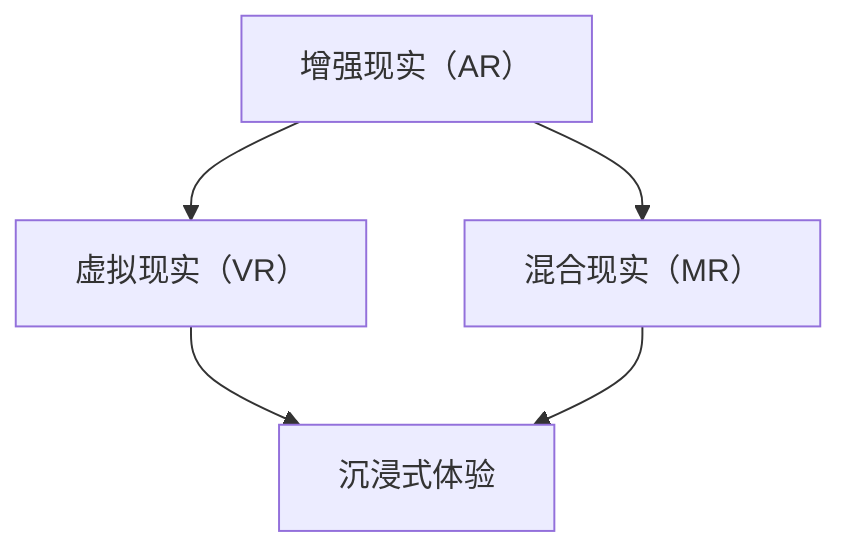

                 

关键词：iOS 进阶、Apple 设计原则、ARKit、用户体验、AR 应用开发、性能优化、安全策略

> 摘要：本文将深入探讨 iOS 开发的进阶领域，重点介绍 Apple 的设计原则以及 ARKit 的使用。我们将从背景介绍开始，逐步深入到核心概念、算法原理、数学模型、项目实践、应用场景、工具资源推荐，最后总结未来发展趋势和挑战。希望通过本文，能够帮助开发者更好地理解 iOS 进阶技术和设计理念，提升开发水平。

## 1. 背景介绍

随着移动设备的普及和用户需求的增加，iOS 开发已经成为程序员们必须掌握的技能之一。Apple 公司一直以其独特的设计原则和优秀的用户体验赢得了用户的喜爱。在这篇文章中，我们将重点关注 Apple 的设计原则，以及 ARKit 在 iOS 开发中的应用。

Apple 的设计原则包括简洁、一致性、可访问性和人性化。这些原则不仅体现在 iOS 操作系统的设计上，也贯穿于每一个应用的开发中。ARKit 作为 Apple 推出的一款增强现实（AR）开发框架，使得 iOS 开发者能够更加轻松地创建 AR 应用。

## 2. 核心概念与联系

在介绍 ARKit 之前，我们首先需要了解一些核心概念，包括增强现实（AR）、虚拟现实（VR）、混合现实（MR）等。以下是它们的定义及其联系：



### 2.1 增强现实（AR）

增强现实（AR）是一种将虚拟信息叠加到现实世界中的技术。它通过摄像头捕捉现实世界的图像，然后在这些图像上叠加虚拟元素。ARKit 是 Apple 推出的一款用于 iOS 开发的 AR 框架，它提供了多种功能，包括场景理解、图像识别、3D 对象渲染等。

### 2.2 虚拟现实（VR）

虚拟现实（VR）是一种完全沉浸式的体验，它通过头戴显示器（HMD）将用户带入一个虚拟环境中。VR 的目标是完全替代用户的视觉和听觉体验，使其感觉仿佛置身于另一个世界。

### 2.3 混合现实（MR）

混合现实（MR）是 AR 和 VR 的结合。它不仅提供 AR 的增强现实体验，还允许用户与虚拟元素进行交互。MR 的目标是创建一个与现实世界无缝融合的虚拟环境。

## 3. 核心算法原理 & 具体操作步骤

### 3.1 算法原理概述

ARKit 使用了多种算法来处理图像和场景。以下是其中一些核心算法：

- **图像识别与跟踪**：通过识别和跟踪现实世界中的图像，ARKit 能够将虚拟元素叠加到这些图像上。
- **场景理解**：ARKit 使用计算机视觉算法来理解场景的几何结构，从而更好地放置和渲染虚拟元素。
- **3D 对象渲染**：ARKit 提供了强大的 3D 渲染功能，使得开发者能够轻松地创建和渲染高质量的虚拟对象。

### 3.2 算法步骤详解

以下是 ARKit 的基本使用步骤：

1. **配置 ARSceneDelegate**：在应用中配置 ARSceneDelegate，以接收 ARKit 提供的更新和事件。
2. **创建 ARScene**：使用 ARSCNView 创建一个 ARScene，这是应用中显示 3D 对象的视图。
3. **设置 ARSCNView 的内容模式**：将 ARSCNView 的内容模式设置为 `.freeform`，以便在屏幕上渲染 3D 对象。
4. **配置 ARSession**：配置 ARSession，包括设置 ARWorldTrackingConfiguration，以启用场景理解和跟踪。
5. **添加 3D 对象**：使用 ARSCNView 的方法添加 3D 对象，如 SCNNode。
6. **处理 ARSCNView 的更新**：在 ARSceneDelegate 的方法中处理 ARSCNView 的更新，以实时渲染 3D 对象。

### 3.3 算法优缺点

ARKit 的优点包括：

- **简单易用**：ARKit 为开发者提供了简单的接口和丰富的功能，使得 AR 应用的开发变得更加简单。
- **高性能**：ARKit 使用了 Apple 的强大硬件和优化的算法，提供了高性能的 AR 体验。
- **广泛的应用场景**：ARKit 可以用于各种 AR 应用，如游戏、教育、零售等。

ARKit 的缺点包括：

- **对硬件要求较高**：ARKit 需要高质量的摄像头和强大的处理器，这可能会限制一些设备的使用。
- **开发成本较高**：由于 AR 应用需要高质量的图像处理和 3D 渲染，开发成本可能会相对较高。

### 3.4 算法应用领域

ARKit 主要应用于以下领域：

- **游戏开发**：ARKit 使得开发者能够创建出高质量的 AR 游戏，如《Pokémon GO》。
- **教育培训**：ARKit 可以用于创建交互式的教育应用，使得学习变得更加有趣和有效。
- **零售体验**：ARKit 可以帮助零售商创建虚拟试衣间或产品展示，提升购物体验。

## 4. 数学模型和公式 & 详细讲解 & 举例说明

### 4.1 数学模型构建

ARKit 的核心算法包括图像识别、场景理解和 3D 对象渲染。以下是这些算法的基本数学模型：

- **图像识别与跟踪**：使用特征点匹配算法，如 SIFT 或 SURF，来识别和跟踪图像。
- **场景理解**：使用深度学习算法，如卷积神经网络（CNN），来理解场景的几何结构。
- **3D 对象渲染**：使用图形渲染管线，如 OpenGL 或 Metal，来渲染 3D 对象。

### 4.2 公式推导过程

以下是图像识别与跟踪的基本公式推导：

1. **特征点提取**：
   $$ F(x, y) = \sum_{i=1}^{n} w_i \cdot f_i(x, y) $$
   其中，$f_i(x, y)$ 是特征点在图像上的响应值，$w_i$ 是权重。

2. **特征点匹配**：
   $$ d(p, q) = \sqrt{(x_p - x_q)^2 + (y_p - y_q)^2} $$
   其中，$(x_p, y_p)$ 和 $(x_q, y_q)$ 是特征点 $p$ 和 $q$ 的坐标。

3. **相机运动模型**：
   $$ \mathbf{T} = \begin{bmatrix} \mathbf{R} & \mathbf{t} \\ \mathbf{0} & 1 \end{bmatrix} $$
   其中，$\mathbf{R}$ 是旋转矩阵，$\mathbf{t}$ 是平移向量。

### 4.3 案例分析与讲解

以下是使用 ARKit 开发的一个简单案例：创建一个简单的 AR 应用，将一个虚拟立方体叠加到现实世界的图像上。

1. **创建 ARScene**：
   ```swift
   let arScene = ARScene()
   arScene.delegate = self
   arScene.session.run(
     ARWorldTrackingConfiguration(),
     options: [.resetTracking, .removeExistingAnchors])
   ```

2. **添加 3D 对象**：
   ```swift
   let cube = SCNBox(width: 0.1, height: 0.1, length: 0.1, chamferRadius: 0)
   let cubeNode = SCNNode(geometry: cube)
   cubeNode.position = SCNVector3(x: 0, y: 0.1, z: -1)
   arScene.rootNode.addChildNode(cubeNode)
   ```

3. **处理 ARScene 的更新**：
   ```swift
   func renderer(_ renderer: SCNSceneRenderer, updateAtTime time: TimeInterval) {
     // 更新虚拟立方体的位置
     cubeNode.position = SCNVector3(
       x: cos(Float(time) * 0.1) * 1,
       y: sin(Float(time) * 0.1) * 1,
       z: -1)
   }
   ```

## 5. 项目实践：代码实例和详细解释说明

### 5.1 开发环境搭建

1. **安装 Xcode**：从 [Apple Developer 网站](https://developer.apple.com/xcode/) 下载并安装最新的 Xcode。
2. **安装 Swift 编程语言**：从 [Swift.org](https://swift.org/) 下载并安装 Swift。
3. **创建新项目**：在 Xcode 中创建一个新项目，选择 "SwiftUI App" 或 "Single View App" 模板。

### 5.2 源代码详细实现

以下是使用 ARKit 创建一个简单 AR 应用的示例代码：

```swift
import UIKit
import ARKit

class ViewController: UIViewController, ARSCNViewDelegate {

    let arSceneView = ARSCNView()

    override func viewDidLoad() {
        super.viewDidLoad()

        arSceneView.delegate = self
        arSceneView.session.run(
          ARWorldTrackingConfiguration(),
          options: [.resetTracking, .removeExistingAnchors])

        let cube = SCNBox(width: 0.1, height: 0.1, length: 0.1, chamferRadius: 0)
        let cubeNode = SCNNode(geometry: cube)
        cubeNode.position = SCNVector3(x: 0, y: 0.1, z: -1)
        arSceneView.scene.rootNode.addChildNode(cubeNode)

        self.view.addSubview(arSceneView)
    }

    func renderer(_ renderer: SCNSceneRenderer, updateAtTime time: TimeInterval) {
        // 更新虚拟立方体的位置
        cubeNode.position = SCNVector3(
          x: cos(Float(time) * 0.1) * 1,
          y: sin(Float(time) * 0.1) * 1,
          z: -1)
    }
}
```

### 5.3 代码解读与分析

上述代码首先创建了一个 ARSCNView，并配置了 ARWorldTrackingConfiguration。然后，创建了一个虚拟立方体并将其添加到 ARScene 的根节点。在 renderer 方法中，通过修改立方体的位置来实现动画效果。

### 5.4 运行结果展示

运行应用后，会在屏幕上看到一个虚拟立方体，它会随着时间的变化在屏幕上旋转。

## 6. 实际应用场景

ARKit 在实际应用场景中具有广泛的应用价值。以下是几个常见的应用场景：

- **游戏开发**：开发者可以使用 ARKit 创建出高质量的 AR 游戏，如《Pokémon GO》。
- **教育培训**：ARKit 可以用于创建交互式的教育应用，使学习变得更加有趣和有效。
- **零售体验**：ARKit 可以帮助零售商创建虚拟试衣间或产品展示，提升购物体验。

### 6.1 案例分析

《Pokémon GO》是一款成功的 AR 游戏，它通过 ARKit 技术，将虚拟的宝可梦叠加到现实世界中，为玩家带来全新的游戏体验。该游戏的开发团队使用了 ARKit 的图像识别和场景理解功能，使得玩家能够在现实世界中捕捉宝可梦。

### 6.2 未来应用展望

随着技术的不断发展，ARKit 在未来的应用前景将更加广阔。以下是一些可能的未来应用：

- **医疗健康**：ARKit 可以用于医疗培训，帮助医生更好地理解人体结构。
- **工程建筑**：ARKit 可以用于工程设计和建筑模拟，提升设计效率。
- **旅游体验**：ARKit 可以用于旅游应用，为游客提供更加丰富的旅游体验。

## 7. 工具和资源推荐

### 7.1 学习资源推荐

- **官方文档**：[ARKit 官方文档](https://developer.apple.com/documentation/arkit) 是学习 ARKit 的最佳资源。
- **在线教程**：[SwiftUI 教程](https://www.swiftui-tutorial.com/) 和 [ARKit 教程](https://www.raywenderlich.com/series/arkit-tutorials) 提供了丰富的 ARKit 开发教程。
- **视频课程**：[Udemy](https://www.udemy.com/) 和 [Coursera](https://www.coursera.org/) 提供了多种关于 ARKit 和 iOS 开发的视频课程。

### 7.2 开发工具推荐

- **Xcode**：Apple 的官方开发工具，用于 iOS 应用开发。
- **Swift playgrounds**：用于 Swift 语言学习和实验的在线工具。
- **ARKit Model Studio**：用于创建 ARKit 场景的图形界面工具。

### 7.3 相关论文推荐

- **"Augmented Reality: A Survey"**：对 AR 技术的全面综述。
- **"Real-Time Scene Understanding with ARKit"**：介绍 ARKit 的场景理解算法。

## 8. 总结：未来发展趋势与挑战

随着 AR 技术的不断发展，iOS 开发中的 ARKit 将成为开发者必备的技能之一。未来，ARKit 在游戏、教育、医疗、零售等领域的应用将更加广泛。然而，ARKit 也面临着一些挑战，如对硬件性能的要求、开发成本等。开发者需要不断学习新的技术和工具，以应对这些挑战。

## 9. 附录：常见问题与解答

### 9.1 什么是 ARKit？

ARKit 是 Apple 推出的一款用于 iOS 开发的 AR 框架，它提供了丰富的功能，包括图像识别、场景理解、3D 对象渲染等。

### 9.2 ARKit 需要什么样的硬件支持？

ARKit 需要高质量的摄像头和强大的处理器。iPhone 6s 及以上的设备都支持 ARKit。

### 9.3 如何在 iOS 应用中使用 ARKit？

在 iOS 应用中，可以使用 ARKit 的 ARSceneView 和 ARSession 进行 AR 场景的创建和渲染。

### 9.4 ARKit 有哪些优缺点？

ARKit 的优点包括简单易用、高性能、广泛的应用场景。缺点包括对硬件要求较高、开发成本较高。

### 9.5 ARKit 有哪些应用领域？

ARKit 主要应用于游戏开发、教育培训、零售体验等领域。

### 9.6 如何学习 ARKit？

可以通过官方文档、在线教程、视频课程等多种途径学习 ARKit。

---

作者：禅与计算机程序设计艺术 / Zen and the Art of Computer Programming
----------------------------------------------------------------


