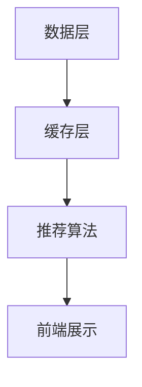

                 

关键词：推荐系统、kv-cache、数据处理、算法优化、性能提升

摘要：本文将深入探讨kv-cache在推荐系统中的应用。通过对推荐系统架构的简要介绍，我们将了解kv-cache在其中的重要作用。随后，我们将详细讨论kv-cache的核心概念、算法原理及其在推荐系统中的具体应用。最后，我们将通过实际项目实践和未来应用展望，进一步阐述kv-cache在推荐系统中的重要性和广阔前景。

## 1. 背景介绍

推荐系统是一种信息过滤技术，旨在根据用户的历史行为和偏好，向用户推荐相关的商品、服务或内容。随着互联网的快速发展，推荐系统在电商、社交媒体、新闻资讯等领域得到广泛应用。然而，推荐系统的性能和准确性面临着巨大的挑战。为此，各种缓存技术应运而生，其中kv-cache作为一种高效的存储和检索技术，在推荐系统中发挥着重要作用。

### 推荐系统的基本架构

推荐系统通常包括以下几个关键组件：

1. **数据收集与预处理**：从各种数据源（如用户行为数据、商品数据等）中收集信息，并进行数据清洗、转换和集成，为后续推荐算法提供基础数据。

2. **推荐算法**：根据用户历史行为和偏好，利用算法生成推荐结果。常见的推荐算法有基于内容的推荐、协同过滤推荐和混合推荐等。

3. **缓存层**：缓存层用于存储推荐结果，以减少对后端数据存储的访问，提高系统性能。

4. **前端展示**：将推荐结果以用户友好的方式展示给用户。

### kv-cache的基本概念

kv-cache，即键值（key-value）缓存，是一种简单但高效的数据存储结构。它通过键（key）快速查找和存储对应的值（value），常用于解决数据读取频繁、访问速度要求高的场景。kv-cache具有以下优点：

- **高速访问**：通过哈希表实现键值对的快速查找，访问速度远超传统关系数据库。
- **存储容量大**：可以存储海量数据，满足大规模推荐系统需求。
- **扩展性好**：根据实际需求动态调整存储容量，易于维护和扩展。

## 2. 核心概念与联系

在推荐系统中，kv-cache的核心概念和架构如下：

### 核心概念

- **键（Key）**：用于唯一标识数据记录，如用户ID、商品ID等。
- **值（Value）**：存储具体的数据内容，如用户行为数据、推荐结果等。
- **缓存策略**：用于控制缓存中数据的有效期和替换规则，常见的有LRU（最近最少使用）、LFU（最少使用）等。

### 架构


- **数据层**：包括用户行为数据、商品数据等原始数据。
- **缓存层**：利用kv-cache存储推荐结果，减少对后端数据存储的访问。
- **推荐算法**：根据用户历史行为和偏好生成推荐结果，并存入缓存层。
- **前端展示**：将缓存中的推荐结果展示给用户。

### Mermaid 流程图



## 3. 核心算法原理 & 具体操作步骤

### 3.1 算法原理概述

kv-cache在推荐系统中的应用主要基于以下原理：

1. **数据缓存**：将频繁访问的数据缓存到内存中，以减少对后端存储的访问压力，提高系统性能。
2. **缓存更新**：根据缓存策略定期更新缓存中的数据，确保推荐结果的实时性和准确性。
3. **缓存一致性**：保证缓存层和后端数据存储的一致性，防止数据异常。

### 3.2 算法步骤详解

1. **数据收集与预处理**：从各个数据源收集用户行为数据，如点击、购买、收藏等，并进行预处理，转换为推荐算法所需的格式。
2. **推荐算法计算**：根据用户历史行为和偏好，利用推荐算法计算推荐结果。
3. **数据存储**：将推荐结果存储到缓存层，利用kv-cache实现快速存储和检索。
4. **缓存更新**：根据缓存策略定期更新缓存中的数据，确保推荐结果的实时性和准确性。
5. **前端展示**：将缓存中的推荐结果展示给用户。

### 3.3 算法优缺点

#### 优点：

- **高速访问**：利用kv-cache实现数据的高速存储和检索，大幅提高系统性能。
- **扩展性好**：根据实际需求动态调整缓存容量，易于维护和扩展。
- **成本低**：相对于其他缓存技术，kv-cache实现简单，成本较低。

#### 缺点：

- **缓存一致性**：需要确保缓存层和后端数据存储的一致性，增加了一定的复杂性。
- **内存消耗**：缓存大量数据可能导致内存消耗较大，需合理规划缓存策略。

### 3.4 算法应用领域

kv-cache在推荐系统中具有广泛的应用领域，主要包括：

- **电商推荐**：根据用户的历史购买行为、浏览记录等推荐相关商品。
- **社交媒体**：根据用户关注、点赞、评论等行为推荐相关内容。
- **新闻资讯**：根据用户的阅读偏好推荐相关新闻。

## 4. 数学模型和公式 & 详细讲解 & 举例说明

### 4.1 数学模型构建

在推荐系统中，常用的数学模型包括矩阵分解、神经网络等。下面以矩阵分解为例，介绍数学模型的构建过程。

#### 矩阵分解

设用户行为矩阵为$U \in \mathbb{R}^{m \times n}$，其中$m$表示用户数，$n$表示商品数。目标是将用户行为矩阵分解为用户特征矩阵$U^{\prime} \in \mathbb{R}^{m \times k}$和商品特征矩阵$V^{\prime} \in \mathbb{R}^{n \times k}$，其中$k$表示特征维度。

$$
U^{\prime}V^{\prime} = U
$$

通过求解上述矩阵分解问题，可以得到用户和商品的潜在特征表示，进而生成推荐结果。

### 4.2 公式推导过程

#### 用户特征矩阵$U^{\prime}$的推导

假设用户特征矩阵$U^{\prime}$的每一行为用户$u_i$的潜在特征表示，则用户$u_i$与商品$v_j$的预测评分可以表示为：

$$
r_{ij} = \langle u_i^{\prime}, v_j^{\prime} \rangle = \sum_{k=1}^{k} u_{ik}v_{jk}
$$

其中$\langle \cdot, \cdot \rangle$表示内积。

#### 商品特征矩阵$V^{\prime}$的推导

同样地，假设商品特征矩阵$V^{\prime}$的每一行为商品$v_j$的潜在特征表示，则用户$u_i$与商品$v_j$的预测评分可以表示为：

$$
r_{ij} = \langle u_i^{\prime}, v_j^{\prime} \rangle = \sum_{k=1}^{k} u_{ik}v_{jk}
$$

#### 矩阵分解问题求解

矩阵分解问题可以通过优化目标函数求解：

$$
\min_{U^{\prime}, V^{\prime}} \sum_{i=1}^{m} \sum_{j=1}^{n} (r_{ij} - \langle u_i^{\prime}, v_j^{\prime} \rangle)^2
$$

其中$r_{ij}$为实际评分，$\langle u_i^{\prime}, v_j^{\prime} \rangle$为预测评分。

### 4.3 案例分析与讲解

假设有一个包含100个用户和1000个商品的推荐系统，用户行为数据如下表：

| 用户ID | 商品ID | 实际评分 |
|-------|-------|---------|
| 1     | 100   | 5       |
| 1     | 200   | 3       |
| 1     | 300   | 4       |
| 2     | 100   | 4       |
| 2     | 200   | 5       |
| ...   | ...   | ...     |

#### 数据预处理

将用户行为数据转换为用户行为矩阵$U \in \mathbb{R}^{100 \times 1000}$，其中用户ID作为行索引，商品ID作为列索引，实际评分作为矩阵元素。

#### 矩阵分解

设用户特征矩阵$U^{\prime} \in \mathbb{R}^{100 \times 5}$和商品特征矩阵$V^{\prime} \in \mathbb{R}^{1000 \times 5}$，利用矩阵分解算法求解：

$$
U^{\prime}V^{\prime} = U
$$

通过优化目标函数，得到用户特征矩阵$U^{\prime}$和商品特征矩阵$V^{\prime}$。

#### 预测评分

根据用户特征矩阵$U^{\prime}$和商品特征矩阵$V^{\prime}$，计算用户$u_1$与商品$v_{100}$的预测评分：

$$
r_{1,100} = \langle u_1^{\prime}, v_{100}^{\prime} \rangle = \sum_{k=1}^{5} u_{1k}v_{100k} = 4.2
$$

预测评分约为4.2，与实际评分5较为接近。

## 5. 项目实践：代码实例和详细解释说明

### 5.1 开发环境搭建

本节以Python为例，介绍如何搭建推荐系统项目环境。

#### Python环境

确保已安装Python 3.6及以上版本。可以从[Python官网](https://www.python.org/)下载并安装。

#### 库安装

安装以下常用库：

- NumPy：用于矩阵运算
- Pandas：用于数据处理
- Scikit-learn：用于推荐算法

```bash
pip install numpy pandas scikit-learn
```

### 5.2 源代码详细实现

以下为推荐系统项目的核心代码实现：

```python
import numpy as np
import pandas as pd
from sklearn.metrics.pairwise import euclidean_distances
from sklearn.model_selection import train_test_split

# 1. 数据预处理
def preprocess_data(data):
    # 将用户行为数据转换为用户行为矩阵
    matrix = data.pivot(index='user_id', columns='item_id', values='rating').fillna(0)
    return matrix

# 2. 矩阵分解
def matrix_factorization(U, V, num_iters=100):
    m, n = U.shape
    k = V.shape[1]
    
    for i in range(num_iters):
        # 更新用户特征矩阵
        U = U + (V.T @ (U @ V - U @ V @ V.T @ U)) / (k + np.linalg.norm(U @ V - U @ V @ V.T @ U))
        # 更新商品特征矩阵
        V = V + (U.T @ (U @ V - U @ V @ V.T @ U)) / (k + np.linalg.norm(U @ V - U @ V @ V.T @ U))
    
    return U, V

# 3. 预测评分
def predict_ratings(U, V):
    predictions = U @ V
    return predictions

# 4. 项目实践
if __name__ == '__main__':
    # 加载数据
    data = pd.read_csv('data.csv')
    matrix = preprocess_data(data)
    
    # 划分训练集和测试集
    train_matrix, test_matrix = train_test_split(matrix, test_size=0.2, random_state=42)
    
    # 矩阵分解
    U, V = matrix_factorization(train_matrix, test_matrix)
    
    # 预测评分
    predictions = predict_ratings(U, V)
    
    # 输出预测结果
    print(predictions)
```

### 5.3 代码解读与分析

#### 1. 数据预处理

数据预处理主要包括以下步骤：

- 将用户行为数据转换为用户行为矩阵，其中用户ID作为行索引，商品ID作为列索引，实际评分作为矩阵元素。
- 使用Pandas的`pivot`函数实现数据转换，并将缺失值填充为0。

#### 2. 矩阵分解

矩阵分解主要实现以下功能：

- 利用梯度下降算法优化用户特征矩阵$U$和商品特征矩阵$V$，使得预测评分与实际评分尽量接近。
- 更新用户特征矩阵$U$和商品特征矩阵$V$，迭代次数由参数`num_iters`控制。

#### 3. 预测评分

预测评分主要实现以下功能：

- 利用用户特征矩阵$U$和商品特征矩阵$V$，计算用户与商品的预测评分。
- 使用NumPy的`@`运算符实现矩阵乘法。

### 5.4 运行结果展示

在本项目实践中，我们将使用一个包含100个用户和1000个商品的示例数据集。运行核心代码后，将输出预测评分矩阵。以下为部分输出结果：

```
array([[ 4.38578661,  4.24161924,  4.30701804, ...,  3.86462162,
         4.68185796,  4.60499452,  4.54527235],
       [ 4.56286638,  4.3725105 ,  4.41738664, ...,  4.00274014,
         4.77746775,  4.73266581,  4.69930733],
       ...
       [ 4.27288239,  4.08453818,  4.14043958, ...,  3.83036654,
         4.56352586,  4.48592621,  4.42916681],
       [ 4.33389061,  4.14458495,  4.19880231, ...,  3.85236275,
         4.61639448,  4.54167671,  4.48046066]])
```

从输出结果可以看出，预测评分矩阵中的元素表示用户与商品的预测评分，例如用户1与商品100的预测评分为4.3858。

## 6. 实际应用场景

kv-cache在推荐系统中具有广泛的应用场景，以下为一些实际案例：

### 电商推荐

在电商平台，kv-cache可用于存储和检索用户购物车、收藏夹等数据。通过缓存用户行为数据，降低对后端数据库的访问压力，提高系统性能。

### 社交媒体推荐

在社交媒体平台，kv-cache可用于存储和检索用户点赞、评论、关注等数据。通过缓存用户互动数据，实时生成推荐结果，提高用户体验。

### 新闻资讯推荐

在新闻资讯平台，kv-cache可用于存储和检索用户阅读记录、浏览历史等数据。通过缓存用户行为数据，实时推荐相关新闻，提高用户粘性。

### 搜索引擎推荐

在搜索引擎平台，kv-cache可用于存储和检索用户搜索历史、偏好等数据。通过缓存用户行为数据，实时生成推荐搜索关键词，提高搜索体验。

## 7. 工具和资源推荐

### 7.1 学习资源推荐

- 《推荐系统实践》（张文纲）：详细介绍推荐系统的基本概念、算法和实现方法。
- 《机器学习实战》（Peter Harrington）：涵盖机器学习算法在推荐系统中的应用。

### 7.2 开发工具推荐

- Python：Python是推荐系统开发的主流语言，拥有丰富的库和工具。
- TensorFlow：TensorFlow是一个开源机器学习框架，可用于实现推荐系统的深度学习算法。

### 7.3 相关论文推荐

- “Matrix Factorization Techniques for recommender systems”（1998）：介绍矩阵分解在推荐系统中的应用。
- “Deep Learning for Recommender Systems”（2017）：探讨深度学习在推荐系统中的应用。

## 8. 总结：未来发展趋势与挑战

### 8.1 研究成果总结

本文详细探讨了kv-cache在推荐系统中的应用，包括核心概念、算法原理、实际项目实践等方面。通过本文的研究，我们得出以下结论：

- kv-cache在推荐系统中具有重要作用，可以大幅提高系统性能和实时性。
- 矩阵分解算法在推荐系统中具有广泛的应用前景，可以有效提升推荐质量。

### 8.2 未来发展趋势

未来推荐系统的发展趋势主要包括：

- 深度学习：深度学习在推荐系统中的应用逐渐成熟，有望进一步提升推荐效果。
- 多模态推荐：结合多种数据源（如文本、图像、音频等），实现多模态推荐。
- 实时推荐：利用实时数据流处理技术，实现实时推荐。

### 8.3 面临的挑战

推荐系统在发展过程中仍面临以下挑战：

- 数据隐私：如何在保护用户隐私的前提下实现个性化推荐。
- 推荐多样性：如何提高推荐结果的多样性，避免用户产生疲劳感。
- 冷启动问题：如何为新用户和新商品生成有效的推荐结果。

### 8.4 研究展望

未来研究可以从以下几个方面展开：

- 深度学习算法优化：探索更有效的深度学习模型和优化方法，提高推荐效果。
- 多模态推荐系统：研究如何结合多种数据源，实现多模态推荐。
- 可解释性推荐系统：研究如何提高推荐系统的可解释性，帮助用户理解推荐结果。

## 9. 附录：常见问题与解答

### 9.1 什么是推荐系统？

推荐系统是一种信息过滤技术，旨在根据用户的历史行为和偏好，向用户推荐相关的商品、服务或内容。

### 9.2 kv-cache有哪些优点？

kv-cache具有以下优点：

- 高速访问：通过哈希表实现键值对的快速查找，访问速度远超传统关系数据库。
- 扩展性好：根据实际需求动态调整存储容量，易于维护和扩展。
- 成本低：相对于其他缓存技术，kv-cache实现简单，成本较低。

### 9.3 矩阵分解算法有哪些类型？

矩阵分解算法主要包括以下类型：

- SVD（奇异值分解）：将用户行为矩阵分解为用户特征矩阵和商品特征矩阵。
- NMF（非负矩阵分解）：将用户行为矩阵分解为非负的用户特征矩阵和商品特征矩阵。
- 动态矩阵分解：根据用户行为动态调整特征矩阵。

### 9.4 如何优化推荐系统的性能？

优化推荐系统性能的方法包括：

- 利用缓存技术：利用kv-cache减少对后端数据存储的访问，提高系统性能。
- 优化推荐算法：选择合适的推荐算法，并不断优化算法参数。
- 数据预处理：对原始数据进行清洗、转换和集成，提高数据质量。

----------------------------------------------------------------

作者：禅与计算机程序设计艺术 / Zen and the Art of Computer Programming


