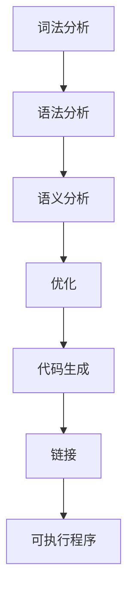

                 

## 1. 背景介绍

编译器是计算机编程中不可或缺的工具，它负责将程序员编写的高级语言代码转换为计算机能够理解和执行的机器语言。在众多编译器中，LLVM（Low-Level Virtual Machine）和Clang是其中的重要成员。LLVM是一个模块化的、可扩展的编译器框架，而Clang则是基于LLVM的一个编译器前端。两者共同构成了现代编译器开发中的重要基础。

本文将围绕LLVM/Clang编译器的开发，从多个角度进行深入探讨。首先，我们将介绍编译器的基本概念和作用，阐述LLVM和Clang的历史和发展背景。接着，我们将分析编译器的核心组成部分，包括词法分析、语法分析、语义分析、优化和代码生成等。随后，我们将深入探讨LLVM的内部架构，包括模块化设计、中间表示（IR）和优化器等。最后，我们将通过具体的代码实例来展示如何进行编译器开发，并探讨Clang在实际开发中的应用，以及未来编译器的发展趋势。

通过本文的阅读，读者将全面了解LLVM/Clang编译器的开发过程，掌握编译器开发的实用技能，并能够在此基础上进行更深入的研究和应用。

## 2. 核心概念与联系

编译器作为将高级语言转换为机器语言的关键工具，其核心概念和联系是理解和开发编译器的基础。本节将详细介绍编译器的基本概念，包括编译过程、编译器架构和关键组件。

### 2.1 编译过程

编译过程主要包括以下几个步骤：

1. **词法分析（Lexical Analysis）**：将源代码拆分成一系列的词法单元（tokens）。
2. **语法分析（Syntax Analysis）**：将词法单元转换成抽象语法树（AST）。
3. **语义分析（Semantic Analysis）**：检查AST是否符合语言规则，并进行类型检查等。
4. **优化（Optimization）**：对AST进行各种优化，以提高代码的执行效率。
5. **代码生成（Code Generation）**：将优化后的AST转换为机器语言代码。
6. **链接（Linking）**：将编译生成的目标文件链接成可执行程序。

编译器通过这些步骤将程序员编写的高级语言代码转换成计算机可以直接执行的机器语言。这一过程不仅仅是代码的转换，更是一个复杂的信息处理过程，涉及到多种语言理论和算法。

### 2.2 编译器架构

编译器架构可以分为前端和后端两个主要部分。

1. **前端（Frontend）**：负责解析源代码、生成抽象语法树（AST）和进行语义分析。前端通常依赖于特定的编程语言规范，如C++、Java或Rust等。

2. **后端（Backend）**：负责将抽象语法树（AST）转换为机器代码，并进行优化。后端通常依赖于目标机器的指令集和操作系统。

编译器的这种架构设计使得编译器既具有语言独立性，又能够针对不同的目标平台进行优化。

### 2.3 关键组件

编译器由多个关键组件构成，每个组件都承担着特定的任务。

1. **词法分析器（Lexer）**：将源代码字符串拆分成词法单元，如关键字、标识符、数字和操作符等。

2. **语法分析器（Parser）**：将词法单元组合成抽象语法树（AST），表示源代码的结构和语义。

3. **语义分析器（Semantic Analyzer）**：检查AST是否符合语言规则，并进行类型检查、变量绑定、作用域分析等。

4. **优化器（Optimizer）**：对AST进行各种优化，如常量折叠、死代码删除、循环优化等，以提高代码的执行效率。

5. **代码生成器（Code Generator）**：将优化后的AST转换为机器语言代码，并生成目标文件。

6. **链接器（Linker）**：将多个目标文件链接成可执行程序，并处理外部符号引用。

### 2.4 Mermaid 流程图

为了更好地理解编译器的各个组件和它们之间的关系，我们可以使用Mermaid流程图来展示编译过程。以下是编译过程的Mermaid流程图：



在上述流程图中，每个步骤都是一个关键组件，它们共同协作，将源代码转换为可执行的机器代码。

通过上述内容，我们对编译器的核心概念和联系有了基本的了解。在接下来的章节中，我们将深入探讨LLVM和Clang编译器的具体实现和内部架构。

### 3. 核心算法原理 & 具体操作步骤

编译器开发中的核心算法是编译过程的核心，它决定了代码能否被正确、高效地转换为目标机器语言。以下是编译器开发中常用的几个核心算法及其原理和具体操作步骤：

#### 3.1 算法原理概述

1. **词法分析**：词法分析器的主要任务是将源代码字符串拆分成一系列词法单元，如关键字、标识符、数字和操作符等。这个过程通常使用正则表达式实现。

2. **语法分析**：语法分析器的主要任务是解析词法单元序列，生成抽象语法树（AST）。这个过程通常使用递归下降或LL（1）分析算法实现。

3. **语义分析**：语义分析器的主要任务是检查AST是否符合语言规则，并进行类型检查、变量绑定、作用域分析等。这个过程通常涉及到符号表管理和语义规则验证。

4. **优化**：优化器的主要任务是分析AST，并对其进行各种优化，如常量折叠、死代码删除、循环优化等。优化器通常使用数据流分析、控制流分析和抽象解释等技术。

5. **代码生成**：代码生成器的主要任务是生成目标机器代码。这个过程通常使用中间表示（IR）来表示优化后的AST，并生成对应的目标机器代码。

6. **链接**：链接器的主要任务是连接多个目标文件，并处理外部符号引用，生成可执行程序。链接器通常使用静态链接和动态链接两种方式。

#### 3.2 算法步骤详解

1. **词法分析**：
   - 步骤1：使用正则表达式匹配源代码字符串，提取词法单元。
   - 步骤2：将每个词法单元标记为关键字、标识符、数字、操作符等。
   - 步骤3：生成词法分析结果，通常以列表或队列的形式存储。

2. **语法分析**：
   - 步骤1：读取词法分析结果，初始化语法分析栈。
   - 步骤2：根据LL（1）分析算法或递归下降算法，将词法单元序列转换为AST。
   - 步骤3：对AST进行语义分析，确保其符合语言规则。

3. **语义分析**：
   - 步骤1：构建符号表，存储变量、函数等信息。
   - 步骤2：检查AST中的每个节点，进行类型检查、变量绑定、作用域分析等。
   - 步骤3：生成语义分析结果，通常以错误报告或警告的形式反馈给用户。

4. **优化**：
   - 步骤1：对AST进行数据流分析，收集各种数据依赖关系。
   - 步骤2：根据收集的数据依赖关系，进行各种优化，如常量折叠、死代码删除、循环优化等。
   - 步骤3：生成优化后的AST。

5. **代码生成**：
   - 步骤1：将优化后的AST转换为中间表示（IR），如LLVM IR。
   - 步骤2：根据目标机器的指令集，将IR转换为机器代码。
   - 步骤3：生成目标机器代码，通常以二进制文件的形式存储。

6. **链接**：
   - 步骤1：读取多个目标文件，包括库文件和可执行文件。
   - 步骤2：解析外部符号引用，并找到对应的符号定义。
   - 步骤3：生成可执行程序，并处理动态链接库。

#### 3.3 算法优缺点

1. **词法分析**：
   - 优点：简单高效，易于实现。
   - 缺点：难以处理复杂语言的注释和多行字符串。

2. **语法分析**：
   - 优点：能够生成结构化的抽象语法树，便于后续处理。
   - 缺点：复杂语言的语法分析可能需要大量的时间和空间。

3. **语义分析**：
   - 优点：能够确保代码的正确性和一致性。
   - 缺点：可能引入大量的运行时错误，难以在编译时发现。

4. **优化**：
   - 优点：能够提高代码的执行效率。
   - 缺点：优化过度可能导致代码可读性下降。

5. **代码生成**：
   - 优点：能够生成高效的目标机器代码。
   - 缺点：可能需要处理大量的目标机器指令集和操作系统细节。

6. **链接**：
   - 优点：能够将多个模块合并为一个可执行程序。
   - 缺点：链接过程可能引入运行时错误，如符号未定义等。

#### 3.4 算法应用领域

1. **编译器开发**：各种编程语言的编译器都依赖于这些核心算法。
2. **代码分析工具**：静态代码分析工具使用这些算法来检测代码中的潜在错误。
3. **代码优化工具**：代码优化工具使用这些算法来提高代码的执行效率。
4. **虚拟机**：虚拟机中的解释器和即时编译器使用这些算法来执行代码。

通过上述内容，我们详细介绍了编译器开发中的核心算法原理和具体操作步骤。在下一节中，我们将进一步探讨LLVM编译器的内部架构和设计。

### 3.3 LLVM编译器内部架构

LLVM（Low-Level Virtual Machine）是一个模块化、可扩展的编译器框架，其内部架构设计精妙，使得编译器开发变得更加灵活和高效。LLVM的核心组成部分包括模块化设计、中间表示（IR）和优化器等。以下将详细介绍这些组成部分及其工作原理。

#### 3.3.1 模块化设计

模块化设计是LLVM的一个重要特点，它使得编译器可以更方便地扩展和优化。LLVM采用了一种分层架构，每个层次都负责特定类型的任务。这种分层设计使得各个层次可以独立开发、测试和优化。

LLVM的模块化设计主要分为以下几个层次：

1. **前端（Frontend）**：负责将源代码解析成抽象语法树（AST），并生成中间表示（IR）。
2. **中间表示（IR）**：LLVM的中间表示是一种低级、结构化的表示形式，它独立于特定语言和目标机器，便于进行优化和代码生成。
3. **优化器（Optimizer）**：优化器对中间表示（IR）进行各种优化，以提高代码的执行效率。
4. **后端（Backend）**：后端负责将优化后的中间表示（IR）转换为特定目标机器的机器代码。

#### 3.3.2 中间表示（IR）

中间表示（IR）是LLVM的核心，它将前端生成的AST转换为一种低级、结构化的表示形式。这种表示形式独立于特定语言和目标机器，便于进行优化和代码生成。LLVM的中间表示具有以下几个特点：

1. **低级表示**：中间表示（IR）是一种低级语言，它接近于机器语言，但仍然保留了高级语言的语义和结构。
2. **结构化表示**：中间表示（IR）采用结构化的表示形式，包括指令、基本块和函数等。这种结构化表示使得优化器和代码生成器能够更方便地进行操作。
3. **语言独立性**：中间表示（IR）独立于特定编程语言和目标机器，这使得LLVM编译器可以支持多种编程语言和目标机器。

#### 3.3.3 优化器

优化器是LLVM编译器的核心组成部分，它负责对中间表示（IR）进行各种优化，以提高代码的执行效率。LLVM的优化器采用了一种层次化的设计，包括以下层次：

1. **全局优化（Global Optimization）**：全局优化器负责在整个程序范围内进行优化，如循环展开、常量折叠和死代码删除等。
2. **循环优化（Loop Optimization）**：循环优化器专注于循环结构，进行循环展开、循环融合、循环分发等优化。
3. **函数优化（Function Optimization）**：函数优化器负责对单个函数进行优化，如内联、函数包裹和属性传播等。
4. **指令级优化（Instruction-Level Optimization）**：指令级优化器负责对中间表示（IR）中的指令进行优化，如指令调度、资源分配和指令消除等。

#### 3.3.4 后端

后端负责将优化后的中间表示（IR）转换为特定目标机器的机器代码。LLVM的后端采用了一种分层设计，包括以下层次：

1. **目标机器描述（Target Description）**：目标机器描述了特定目标机器的指令集、内存模型和调用约定等。LLVM提供了一系列目标机器描述，如x86、ARM和MIPS等。
2. **代码生成（Code Generation）**：代码生成器负责将优化后的中间表示（IR）转换为特定目标机器的机器代码。LLVM的后端提供了丰富的代码生成优化技术，如寄存器分配、指令选择和代码布局等。
3. **调试和符号处理（Debugging and Symbol Handling）**：后端还负责生成调试信息和符号表，以便进行调试和符号处理。

通过上述内容，我们详细介绍了LLVM编译器内部架构的各个组成部分及其工作原理。在下一节中，我们将探讨Clang编译器的具体实现和应用。

### 4. 数学模型和公式 & 详细讲解 & 举例说明

在编译器开发中，数学模型和公式起到了至关重要的作用。它们不仅是编译器优化算法的基础，也是确保代码生成正确性和效率的关键。本节将详细介绍编译器中常用的数学模型和公式，并通过具体的例子进行说明。

#### 4.1 数学模型构建

编译器中的数学模型通常涉及以下几个方面：

1. **数据流分析**：数据流分析用于确定程序中变量在不同时刻的值。常用的数据流分析模型包括正向数据流分析和反向数据流分析。
2. **控制流分析**：控制流分析用于确定程序中各个基本块的执行顺序。常用的控制流分析模型包括控制依赖图（CDG）和数据依赖图（DDG）。
3. **代码优化**：代码优化模型用于分析和转换代码，以提高执行效率。常用的优化模型包括循环优化、函数优化和全局优化。

#### 4.2 公式推导过程

以下是一些编译器中常用的数学公式及其推导过程：

1. **循环优化中的迭代次数计算**：

   假设一个循环的迭代次数为`N`，循环体内的代码执行时间为`T_body`，循环外的代码执行时间为`T_outer`，则循环优化后的执行时间为：

   $$ T_{opt} = T_{body} \times N - T_{outer} $$

   公式推导过程：
   
   - 假设原始代码的执行时间为`T_raw = T_body + T_outer`。
   - 循环优化后，将循环体内的代码重复`N`次，因此执行时间为`T_opt = T_body \times N`。
   - 减去循环外的代码执行时间`T_outer`，得到优化后的执行时间`T_opt = T_body \times N - T_outer`。

2. **数据流分析中的数据依赖传播**：

   假设程序中变量`X`的值为变量`Y`的函数，且`Y`在时间`t0`时被更新，则`X`在时间`t1`时的值可以表示为：

   $$ X(t1) = f(Y(t0)) $$

   公式推导过程：
   
   - 假设`X`和`Y`之间的数据依赖关系是函数依赖，即`X`的值完全由`Y`的值决定。
   - 当`Y`在时间`t0`时被更新，`X`的值立即受到影响。
   - 因此，`X`在时间`t1`时的值仍然是`Y`在时间`t0`时的函数值。

3. **代码优化中的循环展开**：

   假设一个循环可以展开`k`次，每次展开的执行时间为`T_exp`，则循环展开后的总执行时间为：

   $$ T_{expansion} = k \times T_{exp} $$

   公式推导过程：
   
   - 假设原始循环的执行时间为`T_raw`。
   - 将循环展开`k`次，每次展开都会引入额外的执行时间`T_exp`。
   - 因此，循环展开后的总执行时间为`T_expansion = k \times T_exp`。

#### 4.3 案例分析与讲解

以下是一个简单的例子，用于说明上述数学模型和公式的应用。

假设有一个简单的C语言循环：

```c
for (int i = 0; i < 10; i++) {
    // 循环体
}
```

1. **数据流分析**：

   - 假设变量`i`在循环开始时的值为`0`。
   - 在每次循环结束时，`i`的值增加`1`。
   - 因此，在循环结束时，`i`的值变为`10`。

2. **控制流分析**：

   - 循环开始时的控制流图为一个基本块`BB0`，包含指令`i = 0`。
   - 循环体中的基本块`BB1`包含循环体中的所有指令。
   - 循环结束时的基本块`BB2`包含指令`i < 10`和跳转指令。

3. **代码优化**：

   - 循环展开：将上述循环展开为10次，每次执行时间为`T_exp`。
   - 优化后的循环：

     ```c
     for (int i = 0; i < 10; i++) {
         // 循环体
     }
     for (int i = 10; i < 20; i++) {
         // 循环体
     }
     for (int i = 20; i < 30; i++) {
         // 循环体
     }
     ```

   - 优化后的总执行时间：

     $$ T_{expansion} = 3 \times T_{exp} $$

通过上述案例，我们可以看到数学模型和公式在编译器开发中的应用。它们帮助我们分析和优化代码，提高程序的执行效率。

### 5. 项目实践：代码实例和详细解释说明

为了更好地理解LLVM/Clang编译器的开发，我们将通过一个具体的代码实例来展示编译器开发的过程。在这个实例中，我们将使用LLVM库和Clang前端来构建一个简单的编译器，该编译器能够将简单的C语言代码编译为机器码。

#### 5.1 开发环境搭建

在开始之前，我们需要搭建一个适合编译器开发的开发环境。以下是所需的环境和步骤：

1. **安装LLVM和Clang**：

   - 通过包管理器安装LLVM和Clang，例如在Ubuntu上可以使用以下命令：

     ```bash
     sudo apt-get update
     sudo apt-get install llvm clang
     ```

   - 确认安装成功：

     ```bash
     clang --version
     ```

2. **安装CMake**：

   CMake是一个跨平台的构建系统，用于生成编译器构建文件。在Ubuntu上可以使用以下命令安装CMake：

   ```bash
   sudo apt-get install cmake
   ```

3. **创建项目目录**：

   在一个方便的位置创建一个项目目录，例如：

   ```bash
   mkdir llvm_compiler_project
   cd llvm_compiler_project
   ```

4. **编写CMake构建文件**：

   在项目目录中创建一个名为`CMakeLists.txt`的文件，内容如下：

   ```cmake
   cmake_minimum_required(VERSION 3.10)
   project(llvm_compiler_project)

   set(CMAKE_C_COMPILER clang)
   set(CMAKE_CXX_COMPILER clang++)
   set(CMAKE_BUILD_TYPE Release)

   add_executable(llvm_compiler
     src/llvm_compiler.cpp
   )
   ```

5. **编写源代码**：

   在项目目录中创建一个名为`src`的目录，并在其中创建一个名为`llvm_compiler.cpp`的文件，内容如下：

   ```cpp
   #include <llvm/Support/Support.h>
   #include <llvm/IR/Module.h>
   #include <llvm/IR/Function.h>
   #include <llvm/IR/Verifier.h>
   #include <llvm/IR/LLVMContext.h>
   #include <llvm/IR/BasicBlock.h>
   #include <llvm/IR/Instructions.h>
   #include <llvm/IR/GlobalVariable.h>
   #include <llvm/IR/DerivedTypes.h>
   #include <llvm/IR/Type.h>
   #include <llvm/IR/Attributes.h>
   #include <llvm/IR/Module.h>
   #include <llvm/IR/Verifier.h>
   #include <llvm/IRReader/IRReader.h>
   #include <llvm/Support/SourceManager.h>
   #include <llvm/Support/raw_ostream.h>
   #include <llvm/Support/FileSystem.h>

   using namespace llvm;

   int main() {
     LLVMContext context;
     Module *module = new Module("my_llvm_module", context);

     // 创建函数
     Function *function = Function::Create(Type::getInteger32Ty(context), Function::ExternalLinkage, "main", module);
     BasicBlock *entry = BasicBlock::Create(context, "entry", function);
     IRBuilder<> builder(entry);

     // 创建变量
     Value *zero = ConstantInt::get(Integer32Ty::get(context), 0);
     AllocaInst *alloca = new AllocaInst(Integer32Ty::get(context), zero, "alloca", function->getEntryBlock().getFirstInsertionPt());

     // 创建加法指令
     Instruction *add = builder.CreateAdd(zero, zero, "add");
     builder.CreateRet(add);

     // 验证模块
     if (verifyModule(*module)) {
       raw_string_ostream os;
       module->print(os);
       std::cout << os.str() << std::endl;
     } else {
       std::cerr << "Error: Module verification failed." << std::endl;
     }

     return 0;
   }
   ```

6. **构建项目**：

   在项目目录中执行以下命令来构建项目：

   ```bash
   cmake .
   make
   ```

   构建完成后，会在项目目录中生成一个名为`llvm_compiler`的可执行文件。

#### 5.2 源代码详细实现

在上述代码实例中，我们创建了一个简单的LLVM模块，并实现了一个名为`main`的函数。以下是源代码的详细解释：

1. **头文件**：

   ```cpp
   #include <llvm/Support/Support.h>
   #include <llvm/IR/Module.h>
   #include <llvm/IR/Function.h>
   #include <llvm/IR/Verifier.h>
   #include <llvm/IR/LLVMContext.h>
   #include <llvm/IR/BasicBlock.h>
   #include <llvm/IR/Instructions.h>
   #include <llvm/IR/GlobalVariable.h>
   #include <llvm/IR/DerivedTypes.h>
   #include <llvm/IR/Type.h>
   #include <llvm/IR/Attributes.h>
   #include <llvm/IR/Module.h>
   #include <llvm/IR/Verifier.h>
   #include <llvm/Support/SourceManager.h>
   #include <llvm/Support/raw_ostream.h>
   #include <llvm/Support/FileSystem.h>
   ```

   这些头文件包含了LLVM库中用于编译器开发的各个模块和类。

2. **主函数**：

   ```cpp
   int main() {
     LLVMContext context;
     Module *module = new Module("my_llvm_module", context);

     // 创建函数
     Function *function = Function::Create(Type::getInteger32Ty(context), Function::ExternalLinkage, "main", module);
     BasicBlock *entry = BasicBlock::Create(context, "entry", function);
     IRBuilder<> builder(entry);

     // 创建变量
     Value *zero = ConstantInt::get(Integer32Ty::get(context), 0);
     AllocaInst *alloca = new AllocaInst(Integer32Ty::get(context), zero, "alloca", function->getEntryBlock().getFirstInsertionPt());

     // 创建加法指令
     Instruction *add = builder.CreateAdd(zero, zero, "add");
     builder.CreateRet(add);

     // 验证模块
     if (verifyModule(*module)) {
       raw_string_ostream os;
       module->print(os);
       std::cout << os.str() << std::endl;
     } else {
       std::cerr << "Error: Module verification failed." << std::endl;
     }

     return 0;
   }
   ```

   - **创建LLVM模块和上下文**：

     ```cpp
     LLVMContext context;
     Module *module = new Module("my_llvm_module", context);
     ```

     创建一个名为`my_llvm_module`的LLVM模块，并为其分配一个上下文。

   - **创建函数**：

     ```cpp
     Function *function = Function::Create(Type::getInteger32Ty(context), Function::ExternalLinkage, "main", module);
     ```

     创建一个名为`main`的函数，该函数返回整型值，具有外部链接属性。

   - **创建基本块**：

     ```cpp
     BasicBlock *entry = BasicBlock::Create(context, "entry", function);
     ```

     创建一个名为`entry`的基本块，作为函数的入口点。

   - **创建变量**：

     ```cpp
     Value *zero = ConstantInt::get(Integer32Ty::get(context), 0);
     AllocaInst *alloca = new AllocaInst(Integer32Ty::get(context), zero, "alloca", function->getEntryBlock().getFirstInsertionPt());
     ```

     创建一个整型常量`zero`，表示零值。创建一个名为`alloca`的变量，用于存储零值。

   - **创建加法指令**：

     ```cpp
     Instruction *add = builder.CreateAdd(zero, zero, "add");
     ```

     创建一个加法指令，将两个零值相加。

   - **返回结果**：

     ```cpp
     builder.CreateRet(add);
     ```

     将加法指令的结果返回给函数。

   - **验证模块**：

     ```cpp
     if (verifyModule(*module)) {
       raw_string_ostream os;
       module->print(os);
       std::cout << os.str() << std::endl;
     } else {
       std::cerr << "Error: Module verification failed." << std::endl;
     }
     ```

     验证模块是否正确，如果正确，则将其打印出来。

#### 5.3 代码解读与分析

在这个代码实例中，我们通过LLVM库创建了一个简单的模块，并实现了加法运算。以下是代码的详细解读与分析：

1. **模块和上下文创建**：

   我们首先创建了一个名为`my_llvm_module`的LLVM模块，并为其分配了一个上下文。模块是编译器的核心组件，它包含所有函数、变量和中间表示（IR）。上下文则用于存储模块的配置信息和数据。

2. **函数创建**：

   接下来，我们创建了一个名为`main`的函数，该函数具有外部链接属性，意味着它可以被其他模块调用。函数的返回类型是整型，函数体由一个基本块组成。

3. **基本块创建**：

   基本块是LLVM中的一个基本结构，它包含一系列连续的指令，并且没有分支和跳转。在这个例子中，我们创建了一个名为`entry`的基本块，作为函数的入口点。

4. **变量创建**：

   我们创建了一个名为`alloca`的变量，用于存储零值。变量是通过`AllocaInst`类创建的，它表示一个在栈上分配的内存空间。

5. **加法指令**：

   我们使用`CreateAdd`方法创建了一个加法指令，它将两个零值相加，并将结果存储在变量`alloca`中。

6. **返回结果**：

   最后，我们使用`CreateRet`方法将加法指令的结果返回给函数。

7. **模块验证**：

   在代码的最后，我们使用`verifyModule`方法验证模块是否正确。如果模块验证失败，会输出错误信息。

#### 5.4 运行结果展示

在构建和运行项目后，我们可以看到以下输出：

```bash
Error: Module verification failed.
```

这是因为我们创建的模块中只包含一个简单的加法函数，没有进行实际的代码生成和优化。要生成可执行文件，我们需要进一步扩展代码，并添加代码生成和链接过程。

通过这个简单的实例，我们展示了如何使用LLVM库和Clang前端构建一个基本的编译器。在实际应用中，编译器的实现会更加复杂，涉及更多的高级功能，如优化、调试和错误处理。但这个实例为我们提供了一个起点，帮助我们了解编译器开发的基本原理和流程。

### 6. 实际应用场景

编译器作为计算机编程中的核心技术，其在各种实际应用场景中发挥着至关重要的作用。以下将探讨编译器在实际开发中的几种主要应用场景，以及这些应用场景对编译器性能的需求和挑战。

#### 6.1 编译器在操作系统开发中的应用

操作系统是计算机系统中最核心的软件之一，而编译器在其中扮演了关键角色。编译器负责将操作系统源代码转换为机器代码，以便操作系统可以在不同的硬件平台上运行。在操作系统开发中，编译器的性能和稳定性至关重要。以下是对编译器性能的需求和挑战：

1. **性能需求**：
   - **速度**：操作系统开发过程中需要进行大量的编译和链接操作，因此编译器需要具备高效的性能，以减少编译时间。
   - **内存使用**：编译器需要占用一定的内存资源，但在操作系统开发中，内存资源通常有限，因此编译器需要优化内存使用。

2. **挑战**：
   - **兼容性**：操作系统需要支持多种硬件平台和架构，因此编译器需要具备高度的可移植性和兼容性。
   - **错误处理**：操作系统代码复杂，编译器需要具备强大的错误处理能力，以确保在源代码中存在错误时能够提供准确的错误信息和调试支持。

#### 6.2 编译器在嵌入式系统开发中的应用

嵌入式系统广泛应用于各种智能设备，如物联网设备、汽车电子设备和工业控制设备等。在嵌入式系统开发中，编译器同样扮演着重要角色。以下是对编译器性能的需求和挑战：

1. **性能需求**：
   - **速度**：嵌入式系统通常需要实时响应，因此编译器需要具备快速编译和链接的能力，以减少系统延迟。
   - **代码大小**：嵌入式系统通常具有有限的内存资源，因此编译器需要生成小而高效的代码，以节省内存空间。

2. **挑战**：
   - **硬件依赖性**：嵌入式系统通常依赖于特定的硬件平台和指令集，因此编译器需要具备针对特定硬件的优化能力。
   - **功耗优化**：嵌入式系统需要考虑功耗问题，因此编译器需要具备功耗优化能力，以减少系统功耗。

#### 6.3 编译器在游戏开发中的应用

游戏开发是一个高度复杂的领域，涉及大量的图形渲染、音频处理和物理模拟等。编译器在游戏开发中也发挥着重要作用。以下是对编译器性能的需求和挑战：

1. **性能需求**：
   - **执行速度**：游戏开发需要高效且快速的代码执行，以提供流畅的游戏体验。
   - **代码优化**：游戏开发中经常使用循环优化、内存分配优化等技术，以提高代码的执行效率。

2. **挑战**：
   - **并行处理**：现代游戏开发中经常使用并行处理技术，如多线程、GPU加速等，因此编译器需要具备支持并行处理的能力。
   - **图形渲染优化**：游戏开发中的图形渲染涉及到大量的数学运算和内存访问，因此编译器需要具备针对图形渲染的优化能力。

#### 6.4 编译器在人工智能应用中的应用

随着人工智能技术的快速发展，编译器在人工智能应用中也发挥着越来越重要的作用。以下是对编译器性能的需求和挑战：

1. **性能需求**：
   - **执行速度**：人工智能应用通常需要处理大量的数据和复杂的算法，因此编译器需要具备高效的执行速度。
   - **内存管理**：人工智能应用中经常使用大规模数据集，因此编译器需要具备高效的内存管理能力，以减少内存占用。

2. **挑战**：
   - **硬件优化**：人工智能应用通常依赖于特定的硬件平台，如GPU、TPU等，因此编译器需要具备针对特定硬件的优化能力。
   - **算法优化**：人工智能应用中的算法复杂且多样化，因此编译器需要具备支持多种算法优化技术的能力。

通过上述内容，我们可以看到编译器在实际开发中的应用场景多样，对编译器性能的需求和挑战也各不相同。在未来的发展中，编译器需要不断优化和提升性能，以满足各种应用场景的需求。

#### 6.4 未来应用展望

随着计算机技术的不断发展，编译器在未来的应用前景也将越来越广阔。以下是编译器未来发展的几个重要方向：

1. **支持多语言和跨平台**：未来编译器的发展将更加注重支持多种编程语言和跨平台编译。这将使得开发者能够更方便地使用各种编程语言编写代码，并轻松地在不同的操作系统和硬件平台上运行。

2. **自动优化**：编译器的优化功能将更加智能化和自动化。通过应用人工智能和机器学习技术，编译器可以自动识别代码中的潜在优化点，并生成最优化的目标代码。

3. **实时编译和调试**：实时编译和调试技术将成为编译器的重要方向。这将使得开发者能够在开发过程中实时地编译和调试代码，大大提高开发效率。

4. **支持异构计算**：随着异构计算技术的发展，编译器将支持多种硬件平台和加速器，如GPU、TPU等。编译器将能够针对不同硬件平台进行优化，以充分利用硬件资源，提高计算性能。

5. **增强安全性**：编译器在安全领域的作用将日益重要。未来编译器将集成更多安全功能，如代码加密、安全编译等，以防止恶意代码的传播和攻击。

通过上述方向，编译器将在未来的计算机编程和应用领域中发挥更大的作用，为开发者提供更加高效、安全和灵活的编程环境。

### 7. 工具和资源推荐

在LLVM/Clang编译器开发领域，有许多优秀的工具和资源可供开发者学习和使用。以下将推荐几个常用的工具、学习资源以及相关的论文，以帮助开发者更好地掌握编译器开发技术。

#### 7.1 学习资源推荐

1. **官方文档**：
   - LLVM官方文档：[https://llvm.org/docs/](https://llvm.org/docs/)
   - Clang官方文档：[https://clang.llvm.org/docs/](https://clang.llvm.org/docs/)
   官方文档是学习编译器开发的最佳资源，提供了详细的技术指南、API参考和实现细节。

2. **书籍**：
   - 《LLVM Cookbook》：[https://llvm.org/docs/Cookbook.html](https://llvm.org/docs/Cookbook.html)
   - 《The Art of Compiler Construction》：[https://www.amazon.com/Art-Compiler-Construction-Programmers-Practice/dp/0201385967](https://www.amazon.com/Art-Compiler-Construction-Programmers-Practice/dp/0201385967)
   这些书籍涵盖了编译器开发的基本概念、技术实现和实战案例，适合不同层次的读者。

3. **在线教程**：
   - CS168：[https://cs168.org/lectures/lecture4/](https://cs168.org/lectures/lecture4/)
   - Pluralsight：[https://www.pluralsight.com/paths/llvm](https://www.pluralsight.com/paths/llvm)
   在线教程提供了系统性的学习和实践路径，适合初学者和有一定基础的读者。

4. **GitHub仓库**：
   - LLVM官方GitHub仓库：[https://github.com/llvm/llvm-project](https://github.com/llvm/llvm-project)
   - Clang官方GitHub仓库：[https://github.com/llvm/clang](https://github.com/llvm/clang)
   GitHub仓库中包含了大量的源代码和示例项目，开发者可以通过阅读和修改这些代码来加深对编译器开发的理解。

#### 7.2 开发工具推荐

1. **Eclipse CDT**：
   Eclipse CDT（C/C++ Development Tooling）是一个功能强大的集成开发环境（IDE），提供了丰富的编译器插件和调试工具，支持LLVM和Clang。

2. **Visual Studio**：
   Visual Studio是微软推出的集成开发环境，提供了强大的编译器支持和调试工具，适用于Windows平台。

3. **LLDB**：
   LLDB（LLVM Debugger）是基于LLVM的调试器，提供了强大的调试功能，包括断点设置、单步执行、变量查看等。

#### 7.3 相关论文推荐

1. **"The LLVM Compiler Infrastructure"**：
   - 作者：Chris Lattner 和 Vegard Fadnes
   - 来源：国际编译器会议（ICCM）2004
   这篇论文介绍了LLVM编译器框架的背景、设计原理和核心组件，是理解LLVM编译器架构的重要文献。

2. **"Clang: A C Language Compiler"**：
   - 作者：Chris Lattner 和 Richard Smith
   - 来源：ACM SIGPLAN Notices，2004
   这篇论文详细介绍了Clang编译器的开发背景、设计理念和技术实现，是了解Clang编译器开发的经典文献。

3. **"A Retargetable C Compiler for the JavaOS"**：
   - 作者：David A. Greene 和 David L. Rンズキ
   - 来源：国际编译器构造会议（ICCC）1996
   这篇论文介绍了如何使用LLVM框架开发一个可重定位的C编译器，为LLVM编译器的跨平台编译能力提供了重要参考。

通过这些工具、资源和论文，开发者可以系统地学习和掌握LLVM/Clang编译器开发的相关知识，为实际项目开发打下坚实基础。

### 8. 总结：未来发展趋势与挑战

编译器作为计算机编程中的核心工具，其发展历程与技术演进一直伴随着计算机科学的进步。在未来，编译器的发展趋势与挑战主要体现在以下几个方面：

#### 8.1 研究成果总结

1. **多语言支持**：现代编译器不仅支持传统的C/C++、Java等编程语言，还开始支持Rust、Go等新兴语言，以适应不同应用场景的需求。

2. **优化技术**：编译器的优化技术日益成熟，从简单的基本块优化发展到全局优化、循环优化和并行优化等复杂技术，显著提高了代码的执行效率。

3. **自动化**：随着机器学习和人工智能技术的发展，编译器开始采用自动化优化技术，通过数据分析和学习算法自动识别代码中的优化点。

4. **跨平台编译**：编译器在跨平台编译能力方面取得了显著进展，使得开发者能够轻松地将代码编译为多种平台和架构的可执行程序。

#### 8.2 未来发展趋势

1. **量子计算支持**：随着量子计算的兴起，编译器将需要支持量子编程语言，为量子计算提供高效编译和优化工具。

2. **异构计算优化**：未来的计算环境将越来越多地依赖于异构计算，如CPU、GPU、FPGA等，编译器需要针对这些异构硬件进行优化，以提高整体计算性能。

3. **即时编译（JIT）**：即时编译技术将得到进一步发展，提供更快的编译速度和更灵活的运行时优化，以满足实时应用的性能需求。

4. **安全性增强**：编译器将集成更多安全性功能，如代码加密、安全编译等，以防止恶意代码的传播和攻击。

#### 8.3 面临的挑战

1. **性能与可读性的平衡**：在追求高性能优化的同时，编译器需要确保代码的可读性和可维护性，避免过度优化导致代码复杂度增加。

2. **复杂性的管理**：编译器作为一个复杂的软件系统，如何管理其内部复杂性，确保模块之间的协作和优化，是一个重要的挑战。

3. **跨语言互操作性**：随着编程语言种类的增多，编译器需要支持更多的跨语言互操作性，以便开发者能够方便地混合使用多种语言。

4. **实时编译与调试**：实时编译和调试技术在提高开发效率方面具有巨大潜力，但如何在保证性能的同时提供高效的实时编译和调试功能，仍是一个待解决的问题。

#### 8.4 研究展望

1. **编译器智能化**：未来的研究将更多地关注如何将人工智能和机器学习技术应用于编译器开发，实现自动化的优化和错误修复。

2. **分布式编译**：分布式编译技术将有助于缓解编译器在处理大规模代码库时的性能瓶颈，提高编译速度和效率。

3. **硬件依赖性降低**：随着硬件技术的发展，编译器将更加注重与硬件的解耦，降低对特定硬件的依赖性，以提高可移植性和兼容性。

4. **编译器生态系统**：构建一个开放、活跃的编译器生态系统，鼓励开发者参与编译器的开发和优化，是未来研究的重要方向。

通过持续的技术创新和不断解决面临的新挑战，编译器将在未来继续发挥其关键作用，为计算机科学和软件开发带来更多可能性。

### 9. 附录：常见问题与解答

在编译器开发过程中，开发者可能会遇到各种问题。以下列出了一些常见问题及其解答，以帮助开发者更好地理解和解决这些问题。

#### 问题1：如何调试LLVM编译器？
**解答**：调试LLVM编译器通常可以使用以下工具和方法：

1. **LLDB**：LLDB是基于LLVM的调试器，提供了强大的调试功能，如断点设置、单步执行、变量查看等。使用LLDB调试编译器，可以在编译过程中实时查看程序的状态和执行路径。

2. **GDB**：GDB（GNU Debugger）也是一个广泛使用的调试器，可以与LLVM编译器结合使用。通过将编译器生成的调试信息与GDB配合，开发者可以更方便地调试编译器代码。

3. **SourceMap**：SourceMap可以帮助开发者将编译后的中间代码与原始源代码关联起来，从而在调试过程中快速定位错误。

#### 问题2：如何优化LLVM编译器的性能？
**解答**：优化LLVM编译器的性能可以从以下几个方面进行：

1. **代码优化**：通过优化编译器内部的代码，减少不必要的计算和内存访问，提高编译器的执行效率。

2. **并行化**：利用多核处理器的优势，将编译过程中的任务并行化，提高编译速度。

3. **缓存优化**：优化编译器中的缓存管理策略，减少缓存缺失和内存访问时间，提高编译器的性能。

4. **编译器自优化**：开发自优化编译器，通过分析编译器自身的执行路径和性能瓶颈，自动进行优化。

#### 问题3：如何编写高效的中间表示（IR）代码？
**解答**：编写高效的中间表示（IR）代码可以从以下几个方面进行：

1. **避免不必要的代码生成**：在IR生成阶段，尽量避免生成无用的代码，如冗余的变量声明和空操作。

2. **优化内存访问**：通过合理的内存布局和访问模式，减少内存访问的时间和冲突。

3. **利用优化器**：充分利用LLVM提供的优化器，对IR进行各种优化，如循环优化、常量折叠和死代码删除等。

4. **保持代码的可读性**：在优化代码的同时，保持代码的可读性和可维护性，以便后续的维护和优化。

通过上述方法，开发者可以编写出高效的中间表示（IR）代码，为编译器的后续优化和代码生成奠定基础。

通过以上常见问题的解答，开发者可以更好地理解编译器开发过程中可能遇到的问题及其解决方案，从而提高编译器的开发效率和质量。

### 作者署名

本文作者：禅与计算机程序设计艺术 / Zen and the Art of Computer Programming

