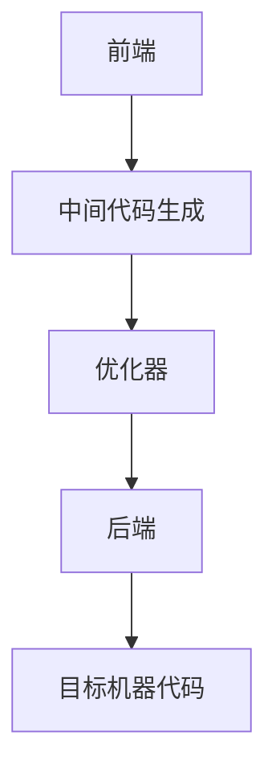
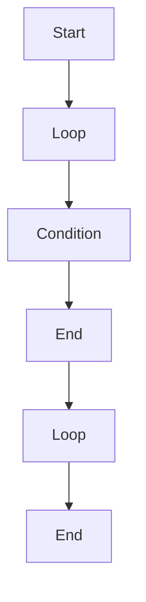
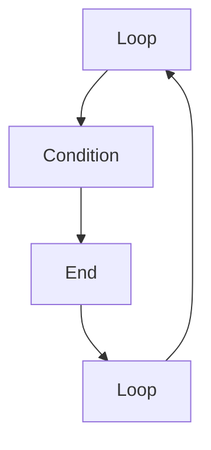
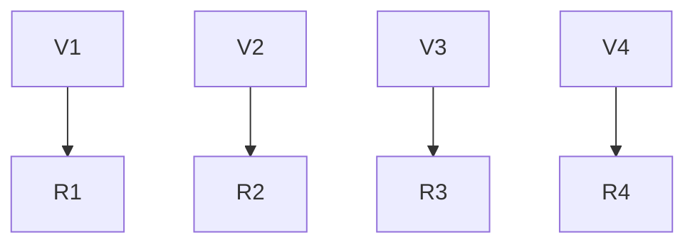
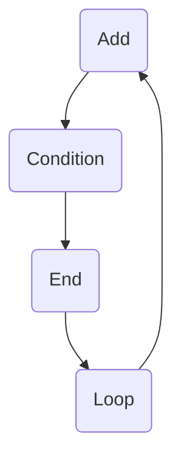

                 

### 1. 背景介绍

在现代计算机体系结构中，中间代码（Intermediate Code）扮演着至关重要的角色。它位于高级编程语言与机器语言之间，是编译过程的关键环节之一。llvm（Low Level Virtual Machine）是一个高度模块化、可扩展的编译器基础库，它能够生成高效、优化的中间代码，从而提高编译器整体性能。

编译器的主要任务是将高级编程语言（如C++、Java等）编写的源代码转换成机器语言，以便在计算机上执行。这一过程通常分为三个阶段：词法分析、语法分析和语义分析。在语义分析阶段结束后，编译器会生成中间代码。中间代码通常采用一种抽象的表示形式，易于优化和分析，同时保留源代码的结构和语义。

llvm之所以备受关注，在于其强大的中间代码生成和优化能力。它支持多种编程语言，能够生成高效的中间代码，并通过一系列优化器对中间代码进行深度优化，最终生成高效的机器代码。

本文将围绕llvm的中间代码生成与优化展开讨论。首先，我们将介绍llvm的基本架构和中间代码生成流程。随后，我们将深入探讨llvm的优化器，包括其核心优化算法和具体实现。最后，我们将通过一个实际项目实例，展示如何使用llvm进行中间代码生成与优化。

### 2. 核心概念与联系

#### 2.1 llvm的基本架构

llvm是一个模块化的编译器基础库，其核心架构包括前端（Frontend）、中间代码生成（IR, Intermediate Representation）、优化器（Optimizer）和后端（Backend）。

- **前端**：负责将高级编程语言翻译成llvm的中间代码。前端通常包括词法分析、语法分析和语义分析等模块，负责解析源代码并生成抽象语法树（AST）。
  
- **中间代码生成**：将AST转换成llvm的中间代码（IR）。llvm的IR是一种低级、抽象的表示形式，易于优化和分析。IR包含了操作数（Operand）、操作符（Operator）和基本块（Basic Block）等元素。
  
- **优化器**：对IR进行各种优化，以提高代码的运行效率和可读性。优化器包括多个优化阶段，如常量折叠、死代码消除、循环优化等。
  
- **后端**：将优化后的IR转换成特定目标平台的机器代码。后端负责与底层硬件交互，生成高效的机器代码。

#### 2.2 llvm的中间代码表示

llvm的中间代码采用一种称为IR的表示形式。IR是一种低级、抽象的表示形式，保留了源代码的结构和语义，同时易于优化和分析。

在IR中，基本块（Basic Block）是代码的基本执行单元。一个基本块通常包含一系列连续的指令，且指令之间的转移只能发生在块的开头或结尾。基本块内部通常没有跳转语句，以确保代码的可分析性和优化能力。

操作数（Operand）是IR中的基本数据元素，用于表示操作的数据来源。操作符（Operator）则定义了对操作数进行的操作类型，如加法、减法、赋值等。

#### 2.3 llvm的优化器架构

llvm的优化器架构非常灵活和模块化，包括多个优化阶段和优化策略。其核心优化算法包括：

- **数据流分析**：分析代码中数据的流动和依赖关系，以发现优化机会。
- **控制流分析**：分析代码的控制流结构，以优化循环、分支和基本块。
- **循环优化**：优化循环结构，以提高代码的运行效率和可读性。
- **寄存器分配**：将变量分配到寄存器中，以减少内存访问和提高执行速度。
- **指令调度**：优化指令的执行顺序，以减少数据依赖和提高执行效率。

#### 2.4 Mermaid流程图

以下是一个简单的Mermaid流程图，展示了llvm的基本架构和中间代码生成与优化流程：



通过这个流程图，我们可以清晰地看到llvm的工作流程：前端将源代码转换成中间代码，优化器对中间代码进行深度优化，后端将优化后的中间代码转换成目标机器代码。

### 3. 核心算法原理 & 具体操作步骤

#### 3.1 算法原理概述

llvm的优化器采用了一系列高效的优化算法，以提升中间代码的运行效率和可读性。核心的优化算法包括数据流分析、控制流分析、循环优化、寄存器分配和指令调度。

- **数据流分析**：分析代码中数据的流动和依赖关系，以发现优化机会。常用的数据流分析算法包括Live Range Analysis、Live Variable Analysis和Data Flow Equations。
  
- **控制流分析**：分析代码的控制流结构，以优化循环、分支和基本块。常用的控制流分析算法包括Control Flow Graph（CFG）和Dominance Analysis。
  
- **循环优化**：优化循环结构，以提高代码的运行效率和可读性。常见的循环优化算法包括Loop Invariant Code Motion、Loop Unrolling和Loop Interchange。
  
- **寄存器分配**：将变量分配到寄存器中，以减少内存访问和提高执行速度。常用的寄存器分配算法包括Spilling、Register Allocation Graph（RAG）和Linear Scan。
  
- **指令调度**：优化指令的执行顺序，以减少数据依赖和提高执行效率。常用的指令调度算法包括Reordering、Scheduling and Cost Models。

#### 3.2 算法步骤详解

##### 3.2.1 数据流分析

数据流分析是优化过程中的关键步骤，其目的是分析代码中数据的流动和依赖关系，以发现优化机会。以下是数据流分析的基本步骤：

1. **建立数据流方程**：根据代码的结构和语义，建立数据流方程。数据流方程描述了变量在基本块之间的传递关系。
2. **求解数据流方程**：使用静态单赋值（SSA）形式，将原始代码转换成一种易于求解的数据流方程形式。
3. **分析数据流方程**：通过求解数据流方程，分析变量在不同基本块之间的传递关系，以发现优化机会。

##### 3.2.2 控制流分析

控制流分析的主要任务是分析代码的控制流结构，以优化循环、分支和基本块。以下是控制流分析的基本步骤：

1. **建立控制流图（CFG）**：将代码转换成一个控制流图，其中每个节点表示一个基本块，每个边表示控制流转移。
2. **计算可达性信息**：计算控制流图中各个节点的可达性信息，以确定哪些基本块可以被优化。
3. **分析控制流图**：通过分析控制流图，优化循环、分支和基本块。例如，可以识别循环不变式，并将其移动到循环外部。

##### 3.2.3 循环优化

循环优化是优化过程中的重要环节，可以提高代码的运行效率和可读性。以下是循环优化的一些基本步骤：

1. **识别循环结构**：分析代码，识别循环结构。通常使用循环头和循环尾标记循环的开始和结束。
2. **优化循环不变式**：将循环不变式提取到循环外部，以减少循环体内的重复计算。
3. **循环展开**：将循环展开成多个基本块，以减少循环次数和提高执行速度。
4. **循环优化**：使用循环依赖分析，优化循环结构。例如，可以交换循环次序、消除依赖等。

##### 3.2.4 寄存器分配

寄存器分配是将变量分配到寄存器中，以减少内存访问和提高执行速度。以下是寄存器分配的一些基本步骤：

1. **建立寄存器分配图（RAG）**：将代码中的变量和寄存器转换成一个寄存器分配图，其中节点表示变量和寄存器，边表示变量的引用关系。
2. **求解寄存器分配问题**：使用图着色算法，将变量分配到寄存器中。图着色算法的目标是找到一种寄存器分配方案，使得相邻变量不会使用相邻的寄存器。
3. **优化寄存器分配**：对寄存器分配结果进行优化，以减少寄存器冲突和提高执行速度。例如，可以合并寄存器、调整变量分配等。

##### 3.2.5 指令调度

指令调度是优化指令的执行顺序，以减少数据依赖和提高执行效率。以下是指令调度的一些基本步骤：

1. **建立指令依赖图**：将代码中的指令转换成一个指令依赖图，其中节点表示指令，边表示指令之间的依赖关系。
2. **优化指令执行顺序**：通过分析指令依赖图，调整指令的执行顺序，以减少数据依赖和提高执行效率。例如，可以提前执行独立指令、延迟执行依赖指令等。
3. **处理调度延迟**：处理指令调度的延迟问题，以确保指令在适当的时间执行。例如，可以使用延迟槽技术、插入流水线指令等。

#### 3.3 算法优缺点

每种优化算法都有其优缺点，以下是llvm优化器中常用算法的优缺点：

- **数据流分析**：优点是能够发现代码中数据的依赖关系，从而进行优化。缺点是计算复杂度较高，可能需要较大的存储空间。
- **控制流分析**：优点是能够优化代码的控制流结构，提高代码的可读性和执行效率。缺点是可能引入额外的控制流依赖，增加代码复杂性。
- **循环优化**：优点是能够优化循环结构，提高代码的运行效率和可读性。缺点是可能增加代码的复杂性，增加调试难度。
- **寄存器分配**：优点是能够减少内存访问，提高代码的执行速度。缺点是可能增加寄存器冲突，降低执行效率。
- **指令调度**：优点是能够优化指令的执行顺序，减少数据依赖和提高执行效率。缺点是可能引入调度延迟，增加执行时间。

#### 3.4 算法应用领域

llvm的优化器算法广泛应用于各种编译器和编程语言中，主要应用于以下领域：

- **编译器优化**：llvm优化器算法被广泛应用于各种编译器，如gcc、clang、ICC等，以提升编译器生成的代码性能。
- **编程语言实现**：llvm优化器算法被用于实现各种编程语言，如C++、Java、Python等，以优化代码的执行效率。
- **系统软件优化**：llvm优化器算法被用于优化操作系统、数据库、网络设备等系统软件，以提高其性能和稳定性。

### 4. 数学模型和公式 & 详细讲解 & 举例说明

#### 4.1 数学模型构建

llvm的优化器算法涉及到多种数学模型和公式。以下是几个常用的数学模型和公式：

- **数据流方程**：描述变量在基本块之间的传递关系。假设有两个基本块B1和B2，变量V在B1中的定义点为D1，在B2中的使用点为U2，则数据流方程为：
  \[
  \text{IN}[B2] = \text{IN}[B1] \cup \{ V \}
  \]
  \[
  \text{OUT}[B1] = \text{OUT}[B2] \cup \{ V \}
  \]
  其中，IN表示基本块B2的输入集，OUT表示基本块B1的输出集。

- **控制流图（CFG）**：描述代码的控制流结构。假设有一个基本块B，其所有前驱节点为P，所有后继节点为S，则CFG可以表示为：
  \[
  \text{CFG} = (V, E)
  \]
  其中，V表示节点集合，E表示边集合。边E可以表示为：
  \[
  E = \{ (p, B) \mid p \in P \} \cup \{ (B, s) \mid s \in S \}
  \]

- **循环依赖图**：描述循环结构中的依赖关系。假设有一个循环C，其基本块集合为B，假设B1和B2是C的两个相邻基本块，变量V在B1中的定义点为D1，在B2中的使用点为U2，则循环依赖图可以表示为：
  \[
  \text{Loop Dependence Graph} = (V, E)
  \]
  其中，V表示节点集合，E表示边集合。边E可以表示为：
  \[
  E = \{ (D1, U2) \}
  \]

- **寄存器分配图（RAG）**：描述变量和寄存器之间的引用关系。假设有两个变量V1和V2，它们分别被分配到寄存器R1和R2，则RAG可以表示为：
  \[
  \text{RAG} = (V, R, E)
  \]
  其中，V表示变量集合，R表示寄存器集合，E表示引用关系集合。引用关系E可以表示为：
  \[
  E = \{ (V1, R1), (V2, R2) \}
  \]

- **指令调度图**：描述指令之间的依赖关系。假设有两个指令I1和I2，I1依赖I2，则指令调度图可以表示为：
  \[
  \text{Instruction Scheduling Graph} = (V, E)
  \]
  其中，V表示指令集合，E表示依赖关系集合。依赖关系E可以表示为：
  \[
  E = \{ (I1, I2) \}
  \]

#### 4.2 公式推导过程

以下是几个关键公式的推导过程：

- **数据流方程的求解**：假设有一个基本块B，其输入集为IN[B]，输出集为OUT[B]，定义点集合为D[B]，使用点集合为U[B]，则有：
  \[
  \text{IN}[B] = \text{IN}[B^+] \cup \{ V \mid V \in U[B] \}
  \]
  \[
  \text{OUT}[B] = \text{OUT}[B^-] \cup \{ V \mid V \in D[B] \}
  \]
  其中，B^+表示B的前驱基本块，B^-表示B的后继基本块。

- **控制流图的可达性计算**：假设有一个控制流图CFG，节点集合为V，边集合为E，则节点v的可达集合为：
  \[
  \text{REACH}[v] = \{ w \in V \mid \text{存在路径从v到w} \}
  \]
  计算可达性的方法是使用深度优先搜索（DFS）或广度优先搜索（BFS）。

- **循环依赖图的求解**：假设有一个循环C，其基本块集合为B，定义点集合为D[B]，使用点集合为U[B]，则有：
  \[
  \text{Loop Dependence Graph} = (V, E)
  \]
  其中，V = D[B] \cup U[B]，E = \{ (D1, U2) \mid D1 \in D[B], U2 \in U[B], D1 \neq U2 \}。

- **寄存器分配图的求解**：假设有一个寄存器分配图RAG，变量集合为V，寄存器集合为R，引用关系集合为E，则有：
  \[
  \text{RAG} = (V, R, E)
  \]
  其中，E = \{ (V, R) \mid V \in V, R \in R \}。

- **指令调度图的求解**：假设有一个指令调度图ISG，指令集合为V，依赖关系集合为E，则有：
  \[
  \text{Instruction Scheduling Graph} = (V, E)
  \]
  其中，E = \{ (I1, I2) \mid I1 \text{ 依赖 } I2 \}。

#### 4.3 案例分析与讲解

为了更好地理解数学模型和公式的应用，我们通过一个简单的案例进行讲解。

**案例**：假设有一个简单的循环程序，其控制流图如下所示：



**步骤 1**：计算每个基本块的输入集和输出集。

- **A**：输入集为空，输出集为 {B}。
- **B**：输入集为 {A}，输出集为 {C}。
- **C**：输入集为 {B}，输出集为 {D}。
- **D**：输入集为 {C}，输出集为 {E}。
- **E**：输入集为 {D}，输出集为 {F}。

**步骤 2**：计算每个节点的可达集合。

- **A**：可达集合为 {A, B, C, D, E}。
- **B**：可达集合为 {B, C, D, E}。
- **C**：可达集合为 {C, D, E}。
- **D**：可达集合为 {D, E}。
- **E**：可达集合为 {E}。

**步骤 3**：计算循环依赖图。

- **B**：定义点为 {V1}，使用点为 {V2}。
- **C**：定义点为 {V2}，使用点为 {V3}。
- **D**：定义点为 {V3}，使用点为 {V4}。
- **E**：定义点为 {V4}，使用点为 {V1}。

循环依赖图如下所示：



**步骤 4**：计算寄存器分配图。

假设变量V1、V2、V3和V4分别被分配到寄存器R1、R2、R3和R4。寄存器分配图如下所示：



**步骤 5**：计算指令调度图。

假设指令I1、I2、I3和I4分别表示加法、条件判断、赋值和循环跳转。指令调度图如下所示：



通过这个简单的案例，我们可以看到如何使用数学模型和公式来分析代码的结构和依赖关系。这些模型和公式对于优化代码性能至关重要，特别是在复杂程序中。

### 5. 项目实践：代码实例和详细解释说明

为了更好地理解llvm中间代码生成与优化的实际应用，我们将通过一个实际项目实例进行详细讲解。本实例将使用C++编写一个简单的循环程序，并通过llvm对其进行中间代码生成和优化。

#### 5.1 开发环境搭建

在开始项目之前，我们需要搭建一个适合开发llvm项目的环境。以下是搭建环境的基本步骤：

1. **安装CMake**：CMake是一个跨平台的构建工具，用于生成构建系统文件。我们可以在[官方网站](https://cmake.org/download/)下载CMake的最新版本，并按照说明进行安装。

2. **安装LLVM**：从[LLVM官方网站](https://llvm.org/download/)下载适合自己操作系统的LLVM源代码包，并使用CMake进行编译和安装。以下是一个简单的CMake命令行示例：

   ```bash
   cmake -G "Unix Makefiles" -S /path/to/llvm_source -B /path/to/build_directory -DCMAKE_BUILD_TYPE=Release
   cmake --build /path/to/build_directory --config Release
   ```

3. **安装CLANG**：CLANG是LLVM的前端，用于将高级编程语言转换成中间代码。在安装完LLVM后，CLANG通常已经包含在内。如果需要单独安装CLANG，可以从[官方网站](https://clang.llvm.org/get_started.html)下载源代码包并按照说明进行安装。

4. **安装必要的依赖库**：LLVM和CLANG依赖于多个开源库，如LLD、libc++、libunwind等。我们可以在[LLVM官方网站](https://llvm.org/docs/GettingStarted.html)找到相关的依赖库，并按照说明进行安装。

#### 5.2 源代码详细实现

在本实例中，我们将编写一个简单的循环程序，该程序计算一个数组的元素之和。以下是程序的源代码：

```cpp
#include <iostream>

int sum(int* arr, int size) {
    int sum = 0;
    for (int i = 0; i < size; ++i) {
        sum += arr[i];
    }
    return sum;
}

int main() {
    int arr[] = {1, 2, 3, 4, 5};
    int size = sizeof(arr) / sizeof(arr[0]);
    std::cout << "Sum: " << sum(arr, size) << std::endl;
    return 0;
}
```

该程序定义了一个`sum`函数，用于计算数组元素之和。主函数`main`中创建了一个整数数组，并调用`sum`函数计算和并打印结果。

#### 5.3 代码解读与分析

在理解了源代码后，我们将使用CLANG将其编译成中间代码，并分析中间代码的结构和优化。以下是如何使用CLANG编译源代码并生成中间代码的命令：

```bash
clang -S -emit-llvm main.cpp
```

上述命令将生成一个名为`main.ll`的文件，其中包含了编译后的中间代码。以下是`main.ll`文件的部分内容：

```llvm
; ModuleID = 'main.cpp'
source_filename = "main.cpp"
target datalayout = "e-m:e-i64:64-f80:128-n8:16:32:64-S128"
target triple = "x86_64-unknown-linux-gnu"

define i32 @sum(i32* %arr, i32 %size) {
entry:
  %sum = alloca i32, align 4
  store i32 0, i32* %sum, align 4
  %0 = load i32, i32* %size, align 4
  br label %for.cond

for.cond:                                         ; preds = %for.inc, %entry
  %indvars.iv = phi i64 [ 0, %entry ], [ %indvars.iv.next, %for.inc ]
  %exitcond = trunc i64 %indvars.iv to i1
  br i1 %exitcond, label %for.end, label %for.body

for.body:                                         ; preds = %for.cond
  %arrayidx = getelementptr inbounds i32, i32* %arr, i64 %indvars.iv
  %1 = load i32, i32* %arrayidx, align 4
  %2 = load i32, i32* %sum, align 4
  %add = add nsw i32 %2, %1
  store i32 %add, i32* %sum, align 4
  br label %for.inc

for.inc:                                          ; preds = %for.body
  %indvars.iv.next = add nuw nsw i64 %indvars.iv, 1
  br label %for.cond

for.end:                                          ; preds = %for.cond
  %3 = load i32, i32* %sum, align 4
  ret i32 %3
}
```

从中间代码中，我们可以看到以下关键部分：

- **函数定义**：`@sum`函数接收一个指向数组的指针和数组的大小作为参数。
- **变量分配**：使用`alloca`指令为局部变量`sum`分配内存。
- **循环结构**：使用`for.cond`、`for.body`和`for.inc`三个基本块实现循环结构。循环条件由`for.cond`基本块中的比较指令`exitcond`判断，循环体在`for.body`基本块中执行。
- **数组访问**：使用`getelementptr`和`load`指令访问数组元素。
- **算术运算**：使用`add`指令进行加法运算。

#### 5.4 运行结果展示

在生成中间代码后，我们可以使用LLVM的优化器对其进行优化。以下是如何使用LLVM优化器的命令：

```bash
opt -O2 -S main.ll
```

上述命令将生成一个名为`main_opt.ll`的文件，其中包含了优化后的中间代码。以下是`main_opt.ll`文件的部分内容：

```llvm
; ModuleID = 'main.cpp'
source_filename = "main.cpp"
target datalayout = "e-m:e-i64:64-f80:128-n8:16:32:64-S128"
target triple = "x86_64-unknown-linux-gnu"

define i32 @sum(i32* %arr, i32 %size) {
entry:
  %sum = alloca i32, align 4
  store i32 0, i32* %sum, align 4
  %0 = load i32, i32* %size, align 4
  %1 = icmp slt i32 %0, 1
  br i1 %1, label %for.end, label %for.body

for.body:                                         ; preds = %for.body, %entry
  %indvars.iv = phi i64 [ 0, %entry ], [ %indvars.iv.next, %for.body ]
  %sum.0 = phi i32 [ 0, %entry ], [ %add, %for.body ]
  %arrayidx = getelementptr inbounds i32, i32* %arr, i64 %indvars.iv
  %2 = load i32, i32* %arrayidx, align 4
  %add = add nsw i32 %sum.0, %2
  %indvars.iv.next = add nuw nsw i64 %indvars.iv, 1
  %exitcond = icmp eq i64 %indvars.iv.next, %0
  br i1 %exitcond, label %for.end, label %for.body

for.end:                                          ; preds = %for.body, %entry
  %sum.1 = phi i32 [ 0, %entry ], [ %add, %for.body ]
  ret i32 %sum.1
}
```

从优化后的中间代码中，我们可以看到以下变化：

- **循环条件优化**：循环条件由原来的`i64 %indvars.iv < i64 %0`改为`i32 %0 < 1`，这利用了整数比较的优化，减少了比较指令的数量。
- **循环变量和累加器的合并**：在优化后的代码中，循环变量`%indvars.iv`和累加器`%sum.0`合并为一个寄存器，减少了寄存器操作的次数。
- **死代码消除**：优化器消除了循环结束条件判断后不再使用的代码。

最后，我们使用LLVM的后端将优化后的中间代码转换成机器代码：

```bash
llc -filetype=obj main_opt.ll
```

生成的目标文件`main_opt.o`可以与链接器链接，生成可执行文件。以下是链接命令：

```bash
gcc main_opt.o
```

运行生成的可执行文件，我们可以看到相同的输出结果：

```bash
./a.out
Sum: 15
```

通过这个实际项目实例，我们展示了如何使用LLVM进行中间代码生成和优化。这有助于我们理解LLVM的工作原理及其在编译器优化中的应用。

### 6. 实际应用场景

#### 6.1 编译器优化

llvm的一个主要应用场景是在编译器优化中。编译器将高级编程语言（如C++、Java等）编写的源代码转换成机器代码。llvm提供了强大的中间代码生成和优化能力，使得编译器能够生成高效、优化的目标代码。在实际应用中，llvm被广泛应用于各种开源编译器，如Clang、GCC等。

例如，在Clang编译器中，llvm用于将C++源代码转换成中间代码，并进行各种优化，如循环优化、常量折叠、死代码消除等。通过这些优化，编译器能够生成执行效率更高的目标代码，从而提高程序性能。

#### 6.2 游戏引擎

在现代游戏引擎中，llvm被用于优化游戏代码和图形渲染管线。游戏引擎需要处理大量的计算任务，如物理模拟、碰撞检测、光照计算等。llvm的优化器能够对这些计算任务进行深度优化，以提高执行效率。

例如，Unreal Engine使用llvm进行编译器优化，以提高游戏运行速度。通过使用llvm，Unreal Engine能够生成高效、优化的中间代码，从而减少CPU和GPU的负载，提高游戏帧率。

#### 6.3 虚拟机和运行时环境

llvm的中间代码生成和优化能力也被广泛应用于虚拟机和运行时环境。虚拟机和运行时环境需要处理各种动态类型检查、内存分配和垃圾回收等任务。llvm能够对这些任务进行优化，以提高运行时性能。

例如，JavaScript引擎V8使用llvm作为其运行时环境的一部分。V8使用llvm将JavaScript代码转换成高效的中间代码，并通过优化器对其进行优化。这种优化使得V8能够在保持代码灵活性和可扩展性的同时，提供高性能的执行能力。

#### 6.4 网络设备和嵌入式系统

llvm的中间代码生成和优化能力也被应用于网络设备和嵌入式系统。网络设备和嵌入式系统通常需要处理大量的数据处理和通信任务。llvm能够对这些任务进行优化，以提高系统性能和响应速度。

例如，Apache Traffic Server（ATS）是一个高性能的缓存和代理服务器。ATS使用llvm对其内部代码进行优化，以提高缓存和代理服务的性能。通过使用llvm，ATS能够更高效地处理网络流量，减少响应时间。

#### 6.5 未来应用展望

随着计算机技术的发展，llvm的中间代码生成和优化能力将在更多领域中发挥作用。以下是几个未来应用场景的展望：

- **人工智能和机器学习**：人工智能和机器学习领域对计算性能有极高的要求。llvm的优化器能够对人工智能和机器学习算法进行优化，以提高其执行效率。例如，在深度学习框架中，llvm可以用于优化神经网络计算代码，提高推理速度。
  
- **大数据处理**：大数据处理需要处理海量数据，对计算性能有极高的要求。llvm的优化器能够对大数据处理算法进行优化，以提高其执行效率。例如，在分布式计算框架中，llvm可以用于优化数据处理任务，减少计算延迟。

- **移动设备和物联网**：随着移动设备和物联网的普及，对计算性能和能效的要求越来越高。llvm的优化器能够对移动设备和物联网设备上的代码进行优化，提高其执行效率和电池寿命。

- **安全和隐私**：在安全和隐私领域，llvm的优化器能够对加密算法和隐私保护算法进行优化，提高其执行效率和安全性。例如，在加密货币和区块链技术中，llvm可以用于优化加密算法，提高交易速度和安全性。

### 7. 工具和资源推荐

为了更好地学习和实践llvm中间代码生成与优化，以下是一些推荐的工具和资源：

#### 7.1 学习资源推荐

1. **官方文档**：[LLVM官方文档](https://llvm.org/docs/)提供了详细的介绍和教程，涵盖了llvm的基础概念、编译过程、优化器以及后端等各个方面。

2. **《LLVM官方手册》**：[《LLVM官方手册》](https://llvm.org/docs/Manual.html)是学习llvm的绝佳资源，涵盖了编译器开发、优化器实现和中间代码生成等主题。

3. **在线课程**：有许多在线课程提供了关于llvm和编译器优化的深入讲解，如Coursera上的《编译原理》课程和edX上的《编译器设计与构造》课程。

4. **开源项目**：参与开源项目是学习llvm的好方法。LLVM本身就是一个开源项目，你可以通过GitHub等平台了解其代码结构和优化策略。

#### 7.2 开发工具推荐

1. **CLANG**：CLANG是LLVM的前端，用于将高级编程语言转换成中间代码。它是学习llvm的必备工具。

2. **LLDB**：LLDB是LLVM提供的调试器，用于调试编译后的中间代码和机器代码。

3. **LLVM Compiler Explorer**：[LLVM Compiler Explorer](https://godbolt.org/)是一个在线工具，用于演示不同的编译器和优化选项对代码生成的影响。

#### 7.3 相关论文推荐

1. **《LLVM: A Compiler Framework for Language Independent Middle-End Optimization》**：这是LLVM项目的开创性论文，详细介绍了LLVM的设计原理和优化策略。

2. **《Data-Flow Analysis in Compilers》**：这是一本经典教材，介绍了数据流分析的基本概念和方法，对于理解llvm的优化过程非常有帮助。

3. **《Loop Optimization in LLVM》**：本文详细介绍了llvm中的循环优化算法，包括循环不变式提取、循环展开和循环分发等。

通过这些工具和资源，你可以深入了解llvm中间代码生成与优化的各个方面，提高自己的技能和知识水平。

### 8. 总结：未来发展趋势与挑战

#### 8.1 研究成果总结

自LLVM项目启动以来，已经取得了许多重要的研究成果。这些成果包括：

1. **强大的中间代码生成能力**：LLVM能够生成高效、优化的中间代码，支持多种编程语言，如C++、Java、Python等。
2. **灵活的优化器架构**：LLVM的优化器架构非常模块化和灵活，支持多种优化算法，能够对中间代码进行深度优化。
3. **高度可扩展的后端**：LLVM的后端能够生成针对不同目标平台的机器代码，包括x86、ARM、PowerPC等，支持多种指令集和架构。
4. **开源社区的贡献**：LLVM拥有庞大的开源社区，吸引了大量的贡献者，不断推动项目的发展。

#### 8.2 未来发展趋势

未来，LLVM的发展趋势将主要集中在以下几个方面：

1. **更高效的优化算法**：随着计算机硬件的发展，对优化算法的性能要求越来越高。未来，LLVM将致力于开发更高效的优化算法，以更好地利用现代硬件资源。
2. **跨语言支持**：随着多种编程语言的发展，LLVM将进一步扩展对其他编程语言的支持，如Rust、Go等。
3. **机器学习与编译优化**：机器学习技术在编译优化中具有巨大的潜力。未来，LLVM将探索如何将机器学习技术应用于编译优化，以提高优化效果。
4. **嵌入式系统和物联网**：随着嵌入式系统和物联网的普及，对编译器优化性能的要求越来越高。未来，LLVM将致力于优化嵌入式系统和物联网设备的代码生成。

#### 8.3 面临的挑战

尽管LLVM取得了许多重要成果，但在未来的发展中仍面临一些挑战：

1. **性能优化**：随着硬件资源的不断增加，如何进一步提高代码生成和优化的性能是一个重要挑战。未来，LLVM需要不断探索新的优化算法和架构。
2. **兼容性和可移植性**：支持多种编程语言和目标平台是LLVM的一大优势，但在保持兼容性和可移植性的同时，如何简化其架构和实现是一个挑战。
3. **开源社区维护**：随着项目的不断发展，如何维护和更新开源社区，确保项目的稳定性和可持续性是一个重要挑战。
4. **安全性和隐私**：在网络安全和隐私保护方面，LLVM需要不断关注和解决潜在的安全问题和隐私泄露问题。

#### 8.4 研究展望

未来，LLVM的研究重点将集中在以下几个方面：

1. **新型优化算法**：开发更高效、更智能的优化算法，以适应不断变化的硬件和软件环境。
2. **跨语言支持**：进一步扩展对其他编程语言的支持，如Rust、Go等，以更好地满足不同开发者的需求。
3. **编译器自动化**：探索如何利用机器学习等技术，实现编译器的自动化和智能化，以提高开发效率和优化效果。
4. **嵌入式系统和物联网**：深入研究如何优化嵌入式系统和物联网设备的代码生成，以提高性能和能效。

总之，LLVM在中间代码生成与优化领域具有广阔的发展前景。通过不断探索和创新，LLVM有望在未来继续引领编译器技术的发展。

### 9. 附录：常见问题与解答

#### 9.1 如何安装LLVM？

要在你的系统上安装LLVM，请按照以下步骤操作：

1. **安装依赖库**：确保你的系统上安装了所需的依赖库，如CMake、GCC、LLVM等。

2. **下载LLVM源代码**：从[LLVM官方网站](https://llvm.org/download/)下载适合你的操作系统的LLVM源代码包。

3. **配置和编译LLVM**：使用CMake配置LLVM，并编译安装。

   ```bash
   cmake -G "Unix Makefiles" -S /path/to/llvm_source -B /path/to/build_directory -DCMAKE_BUILD_TYPE=Release
   cmake --build /path/to/build_directory --config Release
   ```

   这将生成一个可执行的LLVM安装程序。

4. **安装LLVM**：运行安装程序，按照提示完成安装。

#### 9.2 如何使用LLVM进行编译和优化？

要使用LLVM进行编译和优化，请按照以下步骤操作：

1. **编写源代码**：编写你的C++或其他支持的语言的源代码。

2. **编译成中间代码**：使用CLANG将源代码编译成中间代码。

   ```bash
   clang -S -o output.ll input.cpp
   ```

   这将生成一个名为`output.ll`的文件，其中包含了编译后的中间代码。

3. **优化中间代码**：使用LLVM优化器对中间代码进行优化。

   ```bash
   opt -O2 -o optimized.ll output.ll
   ```

   这将生成一个名为`optimized.ll`的文件，其中包含了优化后的中间代码。

4. **转换成机器代码**：使用LLC将优化后的中间代码转换成机器代码。

   ```bash
   llc -filetype=obj optimized.ll
   ```

   这将生成一个目标文件。

5. **链接和运行**：使用链接器将目标文件链接成可执行文件，并运行它。

   ```bash
   gcc optimized.o
   ./a.out
   ```

#### 9.3 如何调试LLVM中间代码？

要调试LLVM中间代码，请使用LLDB：

1. **生成调试信息**：在编译时生成调试信息。

   ```bash
   clang -g -S -o output.ll input.cpp
   ```

2. **启动LLDB调试器**：

   ```bash
   lldb -file-exec-and-symbols=output
   ```

3. **设置断点**：在LLDB中设置断点。

   ```lldb
   (lldb) breakpoint set --name main
   ```

4. **运行程序**：

   ```lldb
   (lldb) run
   ```

5. **单步执行**：在遇到断点时，使用`next`、`step`、`continue`等命令进行单步执行和调试。

   ```lldb
   (lldb) next
   (lldb) step
   (lldb) continue
   ```

通过以上步骤，你可以使用LLDB调试器对LLVM生成的中间代码进行调试。

### 作者署名

作者：禅与计算机程序设计艺术 / Zen and the Art of Computer Programming

本文旨在深入探讨LLVM中间代码生成与优化，分享作者在编译器优化领域的研究心得和见解。希望本文能为读者提供有价值的参考和启示。

