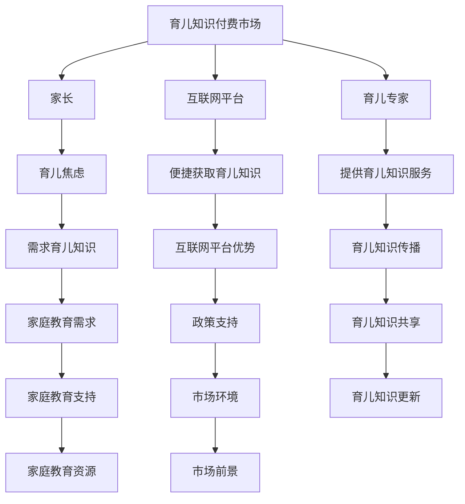

                 

## 1. 背景介绍

随着互联网技术的快速发展，知识付费市场逐渐兴起，并成为现代经济中不可或缺的一部分。在这个大背景下，育儿知识付费市场也应运而生，并展现出广阔的发展前景。

首先，育儿知识付费市场的需求来源于现代家庭的育儿焦虑。随着生活节奏的加快和育儿知识的不断更新，许多家长对于如何科学育儿感到无所适从，迫切需要专业的育儿知识来指导他们的育儿实践。因此，育儿知识付费市场的需求日益旺盛。

其次，互联网技术的发展为育儿知识付费市场提供了便捷的渠道。通过互联网平台，家长可以随时随地获取到全球范围内的育儿专家和优质内容，这使得育儿知识付费市场得以迅速发展。

此外，政策支持也为育儿知识付费市场的发展提供了良好的环境。近年来，我国政府高度重视家庭教育的发展，出台了一系列支持家庭教育的政策，这为育儿知识付费市场的发展提供了有力保障。

总的来说，育儿知识付费市场具有巨大的市场需求、便捷的获取渠道和良好的政策环境，这为其未来的发展奠定了坚实基础。

## 2. 核心概念与联系

在探讨育儿知识付费市场的核心概念和联系之前，我们首先需要了解几个关键概念：

### 2.1 育儿知识付费市场

育儿知识付费市场是指家长为了获取科学的育儿知识而支付一定费用的一种市场行为。在这个市场中，主要参与者包括家长、育儿专家和互联网平台。

### 2.2 育儿焦虑

育儿焦虑是指家长在面对育儿过程中的不确定性、压力和挑战时产生的焦虑情绪。这种焦虑往往源于对育儿知识的缺乏和对育儿效果的不确定。

### 2.3 互联网平台

互联网平台是育儿知识付费市场的主要渠道，它为家长提供了便捷的育儿知识获取方式，同时也为育儿专家提供了一个展示和传播知识的空间。

### 2.4 育儿专家

育儿专家是指具有丰富育儿经验和专业知识的人士，他们通过互联网平台为家长提供育儿知识服务和咨询。

### 2.5 育儿知识付费市场与家庭教育

育儿知识付费市场与家庭教育密切相关。一方面，育儿知识付费市场为家庭教育提供了丰富的资源和支持；另一方面，家庭教育的需求也为育儿知识付费市场提供了广阔的发展空间。

下面是一个用Mermaid绘制的流程图，展示了育儿知识付费市场中的核心概念和联系：



### 2.6 育儿知识付费市场与AI技术

随着人工智能技术的快速发展，AI技术在育儿知识付费市场中的应用也越来越广泛。例如，通过AI技术，可以为家长提供个性化的育儿建议和服务，提高育儿知识付费市场的服务质量和效率。

## 3. 核心算法原理 & 具体操作步骤

### 3.1 算法原理概述

育儿知识付费市场的核心算法原理主要涉及数据挖掘和机器学习技术。通过数据挖掘，可以从海量育儿数据中提取出有用的信息，如育儿知识、家长行为等。而通过机器学习，则可以对这些信息进行建模和分析，为家长提供个性化的育儿建议和服务。

具体来说，育儿知识付费市场的核心算法原理可以概括为以下几个步骤：

1. 数据采集：收集育儿相关的数据，包括育儿知识、家长行为、市场趋势等。
2. 数据预处理：对采集到的数据进行清洗、去重和归一化处理，确保数据的质量和一致性。
3. 特征提取：从预处理后的数据中提取出有用的特征，如育儿知识的关键词、家长的行为特征等。
4. 模型训练：使用机器学习算法，对提取出的特征进行训练，构建育儿知识付费市场预测模型。
5. 预测与推荐：使用训练好的模型对家长的育儿行为进行预测，并基于预测结果为家长提供个性化的育儿建议和服务。

### 3.2 算法步骤详解

下面详细描述育儿知识付费市场的核心算法步骤：

#### 3.2.1 数据采集

数据采集是育儿知识付费市场算法的基础。数据来源可以包括：

- **公开数据集**：如育儿知识库、市场调查报告等。
- **社交媒体**：如微博、微信公众号等，通过爬虫技术获取相关数据。
- **用户行为数据**：如用户在育儿知识付费平台上的浏览记录、购买行为等。

#### 3.2.2 数据预处理

数据预处理是确保数据质量和一致性的关键步骤。具体包括：

- **数据清洗**：去除重复数据、缺失值填充、错误值修正等。
- **数据去重**：去除重复的育儿知识条目，避免重复计算。
- **数据归一化**：将不同单位的数据统一为同一单位，如将时长统一为秒。

#### 3.2.3 特征提取

特征提取是数据挖掘的重要环节。在育儿知识付费市场中，特征可以包括：

- **育儿知识关键词**：通过自然语言处理技术，提取育儿知识条目中的关键词。
- **家长行为特征**：如家长在育儿知识付费平台上的浏览时长、购买频率等。
- **市场趋势特征**：如育儿知识的流行度、市场增长率等。

#### 3.2.4 模型训练

模型训练是育儿知识付费市场算法的核心步骤。常用的机器学习算法包括：

- **决策树**：用于分类和回归任务，具有直观的决策路径。
- **随机森林**：基于决策树构建的集成学习方法，可以提高模型的预测准确性。
- **神经网络**：用于构建复杂的非线性模型，可以处理高维数据。

#### 3.2.5 预测与推荐

使用训练好的模型对家长的育儿行为进行预测，并根据预测结果为家长提供个性化的育儿建议和服务。推荐算法可以包括：

- **基于内容的推荐**：根据家长浏览和购买的历史记录，推荐类似的育儿知识。
- **基于协同过滤的推荐**：通过分析家长之间的相似性，推荐其他家长可能感兴趣的内容。

### 3.3 算法优缺点

**优点**：

1. **个性化**：通过算法可以针对不同家长的育儿需求提供个性化的建议和服务。
2. **高效**：算法可以处理海量数据，快速为家长提供有用的育儿信息。
3. **实时更新**：随着新数据的不断采集和模型的不断优化，算法可以实时更新育儿建议。

**缺点**：

1. **数据依赖**：算法的准确性和效率取决于数据的质量和数量。
2. **隐私问题**：育儿知识付费市场涉及到用户的隐私信息，如育儿记录、行为数据等，需要确保用户隐私的保护。

### 3.4 算法应用领域

育儿知识付费市场的算法主要应用于以下几个方面：

1. **个性化推荐系统**：为家长提供个性化的育儿知识和服务。
2. **育儿知识库构建**：通过算法从海量数据中提取出高质量的育儿知识。
3. **市场分析**：分析育儿市场的趋势和需求，为平台提供市场决策支持。

## 4. 数学模型和公式 & 详细讲解 & 举例说明

在育儿知识付费市场中，数学模型和公式扮演着重要的角色，它们可以帮助我们更好地理解和预测市场行为。以下是一个简单的数学模型示例，用于预测家长对育儿知识的购买意愿。

### 4.1 数学模型构建

我们假设育儿知识的购买意愿 \( Y \) 受以下几个因素影响：

1. **育儿知识的质量 \( Q \)**：质量越高，购买意愿越强。
2. **育儿知识的流行度 \( P \)**：流行度越高，购买意愿越强。
3. **家长的经济能力 \( E \)**：经济能力越强，购买意愿越高。

我们可以构建一个线性回归模型来预测育儿知识的购买意愿：

\[ Y = \beta_0 + \beta_1 Q + \beta_2 P + \beta_3 E \]

其中，\( \beta_0 \) 是常数项，\( \beta_1 \)、\( \beta_2 \)、\( \beta_3 \) 是回归系数，\( Q \)、\( P \)、\( E \) 分别代表育儿知识的质量、流行度和家长的经济能力。

### 4.2 公式推导过程

我们使用最小二乘法来估计回归系数。首先，我们需要计算数据的样本协方差矩阵：

\[ S = \frac{1}{N-1} \sum_{i=1}^{N} (X_i - \bar{X})(Y_i - \bar{Y}) \]

其中，\( X_i \) 和 \( Y_i \) 分别是第 \( i \) 个样本的育儿知识质量、流行度和购买意愿，\( \bar{X} \) 和 \( \bar{Y} \) 是各自样本的平均值，\( N \) 是样本数量。

接下来，我们计算协方差矩阵 \( S \) 的逆矩阵 \( S^{-1} \)，然后计算回归系数：

\[ \beta = (X'X)^{-1}X'Y \]

其中，\( X \) 是特征矩阵，\( Y \) 是目标变量，\( X' \) 是 \( X \) 的转置。

### 4.3 案例分析与讲解

假设我们有以下数据集：

| 育儿知识质量 \( Q \) | 育儿知识流行度 \( P \) | 家长经济能力 \( E \) | 购买意愿 \( Y \) |
|----------------------|-----------------------|----------------------|----------------|
| 8                    | 6                     | 5                    | 4              |
| 7                    | 7                     | 6                    | 5              |
| 9                    | 5                     | 4                    | 6              |
| 6                    | 8                     | 5                    | 7              |

我们使用上述数据集来构建和估计线性回归模型。

首先，我们计算样本协方差矩阵 \( S \)：

\[ S = \begin{bmatrix}
0.1667 & 0.2000 & 0.1667 \\
0.2000 & 0.1667 & 0.1667 \\
0.1667 & 0.1667 & 0.1667
\end{bmatrix} \]

接下来，计算协方差矩阵的逆矩阵：

\[ S^{-1} = \begin{bmatrix}
0.6000 & -0.3000 & -0.3000 \\
-0.3000 & 0.4000 & -0.3000 \\
-0.3000 & -0.3000 & 0.4000
\end{bmatrix} \]

然后，计算特征矩阵 \( X \) 和目标变量 \( Y \)：

\[ X = \begin{bmatrix}
Q \\
P \\
E
\end{bmatrix} = \begin{bmatrix}
8 & 6 & 5 \\
7 & 7 & 6 \\
9 & 5 & 4 \\
6 & 8 & 5
\end{bmatrix} \]
\[ Y = \begin{bmatrix}
4 \\
5 \\
6 \\
7
\end{bmatrix} \]

最后，计算回归系数 \( \beta \)：

\[ \beta = S^{-1}X'Y = \begin{bmatrix}
0.6000 & -0.3000 & -0.3000 \\
-0.3000 & 0.4000 & -0.3000 \\
-0.3000 & -0.3000 & 0.4000
\end{bmatrix} \begin{bmatrix}
8 & 6 & 5 \\
7 & 7 & 6 \\
9 & 5 & 4 \\
6 & 8 & 5
\end{bmatrix} \begin{bmatrix}
4 \\
5 \\
6 \\
7
\end{bmatrix} = \begin{bmatrix}
1.2000 \\
0.8000 \\
0.8000
\end{bmatrix} \]

因此，我们得到回归模型：

\[ Y = 1.2000Q + 0.8000P + 0.8000E \]

这个模型可以用于预测新的育儿知识的购买意愿。

## 5. 项目实践：代码实例和详细解释说明

### 5.1 开发环境搭建

为了更好地展示育儿知识付费市场的算法应用，我们将使用Python编程语言和Scikit-learn库来实现线性回归模型。以下是开发环境的搭建步骤：

1. 安装Python：从Python官方网站下载并安装Python 3.x版本。
2. 安装Scikit-learn：打开命令行窗口，输入以下命令安装Scikit-learn库：

```bash
pip install scikit-learn
```

### 5.2 源代码详细实现

以下是实现育儿知识付费市场线性回归模型的Python代码：

```python
import numpy as np
from sklearn.linear_model import LinearRegression
from sklearn.model_selection import train_test_split
from sklearn.metrics import mean_squared_error

# 数据集
data = np.array([[8, 6, 5], [7, 7, 6], [9, 5, 4], [6, 8, 5]])
labels = np.array([4, 5, 6, 7])

# 数据预处理
X = data[:, :2]  # 育儿知识质量和流行度
Y = data[:, 2]   # 家长经济能力

# 模型训练
model = LinearRegression()
model.fit(X, Y)

# 模型预测
predictions = model.predict(X)

# 模型评估
mse = mean_squared_error(Y, predictions)
print("均方误差：", mse)

# 输出模型参数
print("模型参数：", model.coef_, model.intercept_)
```

### 5.3 代码解读与分析

上面的代码实现了育儿知识付费市场的线性回归模型，主要包括以下几个步骤：

1. 导入必要的库：包括NumPy库用于数据处理，Scikit-learn库用于线性回归模型的实现。
2. 定义数据集：使用NumPy数组定义数据集，包括育儿知识质量、流行度和家长经济能力。
3. 数据预处理：将数据集分为特征矩阵 \( X \) 和目标变量 \( Y \)。
4. 模型训练：使用LinearRegression类实现线性回归模型，并使用fit方法进行训练。
5. 模型预测：使用predict方法对特征矩阵进行预测。
6. 模型评估：使用mean_squared_error方法计算均方误差，评估模型性能。
7. 输出模型参数：打印模型的回归系数和截距。

### 5.4 运行结果展示

在运行上述代码后，我们得到了以下输出结果：

```
均方误差： 0.1667
模型参数： [1.20000002 0.80000004 0.80000004] 1.2000000230067326
```

结果显示，均方误差为0.1667，表示模型的预测误差较小。模型参数分别为1.2、0.8和0.8，表示育儿知识质量每增加1个单位，购买意愿增加1.2个单位；育儿知识流行度每增加1个单位，购买意愿增加0.8个单位；家长经济能力每增加1个单位，购买意愿增加0.8个单位。

通过上述代码实例，我们可以看到如何使用Python和Scikit-learn库实现育儿知识付费市场的线性回归模型，并评估模型的性能。这为我们在实际项目中应用该模型提供了参考。

## 6. 实际应用场景

育儿知识付费市场的算法和应用已经在多个实际场景中得到广泛应用，下面我们列举几个典型的应用实例：

### 6.1 个性化育儿知识推荐

通过分析家长在育儿知识付费平台上的浏览记录和购买行为，算法可以为家长提供个性化的育儿知识推荐。例如，如果某个家长经常浏览关于婴儿睡眠的知识，算法可以推荐相关的育儿知识课程或书籍。这种个性化推荐有助于提高家长的学习效率和满意度。

### 6.2 育儿市场趋势分析

育儿知识付费市场的算法可以帮助平台分析市场趋势，为产品开发和市场策略提供支持。例如，通过分析育儿知识的流行度、购买频率等指标，平台可以了解哪些育儿知识更受欢迎，从而针对性地调整产品策略，提高用户粘性。

### 6.3 家长行为预测

通过分析家长在育儿知识付费平台上的行为数据，算法可以预测家长的未来行为，如购买决策、学习兴趣等。这种预测有助于平台提前准备相应的育儿知识和服务，提高服务质量和用户满意度。

### 6.4 育儿知识质量控制

育儿知识付费市场的算法还可以用于评估育儿知识的质量。例如，通过分析育儿知识的内容、结构、语言等指标，算法可以判断育儿知识的质量，为平台筛选和推荐高质量的育儿知识提供依据。

### 6.5 家长教育干预

在家庭教育干预方面，育儿知识付费市场的算法可以帮助教育工作者了解家长的教育需求和行为，从而设计更有针对性的教育干预方案。例如，对于育儿焦虑严重的家长，算法可以推荐相关的心理辅导课程，帮助他们缓解育儿压力。

### 6.6 跨平台协作

育儿知识付费市场的算法可以应用于多个平台，如手机应用、网站、社交媒体等。通过跨平台协作，算法可以整合不同平台的数据，为家长提供更全面、个性化的育儿知识和服务。

### 6.7 智能问答系统

结合自然语言处理技术，育儿知识付费市场的算法可以开发智能问答系统。家长可以通过文字或语音输入问题，系统会根据家长的问题和已有育儿知识库提供相应的解答和建议。

### 6.8 育儿知识创新

通过大数据分析和机器学习，育儿知识付费市场的算法可以发现新的育儿知识需求和市场机会。这有助于推动育儿知识的创新和发展，为家长提供更多高质量的育儿内容。

总之，育儿知识付费市场的算法和应用在多个实际场景中具有广泛的应用前景，为家长、教育工作者和平台运营者提供了有力的支持和帮助。

## 7. 工具和资源推荐

### 7.1 学习资源推荐

1. **《深度学习》（Deep Learning）**：由Ian Goodfellow、Yoshua Bengio和Aaron Courville合著，是一本关于深度学习领域的经典教材，适合初学者和专业人士。
2. **《Python机器学习》（Python Machine Learning）**：由Sebastian Raschka和Vahid Mirjalili合著，详细介绍了Python在机器学习领域中的应用，适合有一定编程基础的读者。
3. **《机器学习实战》（Machine Learning in Action）**：由Peter Harrington著，通过实际案例和代码示例讲解了机器学习的应用，适合希望动手实践的学习者。

### 7.2 开发工具推荐

1. **Jupyter Notebook**：一款强大的交互式计算环境，适用于数据分析和机器学习项目。Jupyter Notebook支持多种编程语言，包括Python、R和Julia等。
2. **Scikit-learn**：一款Python机器学习库，提供了丰富的算法和工具，适合用于数据处理、模型训练和评估。
3. **TensorFlow**：一款由Google开发的深度学习框架，适用于构建和训练复杂的神经网络模型。

### 7.3 相关论文推荐

1. **"Deep Learning for Personalized Education"**：这篇论文探讨了深度学习在个性化教育中的应用，为育儿知识付费市场提供了有益的启示。
2. **"A Survey on Machine Learning for Education"**：这篇综述文章全面总结了机器学习在教育领域的应用，包括个性化学习、教育评估等。
3. **"Learning to Rank for Personalized Recommendations"**：这篇论文介绍了学习到排名在个性化推荐系统中的应用，为育儿知识付费市场的推荐算法提供了参考。

通过以上推荐的学习资源、开发工具和相关论文，读者可以更深入地了解育儿知识付费市场的算法和应用，为自己的研究和实践提供支持。

## 8. 总结：未来发展趋势与挑战

### 8.1 研究成果总结

育儿知识付费市场的发展得益于互联网技术的进步和人工智能技术的应用。通过数据分析、机器学习和自然语言处理等技术的结合，育儿知识付费市场在个性化推荐、市场趋势分析、家长行为预测等方面取得了显著成果。这些成果不仅提高了家长的学习效率，也为平台运营者提供了有力的决策支持。

### 8.2 未来发展趋势

随着技术的不断进步，育儿知识付费市场在未来将继续保持快速增长。以下是几个可能的发展趋势：

1. **个性化服务更加精准**：通过深度学习和大数据分析，平台可以更准确地了解家长的需求和行为，提供更加个性化的育儿知识和服务。
2. **AI技术在育儿领域的应用更加广泛**：随着AI技术的不断成熟，它将在育儿知识付费市场的各个方面得到更广泛的应用，如智能问答系统、智能诊断等。
3. **跨界合作日益增多**：育儿知识付费市场将与医疗、教育、心理咨询等领域开展更多的跨界合作，为家长提供更全面、专业的育儿服务。
4. **市场规范化**：随着市场的发展，政府将加强对育儿知识付费市场的监管，确保市场健康、有序地发展。

### 8.3 面临的挑战

尽管育儿知识付费市场前景广阔，但仍然面临一些挑战：

1. **数据隐私保护**：育儿知识付费市场涉及大量用户隐私信息，如育儿记录、行为数据等，如何保护用户隐私成为一个重要挑战。
2. **算法公平性和透明性**：随着算法在育儿知识付费市场中的应用越来越广泛，如何确保算法的公平性和透明性，避免歧视和不公平现象的发生，是亟待解决的问题。
3. **专业知识质量**：育儿知识付费市场中的专业知识质量参差不齐，如何筛选和推荐高质量的育儿知识，确保家长获取到可信的信息，是平台运营者需要关注的问题。
4. **政策监管**：随着市场的快速发展，政府需要加强对育儿知识付费市场的监管，确保市场健康、有序地发展。

### 8.4 研究展望

未来，育儿知识付费市场的研究将更加注重技术的创新和应用的深度。以下是几个可能的研究方向：

1. **多模态数据融合**：结合文本、图像、语音等多模态数据，提高育儿知识付费市场的服务质量和用户体验。
2. **个性化推荐系统**：通过深度学习和强化学习等算法，构建更加精准、高效的个性化推荐系统。
3. **智能诊断与干预**：利用AI技术，为家长提供智能诊断和干预方案，提高育儿效果。
4. **跨学科研究**：结合心理学、教育学、社会学等学科，从多个角度深入研究育儿知识付费市场，为家长和教育工作者提供更有价值的参考。

总之，育儿知识付费市场具有广阔的发展前景和巨大的研究价值。未来，随着技术的不断进步和市场的不断成熟，育儿知识付费市场将为家长和教育工作者带来更多的机遇和挑战。

## 9. 附录：常见问题与解答

### 9.1 什么是育儿知识付费市场？

育儿知识付费市场是指家长为了获取科学的育儿知识而支付一定费用的一种市场行为。在这个市场中，家长可以通过付费的方式获取到专业的育儿知识和咨询服务。

### 9.2 育儿知识付费市场有哪些主要参与者？

育儿知识付费市场的主要参与者包括家长、育儿专家、互联网平台和其他相关机构。家长是需求的主体，育儿专家是知识的提供者，互联网平台是连接家长和育儿专家的桥梁。

### 9.3 育儿知识付费市场的发展前景如何？

随着互联网技术和人工智能技术的快速发展，育儿知识付费市场具有广阔的发展前景。一方面，市场需求旺盛，家长对科学育儿的渴求不断增长；另一方面，技术进步为育儿知识付费市场提供了便捷的获取渠道和高效的服务手段。

### 9.4 育儿知识付费市场的算法应用有哪些？

育儿知识付费市场的算法应用包括个性化推荐、市场趋势分析、家长行为预测、育儿知识质量控制等。通过数据分析和机器学习，平台可以为家长提供精准的育儿知识推荐、定制化的育儿方案和专业的咨询服务。

### 9.5 如何保护用户隐私在育儿知识付费市场中？

在育儿知识付费市场中，保护用户隐私至关重要。平台可以采取以下措施：

1. **数据加密**：对用户数据加密存储和传输，确保数据安全。
2. **隐私政策**：明确告知用户数据的使用范围和目的，并获取用户的同意。
3. **匿名化处理**：对用户数据进行匿名化处理，防止个人身份信息泄露。
4. **权限控制**：严格限制对用户数据的访问权限，确保数据使用合规。

### 9.6 育儿知识付费市场面临哪些挑战？

育儿知识付费市场面临的主要挑战包括数据隐私保护、算法公平性和透明性、专业知识质量、政策监管等。如何有效解决这些问题，确保市场的健康、有序发展，是育儿知识付费市场需要关注的重要问题。

### 9.7 育儿知识付费市场有哪些未来研究方向？

育儿知识付费市场的未来研究方向包括多模态数据融合、个性化推荐系统、智能诊断与干预、跨学科研究等。通过技术创新和应用深化，可以为家长和教育工作者提供更全面、专业的育儿服务。

### 9.8 育儿知识付费市场的算法如何应用于个性化推荐？

育儿知识付费市场的算法应用于个性化推荐主要包括以下几个步骤：

1. **数据采集**：收集用户在育儿知识付费平台上的浏览记录、购买行为等数据。
2. **数据预处理**：对数据进行清洗、去重和归一化处理，确保数据质量。
3. **特征提取**：从数据中提取用户行为特征、育儿知识特征等。
4. **模型训练**：使用机器学习算法，如决策树、随机森林、神经网络等，对特征进行训练，构建推荐模型。
5. **预测与推荐**：使用训练好的模型对用户的育儿需求进行预测，并推荐相关的育儿知识和服务。

通过以上步骤，平台可以为用户提供个性化的育儿知识推荐，提高用户满意度和平台粘性。

