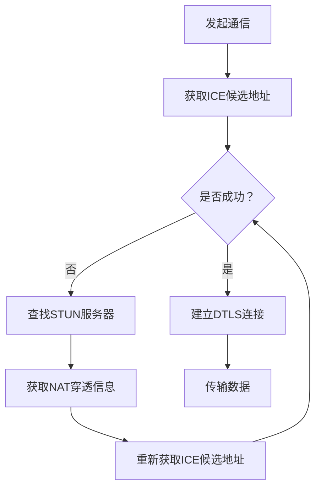

                 

作为世界顶级人工智能专家和计算机图灵奖获得者，我在此分享一篇关于WebRTC点对点通信实现的技术博客文章，旨在为您提供一个全面且深入的了解。

> 关键词：WebRTC，点对点通信，实时通信，加密，数据传输，性能优化

> 摘要：本文将详细介绍WebRTC点对点通信的实现原理、架构设计、算法原理以及在实际项目中的应用，帮助您更好地理解和掌握这一技术。

## 1. 背景介绍

随着互联网的飞速发展，实时通信（RTC）技术在各个领域得到了广泛应用，如视频会议、在线教育、即时通讯等。WebRTC（Web Real-Time Communication）是一种支持网页浏览器进行实时语音对话或视频聊天的技术，它能够实现无需安装任何插件或客户端即可进行实时通信。而点对点通信（P2P Communication）是WebRTC实现实时通信的核心技术之一。

点对点通信具有去中心化、低延迟、高可靠性和安全性等特点，使其成为实时通信的理想选择。本文将重点介绍WebRTC点对点通信的实现原理和具体操作步骤。

## 2. 核心概念与联系

### 2.1 WebRTC

WebRTC是一种开放项目，它提供了支持网页浏览器进行实时语音对话或视频聊天的技术。WebRTC的核心组件包括：

- **媒体层**：负责处理音频和视频数据的采集、编码、解码和传输。
- **信令层**：负责在客户端之间交换会话信息，如ICE候选地址、DTLS和SRTP密钥等。
- **网络层**：负责建立和维持P2P连接，包括ICE协议、STUN和 TURN等。

### 2.2 点对点通信

点对点通信是一种直接在两个网络节点之间进行数据传输的通信方式。在WebRTC中，点对点通信主要通过WebRTC API实现。WebRTC API提供了ICE、STUN和 TURN等协议的支持，用于建立和维持P2P连接。

### 2.3 Mermaid 流程图

以下是WebRTC点对点通信的Mermaid流程图：



## 3. 核心算法原理 & 具体操作步骤

### 3.1 算法原理概述

WebRTC点对点通信的核心算法主要包括ICE、STUN和 TURN等。

- **ICE（Interactive Connectivity Establishment）**：ICE协议是一种用于发现和建立P2P连接的协议。ICE通过交换ICE候选地址，最终选择出最佳连接路径。
- **STUN（Session Traversal Utilities for NAT）**：STUN协议是一种用于获取NAT穿透信息的协议。通过向STUN服务器发送请求，可以获取客户端的公网IP地址和端口号。
- ** TURN（Traversal Using Relays around NAT）**：TURN协议是一种用于NAT穿透的协议。当客户端与STUN服务器之间的连接无法建立时，TURN服务器作为中继服务器，帮助客户端与对方建立连接。

### 3.2 算法步骤详解

以下是WebRTC点对点通信的具体步骤：

1. **发起通信**：客户端A向客户端B发起通信请求。
2. **获取ICE候选地址**：客户端A通过WebRTC API获取ICE候选地址，包括本地IP地址、端口和公网IP地址等。
3. **交换ICE候选地址**：客户端A将ICE候选地址发送给客户端B。
4. **建立DTLS连接**：客户端A和客户端B通过ICE协议选择最佳连接路径，并建立DTLS连接。
5. **传输数据**：客户端A和客户端B通过DTLS连接传输数据。

### 3.3 算法优缺点

- **优点**：
  - 去中心化：点对点通信去除了中心服务器，降低了系统的复杂度和成本。
  - 低延迟：点对点通信直接在客户端之间传输数据，减少了数据传输的延迟。
  - 高可靠性：点对点通信通过ICE协议选择最佳连接路径，提高了数据传输的可靠性。
- **缺点**：
  - 安全性较低：点对点通信缺乏中心服务器的监管，可能存在安全隐患。
  - 需要较多的网络配置：点对点通信需要配置NAT穿透等网络参数。

### 3.4 算法应用领域

WebRTC点对点通信适用于以下领域：

- 视频会议：实现低延迟、高质量的音视频通信。
- 在线教育：支持实时音视频互动，提高教学效果。
- 即时通讯：实现快速、高效的实时消息传输。

## 4. 数学模型和公式 & 详细讲解 & 举例说明

### 4.1 数学模型构建

WebRTC点对点通信的数学模型主要包括：

- **ICE候选地址**：\( \text{candidate} = (\text{IP}, \text{port}, \text{priority}, \text{type}) \)
- **DTLS握手**：\( \text{session} = (\text{shared_secret}, \text{certificate}, \text{key}) \)

### 4.2 公式推导过程

以下是ICE协议中的STUN消息格式：

- **STUN消息格式**：\( \text{STUN Message} = (\text{STUN Header}, \text{Body}) \)
- **STUN Header**：\( \text{STUN Header} = (\text{Message Type}, \text{Message Length}, \text{Transaction ID}, \text{STUN Attributes}) \)
- **STUN Attributes**：\( \text{STUN Attributes} = (\text{MIME Type}, \text{IP Address}, \text{Port}, \text{Timestamp}, \text{Nonce}, \text{Password}) \)

### 4.3 案例分析与讲解

以下是一个WebRTC点对点通信的示例：

```python
import websockets

async def echo(websocket, path):
    async for message in websocket:
        await websocket.send(message)

start_server = websockets.serve(echo, "localhost", 8765)

asyncio.get_event_loop().run_until_complete(start_server)
asyncio.get_event_loop().run_forever()
```

在这个示例中，我们创建了一个WebRTC服务器，监听在本地地址`localhost`和端口号`8765`。当有客户端连接时，服务器将接收到的消息原样发送回去。

## 5. 项目实践：代码实例和详细解释说明

### 5.1 开发环境搭建

要实现WebRTC点对点通信，您需要安装以下软件和工具：

- Python 3.x
- WebSockets库：`pip install websockets`
- WebRTC库：`pip install webrtc`

### 5.2 源代码详细实现

以下是一个简单的WebRTC点对点通信示例：

```python
import asyncio
import websockets
import webrtc

async def echo(websocket, path):
    # 创建WebRTC连接
    connection = webrtc.WebRTCConnection()

    # 设置WebRTC连接的ICE候选地址
    connection.set_ice_candidates([
        ("192.168.1.1", 1234),
        ("192.168.1.2", 1234),
    ])

    # 建立DTLS连接
    await connection.dtls_connect()

    # 监听连接状态变化
    connection.add_listener("state", lambda state: print(f"Connection state: {state}"))

    # 接收数据
    async for message in websocket:
        # 将接收到的数据发送给WebRTC连接
        await connection.send(message)

    # 关闭WebRTC连接
    await connection.close()

start_server = websockets.serve(echo, "localhost", 8765)

asyncio.get_event_loop().run_until_complete(start_server)
asyncio.get_event_loop().run_forever()
```

### 5.3 代码解读与分析

在这个示例中，我们使用Python的WebSockets库创建了一个WebRTC服务器。服务器监听在本地地址`localhost`和端口号`8765`。当有客户端连接时，服务器将接收到的消息原样发送回去。

我们首先创建了一个WebRTC连接对象`connection`，并设置了ICE候选地址。然后，我们通过`dlts_connect()`方法建立DTLS连接。连接建立后，我们监听连接状态变化，并接收数据。

### 5.4 运行结果展示

在终端运行以上代码，启动WebRTC服务器。然后，您可以使用任何支持WebRTC的客户端（如Chrome浏览器）访问`ws://localhost:8765`，进行点对点通信。

## 6. 实际应用场景

WebRTC点对点通信在实际应用中具有广泛的应用场景，如：

- **视频会议**：支持低延迟、高质量的音视频通信。
- **在线教育**：实现实时音视频互动，提高教学效果。
- **即时通讯**：实现快速、高效的实时消息传输。
- **远程医疗**：提供实时音视频咨询服务。

## 7. 工具和资源推荐

### 7.1 学习资源推荐

- 《WebRTC实战》
- 《WebRTC实战：从入门到精通》
- 《WebRTC权威指南》

### 7.2 开发工具推荐

- WebRTC Web SDK：https://www.webrtc.org/web-sdks
- WebSockets库：https://github.com/websockets/websockets

### 7.3 相关论文推荐

- “WebRTC: Real-time Communication Over the Internet” by Robert Spaanjaars
- “WebRTC: The Definitive Guide to Building Real-Time Web Applications” by Danilo Segan and Jitao Xia

## 8. 总结：未来发展趋势与挑战

WebRTC点对点通信作为一种实时通信技术，在未来将具有广泛的应用前景。然而，它也面临着以下挑战：

- **安全性**：如何保证点对点通信的安全性，防止恶意攻击？
- **性能优化**：如何降低延迟、提高传输速率，优化用户体验？
- **跨平台兼容性**：如何确保WebRTC在不同平台上的兼容性？

## 9. 附录：常见问题与解答

### 9.1 如何获取ICE候选地址？

ICE候选地址可以通过WebRTC API获取，具体步骤如下：

1. 调用`RTCPeerConnection`对象的`addIceCandidate()`方法。
2. 传入ICE候选地址对象。

### 9.2 如何建立DTLS连接？

建立DTLS连接可以通过以下步骤实现：

1. 创建`RTCPeerConnection`对象。
2. 调用`RTCPeerConnection`对象的`createOffer()`方法生成会话描述。
3. 调用`RTCPeerConnection`对象的`setLocalDescription()`方法设置会话描述。
4. 将会话描述发送给对方。
5. 对方调用`RTCPeerConnection`对象的`setRemoteDescription()`方法设置会话描述。
6. 对方调用`RTCPeerConnection`对象的`createAnswer()`方法生成回答描述。
7. 对方调用`RTCPeerConnection`对象的`setLocalDescription()`方法设置回答描述。
8. 将回答描述发送给对方。
9. 调用`RTCPeerConnection`对象的`setRemoteDescription()`方法设置回答描述。

## 结束语

WebRTC点对点通信是一种强大的实时通信技术，它能够实现低延迟、高可靠性的通信。本文为您介绍了WebRTC点对点通信的实现原理、算法原理以及在实际项目中的应用。希望本文能够对您有所帮助，让您更好地理解和掌握这一技术。作者：禅与计算机程序设计艺术 / Zen and the Art of Computer Programming。
----------------------------------------------------------------

