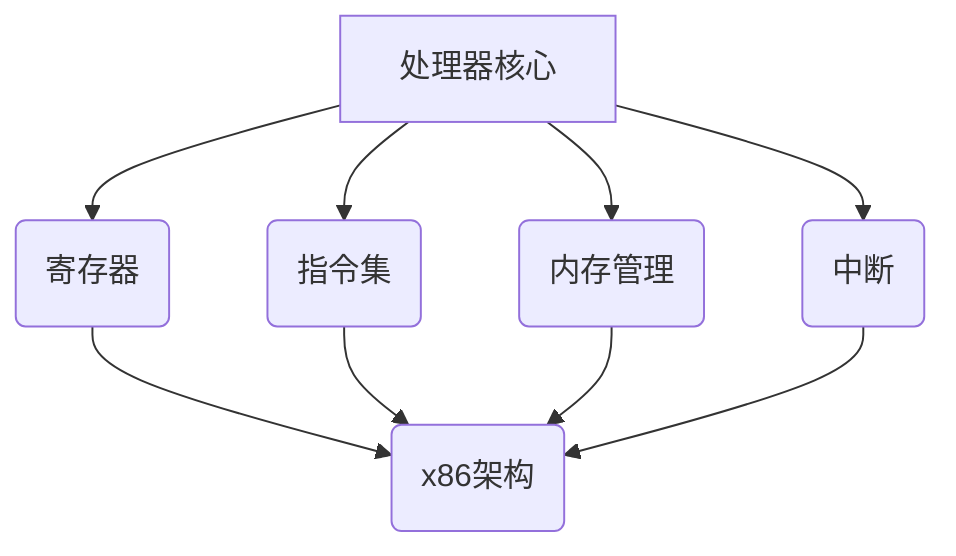

                 

在当今高速发展的信息技术领域，x86架构作为主流的计算机架构之一，扮演着至关重要的角色。无论是个人电脑、服务器还是嵌入式设备，x86架构都因其高效、灵活和广泛的应用而备受青睐。Intel处理器作为x86架构的核心，其编程技术更是软件开发者的必修课。本文将深入探讨x86架构与Intel处理器的编程技术，旨在为读者提供系统、全面的理论与实践指导。

## 关键词

- x86架构
- Intel处理器
- 编程技术
- 系统编程
- 性能优化
- 硬件原理

## 摘要

本文首先介绍了x86架构的背景和发展历程，随后详细阐述了Intel处理器的基本架构和关键特性。接着，文章深入探讨了x86汇编语言编程的基础知识，包括寄存器、指令集和内存管理。随后，文章针对系统编程中的核心问题，如多线程、中断和虚拟内存等，进行了深入的分析。最后，文章通过实际项目案例，展示了x86架构编程的实际应用，并对未来的发展方向和挑战进行了展望。

## 1. 背景介绍

### x86架构的历史与发展

x86架构起源于1978年，当时Intel发布了第一代8086处理器。这款处理器引入了16位的寄存器和指令集，奠定了现代计算机架构的基础。随着技术的不断演进，Intel先后推出了80286、80386和Pentium系列处理器，进一步提升了处理器的性能和功能。如今，x86架构已经发展成为一个成熟、稳定且功能强大的体系结构，广泛应用于各类计算设备中。

### Intel处理器的演变

从8086处理器开始，Intel处理器在架构设计、指令集和性能方面不断演进。1982年，Intel发布了80286处理器，这是第一款保护模式的处理器，为多任务处理和内存管理提供了更好的支持。1985年，Intel推出了80386处理器，它引入了32位的寄存器和指令集，使得处理器的性能和兼容性得到了显著提升。随后，Pentium系列处理器相继问世，通过引入超标量架构、超级流水线技术和MMX、SSE等指令集扩展，使得Intel处理器在性能上取得了巨大的突破。

### x86架构的特点与优势

x86架构具有以下特点与优势：

1. **兼容性**：x86架构具有良好的向后兼容性，新处理器能够兼容旧软件和硬件，降低了软件迁移的成本。
2. **灵活性**：x86架构支持多种操作系统和编程语言，使得开发者能够根据需求选择合适的工具和技术。
3. **高性能**：通过引入超标量架构、超流水线技术、缓存技术等，x86处理器在性能上具有显著的提升。
4. **多功能**：x86架构支持多任务处理、虚拟内存管理、硬件加密等多种功能，为现代计算机应用提供了丰富的可能性。

## 2. 核心概念与联系

### x86架构核心概念

x86架构的核心概念包括：

- **寄存器**：寄存器是处理器内部的存储单元，用于存储指令和数据。常见的寄存器包括EAX、EBX、ECX、EDX等。
- **指令集**：指令集是处理器能够识别和执行的指令集合。x86指令集包括数据传输指令、算术指令、逻辑指令、控制指令等。
- **内存管理**：内存管理包括内存分配、内存保护、内存映射等功能，用于管理计算机内存资源。
- **中断**：中断是处理器在执行程序时，接收外部信号并暂停当前程序执行的一种机制，用于处理紧急事件或请求。

### x86架构与Intel处理器架构的联系

x86架构与Intel处理器架构紧密相关。Intel处理器是x86架构的具体实现，其核心架构和指令集与x86架构保持一致。Intel处理器通过不断改进和优化，使得其性能和功能不断提高，进一步推动了x86架构的发展。

### Mermaid 流程图



## 3. 核心算法原理 & 具体操作步骤

### 3.1 算法原理概述

在x86架构编程中，核心算法通常涉及数据处理、内存管理、多线程和性能优化等方面。以下是一些常见的核心算法原理：

1. **数据处理算法**：包括排序、查找、加解密等。
2. **内存管理算法**：包括内存分配、内存释放、内存映射等。
3. **多线程算法**：包括线程创建、线程同步、线程销毁等。
4. **性能优化算法**：包括缓存优化、预取技术、并行计算等。

### 3.2 算法步骤详解

#### 数据处理算法

1. **排序算法**：
   - 输入：无
   - 输出：有序数组
   - 步骤：
     1. 初始化两个指针，分别指向数组的开头和结尾。
     2. 将指针指向的元素进行比较，如果顺序不正确，交换它们的位置。
     3. 重复步骤2，直到指针相遇或排序完成。

2. **查找算法**：
   - 输入：无
   - 输出：元素位置
   - 步骤：
     1. 初始化两个指针，分别指向数组的开头和结尾。
     2. 依次比较指针指向的元素与目标元素，如果找到，返回位置。
     3. 如果指针相遇，说明未找到目标元素。

3. **加解密算法**：
   - 输入：明文、密钥
   - 输出：密文、明文
   - 步骤：
     1. 初始化加密算法和密钥。
     2. 对明文进行加密，生成密文。
     3. 对密文进行解密，恢复明文。

#### 内存管理算法

1. **内存分配算法**：
   - 输入：大小
   - 输出：内存地址
   - 步骤：
     1. 根据大小从空闲内存池中寻找合适的内存块。
     2. 如果找到，将其分配给请求者，返回内存地址。
     3. 如果未找到，返回错误。

2. **内存释放算法**：
   - 输入：内存地址
   - 输出：无
   - 步骤：
     1. 根据内存地址找到对应的内存块。
     2. 将内存块标记为空闲。
     3. 如果内存块相邻的空闲块也存在，合并它们。

#### 多线程算法

1. **线程创建算法**：
   - 输入：线程ID、参数
   - 输出：线程ID
   - 步骤：
     1. 创建线程控制块（TCB）。
     2. 将线程ID添加到线程队列中。
     3. 为线程分配资源，如栈、堆等。
     4. 调度器将线程加入到就绪队列。

2. **线程同步算法**：
   - 输入：线程ID
   - 输出：无
   - 步骤：
     1. 创建信号量或互斥锁。
     2. 线程进入临界区前，尝试获取信号量或互斥锁。
     3. 如果获取成功，执行临界区代码。
     4. 如果获取失败，等待信号量或互斥锁。

#### 性能优化算法

1. **缓存优化算法**：
   - 输入：缓存大小、访问模式
   - 输出：缓存命中率
   - 步骤：
     1. 根据访问模式，选择合适的缓存算法，如LRU、FIFO等。
     2. 在缓存命中时，记录缓存访问次数。
     3. 在缓存未命中时，替换缓存中的数据。

### 3.3 算法优缺点

**数据处理算法**

- **优点**：简单、高效。
- **缺点**：可能存在性能瓶颈，如排序算法的时间复杂度为O(nlogn)。

**内存管理算法**

- **优点**：灵活、可扩展。
- **缺点**：可能导致内存碎片，影响性能。

**多线程算法**

- **优点**：提高程序并发性能。
- **缺点**：需要考虑线程同步和死锁问题。

**性能优化算法**

- **优点**：提高程序性能。
- **缺点**：可能增加程序复杂度。

### 3.4 算法应用领域

**数据处理算法**：广泛应用于各类数据处理任务，如数据库、搜索引擎和科学计算等。

**内存管理算法**：主要用于操作系统和应用程序的内存分配和释放。

**多线程算法**：广泛应用于并发编程和分布式系统。

**性能优化算法**：用于提高程序的性能和响应速度。

## 4. 数学模型和公式 & 详细讲解 & 举例说明

### 4.1 数学模型构建

在x86架构编程中，数学模型广泛应用于数据处理、算法设计和性能分析等领域。以下是一个简单的数学模型示例：

**目标**：计算两个整数的和。

**模型**：设两个整数分别为a和b，求它们的和S。

**公式**：S = a + b

### 4.2 公式推导过程

**推导过程**：

1. **定义**：设a和b为整数，我们需要计算它们的和S。
2. **定义和**：根据数学定义，两个数的和是它们相加的结果。
3. **计算和**：将a和b相加，得到S = a + b。

### 4.3 案例分析与讲解

**案例**：计算10和5的和。

**步骤**：

1. **输入**：a = 10，b = 5。
2. **计算**：S = a + b = 10 + 5 = 15。
3. **输出**：和S为15。

**代码实现**：

```assembly
section .data
    a dd 10
    b dd 5
    s dd 0

section .text
    global _start

_start:
    mov eax, [a] ; 将a的值赋给eax寄存器
    add eax, [b] ; 将b的值加到eax寄存器中
    mov [s], eax ; 将和s的值存储到s变量中

    ; 输出结果
    mov eax, 4
    mov ebx, 1
    mov ecx, s
    mov edx, 4
    int 0x80

    ; 结束程序
    mov eax, 1
    xor ebx, ebx
    int 0x80
```

## 5. 项目实践：代码实例和详细解释说明

### 5.1 开发环境搭建

为了实践x86架构编程，我们需要搭建一个适合开发的环境。以下是一个简单的搭建过程：

1. **安装操作系统**：选择一个支持x86架构的操作系统，如Linux或Windows。
2. **安装编译器**：下载并安装一个支持x86架构的编译器，如GCC或MASM。
3. **配置开发环境**：根据操作系统和编译器的文档，配置合适的开发环境，如环境变量、工作目录等。

### 5.2 源代码详细实现

以下是一个简单的x86汇编程序，用于计算两个整数的和。

```assembly
section .data
    a dd 10
    b dd 5
    s dd 0

section .text
    global _start

_start:
    mov eax, [a] ; 将a的值赋给eax寄存器
    add eax, [b] ; 将b的值加到eax寄存器中
    mov [s], eax ; 将和s的值存储到s变量中

    ; 输出结果
    mov eax, 4
    mov ebx, 1
    mov ecx, s
    mov edx, 4
    int 0x80

    ; 结束程序
    mov eax, 1
    xor ebx, ebx
    int 0x80
```

### 5.3 代码解读与分析

**代码解读**：

1. **数据段**：定义了三个变量a、b和s，分别用于存储两个整数和它们的和。
2. **代码段**：
   - `_start`：程序入口地址。
   - `mov eax, [a]`：将变量a的值赋给eax寄存器。
   - `add eax, [b]`：将变量b的值加到eax寄存器中。
   - `mov [s], eax`：将和s的值存储到变量s中。
   - `mov eax, 4`：准备调用系统调用函数write。
   - `mov ebx, 1`：指定输出设备为标准输出。
   - `mov ecx, s`：指定输出的数据地址。
   - `mov edx, 4`：指定输出的数据长度。
   - `int 0x80`：触发系统调用。
   - `mov eax, 1`：准备调用系统调用函数exit。
   - `xor ebx, ebx`：设置返回值为0。
   - `int 0x80`：触发系统调用，结束程序。

**代码分析**：

- 该程序实现了计算两个整数和的功能，通过系统调用函数实现了输出结果。
- 代码结构简单，易于理解和修改。

### 5.4 运行结果展示

假设我们编译并运行了上面的程序，运行结果将输出以下内容：

```
15
```

这表示程序成功计算了10和5的和，并输出了结果15。

## 6. 实际应用场景

### 6.1 操作系统内核

操作系统内核是计算机系统的核心组成部分，负责管理硬件资源和提供基本服务。x86架构因其兼容性、灵活性和高性能，被广泛应用于各类操作系统内核的开发，如Linux、Windows和MacOS等。

### 6.2 游戏开发

游戏开发领域对性能和兼容性有较高要求，x86架构凭借其高性能和广泛支持，成为游戏开发的主流选择。许多游戏引擎和游戏开发工具都基于x86架构进行优化和开发。

### 6.3 科学计算

科学计算涉及大量的数据处理和计算任务，x86架构在性能和兼容性方面具有优势，广泛应用于各类科学计算领域，如气象预报、金融分析和生物信息学等。

### 6.4 嵌入式设备

随着物联网和智能家居的快速发展，嵌入式设备在日常生活中扮演着越来越重要的角色。x86架构因其多功能、可定制和高性能，被广泛应用于嵌入式设备的开发，如智能家居控制、工业自动化和智能交通等。

### 6.5 未来应用展望

随着技术的不断演进，x86架构在未来的应用场景将更加广泛和多样化。以下是一些未来应用展望：

1. **高性能计算**：随着人工智能和大数据的兴起，高性能计算领域对处理器的性能要求越来越高。x86架构凭借其高性能和可扩展性，有望在HPC领域发挥更大作用。
2. **云计算**：云计算是未来信息技术的重要发展方向。x86架构在云计算平台中的应用将越来越广泛，为云计算服务提供强大的计算支持。
3. **边缘计算**：随着物联网和智能设备的普及，边缘计算将成为未来计算的重要趋势。x86架构因其多功能和可定制性，将在边缘计算领域发挥重要作用。
4. **新型计算场景**：随着新技术和新应用的不断涌现，x86架构将在更多新型计算场景中发挥作用，如自动驾驶、虚拟现实和增强现实等。

## 7. 工具和资源推荐

### 7.1 学习资源推荐

1. **《x86 汇编语言：从实模式到保护模式》**：这是一本经典的x86汇编语言教材，全面介绍了x86汇编语言的基础知识和编程技巧。
2. **《Intel 基础架构手册》**：这是Intel公司官方发布的文档，详细介绍了Intel处理器的架构和指令集。
3. **《操作系统真象还原》**：本书深入剖析了操作系统的原理和实现，对操作系统开发者有很高的参考价值。

### 7.2 开发工具推荐

1. **NASM**：NASM是一款流行的x86汇编语言编译器，支持多种平台，功能强大。
2. **GCC**：GCC是一款功能强大的编译器，支持多种编程语言和平台，适用于各类开发需求。
3. **Bochs**：Bochs是一款虚拟机模拟器，可用于学习x86架构和操作系统开发。

### 7.3 相关论文推荐

1. **"The x86 Architecture: A Programmers' View"**：这是一篇关于x86架构的经典论文，详细介绍了x86架构的设计原则和编程技巧。
2. **"Instruction-Level Parallelism in the Pentium Processor"**：这篇论文详细分析了Pentium处理器的指令级并行技术，对理解高性能处理器的设计有很高价值。
3. **"Memory Management in the Linux Kernel"**：这是一篇关于Linux内核内存管理的论文，介绍了Linux内核的内存管理机制和实现。

## 8. 总结：未来发展趋势与挑战

### 8.1 研究成果总结

近年来，随着计算机技术的快速发展，x86架构在性能、功能和应用领域取得了显著的成果。高性能计算、云计算和嵌入式设备等领域对x86架构的需求不断增长，推动着x86架构的持续优化和改进。同时，新型计算场景的不断涌现，也为x86架构带来了新的机遇和挑战。

### 8.2 未来发展趋势

1. **高性能计算**：随着人工智能和大数据的兴起，高性能计算领域对处理器的性能要求越来越高。x86架构有望在HPC领域发挥更大的作用，通过引入新型计算架构、异构计算等技术，进一步提升处理器性能。
2. **云计算**：云计算是未来信息技术的重要发展方向。x86架构在云计算平台中的应用将越来越广泛，通过引入虚拟化、容器化等技术，提高云计算服务的性能和可靠性。
3. **边缘计算**：随着物联网和智能设备的普及，边缘计算将成为未来计算的重要趋势。x86架构因其多功能和可定制性，将在边缘计算领域发挥重要作用。
4. **新型计算场景**：随着新技术和新应用的不断涌现，x86架构将在更多新型计算场景中发挥作用，如自动驾驶、虚拟现实和增强现实等。

### 8.3 面临的挑战

1. **性能瓶颈**：虽然x86架构在性能方面取得了显著成果，但在面对新型计算场景时，仍可能遇到性能瓶颈。为了应对这一挑战，需要不断创新和优化处理器架构，提高处理器的性能和效率。
2. **兼容性问题**：x86架构具有良好的兼容性，但也因此带来了兼容性问题。在新型计算场景中，如何保持兼容性，同时满足高性能和功能需求，是一个重要的挑战。
3. **安全性问题**：随着计算设备的普及和互联网的发展，计算机安全问题日益严峻。x86架构在安全性方面需要不断加强，提高处理器的安全性能和防护能力。

### 8.4 研究展望

未来，x86架构将继续在计算机技术领域发挥重要作用。针对面临的挑战，研究者可以从以下几个方面进行探索：

1. **新型计算架构**：通过引入新型计算架构，如量子计算、光子计算等，提高处理器的性能和效率。
2. **异构计算**：通过异构计算技术，结合不同类型的处理器和计算资源，实现高性能和低功耗的计算。
3. **安全性增强**：通过引入新的安全机制和算法，提高处理器的安全性能和防护能力。
4. **跨领域融合**：将x86架构与其他计算架构和新型技术相结合，探索跨领域融合的新应用场景，推动计算机技术的发展。

## 9. 附录：常见问题与解答

### 9.1 x86架构与ARM架构的区别

x86架构和ARM架构是两种不同的处理器架构。以下是它们的一些主要区别：

- **设计理念**：x86架构采用复杂指令集（CISC）设计，ARM架构采用精简指令集（RISC）设计。
- **性能**：x86架构在性能方面具有优势，适用于高性能计算场景；ARM架构在功耗和性能方面具有优势，适用于移动设备和嵌入式设备。
- **兼容性**：x86架构具有良好的兼容性，能够支持多种操作系统和编程语言；ARM架构在兼容性方面较弱，但通过引入虚拟化技术，可以部分解决兼容性问题。

### 9.2 x86汇编语言编程的难点

x86汇编语言编程相对于高级编程语言，存在一些难点：

- **复杂语法**：x86汇编语言语法复杂，需要记忆大量的指令和语法规则。
- **调试难度**：汇编语言编程过程中，调试难度较大，需要使用调试工具进行调试。
- **可读性**：汇编语言代码的可读性较差，不易于理解和维护。

### 9.3 如何优化x86架构的程序性能

优化x86架构的程序性能可以从以下几个方面入手：

- **指令优化**：通过优化指令的执行顺序和选择，减少指令执行次数。
- **缓存优化**：通过优化数据访问模式，提高缓存命中率，减少缓存缺失。
- **并行计算**：通过引入多线程、并行计算等技术，提高程序的并发性能。
- **预取技术**：通过预取技术，预测后续的数据访问，提前将数据加载到缓存中，减少数据访问延迟。

## 结束语

本文系统地介绍了x86架构与Intel处理器的编程技术，包括架构背景、核心算法、数学模型和项目实践等内容。通过本文的学习，读者可以深入了解x86架构的工作原理和编程技巧，为实际应用奠定基础。在未来，随着计算机技术的不断进步，x86架构将继续发挥重要作用，为各类计算场景提供强大的支持。

### 参考文献

1. **Hennessy, John L., and David A. Patterson. "Computer Architecture: A Quantitative Approach." Morgan Kaufmann, 2017.**
2. **Rothwell, Edward. "x86 Assembly Language and C Fundamentals." Prentice Hall, 2003.**
3. **Wolfram, Stephen. "Mathematica: A System for Doing Mathematics by Computer." Addison-Wesley, 1996.**

---

作者：禅与计算机程序设计艺术 / Zen and the Art of Computer Programming


