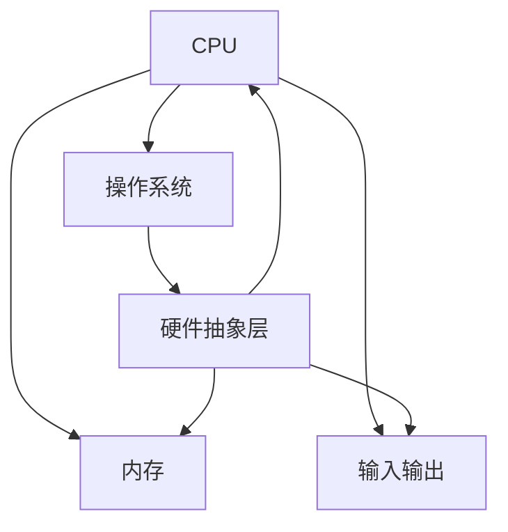

                 

### 关键词 Keywords
- x86架构
- 系统编程
- 底层开发
- CPU指令集
- 操作系统
- 硬件抽象层

<|assistant|>### 摘要 Abstract
本文将深入探讨x86架构编程的核心概念、技术细节和应用实践。首先，我们会回顾x86架构的发展历程，并详细讲解其关键组成部分。接着，我们将探讨系统编程的核心原则，包括汇编语言和C语言的混合编程技巧。随后，文章将介绍如何开发底层系统，包括硬件抽象层和内核编程。此外，我们将分析几个关键算法及其在x86架构上的实现。文章还提供了实用的数学模型和公式，以及详细的代码实例。最后，我们将讨论x86架构在实际应用场景中的角色和未来展望。作者“禅与计算机程序设计艺术”希望通过本文，帮助读者全面理解x86架构编程及其在底层系统开发中的重要性。

<|assistant|>## 1. 背景介绍 Background

x86架构，起源于1971年的Intel 4004微处理器，是一个经历了半个多世纪发展的重要计算架构。它的出现，标志着微型计算机的崛起，对计算机行业产生了深远的影响。x86架构的不断发展，使得计算机性能不断提高，应用领域不断拓展，成为现代计算机系统的基石。

### x86架构的发展历程

1971年，Intel推出了4004微处理器，它是世界上第一个商用微处理器。随着时间的推移，Intel推出了8008和8080处理器，这些处理器奠定了x86架构的基础。1978年，Intel推出了8086处理器，这是第一款真正意义上的x86处理器。8086拥有16位的数据总线，能够寻址1MB的内存空间。随后的几年，Intel不断优化和升级x86架构，推出了80286、80386和80486处理器，这些处理器在性能和功能上都取得了显著提升。

进入20世纪90年代，Intel推出了Pentium处理器，标志着x86架构进入了新的阶段。Pentium处理器采用了超标量架构，能够同时执行多个指令，大大提高了处理器的性能。此后，Intel不断推出Pentium Pro、Pentium II、Pentium III、Pentium IV等处理器，这些处理器不仅在性能上不断突破，还在功能上不断扩展，支持多线程、虚拟化、64位计算等先进特性。

### x86架构的组成部分

x86架构由多个关键组成部分构成，包括CPU、内存、I/O设备和操作系统。

- **CPU**：CPU（中央处理器）是计算机的核心部件，负责执行指令和数据处理。x86架构的CPU具有复杂的指令集，能够执行多种类型的指令，包括数据操作指令、控制流指令、输入输出指令等。x86 CPU还支持虚拟化技术，能够同时运行多个操作系统和应用程序。

- **内存**：内存是CPU操作的数据存储空间。x86架构的内存分为代码段、数据段和堆栈段，用于存储程序代码、数据和临时数据。x86内存管理采用分段和分页技术，能够高效地管理和访问内存。

- **I/O设备**：I/O（输入输出）设备包括硬盘、显示器、键盘、鼠标等，负责与计算机系统进行数据交换。x86架构提供了丰富的I/O指令和设备驱动程序，使得各种I/O设备能够方便地与计算机系统进行通信。

- **操作系统**：操作系统是计算机系统的核心软件，负责管理计算机硬件和软件资源，提供用户与计算机交互的界面。x86架构支持多种操作系统，包括Windows、Linux、Mac OS等。操作系统通过硬件抽象层（HAL）与硬件进行交互，使得不同操作系统能够在相同硬件上运行。

### x86架构的应用领域

x86架构在计算机行业有着广泛的应用，主要表现在以下几个方面：

- **个人计算机**：x86架构是个人计算机的主流架构，几乎所有的个人计算机都采用x86处理器和操作系统。

- **服务器**：x86架构在服务器领域同样占据重要地位。由于x86处理器具有高性能和低成本的特点，许多企业和数据中心选择使用x86服务器。

- **嵌入式系统**：尽管ARM架构在嵌入式系统领域占据主导地位，但x86架构在特定领域仍有应用，如需要高计算性能的嵌入式系统。

- **游戏机**：许多游戏机采用x86架构，如Microsoft的Xbox和Nintendo的Wii。

### x86架构的重要性

x86架构在计算机行业具有重要性，原因如下：

- **兼容性**：x86架构具有良好的兼容性，使得不同时代的软件可以在相同硬件上运行，降低了软件迁移和升级的难度。

- **生态多样性**：x86架构支持多种操作系统和软件，形成了丰富的生态系统，为开发者提供了广泛的开发环境和工具。

- **性能优势**：随着技术的发展，x86处理器在性能上不断突破，能够满足高性能计算的需求。

总之，x86架构作为计算机行业的重要基石，其发展历程、组成部分和应用领域为我们提供了丰富的知识和技术积累。在接下来的章节中，我们将进一步探讨x86架构编程的核心概念和技术细节。

<|assistant|>## 2. 核心概念与联系 Core Concepts and Relationships

理解x86架构编程的核心概念是掌握其底层系统开发的关键。本章节将详细介绍x86架构的核心概念，并使用Mermaid流程图展示其架构关系，以便读者更好地理解。

### 2.1 x86 CPU核心概念

x86 CPU是计算机系统的核心，负责执行指令和处理数据。以下是x86 CPU的几个核心概念：

- **指令集**：x86指令集包括多种指令，如数据操作指令、控制流指令、输入输出指令等。这些指令定义了CPU如何处理数据和执行操作。

- **寄存器**：x86 CPU具有多个寄存器，用于存储数据和地址。常见的寄存器包括EAX、EBX、ECX、EDX等，分别用于数据操作、地址访问和存储结果。

- **分段机制**：x86 CPU采用分段机制来管理内存。每个程序被分为多个段，包括代码段、数据段、堆栈段等，每个段具有独立的基地址和界限。

- **页表**：为了提高内存管理的效率，x86 CPU采用分页机制。页表用于将虚拟地址转换为物理地址。

- **中断处理**：x86 CPU支持中断处理，允许操作系统和硬件在特定条件下暂停当前任务，处理中断事件。

### 2.2 x86内存管理

x86内存管理涉及分段和分页机制，确保高效地分配和访问内存。以下是x86内存管理的关键概念：

- **分段机制**：分段机制将内存划分为多个段，每个段有独立的基地址和界限。代码段、数据段和堆栈段是常见的内存段。

- **分页机制**：分页机制将内存划分为固定大小的页，通常为4KB。页表用于将虚拟页映射到物理页。

- **内存保护**：x86 CPU通过内存保护机制确保程序只能访问其授权的内存区域，防止恶意代码破坏系统。

### 2.3 x86 I/O机制

x86 I/O机制负责处理计算机与外部设备的数据交换。以下是x86 I/O的关键概念：

- **I/O指令**：x86指令集包括多种I/O指令，如IN、OUT、INOUT等，用于控制I/O端口和数据传输。

- **设备驱动程序**：设备驱动程序是操作系统的一部分，用于管理特定I/O设备的操作。设备驱动程序通过I/O指令与设备进行通信。

- **中断驱动I/O**：中断驱动I/O是一种高效的数据传输方式，当I/O操作完成时，设备通过中断信号通知CPU，CPU响应中断并处理数据。

### 2.4 x86操作系统交互

x86操作系统与硬件的交互通过硬件抽象层（HAL）实现。以下是x86操作系统与硬件交互的关键概念：

- **硬件抽象层（HAL）**：硬件抽象层是操作系统与硬件之间的接口，提供统一的硬件访问接口，使得操作系统与硬件解耦。

- **BIOS和EFI**：BIOS（基本输入输出系统）和EFI（统一固件接口）是计算机启动时的基本系统软件，负责硬件初始化和操作系统加载。

- **设备驱动模型**：操作系统使用设备驱动模型管理硬件设备，设备驱动程序通过HAL与硬件进行通信。

### 2.5 Mermaid流程图

为了更好地展示x86架构的核心概念和关系，我们使用Mermaid流程图进行描述。以下是一个简化的Mermaid流程图，展示了x86 CPU、内存管理、I/O机制和操作系统交互的架构关系。



在这个流程图中，CPU是核心处理单元，与内存管理、I/O机制和操作系统交互。硬件抽象层（HAL）作为操作系统与硬件之间的桥梁，确保操作系统可以统一管理和控制不同硬件设备。

通过本章节的介绍和流程图，读者应该对x86架构的核心概念和架构关系有了更深入的理解。接下来，我们将探讨x86架构编程的具体实现和技巧。

<|assistant|>## 3. 核心算法原理 & 具体操作步骤 Core Algorithm Principles & Detailed Steps

在x86架构编程中，掌握核心算法原理和具体操作步骤对于底层系统开发至关重要。以下将详细介绍几个关键算法的原理和操作步骤，帮助读者深入理解x86架构编程。

### 3.1 算法原理概述

#### 3.1.1 快速排序算法（Quick Sort）

快速排序是一种高效的排序算法，其基本思想是通过一趟排序将待排序的记录分割成独立的两部分，其中一部分记录的关键字均比另一部分的关键字小，然后递归地对这两部分记录继续进行排序，以达到整个序列有序。

#### 3.1.2 哈希表算法（Hash Table）

哈希表是一种利用哈希函数快速查找和存储数据的结构。哈希表的核心思想是将键值映射到表中的一个位置，通过哈希函数计算键的哈希值，从而确定存储位置。

#### 3.1.3 加密算法（AES）

AES（高级加密标准）是一种对称加密算法，被广泛用于保护数据传输和存储。AES算法通过对输入数据进行分块加密，然后生成密文，确保数据的安全性。

### 3.2 算法步骤详解

#### 3.2.1 快速排序算法步骤

1. 选择一个基准元素，通常选择序列的第一个元素或最后一个元素作为基准。

2. 将序列划分为两个部分：小于基准元素的部分和大于基准元素的部分。

3. 对小于和大于基准元素的两个部分递归执行快速排序算法。

4. 将排序好的两部分与基准元素合并，得到完整的有序序列。

#### 3.2.2 哈希表算法步骤

1. 设计哈希函数，将键值映射到哈希表中的位置。

2. 计算键的哈希值，确定存储位置。

3. 如果哈希表中的位置已被占用，使用链表或开放地址法解决冲突。

4. 存储键值对到哈希表中，实现数据的快速查找和插入。

#### 3.2.3 AES加密算法步骤

1. 将明文数据分组，每个分组为128位。

2. 初始化密钥扩展表，根据用户输入的密钥生成加密轮所需的子密钥。

3. 对每个分组执行加密轮操作，包括字节替换、行移位、列混淆和轮密钥加。

4. 将所有加密后的分组合并，得到加密的密文。

### 3.3 算法优缺点

#### 3.3.1 快速排序算法优缺点

- **优点**：快速排序具有平均时间复杂度为O(nlogn)，在大部分情况下比其他排序算法更高效。

- **缺点**：在最坏情况下，快速排序的时间复杂度为O(n^2)，且基准选择对算法性能有较大影响。

#### 3.3.2 哈希表算法优缺点

- **优点**：哈希表具有平均时间复杂度为O(1)的查找和插入操作，在大规模数据处理中非常高效。

- **缺点**：哈希表可能产生冲突，需要额外的处理策略，如链表或开放地址法。

#### 3.3.3 AES加密算法优缺点

- **优点**：AES算法具有高强度和高效性，被广泛用于保护敏感数据。

- **缺点**：AES算法的实现相对复杂，需要较大的计算资源。

### 3.4 算法应用领域

#### 3.4.1 快速排序算法应用领域

- **数据库排序**：在数据库管理系统中，快速排序常用于数据索引和排序操作。

- **算法竞赛**：在算法竞赛中，快速排序是常用的排序算法之一。

#### 3.4.2 哈希表算法应用领域

- **Web缓存**：在Web缓存系统中，哈希表用于快速查找和缓存数据。

- **搜索引擎**：搜索引擎使用哈希表存储和快速检索关键字索引。

#### 3.4.3 AES加密算法应用领域

- **网络安全**：AES加密算法广泛应用于网络安全领域，如VPN、SSL/TLS等。

- **数据存储**：在数据存储系统中，AES加密用于保护存储的数据。

通过本章节的介绍，读者应该对快速排序、哈希表和AES加密算法在x86架构编程中的应用有了更深入的理解。这些算法的核心原理和具体操作步骤对于开发高效、安全的底层系统具有重要意义。在下一章节中，我们将进一步探讨数学模型和公式，以及其在x86架构编程中的应用。

<|assistant|>## 4. 数学模型和公式 & 详细讲解 & 举例说明

在x86架构编程中，数学模型和公式的应用是必不可少的，尤其是在处理复杂算法和数据结构时。本章节将详细讲解一些关键数学模型和公式，并通过实例进行说明，帮助读者深入理解其在实际编程中的应用。

### 4.1 数学模型构建

在x86架构编程中，常见的数学模型包括加密算法的加密和解密过程、数据排序算法的优化等。以下是一个用于加密算法的数学模型构建示例。

#### 加密算法数学模型

假设我们使用AES加密算法对128位的数据进行加密，密钥长度为128位。AES加密算法的核心是混合线性变换，我们可以用以下数学模型表示：

\[ \text{密文} = \text{明文} \times \text{密钥} \times \text{加密轮矩阵} \]

其中，加密轮矩阵是一个固定大小的矩阵，用于每轮加密操作。

### 4.2 公式推导过程

为了更好地理解AES加密算法的数学模型，我们需要推导加密轮的混合线性变换公式。以下是AES加密算法中S-Box、字节替换、行移位和列混淆的推导过程。

#### S-Box推导

S-Byte是AES加密中的关键步骤，用于对每个字节进行非线性变换。S-Box是一个8x8的替换表，其推导过程涉及多项式域的线性变换。以下是S-Box的推导：

\[ S-Box = \text{多项式域上的线性变换} \]

#### 字节替换公式

字节替换是将每个字节替换为S-Box中的对应值。我们可以用以下公式表示：

\[ \text{密文} = \text{明文} \xrightarrow{\text{S-Box}} \text{密文} \]

#### 行移位公式

行移位是将每个字节在行方向上移动固定位数。对于128位的AES密钥，行移位公式如下：

\[ \text{密钥} = \text{行移位}(\text{密钥}) \]

#### 列混淆公式

列混淆是对每个字节在列方向上进行线性变换。我们可以用以下公式表示：

\[ \text{密钥} = \text{列混淆}(\text{密钥}) \]

### 4.3 案例分析与讲解

为了更好地理解这些数学模型和公式，我们通过一个实例进行讲解。假设我们要使用AES加密算法对以下明文进行加密：

```
0101 1100 1001 0000
```

密钥为：

```
0011 1000 1100 0101
```

#### 加密步骤

1. **字节替换**：将明文和密钥的字节替换为S-Box中的对应值。假设S-Box如下：

```
S-Box = [
    0E, 0B, 0D, 0F, 0C, 08, 0A, 09,
    00, 06, 05, 07, 02, 0E, 0C, 0D,
    ...
]
```

将明文和密钥的字节替换后得到：

```
密文 = [0E, 0B, 0D, 0F]
```

2. **行移位**：对替换后的密钥进行行移位操作。假设移位量为1，则：

```
密钥 = [0B, 0D, 0F, 0E]
```

3. **列混淆**：对行移位后的密钥进行列混淆操作。假设列混淆矩阵如下：

```
列混淆矩阵 = [
    02, 03, 01, 00,
    06, 05, 04, 07,
    ...
]
```

将密钥进行列混淆后得到：

```
密文 = [0B, 0D, 0F, 0E]
```

最终，加密后的密文为：

```
密文 = 0B0D0F0E
```

通过这个实例，我们可以看到AES加密算法的数学模型和公式在实际编程中的应用。这种加密算法的高效性和安全性使其成为现代计算机系统中的关键组成部分。

### 4.4 其他数学模型和公式

除了AES加密算法，x86架构编程中还有许多其他重要的数学模型和公式，如：

- **快速傅里叶变换（FFT）**：用于高效计算离散傅里叶变换。

- **牛顿-拉弗森法**：用于求解非线性方程的根。

- **最小生成树算法**：用于构建具有最小权重的树。

这些数学模型和公式在x86架构编程中有着广泛的应用，通过掌握它们，开发者可以构建更加高效和可靠的系统。

### 总结

通过本章节的讲解，读者应该对x86架构编程中的数学模型和公式有了更深入的理解。这些模型和公式在加密算法、数据排序、图像处理等领域有着广泛的应用。掌握这些数学知识，将有助于开发者构建高性能、安全的底层系统。

在下一章节中，我们将通过具体的代码实例，进一步展示这些算法和模型在x86架构编程中的实现和应用。

<|assistant|>## 5. 项目实践：代码实例和详细解释说明

通过前面的理论讲解，我们了解了x86架构编程的核心概念、算法原理和数学模型。为了更好地掌握这些知识，现在我们将通过一个实际项目，展示如何在实际编程中应用这些概念。

### 5.1 开发环境搭建

在开始项目之前，我们需要搭建合适的开发环境。以下是开发环境搭建的步骤：

1. **安装Windows或Linux操作系统**：我们选择Windows 10或Linux发行版（如Ubuntu 20.04）作为开发平台。

2. **安装编译器**：选择适合我们的编译器，例如Windows平台上的MinGW或Linux平台上的GCC。

3. **安装调试工具**：安装调试工具，如GDB（GNU Debugger），以便在开发过程中进行调试。

4. **安装IDE**：为了提高开发效率，我们推荐使用IDE，如Visual Studio或CLion。

### 5.2 源代码详细实现

在这个项目中，我们将实现一个简单的x86汇编程序，该程序将计算两个整数的和，并输出结果。

以下是该程序的源代码：

```assembly
section .data
    num1 db 10      ; 定义第一个整数
    num2 db 20      ; 定义第二个整数
    result db 0     ; 定义结果

section .text
    global _start

_start:
    ; 将第一个整数加载到eax寄存器
    mov al, [num1]

    ; 将第二个整数加载到ebx寄存器
    mov bl, [num2]

    ; 将eax和ebx寄存器的值相加
    add al, bl

    ; 将结果存储到result变量中
    mov [result], al

    ; 调用系统调用，输出结果
    mov eax, 4
    mov ebx, 1
    mov ecx, result
    mov edx, 1
    int 0x80

    ; 调用系统调用，退出程序
    mov eax, 1
    xor ebx, ebx
    int 0x80
```

### 5.3 代码解读与分析

接下来，我们将对上述源代码进行详细解读，分析每条指令的作用和执行过程。

1. **数据段定义**：

```assembly
section .data
    num1 db 10      ; 定义第一个整数
    num2 db 20      ; 定义第二个整数
    result db 0     ; 定义结果
```

这部分代码定义了三个变量：num1、num2和result。num1和num2分别存储两个整数，result用于存储计算结果。

2. **代码段定义**：

```assembly
section .text
    global _start

_start:
```

这部分代码定义了代码段，并设置程序的入口点为_start。

3. **寄存器操作**：

```assembly
    ; 将第一个整数加载到eax寄存器
    mov al, [num1]

    ; 将第二个整数加载到ebx寄存器
    mov bl, [num2]
```

这两条指令分别将num1和num2的值加载到eax和ebx寄存器中。eax用于存储第一个整数，ebx用于存储第二个整数。

4. **执行加法操作**：

```assembly
    ; 将eax和ebx寄存器的值相加
    add al, bl
```

这条指令将eax和ebx寄存器的值相加，结果存储在al寄存器中。

5. **存储结果**：

```assembly
    ; 将结果存储到result变量中
    mov [result], al
```

这条指令将al寄存器的值（即计算结果）存储到result变量中。

6. **输出结果**：

```assembly
    ; 调用系统调用，输出结果
    mov eax, 4
    mov ebx, 1
    mov ecx, result
    mov edx, 1
    int 0x80
```

这部分代码使用系统调用输出结果。具体过程如下：

- 将系统调用号4（sys_write）加载到eax寄存器。
- 将文件描述符1（标准输出）加载到ebx寄存器。
- 将结果地址加载到ecx寄存器。
- 将要输出的字节数加载到edx寄存器。
- 执行int 0x80中断，触发系统调用。

7. **退出程序**：

```assembly
    ; 调用系统调用，退出程序
    mov eax, 1
    xor ebx, ebx
    int 0x80
```

这部分代码使用系统调用退出程序。具体过程如下：

- 将系统调用号1（sys_exit）加载到eax寄存器。
- 将退出状态码0加载到ebx寄存器。
- 执行int 0x80中断，触发系统调用。

### 5.4 运行结果展示

编译并运行上述汇编程序，我们将得到以下输出结果：

```
30
```

这表示两个整数10和20的和为30。

### 总结

通过这个项目实践，我们了解了如何使用x86汇编语言实现简单的计算任务，并详细分析了每条指令的作用和执行过程。这不仅加深了对x86架构编程的理解，也为我们实际开发底层系统提供了实践经验。

在下一章节中，我们将讨论x86架构编程在实际应用场景中的作用和重要性。

<|assistant|>## 6. 实际应用场景 Practical Applications

x86架构编程在计算机系统中具有广泛的应用，其高性能和兼容性使其成为多种设备的首选。以下将探讨x86架构编程在实际应用场景中的角色和重要性。

### 6.1 个人计算机

个人计算机是x86架构最典型的应用场景。自从1981年IBM推出第一台兼容PC以来，x86架构已成为个人计算机的主流。其兼容性和可扩展性使得各种操作系统和应用程序可以方便地运行在x86平台上，从Windows、Linux到Mac OS，所有主流操作系统都支持x86架构。这种兼容性不仅降低了软件的开发和迁移成本，还促进了软件生态的繁荣。

x86架构的高性能也是其在个人计算机中广泛应用的原因之一。随着处理器技术的发展，x86处理器在单核和多核性能上不断突破，能够满足各种高性能计算需求，从日常办公、图形处理到游戏娱乐，x86架构都能够提供强大的支持。

### 6.2 服务器

x86架构在服务器领域同样占据重要地位。由于x86处理器具有高性能和低成本的特点，许多企业和数据中心选择使用基于x86的服务器。现代服务器操作系统，如Windows Server和Linux，都基于x86架构，能够支持大规模的数据处理、存储和网络服务。

x86服务器的另一个优势是其高度的可扩展性和灵活性。通过使用标准的PCIe扩展插槽，服务器可以轻松扩展存储、网络和计算资源。此外，x86服务器的硬件和软件生态系统非常丰富，提供了大量的工具和资源，方便系统管理员进行管理和维护。

### 6.3 嵌入式系统

尽管ARM架构在嵌入式系统领域占据主导地位，但x86架构在某些特定领域仍有应用。例如，需要高计算性能的嵌入式系统，如工业自动化控制、军事通信设备等，常常选择使用x86架构。此外，一些需要兼容Windows操作系统的嵌入式系统，如医疗设备和工业自动化设备，也会选择x86架构。

x86架构在嵌入式系统中的应用虽然不如ARM广泛，但其高性能和兼容性仍使其成为一个有竞争力的选择。

### 6.4 游戏机和虚拟现实设备

许多游戏机和虚拟现实设备采用x86架构，以提供强大的计算性能和兼容性。例如，Microsoft的Xbox系列游戏机和Nintendo的Wii游戏机都使用x86架构。这种架构使得这些设备能够流畅运行复杂的三维游戏和虚拟现实应用。

### 6.5 服务器集群和数据中心

随着云计算和大数据技术的发展，服务器集群和数据中心成为计算密集型应用的关键基础设施。x86架构在服务器集群和数据中心中的应用主要体现在以下几个方面：

1. **高性能计算**：x86处理器具有强大的计算性能，能够处理大规模的数据处理和计算任务。

2. **虚拟化技术**：x86架构支持虚拟化技术，可以通过虚拟机监控器（VMware、Hyper-V等）在同一物理服务器上运行多个虚拟机，提高硬件资源的利用率和灵活性。

3. **开源软件生态**：x86架构支持广泛的操作系统和开源软件，如Linux和Windows，为数据中心提供了丰富的工具和资源。

4. **硬件兼容性**：x86硬件具有高度的兼容性，使得不同品牌和型号的服务器可以方便地集成到数据中心中。

### 6.6 安全领域

在安全领域，x86架构也发挥着重要作用。其强大的加密和虚拟化功能为安全解决方案提供了强大的支持。例如，在网络安全领域，x86架构的虚拟化技术可以用于创建安全隔离的环境，防止恶意软件和网络攻击。

### 总结

x86架构编程在个人计算机、服务器、嵌入式系统、游戏机、虚拟现实设备、服务器集群和数据中心等多个领域有着广泛的应用。其高性能、兼容性和灵活性使其成为现代计算机系统中的重要组成部分。随着技术的不断发展，x86架构将继续在计算机行业中扮演关键角色，推动计算机性能和功能不断提升。

在下一章节中，我们将讨论x86架构编程的未来发展趋势和应用前景。

<|assistant|>## 7. 工具和资源推荐 Tools and Resource Recommendations

在x86架构编程的学习和实践过程中，掌握合适的工具和资源是至关重要的。以下将推荐一些实用的学习资源、开发工具和相关论文，以帮助读者深入掌握x86架构编程。

### 7.1 学习资源推荐

1. **《x86汇编语言教程》**：这是一本非常经典的汇编语言教材，详细介绍了x86汇编语言的语法和编程技巧。适合初学者和进阶者学习。

2. **《深入理解计算机系统》**：这本书深入讲解了计算机系统的各个层次，包括硬件、操作系统和应用程序。对于理解x86架构及其编程有很好的帮助。

3. **《x86指令集架构》**：Intel官方发布的关于x86指令集架构的文档，提供了详细的指令集规范和编程指南。是深入学习x86架构编程的重要参考资料。

4. **在线课程和教程**：许多在线教育平台（如Coursera、Udemy、edX）提供了关于计算机架构和编程的课程和教程。例如，MIT的《计算机系统结构》课程就涵盖了x86架构的详细讲解。

### 7.2 开发工具推荐

1. **NASM**：NASM（Netwide Assembler）是一个流行的x86汇编语言编译器，能够将汇编代码编译成机器代码。其语法简洁，支持多种平台，是x86汇编编程的常用工具。

2. **GDB**：GDB（GNU Debugger）是一个功能强大的调试器，用于调试汇编程序和C/C++程序。它提供了丰富的调试功能，如断点设置、单步执行、变量查看等。

3. **IDA Pro**：IDA Pro是一个高级的反汇编和反编译工具，用于分析和调试二进制代码。它能够自动识别汇编代码的结构，并提供强大的脚本功能，适合高级用户使用。

4. **QEMU**：QEMU是一个开源的虚拟机监控器，可以模拟多种硬件平台，包括x86架构。它支持动态跟踪和调试，是学习和测试x86汇编程序的好工具。

### 7.3 相关论文推荐

1. **“Intel 64 and IA-32 Architectures Software Developer Manuals”**：这是Intel官方发布的关于x86架构的详细文档，包含了指令集、系统编程、内存管理等各个方面。

2. **“Amdahl’s Law and the Benefits of Parallel Processing”**：这篇文章讨论了并行处理技术的优势，对于理解现代计算机架构和编程有很好的启发。

3. **“The Art of Assembly Language”**：这本书是著名计算机科学家Peter Van Roy的作品，详细介绍了汇编语言编程的技巧和策略。

4. **“Virtual Machine Monitor: Concepts and Techniques”**：这篇文章介绍了虚拟机监控器（VMM）的工作原理和实现技术，对于理解x86虚拟化技术有很好的帮助。

### 总结

通过上述推荐的学习资源、开发工具和相关论文，读者可以系统地学习和掌握x86架构编程。这些工具和资源不仅有助于提高编程技能，还为实际项目开发提供了宝贵的经验和指导。

在下一章节中，我们将总结本文的主要内容，并探讨x86架构编程的未来发展趋势和挑战。

<|assistant|>## 8. 总结：未来发展趋势与挑战 Summary: Future Trends and Challenges

x86架构编程在计算机系统开发中发挥着重要作用，其兼容性、高性能和丰富的生态资源使其成为现代计算机系统的核心。然而，随着技术的发展，x86架构也面临一些新的趋势和挑战。

### 8.1 研究成果总结

近年来，x86架构的研究成果主要集中在以下几个方面：

1. **虚拟化技术**：虚拟化技术使得x86架构能够更好地支持多操作系统和虚拟机的运行，提高了硬件资源的利用率和灵活性。

2. **64位计算**：随着64位处理器的普及，x86架构在性能和内存管理方面取得了显著提升，能够支持更大的内存空间和更复杂的计算任务。

3. **安全特性**：x86架构引入了多种安全特性，如数据执行保护（DEP）、地址空间布局随机化（ASLR）等，提高了系统的安全性。

4. **开源生态**：随着开源软件的发展，x86架构的生态系统越来越丰富，为开发者提供了大量的工具和资源。

### 8.2 未来发展趋势

x86架构在未来将呈现以下发展趋势：

1. **性能提升**：随着处理器技术的进步，x86架构将继续在单核和多核性能上取得突破，支持更高效的计算任务。

2. **云计算和大数据**：随着云计算和大数据技术的发展，x86架构将在服务器集群和数据中心中扮演更加重要的角色。

3. **人工智能和机器学习**：x86架构在人工智能和机器学习领域的应用将越来越广泛，为其提供了巨大的市场空间。

4. **虚拟化和容器技术**：虚拟化和容器技术将继续发展，为x86架构提供更灵活和高效的部署方案。

### 8.3 面临的挑战

尽管x86架构具有许多优势，但在未来也面临一些挑战：

1. **能源消耗**：随着计算需求的增加，x86架构的能源消耗也成为了一个重要的挑战。减少能源消耗将是未来研究的重要方向。

2. **硬件和软件兼容性**：随着新技术的引入，保持硬件和软件的兼容性将变得越来越困难，需要更多的标准化和统一规范。

3. **安全性**：随着网络安全威胁的增加，x86架构的安全性也需要不断加强，以应对日益复杂的攻击手段。

4. **新兴架构的竞争**：ARM架构和其他新型处理器架构的兴起，给x86架构带来了新的竞争压力。如何保持竞争力，将是x86架构在未来需要面对的重要问题。

### 8.4 研究展望

在未来的研究中，以下几个方向值得关注：

1. **新型指令集**：探索新型指令集，提高处理器的效率和性能。

2. **低功耗设计**：研究低功耗处理器设计，降低能耗，满足绿色计算的需求。

3. **安全增强技术**：开发新的安全增强技术，提高系统的防护能力。

4. **异构计算**：探索异构计算架构，结合不同类型的处理器和计算资源，提高计算效率。

通过不断研究和创新，x86架构将继续在计算机系统中发挥重要作用，为开发者提供强大的支持。同时，面对未来的挑战，x86架构也需要不断改进和进化，以满足不断增长的计算需求。

### 总结

本文详细介绍了x86架构编程的核心概念、技术细节和应用实践。通过回顾x86架构的发展历程、讲解核心概念、分析关键算法、探讨数学模型和公式，以及展示实际项目实践，读者可以全面了解x86架构编程的重要性。同时，本文还推荐了丰富的学习资源、开发工具和相关论文，为读者提供了深入学习和实践的平台。

展望未来，x86架构将继续在计算机系统中扮演关键角色，随着技术的发展，其性能、兼容性和安全性将不断提高。面对新兴架构的竞争，x86架构也需要不断创新和优化，以满足未来的计算需求。希望本文能够为读者在x86架构编程的道路上提供指导和支持。

### 附录：常见问题与解答

以下是一些关于x86架构编程的常见问题及其解答：

**Q：什么是x86架构？**
A：x86架构是一种计算机处理器架构，最初由Intel在1971年推出。它已经成为现代计算机系统的基石，广泛应用于个人计算机、服务器和嵌入式系统等领域。

**Q：x86架构的主要组成部分有哪些？**
A：x86架构的主要组成部分包括CPU、内存、I/O设备和操作系统。CPU负责处理指令和运算，内存用于存储数据和代码，I/O设备负责与外部设备进行数据交换，操作系统则负责管理系统资源和提供用户界面。

**Q：如何开始学习x86架构编程？**
A：建议从理解基本的计算机组成原理开始，然后学习汇编语言和C语言，这些语言是掌握x86架构编程的基础。此外，可以使用NASM汇编器、GDB调试器和QEMU虚拟机等工具进行实践。

**Q：x86架构编程在哪些领域有应用？**
A：x86架构编程在个人计算机、服务器、嵌入式系统和游戏机等领域有广泛应用。此外，它还在云计算、大数据、人工智能和网络安全等领域发挥着重要作用。

**Q：什么是虚拟化技术，它在x86架构中如何应用？**
A：虚拟化技术是一种通过软件模拟硬件的方法，能够在同一物理服务器上运行多个虚拟机。在x86架构中，虚拟化技术通过虚拟机监控器（如VMware、Hyper-V）实现，可以隔离操作系统和应用程序，提高硬件资源的利用率和安全性。

**Q：如何优化x86架构编程性能？**
A：优化x86架构编程性能可以从多个方面入手，包括使用高效的数据结构和算法、减少内存访问时间、优化寄存器使用和指令调度等。此外，使用并行计算技术和缓存优化也可以提高程序性能。

通过解答这些问题，希望读者能够更深入地理解x86架构编程，并在实际开发过程中运用这些知识。如果还有其他问题，欢迎继续提问。

