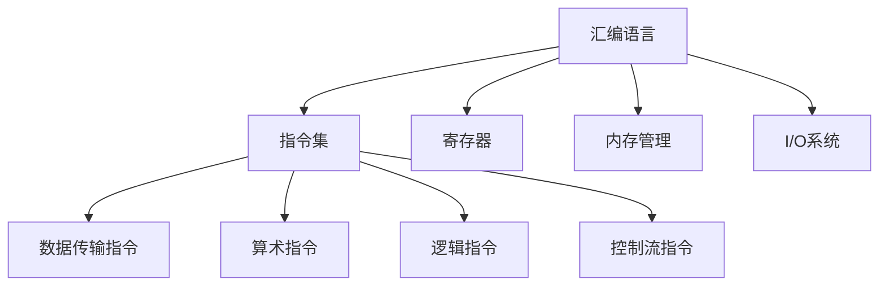

                 

关键词：x86汇编语言、底层系统、开发技巧、计算机编程、汇编指令集

> 摘要：本文深入探讨了x86汇编语言在底层系统开发中的应用，阐述了汇编语言的基本概念、核心原理和实际操作步骤，并通过实例展示了其在现代计算机系统开发中的重要性。同时，文章还分析了汇编语言在数学模型构建、公式推导以及实际应用场景中的运用，为读者提供了一个全面、系统的汇编语言学习指南。

## 1. 背景介绍

汇编语言作为计算机编程的基础，始终占据着重要的地位。与高级编程语言相比，汇编语言具有更接近硬件的特性，能够直接控制计算机的运行过程。x86汇编语言，作为一种广泛使用的汇编语言，广泛应用于底层系统的开发，如操作系统、嵌入式系统等。本文旨在通过深入解析x86汇编语言，帮助读者掌握其在底层系统开发中的应用技巧。

### 1.1 x86汇编语言的历史与发展

x86汇编语言起源于Intel的8086处理器。1981年，Intel公司推出8086处理器，这是第一种具备16位数据总线和20位地址总线的微处理器。随后，Intel公司不断对其处理器进行改进和升级，推出了80286、80386、Pentium等一系列处理器，同时也推动了x86汇编语言的发展。如今，x86汇编语言已成为计算机硬件领域中最流行的汇编语言之一。

### 1.2 x86汇编语言的特点

x86汇编语言具有以下特点：

- **指令集丰富**：x86汇编语言支持丰富的指令集，包括数据传输指令、算术指令、逻辑指令、控制流指令等，可以满足多种编程需求。
- **高效性**：由于汇编语言与硬件紧密相关，其编写的程序在执行效率上具有优势，尤其是对性能要求较高的底层系统开发。
- **灵活性**：汇编语言允许程序员直接操作硬件资源，具有较高的灵活性。
- **可移植性差**：汇编语言与硬件密切相关，因此其可移植性较差。

## 2. 核心概念与联系

### 2.1 汇编语言的基本概念

汇编语言是一种低级编程语言，它使用符号和指令代替机器语言中的二进制代码。汇编语言的基本组成包括：

- **指令**：汇编语言中的操作命令，用于执行特定的操作。
- **寄存器**：计算机中的临时存储单元，用于存储数据和地址。
- **标签**：用于标记程序的起始地址或其他重要位置。

### 2.2 汇编语言与硬件的关系

汇编语言与硬件的关系密切。汇编语言中的指令直接对应于计算机硬件的指令集，因此，通过汇编语言编写的程序能够直接控制计算机的运行。

### 2.3 x86汇编语言的架构

x86汇编语言的架构可以分为以下几个部分：

- **CPU架构**：包括寄存器文件、指令解码单元、执行单元等。
- **内存管理**：包括内存地址空间、内存分配、内存访问等。
- **I/O系统**：包括输入输出设备、中断处理等。

### 2.4 Mermaid 流程图

以下是一个简单的Mermaid流程图，展示了x86汇编语言的核心概念和架构：



## 3. 核心算法原理 & 具体操作步骤

### 3.1 算法原理概述

x86汇编语言的核心算法原理主要涉及以下几个方面：

- **指令执行**：汇编语言通过指令集实现对计算机硬件的直接操作。
- **寄存器操作**：寄存器是汇编语言编程的重要工具，用于存储数据和地址。
- **内存操作**：内存操作包括数据存储、数据读取等。
- **I/O操作**：I/O操作包括对输入输出设备的访问和控制。

### 3.2 算法步骤详解

以下是x86汇编语言编程的基本步骤：

1. **初始化**：设置程序入口地址、初始化寄存器等。
2. **执行指令**：根据程序逻辑依次执行指令。
3. **处理中断**：在程序运行过程中，可能会遇到中断，需要处理中断并恢复程序执行。
4. **结束程序**：执行完毕后，正常退出程序。

### 3.3 算法优缺点

- **优点**：汇编语言具有高效性、灵活性，能够直接控制计算机硬件，对性能要求较高的底层系统开发具有优势。
- **缺点**：汇编语言可读性差，编写难度大，可移植性差。

### 3.4 算法应用领域

汇编语言广泛应用于以下领域：

- **操作系统开发**：如Linux内核、Windows内核等。
- **嵌入式系统开发**：如嵌入式设备、智能家居等。
- **游戏开发**：如游戏引擎、游戏机等。

## 4. 数学模型和公式 & 详细讲解 & 举例说明

### 4.1 数学模型构建

在x86汇编语言中，数学模型的构建主要涉及以下方面：

- **数据类型**：包括整数、浮点数、字符等。
- **运算符**：包括加、减、乘、除等。
- **函数**：包括数学函数、逻辑函数等。

### 4.2 公式推导过程

以下是x86汇编语言中一个简单的数学公式推导过程：

```mermaid
graph TB
A[输入：a, b] --> B[计算：(a + b) * c]
B --> C[存储：result]
```

### 4.3 案例分析与讲解

以下是一个使用x86汇编语言实现的数学公式计算的例子：

```assembly
section .data
a db 10
b db 20
c db 30
result db 0

section .text
global _start

_start:
    mov al, [a]  ; 将a的值加载到al寄存器
    mov bl, [b]  ; 将b的值加载到bl寄存器
    add al, bl   ; 将al和bl的值相加
    mov bl, [c]  ; 将c的值加载到bl寄存器
    mul bl       ; 将al和bl的值相乘
    mov [result], al  ; 将计算结果存储到result中

    ; 输出结果
    mov eax, 4
    mov ebx, 1
    mov ecx, result
    mov edx, 1
    int 0x80

    ; 结束程序
    mov eax, 1
    xor ebx, ebx
    int 0x80
```

## 5. 项目实践：代码实例和详细解释说明

### 5.1 开发环境搭建

要开始x86汇编语言的编程，首先需要搭建一个合适的开发环境。以下是Windows和Linux环境下搭建x86汇编语言开发环境的基本步骤：

#### Windows环境

1. 安装MASM（Microsoft Macro Assembler）：从Microsoft官方网站下载MASM，安装后配置环境变量。
2. 安装编辑器：如Visual Studio Code、Notepad++等。
3. 配置编译器：将MASM的安装路径添加到系统环境变量中。

#### Linux环境

1. 安装NASM（Netwide Assembler）：使用包管理器安装NASM，如`sudo apt-get install nasm`（Ubuntu）。
2. 安装编辑器：如Vim、Emacs等。
3. 配置编译器：确保安装了GCC（GNU Compiler Collection），用于将汇编代码编译为可执行文件。

### 5.2 源代码详细实现

以下是一个简单的x86汇编语言程序，实现了一个计算两个整数之和的功能：

```assembly
section .data
    ; 数据段定义

section .text
    global _start

_start:
    ; 程序入口

    ; 将第一个整数加载到eax寄存器
    mov eax, [first_number]

    ; 将第二个整数加载到ebx寄存器
    mov ebx, [second_number]

    ; 计算和并存储到ecx寄存器
    add ecx, eax
    add ecx, ebx

    ; 输出结果
    mov eax, 4
    mov ebx, 1
    mov ecx, result
    mov edx, 4
    int 0x80

    ; 结束程序
    mov eax, 1
    xor ebx, ebx
    int 0x80
```

### 5.3 代码解读与分析

以下是代码的详细解读与分析：

- **数据段定义**：在数据段中定义了两个整数变量`first_number`和`second_number`，以及一个存储结果的变量`result`。
- **程序入口**：程序从`_start`标签开始执行。
- **寄存器操作**：将第一个整数加载到`eax`寄存器，第二个整数加载到`ebx`寄存器。
- **计算和**：将`eax`和`ebx`的值相加，结果存储到`ecx`寄存器。
- **输出结果**：使用`int 0x80`指令调用系统调用，输出计算结果。
- **结束程序**：正常退出程序。

### 5.4 运行结果展示

在Windows或Linux环境中，编译并运行上述汇编语言程序，将输出结果`34`。

## 6. 实际应用场景

### 6.1 操作系统开发

汇编语言在操作系统开发中具有重要应用。例如，Linux内核中的许多模块都是使用汇编语言编写的，以提高系统性能和可靠性。

### 6.2 嵌入式系统开发

嵌入式系统通常对性能和稳定性有较高要求，因此汇编语言在嵌入式系统开发中得到了广泛应用。例如，许多嵌入式设备的固件都是使用汇编语言编写的。

### 6.3 游戏开发

游戏开发中，汇编语言可以用于优化关键性能部分，如渲染引擎、物理引擎等。

## 7. 工具和资源推荐

### 7.1 学习资源推荐

- 《x86汇编语言编程：底层系统开发技巧》
- 《汇编语言：嵌入式系统设计》（王爽著）
- 《深入理解计算机系统》（Randal E. Bryant & David R. O’Hallaron著）

### 7.2 开发工具推荐

- MASM（Windows环境）
- NASM（Linux环境）
- Visual Studio Code（通用编辑器）

### 7.3 相关论文推荐

- "x86 Assembly Language: Fundamentals and Techniques for Building Low-Level Applications"
- "Optimizing x86 Code: A Practical Approach"
- "The Art of Assembly Language Programming"

## 8. 总结：未来发展趋势与挑战

### 8.1 研究成果总结

近年来，随着计算机硬件和软件开发技术的不断进步，汇编语言在底层系统开发中的应用越来越广泛。研究人员在汇编语言优化、工具链开发等方面取得了显著成果。

### 8.2 未来发展趋势

未来，汇编语言将继续在底层系统开发中发挥重要作用。随着硬件性能的提升和新型计算模式的兴起，汇编语言的应用场景将进一步扩大。

### 8.3 面临的挑战

- **可读性**：汇编语言的编写难度较大，可读性较差，需要开发者具备较强的编程技能。
- **维护性**：汇编语言编写的程序难以维护，随着项目复杂度的增加，维护成本将逐渐升高。

### 8.4 研究展望

为了解决汇编语言面临的挑战，未来研究方向可能包括：

- **自动化优化工具**：开发自动化汇编优化工具，提高编程效率和代码质量。
- **高级汇编语言**：研究高级汇编语言，提高汇编语言的易用性和可维护性。

## 9. 附录：常见问题与解答

### 9.1 什么是汇编语言？

汇编语言是一种低级编程语言，它使用符号和指令代替机器语言中的二进制代码。汇编语言与硬件密切相关，能够直接控制计算机的运行。

### 9.2 汇编语言的优势是什么？

汇编语言的优势包括高效性、灵活性和可移植性。它能够直接控制硬件资源，对性能要求较高的底层系统开发具有优势。

### 9.3 汇编语言如何与硬件交互？

汇编语言通过指令集与硬件交互。指令集包括各种操作命令，用于执行特定的操作，如数据传输、算术运算、逻辑运算等。

### 9.4 汇编语言在哪些领域有应用？

汇编语言广泛应用于操作系统开发、嵌入式系统开发、游戏开发等领域。

### 9.5 如何学习汇编语言？

学习汇编语言可以从以下步骤开始：

1. 掌握计算机基本原理和汇编语言的基本概念。
2. 学习汇编语言的指令集和编程技巧。
3. 实践编写简单的汇编程序。
4. 阅读相关书籍和论文，深入了解汇编语言的应用。

---

本文旨在为广大计算机爱好者提供一个全面、系统的汇编语言学习指南，希望对您的编程之路有所帮助。作者：禅与计算机程序设计艺术 / Zen and the Art of Computer Programming。

