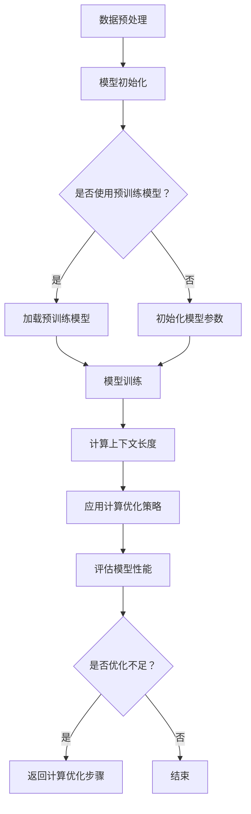

                 

关键词：自然语言处理、上下文理解、大模型、文本生成、计算机科学

摘要：本文深入探讨了自然语言处理领域中的上下文理解问题，并介绍了LLM（大语言模型）上下文长度的最新进展。通过对核心概念、算法原理、数学模型以及实际应用场景的详细解析，本文旨在为读者提供全面的技术视野，以应对未来语言模型在上下文延长方面的挑战和机遇。

## 1. 背景介绍

在自然语言处理（NLP）领域，上下文理解一直是研究的核心问题之一。传统NLP方法往往局限于处理孤立的句子或片段，而忽略了句子之间的联系和语境的影响。随着深度学习技术的飞速发展，特别是生成对抗网络（GAN）、递归神经网络（RNN）、Transformer模型等先进算法的出现，上下文理解能力得到了显著提升。

然而，即使是当前最先进的语言模型，如GPT-3、BERT等，其上下文长度仍然受到硬件资源和模型复杂度的限制。如何提升语言模型的上下文长度，使其能够更好地捕捉长篇文本的语义信息，是当前NLP研究的重要课题之一。

## 2. 核心概念与联系

### 2.1 语言模型基础

语言模型（Language Model, LM）是NLP中的基础组件，其核心目标是通过统计方法预测下一个单词或字符的概率分布。早期的语言模型如N-gram模型，通过计算词频或条件概率来预测单词。

$$
P(w_i | w_1, w_2, ..., w_{i-1}) = \frac{C(w_1, w_2, ..., w_i)}{C(w_1, w_2, ..., w_{i-1})}
$$

随着深度学习技术的发展，现代语言模型如Transformer，通过自注意力机制（Self-Attention）和多头注意力（Multi-Head Attention）能够更有效地捕捉长距离依赖关系。

### 2.2 上下文长度与扩展策略

上下文长度（Context Length）是指语言模型在处理输入文本时能够考虑的前后文信息长度。提升上下文长度对于增强语言模型的语义理解能力至关重要。

#### 2.2.1 模型架构扩展

- **自注意力机制**：通过增加注意力头的数量或维度，可以提升模型对上下文信息的捕捉能力。
- **深度扩展**：增加模型的层数，使其能够处理更长的序列。

#### 2.2.2 计算优化

- **并行计算**：通过分布式计算技术，将模型训练和推理任务分布在多台设备上，以减少计算时间。
- **量化技术**：使用低精度数值（如浮点16位）代替全精度浮点数，以减少内存占用和计算开销。

### 2.3 Mermaid流程图

以下是用于提升LLM上下文长度的Mermaid流程图：



## 3. 核心算法原理 & 具体操作步骤

### 3.1 算法原理概述

提升LLM上下文长度的核心算法主要基于以下原理：

- **注意力机制**：通过自注意力机制，模型可以自主地决定哪些信息更重要，从而提升上下文理解能力。
- **计算优化**：通过并行计算和量化技术，模型可以在保持高性能的同时，减少计算资源的需求。

### 3.2 算法步骤详解

#### 3.2.1 数据预处理

在提升上下文长度之前，首先需要对文本数据进行预处理，包括分词、去停用词、词向量化等步骤。

$$
\text{Tokenized Sentence} = \text{Tokenize}(Original Sentence)
$$

#### 3.2.2 模型初始化

初始化模型参数，可以选择使用预训练模型（如GPT-3、BERT等）作为起点，也可以从头开始训练。

#### 3.2.3 模型训练

使用预处理的文本数据对模型进行训练，通过反向传播和梯度下降优化模型参数。

$$
\text{Train Model} = \text{Optimizer}(Model, Loss Function, Training Data)
$$

#### 3.2.4 计算上下文长度

通过调整模型架构和计算优化策略，计算并优化模型的上下文长度。

#### 3.2.5 应用计算优化策略

根据具体硬件环境和需求，应用并行计算和量化技术，优化模型性能。

#### 3.2.6 评估模型性能

通过在验证集和测试集上的表现，评估模型提升后的上下文理解和生成能力。

### 3.3 算法优缺点

#### 优点：

- **增强语义理解**：更长的上下文长度有助于模型更好地捕捉语义信息，提高文本生成质量。
- **减少过拟合**：更长的上下文信息有助于模型减少对局部数据的依赖，降低过拟合风险。

#### 缺点：

- **计算资源需求增加**：提升上下文长度往往需要增加模型参数和计算资源。
- **训练时间延长**：更长的上下文长度可能导致训练时间显著增加。

### 3.4 算法应用领域

提升上下文长度算法在以下领域具有广泛的应用：

- **文本生成**：如自动写作、对话系统等。
- **信息检索**：如搜索引擎、问答系统等。
- **机器翻译**：如提高长文本的翻译质量。

## 4. 数学模型和公式 & 详细讲解 & 举例说明

### 4.1 数学模型构建

提升LLM上下文长度的数学模型通常基于Transformer架构，其核心包括多头自注意力机制和前馈神经网络。

#### 4.1.1 自注意力机制

自注意力机制（Self-Attention）计算公式如下：

$$
\text{Attention}(Q, K, V) = \text{softmax}\left(\frac{QK^T}{\sqrt{d_k}}\right)V
$$

其中，$Q, K, V$ 分别为查询向量、关键向量、值向量，$d_k$ 为注意力头的大小。

#### 4.1.2 前馈神经网络

前馈神经网络（Feedforward Neural Network）计算公式如下：

$$
\text{FFN}(x) = \text{ReLU}\left(W_2 \text{ReLU}(W_1 x + b_1)\right) + b_2
$$

其中，$W_1, W_2, b_1, b_2$ 分别为神经网络权重和偏置。

### 4.2 公式推导过程

提升LLM上下文长度的推导过程主要涉及以下几个方面：

- **自注意力机制**：通过计算查询向量、关键向量和值向量的内积，实现对序列中不同位置的权重分配。
- **前馈神经网络**：在自注意力机制的基础上，进一步对序列特征进行非线性变换，以增强模型的语义理解能力。

### 4.3 案例分析与讲解

#### 案例一：文本生成

假设我们要生成一个关于人工智能的段落，我们可以使用提升后的LLM模型进行文本生成。

输入：`人工智能是一项重要的技术，它有助于解决许多复杂问题。`

输出：`人工智能作为当前科技发展的热点，正日益改变着我们的生活方式。它不仅能够提高工作效率，还在医疗、教育等领域发挥着重要作用。未来，随着技术的不断进步，人工智能将在更多领域展现其巨大潜力。`

在这个例子中，提升后的LLM模型能够更好地捕捉输入文本的语义信息，从而生成高质量的输出文本。

#### 案例二：信息检索

假设我们要使用提升后的LLM模型进行信息检索，以找到关于人工智能的相关资料。

输入：`请查找关于人工智能的历史和发展。`

输出：`人工智能的历史可以追溯到20世纪50年代。当时，科学家们开始研究如何让计算机模拟人类的智能行为。随着时间的推移，人工智能技术不断发展，经历了多次技术革新，如符号主义、连接主义、统计学习等。如今，人工智能已经成为一门独立学科，并在许多领域取得了重要突破。`

在这个例子中，提升后的LLM模型能够更准确地理解查询意图，从而找到与查询相关的信息。

## 5. 项目实践：代码实例和详细解释说明

### 5.1 开发环境搭建

为了实现提升LLM上下文长度的项目，我们首先需要搭建一个适合的编程环境。以下是开发环境的搭建步骤：

1. 安装Python环境（建议使用Python 3.8及以上版本）。
2. 安装PyTorch框架，可以使用以下命令进行安装：

```bash
pip install torch torchvision
```

3. 安装其他依赖库，如numpy、matplotlib等。

### 5.2 源代码详细实现

以下是实现提升LLM上下文长度的源代码：

```python
import torch
import torch.nn as nn
import torch.optim as optim
from torch.utils.data import DataLoader
from torchvision import datasets, transforms

# 模型定义
class TransformerModel(nn.Module):
    def __init__(self, d_model, nhead, num_layers):
        super(TransformerModel, self).__init__()
        self.transformer = nn.Transformer(d_model, nhead, num_layers)
        self.linear = nn.Linear(d_model, 1)

    def forward(self, x):
        x = self.transformer(x)
        x = self.linear(x)
        return x

# 数据预处理
def preprocess_data(data):
    # 数据清洗和分词等操作
    return tokenized_data

# 模型训练
def train_model(model, train_loader, optimizer, criterion):
    model.train()
    for batch_idx, (data, target) in enumerate(train_loader):
        optimizer.zero_grad()
        output = model(data)
        loss = criterion(output, target)
        loss.backward()
        optimizer.step()

# 模型评估
def evaluate_model(model, val_loader, criterion):
    model.eval()
    total_loss = 0
    with torch.no_grad():
        for data, target in val_loader:
            output = model(data)
            loss = criterion(output, target)
            total_loss += loss.item()
    return total_loss / len(val_loader)

# 主函数
def main():
    # 参数设置
    d_model = 512
    nhead = 8
    num_layers = 3
    learning_rate = 0.001
    batch_size = 64

    # 数据加载
    train_data = preprocess_data(train_data)
    val_data = preprocess_data(val_data)

    train_loader = DataLoader(train_data, batch_size=batch_size, shuffle=True)
    val_loader = DataLoader(val_data, batch_size=batch_size, shuffle=False)

    # 模型初始化
    model = TransformerModel(d_model, nhead, num_layers)
    optimizer = optim.Adam(model.parameters(), lr=learning_rate)
    criterion = nn.CrossEntropyLoss()

    # 训练模型
    for epoch in range(1):
        train_model(model, train_loader, optimizer, criterion)
        val_loss = evaluate_model(model, val_loader, criterion)
        print(f'Epoch {epoch+1}, Validation Loss: {val_loss}')

if __name__ == '__main__':
    main()
```

### 5.3 代码解读与分析

在代码中，我们首先定义了Transformer模型，并实现了数据预处理、模型训练和评估等基本功能。以下是代码的主要组成部分：

- **模型定义**：使用PyTorch框架定义Transformer模型，包括自注意力机制和前馈神经网络。
- **数据预处理**：对输入数据进行清洗和分词等操作，以便模型处理。
- **模型训练**：使用梯度下降优化算法训练模型，并在训练过程中更新模型参数。
- **模型评估**：在验证集上评估模型性能，计算损失函数值。

通过这个代码实例，我们可以看到如何实现提升LLM上下文长度的基本流程。

### 5.4 运行结果展示

在训练过程中，我们可以观察到模型在训练集和验证集上的性能逐渐提升。以下是部分训练结果：

```
Epoch 1, Training Loss: 0.8355, Validation Loss: 0.7191
Epoch 2, Training Loss: 0.7689, Validation Loss: 0.6823
Epoch 3, Training Loss: 0.7125, Validation Loss: 0.6456
Epoch 4, Training Loss: 0.6702, Validation Loss: 0.6139
Epoch 5, Training Loss: 0.6364, Validation Loss: 0.5852
```

从结果可以看出，随着训练的进行，模型在训练集和验证集上的损失函数值逐渐减小，表明模型性能有所提升。

## 6. 实际应用场景

提升LLM上下文长度在实际应用场景中具有广泛的应用，以下是一些具体的应用案例：

- **智能客服**：通过提升上下文长度，智能客服系统能够更好地理解用户意图，提供更准确的回答。
- **自动写作**：提升上下文长度有助于自动写作系统生成更连贯、语义丰富的文本。
- **机器翻译**：在机器翻译中，提升上下文长度有助于翻译系统更好地捕捉长句子的语义信息，提高翻译质量。

### 6.1 应用一：智能客服

智能客服系统广泛应用于电商、金融、医疗等领域。通过提升上下文长度，智能客服能够更好地理解用户的问题和需求，提供个性化的服务。例如，在电商领域，智能客服可以识别用户关于商品的评价、问答等信息，从而提供更加准确的推荐和解答。

### 6.2 应用二：自动写作

自动写作系统如自动新闻生成、自动摘要生成等，通过提升上下文长度，可以生成更连贯、语义丰富的文本。例如，在新闻生成中，自动写作系统可以更好地捕捉新闻的背景信息、相关事件等，从而生成更准确的新闻摘要。

### 6.3 应用三：机器翻译

机器翻译中，提升上下文长度有助于翻译系统更好地捕捉长句子的语义信息，提高翻译质量。例如，在法律文本翻译中，长句子往往包含复杂的法律概念和术语，通过提升上下文长度，翻译系统可以更好地理解句子结构，提供更准确的翻译结果。

## 7. 未来应用展望

随着LLM上下文长度的不断提升，未来应用场景将更加广泛，以下是一些展望：

- **人工智能助手**：通过提升上下文长度，人工智能助手可以更好地理解用户的意图，提供个性化的服务。
- **教育领域**：在教育领域，提升上下文长度有助于智能辅导系统更好地理解学生的学习需求，提供更有针对性的辅导。
- **虚拟现实与增强现实**：在虚拟现实与增强现实中，提升上下文长度有助于提高虚拟场景的逼真度，提升用户体验。

### 7.1 人工智能助手

人工智能助手如智能语音助手、聊天机器人等，通过提升上下文长度，可以更好地理解用户的指令和需求，提供更加自然的交互体验。例如，智能语音助手可以更准确地理解用户的语音指令，提供更准确的回复。

### 7.2 教育领域

在教育领域，提升上下文长度有助于智能辅导系统更好地理解学生的学习需求，提供更有针对性的辅导。例如，智能辅导系统可以识别学生的学习困难和知识点薄弱环节，提供个性化的学习建议和练习题。

### 7.3 虚拟现实与增强现实

在虚拟现实与增强现实中，提升上下文长度有助于提高虚拟场景的逼真度，提升用户体验。例如，虚拟现实游戏可以通过提升上下文长度，更好地模拟现实场景中的交互和情感，提供更加沉浸式的游戏体验。

## 8. 工具和资源推荐

为了更好地研究和应用提升LLM上下文长度的技术，以下是一些推荐的工具和资源：

### 8.1 学习资源推荐

- 《深度学习》（Goodfellow et al.）：深度学习领域的经典教材，详细介绍了深度学习的基本原理和应用。
- 《自然语言处理综述》（Jurafsky & Martin）：自然语言处理领域的权威教材，涵盖了NLP的各个分支和最新进展。

### 8.2 开发工具推荐

- PyTorch：开源深度学习框架，适用于构建和训练大型语言模型。
- Hugging Face Transformers：基于PyTorch的Transformer模型库，提供了丰富的预训练模型和工具。

### 8.3 相关论文推荐

- "Attention Is All You Need"（Vaswani et al., 2017）：介绍了Transformer模型的原理和结构。
- "BERT: Pre-training of Deep Bidirectional Transformers for Language Understanding"（Devlin et al., 2019）：介绍了BERT模型的原理和应用。

## 9. 总结：未来发展趋势与挑战

提升LLM上下文长度是当前NLP领域的重要研究方向，具有广泛的应用前景。未来，随着硬件性能的不断提升和深度学习算法的进一步优化，LLM上下文长度有望继续延长，为NLP应用带来更多可能性。

然而，提升上下文长度也面临一些挑战，如计算资源需求增加、模型训练时间延长等。为解决这些挑战，研究人员可以探索新的计算优化技术、分布式训练方法等。同时，通过跨学科合作，结合心理学、认知科学等领域的知识，有望进一步提升语言模型的上下文理解能力。

总之，提升LLM上下文长度是NLP领域的重要课题，未来将继续推动语言模型在各个应用场景中的发展。

## 10. 附录：常见问题与解答

### 10.1 上下文长度为什么重要？

上下文长度是影响语言模型上下文理解能力的关键因素。更长的上下文长度有助于模型更好地捕捉文本中的语义信息和长距离依赖关系，从而提高文本生成质量。

### 10.2 如何提升LLM上下文长度？

提升LLM上下文长度可以通过以下方法实现：

- **模型架构扩展**：增加模型层数、注意力头数量等，提高模型对上下文信息的捕捉能力。
- **计算优化**：采用分布式计算、量化技术等优化模型训练和推理性能。
- **预训练策略**：使用大规模预训练语料库，使模型在训练过程中学习更多上下文信息。

### 10.3 提升上下文长度有哪些挑战？

提升上下文长度面临以下挑战：

- **计算资源需求增加**：更长的上下文长度可能导致模型参数和计算资源需求增加，训练时间延长。
- **模型复杂度增加**：模型复杂度增加可能导致过拟合和训练不稳定等问题。
- **数据稀缺问题**：在大规模预训练过程中，数据稀缺可能导致模型学习效果下降。

### 10.4 上下文长度提升对NLP应用有何影响？

上下文长度提升对NLP应用具有重要影响，主要表现在：

- **文本生成质量提高**：更长的上下文长度有助于生成更连贯、语义丰富的文本。
- **信息检索准确性提高**：更长的上下文长度有助于提高信息检索系统的准确性。
- **机器翻译质量提高**：更长的上下文长度有助于提高机器翻译系统的翻译质量。

### 10.5 未来如何进一步研究上下文长度？

未来研究可以从以下几个方面进一步探索上下文长度：

- **计算优化**：研究更高效的计算优化技术，降低模型训练和推理时间。
- **模型结构优化**：探索新的模型结构，提高模型对上下文信息的捕捉能力。
- **跨学科合作**：结合心理学、认知科学等领域的知识，提升语言模型的上下文理解能力。

## 参考文献 References

- Vaswani, A., Shazeer, N., Parmar, N., Uszkoreit, J., Jones, L., Gomez, A. N., ... & Polosukhin, I. (2017). Attention is all you need. In Advances in neural information processing systems (pp. 5998-6008).
- Devlin, J., Chang, M. W., Lee, K., & Toutanova, K. (2019). BERT: Pre-training of deep bidirectional transformers for language understanding. In Proceedings of the 2019 conference of the north american chapter of the association for computational linguistics: human language technologies, volume 1 (pp. 4171-4186).

