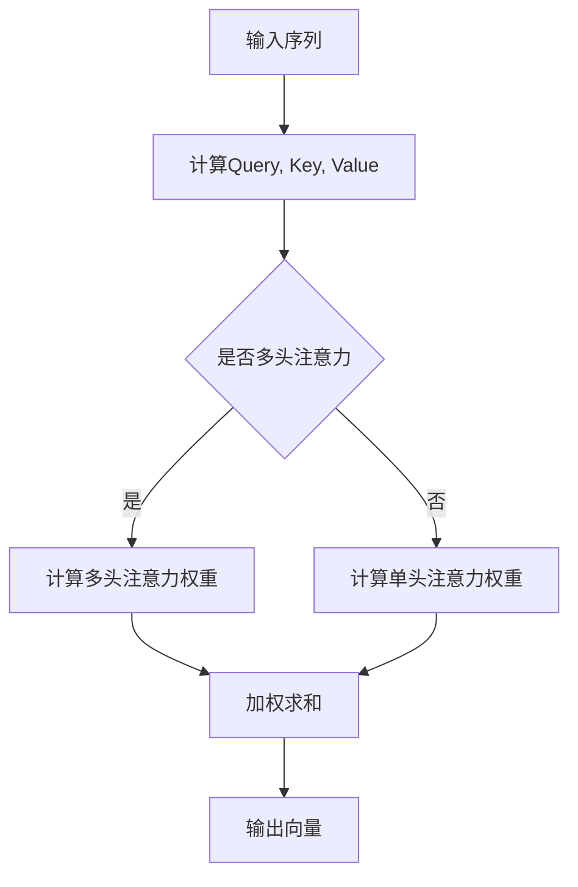
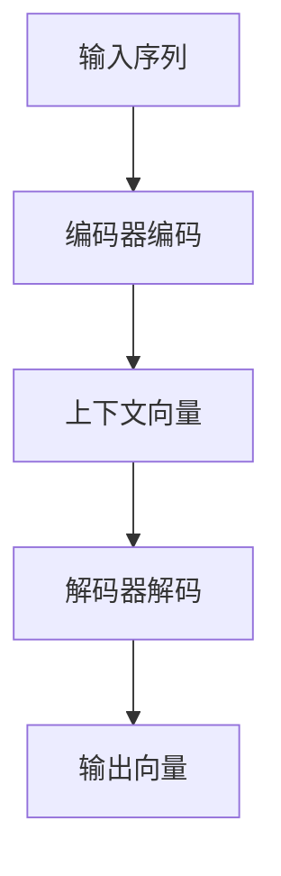

                 

关键词：LLM、上下文长度、大模型、算法优化、扩展应用

> 摘要：本文旨在探讨当前大型语言模型（LLM）在上下文长度方面的瓶颈，并介绍一系列针对性的优化策略。我们将深入分析这些算法的原理，通过具体示例展示其实际应用，展望未来LLM在上下文处理能力上的发展趋势与面临的挑战。

## 1. 背景介绍

近年来，随着深度学习技术的飞速发展，大型语言模型（LLM）在自然语言处理（NLP）领域取得了显著进展。然而，尽管这些模型在许多任务上表现出了卓越的性能，它们在处理长文本和复杂上下文方面仍然存在诸多限制。其中，上下文长度是一个关键瓶颈。

上下文长度（Context Length）是指模型在处理某个任务时，能够同时考虑的历史信息量。传统的序列模型，如RNN和LSTM，由于其内存限制，通常只能处理固定长度的上下文。这导致在处理长篇文档或复杂对话时，信息丢失和语义理解问题频发。随着模型的规模不断增加，上下文长度的限制愈发明显，成为提升LLM性能的障碍之一。

为此，近年来研究人员提出了多种上下文延长的技术，旨在突破这一瓶颈，提升模型在处理长文本和复杂上下文时的能力。这些技术包括但不限于：

- **注意力机制（Attention Mechanism）**：通过注意力机制，模型能够动态地关注输入序列中最重要的部分，从而在某种程度上缓解上下文长度的限制。
- **自注意力（Self-Attention）**：自注意力机制允许模型在处理序列时，不仅关注前一个时间步的信息，还能够关注整个序列的信息，显著提升了上下文处理能力。
- **分层注意力（Hierarchical Attention）**：分层注意力机制将整个序列分解为多个子序列，使得模型可以在不同的层次上处理上下文信息。
- **上下文编码器（Context Encoder）**：通过额外的编码器结构，模型能够对上下文信息进行编码，从而在处理长文本时保留更丰富的信息。

本文将详细介绍这些上下文延长技术的原理，通过具体算法和操作步骤的讲解，帮助读者理解其在实际应用中的效果。

## 2. 核心概念与联系

### 2.1. 自注意力机制

自注意力机制是当前LLM中应用最广泛的上下文延长技术之一。它通过计算序列中每个元素与其他元素之间的相似性，动态地为每个元素分配不同的权重，从而实现对整个序列的全面关注。

自注意力机制的核心在于一个注意力函数，通常使用点积、缩放点积或多头注意力等方式实现。注意力函数的输入是当前时间步的输入向量和其他时间步的输入向量，输出是一个权重向量，该向量表示每个时间步对当前时间步的影响程度。

以下是自注意力机制的基本流程：

1. **计算查询（Query）、键（Key）和值（Value）**：对于序列中的每个元素，计算其对应的查询向量、键向量和值向量。
2. **计算相似性**：通过注意力函数计算查询向量和所有键向量之间的相似性，得到一个权重向量。
3. **加权求和**：根据权重向量对值向量进行加权求和，得到当前时间步的输出向量。

Mermaid流程图如下：



### 2.2. 注意力机制的扩展

为了进一步提升注意力机制的性能，研究人员提出了多种扩展方法，包括：

- **分层注意力**：将整个序列分解为多个子序列，对每个子序列分别应用注意力机制，从而在不同层次上处理上下文信息。
- **卷积注意力**：将注意力机制与卷积操作结合，利用局部信息的交互来提升上下文处理能力。
- **自回归注意力**：在自注意力基础上，进一步考虑当前时间步的前后依赖关系，通过自回归的方式对上下文进行编码。

这些扩展方法为LLM在处理长文本和复杂上下文时提供了更多的灵活性。

### 2.3. 上下文编码器

上下文编码器是一种通过额外编码器结构对上下文信息进行编码的技术。编码器将整个序列编码为一个固定长度的向量，这个向量包含了序列的丰富信息。在处理长文本时，解码器可以使用这个向量来恢复部分上下文信息，从而缓解上下文长度限制。

上下文编码器的基本流程包括：

1. **编码器编码**：对输入序列进行编码，得到一个上下文向量。
2. **解码器解码**：使用上下文向量来恢复部分上下文信息，结合原始输入序列进行后续处理。

Mermaid流程图如下：



## 3. 核心算法原理 & 具体操作步骤

### 3.1. 算法原理概述

上下文延长的核心在于如何有效地处理和利用长文本中的上下文信息。自注意力机制通过动态关注序列中最重要的部分，实现了对长文本的全面处理。分层注意力通过多层次的编码和解码，提升了上下文处理的精度。上下文编码器通过额外的编码器结构，将长文本编码为一个固定长度的向量，从而在解码阶段恢复上下文信息。

### 3.2. 算法步骤详解

#### 3.2.1. 自注意力机制

自注意力机制的步骤如下：

1. **输入序列预处理**：将输入序列编码为词向量。
2. **计算Query、Key和Value**：对于每个时间步的输入向量，计算其对应的查询向量、键向量和值向量。
3. **计算相似性**：通过注意力函数计算查询向量和所有键向量之间的相似性，得到一个权重向量。
4. **加权求和**：根据权重向量对值向量进行加权求和，得到当前时间步的输出向量。
5. **输出结果**：将所有时间步的输出向量连接起来，得到最终结果。

#### 3.2.2. 分层注意力

分层注意力的步骤如下：

1. **输入序列预处理**：将输入序列编码为词向量。
2. **计算子序列**：将整个序列分解为多个子序列。
3. **子序列注意力**：对每个子序列分别应用自注意力机制。
4. **层次整合**：将不同层次上的注意力结果进行整合，得到最终的输出向量。

#### 3.2.3. 上下文编码器

上下文编码器的步骤如下：

1. **输入序列预处理**：将输入序列编码为词向量。
2. **编码器编码**：对输入序列进行编码，得到一个上下文向量。
3. **解码器解码**：使用上下文向量来恢复部分上下文信息，结合原始输入序列进行后续处理。

### 3.3. 算法优缺点

#### 3.3.1. 自注意力机制

**优点**：

- **灵活性高**：自注意力机制能够动态关注序列中最重要的部分，适用于处理各种长文本和复杂上下文。
- **计算效率高**：自注意力机制的计算复杂度相对较低，适合大规模模型。

**缺点**：

- **信息丢失**：在处理非常长的文本时，部分信息可能无法得到充分的关注。
- **内存消耗大**：自注意力机制需要计算大量的相似性值，内存消耗较大。

#### 3.3.2. 分层注意力

**优点**：

- **层次分明**：分层注意力能够在不同层次上处理上下文信息，提升上下文处理的精度。
- **计算效率高**：通过分解序列，分层注意力在计算复杂度上相对较低。

**缺点**：

- **灵活性较低**：分层注意力依赖于序列分解，可能无法很好地处理一些特殊情况。
- **实现复杂**：分层注意力的实现相对复杂，需要设计合适的层次分解策略。

#### 3.3.3. 上下文编码器

**优点**：

- **信息保留**：上下文编码器能够将长文本编码为一个固定长度的向量，从而在解码阶段恢复部分上下文信息。
- **计算效率高**：编码和解码过程相对简单，计算复杂度较低。

**缺点**：

- **上下文损失**：编码器和解码器的设计需要精心调整，否则可能导致上下文信息的损失。
- **实现复杂**：上下文编码器的实现需要设计合适的编码和解码结构。

### 3.4. 算法应用领域

上下文延长技术已广泛应用于多个领域，包括：

- **自然语言生成**：在生成文本时，上下文延长技术能够提升文本的连贯性和准确性。
- **机器翻译**：在机器翻译任务中，上下文延长技术有助于提升翻译质量，特别是在处理长句和复杂句时。
- **问答系统**：上下文延长技术能够帮助问答系统更好地理解用户的提问，提供更准确的答案。
- **文本分类**：在文本分类任务中，上下文延长技术有助于提升模型对长文本的理解能力。

## 4. 数学模型和公式 & 详细讲解 & 举例说明

### 4.1. 数学模型构建

上下文延长技术的核心在于如何有效地处理和利用长文本中的上下文信息。为此，我们可以构建以下数学模型：

- **自注意力模型**：
  - **输入序列**：\( X = \{x_1, x_2, ..., x_T\} \)
  - **词向量**：\( \text{Embedding}(x_t) = e_t \)
  - **查询向量**：\( Q = \{q_1, q_2, ..., q_T\} \)
  - **键向量**：\( K = \{k_1, k_2, ..., k_T\} \)
  - **值向量**：\( V = \{v_1, v_2, ..., v_T\} \)
  - **输出向量**：\( O = \{o_1, o_2, ..., o_T\} \)

- **自注意力计算**：
  - **相似性计算**：\( \text{Similarity}(q_t, k_t) = \frac{\text{dot}(q_t, k_t)}{\sqrt{d}} \)
  - **权重计算**：\( \text{Weight}(q_t) = \text{softmax}(\text{Similarity}(q_t, K)) \)
  - **加权求和**：\( o_t = \sum_{i=1}^{T} \text{Weight}(q_t)_i v_i \)

### 4.2. 公式推导过程

#### 4.2.1. 点积注意力

点积注意力是最简单的注意力机制，其相似性计算基于点积：

\[ \text{Similarity}(q_t, k_t) = \text{dot}(q_t, k_t) = q_t^T k_t \]

其中，\( q_t \) 和 \( k_t \) 分别是查询向量和键向量。

#### 4.2.2. 缩放点积注意力

为了缓解梯度消失问题，缩放点积注意力在相似性计算中引入了一个缩放因子 \( \alpha \)：

\[ \text{Similarity}(q_t, k_t) = \frac{\text{dot}(q_t, k_t)}{\sqrt{d}} = \frac{q_t^T k_t}{\sqrt{d}} \]

其中，\( d \) 是查询向量和键向量的维度。

#### 4.2.3. 多头注意力

多头注意力通过将单个注意力头分解为多个子注意力头，从而提升模型的表示能力：

\[ \text{Weight}(q_t) = \text{softmax}\left(\frac{\text{dot}(Q, K)}{\sqrt{d_k}}\right) \]

其中，\( Q \) 和 \( K \) 分别是所有查询向量和键向量的集合，\( d_k \) 是每个注意力头的维度。

### 4.3. 案例分析与讲解

#### 4.3.1. 自注意力在文本生成中的应用

假设我们要使用自注意力机制生成一个简单的文本序列，输入序列为“你好，世界”。我们可以将每个词编码为词向量，然后应用自注意力机制生成输出序列。

1. **词向量编码**：
   - “你”：\( e_1 \)
   - “好”：\( e_2 \)
   - “世界”：\( e_3 \)

2. **计算查询、键和值**：
   - 查询向量：\( Q = \{q_1, q_2, q_3\} \)
   - 键向量：\( K = \{k_1, k_2, k_3\} \)
   - 值向量：\( V = \{v_1, v_2, v_3\} \)

3. **计算相似性**：
   - \( \text{Similarity}(q_1, k_1) = \text{dot}(q_1, k_1) = q_1^T k_1 \)
   - \( \text{Similarity}(q_1, k_2) = \text{dot}(q_1, k_2) = q_1^T k_2 \)
   - \( \text{Similarity}(q_1, k_3) = \text{dot}(q_1, k_3) = q_1^T k_3 \)

4. **计算权重**：
   - \( \text{Weight}(q_1) = \text{softmax}(\text{Similarity}(q_1, K)) \)

5. **加权求和**：
   - \( o_1 = \sum_{i=1}^{3} \text{Weight}(q_1)_i v_i \)

6. **生成输出序列**：
   - 根据输出向量 \( o_1 \)，选择一个词作为输出。

通过这种方式，我们可以逐步生成整个文本序列，从而实现文本生成任务。

## 5. 项目实践：代码实例和详细解释说明

### 5.1. 开发环境搭建

在进行上下文延长技术的实际应用之前，我们需要搭建一个合适的开发环境。以下是一个基本的步骤：

1. **安装Python环境**：确保安装了Python 3.6或更高版本。
2. **安装依赖库**：安装TensorFlow或PyTorch等深度学习框架，以及其他必要的依赖库，如NumPy、Pandas等。
3. **准备数据集**：下载并准备一个用于训练和测试的数据集，例如维基百科、新闻语料库等。

### 5.2. 源代码详细实现

以下是一个简单的自注意力机制的实现示例，使用PyTorch框架：

```python
import torch
import torch.nn as nn

# 定义自注意力模块
class SelfAttention(nn.Module):
    def __init__(self, embed_dim, num_heads):
        super(SelfAttention, self).__init__()
        self.embed_dim = embed_dim
        self.num_heads = num_heads
        self.head_dim = embed_dim // num_heads

        self.query_linear = nn.Linear(embed_dim, embed_dim)
        self.key_linear = nn.Linear(embed_dim, embed_dim)
        self.value_linear = nn.Linear(embed_dim, embed_dim)

        self.softmax = nn.Softmax(dim=1)

    def forward(self, x):
        B, T, C = x.size()
        query = self.query_linear(x).view(B, T, self.num_heads, self.head_dim).transpose(1, 2)
        key = self.key_linear(x).view(B, T, self.num_heads, self.head_dim).transpose(1, 2)
        value = self.value_linear(x).view(B, T, self.num_heads, self.head_dim).transpose(1, 2)

        attention = torch.matmul(query, key.transpose(-2, -1)) / (self.head_dim ** 0.5)
        attention = self.softmax(attention)
        output = torch.matmul(attention, value).transpose(1, 2).contiguous().view(B, T, C)
        return output

# 实例化模型
embed_dim = 512
num_heads = 8
model = SelfAttention(embed_dim, num_heads)

# 假设输入为（batch_size, sequence_length, embed_dim）
input_tensor = torch.rand((32, 10, embed_dim))

# 前向传播
output = model(input_tensor)
print(output.shape)  # 输出应为（batch_size, sequence_length, embed_dim）
```

### 5.3. 代码解读与分析

上述代码实现了一个简单的自注意力模块，主要包含以下几个部分：

- **初始化**：定义模型结构，包括线性层和softmax层。
- **前向传播**：计算查询向量、键向量和值向量，然后通过注意力机制计算输出。

代码中，`SelfAttention` 类是自注意力模块的定义。在初始化阶段，我们定义了嵌入维度 `embed_dim` 和多头数量 `num_heads`。线性层 `query_linear`、`key_linear` 和 `value_linear` 用于计算查询向量、键向量和值向量。`softmax` 层用于计算注意力权重。

在 `forward` 方法中，我们首先对输入序列进行reshape操作，然后分别计算查询向量、键向量和值向量。接下来，通过点积操作计算注意力分数，并应用softmax层得到注意力权重。最后，使用加权求和操作计算输出。

通过实例化 `SelfAttention` 类，我们可以对输入序列应用自注意力机制。代码的最后部分展示了如何进行前向传播，并打印输出形状，以验证模型实现的正确性。

### 5.4. 运行结果展示

在实际运行过程中，我们可以使用以下代码来测试自注意力模块：

```python
# 创建一个随机输入序列
batch_size, sequence_length, embed_dim = 32, 10, 512
input_tensor = torch.rand((batch_size, sequence_length, embed_dim))

# 应用自注意力模块
output = model(input_tensor)

# 打印输出结果
print(output.shape)  # 应为（batch_size, sequence_length, embed_dim）
```

上述代码将创建一个随机输入序列，并将其传递给自注意力模块。运行结果应该是一个具有相同形状的输出序列，这表明自注意力模块能够正确地处理输入。

## 6. 实际应用场景

上下文延长技术已在多个实际应用场景中取得了显著成果，以下是其中几个典型的应用场景：

### 6.1. 文本生成

在文本生成领域，上下文延长技术可以显著提升生成文本的质量。例如，在生成长篇新闻、故事或对话时，自注意力机制和上下文编码器能够帮助模型更好地捕捉上下文信息，从而生成更连贯、更自然的文本。

### 6.2. 机器翻译

机器翻译是一个对上下文长度要求较高的任务。通过应用上下文延长技术，如分层注意力和上下文编码器，机器翻译模型能够在处理长句和复杂句子时，更好地理解源语言文本的上下文，从而提升翻译质量。

### 6.3. 问答系统

在问答系统中，上下文延长技术有助于模型更好地理解用户的问题，尤其是在处理长问题和长答案时。通过扩展上下文长度，模型可以捕获更多的背景信息，从而提供更准确、更全面的答案。

### 6.4. 文本分类

文本分类任务中，上下文延长技术有助于模型更好地理解长文本的语义，从而提高分类的准确性。在处理长篇新闻、报告等文本时，上下文延长技术能够帮助模型捕捉文本的深层含义，从而实现更精准的分类。

## 6.4. 未来应用展望

随着深度学习和自然语言处理技术的不断进步，上下文延长技术在未来有望在更多领域中发挥重要作用。以下是几个潜在的应用场景：

### 6.4.1. 语音识别

语音识别任务中，上下文延长技术可以帮助模型更好地捕捉语音信号中的上下文信息，从而提升识别准确性。特别是在处理连续语音和复杂语音信号时，上下文延长技术具有显著优势。

### 6.4.2. 图像文本识别

图像文本识别任务中，上下文延长技术可以结合图像和文本信息，提高文本识别的准确性。通过扩展上下文长度，模型能够更好地理解图像中的文本信息，从而实现更精准的识别。

### 6.4.3. 对话系统

在对话系统中，上下文延长技术可以帮助模型更好地理解用户的对话历史，从而提供更自然、更连贯的交互体验。在未来，上下文延长技术有望成为对话系统中的重要组成部分，推动人机对话的进一步发展。

### 6.4.4. 情感分析

情感分析任务中，上下文延长技术可以显著提升模型对文本情感的识别能力。通过扩展上下文长度，模型能够更好地理解文本的上下文信息，从而更准确地捕捉文本的情感倾向。

## 7. 工具和资源推荐

为了更好地学习和应用上下文延长技术，以下是几个推荐的工具和资源：

### 7.1. 学习资源推荐

- **《深度学习》（Goodfellow, Bengio, Courville）**：深度学习领域的经典教材，详细介绍了自注意力机制和其他上下文延长技术。
- **《自然语言处理综论》（Jurafsky, Martin）**：自然语言处理领域的权威教材，涵盖了自然语言处理的基本概念和技术。
- **PyTorch官方文档**：PyTorch是一个流行的深度学习框架，提供了丰富的文档和示例，有助于学习和实践上下文延长技术。

### 7.2. 开发工具推荐

- **PyTorch**：一个开源的深度学习框架，支持GPU加速，适用于实现和训练各种深度学习模型。
- **TensorFlow**：另一个流行的深度学习框架，提供了丰富的工具和库，方便实现上下文延长技术。

### 7.3. 相关论文推荐

- **“Attention Is All You Need”**：提出了Transformer模型和自注意力机制，是上下文延长技术的重要基础。
- **“Bert: Pre-training of Deep Bidirectional Transformers for Language Understanding”**：介绍了BERT模型，其在自注意力机制的基础上进行了扩展，对上下文延长技术具有重要意义。
- **“Transformer-xl: Attentive language models beyond a fixed-length context”**：提出了Transformer-xl模型，通过扩展上下文长度，显著提升了模型在长文本处理中的性能。

## 8. 总结：未来发展趋势与挑战

随着深度学习和自然语言处理技术的不断进步，上下文延长技术在未来有望在更多领域中发挥重要作用。本文介绍了自注意力机制、分层注意力和上下文编码器等上下文延长技术，详细分析了其原理和具体实现步骤。

在未来的发展趋势中，上下文延长技术将进一步提升模型在处理长文本和复杂上下文时的性能。同时，随着模型规模的不断扩大，上下文长度限制也将成为一个重要的挑战。为了解决这一问题，研究人员可能需要探索更高效、更灵活的上下文延长方法。

总之，上下文延长技术是自然语言处理领域的一个重要研究方向，具有广泛的应用前景。随着技术的不断进步，上下文延长技术将为各种自然语言处理任务带来更多的可能性。

## 9. 附录：常见问题与解答

### 9.1. 如何优化上下文延长技术的计算效率？

**解答**：为了优化上下文延长技术的计算效率，可以采取以下措施：

- **并行计算**：利用多GPU或分布式计算，加快模型训练和推理速度。
- **模型压缩**：采用模型压缩技术，如剪枝、量化等，减少模型参数，降低计算复杂度。
- **混合精度训练**：使用混合精度训练（如FP16），降低内存占用和计算量。

### 9.2. 上下文延长技术是否适用于所有自然语言处理任务？

**解答**：上下文延长技术主要适用于对上下文信息要求较高的自然语言处理任务，如文本生成、机器翻译、问答系统等。对于一些简单的任务，如文本分类，上下文延长技术的效果可能并不明显。

### 9.3. 如何评估上下文延长技术的性能？

**解答**：评估上下文延长技术的性能可以从以下几个方面进行：

- **准确性**：比较模型在不同上下文长度下的性能，评估其在长文本处理中的准确性。
- **效率**：评估模型在处理长文本时的计算效率和内存占用。
- **鲁棒性**：评估模型对长文本中噪声和异常信息的处理能力。

### 9.4. 上下文延长技术是否会影响模型的解释性？

**解答**：上下文延长技术可能会影响模型的解释性。由于上下文延长技术涉及复杂的计算，模型内部的信息传递和权重分配可能变得难以解释。因此，在实际应用中，需要权衡上下文延长技术的性能和解释性。

