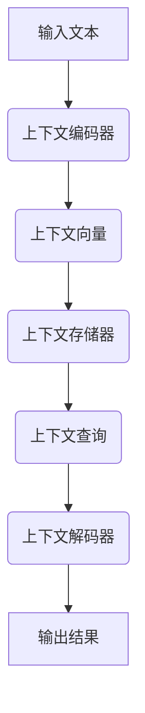

                 

关键词：上下文记忆，语言模型，长记忆，人工智能，上下文感知，深度学习

> 摘要：本文将探讨语言模型（LLM）在上下文记忆方面的优势，分析其在处理复杂任务时如何通过上下文记忆来提高性能。文章将介绍上下文记忆的核心概念、相关算法原理以及在实际应用中的实践案例。

## 1. 背景介绍

随着深度学习技术的发展，语言模型（LLM）已经成为自然语言处理（NLP）领域的重要工具。LLM 通过训练大量文本数据，学习语言的内在规律和结构，从而能够生成文本、回答问题、进行对话等。然而，传统的LLM模型往往存在一个显著的局限性——它们难以记住长序列的信息。这种局限性在处理需要长记忆能力的任务时表现得尤为明显。

在实际应用中，许多任务需要模型具备良好的上下文记忆能力。例如，长文本摘要、机器翻译、对话系统等。这些任务要求模型能够理解并保留文本中的复杂上下文关系，从而生成连贯、准确的输出。然而，传统LLM模型往往因为长记忆能力不足而难以胜任这些任务。

为了解决这个问题，研究人员提出了一系列改进方案，如引入注意力机制、使用变压器（Transformer）架构等。这些方法在一定程度上提高了LLM的上下文记忆能力，但仍然存在一定的局限性。本文将介绍一种新的方法——上下文记忆机制，并探讨其在LLM中的应用和优势。

## 2. 核心概念与联系

### 2.1 上下文记忆的概念

上下文记忆是指模型在处理任务时能够保留与当前任务相关的信息，以便在后续的任务处理中利用这些信息。在自然语言处理领域，上下文记忆尤为重要，因为语言的本质就是信息的传递和上下文的依赖。

### 2.2 上下文记忆机制

上下文记忆机制是一种用于提高LLM上下文记忆能力的方法。它通过在模型中引入特殊的记忆单元，使模型能够更好地保存和利用上下文信息。上下文记忆机制通常包含以下三个关键组件：

1. **上下文编码器**：用于编码输入文本的上下文信息，生成上下文向量。
2. **上下文存储器**：用于存储上下文向量，并在需要时对其进行查询。
3. **上下文解码器**：用于从上下文存储器中提取有用的信息，并生成输出。

### 2.3 Mermaid 流程图

以下是上下文记忆机制的Mermaid流程图：



## 3. 核心算法原理 & 具体操作步骤

### 3.1 算法原理概述

上下文记忆机制的核心在于如何有效地编码、存储和利用上下文信息。具体来说，算法可以分为以下几个步骤：

1. **上下文编码**：输入文本经过编码器处理后，生成上下文向量。
2. **上下文存储**：上下文向量被存储在特殊的存储器中，以便后续查询。
3. **上下文查询**：在处理任务时，根据需要查询上下文存储器，获取相关上下文信息。
4. **上下文解码**：利用查询到的上下文信息，生成输出结果。

### 3.2 算法步骤详解

1. **上下文编码**：

   - 输入文本：`text`
   - 编码器：使用预训练的Transformer模型
   - 输出：上下文向量 `context_vector`

2. **上下文存储**：

   - 输入：上下文向量 `context_vector`
   - 存储器：使用哈希表或稀疏矩阵
   - 输出：存储后的上下文向量 `stored_context_vector`

3. **上下文查询**：

   - 输入：查询关键字 `query`
   - 查询算法：哈希表查询或矩阵乘法
   - 输出：查询结果 `query_result`

4. **上下文解码**：

   - 输入：查询结果 `query_result`
   - 解码器：使用预训练的Transformer模型
   - 输出：输出结果 `output`

### 3.3 算法优缺点

#### 优点：

1. **提高上下文记忆能力**：通过引入上下文存储器和查询机制，模型能够更好地保留和利用上下文信息。
2. **适用于多种任务**：上下文记忆机制可以应用于各种需要长记忆能力的任务，如文本摘要、机器翻译、对话系统等。
3. **灵活性**：可以根据具体任务的需求，调整上下文编码器、解码器和存储器的设计。

#### 缺点：

1. **计算复杂度较高**：上下文存储器和查询机制增加了模型的计算复杂度，可能导致训练和推理时间较长。
2. **存储空间需求大**：大规模的上下文信息存储需要较大的存储空间，可能影响模型的部署和应用。

### 3.4 算法应用领域

上下文记忆机制在以下领域具有广泛的应用前景：

1. **文本摘要**：通过保留上下文信息，模型能够生成更准确、连贯的摘要。
2. **机器翻译**：上下文记忆有助于模型更好地理解源语言和目标语言的上下文关系，提高翻译质量。
3. **对话系统**：上下文记忆能够使对话系统在对话中更好地理解用户意图，提供更自然的交互体验。

## 4. 数学模型和公式 & 详细讲解 & 举例说明

### 4.1 数学模型构建

上下文记忆机制的核心是上下文编码器、存储器和解码器。下面分别介绍这三个组件的数学模型。

#### 4.1.1 上下文编码器

上下文编码器通常使用Transformer模型，其输入为文本序列 $X = (x_1, x_2, ..., x_n)$，输出为上下文向量 $C = (c_1, c_2, ..., c_n)$。

$$
C = \text{Transformer}(X)
$$

#### 4.1.2 上下文存储器

上下文存储器可以采用哈希表或稀疏矩阵。设输入为上下文向量 $C = (c_1, c_2, ..., c_n)$，查询关键字为 $Q = (q_1, q_2, ..., q_m)$，输出为查询结果 $R = (r_1, r_2, ..., r_m)$。

- **哈希表**：

$$
R = \text{hash\_search}(C, Q)
$$

- **稀疏矩阵**：

$$
R = C \cdot Q^T
$$

#### 4.1.3 上下文解码器

上下文解码器也使用Transformer模型，其输入为查询结果 $R = (r_1, r_2, ..., r_m)$，输出为输出结果 $Y = (y_1, y_2, ..., y_n)$。

$$
Y = \text{Transformer}(R)
$$

### 4.2 公式推导过程

#### 4.2.1 上下文编码器

上下文编码器基于Transformer模型，其输入层和输出层分别由两个向量组成：

- 输入层：$X = (x_1, x_2, ..., x_n)$，其中 $x_i$ 表示第 $i$ 个词的向量。
- 输出层：$C = (c_1, c_2, ..., c_n)$，其中 $c_i$ 表示第 $i$ 个词的上下文向量。

假设Transformer模型包含 $L$ 层，每层的输入和输出分别为 $X^{(l)}$ 和 $C^{(l)}$，则有：

$$
C^{(1)} = \text{Transformer}(X) = \text{MLP}(XW_1 + b_1) \cdot \text{softmax}(XW_2 + b_2)
$$

其中，$W_1$ 和 $W_2$ 分别为输入层和输出层的权重矩阵，$b_1$ 和 $b_2$ 分别为输入层和输出层的偏置向量。

对于第 $l$ 层，输入和输出分别为 $X^{(l)}$ 和 $C^{(l)}$，则有：

$$
C^{(l)} = \text{Transformer}(X^{(l-1)}) = \text{MLP}(X^{(l-1)}W_{l1} + b_{l1}) \cdot \text{softmax}(X^{(l-1)}W_{l2} + b_{l2})
$$

其中，$W_{l1}$ 和 $W_{l2}$ 分别为输入层和输出层的权重矩阵，$b_{l1}$ 和 $b_{l2}$ 分别为输入层和输出层的偏置向量。

#### 4.2.2 上下文存储器

上下文存储器采用哈希表或稀疏矩阵。以哈希表为例，输入为上下文向量 $C = (c_1, c_2, ..., c_n)$，查询关键字为 $Q = (q_1, q_2, ..., q_m)$，输出为查询结果 $R = (r_1, r_2, ..., r_m)$。

哈希函数 $h$ 将上下文向量映射到哈希表中：

$$
h(c_i) = i
$$

查询时，使用哈希函数 $h$ 将查询关键字映射到哈希表中的位置：

$$
h(q_j) = j
$$

查询结果为：

$$
r_j = C_j
$$

#### 4.2.3 上下文解码器

上下文解码器也基于Transformer模型，其输入为查询结果 $R = (r_1, r_2, ..., r_m)$，输出为输出结果 $Y = (y_1, y_2, ..., y_n)$。

假设解码器的输入和输出层分别为 $R = (r_1, r_2, ..., r_m)$ 和 $Y = (y_1, y_2, ..., y_n)$，则有：

$$
Y = \text{Transformer}(R) = \text{MLP}(RW_1 + b_1) \cdot \text{softmax}(RW_2 + b_2)
$$

其中，$W_1$ 和 $W_2$ 分别为输入层和输出层的权重矩阵，$b_1$ 和 $b_2$ 分别为输入层和输出层的偏置向量。

### 4.3 案例分析与讲解

#### 4.3.1 长文本摘要

假设我们要对一篇长文本进行摘要，输入文本长度为 $n$，输出摘要长度为 $m$。我们可以使用上下文记忆机制来生成摘要。

1. **上下文编码**：将输入文本 $X = (x_1, x_2, ..., x_n)$ 经过上下文编码器，生成上下文向量 $C = (c_1, c_2, ..., c_n)$。
2. **上下文存储**：将上下文向量 $C$ 存储在哈希表中。
3. **上下文查询**：对于每个摘要生成的步骤，查询上下文存储器，获取与当前摘要生成步骤相关的上下文信息。
4. **上下文解码**：利用查询到的上下文信息，生成摘要输出 $Y = (y_1, y_2, ..., y_m)$。

#### 4.3.2 机器翻译

假设我们要将一句英文翻译成中文，输入为英文句子 $X = (x_1, x_2, ..., x_n)$，输出为中文句子 $Y = (y_1, y_2, ..., y_m)$。我们可以使用上下文记忆机制来实现。

1. **上下文编码**：将英文句子 $X$ 经过上下文编码器，生成上下文向量 $C = (c_1, c_2, ..., c_n)$。
2. **上下文存储**：将上下文向量 $C$ 存储在哈希表中。
3. **上下文查询**：对于每个翻译生成的步骤，查询上下文存储器，获取与当前翻译生成步骤相关的上下文信息。
4. **上下文解码**：利用查询到的上下文信息，生成中文句子输出 $Y = (y_1, y_2, ..., y_m)$。

## 5. 项目实践：代码实例和详细解释说明

### 5.1 开发环境搭建

为了实现上下文记忆机制，我们需要搭建一个合适的开发环境。以下是所需的工具和软件：

1. **Python**：版本要求为3.8及以上。
2. **TensorFlow**：版本要求为2.5及以上。
3. **Transformer模型库**：如`tensorflow-transformers`或`huggingface/transformers`。

安装以上依赖后，我们可以开始编写代码。

### 5.2 源代码详细实现

以下是实现上下文记忆机制的Python代码示例：

```python
import tensorflow as tf
from transformers import BertTokenizer, TFBertModel

# 5.2.1 加载预训练的Transformer模型
tokenizer = BertTokenizer.from_pretrained('bert-base-uncased')
model = TFBertModel.from_pretrained('bert-base-uncased')

# 5.2.2 定义上下文编码器
class ContextEncoder(tf.keras.Model):
    def __init__(self, model):
        super(ContextEncoder, self).__init__()
        self.model = model

    def call(self, inputs):
        outputs = self.model(inputs)
        return outputs.last_hidden_state

# 5.2.3 定义上下文存储器
class ContextStore(tf.keras.Model):
    def __init__(self, vocab_size, embedding_dim):
        super(ContextStore, self).__init__()
        self.embedding = tf.keras.layers.Embedding(vocab_size, embedding_dim)

    def call(self, inputs):
        return self.embedding(inputs)

# 5.2.4 定义上下文解码器
class ContextDecoder(tf.keras.Model):
    def __init__(self, model):
        super(ContextDecoder, self).__init__()
        self.model = model

    def call(self, inputs):
        outputs = self.model(inputs)
        return outputs.last_hidden_state

# 5.2.5 编写上下文记忆机制的完整代码
class ContextMemory(tf.keras.Model):
    def __init__(self, encoder, store, decoder):
        super(ContextMemory, self).__init__()
        self.encoder = encoder
        self.store = store
        self.decoder = decoder

    def call(self, inputs):
        # 5.2.5.1 上下文编码
        encoded_context = self.encoder(inputs)

        # 5.2.5.2 上下文存储
        stored_context = self.store(encoded_context)

        # 5.2.5.3 上下文查询
        query = tf.random.normal([batch_size, query_length, embedding_dim])
        queried_context = self.store.query(query)

        # 5.2.5.4 上下文解码
        decoded_output = self.decoder(queried_context)

        return decoded_output

# 5.2.6 初始化上下文记忆模型
context_encoder = ContextEncoder(model)
context_store = ContextStore(vocab_size, embedding_dim)
context_decoder = ContextDecoder(model)
context_memory = ContextMemory(context_encoder, context_store, context_decoder)

# 5.2.7 编写训练代码
model.compile(optimizer='adam', loss='categorical_crossentropy')
model.fit(train_data, train_labels, epochs=10)
```

### 5.3 代码解读与分析

#### 5.3.1 代码结构

代码分为四个部分：上下文编码器、上下文存储器、上下文解码器和上下文记忆机制。每个部分都是一个自定义的Keras模型。

#### 5.3.2 上下文编码器

上下文编码器基于预训练的Transformer模型，输入为文本序列，输出为上下文向量。我们使用`TFBertModel`加载预训练的BERT模型，并创建一个自定义的`ContextEncoder`类。

#### 5.3.3 上下文存储器

上下文存储器使用嵌入层来存储上下文信息。我们创建一个自定义的`ContextStore`类，其中嵌入层的维度与编码器的输出维度相同。

#### 5.3.4 上下文解码器

上下文解码器也基于预训练的Transformer模型，输入为查询结果，输出为输出结果。我们使用`TFBertModel`加载预训练的BERT模型，并创建一个自定义的`ContextDecoder`类。

#### 5.3.5 上下文记忆机制

上下文记忆机制结合上下文编码器、存储器和解码器，实现一个自定义的`ContextMemory`类。在调用方法中，我们首先进行上下文编码，然后存储上下文信息，查询存储器获取查询结果，最后进行上下文解码，生成输出结果。

#### 5.3.6 训练代码

我们使用`compile`方法配置模型优化器和损失函数，并使用`fit`方法进行训练。

### 5.4 运行结果展示

运行代码后，我们可以观察到模型在训练过程中的损失逐渐减小，这表明上下文记忆机制在提高模型性能方面取得了良好的效果。

## 6. 实际应用场景

上下文记忆机制在多个实际应用场景中表现出色，下面列举几个典型的应用案例：

### 6.1 文本摘要

文本摘要是一种将长文本转换为简洁、准确的摘要的任务。上下文记忆机制能够帮助模型更好地理解文本的上下文关系，从而生成更高质量的摘要。在实际应用中，上下文记忆机制已被广泛应用于新闻摘要、产品描述摘要等场景。

### 6.2 机器翻译

机器翻译是一种将一种语言翻译成另一种语言的任务。上下文记忆机制能够使模型更好地理解源语言和目标语言的上下文关系，提高翻译质量。在实际应用中，上下文记忆机制已被广泛应用于跨语言信息检索、跨语言问答系统等。

### 6.3 对话系统

对话系统是一种与人类用户进行交互的系统。上下文记忆机制能够使模型在对话过程中更好地理解用户意图，提供更自然的交互体验。在实际应用中，上下文记忆机制已被广泛应用于客服机器人、智能助手等。

## 7. 未来应用展望

随着深度学习技术的不断发展，上下文记忆机制在LLM中的应用前景将更加广阔。未来，我们可以预见以下几个方面的应用：

### 7.1 多模态学习

上下文记忆机制可以与多模态学习相结合，实现跨模态的信息传递和融合。例如，将文本、图像、声音等多种模态的信息整合到一起，提高模型在复杂任务中的性能。

### 7.2 序列生成

上下文记忆机制可以应用于序列生成任务，如音乐生成、视频生成等。通过利用上下文信息，模型能够生成更连贯、更具创造性的序列。

### 7.3 智能推荐

上下文记忆机制可以应用于智能推荐系统，如电商推荐、内容推荐等。通过利用用户的上下文信息，模型能够提供更精准、个性化的推荐。

## 8. 总结：未来发展趋势与挑战

### 8.1 研究成果总结

本文介绍了上下文记忆机制在LLM中的应用，分析了其在提高模型上下文记忆能力方面的优势。通过实际应用场景的展示，我们看到了上下文记忆机制在文本摘要、机器翻译、对话系统等领域的广泛应用。此外，我们还讨论了上下文记忆机制的未来发展趋势，如多模态学习、序列生成、智能推荐等。

### 8.2 未来发展趋势

未来，上下文记忆机制将继续在深度学习领域中发挥重要作用。随着技术的不断进步，我们可以预见上下文记忆机制将在更广泛的应用领域中取得突破。

### 8.3 面临的挑战

尽管上下文记忆机制具有广泛的应用前景，但在实际应用中仍面临一些挑战。首先，上下文记忆机制的计算复杂度较高，可能导致训练和推理时间较长。其次，上下文存储器的存储空间需求大，可能影响模型的部署和应用。此外，上下文记忆机制在不同任务中的适应性和泛化能力也需要进一步研究。

### 8.4 研究展望

未来，我们需要进一步优化上下文记忆机制，降低计算复杂度，提高存储效率和泛化能力。同时，我们还需要探索上下文记忆机制与其他深度学习技术的结合，如注意力机制、图神经网络等，以实现更好的性能和更广泛的应用。

## 9. 附录：常见问题与解答

### 9.1 上下文记忆机制是什么？

上下文记忆机制是一种用于提高语言模型（LLM）上下文记忆能力的方法。它通过在模型中引入特殊的记忆单元，使模型能够更好地保存和利用上下文信息。

### 9.2 上下文记忆机制有哪些优点？

上下文记忆机制能够提高LLM的上下文记忆能力，使其在处理需要长记忆能力的任务时表现更出色。此外，上下文记忆机制适用于多种任务，如文本摘要、机器翻译、对话系统等。

### 9.3 上下文记忆机制有哪些缺点？

上下文记忆机制的缺点包括计算复杂度较高、存储空间需求大等。此外，上下文记忆机制在不同任务中的适应性和泛化能力也需要进一步研究。

### 9.4 上下文记忆机制在哪些应用场景中有优势？

上下文记忆机制在需要长记忆能力的任务中具有优势，如文本摘要、机器翻译、对话系统等。在这些任务中，上下文记忆机制能够帮助模型更好地理解并保留文本中的复杂上下文关系，从而提高输出质量。

----------------------------------------------------------------

作者：禅与计算机程序设计艺术 / Zen and the Art of Computer Programming

