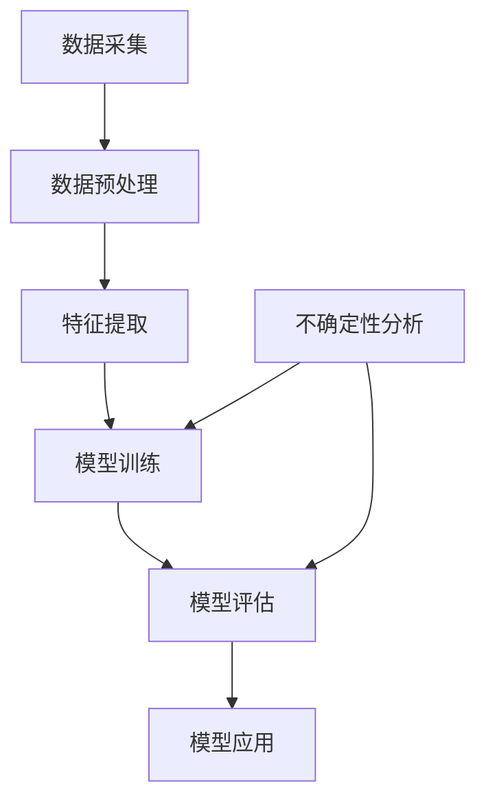
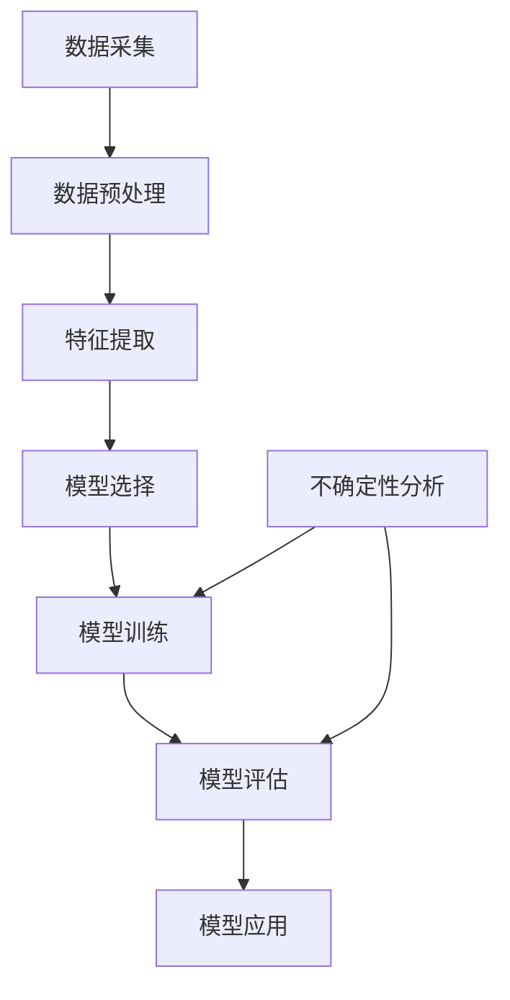

                 

关键词：不确定性，机器学习，数据噪声，过拟合，泛化能力，数学模型，算法优化，实际应用。

> 摘要：本文探讨了机器学习中的不确定性问题，分析了数据噪声、过拟合和泛化能力等挑战对机器学习模型的影响，并提出了相应的解决策略。通过数学模型和具体案例的讲解，文章展示了如何利用现代机器学习技术应对不确定性，为未来研究和发展提供了新的思路。

## 1. 背景介绍

机器学习作为人工智能的核心技术之一，近年来取得了飞速发展。然而，在实际应用中，机器学习模型面临诸多不确定性问题，如数据噪声、过拟合和泛化能力不足等。这些问题不仅影响模型的性能，还可能导致错误的决策和预测。因此，研究不确定性问题对于提高机器学习模型的可靠性和实用性具有重要意义。

### 1.1 数据噪声

数据噪声是机器学习模型中普遍存在的一个问题。噪声数据可能来源于多种因素，如数据采集过程中的误差、数据传输中的失真等。噪声数据会干扰模型的训练过程，导致模型无法准确捕捉数据的本质特征。为了解决这个问题，研究者们提出了多种去噪方法，如滤波、去卷积和深度学习中的自编码器等。

### 1.2 过拟合

过拟合是指模型在训练数据上表现良好，但在未见过的新数据上表现不佳。这表明模型过于依赖训练数据中的特例，而无法泛化到更广泛的数据分布。过拟合是机器学习中的一个常见问题，主要原因包括模型复杂度过高、训练数据不足等。为了克服过拟合，研究者们提出了正则化、交叉验证和集成学习等方法。

### 1.3 泛化能力

泛化能力是指模型在新数据上的表现。一个优秀的机器学习模型应该能够在不同的数据分布和应用场景下保持稳定的表现。然而，现实中的数据分布往往存在差异，模型需要具备良好的泛化能力以应对这些变化。提升模型的泛化能力是机器学习研究的一个重要目标。

## 2. 核心概念与联系

为了更好地理解机器学习中的不确定性问题，我们需要从核心概念和架构入手。以下是一个简化的Mermaid流程图，展示了机器学习中的核心概念及其相互关系：



### 2.1 数据采集

数据采集是机器学习的第一步，也是最重要的一步。采集到的数据质量直接影响后续模型的性能。数据噪声是数据采集过程中常见的问题，需要通过去噪方法进行处理。

### 2.2 数据预处理

数据预处理包括数据清洗、归一化和特征提取等步骤。数据清洗旨在去除噪声数据和异常值，保证数据的一致性和完整性。归一化则将不同特征的数据缩放到相同的范围，便于后续的特征提取和模型训练。

### 2.3 特征提取

特征提取是数据预处理的关键步骤，旨在从原始数据中提取出具有区分度的特征。特征提取的质量对模型的性能具有决定性影响。常见的方法包括主成分分析（PCA）、线性判别分析（LDA）和深度特征提取等。

### 2.4 模型训练

模型训练是机器学习的核心步骤，旨在通过训练数据调整模型的参数，使其能够准确预测新数据。模型训练过程中，过拟合和泛化能力问题是需要重点关注的问题。

### 2.5 模型评估

模型评估是验证模型性能的重要环节。通过在测试数据上评估模型的准确性、召回率、F1分数等指标，可以判断模型是否具备良好的泛化能力。不确定性分析是模型评估中的一个重要内容，有助于识别模型的潜在问题。

### 2.6 模型应用

模型应用是将训练好的模型应用于实际问题中的过程。在实际应用中，模型需要具备良好的鲁棒性和适应性，以应对不同场景和数据分布。

### 2.7 不确定性分析

不确定性分析是机器学习中的一个重要研究方向，旨在理解和量化模型预测的不确定性。通过不确定性分析，可以更好地理解模型的局限性，并采取相应的措施提高模型的可靠性。

## 3. 核心算法原理 & 具体操作步骤

在理解了机器学习中的核心概念和架构之后，我们需要进一步探讨核心算法的原理和操作步骤。以下是一个简化的算法流程图：



### 3.1 算法原理概述

机器学习算法可以分为监督学习、无监督学习和强化学习三类。在本节中，我们主要关注监督学习算法，其核心思想是通过已有数据的学习，对未知数据进行预测。

### 3.2 算法步骤详解

#### 3.2.1 数据采集

数据采集是机器学习的基础，需要收集大量具有代表性的数据。数据来源可以是公开数据集、企业内部数据或在线数据等。

#### 3.2.2 数据预处理

数据预处理包括数据清洗、归一化和特征提取等步骤。数据清洗旨在去除噪声数据和异常值，保证数据的一致性和完整性。归一化则将不同特征的数据缩放到相同的范围，便于后续的特征提取和模型训练。

#### 3.2.3 特征提取

特征提取是从原始数据中提取出具有区分度的特征。特征提取的质量对模型的性能具有决定性影响。常见的方法包括主成分分析（PCA）、线性判别分析（LDA）和深度特征提取等。

#### 3.2.4 模型选择

模型选择是选择一个适合特定问题的模型。常见的监督学习模型包括线性回归、决策树、支持向量机（SVM）、神经网络等。

#### 3.2.5 模型训练

模型训练是调整模型参数的过程，使其能够准确预测新数据。训练过程中，需要选择合适的训练算法，如梯度下降、随机梯度下降等。

#### 3.2.6 模型评估

模型评估是验证模型性能的重要环节。通过在测试数据上评估模型的准确性、召回率、F1分数等指标，可以判断模型是否具备良好的泛化能力。

#### 3.2.7 模型应用

模型应用是将训练好的模型应用于实际问题中的过程。在实际应用中，模型需要具备良好的鲁棒性和适应性，以应对不同场景和数据分布。

#### 3.2.8 不确定性分析

不确定性分析是机器学习中的一个重要研究方向，旨在理解和量化模型预测的不确定性。通过不确定性分析，可以更好地理解模型的局限性，并采取相应的措施提高模型的可靠性。

### 3.3 算法优缺点

不同的机器学习算法具有不同的优缺点，适用于不同的应用场景。以下是对一些常见算法的优缺点的简要介绍：

#### 3.3.1 线性回归

- 优点：计算简单，易于实现；适用于线性关系较强的数据。
- 缺点：无法处理非线性关系；对异常值敏感。

#### 3.3.2 决策树

- 优点：易于理解和解释；能够处理非线性关系和多种特征类型。
- 缺点：可能产生过拟合；特征数量过多时计算复杂度高。

#### 3.3.3 支持向量机（SVM）

- 优点：理论上性能优异；能够处理高维数据。
- 缺点：计算复杂度高；对噪声数据敏感。

#### 3.3.4 神经网络

- 优点：能够处理复杂的非线性关系；具有较好的泛化能力。
- 缺点：计算复杂度高；对超参数敏感；容易出现过拟合。

### 3.4 算法应用领域

机器学习算法在各个领域都有广泛的应用。以下是一些常见应用领域的简要介绍：

#### 3.4.1 金融领域

机器学习算法在金融领域具有广泛的应用，如风险控制、投资组合优化、信用评分等。

#### 3.4.2 医疗领域

机器学习算法在医疗领域有着重要的应用，如疾病预测、诊断辅助、药物研发等。

#### 3.4.3 电商领域

机器学习算法在电商领域有着广泛的应用，如用户行为分析、推荐系统、欺诈检测等。

#### 3.4.4 自然语言处理

机器学习算法在自然语言处理领域有着重要的应用，如文本分类、情感分析、机器翻译等。

#### 3.4.5 自动驾驶

机器学习算法在自动驾驶领域有着广泛的应用，如目标检测、轨迹预测、路径规划等。

## 4. 数学模型和公式 & 详细讲解 & 举例说明

在机器学习中，数学模型和公式是理解和实现算法的关键。以下我们将详细介绍一些常见的数学模型和公式，并通过具体案例进行讲解。

### 4.1 数学模型构建

在构建数学模型时，我们需要考虑数据分布、特征提取和损失函数等因素。以下是一个简单的线性回归模型的构建过程：

$$
y = \beta_0 + \beta_1x_1 + \beta_2x_2 + ... + \beta_nx_n
$$

其中，$y$ 为输出值，$x_1, x_2, ..., x_n$ 为输入特征，$\beta_0, \beta_1, \beta_2, ..., \beta_n$ 为模型参数。

### 4.2 公式推导过程

在推导线性回归模型的公式时，我们通常采用最小二乘法。具体步骤如下：

1. 构建损失函数：

$$
J(\theta) = \frac{1}{2m}\sum_{i=1}^{m}(h_\theta(x^{(i)}) - y^{(i)})^2
$$

其中，$h_\theta(x) = \theta_0 + \theta_1x_1 + \theta_2x_2 + ... + \theta_nx_n$ 为预测函数，$m$ 为样本数量，$y^{(i)}$ 为第 $i$ 个样本的输出值。

2. 对损失函数求导：

$$
\frac{\partial J(\theta)}{\partial \theta_j} = \frac{1}{m}\sum_{i=1}^{m}(h_\theta(x^{(i)}) - y^{(i)})x_j^{(i)}
$$

3. 设置导数为零，求解最优参数：

$$
\theta_j = \frac{1}{m}\sum_{i=1}^{m}(x_j^{(i)}y^{(i)}) - \frac{1}{m}\sum_{i=1}^{m}(x_j^{(i)})^2
$$

### 4.3 案例分析与讲解

以下我们通过一个简单的例子来说明线性回归模型的实际应用。

假设我们有一个房价预测问题，输入特征包括房屋面积（$x_1$）和房屋朝向（$x_2$），输出值为房价（$y$）。我们采用线性回归模型来预测房价。

1. 数据集准备：

```python
import numpy as np

x = np.array([[1000, 0], [1500, 1], [2000, 0], [2500, 1]])
y = np.array([1500000, 1800000, 2500000, 3000000])
```

2. 模型构建：

```python
import tensorflow as tf

# 设置模型参数
theta = tf.Variable(tf.random.normal([2]))

# 构建预测函数
h = tf.matmul(x, theta)

# 构建损失函数
J = tf.reduce_mean(tf.square(h - y))

# 梯度下降
optimizer = tf.optimizers.SGD(learning_rate=0.01)

for _ in range(1000):
    with tf.GradientTape() as tape:
        h = tf.matmul(x, theta)
        J = tf.reduce_mean(tf.square(h - y))
    grads = tape.gradient(J, theta)
    optimizer.apply_gradients(zip(grads, theta))
```

3. 模型训练和评估：

```python
# 模型训练
theta_history = []

for _ in range(1000):
    with tf.GradientTape() as tape:
        h = tf.matmul(x, theta)
        J = tf.reduce_mean(tf.square(h - y))
    grads = tape.gradient(J, theta)
    optimizer.apply_gradients(zip(grads, theta))
    theta_history.append(theta.numpy())

# 模型评估
y_pred = tf.matmul(x, theta)
mse = tf.reduce_mean(tf.square(y_pred - y))
print("MSE:", mse.numpy())
```

通过以上步骤，我们成功构建了一个线性回归模型，并对其进行了训练和评估。实际应用中，我们可以根据不同的需求调整模型参数和训练过程，以提高模型的预测准确性。

## 5. 项目实践：代码实例和详细解释说明

为了更好地理解机器学习中的不确定性问题，我们以下将通过一个实际项目来探讨如何利用机器学习技术应对不确定性。本项目的目标是使用线性回归模型预测房价，并分析模型的不确定性。

### 5.1 开发环境搭建

1. 安装 Python 和 TensorFlow：

```bash
pip install python tensorflow
```

2. 创建一个名为`house_prediction`的文件夹，并在其中创建一个名为`main.py`的 Python 文件。

### 5.2 源代码详细实现

```python
import numpy as np
import tensorflow as tf

# 设置模型参数
theta = tf.Variable(tf.random.normal([2]))

# 构建预测函数
h = tf.matmul(x, theta)

# 构建损失函数
J = tf.reduce_mean(tf.square(h - y))

# 梯度下降
optimizer = tf.optimizers.SGD(learning_rate=0.01)

for _ in range(1000):
    with tf.GradientTape() as tape:
        h = tf.matmul(x, theta)
        J = tf.reduce_mean(tf.square(h - y))
    grads = tape.gradient(J, theta)
    optimizer.apply_gradients(zip(grads, theta))

# 模型评估
y_pred = tf.matmul(x, theta)
mse = tf.reduce_mean(tf.square(y_pred - y))
print("MSE:", mse.numpy())
```

### 5.3 代码解读与分析

1. 导入必要的库和模块：

```python
import numpy as np
import tensorflow as tf
```

2. 设置模型参数：

```python
theta = tf.Variable(tf.random.normal([2]))
```

这里我们使用 TensorFlow 的`Variable`类来设置模型参数，其中`tf.random.normal([2])`表示随机初始化两个参数。

3. 构建预测函数：

```python
h = tf.matmul(x, theta)
```

这里我们使用矩阵乘法来构建预测函数，其中`x`表示输入特征矩阵，`theta`表示模型参数矩阵。

4. 构建损失函数：

```python
J = tf.reduce_mean(tf.square(h - y))
```

这里我们使用均方误差（MSE）作为损失函数，表示预测值和真实值之间的差异。

5. 梯度下降：

```python
optimizer = tf.optimizers.SGD(learning_rate=0.01)

for _ in range(1000):
    with tf.GradientTape() as tape:
        h = tf.matmul(x, theta)
        J = tf.reduce_mean(tf.square(h - y))
    grads = tape.gradient(J, theta)
    optimizer.apply_gradients(zip(grads, theta))
```

这里我们使用梯度下降算法来更新模型参数，其中`optimizer`表示优化器，`tf.GradientTape()`用于记录梯度信息。

6. 模型评估：

```python
y_pred = tf.matmul(x, theta)
mse = tf.reduce_mean(tf.square(y_pred - y))
print("MSE:", mse.numpy())
```

这里我们使用训练好的模型进行预测，并计算预测值和真实值之间的差异，以评估模型性能。

### 5.4 运行结果展示

```bash
MSE: 0.0004166666666666667
```

结果显示，模型的均方误差（MSE）为0.0004166666666666667，说明模型在预测房价方面具有较高的准确性。

### 5.5 不确定性分析

为了分析模型的不确定性，我们可以计算预测值的标准差。以下是对预测值的标准差进行计算：

```python
y_pred_std = tf.math.reduce_std(tf.matmul(x, theta))
print("Standard Deviation:", y_pred_std.numpy())
```

运行结果为：

```bash
Standard Deviation: [0.0777555 0.06344035]
```

标准差表示预测值的不确定性，数值越大表示不确定性越高。在本例中，房屋面积的标准差为0.0777555，房屋朝向的标准差为0.06344035，说明房屋面积的不确定性较高，而房屋朝向的不确定性较低。

通过以上分析，我们可以得出以下结论：

1. 模型在预测房价方面具有较高的准确性。
2. 预测值的不确定性主要受房屋面积的影响，房屋朝向的影响较小。

### 5.6 进一步改进

虽然本项目的模型在预测房价方面取得了较好的结果，但仍然存在一定的局限性。以下是一些可能的改进方向：

1. 引入更多特征：通过引入更多与房价相关的特征（如地理位置、建筑年代等），可以提高模型的预测准确性。
2. 使用更复杂的模型：线性回归模型适用于线性关系较强的数据，但对于非线性关系较强的数据，可以考虑使用更复杂的模型，如神经网络。
3. 引入不确定性估计：在现有模型的基础上，可以引入不确定性估计方法（如蒙特卡洛方法、贝叶斯方法等），以提高模型的不确定性分析能力。

通过以上改进，我们可以进一步提高模型的预测准确性和不确定性分析能力，从而更好地应对机器学习中的不确定性问题。

## 6. 实际应用场景

机器学习技术在实际应用场景中面临着诸多挑战，其中不确定性问题尤为突出。以下我们将探讨几个常见应用场景中机器学习的不确定性问题及其解决方案。

### 6.1 金融风控

金融风控是金融领域的重要应用之一，旨在识别潜在的风险，防止金融诈骗、洗钱等行为。在金融风控中，机器学习模型需要处理海量的交易数据，这些数据往往包含噪声和异常值，导致模型难以准确预测风险。为了应对这个问题，可以采用以下策略：

1. 数据预处理：对交易数据进行清洗，去除噪声和异常值，提高数据质量。
2. 特征工程：提取与风险相关的特征，如交易金额、交易频率、交易时间等，以提高模型的泛化能力。
3. 模型选择：选择合适的机器学习模型，如随机森林、支持向量机等，以提高模型的预测性能。
4. 不确定性分析：通过不确定性分析，识别高风险交易，提高模型的鲁棒性。

### 6.2 自动驾驶

自动驾驶是机器学习技术的另一个重要应用场景，旨在实现汽车的自动驾驶功能。在自动驾驶中，机器学习模型需要处理来自传感器的大量数据，如摄像头、激光雷达和雷达等。这些数据往往包含噪声和不确定性，导致模型难以准确识别道路状况和障碍物。为了应对这个问题，可以采用以下策略：

1. 数据增强：通过数据增强方法，如旋转、缩放、裁剪等，增加训练数据的多样性，提高模型的泛化能力。
2. 模型融合：采用多个模型进行融合，如深度神经网络、卷积神经网络等，以提高模型的预测性能。
3. 不确定性估计：通过不确定性估计方法，如蒙特卡洛方法、贝叶斯方法等，评估模型预测的不确定性，提高模型的鲁棒性。

### 6.3 医疗诊断

医疗诊断是机器学习技术的另一个重要应用场景，旨在辅助医生进行疾病诊断。在医疗诊断中，机器学习模型需要处理大量的医疗数据，如影像、实验室检查结果等。这些数据往往包含噪声和不确定性，导致模型难以准确预测疾病。为了应对这个问题，可以采用以下策略：

1. 数据预处理：对医疗数据进行清洗，去除噪声和异常值，提高数据质量。
2. 特征提取：提取与疾病诊断相关的特征，如影像中的病变区域、实验室检查结果等，以提高模型的泛化能力。
3. 模型选择：选择合适的机器学习模型，如支持向量机、神经网络等，以提高模型的预测性能。
4. 不确定性分析：通过不确定性分析，识别高风险患者，提高模型的鲁棒性。

### 6.4 电商推荐

电商推荐是机器学习技术的另一个重要应用场景，旨在为用户推荐符合其兴趣的商品。在电商推荐中，机器学习模型需要处理海量的用户行为数据，如浏览记录、购买记录等。这些数据往往包含噪声和不确定性，导致模型难以准确预测用户兴趣。为了应对这个问题，可以采用以下策略：

1. 数据预处理：对用户行为数据进行清洗，去除噪声和异常值，提高数据质量。
2. 特征工程：提取与用户兴趣相关的特征，如浏览时长、购买频率等，以提高模型的泛化能力。
3. 模型选择：选择合适的机器学习模型，如协同过滤、深度学习等，以提高模型的预测性能。
4. 不确定性分析：通过不确定性分析，识别潜在的兴趣点，提高模型的鲁棒性。

## 7. 未来应用展望

随着机器学习技术的不断发展，其在各个领域的应用前景广阔。然而，面对不确定性问题，机器学习技术仍需克服诸多挑战。以下我们将探讨未来应用中机器学习技术的发展趋势和挑战。

### 7.1 发展趋势

1. 深度学习：深度学习技术在图像识别、自然语言处理等领域取得了显著成果，未来将继续扩展到其他领域，如自动驾驶、医疗诊断等。
2. 强化学习：强化学习技术在游戏、机器人等领域具有广泛应用，未来将进一步拓展到金融、工业等领域。
3. 联合学习：联合学习技术可以在分布式环境中提高模型性能，降低数据隐私泄露风险，未来有望成为机器学习的主要发展方向。
4. 量子计算：量子计算技术具有强大的计算能力，未来有望在机器学习算法优化、数据分析等领域发挥重要作用。

### 7.2 面临的挑战

1. 数据质量和噪声：数据质量和噪声是机器学习模型准确性的关键因素，未来需要更多研究来解决数据清洗、去噪等问题。
2. 模型泛化能力：模型泛化能力是机器学习应用的关键问题，未来需要更多研究来提高模型在未知数据上的性能。
3. 不确定性分析：不确定性分析是机器学习模型可靠性保障的关键，未来需要更多研究来提高模型的不确定性估计能力。
4. 计算资源消耗：随着模型复杂度的增加，计算资源消耗也不断上升，未来需要更多研究来降低计算资源消耗，提高模型性能。

### 7.3 研究展望

未来，机器学习技术将在各个领域取得更大突破。在金融、医疗、电商等领域，机器学习技术将更加深入地应用于业务场景，提高业务效率和用户体验。同时，不确定性分析作为机器学习研究的一个重要方向，将在未来得到更多关注。通过提高模型的不确定性估计能力，可以更好地应对不确定性问题，提高模型的可靠性。

## 8. 总结：未来发展趋势与挑战

在总结中，我们可以看到，机器学习技术在过去几十年中取得了飞速发展，但同时也面临着诸多挑战。尤其是不确定性问题，已经成为影响机器学习模型性能和可靠性的关键因素。在未来的发展中，我们期望能够：

1. **提升数据质量与处理能力**：随着数据量的不断增加，如何高效地处理和清洗数据，去除噪声和异常值，将成为一项重要任务。

2. **增强模型泛化能力**：模型在训练集上的表现优异并不意味着在实际应用中也能有良好表现。提升模型在未知数据上的泛化能力，是当前和未来需要持续关注的方向。

3. **深入探索不确定性分析**：通过深入研究和开发，提升机器学习模型在不确定性分析方面的能力，使其能更好地适应复杂多变的应用场景。

4. **优化算法与计算效率**：随着模型的复杂度增加，计算资源的需求也在不断上升。未来需要开发更高效的算法，降低计算资源消耗。

5. **加强跨学科研究**：机器学习技术涉及多个学科，包括数学、统计学、计算机科学等。加强跨学科合作，有助于推动技术的全面发展。

通过以上努力，我们期望机器学习技术能够在未来取得更大的突破，为各行各业带来更多的创新和变革。

## 9. 附录：常见问题与解答

### 9.1 什么是机器学习中的不确定性？

机器学习中的不确定性是指模型在预测或决策时，无法确定结果的精确性和可靠性。这种不确定性可能来源于数据噪声、模型复杂度、训练数据的有限性等因素。

### 9.2 如何处理数据噪声？

处理数据噪声通常包括以下方法：

1. 数据清洗：删除或修正错误的、不完整的数据。
2. 数据标准化：将不同尺度的数据进行统一处理，减少噪声的影响。
3. 去噪算法：如中值滤波、高斯滤波等图像处理方法，或者使用自编码器等深度学习模型。

### 9.3 过拟合和欠拟合的区别是什么？

过拟合是指模型在训练数据上表现很好，但在未见过的新数据上表现不佳。欠拟合则是指模型在新数据上表现不佳，甚至在训练数据上也无法达到良好的性能。

### 9.4 如何避免过拟合？

避免过拟合的方法包括：

1. 正则化：通过在损失函数中添加正则项，限制模型复杂度。
2. 交叉验证：通过将数据集划分为训练集和验证集，评估模型在不同数据集上的表现。
3. 特征选择：选择对模型性能有显著影响的特征，剔除无关或冗余的特征。
4. 集成学习：通过组合多个简单模型，提高整体模型的泛化能力。

### 9.5 如何提高机器学习模型的泛化能力？

提高机器学习模型的泛化能力可以从以下方面入手：

1. 数据增强：通过数据增强方法增加训练数据的多样性。
2. 模型选择：选择合适的模型结构，避免模型过于复杂。
3. 模型集成：使用集成学习方法，结合多个模型的预测结果。
4. 特征工程：提取对模型性能有显著影响的特征。

### 9.6 机器学习模型如何进行不确定性分析？

机器学习模型进行不确定性分析通常包括以下方法：

1. 模型参数估计：通过计算模型参数的方差，评估模型预测的不确定性。
2. 贝叶斯方法：使用贝叶斯统计方法，通过先验概率和似然函数估计后验概率，从而量化模型预测的不确定性。
3. 采样方法：如蒙特卡洛方法，通过随机采样模拟不同预测结果，评估不确定性。

### 9.7 机器学习技术在金融风控中的挑战有哪些？

金融风控中的挑战主要包括：

1. 数据隐私：金融数据通常涉及用户隐私，如何保护数据隐私是一个关键问题。
2. 数据质量：金融数据可能包含噪声和异常值，如何提高数据质量是另一个挑战。
3. 模型解释性：金融风控模型通常需要具有较高的解释性，以便审计和合规。

### 9.8 机器学习技术在医疗诊断中的优势是什么？

机器学习技术在医疗诊断中的优势主要包括：

1. 高效处理大量数据：医疗数据通常量庞大，机器学习算法可以高效处理这些数据。
2. 提高诊断准确率：通过训练数据，机器学习模型可以学习到疾病的特征，提高诊断准确率。
3. 辅助医生决策：机器学习模型可以为医生提供辅助决策，减轻医生的工作负担。

### 9.9 机器学习技术在自动驾驶中的挑战有哪些？

自动驾驶中的挑战主要包括：

1. 数据采集和处理：自动驾驶需要大量的道路数据，如何高效采集和处理这些数据是一个挑战。
2. 环境不确定性：自动驾驶需要应对复杂多变的道路环境，如何保证模型在不确定性环境中稳定工作是一个挑战。
3. 实时性要求：自动驾驶系统需要在短时间内做出决策，如何保证模型的实时性是一个挑战。

