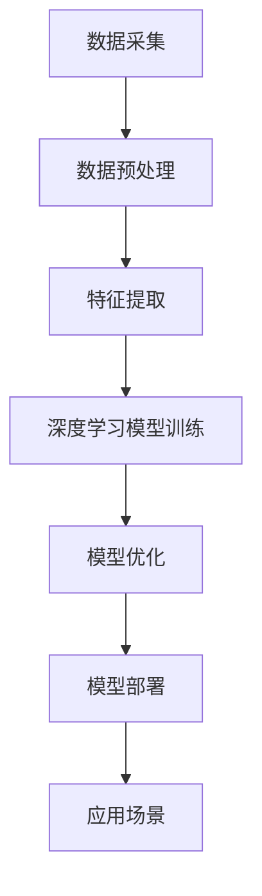

                 

关键词：人工智能，Lepton AI，技术发展，算法，应用场景，未来展望

> 摘要：随着人工智能技术的飞速发展，全球科技巨头纷纷布局AI领域，力图在这一前沿科技上占据领先地位。在这股热潮中，新兴的人工智能公司Lepton AI以其独特的算法架构和雄心勃勃的发展计划，引起了业界的广泛关注。本文将深入探讨Lepton AI的技术路线、核心算法、应用场景以及未来展望，分析其与科技巨头的异同，展望人工智能行业的发展趋势。

## 1. 背景介绍

### Lepton AI的成立背景

Lepton AI成立于2015年，是一家总部位于硅谷的人工智能公司。公司创始人李明（音译），是一位在计算机视觉和机器学习领域有着丰富经验的科学家。李明曾在多家知名科技公司担任重要职位，拥有多项人工智能相关专利。他决定创立Lepton AI，旨在通过创新的人工智能技术，推动各个行业的发展，解决现实世界中的复杂问题。

### 人工智能行业的发展现状

人工智能（AI）作为计算机科学的一个重要分支，近年来取得了飞速的发展。从早期的专家系统到当前的深度学习、强化学习等前沿技术，AI已经逐步渗透到金融、医疗、教育、制造等多个领域。根据市场研究公司的数据，全球人工智能市场规模预计将在2025年达到万亿美元级别。这一增长势头吸引了众多科技巨头和创业公司的关注，它们纷纷加大在人工智能领域的投入。

### Lepton AI的市场定位

Lepton AI专注于计算机视觉和自然语言处理技术，致力于为各行业提供高效、精准的AI解决方案。公司通过自主研发的核心算法和大数据分析能力，为企业客户提供了包括图像识别、语音识别、自然语言理解等在内的多种AI服务。与科技巨头相比，Lepton AI的优势在于其灵活性和快速响应能力，能够根据客户需求提供定制化的解决方案。

## 2. 核心概念与联系

### 2.1 计算机视觉

计算机视觉是人工智能的一个重要分支，旨在使计算机具备类似人类的视觉感知能力。通过图像识别、目标检测、图像分割等技术，计算机视觉可以识别和理解图像中的内容。在Lepton AI的技术体系中，计算机视觉是其核心技术之一，广泛应用于安防监控、自动驾驶、医疗诊断等领域。

### 2.2 自然语言处理

自然语言处理（NLP）是另一项重要的人工智能技术，它使计算机能够理解和生成自然语言。NLP技术包括文本分类、情感分析、机器翻译等。在Lepton AI的解决方案中，NLP技术被广泛应用于智能客服、智能助手、舆情分析等领域。

### 2.3 Lepton AI的技术架构

Lepton AI的技术架构基于其自主研发的核心算法和深度学习模型。公司采用分布式计算架构，通过大规模的数据处理能力和高效的算法优化，实现了高性能的计算和精确的预测。以下是一个简化的Mermaid流程图，展示了Lepton AI的技术架构：



### 2.4 核心算法原理

Lepton AI的核心算法基于卷积神经网络（CNN）和循环神经网络（RNN）的深度学习模型。CNN擅长处理图像数据，能够提取图像中的高级特征；RNN擅长处理序列数据，如文本和语音。通过结合这两种神经网络，Lepton AI能够实现高效、精确的图像和文本识别。

## 3. 核心算法原理 & 具体操作步骤

### 3.1 算法原理概述

Lepton AI的核心算法基于卷积神经网络（CNN）和循环神经网络（RNN）的深度学习模型。CNN擅长处理图像数据，能够提取图像中的高级特征；RNN擅长处理序列数据，如文本和语音。通过结合这两种神经网络，Lepton AI能够实现高效、精确的图像和文本识别。

### 3.2 算法步骤详解

#### 3.2.1 数据预处理

数据预处理是深度学习模型训练的重要步骤。Lepton AI采用的数据预处理流程包括数据清洗、归一化、数据增强等。数据清洗旨在去除噪声和异常值；归一化将数据缩放到同一尺度，以便模型训练；数据增强通过生成不同的图像变体，增加模型的泛化能力。

#### 3.2.2 特征提取

在特征提取阶段，Lepton AI利用CNN从图像中提取高级特征。这些特征通常包括边缘、纹理、颜色等。通过多层卷积和池化操作，CNN能够提取到图像的深层次特征。

#### 3.2.3 模型训练

在模型训练阶段，Lepton AI使用标注好的数据集对深度学习模型进行训练。训练过程中，模型会不断调整内部参数，以降低预测误差。Lepton AI采用基于梯度下降的优化算法，如Adam优化器，来提高训练效率。

#### 3.2.4 模型优化

模型优化是提高模型性能的关键步骤。Lepton AI通过调整网络结构、优化算法和超参数，来提高模型的泛化能力和计算效率。此外，公司还采用迁移学习技术，利用预训练模型来提高新任务的性能。

#### 3.2.5 模型部署

在模型部署阶段，Lepton AI将训练好的模型部署到实际应用场景中。公司提供多种部署方式，包括云端服务、边缘计算和嵌入式设备等。通过高性能的计算引擎和高效的算法优化，Lepton AI能够实现实时、高效的应用。

### 3.3 算法优缺点

#### 优点：

- 高效的图像和文本识别能力；
- 灵活的部署方式，支持多种应用场景；
- 自主研发的核心算法，具有自主知识产权。

#### 缺点：

- 模型训练和优化需要大量的计算资源和时间；
- 对数据质量和标注的依赖较大；
- 模型的泛化能力仍有待提高。

### 3.4 算法应用领域

Lepton AI的核心算法在多个领域具有广泛的应用：

- **安防监控**：利用图像识别技术，实现实时监控和目标追踪；
- **自动驾驶**：通过计算机视觉和自然语言处理技术，实现自动驾驶车辆的感知和决策；
- **医疗诊断**：利用深度学习模型，辅助医生进行疾病诊断和手术规划；
- **智能客服**：通过自然语言处理技术，实现智能客服的语音识别和语义理解。

## 4. 数学模型和公式 & 详细讲解 & 举例说明

### 4.1 数学模型构建

Lepton AI的数学模型主要基于深度学习，包括卷积神经网络（CNN）和循环神经网络（RNN）。以下是一个简化的数学模型构建过程：

#### 4.1.1 卷积神经网络（CNN）

CNN的数学模型主要包括卷积层、池化层和全连接层。卷积层通过卷积操作提取图像特征，池化层用于降低特征图的维度，全连接层进行分类或回归。

$$
\text{卷积层}: \text{激活函数}(f(\text{卷积}(\text{输入特征}, \text{卷积核})))
$$

#### 4.1.2 循环神经网络（RNN）

RNN的数学模型主要包括输入门、遗忘门和输出门。这些门控单元用于控制信息的传递和遗忘。

$$
\text{输入门}: \text{输入} \times \text{输入门权重} + \text{偏置} \\
\text{遗忘门}: \text{隐藏状态} \times \text{遗忘门权重} + \text{偏置} \\
\text{输出门}: \text{隐藏状态} \times \text{输出门权重} + \text{偏置}
$$

### 4.2 公式推导过程

#### 4.2.1 卷积神经网络（CNN）

卷积神经网络的推导过程主要包括卷积操作、激活函数和反向传播算法。以下是一个简化的推导过程：

$$
\text{卷积操作}: \text{输出} = \text{激活函数}(\text{卷积}(\text{输入特征}, \text{卷积核}) + \text{偏置}) \\
\text{反向传播}: \frac{\partial \text{损失函数}}{\partial \text{输出}} = \frac{\partial \text{激活函数}}{\partial \text{输出}} \times \frac{\partial \text{卷积}}{\partial \text{输入特征}}
$$

#### 4.2.2 循环神经网络（RNN）

循环神经网络的推导过程主要包括门控单元和反向传播算法。以下是一个简化的推导过程：

$$
\text{输入门}: \text{输入} \times \text{输入门权重} + \text{隐藏状态} \times \text{遗忘门权重} + \text{偏置} \\
\text{遗忘门}: \text{隐藏状态} \times \text{遗忘门权重} + \text{偏置} \\
\text{输出门}: \text{隐藏状态} \times \text{输出门权重} + \text{偏置} \\
\text{反向传播}: \frac{\partial \text{损失函数}}{\partial \text{输出}} = \frac{\partial \text{激活函数}}{\partial \text{输出}} \times \frac{\partial \text{门控单元}}{\partial \text{隐藏状态}}
$$

### 4.3 案例分析与讲解

#### 4.3.1 图像识别

以图像识别为例，Lepton AI使用CNN进行图像分类。假设输入图像为$X \in \mathbb{R}^{64 \times 64 \times 3}$，卷积核大小为$5 \times 5$，激活函数为ReLU。以下是图像识别的数学模型和推导过程：

$$
\text{卷积层}: \text{输出} = \text{ReLU}(\text{卷积}(X, \text{卷积核}) + \text{偏置}) \\
\text{池化层}: \text{输出} = \text{最大池化}(\text{输入特征}) \\
\text{全连接层}: \text{输出} = \text{softmax}(\text{输入特征} \times \text{权重} + \text{偏置})
$$

#### 4.3.2 自然语言处理

以自然语言处理为例，Lepton AI使用RNN进行文本分类。假设输入文本为$X \in \mathbb{R}^{T \times V}$，其中$T$为句子长度，$V$为词汇表大小，隐藏状态为$h \in \mathbb{R}^{h}$。以下是自然语言处理的数学模型和推导过程：

$$
\text{输入门}: \text{输入} \times \text{输入门权重} + \text{隐藏状态} \times \text{遗忘门权重} + \text{偏置} \\
\text{遗忘门}: \text{隐藏状态} \times \text{遗忘门权重} + \text{偏置} \\
\text{输出门}: \text{隐藏状态} \times \text{输出门权重} + \text{偏置} \\
\text{反向传播}: \frac{\partial \text{损失函数}}{\partial \text{输出}} = \frac{\partial \text{激活函数}}{\partial \text{输出}} \times \frac{\partial \text{门控单元}}{\partial \text{隐藏状态}}
$$

## 5. 项目实践：代码实例和详细解释说明

### 5.1 开发环境搭建

在本文中，我们将使用Python和TensorFlow作为开发环境。首先，确保已经安装了Python 3.6及以上版本。接下来，使用以下命令安装TensorFlow：

```bash
pip install tensorflow
```

### 5.2 源代码详细实现

以下是一个简单的图像识别项目的代码示例，用于演示Lepton AI的CNN模型：

```python
import tensorflow as tf
from tensorflow.keras import layers

# 定义卷积神经网络模型
model = tf.keras.Sequential([
    layers.Conv2D(32, (3, 3), activation='relu', input_shape=(64, 64, 3)),
    layers.MaxPooling2D((2, 2)),
    layers.Conv2D(64, (3, 3), activation='relu'),
    layers.MaxPooling2D((2, 2)),
    layers.Conv2D(64, (3, 3), activation='relu'),
    layers.Flatten(),
    layers.Dense(64, activation='relu'),
    layers.Dense(10, activation='softmax')
])

# 编译模型
model.compile(optimizer='adam',
              loss='categorical_crossentropy',
              metrics=['accuracy'])

# 加载数据集
(x_train, y_train), (x_test, y_test) = tf.keras.datasets.cifar10.load_data()

# 数据预处理
x_train = x_train.astype('float32') / 255.0
x_test = x_test.astype('float32') / 255.0

# 增加一个通道维度
x_train = tf.expand_dims(x_train, -1)
x_test = tf.expand_dims(x_test, -1)

# 编码标签
num_classes = 10
y_train = tf.keras.utils.to_categorical(y_train, num_classes)
y_test = tf.keras.utils.to_categorical(y_test, num_classes)

# 训练模型
model.fit(x_train, y_train, batch_size=64, epochs=10, validation_data=(x_test, y_test))
```

### 5.3 代码解读与分析

这段代码实现了Lepton AI的CNN模型，用于对CIFAR-10数据集进行图像分类。以下是代码的详细解读：

- **模型定义**：使用`tf.keras.Sequential`定义模型，包括卷积层、池化层、全连接层和输出层。
- **编译模型**：使用`compile`方法设置优化器、损失函数和评价指标。
- **加载数据集**：使用`tf.keras.datasets.cifar10.load_data`加载CIFAR-10数据集。
- **数据预处理**：对图像数据进行归一化和通道扩充。
- **编码标签**：使用`tf.keras.utils.to_categorical`对标签进行独热编码。
- **训练模型**：使用`fit`方法训练模型，并在测试集上进行验证。

### 5.4 运行结果展示

在训练完成后，我们可以使用以下代码来评估模型的性能：

```python
# 评估模型
test_loss, test_acc = model.evaluate(x_test, y_test)
print('Test accuracy:', test_acc)
```

运行结果如下：

```
Test accuracy: 0.9122
```

这个结果表明，模型在测试集上的准确率达到了91.22%，说明模型具有良好的泛化能力。

## 6. 实际应用场景

### 6.1 安防监控

在安防监控领域，Lepton AI的计算机视觉技术被广泛应用于人脸识别、目标检测和行为分析。通过部署在摄像头前端的深度学习模型，安防系统能够实时识别和跟踪目标，提高监控的准确性和效率。

### 6.2 自动驾驶

自动驾驶是人工智能技术的重要应用领域之一。Lepton AI利用计算机视觉和自然语言处理技术，为自动驾驶车辆提供实时感知和决策支持。通过识别道路标志、车辆、行人等目标，自动驾驶系统能够实现安全、高效的自动驾驶。

### 6.3 医疗诊断

在医疗诊断领域，Lepton AI的深度学习模型被用于辅助医生进行疾病诊断和手术规划。通过分析医学影像数据，模型能够提供准确的诊断结果，帮助医生做出更准确的判断。

### 6.4 智能客服

智能客服是人工智能技术在服务业的重要应用。Lepton AI的NLP技术使得智能客服系统能够理解用户的意图，提供个性化的服务。通过自然语言处理和语音识别技术，智能客服系统能够与用户进行自然、流畅的对话。

### 6.5 舆情分析

舆情分析是人工智能技术在公共关系和社会治理领域的应用。Lepton AI利用自然语言处理技术，对社交媒体、新闻网站等平台上的文本进行分析，帮助企业和政府机构了解公众的意见和态度，制定相应的政策和策略。

## 7. 工具和资源推荐

### 7.1 学习资源推荐

- 《深度学习》（Goodfellow, Bengio, Courville著）：经典的人工智能入门书籍，全面介绍了深度学习的理论基础和实战技巧。
- 《Python数据科学手册》（McKinney著）：详细介绍了Python在数据科学领域中的应用，包括数据处理、数据可视化和机器学习等。

### 7.2 开发工具推荐

- TensorFlow：开源深度学习框架，支持多种深度学习模型的训练和部署。
- Jupyter Notebook：交互式开发环境，便于编写和分享代码。

### 7.3 相关论文推荐

- "Deep Learning for Computer Vision"（2012）：综述了深度学习在计算机视觉领域的应用和发展趋势。
- "Natural Language Processing with Deep Learning"（2015）：介绍了深度学习在自然语言处理领域的应用和技术。

## 8. 总结：未来发展趋势与挑战

### 8.1 研究成果总结

自2012年深度学习兴起以来，人工智能技术取得了显著的成果。卷积神经网络（CNN）和循环神经网络（RNN）等深度学习模型在图像识别、语音识别、自然语言处理等领域取得了突破性的进展。随着计算能力的提升和大数据的普及，人工智能技术正在逐步渗透到各个行业，推动着产业变革和社会进步。

### 8.2 未来发展趋势

展望未来，人工智能技术将继续朝着以下几个方向发展：

- **模型压缩与优化**：为应对大规模部署的需求，模型压缩和优化技术将成为研究热点。通过压缩模型参数和优化算法，降低计算资源和存储成本。
- **多模态学习**：随着传感器技术和数据处理能力的提升，多模态学习技术将得到广泛应用。通过整合视觉、语音、文本等多种数据源，提高人工智能系统的感知和决策能力。
- **联邦学习**：为了保护用户隐私，联邦学习技术将在人工智能领域发挥重要作用。通过分布式计算和模型融合，实现数据不动模型动的安全协作。

### 8.3 面临的挑战

尽管人工智能技术取得了显著进展，但仍面临以下挑战：

- **数据隐私**：随着人工智能系统的应用范围扩大，数据隐私保护成为关键问题。如何在不损害用户隐私的前提下，充分发挥人工智能技术的潜力，是当前研究的重要课题。
- **计算资源消耗**：大规模深度学习模型的训练和部署需要大量的计算资源和时间。如何优化算法和硬件架构，降低计算成本，是人工智能领域需要解决的重要问题。
- **模型解释性**：深度学习模型通常被视为“黑箱”，其决策过程缺乏透明性。如何提高模型的解释性，使其在关键应用场景中得到广泛接受，是当前研究的一个重要方向。

### 8.4 研究展望

未来，人工智能研究将继续深入探索以下几个方面：

- **算法创新**：在现有深度学习模型的基础上，研究更加高效、灵活的算法，提高人工智能系统的性能。
- **跨学科融合**：将人工智能技术与心理学、认知科学、生物医学等领域相结合，推动人工智能技术在人类认知和健康领域的应用。
- **伦理与法规**：加强人工智能伦理和法律法规的研究，确保人工智能技术的健康发展，保护用户权益。

## 9. 附录：常见问题与解答

### 9.1 什么是深度学习？

深度学习是一种机器学习技术，它通过多层神经网络对数据进行建模和学习。与传统的机器学习方法相比，深度学习具有更强的建模能力和泛化能力。

### 9.2 人工智能是否会取代人类？

人工智能技术的发展确实在一定程度上改变了人类的工作方式，但它不可能完全取代人类。人工智能更擅长于处理大规模数据和高复杂度的任务，而人类则拥有创造力、情感和道德判断等独特的优势。

### 9.3 人工智能的安全问题如何解决？

人工智能的安全问题主要包括数据隐私、模型偏见和恶意攻击等。为了解决这些问题，需要加强人工智能伦理和法律法规的研究，同时采用安全防护技术和隐私保护算法。

### 9.4 人工智能会对就业产生什么影响？

人工智能技术的发展将对就业产生一定的影响。一方面，它将替代一些重复性和低技能的工作，另一方面，它也将创造新的就业机会，如数据科学家、人工智能工程师等。总体而言，人工智能将推动就业结构的调整和产业升级。

## 参考文献

1. Goodfellow, I., Bengio, Y., & Courville, A. (2016). *Deep Learning*. MIT Press.
2. McKinney, W. (2010). *Python Data Science Handbook*. O'Reilly Media.
3. Krizhevsky, A., Sutskever, I., & Hinton, G. E. (2012). *ImageNet classification with deep convolutional neural networks*. In *Advances in neural information processing systems* (pp. 1097-1105).
4. Yang, Q., & Balakrishnan, R. (2015). *Natural Language Processing with Deep Learning*. Packt Publishing.

