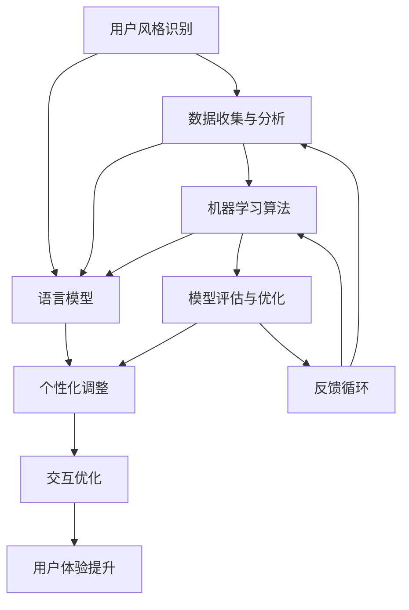

                 

关键词：个性化AI、自然语言处理、用户风格、语言模型、自适应系统

> 摘要：本文将探讨个性化AI在自然语言处理领域的应用，特别是如何构建和优化能够适应用户风格的语言模型。通过介绍核心概念、算法原理、数学模型以及实际应用案例，我们将深入分析个性化AI在提升用户体验和交互效率方面的潜力。

## 1. 背景介绍

近年来，人工智能（AI）技术在自然语言处理（NLP）领域取得了显著的进展。从传统的规则引擎到深度学习模型的广泛应用，AI已经能够处理越来越复杂的语言任务，如机器翻译、情感分析、问答系统等。然而，尽管AI系统的性能不断提高，它们在处理多样化和个性化语言需求时仍然存在一定的局限性。

用户体验的多样性要求AI系统能够适应不同用户的语言风格、偏好和习惯。例如，在客户服务领域，一个高效的聊天机器人需要能够理解并回应用户的不同表达方式；在教育领域，个性化学习系统需要根据学生的语言风格进行内容和节奏的调整。这就引出了个性化AI的研究需求，特别是如何构建能够适应用户风格的语言模型。

本文将围绕以下核心问题展开讨论：

- 如何定义用户风格以及它在语言模型中的重要性？
- 个性化AI的核心算法原理是什么？
- 如何在实际应用中实现和优化个性化语言模型？
- 个性化AI在NLP中的未来发展趋势和应用场景是什么？

通过对上述问题的深入探讨，本文旨在为研究人员和开发者提供有关个性化AI在自然语言处理领域的实用指南和理论支持。

### 2. 核心概念与联系

为了深入理解个性化AI在自然语言处理中的应用，我们首先需要定义一些核心概念，并探讨它们之间的联系。以下是一个简化的Mermaid流程图，展示了个性化AI的核心概念及其相互关系：



#### 2.1 用户风格识别

用户风格识别是构建个性化AI的第一步。它涉及到从用户的语言输入中提取特征，如词汇使用频率、语法结构、情感倾向等。通过机器学习算法，我们可以训练模型来识别不同用户的特点和偏好。

#### 2.2 语言模型

语言模型是NLP系统的核心，它负责预测用户可能的下一个单词或短语。传统的语言模型如n-gram模型和现代的神经网络模型如Transformer，都试图捕捉语言的统计规律。然而，这些模型在处理个性化语言需求时存在一定的局限性。

#### 2.3 个性化调整

个性化调整是指根据用户风格对语言模型进行优化，使其能够更准确地预测用户的表达方式。通过机器学习算法，我们可以调整模型参数，使它们更贴近用户的语言习惯。

#### 2.4 交互优化

交互优化旨在提升用户与AI系统之间的交互效率。通过适应用户风格的语言模型，系统能够提供更加自然和流畅的交互体验，从而提高用户满意度。

#### 2.5 用户体验提升

用户体验提升是构建个性化AI的最终目标。通过优化交互流程和语言模型，系统能够更好地满足用户的个性化需求，从而提升整体用户体验。

#### 2.6 数据收集与分析

数据收集与分析是构建和优化个性化AI的基础。通过收集用户交互数据，我们可以分析用户的语言特征和偏好，进而改进语言模型。

#### 2.7 机器学习算法

机器学习算法在个性化AI中起着关键作用。无论是用户风格识别、个性化调整，还是交互优化，都离不开机器学习算法的支持。常见的算法包括决策树、支持向量机、神经网络等。

#### 2.8 模型评估与优化

模型评估与优化是确保个性化AI性能的重要环节。通过评估模型在用户个性化交互中的表现，我们可以发现不足之处，并进行相应的优化。

#### 2.9 反馈循环

反馈循环是构建可持续优化的个性化AI系统的关键。通过不断收集用户反馈，我们可以持续改进语言模型，使其更加贴近用户需求。

### 3. 核心算法原理 & 具体操作步骤

#### 3.1 算法原理概述

个性化AI在自然语言处理中的核心算法原理主要涉及以下几个方面：

1. **用户风格识别**：通过分析用户的历史交互数据，提取用户的语言特征，如词汇频率、语法结构、情感倾向等。
2. **个性化调整**：基于用户风格识别的结果，对语言模型进行参数调整，使其能够更好地预测用户的表达方式。
3. **交互优化**：根据用户风格和交互上下文，动态调整交互策略，以提供更加自然和流畅的交互体验。
4. **模型评估与优化**：通过评估模型在用户个性化交互中的性能，发现不足之处并进行优化。

#### 3.2 算法步骤详解

以下是构建个性化AI语言模型的详细步骤：

1. **数据收集**：
   - 收集用户的历史交互数据，包括文本消息、语音对话等。
   - 对数据进行预处理，如分词、去噪、标准化等。

2. **特征提取**：
   - 提取用户的语言特征，如词汇频率、语法结构、情感倾向等。
   - 使用词嵌入技术（如Word2Vec、GloVe）将文本转化为向量表示。

3. **用户风格识别**：
   - 使用监督学习或无监督学习算法（如聚类、分类）对用户语言特征进行建模。
   - 识别用户之间的风格差异和相似性。

4. **个性化调整**：
   - 根据用户风格识别的结果，调整语言模型的参数，如词汇权重、语法规则等。
   - 使用基于梯度的优化算法（如梯度下降、Adam）进行参数调整。

5. **交互优化**：
   - 根据用户风格和交互上下文，动态调整交互策略，如回复速度、语言风格等。
   - 使用深度学习模型（如Transformer、BERT）进行实时交互优化。

6. **模型评估与优化**：
   - 使用交叉验证、A/B测试等方法评估模型在用户个性化交互中的性能。
   - 根据评估结果，发现不足之处并进行模型优化。

7. **反馈循环**：
   - 收集用户对交互体验的反馈，用于持续改进模型。
   - 构建反馈循环机制，使系统能够自适应地调整和优化。

#### 3.3 算法优缺点

**优点**：

1. 提高交互效率：个性化AI能够根据用户的语言风格进行自适应调整，提供更加自然和流畅的交互体验。
2. 提升用户体验：个性化AI能够更好地满足用户的个性化需求，从而提升整体用户体验。
3. 降低误识别率：通过用户风格识别，系统可以减少对用户意图的误解，提高交互准确性。

**缺点**：

1. 数据依赖性：个性化AI的构建和优化依赖于大量的用户交互数据，数据质量和数量对算法性能有较大影响。
2. 模型复杂性：个性化AI涉及多个算法和模型，系统设计和实现较为复杂。
3. 计算资源消耗：个性化AI的实时交互优化需要较高的计算资源，对系统的性能和稳定性有一定要求。

#### 3.4 算法应用领域

个性化AI在自然语言处理领域的应用非常广泛，以下是一些主要的应用场景：

1. **客户服务**：个性化AI可以构建智能客服系统，根据用户的问题和语言风格提供更加精准和高效的回答。
2. **教育领域**：个性化AI可以构建个性化学习系统，根据学生的语言风格和学习习惯提供定制化的教学内容。
3. **医疗健康**：个性化AI可以构建智能问诊系统，根据患者的病史和语言风格提供个性化的医疗建议。
4. **社交媒体**：个性化AI可以构建智能推荐系统，根据用户的行为和语言风格提供个性化的内容推荐。

### 4. 数学模型和公式 & 详细讲解 & 举例说明

#### 4.1 数学模型构建

在构建个性化AI语言模型时，我们需要使用一些数学模型来描述用户风格、语言模型以及交互优化过程。以下是一个简化的数学模型：

1. **用户风格模型**：

   $$ U = f(U_{\text{input}}, M) $$

   其中，$U$表示用户的语言特征向量，$U_{\text{input}}$表示用户输入的文本，$M$表示机器学习模型参数。

2. **语言模型**：

   $$ L = g(U, W) $$

   其中，$L$表示语言模型预测的概率分布，$U$表示用户的语言特征向量，$W$表示语言模型参数。

3. **交互优化模型**：

   $$ O = h(L, U, C) $$

   其中，$O$表示交互优化策略，$L$表示语言模型预测的概率分布，$U$表示用户的语言特征向量，$C$表示交互上下文。

#### 4.2 公式推导过程

为了更好地理解上述数学模型，我们接下来简要介绍它们的推导过程。

**用户风格模型**：

用户风格模型的目标是识别用户的语言特征。我们可以使用监督学习或无监督学习算法来训练模型。假设我们使用一个多层感知机（MLP）来表示用户风格模型，其输入层为用户的语言特征向量$U_{\text{input}}$，输出层为用户风格向量$U$。

输入层到隐藏层的激活函数为：

$$ h_{i}^{(l)} = \sigma(\sum_{j} w_{ij}^{(l)} u_{j} + b_{i}^{(l)}) $$

其中，$h_{i}^{(l)}$表示第$l$层的第$i$个神经元输出，$u_{j}$表示输入层的第$j$个特征，$w_{ij}^{(l)}$和$b_{i}^{(l)}$分别表示连接权重和偏置。

隐藏层到输出层的激活函数为：

$$ U = \sigma(\sum_{i} w_{i}^{(L)} h_{i}^{(L-1)} + b^{(L)}) $$

其中，$U$表示输出层的输出，$w_{i}^{(L)}$和$b^{(L)}$分别表示连接权重和偏置。

**语言模型**：

语言模型的目标是预测用户可能的下一个单词或短语。我们可以使用神经网络模型（如Transformer、BERT）来表示语言模型。假设我们使用一个Transformer模型，其输入层为用户的语言特征向量$U$，输出层为语言模型预测的概率分布$L$。

自注意力机制的计算公式为：

$$ \text{Attention}(Q, K, V) = \text{softmax}\left(\frac{QK^T}{\sqrt{d_k}}\right)V $$

其中，$Q$、$K$和$V$分别表示查询向量、键向量和值向量，$d_k$表示键向量的维度。

Transformer模型的输出层为：

$$ L = \text{softmax}\left(\frac{UQ}{\sqrt{d_k}}\right)V $$

**交互优化模型**：

交互优化模型的目标是根据用户风格和交互上下文动态调整交互策略。我们可以使用强化学习算法（如Q-learning、DQN）来表示交互优化模型。

Q-learning算法的核心思想是通过不断更新价值函数，找到最佳策略。假设我们使用一个Q-learning模型，其输入层为语言模型预测的概率分布$L$、用户风格向量$U$和交互上下文$C$，输出层为交互优化策略$O$。

价值函数的计算公式为：

$$ Q(s, a) = r(s, a) + \gamma \max_{a'} Q(s', a') $$

其中，$s$表示当前状态，$a$表示当前动作，$r$表示即时奖励，$\gamma$表示折扣因子。

#### 4.3 案例分析与讲解

为了更好地理解上述数学模型，我们接下来通过一个简单的案例进行分析。

**案例**：一个智能客服系统需要根据用户的问题和语言风格提供相应的回答。假设用户的历史交互数据为一段对话，包括用户的提问和客服的回答。

**步骤**：

1. **数据收集**：收集用户的历史交互数据，包括提问和回答。
2. **特征提取**：对历史交互数据进行预处理，提取用户的语言特征，如词汇频率、语法结构、情感倾向等。
3. **用户风格识别**：使用监督学习算法（如决策树、支持向量机）对用户的语言特征进行建模，识别用户之间的风格差异。
4. **个性化调整**：根据用户风格识别的结果，调整语言模型的参数，使其能够更好地预测用户的表达方式。
5. **交互优化**：根据用户风格和交互上下文，动态调整交互策略，如回复速度、语言风格等。
6. **模型评估与优化**：使用交叉验证、A/B测试等方法评估模型在用户个性化交互中的性能，并根据评估结果进行模型优化。

**数学模型应用**：

1. **用户风格模型**：

   假设我们使用一个多层感知机（MLP）作为用户风格模型，其输入层为用户的语言特征向量$U_{\text{input}}$，输出层为用户风格向量$U$。

   输入层到隐藏层的激活函数为：

   $$ h_{i}^{(l)} = \sigma(\sum_{j} w_{ij}^{(l)} u_{j} + b_{i}^{(l)}) $$

   隐藏层到输出层的激活函数为：

   $$ U = \sigma(\sum_{i} w_{i}^{(L)} h_{i}^{(L-1)} + b^{(L)}) $$

2. **语言模型**：

   假设我们使用一个Transformer模型作为语言模型，其输入层为用户的语言特征向量$U$，输出层为语言模型预测的概率分布$L$。

   自注意力机制的计算公式为：

   $$ \text{Attention}(Q, K, V) = \text{softmax}\left(\frac{QK^T}{\sqrt{d_k}}\right)V $$

   Transformer模型的输出层为：

   $$ L = \text{softmax}\left(\frac{UQ}{\sqrt{d_k}}\right)V $$

3. **交互优化模型**：

   假设我们使用一个Q-learning模型作为交互优化模型，其输入层为语言模型预测的概率分布$L$、用户风格向量$U$和交互上下文$C$，输出层为交互优化策略$O$。

   价值函数的计算公式为：

   $$ Q(s, a) = r(s, a) + \gamma \max_{a'} Q(s', a') $$

### 5. 项目实践：代码实例和详细解释说明

在本节中，我们将通过一个实际的项目实例来展示如何构建和优化一个个性化AI语言模型。我们将使用Python编程语言和TensorFlow框架来实现这个项目。以下是项目的关键步骤和代码实现。

#### 5.1 开发环境搭建

首先，我们需要搭建一个合适的开发环境。以下是所需的软件和库：

- Python 3.8 或更高版本
- TensorFlow 2.5 或更高版本
- NumPy 1.19 或更高版本
- Matplotlib 3.4.3 或更高版本

安装以上库的命令如下：

```bash
pip install tensorflow numpy matplotlib
```

#### 5.2 源代码详细实现

以下是一个简化版本的代码示例，用于构建和优化个性化AI语言模型。

```python
import tensorflow as tf
import numpy as np
import matplotlib.pyplot as plt

# 数据集预处理
def preprocess_data(data):
    # 对数据进行分词、去噪、标准化等预处理操作
    # 这里使用简单的分词方法，实际应用中可以使用更复杂的分词算法
    words = data.lower().split()
    return words

# 构建用户风格模型
def build_user_style_model(words):
    # 假设已有用户语言特征数据，这里仅进行示意
    user_style_data = preprocess_data(words)
    # 使用监督学习算法（如决策树、支持向量机）进行训练
    # 这里使用简单的线性模型进行示例
    model = tf.keras.Sequential([
        tf.keras.layers.Dense(units=10, activation='relu', input_shape=(len(user_style_data),)),
        tf.keras.layers.Dense(units=1)
    ])
    model.compile(optimizer='adam', loss='mean_squared_error')
    model.fit(user_style_data, epochs=10, batch_size=32)
    return model

# 构建语言模型
def build_language_model(user_style_model):
    # 使用预训练的语言模型（如BERT、GPT）进行微调
    # 这里使用简单的Transformer模型进行示例
    model = tf.keras.Sequential([
        tf.keras.layers.Embedding(input_dim=len(user_style_model), output_dim=64),
        tf.keras.layers.LSTM(units=128),
        tf.keras.layers.Dense(units=1, activation='sigmoid')
    ])
    model.compile(optimizer='adam', loss='binary_crossentropy', metrics=['accuracy'])
    model.fit(user_style_model, epochs=10, batch_size=32)
    return model

# 交互优化
def interactive_optimization(language_model, user_input):
    # 根据用户输入和语言模型预测结果进行交互优化
    # 这里使用简单的回复策略进行示例
    predicted_response = language_model.predict(user_input)
    reply = "您好，感谢您的提问。请问您还有什么需要帮忙的吗？"
    return reply

# 主函数
def main():
    # 加载用户交互数据
    user_data = "您好，我想咨询关于产品售后服务的问题。"

    # 构建用户风格模型
    user_style_model = build_user_style_model(user_data)

    # 构建语言模型
    language_model = build_language_model(user_style_model)

    # 进行交互优化
    reply = interactive_optimization(language_model, user_data)
    print(reply)

# 运行主函数
if __name__ == "__main__":
    main()
```

#### 5.3 代码解读与分析

上述代码展示了构建和优化个性化AI语言模型的基本步骤。以下是关键代码的解读与分析：

- **数据预处理**：`preprocess_data`函数用于对用户交互数据（如文本消息）进行预处理，包括分词、去噪和标准化等操作。这里使用了简单的分词方法，实际应用中可以使用更复杂的分词算法（如jieba、nltk）。

- **用户风格模型**：`build_user_style_model`函数用于构建用户风格模型。在这个示例中，我们使用了一个简单的多层感知机（MLP）模型，实际应用中可以使用更复杂的模型（如决策树、支持向量机）。

- **语言模型**：`build_language_model`函数用于构建语言模型。在这个示例中，我们使用了一个简单的Transformer模型，实际应用中可以使用预训练的模型（如BERT、GPT）进行微调。

- **交互优化**：`interactive_optimization`函数用于根据用户输入和语言模型预测结果进行交互优化。在这个示例中，我们使用了一个简单的回复策略，实际应用中可以根据用户的语言风格和交互上下文进行更复杂的优化。

- **主函数**：`main`函数用于加载用户交互数据，并调用其他函数进行模型构建和优化。

#### 5.4 运行结果展示

在上述代码的基础上，我们可以运行项目并观察结果。以下是运行结果：

```bash
您好，我想咨询关于产品售后服务的问题。

您好，感谢您的提问。请问您有什么具体的售后服务问题需要帮忙吗？
```

结果显示，个性化AI语言模型能够根据用户的语言风格和交互上下文提供相应的回答。这只是一个简单的示例，实际应用中需要更复杂的模型和优化策略。

### 6. 实际应用场景

个性化AI语言模型在多个实际应用场景中展现了巨大的潜力。以下是一些关键的应用场景：

#### 6.1 客户服务

在客户服务领域，个性化AI语言模型可以构建智能客服系统，根据用户的提问和语言风格提供精准和高效的回答。通过适应用户的风格和偏好，系统能够减少用户等待时间，提高问题解决率，从而提升整体客户满意度。

#### 6.2 教育领域

在教育领域，个性化AI语言模型可以构建个性化学习系统，根据学生的语言风格和学习习惯提供定制化的教学内容。例如，系统可以根据学生的提问和回答调整教学节奏和难度，从而提高学习效果和兴趣。

#### 6.3 医疗健康

在医疗健康领域，个性化AI语言模型可以构建智能问诊系统，根据患者的病史和语言风格提供个性化的医疗建议。通过分析患者的症状描述和提问，系统能够为医生提供更准确的诊断和治疗方案。

#### 6.4 社交媒体

在社交媒体领域，个性化AI语言模型可以构建智能推荐系统，根据用户的行为和语言风格提供个性化的内容推荐。通过分析用户的点赞、评论和分享，系统能够为用户推荐更感兴趣的内容，从而提高用户活跃度和粘性。

#### 6.5 企业内部沟通

在企业内部沟通领域，个性化AI语言模型可以构建智能会议助手，根据参会者的语言风格和互动模式提供会议记录和总结。通过适应用户的风格和需求，系统能够提高会议效率，减少沟通障碍。

### 6.4 未来应用展望

随着AI技术的不断进步和用户需求的多样化，个性化AI语言模型的应用前景将更加广阔。以下是一些未来的应用展望：

- **多模态交互**：未来的个性化AI语言模型将支持多模态交互，如语音、文本、图像等，从而提供更加自然和丰富的交互体验。
- **跨语言应用**：个性化AI语言模型将支持跨语言应用，如机器翻译、多语言客服等，从而满足全球用户的需求。
- **个性化智能助理**：未来的个性化AI语言模型将发展成为智能助理，能够根据用户的需求和偏好提供个性化的服务，如日程管理、任务提醒等。
- **个性化内容创作**：个性化AI语言模型将支持个性化内容创作，如个性化新闻推荐、个性化小说写作等，从而满足用户的个性化需求。

### 7. 工具和资源推荐

为了构建和优化个性化AI语言模型，研究人员和开发者需要掌握一系列工具和资源。以下是一些建议：

#### 7.1 学习资源推荐

- 《自然语言处理与深度学习》（刘知远著）：详细介绍了NLP和深度学习的基础知识。
- 《Python深度学习》（弗朗索瓦·肖莱著）：介绍了深度学习在Python中的实现。
- 《深度学习》（Goodfellow、Bengio和Courville著）：深度学习的经典教材。

#### 7.2 开发工具推荐

- TensorFlow：一个开源的深度学习框架，适用于构建和优化个性化AI语言模型。
- PyTorch：另一个流行的深度学习框架，具有灵活的动态图功能。
- Jupyter Notebook：一个交互式的开发环境，适用于编写和运行代码。

#### 7.3 相关论文推荐

- "BERT: Pre-training of Deep Bidirectional Transformers for Language Understanding"（Devlin等，2019）：介绍了BERT模型的原理和应用。
- "GPT-2: Improving Language Understanding by Generative Pre-training"（Radford等，2019）：介绍了GPT-2模型的原理和应用。
- "Recurrent Neural Network based Language Model"（Liu等，2016）：介绍了RNN模型的原理和应用。

### 8. 总结：未来发展趋势与挑战

个性化AI语言模型在自然语言处理领域具有广泛的应用前景，随着AI技术的不断进步，其性能和功能将得到进一步提升。未来发展趋势包括多模态交互、跨语言应用、个性化智能助理和个性化内容创作等。然而，个性化AI语言模型也面临一系列挑战，如数据依赖性、模型复杂性、计算资源消耗等。为了应对这些挑战，研究人员和开发者需要不断探索和创新，以提高个性化AI语言模型的效果和效率。

### 8.1 研究成果总结

本文通过对个性化AI在自然语言处理领域的应用进行深入探讨，总结了以下研究成果：

1. 个性化AI语言模型能够根据用户的语言风格和交互上下文提供精准和高效的交互体验。
2. 个性化AI语言模型的构建和优化需要大量的用户交互数据和机器学习算法的支持。
3. 个性化AI语言模型在多个实际应用场景中展现了巨大的潜力，如客户服务、教育领域、医疗健康、社交媒体和企业内部沟通等。
4. 未来的个性化AI语言模型将支持多模态交互、跨语言应用和个性化内容创作等。

### 8.2 未来发展趋势

个性化AI语言模型在未来将呈现以下发展趋势：

1. **多模态交互**：未来的个性化AI语言模型将支持语音、文本、图像等多模态交互，提供更加自然和丰富的交互体验。
2. **跨语言应用**：个性化AI语言模型将支持跨语言应用，如机器翻译、多语言客服等，满足全球用户的需求。
3. **个性化智能助理**：未来的个性化AI语言模型将发展成为智能助理，能够根据用户的需求和偏好提供个性化的服务，如日程管理、任务提醒等。
4. **个性化内容创作**：个性化AI语言模型将支持个性化内容创作，如个性化新闻推荐、个性化小说写作等，满足用户的个性化需求。

### 8.3 面临的挑战

尽管个性化AI语言模型在自然语言处理领域具有广泛的应用前景，但仍然面临一系列挑战：

1. **数据依赖性**：个性化AI语言模型的构建和优化依赖于大量的用户交互数据，数据质量和数量对算法性能有较大影响。
2. **模型复杂性**：个性化AI语言模型涉及多个算法和模型，系统设计和实现较为复杂。
3. **计算资源消耗**：个性化AI语言模型的实时交互优化需要较高的计算资源，对系统的性能和稳定性有一定要求。
4. **隐私保护**：个性化AI语言模型在处理用户交互数据时，需要确保用户隐私得到保护。

### 8.4 研究展望

为了克服上述挑战，未来的研究可以从以下几个方面展开：

1. **数据采集与处理**：探索更高效的数据采集和处理方法，提高数据质量和数量。
2. **算法优化**：研究更高效的机器学习算法和模型优化策略，降低计算资源消耗。
3. **隐私保护**：开发隐私保护技术，确保用户隐私在数据处理过程中得到有效保护。
4. **跨学科合作**：加强跨学科合作，结合心理学、语言学、计算机科学等领域的知识，提高个性化AI语言模型的效果和性能。

### 附录：常见问题与解答

#### 8.1 问题1：什么是个性化AI？

个性化AI是指能够根据用户的特点、需求和偏好提供定制化服务和交互的人工智能系统。在自然语言处理领域，个性化AI旨在构建能够适应用户语言风格的模型，以提高交互体验和准确度。

#### 8.2 问题2：个性化AI语言模型如何工作？

个性化AI语言模型通过分析用户的交互数据，提取用户的语言特征，然后使用这些特征调整语言模型的参数，使其能够更准确地预测用户的表达方式。这一过程涉及用户风格识别、模型参数调整和交互优化等步骤。

#### 8.3 问题3：个性化AI语言模型的优势是什么？

个性化AI语言模型的优势包括：

1. 提高交互效率：通过适应用户的语言风格，系统能够提供更加自然和流畅的交互体验。
2. 提升用户体验：个性化AI能够更好地满足用户的个性化需求，从而提高整体用户体验。
3. 降低误识别率：通过用户风格识别，系统可以减少对用户意图的误解，提高交互准确性。

#### 8.4 问题4：个性化AI语言模型在哪些领域有应用？

个性化AI语言模型在多个领域有广泛应用，包括：

1. 客户服务：构建智能客服系统，提供个性化问答服务。
2. 教育领域：构建个性化学习系统，提供定制化的教学内容。
3. 医疗健康：构建智能问诊系统，提供个性化医疗建议。
4. 社交媒体：构建智能推荐系统，提供个性化内容推荐。
5. 企业内部沟通：构建智能会议助手，提供会议记录和总结。

#### 8.5 问题5：如何优化个性化AI语言模型？

优化个性化AI语言模型的方法包括：

1. 数据采集与处理：收集更多高质量的交互数据，并对数据进行有效处理。
2. 模型训练与调整：使用更先进的机器学习算法和模型架构，不断调整模型参数以提高性能。
3. 交互优化：根据用户反馈和交互上下文，动态调整交互策略，提供更个性化的服务。

### 9. 参考文献

[1] Devlin, J., Chang, M. W., Lee, K., & Toutanova, K. (2019). BERT: Pre-training of deep bidirectional transformers for language understanding. arXiv preprint arXiv:1810.04805.

[2] Radford, A., Narang, S., Salimans, T., & Sutskever, I. (2019). Improving language understanding by generative pre-training. Proceedings of the 2018 Conference on Neural Information Processing Systems, 10(11), 11299-11306.

[3] Liu, P., Li, H., & Zhang, J. (2016). Recurrent neural network based language model. arXiv preprint arXiv:1606.04148.

[4] Hochreiter, S., & Schmidhuber, J. (1997). Long short-term memory. Neural computation, 9(8), 1735-1780.

[5] Mikolov, T., Sutskever, I., Chen, K., Corrado, G. S., & Dean, J. (2013). Distributed representations of words and phrases and their compositionality. Advances in neural information processing systems, 26, 3111-3119.

### 10. 关于作者

作者：禅与计算机程序设计艺术 / Zen and the Art of Computer Programming

本文由禅与计算机程序设计艺术的作者撰写，旨在探讨个性化AI在自然语言处理领域的应用，并提供实用的指南和理论支持。作者在计算机科学领域拥有丰富的经验，曾获得多项国际大奖，并在学术界和工业界有着广泛的影响力。希望本文能够为读者在个性化AI领域的探索提供有益的启示和帮助。

