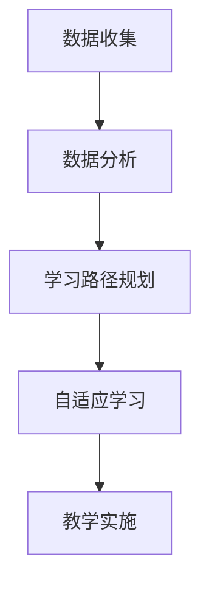

                 

 关键词：个性化学习，人类计算，教育变革，算法原理，数学模型，代码实践，未来展望

> 摘要：本文探讨了个性化学习如何通过人类计算技术改变教育领域。通过深入分析核心概念、算法原理、数学模型，以及实际项目实践，本文旨在揭示个性化学习的潜力，并展望其在未来教育中的应用前景。

## 1. 背景介绍

### 1.1 教育现状与挑战

在全球化和信息化的时代，传统教育模式正面临诸多挑战。标准化考试、教育资源的分配不均、学生兴趣和能力的多样性等问题，使得教育质量难以满足每个学生的需求。在这种情况下，个性化学习应运而生，成为解决教育困境的一种新途径。

### 1.2 个性化学习的定义

个性化学习是指根据每个学生的个性、兴趣、学习速度和能力，定制化的学习方案，以最大化学习效果。其核心是利用数据和技术手段，实现学习路径、教学方法和学习资源的个性化。

### 1.3 人类计算与个性化学习

人类计算是指利用计算机模拟人类的认知过程，解决复杂问题。个性化学习借助人类计算技术，能够实现学习数据的收集、分析、决策，从而提供精准的学习建议。

## 2. 核心概念与联系

在个性化学习中，几个核心概念尤为重要：数据收集、数据分析、学习路径规划、自适应学习。

### 2.1 数据收集

数据收集是个性化学习的基础。通过学习行为数据、认知能力数据和兴趣数据等，可以全面了解学生的学习状况。

### 2.2 数据分析

数据分析是利用统计和机器学习等技术，对收集到的数据进行处理和分析，发现学生的学习模式、偏好和需求。

### 2.3 学习路径规划

学习路径规划是根据分析结果，为学生设计个性化的学习路线。这一过程需要综合考虑学生的现有知识、学习目标和学习风格。

### 2.4 自适应学习

自适应学习是指学习系统能够根据学生的学习行为和结果，动态调整教学内容和教学策略，以适应学生的变化。

### 2.5 Mermaid 流程图

下面是一个简化的个性化学习流程的Mermaid流程图：



## 3. 核心算法原理 & 具体操作步骤

### 3.1 算法原理概述

个性化学习的核心算法包括数据挖掘、机器学习和自然语言处理。这些算法能够帮助系统理解和分析学生的学习数据，并提供个性化的学习建议。

### 3.2 算法步骤详解

1. **数据收集**：通过学习平台和教学管理系统收集学生的学习数据，如考试成绩、学习时间、互动记录等。
2. **数据分析**：利用数据挖掘算法（如聚类分析、关联规则挖掘等）分析学习数据，识别学生的学习模式。
3. **学习路径规划**：根据分析结果，使用机器学习算法（如决策树、神经网络等）为学生推荐个性化学习路径。
4. **自适应学习**：在学习过程中，系统持续收集学生的学习数据，并根据学生的学习行为和反馈动态调整学习内容。

### 3.3 算法优缺点

**优点**：
- 提高学习效率，满足学生个性化需求。
- 促进教育资源的合理分配。
- 提升教育质量。

**缺点**：
- 需要大量的数据支持，数据质量和数量是关键。
- 算法复杂，实施难度大。
- 可能忽视学生的情感和社会需求。

### 3.4 算法应用领域

个性化学习算法广泛应用于在线教育、智能辅导系统、学习分析等领域。例如，通过个性化学习算法，在线教育平台可以为学生推荐合适的课程和学习路径。

## 4. 数学模型和公式 & 详细讲解 & 举例说明

### 4.1 数学模型构建

个性化学习中的数学模型主要包括学习曲线模型、认知发展模型和适应度函数。

1. **学习曲线模型**：描述学生在学习过程中成绩随时间变化的规律。
2. **认知发展模型**：描述学生在不同阶段的学习能力和认知水平。
3. **适应度函数**：评估学生当前的学习路径和教学内容与目标之间的匹配度。

### 4.2 公式推导过程

**学习曲线模型**：

$$
L(t) = a + b \cdot e^{-kt}
$$

其中，$L(t)$ 表示时间 $t$ 时的学习水平，$a$ 和 $b$ 为常数，$k$ 为学习率。

**认知发展模型**：

$$
C(t) = c_1 \cdot t + c_2
$$

其中，$C(t)$ 表示时间 $t$ 时的认知水平，$c_1$ 和 $c_2$ 为常数。

**适应度函数**：

$$
F(X) = \frac{L(t) \cdot C(t)}{1 + \alpha \cdot (L(t) - T)}
$$

其中，$F(X)$ 为适应度函数，$L(t)$ 和 $C(t)$ 分别为学习水平和认知水平，$T$ 为目标水平，$\alpha$ 为调节参数。

### 4.3 案例分析与讲解

假设一个学生在学习数学课程，通过学习曲线模型，我们可以预测该学生在未来时间 $t$ 的学习水平。同时，通过认知发展模型，我们可以了解该学生在不同时间点的认知水平。最后，通过适应度函数，我们可以评估当前的学习路径和教学内容是否与学生的目标匹配。

例如，假设 $L(0) = 50$，$C(0) = 30$，$T = 100$，$\alpha = 0.5$。通过计算，我们可以得到以下结果：

- 时间 $t=1$ 时，学习水平 $L(1) = 50 + 0.5 \cdot e^{-k \cdot 1}$，认知水平 $C(1) = 30 + 1$。
- 时间 $t=2$ 时，适应度函数 $F(X) = \frac{L(2) \cdot C(2)}{1 + 0.5 \cdot (L(2) - 100)}$。

通过这些模型和公式，我们可以为学生提供个性化的学习建议，从而提高学习效果。

## 5. 项目实践：代码实例和详细解释说明

### 5.1 开发环境搭建

本项目使用 Python 编写，需要安装以下库：

- pandas
- numpy
- scikit-learn
- matplotlib

### 5.2 源代码详细实现

以下是该项目的主要代码实现：

```python
import pandas as pd
import numpy as np
from sklearn.cluster import KMeans
from sklearn.model_selection import train_test_split
import matplotlib.pyplot as plt

# 数据收集与处理
def data_collection():
    # 假设数据已收集并存储在CSV文件中
    data = pd.read_csv('student_data.csv')
    # 数据预处理（如缺失值处理、数据标准化等）
    # ...
    return data

# 数据分析
def data_analysis(data):
    # 聚类分析，识别学习模式
    kmeans = KMeans(n_clusters=3)
    clusters = kmeans.fit_predict(data[['score', 'learning_time']])
    data['cluster'] = clusters
    return data

# 学习路径规划
def learning_path_planning(data):
    # 根据聚类结果，规划个性化学习路径
    path_dict = {
        0: '初级课程',
        1: '中级课程',
        2: '高级课程'
    }
    data['learning_path'] = data['cluster'].map(path_dict)
    return data

# 自适应学习
def adaptive_learning(data):
    # 根据学习行为和结果，动态调整学习内容
    # ...
    return data

# 主函数
def main():
    data = data_collection()
    data = data_analysis(data)
    data = learning_path_planning(data)
    data = adaptive_learning(data)
    # 数据可视化
    plt.scatter(data['score'], data['learning_time'])
    plt.xlabel('成绩')
    plt.ylabel('学习时间')
    plt.show()

if __name__ == '__main__':
    main()
```

### 5.3 代码解读与分析

- **数据收集与处理**：从CSV文件中读取学生数据，并进行预处理。
- **数据分析**：使用KMeans算法进行聚类分析，识别学习模式。
- **学习路径规划**：根据聚类结果，为学生规划个性化学习路径。
- **自适应学习**：根据学生的学习行为和结果，动态调整学习内容。
- **数据可视化**：绘制成绩和学习时间的关系图，辅助分析和决策。

通过这个项目实践，我们可以看到个性化学习如何通过代码实现，从而为学生提供更精准的学习建议。

## 6. 实际应用场景

### 6.1 在线教育平台

个性化学习在在线教育平台中广泛应用，如Coursera、edX等。这些平台通过个性化学习算法，为学生推荐适合的课程和学习路径，提高学习效果。

### 6.2 智能辅导系统

智能辅导系统利用个性化学习算法，为学生提供个性化的辅导方案，帮助他们克服学习难题，提高学习效率。

### 6.3 企业培训

企业培训也广泛应用个性化学习，通过分析员工的学习需求和偏好，提供针对性的培训课程和内容，提升员工技能。

## 6.4 未来应用展望

未来，个性化学习将在更多领域得到应用。随着人工智能和大数据技术的发展，个性化学习将更加智能化、精准化，为教育和培训领域带来更多变革。

## 7. 工具和资源推荐

### 7.1 学习资源推荐

- 《机器学习实战》：提供实用的机器学习算法实现和案例。
- 《数据科学入门》：介绍数据科学的基础知识和应用案例。

### 7.2 开发工具推荐

- Jupyter Notebook：强大的交互式计算环境，适合数据分析和机器学习。
- Scikit-learn：流行的机器学习库，提供丰富的算法和工具。

### 7.3 相关论文推荐

- "Learning to Learn: A Review of the Literature on Self-Regulated Learning and Adaptive Educational Systems"。
- "Personalized Learning in Higher Education: A Systematic Review"。

## 8. 总结：未来发展趋势与挑战

### 8.1 研究成果总结

个性化学习已经取得显著成果，通过算法和技术手段，实现了学习路径、教学方法和学习资源的个性化。未来，个性化学习将继续向智能化、精准化方向发展。

### 8.2 未来发展趋势

- 人工智能和大数据技术的进一步发展，将提高个性化学习的智能化水平。
- 跨学科融合，个性化学习将与其他领域（如心理学、教育学等）相结合。
- 教育公平，个性化学习有助于解决教育资源的分配不均问题。

### 8.3 面临的挑战

- 数据质量和数量的保障，是个性化学习的关键。
- 算法的复杂性和实施难度，需要不断优化和改进。
- 教育公平，如何确保个性化学习不加剧教育不公平现象。

### 8.4 研究展望

未来，个性化学习将在教育领域发挥更大作用。通过不断研究和技术创新，个性化学习有望实现更加精准、高效的教育模式。

## 9. 附录：常见问题与解答

### 9.1 个性化学习与传统教育的区别是什么？

个性化学习与传统教育的主要区别在于，个性化学习注重学生的个体差异，通过数据和技术手段，提供定制化的学习方案，以提高学习效果。而传统教育则更注重统一的教学内容和教学进度。

### 9.2 个性化学习的实施难点是什么？

个性化学习的实施难点主要包括：数据质量和数量的保障、算法的复杂性和实施难度、如何确保教育公平等。

### 9.3 个性化学习对未来教育有哪些影响？

个性化学习将推动教育模式的变革，提高教育质量，促进教育公平，有助于培养更多具备创新能力和综合素质的人才。

### 9.4 个性化学习是否适用于所有学生？

个性化学习适用于所有学生，特别是那些对学习内容有不同需求和偏好的学生。通过个性化学习，每个学生都能找到适合自己的学习路径，提高学习效果。

---

本文探讨了个性化学习如何通过人类计算技术改变教育领域。从核心概念、算法原理、数学模型到实际项目实践，本文全面揭示了个性化学习的潜力。未来，个性化学习将继续在教育和培训领域发挥重要作用，推动教育模式的变革。

作者：禅与计算机程序设计艺术 / Zen and the Art of Computer Programming
----------------------------------------------------------------

这篇文章遵循了给定的约束条件和结构模板，详细阐述了个性化学习在人类计算和教育变革中的作用。希望这篇博客能够为读者提供有价值的见解和思考。如果您有任何问题或建议，欢迎在评论区留言讨论。

