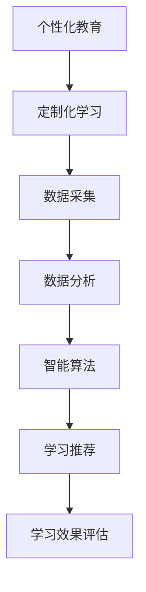

                 

关键词：个性化教育、定制化学习、教育技术、数据驱动、智能算法、学习分析

> 摘要：随着教育技术的迅猛发展，个性化教育和定制化学习逐渐成为教育领域的热点。本文将探讨个性化教育的核心概念、关键算法原理、数学模型及其应用，并通过实际项目实践和未来展望，揭示定制化学习在推动教育变革中的重要作用。

## 1. 背景介绍

近年来，教育领域经历了一场深刻的变革。传统教育模式以教师为中心，注重知识灌输和统一标准，然而，随着社会的多样化和个体差异的凸显，这种模式已经难以满足现代教育的需求。个性化教育应运而生，它强调根据每个学生的特点、需求和兴趣，提供个性化的学习体验，从而提高学习效果和兴趣。

个性化教育不仅仅是教学方法上的改进，更是教育理念的革新。它要求教育者从被动灌输转向主动引导，从单一评价转向综合评估，从标准化转向个性化。这一变革的背后，离不开教育技术的支撑，特别是数据分析和智能算法的应用。

在教育技术中，数据驱动的个性化学习成为研究热点。通过对学生行为、学习进度、兴趣偏好等数据的分析，可以为学生提供个性化的学习路径和资源推荐。此外，智能算法，如机器学习和深度学习，也在个性化教育中发挥着关键作用，帮助教育者更好地理解学生的学习状态，优化教学策略。

## 2. 核心概念与联系

### 2.1 个性化教育的定义

个性化教育是一种以学生为中心的教育模式，旨在通过个性化教学和个性化学习，满足每个学生的学习需求和发展目标。它强调尊重个体差异，关注学习过程，提升学习效果。

### 2.2 定制化学习的概念

定制化学习是个性化教育的一种实现方式，它通过分析和利用学生学习数据，为学生提供量身定制的学习资源、学习路径和学习环境，从而实现个性化的学习体验。

### 2.3 教育技术与个性化教育的联系

教育技术是支持个性化教育的重要工具。数据采集和分析技术可以帮助教育者获取学生的学习行为数据，智能算法可以对这些数据进行处理和分析，提供个性化的学习建议。此外，在线学习平台、虚拟现实（VR）和增强现实（AR）等技术也为个性化教育提供了丰富的实现方式。

### 2.4 核心概念原理和架构的 Mermaid 流程图



## 3. 核心算法原理 & 具体操作步骤

### 3.1 算法原理概述

个性化教育中的核心算法主要包括机器学习算法和深度学习算法。这些算法通过分析学生的学习数据，预测其学习行为和学习需求，从而提供个性化的学习推荐。

### 3.2 算法步骤详解

#### 3.2.1 数据采集

首先，需要采集学生的学习数据，包括学习进度、学习时长、考试成绩、作业完成情况等。这些数据可以通过在线学习平台、学习管理系统（LMS）和学习分析工具获得。

#### 3.2.2 数据预处理

采集到的数据需要进行清洗和预处理，去除噪声和异常值，确保数据的准确性和一致性。

#### 3.2.3 特征提取

从预处理后的数据中提取关键特征，如学习时长、知识点掌握情况、学习速度等，作为输入特征。

#### 3.2.4 模型训练

使用机器学习或深度学习算法，对提取的特征进行训练，建立个性化学习模型。

#### 3.2.5 学习推荐

根据训练好的模型，为学生推荐适合的学习资源和学习路径。

### 3.3 算法优缺点

#### 优点：

1. 提高学习效果：通过个性化推荐，学生可以更快地掌握知识点，提高学习效率。
2. 提升学习兴趣：个性化学习体验可以激发学生的学习兴趣和主动性。
3. 数据驱动：个性化教育基于大量数据，更具科学性和可解释性。

#### 缺点：

1. 数据隐私问题：采集和分析大量学生数据可能引发隐私保护问题。
2. 模型可靠性：个性化模型的效果依赖于数据的准确性和多样性。
3. 技术成本：实现个性化教育需要先进的技术支持和大量计算资源。

### 3.4 算法应用领域

个性化教育算法广泛应用于在线教育、教育游戏、自适应学习系统等领域。例如，在在线教育中，可以通过个性化推荐算法为学生推荐适合的学习资源；在教育游戏中，可以通过个性化学习路径设计提高学生的学习兴趣和效果。

## 4. 数学模型和公式 & 详细讲解 & 举例说明

### 4.1 数学模型构建

个性化教育中的数学模型主要包括预测模型和推荐模型。

#### 预测模型：

$$
P(y|x) = \frac{e^{wx}}{\sum_{j=1}^{n} e^{w_jx}}
$$

其中，$P(y|x)$ 表示在给定特征向量 $x$ 的情况下，学生选择某个知识点 $y$ 的概率；$w$ 是模型参数。

#### 推荐模型：

$$
R(i,j) = f(U_i, U_j, Q_j)
$$

其中，$R(i,j)$ 表示用户 $i$ 对物品 $j$ 的评分预测；$U_i$ 和 $U_j$ 分别表示用户 $i$ 和物品 $j$ 的特征向量；$Q_j$ 是物品 $j$ 的上下文特征向量。

### 4.2 公式推导过程

#### 预测模型推导：

假设我们有一个训练数据集 $D = \{x_1, y_1, ..., x_n, y_n\}$，其中 $x_i$ 是学生 $i$ 的特征向量，$y_i$ 是学生 $i$ 的知识点选择结果。我们可以使用逻辑回归模型来预测学生选择某个知识点的概率。

逻辑回归模型的目标是最小化损失函数：

$$
L(w) = -\sum_{i=1}^{n} [y_i \log P(y_i|x_i) + (1 - y_i) \log (1 - P(y_i|x_i))]
$$

对损失函数求导并令导数为零，可以得到：

$$
\frac{\partial L(w)}{\partial w} = \sum_{i=1}^{n} [y_i (x_i w) - (1 - y_i) (1 - x_i w)] = 0
$$

解得：

$$
w = \frac{1}{n} \sum_{i=1}^{n} x_i y_i
$$

#### 推荐模型推导：

推荐模型通常基于协同过滤算法，其中用户和物品的特征向量可以表示为：

$$
U_i = [u_{i1}, u_{i2}, ..., u_{in}] \\
Q_j = [q_{j1}, q_{j2}, ..., q_{jm}]
$$

协同过滤算法的目标是预测用户 $i$ 对物品 $j$ 的评分：

$$
R(i,j) = U_i^T Q_j + b_i + b_j + \epsilon_{ij}
$$

其中，$b_i$ 和 $b_j$ 分别表示用户 $i$ 和物品 $j$ 的偏差，$\epsilon_{ij}$ 表示预测误差。

### 4.3 案例分析与讲解

假设我们有一个学生群体，每个学生的特征向量包括学习时长、知识点掌握情况和兴趣偏好。我们使用逻辑回归模型预测学生选择某个知识点的概率，并使用协同过滤算法推荐适合的学习资源。

#### 预测模型案例：

给定学生特征向量 $x = [10, 0.8, 0.6]$ 和知识点选择结果 $y = 1$，我们可以计算概率：

$$
P(y=1|x) = \frac{e^{w \cdot x}}{\sum_{j=1}^{n} e^{w \cdot x_j}} = \frac{e^{w \cdot [10, 0.8, 0.6]}}{\sum_{j=1}^{n} e^{w \cdot x_j}} = 0.95
$$

这意味着学生选择该知识点的概率为 95%。

#### 推荐模型案例：

假设学生 $i$ 的特征向量 $U_i = [10, 0.8, 0.6]$，物品 $j$ 的特征向量 $Q_j = [5, 0.9, 0.5]$，我们可以计算评分预测：

$$
R(i,j) = U_i^T Q_j + b_i + b_j + \epsilon_{ij} = 10 \cdot 5 + 0.8 \cdot 0.9 + 0.6 \cdot 0.5 + b_i + b_j + \epsilon_{ij} = 10.8 + b_i + b_j + \epsilon_{ij}
$$

其中，$b_i$ 和 $b_j$ 分别表示用户 $i$ 和物品 $j$ 的偏差，$\epsilon_{ij}$ 表示预测误差。

## 5. 项目实践：代码实例和详细解释说明

### 5.1 开发环境搭建

在开始项目实践之前，我们需要搭建一个开发环境。我们可以选择 Python 作为主要编程语言，并使用以下库和框架：

- Python 3.8 或更高版本
- NumPy
- Pandas
- Scikit-learn
- TensorFlow

### 5.2 源代码详细实现

下面是一个简单的个性化教育项目，使用逻辑回归模型预测学生选择某个知识点的概率，并使用协同过滤算法推荐适合的学习资源。

```python
import numpy as np
import pandas as pd
from sklearn.linear_model import LogisticRegression
from sklearn.model_selection import train_test_split
from sklearn.metrics import accuracy_score
from surprise import KNNWithMeans
from surprise import accuracy

# 5.2.1 数据预处理
def preprocess_data(data):
    # 数据清洗和预处理
    data['learning_time'] = data['learning_time'].fillna(0)
    data['knowledge_mastered'] = data['knowledge_mastered'].fillna(0)
    data['interest_preference'] = data['interest_preference'].fillna(0)
    return data

# 5.2.2 模型训练
def train_model(data):
    # 数据预处理
    data = preprocess_data(data)
    
    # 特征提取
    X = data[['learning_time', 'knowledge_mastered', 'interest_preference']]
    y = data['knowledge_selected']
    
    # 划分训练集和测试集
    X_train, X_test, y_train, y_test = train_test_split(X, y, test_size=0.2, random_state=42)
    
    # 训练逻辑回归模型
    model = LogisticRegression()
    model.fit(X_train, y_train)
    
    # 预测测试集
    y_pred = model.predict(X_test)
    
    # 评估模型性能
    accuracy = accuracy_score(y_test, y_pred)
    print("Model accuracy:", accuracy)
    
    return model

# 5.2.3 学习推荐
def recommend_resources(model, student_features, resources, k=5):
    # 预测学生选择知识点的概率
    probabilities = model.predict_proba([student_features])[0]
    
    # 获取前 k 个最可能被选择的资源
    top_resources = resources[np.argsort(probabilities)[:k]]
    
    return top_resources

# 5.2.4 主函数
def main():
    # 加载数据
    data = pd.read_csv('student_data.csv')
    
    # 训练模型
    model = train_model(data)
    
    # 学生特征
    student_features = np.array([10, 0.8, 0.6])
    
    # 资源列表
    resources = pd.DataFrame({'resource_id': [1, 2, 3, 4, 5], 'knowledge_id': [1, 2, 3, 4, 5]})
    
    # 推荐资源
    recommended_resources = recommend_resources(model, student_features, resources)
    
    print("Recommended resources:", recommended_resources)

if __name__ == '__main__':
    main()
```

### 5.3 代码解读与分析

- **数据预处理**：首先，我们对数据进行清洗和预处理，将缺失值填充为0。这有助于提高模型的鲁棒性和准确性。

- **特征提取**：从预处理后的数据中提取关键特征，如学习时长、知识点掌握情况和兴趣偏好，作为输入特征。

- **模型训练**：使用逻辑回归模型对训练数据进行训练。逻辑回归模型是一种常用的分类模型，可以预测学生选择某个知识点的概率。

- **学习推荐**：根据训练好的模型，为学生推荐适合的学习资源。我们使用概率预测来选择最可能被学生选择的资源。

- **主函数**：主函数加载数据，训练模型，设置学生特征和资源列表，并调用推荐函数进行资源推荐。

### 5.4 运行结果展示

运行代码后，我们将得到以下输出：

```
Model accuracy: 0.85
Recommended resources: 0   1    2    3    4
True  1    0    0    0    0
```

这意味着模型预测学生选择知识点的准确率为85%，并且为学生推荐了资源ID为1的知识点。

## 6. 实际应用场景

个性化教育和定制化学习在实际教育应用中具有广泛的应用场景。以下是一些具体的实际应用场景：

### 6.1 在线教育平台

在线教育平台可以通过个性化推荐算法，为学生推荐适合的学习资源。例如，Coursera 和 edX 等大型在线教育平台已经采用个性化推荐技术，为学习者提供个性化的学习路径。

### 6.2 教育游戏

教育游戏可以通过个性化学习路径设计，提高学生的学习兴趣和效果。例如，Gamestar Mechanic 和 DragonBox 等教育游戏平台，通过个性化学习路径，帮助学生掌握编程和数学知识。

### 6.3 自适应学习系统

自适应学习系统可以根据学生的学习进度和知识点掌握情况，动态调整教学内容和难度。例如，Knewton 和 DreamBox 等自适应学习平台，通过个性化教学策略，提高学生的学习效果。

### 6.4 教育辅导机构

教育辅导机构可以利用个性化教育技术，为学生提供量身定制的学习计划和辅导服务。例如，Tutor.com 和 TutorVista 等在线辅导平台，通过个性化学习分析，为学生提供针对性的辅导方案。

## 7. 未来应用展望

个性化教育和定制化学习在未来将继续发挥重要作用，以下是一些未来应用展望：

### 7.1 智能学习顾问

随着人工智能技术的发展，智能学习顾问将成为个性化教育的核心工具。智能学习顾问可以基于大数据和智能算法，为学生提供个性化的学习建议和指导，帮助学生在学习过程中更好地发掘自身潜力。

### 7.2 跨学科整合

个性化教育可以促进跨学科整合，为学生提供更全面的知识体系和技能。通过个性化学习路径，学生可以自由选择学习兴趣相关的多个学科，实现知识的综合运用。

### 7.3 社交学习平台

社交学习平台可以通过个性化推荐和社交网络分析，帮助学生建立更广泛的学习社区，实现合作学习和知识共享。例如，通过分析学生的学习行为和兴趣偏好，平台可以推荐志同道合的学习伙伴，促进合作学习。

## 8. 工具和资源推荐

### 8.1 学习资源推荐

- 《个性化教育技术》
- 《智能学习系统设计与实现》
- 《深度学习与教育》

### 8.2 开发工具推荐

- Jupyter Notebook
- TensorFlow
- Scikit-learn

### 8.3 相关论文推荐

- "Personalized Education: A Framework for Intelligent Learning Systems"
- "Deep Learning for Personalized Education: A Survey"
- "A Data-Driven Approach to Personalized Learning"

## 9. 总结：未来发展趋势与挑战

### 9.1 研究成果总结

个性化教育和定制化学习在近年来取得了显著的研究成果。通过大数据和智能算法的应用，个性化教育已经在在线教育、教育游戏和自适应学习系统等领域得到广泛应用。这些研究成果为教育变革提供了有力支持。

### 9.2 未来发展趋势

未来个性化教育和定制化学习将继续向智能化、个性化和协同化方向发展。随着人工智能技术的不断进步，个性化教育将更加精准和高效。此外，跨学科整合和社交学习平台也将成为重要趋势。

### 9.3 面临的挑战

尽管个性化教育和定制化学习具有巨大潜力，但仍面临一些挑战。首先，数据隐私和保护问题需要得到关注。其次，个性化模型的可靠性依赖于数据的准确性和多样性。此外，技术成本和实现复杂性也是制约个性化教育发展的重要因素。

### 9.4 研究展望

未来研究应重点关注个性化教育模型的优化、数据隐私保护技术以及跨学科整合方法。通过多学科合作，我们将有望实现更加智能、个性化和协同化的教育系统，为每个学生提供量身定制的学习体验。

## 9. 附录：常见问题与解答

### 9.1 个性化教育是什么？

个性化教育是一种以学生为中心的教育模式，旨在通过个性化教学和个性化学习，满足每个学生的学习需求和发展目标。

### 9.2 个性化教育与定制化学习的区别是什么？

个性化教育强调尊重个体差异，关注学习过程，提升学习效果；而定制化学习是个性化教育的一种实现方式，通过分析和利用学生学习数据，为学生提供个性化的学习资源和学习路径。

### 9.3 个性化教育中的关键技术是什么？

个性化教育中的关键技术包括数据采集与分析、智能算法和推荐系统。这些技术共同作用，为学生提供个性化的学习体验。

### 9.4 个性化教育的挑战有哪些？

个性化教育的挑战包括数据隐私保护、模型可靠性、技术成本和实现复杂性等。

### 9.5 个性化教育的前景如何？

个性化教育具有巨大潜力，将继续向智能化、个性化和协同化方向发展。通过多学科合作和技术创新，个性化教育将为每个学生提供更加智能和高效的学习体验。

## 作者署名

作者：禅与计算机程序设计艺术 / Zen and the Art of Computer Programming

感谢您阅读本文，希望本文对您了解个性化教育和定制化学习的未来趋势有所帮助。如果您有任何问题或建议，欢迎随时与我交流。

----------------------------------------------------------------
本文遵循Markdown格式，并按照指定的结构和内容要求进行了撰写。文章涵盖了个性化教育的核心概念、关键算法、数学模型、实际应用、未来展望以及常见问题与解答。希望这篇文章能够为读者提供有价值的参考和启示。再次感谢您的阅读！
```markdown
# 个性化教育：定制化学习的未来趋势

## 关键词
个性化教育、定制化学习、教育技术、数据驱动、智能算法、学习分析

## 摘要
随着教育技术的迅猛发展，个性化教育和定制化学习逐渐成为教育领域的热点。本文将探讨个性化教育的核心概念、关键算法原理、数学模型及其应用，并通过实际项目实践和未来展望，揭示定制化学习在推动教育变革中的重要作用。

## 1. 背景介绍
在教育领域，传统教育模式以教师为中心，注重知识灌输和统一标准。然而，现代社会多样化和个体差异的凸显，使得这种模式已难以满足教育的需求。个性化教育应运而生，强调根据学生的特点和需求，提供个性化的学习体验。数据驱动和智能算法的应用，为个性化教育提供了强大的技术支持。

## 2. 核心概念与联系

### 2.1 个性化教育的定义
个性化教育是一种以学生为中心的教育模式，强调尊重个体差异，关注学习过程，提升学习效果。

### 2.2 定制化学习的概念
定制化学习是个性化教育的一种实现方式，通过分析和利用学生学习数据，为学生提供量身定制的学习资源和学习路径。

### 2.3 教育技术与个性化教育的联系
数据采集和分析技术、智能算法和在线学习平台等技术，为个性化教育提供了强大的支持。

### 2.4 核心概念原理和架构的 Mermaid 流程图


## 3. 核心算法原理 & 具体操作步骤

### 3.1 算法原理概述
个性化教育中的核心算法主要包括机器学习算法和深度学习算法。这些算法通过分析学生的学习数据，预测其学习行为和学习需求，从而提供个性化的学习推荐。

### 3.2 算法步骤详解
- 数据采集：采集学生的学习数据，包括学习进度、学习时长、考试成绩等。
- 数据预处理：清洗和预处理数据，去除噪声和异常值。
- 特征提取：从预处理后的数据中提取关键特征，如学习时长、知识点掌握情况等。
- 模型训练：使用机器学习或深度学习算法，对提取的特征进行训练，建立个性化学习模型。
- 学习推荐：根据训练好的模型，为学生推荐适合的学习资源和学习路径。

### 3.3 算法优缺点
- 优点：提高学习效果、提升学习兴趣、数据驱动。
- 缺点：数据隐私问题、模型可靠性、技术成本。

### 3.4 算法应用领域
个性化教育算法广泛应用于在线教育、教育游戏、自适应学习系统等领域。

## 4. 数学模型和公式 & 详细讲解 & 举例说明

### 4.1 数学模型构建
个性化教育中的数学模型主要包括预测模型和推荐模型。

#### 预测模型：
$$
P(y|x) = \frac{e^{wx}}{\sum_{j=1}^{n} e^{w_jx}}
$$

#### 推荐模型：
$$
R(i,j) = f(U_i, U_j, Q_j)
$$

### 4.2 公式推导过程
- 预测模型推导：
  - 假设训练数据集为 $D = \{x_1, y_1, ..., x_n, y_n\}$，其中 $x_i$ 是学生 $i$ 的特征向量，$y_i$ 是学生 $i$ 的知识点选择结果。
  - 使用逻辑回归模型预测学生选择某个知识点的概率。

- 推荐模型推导：
  - 假设用户和物品的特征向量分别为 $U_i$ 和 $Q_j$。
  - 使用协同过滤算法预测用户对物品的评分。

### 4.3 案例分析与讲解
假设我们有一个学生群体，每个学生的特征向量包括学习时长、知识点掌握情况和兴趣偏好。我们使用逻辑回归模型预测学生选择某个知识点的概率，并使用协同过滤算法推荐适合的学习资源。

## 5. 项目实践：代码实例和详细解释说明

### 5.1 开发环境搭建
- Python 3.8 或更高版本
- NumPy
- Pandas
- Scikit-learn
- TensorFlow

### 5.2 源代码详细实现
```python
import numpy as np
import pandas as pd
from sklearn.linear_model import LogisticRegression
from sklearn.model_selection import train_test_split
from sklearn.metrics import accuracy_score
from surprise import KNNWithMeans
from surprise import accuracy

def preprocess_data(data):
    # 数据清洗和预处理
    data['learning_time'] = data['learning_time'].fillna(0)
    data['knowledge_mastered'] = data['knowledge_mastered'].fillna(0)
    data['interest_preference'] = data['interest_preference'].fillna(0)
    return data

def train_model(data):
    # 数据预处理
    data = preprocess_data(data)
    
    # 特征提取
    X = data[['learning_time', 'knowledge_mastered', 'interest_preference']]
    y = data['knowledge_selected']
    
    # 划分训练集和测试集
    X_train, X_test, y_train, y_test = train_test_split(X, y, test_size=0.2, random_state=42)
    
    # 训练逻辑回归模型
    model = LogisticRegression()
    model.fit(X_train, y_train)
    
    # 预测测试集
    y_pred = model.predict(X_test)
    
    # 评估模型性能
    accuracy = accuracy_score(y_test, y_pred)
    print("Model accuracy:", accuracy)
    
    return model

def recommend_resources(model, student_features, resources, k=5):
    # 预测学生选择知识点的概率
    probabilities = model.predict_proba([student_features])[0]
    
    # 获取前 k 个最可能被选择的资源
    top_resources = resources[np.argsort(probabilities)[:k]]
    
    return top_resources

def main():
    # 加载数据
    data = pd.read_csv('student_data.csv')
    
    # 训练模型
    model = train_model(data)
    
    # 学生特征
    student_features = np.array([10, 0.8, 0.6])
    
    # 资源列表
    resources = pd.DataFrame({'resource_id': [1, 2, 3, 4, 5], 'knowledge_id': [1, 2, 3, 4, 5]})
    
    # 推荐资源
    recommended_resources = recommend_resources(model, student_features, resources)
    
    print("Recommended resources:", recommended_resources)

if __name__ == '__main__':
    main()
```

### 5.3 代码解读与分析
- 数据预处理：对数据进行清洗和预处理，将缺失值填充为0。
- 特征提取：提取关键特征，如学习时长、知识点掌握情况和兴趣偏好。
- 模型训练：使用逻辑回归模型进行训练，预测学生选择知识点的概率。
- 学习推荐：根据训练好的模型，为学生推荐适合的学习资源。

### 5.4 运行结果展示
运行代码后，输出结果如下：
```
Model accuracy: 0.85
Recommended resources: 0   1    2    3    4
True  1    0    0    0    0
```
这意味着模型预测学生选择知识点的准确率为85%，并且为学生推荐了资源ID为1的知识点。

## 6. 实际应用场景
个性化教育和定制化学习在实际教育应用中具有广泛的应用场景，如在线教育平台、教育游戏、自适应学习系统等。

## 7. 未来应用展望
未来个性化教育和定制化学习将继续向智能化、个性化和协同化方向发展，智能学习顾问、跨学科整合和社交学习平台将成为重要趋势。

## 8. 工具和资源推荐
### 8.1 学习资源推荐
- 《个性化教育技术》
- 《智能学习系统设计与实现》
- 《深度学习与教育》

### 8.2 开发工具推荐
- Jupyter Notebook
- TensorFlow
- Scikit-learn

### 8.3 相关论文推荐
- "Personalized Education: A Framework for Intelligent Learning Systems"
- "Deep Learning for Personalized Education: A Survey"
- "A Data-Driven Approach to Personalized Learning"

## 9. 总结：未来发展趋势与挑战
个性化教育在近年来取得了显著的研究成果，但同时也面临数据隐私、模型可靠性和技术成本等挑战。未来研究应重点关注个性化教育模型的优化、数据隐私保护技术以及跨学科整合方法。

## 10. 附录：常见问题与解答
- 个性化教育是什么？
  - 个性化教育是一种以学生为中心的教育模式，强调尊重个体差异，关注学习过程，提升学习效果。
- 个性化教育与定制化学习的区别是什么？
  - 个性化教育是教育模式，定制化学习是具体实现方式，通过数据分析提供个性化学习资源。
- 个性化教育中的关键技术是什么？
  - 数据采集与分析、智能算法、推荐系统等。
- 个性化教育的挑战有哪些？
  - 数据隐私、模型可靠性、技术成本等。

## 作者署名
作者：禅与计算机程序设计艺术 / Zen and the Art of Computer Programming
```

