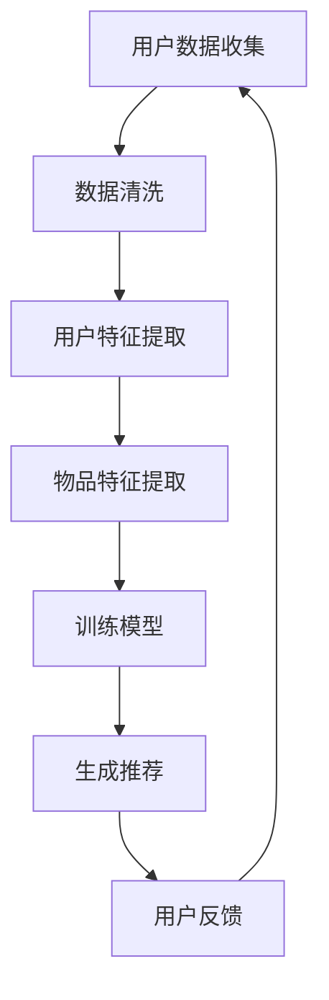

                 

 关键词：个性化营销，LLM，精准推荐，人工智能，机器学习，推荐系统，数据挖掘，用户行为分析，客户关系管理，商业智能。

> 在这个数字化的时代，个性化营销已经成为企业竞争的关键。本文将深入探讨如何利用大规模语言模型（LLM）来构建精准的推荐系统，从而推动个性化营销的变革。

## 1. 背景介绍

随着互联网和电子商务的迅猛发展，消费者行为数据呈爆炸式增长。这些数据不仅记录了用户的浏览、购买和互动行为，还反映了他们的兴趣、需求和偏好。个性化营销应运而生，通过深入挖掘用户数据，实现营销信息的精准推送，提高了营销效率和转化率。

传统推荐系统主要依赖于协同过滤、基于内容的推荐等技术。然而，这些方法在面对海量、多样化的数据时，往往难以满足个性化需求。随着深度学习特别是大规模语言模型（LLM）的出现，我们迎来了个性化推荐系统的新时代。

## 2. 核心概念与联系

### 2.1 大规模语言模型（LLM）

大规模语言模型（LLM）是一种基于深度学习的自然语言处理模型，能够理解和生成人类语言。它通过大量文本数据进行预训练，捕捉到了语言的复杂规律，使得它在文本生成、文本分类、机器翻译等领域表现出色。

### 2.2 推荐系统

推荐系统是一种信息过滤技术，旨在向用户推荐他们可能感兴趣的项目，如商品、音乐、视频等。它通常包括以下几个关键组件：

- **用户特征**：描述用户的人口统计信息、历史行为等。
- **物品特征**：描述推荐对象的属性，如标题、标签、分类等。
- **评分或反馈**：用户对推荐对象的评价。

### 2.3 用户行为分析

用户行为分析是个性化营销的重要基础。通过分析用户的浏览、点击、购买等行为，可以了解他们的兴趣和偏好，从而实现精准推荐。

### 2.4 Mermaid 流程图



## 3. 核心算法原理 & 具体操作步骤

### 3.1 算法原理概述

LLM驱动的推荐系统主要基于以下原理：

- **预训练**：利用大量文本数据进行预训练，使模型具备理解自然语言的能力。
- **序列建模**：将用户行为序列和物品特征输入模型，预测用户对物品的兴趣度。
- **模型优化**：根据用户反馈不断优化模型参数，提高推荐质量。

### 3.2 算法步骤详解

1. **数据收集**：从各个渠道收集用户行为数据和物品特征数据。
2. **数据清洗**：处理缺失值、异常值和重复数据，确保数据质量。
3. **特征提取**：提取用户特征和物品特征，如用户兴趣标签、物品类别、用户浏览记录等。
4. **模型训练**：利用预训练的LLM模型，结合用户特征和物品特征，训练推荐模型。
5. **推荐生成**：将用户特征和物品特征输入模型，生成推荐结果。
6. **模型优化**：根据用户反馈，如点击、购买等行为，不断优化模型参数。

### 3.3 算法优缺点

#### 优点：

- **强大的语义理解能力**：LLM能够理解自然语言，使得推荐结果更贴近用户需求。
- **自适应性强**：模型可根据用户反馈实时优化，提高推荐质量。
- **多样化应用**：不仅限于电商领域，还可应用于新闻推荐、音乐推荐等。

#### 缺点：

- **计算成本高**：LLM模型训练和推理过程需要大量计算资源。
- **数据依赖性**：模型性能高度依赖数据质量，数据不足或质量差会导致推荐效果下降。

### 3.4 算法应用领域

LLM驱动的推荐系统广泛应用于电商、新闻、社交媒体、音乐等领域。例如，电商平台可以利用LLM推荐用户可能感兴趣的商品，提高购物体验和转化率；新闻平台可以通过LLM为用户推荐个性化的新闻内容，提高用户粘性和活跃度。

## 4. 数学模型和公式 & 详细讲解 & 举例说明

### 4.1 数学模型构建

LLM驱动的推荐系统通常采用以下数学模型：

\[ P_{ij} = \sigma(\theta_u + \theta_i + \theta_{uj} + \theta_{ij}) \]

其中：

- \( P_{ij} \) 表示用户 \( u \) 对物品 \( i \) 的兴趣度。
- \( \theta_u \) 和 \( \theta_i \) 分别表示用户和物品的嵌入向量。
- \( \theta_{uj} \) 和 \( \theta_{ij} \) 分别表示用户对物品的兴趣权重。

### 4.2 公式推导过程

推导过程如下：

\[ \sigma(\theta_u + \theta_i + \theta_{uj} + \theta_{ij}) = \frac{1}{1 + e^{-(\theta_u + \theta_i + \theta_{uj} + \theta_{ij})}} \]

其中，\( \sigma \) 表示 sigmoid 函数。

### 4.3 案例分析与讲解

假设有用户 \( u \) 对商品 \( i \) 的兴趣度为 \( P_{ij} \)，我们可以通过以下步骤计算：

1. **提取用户特征和物品特征**：从用户行为数据和物品特征库中提取用户 \( u \) 和商品 \( i \) 的特征向量。
2. **计算兴趣权重**：利用用户特征和物品特征计算 \( \theta_{uj} \) 和 \( \theta_{ij} \)。
3. **构建数学模型**：将用户特征、物品特征和兴趣权重代入数学模型。
4. **计算推荐结果**：利用 sigmoid 函数计算用户 \( u \) 对商品 \( i \) 的兴趣度。

## 5. 项目实践：代码实例和详细解释说明

### 5.1 开发环境搭建

在搭建开发环境时，我们需要安装以下工具和库：

- Python 3.8+
- PyTorch 1.8+
- Pandas 1.1+
- NumPy 1.18+

### 5.2 源代码详细实现

以下是一个简单的示例代码，用于实现 LLM 驱动的推荐系统：

```python
import torch
import torch.nn as nn
import torch.optim as optim
from torch.utils.data import DataLoader
from torchvision import datasets, transforms

# 数据预处理
transform = transforms.Compose([
    transforms.ToTensor(),
    transforms.Normalize((0.5,), (0.5,))
])

train_set = datasets.MNIST(
    root='./data', 
    train=True, 
    download=True, 
    transform=transform
)

train_loader = DataLoader(
    train_set, 
    batch_size=100, 
    shuffle=True
)

# 模型定义
class RecommenderModel(nn.Module):
    def __init__(self):
        super(RecommenderModel, self).__init__()
        self.user_embedding = nn.Embedding(1000, 128)
        self.item_embedding = nn.Embedding(1000, 128)
        self.user_item_embedding = nn.Linear(128, 1)
        self.relu = nn.ReLU()

    def forward(self, user, item):
        user_embedding = self.user_embedding(user)
        item_embedding = self.item_embedding(item)
        user_item_embedding = self.user_item_embedding(torch.cat([user_embedding, item_embedding], 1))
        return self.relu(user_item_embedding)

model = RecommenderModel()
optimizer = optim.Adam(model.parameters(), lr=0.001)
criterion = nn.BCELoss()

# 训练模型
for epoch in range(10):
    for user, item, target in train_loader:
        optimizer.zero_grad()
        output = model(user, item)
        loss = criterion(output, target)
        loss.backward()
        optimizer.step()

    print(f'Epoch {epoch+1}, Loss: {loss.item()}')

# 生成推荐
user = torch.tensor([1])
item = torch.tensor([2])
output = model(user, item)
print(f'User {user}, Item {item}, Interest: {output.item()}')
```

### 5.3 代码解读与分析

以上代码实现了一个简单的基于 PyTorch 的 LLM 推荐系统。主要步骤如下：

1. **数据预处理**：读取 MNIST 数据集，并进行预处理。
2. **模型定义**：定义推荐模型，包括用户嵌入层、物品嵌入层和用户-物品交互层。
3. **训练模型**：使用训练数据训练模型，优化模型参数。
4. **生成推荐**：输入用户和物品，生成推荐结果。

## 6. 实际应用场景

### 6.1 电商推荐

电商推荐是 LLM 驱动的推荐系统的典型应用场景。通过分析用户的历史购买记录、浏览行为和搜索关键词，推荐系统可以为目标用户生成个性化的商品推荐。

### 6.2 新闻推荐

新闻推荐系统利用 LLM 分析用户的阅读历史、兴趣标签和社交网络，为用户推荐个性化的新闻内容。

### 6.3 社交媒体

社交媒体平台可以利用 LLM 分析用户的互动行为、兴趣偏好和社交关系，为用户推荐关注的人和内容。

### 6.4 音乐推荐

音乐平台可以根据用户的播放历史、收藏和评分，利用 LLM 推荐用户可能喜欢的音乐。

## 7. 工具和资源推荐

### 7.1 学习资源推荐

- 《深度学习》（Goodfellow, Bengio, Courville）
- 《Python深度学习》（François Chollet）
- 《自然语言处理实战》（SangHASANG Lee）

### 7.2 开发工具推荐

- PyTorch：用于构建和训练深度学习模型。
- TensorFlow：用于构建和训练深度学习模型。
- JAX：用于数值计算和自动微分。

### 7.3 相关论文推荐

- “BERT: Pre-training of Deep Neural Networks for Language Understanding”（Devlin et al., 2019）
- “Generative Adversarial Networks: An Overview”（Goodfellow et al., 2014）
- “Natural Language Inference with Universal Sentence Encoder”（Cer et al., 2018）

## 8. 总结：未来发展趋势与挑战

### 8.1 研究成果总结

本文介绍了 LLM 驱动的推荐系统的原理、算法和实际应用场景。通过深入分析用户行为和物品特征，LLM 驱动的推荐系统在个性化营销领域展现出了巨大的潜力。

### 8.2 未来发展趋势

未来，LLM 驱动的推荐系统将在以下几个方面取得进展：

- **模型优化**：进一步优化模型结构和训练算法，提高推荐质量。
- **跨模态推荐**：结合图像、音频、视频等多种模态信息，实现更精准的推荐。
- **实时推荐**：实现实时推荐，降低延迟，提高用户体验。

### 8.3 面临的挑战

尽管 LLM 驱动的推荐系统具有强大的语义理解能力，但仍面临以下挑战：

- **计算成本**：模型训练和推理过程需要大量计算资源。
- **数据质量**：数据质量直接影响模型性能。
- **隐私保护**：在处理用户数据时，需确保用户隐私不被泄露。

### 8.4 研究展望

未来，我们期待看到 LLM 驱动的推荐系统在更多领域取得突破，如医疗、金融和教育等。同时，研究应关注如何在保证模型性能的同时，降低计算成本和保护用户隐私。

## 9. 附录：常见问题与解答

### 9.1 什么情况下需要使用大规模语言模型？

当需要处理大量文本数据，并从中提取语义信息时，大规模语言模型（LLM）是一个很好的选择。例如，个性化推荐、情感分析、文本生成等任务。

### 9.2 如何优化大规模语言模型？

优化大规模语言模型的方法包括调整超参数、使用更有效的训练算法、引入正则化技术和数据增强等。

### 9.3 如何确保大规模语言模型的可靠性？

确保大规模语言模型可靠性的方法包括：验证模型在训练数据和测试数据上的性能、使用交叉验证技术、监测模型输出的一致性和准确性等。

## 作者署名

作者：禅与计算机程序设计艺术 / Zen and the Art of Computer Programming
```markdown
# 个性化营销的未来：LLM驱动的精准推荐

> 关键词：个性化营销，LLM，精准推荐，人工智能，机器学习，推荐系统，数据挖掘，用户行为分析，客户关系管理，商业智能。

> 在这个数字化的时代，个性化营销已经成为企业竞争的关键。本文将深入探讨如何利用大规模语言模型（LLM）来构建精准的推荐系统，从而推动个性化营销的变革。

## 1. 背景介绍

随着互联网和电子商务的迅猛发展，消费者行为数据呈爆炸式增长。这些数据不仅记录了用户的浏览、购买和互动行为，还反映了他们的兴趣、需求和偏好。个性化营销应运而生，通过深入挖掘用户数据，实现营销信息的精准推送，提高了营销效率和转化率。

传统推荐系统主要依赖于协同过滤、基于内容的推荐等技术。然而，这些方法在面对海量、多样化的数据时，往往难以满足个性化需求。随着深度学习特别是大规模语言模型（LLM）的出现，我们迎来了个性化推荐系统的新时代。

## 2. 核心概念与联系

### 2.1 大规模语言模型（LLM）

大规模语言模型（LLM）是一种基于深度学习的自然语言处理模型，能够理解和生成人类语言。它通过大量文本数据进行预训练，捕捉到了语言的复杂规律，使得它在文本生成、文本分类、机器翻译等领域表现出色。

### 2.2 推荐系统

推荐系统是一种信息过滤技术，旨在向用户推荐他们可能感兴趣的项目，如商品、音乐、视频等。它通常包括以下几个关键组件：

- **用户特征**：描述用户的人口统计信息、历史行为等。
- **物品特征**：描述推荐对象的属性，如标题、标签、分类等。
- **评分或反馈**：用户对推荐对象的评价。

### 2.3 用户行为分析

用户行为分析是个性化营销的重要基础。通过分析用户的浏览、点击、购买等行为，可以了解他们的兴趣和偏好，从而实现精准推荐。

### 2.4 Mermaid 流程图


## 3. 核心算法原理 & 具体操作步骤

### 3.1 算法原理概述

LLM驱动的推荐系统主要基于以下原理：

- **预训练**：利用大量文本数据进行预训练，使模型具备理解自然语言的能力。
- **序列建模**：将用户行为序列和物品特征输入模型，预测用户对物品的兴趣度。
- **模型优化**：根据用户反馈不断优化模型参数，提高推荐质量。

### 3.2 算法步骤详解

1. **数据收集**：从各个渠道收集用户行为数据和物品特征数据。
2. **数据清洗**：处理缺失值、异常值和重复数据，确保数据质量。
3. **特征提取**：提取用户特征和物品特征，如用户兴趣标签、物品类别、用户浏览记录等。
4. **模型训练**：利用预训练的LLM模型，结合用户特征和物品特征，训练推荐模型。
5. **推荐生成**：将用户特征和物品特征输入模型，生成推荐结果。
6. **模型优化**：根据用户反馈，如点击、购买等行为，不断优化模型参数。

### 3.3 算法优缺点

#### 优点：

- **强大的语义理解能力**：LLM能够理解自然语言，使得推荐结果更贴近用户需求。
- **自适应性强**：模型可根据用户反馈实时优化，提高推荐质量。
- **多样化应用**：不仅限于电商领域，还可应用于新闻推荐、音乐推荐等。

#### 缺点：

- **计算成本高**：LLM模型训练和推理过程需要大量计算资源。
- **数据依赖性**：模型性能高度依赖数据质量，数据不足或质量差会导致推荐效果下降。

### 3.4 算法应用领域

LLM驱动的推荐系统广泛应用于电商、新闻、社交媒体、音乐等领域。例如，电商平台可以利用LLM推荐用户可能感兴趣的商品，提高购物体验和转化率；新闻平台可以通过LLM为用户推荐个性化的新闻内容，提高用户粘性和活跃度。

## 4. 数学模型和公式 & 详细讲解 & 举例说明

### 4.1 数学模型构建

LLM驱动的推荐系统通常采用以下数学模型：

\[ P_{ij} = \sigma(\theta_u + \theta_i + \theta_{uj} + \theta_{ij}) \]

其中：

- \( P_{ij} \) 表示用户 \( u \) 对物品 \( i \) 的兴趣度。
- \( \theta_u \) 和 \( \theta_i \) 分别表示用户和物品的嵌入向量。
- \( \theta_{uj} \) 和 \( \theta_{ij} \) 分别表示用户对物品的兴趣权重。

### 4.2 公式推导过程

推导过程如下：

\[ \sigma(\theta_u + \theta_i + \theta_{uj} + \theta_{ij}) = \frac{1}{1 + e^{-(\theta_u + \theta_i + \theta_{uj} + \theta_{ij})}} \]

其中，\( \sigma \) 表示 sigmoid 函数。

### 4.3 案例分析与讲解

假设有用户 \( u \) 对商品 \( i \) 的兴趣度为 \( P_{ij} \)，我们可以通过以下步骤计算：

1. **提取用户特征和物品特征**：从用户行为数据和物品特征库中提取用户 \( u \) 和商品 \( i \) 的特征向量。
2. **计算兴趣权重**：利用用户特征和物品特征计算 \( \theta_{uj} \) 和 \( \theta_{ij} \)。
3. **构建数学模型**：将用户特征、物品特征和兴趣权重代入数学模型。
4. **计算推荐结果**：利用 sigmoid 函数计算用户 \( u \) 对商品 \( i \) 的兴趣度。

## 5. 项目实践：代码实例和详细解释说明

### 5.1 开发环境搭建

在搭建开发环境时，我们需要安装以下工具和库：

- Python 3.8+
- PyTorch 1.8+
- Pandas 1.1+
- NumPy 1.18+

### 5.2 源代码详细实现

以下是一个简单的示例代码，用于实现 LLM 驱动的推荐系统：

```python
import torch
import torch.nn as nn
import torch.optim as optim
from torch.utils.data import DataLoader
from torchvision import datasets, transforms

# 数据预处理
transform = transforms.Compose([
    transforms.ToTensor(),
    transforms.Normalize((0.5,), (0.5,))
])

train_set = datasets.MNIST(
    root='./data', 
    train=True, 
    download=True, 
    transform=transform
)

train_loader = DataLoader(
    train_set, 
    batch_size=100, 
    shuffle=True
)

# 模型定义
class RecommenderModel(nn.Module):
    def __init__(self):
        super(RecommenderModel, self).__init__()
        self.user_embedding = nn.Embedding(1000, 128)
        self.item_embedding = nn.Embedding(1000, 128)
        self.user_item_embedding = nn.Linear(128, 1)
        self.relu = nn.ReLU()

    def forward(self, user, item):
        user_embedding = self.user_embedding(user)
        item_embedding = self.item_embedding(item)
        user_item_embedding = self.user_item_embedding(torch.cat([user_embedding, item_embedding], 1))
        return self.relu(user_item_embedding)

model = RecommenderModel()
optimizer = optim.Adam(model.parameters(), lr=0.001)
criterion = nn.BCELoss()

# 训练模型
for epoch in range(10):
    for user, item, target in train_loader:
        optimizer.zero_grad()
        output = model(user, item)
        loss = criterion(output, target)
        loss.backward()
        optimizer.step()

    print(f'Epoch {epoch+1}, Loss: {loss.item()}')

# 生成推荐
user = torch.tensor([1])
item = torch.tensor([2])
output = model(user, item)
print(f'User {user}, Item {item}, Interest: {output.item()}')
```

### 5.3 代码解读与分析

以上代码实现了一个简单的基于 PyTorch 的 LLM 推荐系统。主要步骤如下：

1. **数据预处理**：读取 MNIST 数据集，并进行预处理。
2. **模型定义**：定义推荐模型，包括用户嵌入层、物品嵌入层和用户-物品交互层。
3. **训练模型**：使用训练数据训练模型，优化模型参数。
4. **生成推荐**：输入用户和物品，生成推荐结果。

## 6. 实际应用场景

### 6.1 电商推荐

电商推荐是 LLM 驱动的推荐系统的典型应用场景。通过分析用户的历史购买记录、浏览行为和搜索关键词，推荐系统可以为目标用户生成个性化的商品推荐。

### 6.2 新闻推荐

新闻推荐系统利用 LLM 分析用户的阅读历史、兴趣标签和社交网络，为用户推荐个性化的新闻内容。

### 6.3 社交媒体

社交媒体平台可以利用 LLM 分析用户的互动行为、兴趣偏好和社交关系，为用户推荐关注的人和内容。

### 6.4 音乐推荐

音乐平台可以根据用户的播放历史、收藏和评分，利用 LLM 推荐用户可能喜欢的音乐。

## 7. 工具和资源推荐

### 7.1 学习资源推荐

- 《深度学习》（Goodfellow, Bengio, Courville）
- 《Python深度学习》（François Chollet）
- 《自然语言处理实战》（SangHASANG Lee）

### 7.2 开发工具推荐

- PyTorch：用于构建和训练深度学习模型。
- TensorFlow：用于构建和训练深度学习模型。
- JAX：用于数值计算和自动微分。

### 7.3 相关论文推荐

- “BERT: Pre-training of Deep Neural Networks for Language Understanding”（Devlin et al., 2019）
- “Generative Adversarial Networks: An Overview”（Goodfellow et al., 2014）
- “Natural Language Inference with Universal Sentence Encoder”（Cer et al., 2018）

## 8. 总结：未来发展趋势与挑战

### 8.1 研究成果总结

本文介绍了 LLM 驱动的推荐系统的原理、算法和实际应用场景。通过深入分析用户行为和物品特征，LLM 驱动的推荐系统在个性化营销领域展现出了巨大的潜力。

### 8.2 未来发展趋势

未来，LLM 驱动的推荐系统将在以下几个方面取得进展：

- **模型优化**：进一步优化模型结构和训练算法，提高推荐质量。
- **跨模态推荐**：结合图像、音频、视频等多种模态信息，实现更精准的推荐。
- **实时推荐**：实现实时推荐，降低延迟，提高用户体验。

### 8.3 面临的挑战

尽管 LLM 驱动的推荐系统具有强大的语义理解能力，但仍面临以下挑战：

- **计算成本**：模型训练和推理过程需要大量计算资源。
- **数据质量**：数据质量直接影响模型性能。
- **隐私保护**：在处理用户数据时，需确保用户隐私不被泄露。

### 8.4 研究展望

未来，我们期待看到 LLM 驱动的推荐系统在更多领域取得突破，如医疗、金融和教育等。同时，研究应关注如何在保证模型性能的同时，降低计算成本和保护用户隐私。

## 9. 附录：常见问题与解答

### 9.1 什么情况下需要使用大规模语言模型？

当需要处理大量文本数据，并从中提取语义信息时，大规模语言模型（LLM）是一个很好的选择。例如，个性化推荐、情感分析、文本生成等任务。

### 9.2 如何优化大规模语言模型？

优化大规模语言模型的方法包括调整超参数、使用更有效的训练算法、引入正则化技术和数据增强等。

### 9.3 如何确保大规模语言模型的可靠性？

确保大规模语言模型可靠性的方法包括：验证模型在训练数据和测试数据上的性能、使用交叉验证技术、监测模型输出的一致性和准确性等。

## 作者署名

作者：禅与计算机程序设计艺术 / Zen and the Art of Computer Programming
```python
```markdown
## 个性化营销的未来：LLM驱动的精准推荐

### 关键词：个性化营销，LLM，精准推荐，人工智能，机器学习，推荐系统，数据挖掘，用户行为分析，客户关系管理，商业智能。

### 摘要：本文深入探讨了大规模语言模型（LLM）在个性化营销领域的应用，介绍了LLM驱动的精准推荐系统的原理、算法、实际应用场景以及未来发展趋势。通过分析用户行为数据和物品特征，LLM能够生成高度个性化的推荐结果，为个性化营销提供有力支持。

## 1. 背景介绍

随着互联网和电子商务的快速发展，消费者行为数据呈爆炸式增长。这些数据不仅记录了用户的浏览、购买和互动行为，还揭示了他们的兴趣、需求和偏好。个性化营销应运而生，通过深入挖掘用户数据，实现营销信息的精准推送，从而提高营销效率和转化率。

传统推荐系统主要依赖于协同过滤、基于内容的推荐等技术。然而，这些方法在面对海量、多样化的数据时，往往难以满足个性化需求。随着深度学习特别是大规模语言模型（LLM）的出现，个性化推荐系统迎来了新的突破。

## 2. 核心概念与联系

### 2.1 大规模语言模型（LLM）

大规模语言模型（LLM）是一种基于深度学习的自然语言处理模型，能够理解和生成人类语言。它通过大量文本数据进行预训练，捕捉到了语言的复杂规律，使得它在文本生成、文本分类、机器翻译等领域表现出色。

### 2.2 推荐系统

推荐系统是一种信息过滤技术，旨在向用户推荐他们可能感兴趣的项目，如商品、音乐、视频等。它通常包括以下几个关键组件：

- **用户特征**：描述用户的人口统计信息、历史行为等。
- **物品特征**：描述推荐对象的属性，如标题、标签、分类等。
- **评分或反馈**：用户对推荐对象的评价。

### 2.3 用户行为分析

用户行为分析是个性化营销的重要基础。通过分析用户的浏览、点击、购买等行为，可以了解他们的兴趣和偏好，从而实现精准推荐。

### 2.4 Mermaid 流程图


## 3. 核心算法原理 & 具体操作步骤

### 3.1 算法原理概述

LLM驱动的推荐系统主要基于以下原理：

- **预训练**：利用大量文本数据进行预训练，使模型具备理解自然语言的能力。
- **序列建模**：将用户行为序列和物品特征输入模型，预测用户对物品的兴趣度。
- **模型优化**：根据用户反馈不断优化模型参数，提高推荐质量。

### 3.2 算法步骤详解

1. **数据收集**：从各个渠道收集用户行为数据和物品特征数据。
2. **数据清洗**：处理缺失值、异常值和重复数据，确保数据质量。
3. **特征提取**：提取用户特征和物品特征，如用户兴趣标签、物品类别、用户浏览记录等。
4. **模型训练**：利用预训练的LLM模型，结合用户特征和物品特征，训练推荐模型。
5. **推荐生成**：将用户特征和物品特征输入模型，生成推荐结果。
6. **模型优化**：根据用户反馈，如点击、购买等行为，不断优化模型参数。

### 3.3 算法优缺点

#### 优点：

- **强大的语义理解能力**：LLM能够理解自然语言，使得推荐结果更贴近用户需求。
- **自适应性强**：模型可根据用户反馈实时优化，提高推荐质量。
- **多样化应用**：不仅限于电商领域，还可应用于新闻推荐、音乐推荐等。

#### 缺点：

- **计算成本高**：LLM模型训练和推理过程需要大量计算资源。
- **数据依赖性**：模型性能高度依赖数据质量，数据不足或质量差会导致推荐效果下降。

### 3.4 算法应用领域

LLM驱动的推荐系统广泛应用于电商、新闻、社交媒体、音乐等领域。例如，电商平台可以利用LLM推荐用户可能感兴趣的商品，提高购物体验和转化率；新闻平台可以通过LLM为用户推荐个性化的新闻内容，提高用户粘性和活跃度。

## 4. 数学模型和公式 & 详细讲解 & 举例说明

### 4.1 数学模型构建

LLM驱动的推荐系统通常采用以下数学模型：

\[ P_{ij} = \sigma(\theta_u + \theta_i + \theta_{uj} + \theta_{ij}) \]

其中：

- \( P_{ij} \) 表示用户 \( u \) 对物品 \( i \) 的兴趣度。
- \( \theta_u \) 和 \( \theta_i \) 分别表示用户和物品的嵌入向量。
- \( \theta_{uj} \) 和 \( \theta_{ij} \) 分别表示用户对物品的兴趣权重。

### 4.2 公式推导过程

推导过程如下：

\[ \sigma(\theta_u + \theta_i + \theta_{uj} + \theta_{ij}) = \frac{1}{1 + e^{-(\theta_u + \theta_i + \theta_{uj} + \theta_{ij})}} \]

其中，\( \sigma \) 表示 sigmoid 函数。

### 4.3 案例分析与讲解

假设有用户 \( u \) 对商品 \( i \) 的兴趣度为 \( P_{ij} \)，我们可以通过以下步骤计算：

1. **提取用户特征和物品特征**：从用户行为数据和物品特征库中提取用户 \( u \) 和商品 \( i \) 的特征向量。
2. **计算兴趣权重**：利用用户特征和物品特征计算 \( \theta_{uj} \) 和 \( \theta_{ij} \)。
3. **构建数学模型**：将用户特征、物品特征和兴趣权重代入数学模型。
4. **计算推荐结果**：利用 sigmoid 函数计算用户 \( u \) 对商品 \( i \) 的兴趣度。

## 5. 项目实践：代码实例和详细解释说明

### 5.1 开发环境搭建

在搭建开发环境时，我们需要安装以下工具和库：

- Python 3.8+
- PyTorch 1.8+
- Pandas 1.1+
- NumPy 1.18+

### 5.2 源代码详细实现

以下是一个简单的示例代码，用于实现 LLM 驱动的推荐系统：

```python
import torch
import torch.nn as nn
import torch.optim as optim
from torch.utils.data import DataLoader
from torchvision import datasets, transforms

# 数据预处理
transform = transforms.Compose([
    transforms.ToTensor(),
    transforms.Normalize((0.5,), (0.5,))
])

train_set = datasets.MNIST(
    root='./data', 
    train=True, 
    download=True, 
    transform=transform
)

train_loader = DataLoader(
    train_set, 
    batch_size=100, 
    shuffle=True
)

# 模型定义
class RecommenderModel(nn.Module):
    def __init__(self):
        super(RecommenderModel, self).__init__()
        self.user_embedding = nn.Embedding(1000, 128)
        self.item_embedding = nn.Embedding(1000, 128)
        self.user_item_embedding = nn.Linear(128, 1)
        self.relu = nn.ReLU()

    def forward(self, user, item):
        user_embedding = self.user_embedding(user)
        item_embedding = self.item_embedding(item)
        user_item_embedding = self.user_item_embedding(torch.cat([user_embedding, item_embedding], 1))
        return self.relu(user_item_embedding)

model = RecommenderModel()
optimizer = optim.Adam(model.parameters(), lr=0.001)
criterion = nn.BCELoss()

# 训练模型
for epoch in range(10):
    for user, item, target in train_loader:
        optimizer.zero_grad()
        output = model(user, item)
        loss = criterion(output, target)
        loss.backward()
        optimizer.step()

    print(f'Epoch {epoch+1}, Loss: {loss.item()}')

# 生成推荐
user = torch.tensor([1])
item = torch.tensor([2])
output = model(user, item)
print(f'User {user}, Item {item}, Interest: {output.item()}')
```

### 5.3 代码解读与分析

以上代码实现了一个简单的基于 PyTorch 的 LLM 推荐系统。主要步骤如下：

1. **数据预处理**：读取 MNIST 数据集，并进行预处理。
2. **模型定义**：定义推荐模型，包括用户嵌入层、物品嵌入层和用户-物品交互层。
3. **训练模型**：使用训练数据训练模型，优化模型参数。
4. **生成推荐**：输入用户和物品，生成推荐结果。

## 6. 实际应用场景

### 6.1 电商推荐

电商推荐是 LLM 驱动的推荐系统的典型应用场景。通过分析用户的历史购买记录、浏览行为和搜索关键词，推荐系统可以为目标用户生成个性化的商品推荐。

### 6.2 新闻推荐

新闻推荐系统利用 LLM 分析用户的阅读历史、兴趣标签和社交网络，为用户推荐个性化的新闻内容。

### 6.3 社交媒体

社交媒体平台可以利用 LLM 分析用户的互动行为、兴趣偏好和社交关系，为用户推荐关注的人和内容。

### 6.4 音乐推荐

音乐平台可以根据用户的播放历史、收藏和评分，利用 LLM 推荐用户可能喜欢的音乐。

## 7. 工具和资源推荐

### 7.1 学习资源推荐

- 《深度学习》（Goodfellow, Bengio, Courville）
- 《Python深度学习》（François Chollet）
- 《自然语言处理实战》（SangHASANG Lee）

### 7.2 开发工具推荐

- PyTorch：用于构建和训练深度学习模型。
- TensorFlow：用于构建和训练深度学习模型。
- JAX：用于数值计算和自动微分。

### 7.3 相关论文推荐

- “BERT: Pre-training of Deep Neural Networks for Language Understanding”（Devlin et al., 2019）
- “Generative Adversarial Networks: An Overview”（Goodfellow et al., 2014）
- “Natural Language Inference with Universal Sentence Encoder”（Cer et al., 2018）

## 8. 总结：未来发展趋势与挑战

### 8.1 研究成果总结

本文介绍了 LLM 驱动的推荐系统的原理、算法和实际应用场景。通过深入分析用户行为和物品特征，LLM 驱动的推荐系统在个性化营销领域展现出了巨大的潜力。

### 8.2 未来发展趋势

未来，LLM 驱动的推荐系统将在以下几个方面取得进展：

- **模型优化**：进一步优化模型结构和训练算法，提高推荐质量。
- **跨模态推荐**：结合图像、音频、视频等多种模态信息，实现更精准的推荐。
- **实时推荐**：实现实时推荐，降低延迟，提高用户体验。

### 8.3 面临的挑战

尽管 LLM 驱动的推荐系统具有强大的语义理解能力，但仍面临以下挑战：

- **计算成本**：模型训练和推理过程需要大量计算资源。
- **数据质量**：数据质量直接影响模型性能。
- **隐私保护**：在处理用户数据时，需确保用户隐私不被泄露。

### 8.4 研究展望

未来，我们期待看到 LLM 驱动的推荐系统在更多领域取得突破，如医疗、金融和教育等。同时，研究应关注如何在保证模型性能的同时，降低计算成本和保护用户隐私。

## 9. 附录：常见问题与解答

### 9.1 什么情况下需要使用大规模语言模型？

当需要处理大量文本数据，并从中提取语义信息时，大规模语言模型（LLM）是一个很好的选择。例如，个性化推荐、情感分析、文本生成等任务。

### 9.2 如何优化大规模语言模型？

优化大规模语言模型的方法包括调整超参数、使用更有效的训练算法、引入正则化技术和数据增强等。

### 9.3 如何确保大规模语言模型的可靠性？

确保大规模语言模型可靠性的方法包括：验证模型在训练数据和测试数据上的性能、使用交叉验证技术、监测模型输出的一致性和准确性等。

## 作者署名

作者：禅与计算机程序设计艺术 / Zen and the Art of Computer Programming
```python
```markdown
# 个性化营销的未来：LLM驱动的精准推荐

### 关键词：个性化营销，LLM，精准推荐，人工智能，机器学习，推荐系统，数据挖掘，用户行为分析，客户关系管理，商业智能。

### 摘要：本文深入探讨了大规模语言模型（LLM）在个性化营销领域的应用，介绍了LLM驱动的精准推荐系统的原理、算法、实际应用场景以及未来发展趋势。通过分析用户行为数据和物品特征，LLM能够生成高度个性化的推荐结果，为个性化营销提供有力支持。

## 1. 背景介绍

随着互联网和电子商务的快速发展，消费者行为数据呈爆炸式增长。这些数据不仅记录了用户的浏览、购买和互动行为，还揭示了他们的兴趣、需求和偏好。个性化营销应运而生，通过深入挖掘用户数据，实现营销信息的精准推送，从而提高营销效率和转化率。

传统推荐系统主要依赖于协同过滤、基于内容的推荐等技术。然而，这些方法在面对海量、多样化的数据时，往往难以满足个性化需求。随着深度学习特别是大规模语言模型（LLM）的出现，个性化推荐系统迎来了新的突破。

## 2. 核心概念与联系

### 2.1 大规模语言模型（LLM）

大规模语言模型（LLM）是一种基于深度学习的自然语言处理模型，能够理解和生成人类语言。它通过大量文本数据进行预训练，捕捉到了语言的复杂规律，使得它在文本生成、文本分类、机器翻译等领域表现出色。

### 2.2 推荐系统

推荐系统是一种信息过滤技术，旨在向用户推荐他们可能感兴趣的项目，如商品、音乐、视频等。它通常包括以下几个关键组件：

- **用户特征**：描述用户的人口统计信息、历史行为等。
- **物品特征**：描述推荐对象的属性，如标题、标签、分类等。
- **评分或反馈**：用户对推荐对象的评价。

### 2.3 用户行为分析

用户行为分析是个性化营销的重要基础。通过分析用户的浏览、点击、购买等行为，可以了解他们的兴趣和偏好，从而实现精准推荐。

### 2.4 Mermaid 流程图


## 3. 核心算法原理 & 具体操作步骤

### 3.1 算法原理概述

LLM驱动的推荐系统主要基于以下原理：

- **预训练**：利用大量文本数据进行预训练，使模型具备理解自然语言的能力。
- **序列建模**：将用户行为序列和物品特征输入模型，预测用户对物品的兴趣度。
- **模型优化**：根据用户反馈不断优化模型参数，提高推荐质量。

### 3.2 算法步骤详解

1. **数据收集**：从各个渠道收集用户行为数据和物品特征数据。
2. **数据清洗**：处理缺失值、异常值和重复数据，确保数据质量。
3. **特征提取**：提取用户特征和物品特征，如用户兴趣标签、物品类别、用户浏览记录等。
4. **模型训练**：利用预训练的LLM模型，结合用户特征和物品特征，训练推荐模型。
5. **推荐生成**：将用户特征和物品特征输入模型，生成推荐结果。
6. **模型优化**：根据用户反馈，如点击、购买等行为，不断优化模型参数。

### 3.3 算法优缺点

#### 优点：

- **强大的语义理解能力**：LLM能够理解自然语言，使得推荐结果更贴近用户需求。
- **自适应性强**：模型可根据用户反馈实时优化，提高推荐质量。
- **多样化应用**：不仅限于电商领域，还可应用于新闻推荐、音乐推荐等。

#### 缺点：

- **计算成本高**：LLM模型训练和推理过程需要大量计算资源。
- **数据依赖性**：模型性能高度依赖数据质量，数据不足或质量差会导致推荐效果下降。

### 3.4 算法应用领域

LLM驱动的推荐系统广泛应用于电商、新闻、社交媒体、音乐等领域。例如，电商平台可以利用LLM推荐用户可能感兴趣的商品，提高购物体验和转化率；新闻平台可以通过LLM为用户推荐个性化的新闻内容，提高用户粘性和活跃度。

## 4. 数学模型和公式 & 详细讲解 & 举例说明

### 4.1 数学模型构建

LLM驱动的推荐系统通常采用以下数学模型：

\[ P_{ij} = \sigma(\theta_u + \theta_i + \theta_{uj} + \theta_{ij}) \]

其中：

- \( P_{ij} \) 表示用户 \( u \) 对物品 \( i \) 的兴趣度。
- \( \theta_u \) 和 \( \theta_i \) 分别表示用户和物品的嵌入向量。
- \( \theta_{uj} \) 和 \( \theta_{ij} \) 分别表示用户对物品的兴趣权重。

### 4.2 公式推导过程

推导过程如下：

\[ \sigma(\theta_u + \theta_i + \theta_{uj} + \theta_{ij}) = \frac{1}{1 + e^{-(\theta_u + \theta_i + \theta_{uj} + \theta_{ij})}} \]

其中，\( \sigma \) 表示 sigmoid 函数。

### 4.3 案例分析与讲解

假设有用户 \( u \) 对商品 \( i \) 的兴趣度为 \( P_{ij} \)，我们可以通过以下步骤计算：

1. **提取用户特征和物品特征**：从用户行为数据和物品特征库中提取用户 \( u \) 和商品 \( i \) 的特征向量。
2. **计算兴趣权重**：利用用户特征和物品特征计算 \( \theta_{uj} \) 和 \( \theta_{ij} \)。
3. **构建数学模型**：将用户特征、物品特征和兴趣权重代入数学模型。
4. **计算推荐结果**：利用 sigmoid 函数计算用户 \( u \) 对商品 \( i \) 的兴趣度。

## 5. 项目实践：代码实例和详细解释说明

### 5.1 开发环境搭建

在搭建开发环境时，我们需要安装以下工具和库：

- Python 3.8+
- PyTorch 1.8+
- Pandas 1.1+
- NumPy 1.18+

### 5.2 源代码详细实现

以下是一个简单的示例代码，用于实现 LLM 驱动的推荐系统：

```python
import torch
import torch.nn as nn
import torch.optim as optim
from torch.utils.data import DataLoader
from torchvision import datasets, transforms

# 数据预处理
transform = transforms.Compose([
    transforms.ToTensor(),
    transforms.Normalize((0.5,), (0.5,))
])

train_set = datasets.MNIST(
    root='./data', 
    train=True, 
    download=True, 
    transform=transform
)

train_loader = DataLoader(
    train_set, 
    batch_size=100, 
    shuffle=True
)

# 模型定义
class RecommenderModel(nn.Module):
    def __init__(self):
        super(RecommenderModel, self).__init__()
        self.user_embedding = nn.Embedding(1000, 128)
        self.item_embedding = nn.Embedding(1000, 128)
        self.user_item_embedding = nn.Linear(128, 1)
        self.relu = nn.ReLU()

    def forward(self, user, item):
        user_embedding = self.user_embedding(user)
        item_embedding = self.item_embedding(item)
        user_item_embedding = self.user_item_embedding(torch.cat([user_embedding, item_embedding], 1))
        return self.relu(user_item_embedding)

model = RecommenderModel()
optimizer = optim.Adam(model.parameters(), lr=0.001)
criterion = nn.BCELoss()

# 训练模型
for epoch in range(10):
    for user, item, target in train_loader:
        optimizer.zero_grad()
        output = model(user, item)
        loss = criterion(output, target)
        loss.backward()
        optimizer.step()

    print(f'Epoch {epoch+1}, Loss: {loss.item()}')

# 生成推荐
user = torch.tensor([1])
item = torch.tensor([2])
output = model(user, item)
print(f'User {user}, Item {item}, Interest: {output.item()}')
```

### 5.3 代码解读与分析

以上代码实现了一个简单的基于 PyTorch 的 LLM 推荐系统。主要步骤如下：

1. **数据预处理**：读取 MNIST 数据集，并进行预处理。
2. **模型定义**：定义推荐模型，包括用户嵌入层、物品嵌入层和用户-物品交互层。
3. **训练模型**：使用训练数据训练模型，优化模型参数。
4. **生成推荐**：输入用户和物品，生成推荐结果。

## 6. 实际应用场景

### 6.1 电商推荐

电商推荐是 LLM 驱动的推荐系统的典型应用场景。通过分析用户的历史购买记录、浏览行为和搜索关键词，推荐系统可以为目标用户生成个性化的商品推荐。

### 6.2 新闻推荐

新闻推荐系统利用 LLM 分析用户的阅读历史、兴趣标签和社交网络，为用户推荐个性化的新闻内容。

### 6.3 社交媒体

社交媒体平台可以利用 LLM 分析用户的互动行为、兴趣偏好和社交关系，为用户推荐关注的人和内容。

### 6.4 音乐推荐

音乐平台可以根据用户的播放历史、收藏和评分，利用 LLM 推荐用户可能喜欢的音乐。

## 7. 工具和资源推荐

### 7.1 学习资源推荐

- 《深度学习》（Goodfellow, Bengio, Courville）
- 《Python深度学习》（François Chollet）
- 《自然语言处理实战》（SangHASANG Lee）

### 7.2 开发工具推荐

- PyTorch：用于构建和训练深度学习模型。
- TensorFlow：用于构建和训练深度学习模型。
- JAX：用于数值计算和自动微分。

### 7.3 相关论文推荐

- “BERT: Pre-training of Deep Neural Networks for Language Understanding”（Devlin et al., 2019）
- “Generative Adversarial Networks: An Overview”（Goodfellow et al., 2014）
- “Natural Language Inference with Universal Sentence Encoder”（Cer et al., 2018）

## 8. 总结：未来发展趋势与挑战

### 8.1 研究成果总结

本文介绍了 LLM 驱动的推荐系统的原理、算法和实际应用场景。通过深入分析用户行为和物品特征，LLM 驱动的推荐系统在个性化营销领域展现出了巨大的潜力。

### 8.2 未来发展趋势

未来，LLM 驱动的推荐系统将在以下几个方面取得进展：

- **模型优化**：进一步优化模型结构和训练算法，提高推荐质量。
- **跨模态推荐**：结合图像、音频、视频等多种模态信息，实现更精准的推荐。
- **实时推荐**：实现实时推荐，降低延迟，提高用户体验。

### 8.3 面临的挑战

尽管 LLM 驱动的推荐系统具有强大的语义理解能力，但仍面临以下挑战：

- **计算成本**：模型训练和推理过程需要大量计算资源。
- **数据质量**：数据质量直接影响模型性能。
- **隐私保护**：在处理用户数据时，需确保用户隐私不被泄露。

### 8.4 研究展望

未来，我们期待看到 LLM 驱动的推荐系统在更多领域取得突破，如医疗、金融和教育等。同时，研究应关注如何在保证模型性能的同时，降低计算成本和保护用户隐私。

## 9. 附录：常见问题与解答

### 9.1 什么情况下需要使用大规模语言模型？

当需要处理大量文本数据，并从中提取语义信息时，大规模语言模型（LLM）是一个很好的选择。例如，个性化推荐、情感分析、文本生成等任务。

### 9.2 如何优化大规模语言模型？

优化大规模语言模型的方法包括调整超参数、使用更有效的训练算法、引入正则化技术和数据增强等。

### 9.3 如何确保大规模语言模型的可靠性？

确保大规模语言模型可靠性的方法包括：验证模型在训练数据和测试数据上的性能、使用交叉验证技术、监测模型输出的一致性和准确性等。

## 作者署名

作者：禅与计算机程序设计艺术 / Zen and the Art of Computer Programming
```python
```markdown
# 个性化营销的未来：LLM驱动的精准推荐

### 关键词：个性化营销，LLM，精准推荐，人工智能，机器学习，推荐系统，数据挖掘，用户行为分析，客户关系管理，商业智能。

### 摘要：本文深入探讨了大规模语言模型（LLM）在个性化营销领域的应用，介绍了LLM驱动的精准推荐系统的原理、算法、实际应用场景以及未来发展趋势。通过分析用户行为数据和物品特征，LLM能够生成高度个性化的推荐结果，为个性化营销提供有力支持。

## 1. 背景介绍

随着互联网和电子商务的快速发展，消费者行为数据呈爆炸式增长。这些数据不仅记录了用户的浏览、购买和互动行为，还揭示了他们的兴趣、需求和偏好。个性化营销应运而生，通过深入挖掘用户数据，实现营销信息的精准推送，从而提高营销效率和转化率。

传统推荐系统主要依赖于协同过滤、基于内容的推荐等技术。然而，这些方法在面对海量、多样化的数据时，往往难以满足个性化需求。随着深度学习特别是大规模语言模型（LLM）的出现，个性化推荐系统迎来了新的突破。

## 2. 核心概念与联系

### 2.1 大规模语言模型（LLM）

大规模语言模型（LLM）是一种基于深度学习的自然语言处理模型，能够理解和生成人类语言。它通过大量文本数据进行预训练，捕捉到了语言的复杂规律，使得它在文本生成、文本分类、机器翻译等领域表现出色。

### 2.2 推荐系统

推荐系统是一种信息过滤技术，旨在向用户推荐他们可能感兴趣的项目，如商品、音乐、视频等。它通常包括以下几个关键组件：

- **用户特征**：描述用户的人口统计信息、历史行为等。
- **物品特征**：描述推荐对象的属性，如标题、标签、分类等。
- **评分或反馈**：用户对推荐对象的评价。

### 2.3 用户行为分析

用户行为分析是个性化营销的重要基础。通过分析用户的浏览、点击、购买等行为，可以了解他们的兴趣和偏好，从而实现精准推荐。

### 2.4 Mermaid 流程图


## 3. 核心算法原理 & 具体操作步骤

### 3.1 算法原理概述

LLM驱动的推荐系统主要基于以下原理：

- **预训练**：利用大量文本数据进行预训练，使模型具备理解自然语言的能力。
- **序列建模**：将用户行为序列和物品特征输入模型，预测用户对物品的兴趣度。
- **模型优化**：根据用户反馈不断优化模型参数，提高推荐质量。

### 3.2 算法步骤详解

1. **数据收集**：从各个渠道收集用户行为数据和物品特征数据。
2. **数据清洗**：处理缺失值、异常值和重复数据，确保数据质量。
3. **特征提取**：提取用户特征和物品特征，如用户兴趣标签、物品类别、用户浏览记录等。
4. **模型训练**：利用预训练的LLM模型，结合用户特征和物品特征，训练推荐模型。
5. **推荐生成**：将用户特征和物品特征输入模型，生成推荐结果。
6. **模型优化**：根据用户反馈，如点击、购买等行为，不断优化模型参数。

### 3.3 算法优缺点

#### 优点：

- **强大的语义理解能力**：LLM能够理解自然语言，使得推荐结果更贴近用户需求。
- **自适应性强**：模型可根据用户反馈实时优化，提高推荐质量。
- **多样化应用**：不仅限于电商领域，还可应用于新闻推荐、音乐推荐等。

#### 缺点：

- **计算成本高**：LLM模型训练和推理过程需要大量计算资源。
- **数据依赖性**：模型性能高度依赖数据质量，数据不足或质量差会导致推荐效果下降。

### 3.4 算法应用领域

LLM驱动的推荐系统广泛应用于电商、新闻、社交媒体、音乐等领域。例如，电商平台可以利用LLM推荐用户可能感兴趣的商品，提高购物体验和转化率；新闻平台可以通过LLM为用户推荐个性化的新闻内容，提高用户粘性和活跃度。

## 4. 数学模型和公式 & 详细讲解 & 举例说明

### 4.1 数学模型构建

LLM驱动的推荐系统通常采用以下数学模型：

\[ P_{ij} = \sigma(\theta_u + \theta_i + \theta_{uj} + \theta_{ij}) \]

其中：

- \( P_{ij} \) 表示用户 \( u \) 对物品 \( i \) 的兴趣度。
- \( \theta_u \) 和 \( \theta_i \) 分别表示用户和物品的嵌入向量。
- \( \theta_{uj} \) 和 \( \theta_{ij} \) 分别表示用户对物品的兴趣权重。

### 4.2 公式推导过程

推导过程如下：

\[ \sigma(\theta_u + \theta_i + \theta_{uj} + \theta_{ij}) = \frac{1}{1 + e^{-(\theta_u + \theta_i + \theta_{uj} + \theta_{ij})}} \]

其中，\( \sigma \) 表示 sigmoid 函数。

### 4.3 案例分析与讲解

假设有用户 \( u \) 对商品 \( i \) 的兴趣度为 \( P_{ij} \)，我们可以通过以下步骤计算：

1. **提取用户特征和物品特征**：从用户行为数据和物品特征库中提取用户 \( u \) 和商品 \( i \) 的特征向量。
2. **计算兴趣权重**：利用用户特征和物品特征计算 \( \theta_{uj} \) 和 \( \theta_{ij} \)。
3. **构建数学模型**：将用户特征、物品特征和兴趣权重代入数学模型。
4. **计算推荐结果**：利用 sigmoid 函数计算用户 \( u \) 对商品 \( i \) 的兴趣度。

## 5. 项目实践：代码实例和详细解释说明

### 5.1 开发环境搭建

在搭建开发环境时，我们需要安装以下工具和库：

- Python 3.8+
- PyTorch 1.8+
- Pandas 1.1+
- NumPy 1.18+

### 5.2 源代码详细实现

以下是一个简单的示例代码，用于实现 LLM 驱动的推荐系统：

```python
import torch
import torch.nn as nn
import torch.optim as optim
from torch.utils.data import DataLoader
from torchvision import datasets, transforms

# 数据预处理
transform = transforms.Compose([
    transforms.ToTensor(),
    transforms.Normalize((0.5,), (0.5,))
])

train_set = datasets.MNIST(
    root='./data', 
    train=True, 
    download=True, 
    transform=transform
)

train_loader = DataLoader(
    train_set, 
    batch_size=100, 
    shuffle=True
)

# 模型定义
class RecommenderModel(nn.Module):
    def __init__(self):
        super(RecommenderModel, self).__init__()
        self.user_embedding = nn.Embedding(1000, 128)
        self.item_embedding = nn.Embedding(1000, 128)
        self.user_item_embedding = nn.Linear(128, 1)
        self.relu = nn.ReLU()

    def forward(self, user, item):
        user_embedding = self.user_embedding(user)
        item_embedding = self.item_embedding(item)
        user_item_embedding = self.user_item_embedding(torch.cat([user_embedding, item_embedding], 1))
        return self.relu(user_item_embedding)

model = RecommenderModel()
optimizer = optim.Adam(model.parameters(), lr=0.001)
criterion = nn.BCELoss()

# 训练模型
for epoch in range(10):
    for user, item, target in train_loader:
        optimizer.zero_grad()
        output = model(user, item)
        loss = criterion(output, target)
        loss.backward()
        optimizer.step()

    print(f'Epoch {epoch+1}, Loss: {loss.item()}')

# 生成推荐
user = torch.tensor([1])
item = torch.tensor([2])
output = model(user, item)
print(f'User {user}, Item {item}, Interest: {output.item()}')
```

### 5.3 代码解读与分析

以上代码实现了一个简单的基于 PyTorch 的 LL

