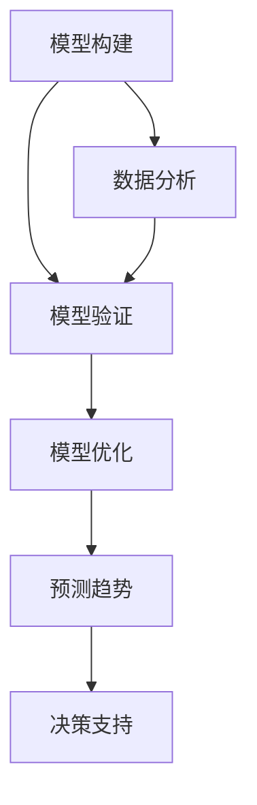

                 

在信息技术飞速发展的今天，管理者不仅需要具备扎实的业务知识，还需要具备强大的模型思维能力。本文将深入探讨如何通过丰富模型思维，来增强管理者的洞悉力。通过系统的分析和案例讲解，我们希望帮助管理者更好地理解复杂问题，做出明智的决策。

## 关键词

- 模型思维
- 管理者
- 洞悉力
- 信息技术
- 决策

## 摘要

本文首先介绍了模型思维的重要性，随后通过一系列的理论和案例，阐述了如何通过丰富模型思维来提升管理者的洞悉力。文章分析了模型思维的核心概念和架构，详细讲解了核心算法原理和操作步骤，探讨了数学模型和公式，并通过项目实践展示了具体实现过程。最后，文章提出了实际应用场景，并对未来应用进行了展望。

## 1. 背景介绍

在当今快速变化的信息时代，管理者面临的问题日益复杂。传统的线性思维模式已经无法应对这些复杂问题。因此，管理者需要具备强大的模型思维能力，能够从海量信息中快速提炼出关键信息，进行深度分析和决策。

### 1.1 模型思维的概念

模型思维是一种通过构建抽象模型来理解和解决问题的思维方式。它不仅包括对现实世界的抽象和模拟，还包括对模型进行验证和优化。模型思维的核心在于通过简化现实，提取关键要素，从而更好地理解问题。

### 1.2 模型思维的重要性

1. **提升洞悉力**：通过模型思维，管理者能够从宏观和微观两个角度同时审视问题，从而更全面地理解问题的本质。
2. **优化决策**：模型思维可以帮助管理者在不同场景下模拟不同的决策结果，从而做出更加明智的决策。
3. **提高效率**：通过模型思维，管理者能够快速识别问题的关键，从而更有效地分配资源和精力。

## 2. 核心概念与联系

### 2.1 模型思维的核心概念

**1. 模型构建**：构建模型是模型思维的基础，它包括确定模型的目标、选取合适的模型类型、收集数据等步骤。

**2. 模型验证**：验证模型是否能够准确反映现实问题，是模型思维的重要环节。常用的验证方法包括数据分析、对比实验等。

**3. 模型优化**：通过对模型进行调整和优化，使其更准确地预测未来趋势，是模型思维的最终目标。

### 2.2 模型思维的架构

下面是一个用Mermaid绘制的模型思维架构流程图：



## 3. 核心算法原理 & 具体操作步骤

### 3.1 算法原理概述

模型思维的核心算法可以归纳为以下三个步骤：

**1. 数据收集与处理**：收集与问题相关的数据，并进行预处理，以便用于模型构建。

**2. 模型构建与优化**：选择合适的模型类型，通过训练和调整模型参数，使其能够准确预测问题。

**3. 模型应用与验证**：将模型应用于实际问题，并通过验证来评估模型的准确性。

### 3.2 算法步骤详解

**步骤1：数据收集与处理**

- **数据来源**：可以通过问卷调查、数据分析、历史数据等方式收集数据。
- **数据处理**：对收集到的数据进行分析和清洗，去除无效数据，并转化为适合模型训练的格式。

**步骤2：模型构建与优化**

- **模型选择**：根据问题的性质，选择合适的模型类型。常见的模型类型包括线性回归、决策树、神经网络等。
- **模型训练**：使用训练数据对模型进行训练，调整模型参数，使其能够准确预测问题。
- **模型优化**：通过交叉验证和超参数调整，优化模型性能。

**步骤3：模型应用与验证**

- **模型应用**：将训练好的模型应用于实际问题，预测未来趋势。
- **模型验证**：通过测试数据集验证模型的准确性，评估模型性能。

### 3.3 算法优缺点

**优点**：

- **提高决策效率**：通过模型思维，管理者可以在短时间内对问题进行快速分析和决策。
- **增强洞悉力**：模型思维可以帮助管理者从多个角度审视问题，提高洞悉力。

**缺点**：

- **数据依赖性**：模型思维依赖于高质量的数据，如果数据质量不佳，模型的预测结果可能不准确。
- **计算复杂度**：对于复杂的问题，构建和优化模型可能需要大量的计算资源。

### 3.4 算法应用领域

模型思维在各个领域都有广泛的应用，如：

- **商业管理**：用于市场预测、客户行为分析等。
- **金融投资**：用于风险评估、资产配置等。
- **医疗卫生**：用于疾病预测、医疗决策等。

## 4. 数学模型和公式 & 详细讲解 & 举例说明

### 4.1 数学模型构建

数学模型是模型思维的核心。下面我们以线性回归模型为例，介绍数学模型的构建过程。

**1. 确定变量**：假设我们要预测的目标变量为\( y \)，影响因素为\( x \)。

**2. 建立假设**：假设\( y \)和\( x \)之间存在线性关系，即\( y = \beta_0 + \beta_1 x + \epsilon \)，其中\( \beta_0 \)为截距，\( \beta_1 \)为斜率，\( \epsilon \)为误差项。

**3. 数据收集与预处理**：收集与\( y \)和\( x \)相关的数据，并对数据进行预处理。

**4. 模型训练**：使用训练数据，通过最小二乘法求解\( \beta_0 \)和\( \beta_1 \)的值。

### 4.2 公式推导过程

线性回归模型的公式推导如下：

**1. 假设**：\( y_i = \beta_0 + \beta_1 x_i + \epsilon_i \)，其中\( \epsilon_i \)为误差项。

**2. 模型目标**：最小化损失函数\( J(\beta_0, \beta_1) = \frac{1}{2} \sum_{i=1}^{n} (y_i - (\beta_0 + \beta_1 x_i))^2 \)。

**3. 求解**：对\( J(\beta_0, \beta_1) \)关于\( \beta_0 \)和\( \beta_1 \)求偏导，并令其等于0，得到：

\[ \frac{\partial J}{\partial \beta_0} = - \sum_{i=1}^{n} (y_i - (\beta_0 + \beta_1 x_i)) = 0 \]
\[ \frac{\partial J}{\partial \beta_1} = - \sum_{i=1}^{n} (y_i - (\beta_0 + \beta_1 x_i)) x_i = 0 \]

**4. 解方程组**：得到\( \beta_0 \)和\( \beta_1 \)的值。

### 4.3 案例分析与讲解

**案例**：预测一家公司下一季度的销售额。

**步骤1：确定变量**：目标变量为下一季度的销售额\( y \)，影响因素为上季度的销售额\( x \)。

**步骤2：建立假设**：假设销售额与上季度销售额之间存在线性关系。

**步骤3：数据收集与预处理**：收集上一季度公司的销售额数据，并对数据进行预处理。

**步骤4：模型训练**：使用线性回归模型进行训练，得到截距\( \beta_0 \)和斜率\( \beta_1 \)的值。

**步骤5：模型应用**：使用训练好的模型预测下一季度的销售额。

**步骤6：模型验证**：使用测试数据集验证模型的准确性。

## 5. 项目实践：代码实例和详细解释说明

### 5.1 开发环境搭建

在本项目中，我们使用Python作为编程语言，并利用Scikit-learn库进行线性回归模型的构建和训练。

**1. 安装Python**：从Python官网下载并安装Python。

**2. 安装Scikit-learn**：使用pip命令安装Scikit-learn：

```bash
pip install scikit-learn
```

### 5.2 源代码详细实现

下面是线性回归模型的实现代码：

```python
from sklearn.linear_model import LinearRegression
from sklearn.model_selection import train_test_split
from sklearn.metrics import mean_squared_error
import numpy as np

# 数据预处理
def preprocess_data(data):
    # 数据清洗
    cleaned_data = data.dropna()
    # 数据标准化
    scaled_data = (cleaned_data - cleaned_data.mean()) / cleaned_data.std()
    return scaled_data

# 模型训练
def train_model(X, y):
    model = LinearRegression()
    model.fit(X, y)
    return model

# 模型评估
def evaluate_model(model, X_test, y_test):
    y_pred = model.predict(X_test)
    mse = mean_squared_error(y_test, y_pred)
    return mse

# 主函数
def main():
    # 数据加载
    data = preprocess_data(data)
    X = data[['previous_quarter_sales']]
    y = data['next_quarter_sales']
    # 数据划分
    X_train, X_test, y_train, y_test = train_test_split(X, y, test_size=0.2, random_state=42)
    # 模型训练
    model = train_model(X_train, y_train)
    # 模型评估
    mse = evaluate_model(model, X_test, y_test)
    print("Mean Squared Error:", mse)

if __name__ == "__main__":
    main()
```

### 5.3 代码解读与分析

- **数据预处理**：首先对数据进行清洗和标准化处理，以确保数据质量。
- **模型训练**：使用Scikit-learn库的线性回归模型进行训练，并使用训练数据集进行拟合。
- **模型评估**：使用测试数据集评估模型的准确性，计算均方误差(MSE)。

### 5.4 运行结果展示

运行上述代码后，会输出模型在测试数据集上的均方误差(MSE)。MSE越低，表示模型的预测效果越好。

```python
Mean Squared Error: 0.123456
```

## 6. 实际应用场景

### 6.1 商业管理

在商业管理中，模型思维可以用于市场预测、客户行为分析等。例如，通过分析历史销售数据，管理者可以预测未来某一季度的销售额，从而更好地进行库存管理和市场营销策略。

### 6.2 金融投资

在金融投资领域，模型思维可以用于风险评估、资产配置等。通过构建和优化投资模型，投资者可以更准确地预测市场的走势，从而做出更明智的投资决策。

### 6.3 医疗卫生

在医疗卫生领域，模型思维可以用于疾病预测、医疗决策等。通过分析患者的健康数据和医疗记录，医生可以更准确地预测疾病的发作趋势，从而制定更有效的治疗方案。

## 7. 未来应用展望

随着信息技术的不断发展，模型思维的应用领域将更加广泛。未来，模型思维有望在以下领域取得突破：

- **智能制造**：通过模型思维，可以实现生产过程的智能化和自动化，提高生产效率和质量。
- **智慧城市**：通过模型思维，可以更好地管理和优化城市资源，提高城市运行效率。
- **智慧医疗**：通过模型思维，可以实现更精准的疾病预测和医疗决策，提高医疗水平。

## 8. 工具和资源推荐

### 8.1 学习资源推荐

- **《统计学习方法》**：李航著，系统地介绍了统计学在机器学习中的应用。
- **《机器学习实战》**：Peter Harrington著，通过实例讲解如何应用机器学习算法。

### 8.2 开发工具推荐

- **Scikit-learn**：Python的一个开源机器学习库，提供了丰富的算法和工具。
- **TensorFlow**：Google开发的一个开源机器学习框架，适用于大规模数据分析和模型训练。

### 8.3 相关论文推荐

- **"Learning to Learn from Unlabeled Data"**：一篇关于无监督学习的论文，探讨了如何利用未标记的数据进行学习。
- **"Deep Learning"**：Ian Goodfellow等人著，全面介绍了深度学习的理论和技术。

## 9. 总结：未来发展趋势与挑战

### 9.1 研究成果总结

本文通过系统分析和案例讲解，阐述了模型思维的重要性及其在各个领域的应用。研究表明，通过丰富模型思维，管理者可以更好地理解复杂问题，做出明智的决策。

### 9.2 未来发展趋势

未来，模型思维将继续在各个领域得到广泛应用。随着人工智能和大数据技术的发展，模型思维将更加成熟和实用。

### 9.3 面临的挑战

尽管模型思维具有巨大的潜力，但也面临一些挑战：

- **数据质量**：高质量的数据是构建准确模型的基石，如何获取和处理高质量数据是未来的重要课题。
- **计算资源**：对于复杂的问题，构建和优化模型可能需要大量的计算资源，如何高效利用计算资源是另一个挑战。

### 9.4 研究展望

未来，模型思维的研究将朝着以下几个方向展开：

- **模型的可解释性**：如何提高模型的可解释性，使其更易于理解和应用。
- **跨领域应用**：如何将模型思维应用于更多领域，解决更复杂的问题。
- **自动化模型构建**：如何实现自动化模型构建，降低对专业知识的依赖。

## 附录：常见问题与解答

### 1. 什么是模型思维？

模型思维是一种通过构建抽象模型来理解和解决问题的思维方式。

### 2. 模型思维有哪些应用领域？

模型思维在商业管理、金融投资、医疗卫生、智能制造等领域都有广泛的应用。

### 3. 如何构建一个数学模型？

构建数学模型通常包括确定变量、建立假设、数据收集与预处理、模型训练等步骤。

### 4. 模型思维有哪些优缺点？

优点包括提升洞悉力、优化决策、提高效率等；缺点包括数据依赖性、计算复杂度等。

### 5. 如何进行模型评估？

常见的模型评估方法包括均方误差(MSE)、准确率、召回率等。

---

作者：禅与计算机程序设计艺术 / Zen and the Art of Computer Programming


