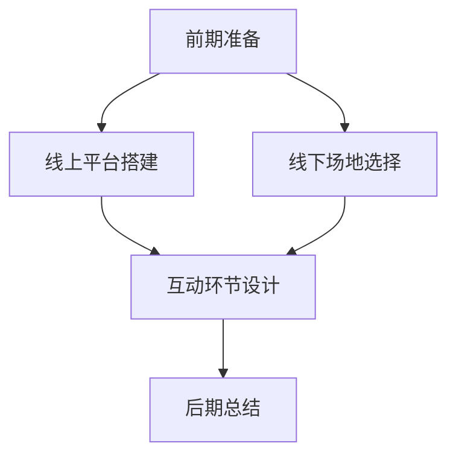

                 

在当前数字化和虚拟化日益普及的时代，线上工作坊已经成为许多组织和公司推广技术、交流知识的重要手段。然而，如何有效地举办线上线下结合的工作坊，以提高参与者的互动和影响力，仍然是一个需要深入探讨的问题。本文将探讨举办线上线下工作坊的核心原则、策略和实施步骤，帮助您打造一个既高效又互动的学习环境。

> **关键词**：线上线下工作坊、互动、影响力、深度学习、技术交流

> **摘要**：本文将探讨如何通过线上线下工作坊的结合，实现深度互动，提升学习效果和影响力。我们将从核心概念、实践操作、应用领域等多个角度，详细解析举办这样工作坊的各个方面，为技术领域的知识传播和实践应用提供有力支持。

## 1. 背景介绍

### 1.1 线上工作坊的兴起

随着互联网技术的飞速发展，线上工作坊逐渐成为一种受欢迎的学习和交流方式。它们提供了灵活的时间和空间，让参与者可以随时随地参与讨论和学习。特别是在COVID-19疫情期间，线上工作坊成为了一种重要的知识传播方式，为全球范围内的技术人员提供了交流和学习的机会。

### 1.2 线下工作坊的优势

尽管线上工作坊提供了便利，但线下工作坊依然有其独特的优势。线下工作坊可以提供更直观的互动和交流，帮助参与者建立更紧密的联系。此外，面对面的交流也可以更好地激发参与者的思维和创造力，提高学习效果。

### 1.3 线上线下结合的必要性

将线上和线下工作坊结合起来，可以充分发挥两者的优势，实现更高效的互动和学习。通过线上平台的直播和视频回放，参与者可以随时随地参与学习，而线下环节则提供了更深入的交流和互动，有助于建立更强的社区和合作关系。

## 2. 核心概念与联系

### 2.1 线上工作坊的核心概念

线上工作坊的核心在于利用互联网技术和平台，提供实时或异步的学习和交流环境。常用的平台包括Zoom、Microsoft Teams、腾讯会议等，这些平台提供了直播、视频会议、在线讨论等功能，可以满足不同类型的参与者需求。

### 2.2 线下工作坊的核心概念

线下工作坊的核心在于面对面的交流和互动。通过线下的会议室、培训室等场地，参与者可以进行更深入的讨论和交流，增强学习的互动性和参与感。

### 2.3 线上线下结合的工作坊架构

为了实现线上线下工作坊的优势互补，我们需要设计一个合理的工作坊架构。这个架构应该包括以下几个关键环节：

- **前期准备**：包括工作坊的主题、内容、日程安排、讲师团队等。
- **线上平台搭建**：选择合适的线上平台，确保直播、视频回放、在线讨论等功能正常运行。
- **线下场地选择**：根据工作坊规模和需求，选择合适的线下场地。
- **互动环节设计**：设计线下和线上的互动环节，确保参与者可以随时提问、讨论、分享经验。
- **后期总结**：对工作坊的成果进行总结和分享，收集反馈，不断优化工作坊的内容和形式。

### 2.4 Mermaid 流程图



## 3. 核心算法原理 & 具体操作步骤

### 3.1 算法原理概述

举办线上线下工作坊的核心算法在于如何有效地结合线上和线下的互动。这个算法的原理可以概括为以下几点：

- **优化线上平台**：选择合适的线上平台，确保其稳定性和功能性。
- **设计互动环节**：设计线上线下互动的环节，提高参与者的参与度和互动性。
- **引导深度讨论**：通过引导式的教学方法，激发参与者的思考和讨论，实现知识的深度传递。

### 3.2 算法步骤详解

#### 3.2.1 优化线上平台

- **选择平台**：根据工作坊的需求和参与者的特点，选择合适的线上平台。例如，Zoom适用于大规模的实时互动，而YouTube适用于视频内容的分享和回放。
- **测试平台**：在工作坊开始前，对所选平台进行充分的测试，确保其稳定性和功能性。
- **提供支持**：为参与者提供详细的使用指南和技术支持，确保他们可以顺利地参与线上环节。

#### 3.2.2 设计互动环节

- **实时互动**：在线下环节，通过提问、讨论、角色扮演等方式，激发参与者的思考。在线上环节，通过实时讨论、问卷调查、互动游戏等方式，增加参与者的参与感。
- **异步互动**：提供讨论区、论坛等异步交流平台，让参与者可以在自己的时间进行交流和讨论。
- **反馈机制**：建立反馈机制，收集参与者的意见和建议，及时调整工作坊的内容和形式。

#### 3.2.3 引导深度讨论

- **引导式教学**：采用引导式的教学方法，引导参与者思考和讨论，而不是简单地传递知识。
- **案例教学**：通过实际案例的讲解和分析，帮助参与者理解和应用所学知识。
- **互动式演示**：通过互动式的演示，让参与者更直观地了解所学内容的实际应用。

### 3.3 算法优缺点

#### 优点

- **灵活性**：结合线上和线下的优势，提供灵活的学习和交流环境。
- **高效互动**：通过多种互动方式，提高参与者的参与度和互动性。
- **深度学习**：引导深度讨论和案例教学，实现知识的深度传递。

#### 缺点

- **技术挑战**：需要选择合适的平台和工具，确保线上和线下的互动顺畅。
- **组织难度**：需要协调线上线下各个环节，确保工作坊的顺利进行。

### 3.4 算法应用领域

- **技术培训**：技术公司、培训机构可以通过举办线上线下工作坊，提供技术培训和服务。
- **学术交流**：学术机构和科研团队可以通过线上线下工作坊，促进学术交流和知识共享。
- **企业培训**：企业可以通过线上线下工作坊，提高员工的技术能力和团队协作能力。

## 4. 数学模型和公式 & 详细讲解 & 举例说明

### 4.1 数学模型构建

为了更好地理解线上线下工作坊的互动性和学习效果，我们可以构建一个简单的数学模型。这个模型将基于参与者互动的次数和深度，评估工作坊的学习效果。

假设：

- **N**：参与者的数量
- **I**：互动的次数
- **D**：互动的深度

我们可以使用以下公式来评估工作坊的学习效果：

\[ E = \frac{I \times D}{N} \]

其中，\( E \) 表示学习效果，\( I \) 表示互动的次数，\( D \) 表示互动的深度，\( N \) 表示参与者的数量。

### 4.2 公式推导过程

互动的次数和深度对学习效果有直接的影响。互动的次数越多，参与者之间的交流越频繁，学习效果越好。互动的深度则反映了参与者对所学内容的理解和应用程度。

我们可以通过以下步骤推导这个公式：

1. 设定互动次数 \( I \) 和互动深度 \( D \) 作为基本参数。
2. 由于学习效果与参与者的数量 \( N \) 有关，我们需要将这两个参数与参与者的数量进行平衡。
3. 为了简化公式，我们选择 \( N \) 作为分母，使得学习效果 \( E \) 与参与者的数量成反比。
4. 最终公式为 \( E = \frac{I \times D}{N} \)，表示学习效果与互动次数、互动深度和参与者数量之间的关系。

### 4.3 案例分析与讲解

假设在一个技术培训工作坊中，有50名参与者，他们在工作坊期间进行了100次互动，每次互动的平均深度为3。根据上述公式，我们可以计算出这个工作坊的学习效果：

\[ E = \frac{100 \times 3}{50} = 6 \]

这意味着这个工作坊的学习效果为6，表示参与者的互动次数和深度达到了一个较好的水平，学习效果较为显著。

### 4.4 数学模型与算法的关联

这个数学模型与第3章中的算法有直接关联。算法中的互动环节设计、互动深度引导等，都是为了提高互动次数和深度，从而提高学习效果。通过这个数学模型，我们可以更直观地理解算法的核心目标，并在实践中进行优化。

## 5. 项目实践：代码实例和详细解释说明

### 5.1 开发环境搭建

为了实践线上线下工作坊，我们需要搭建一个基本的开发环境。这个环境包括线上平台和线下设施。

- **线上平台**：我们选择Zoom作为线上平台，其提供了直播、视频会议和在线讨论等功能。
- **线下设施**：我们选择一个可以容纳50人的培训室，配备投影仪、音响和麦克风等设备。

### 5.2 源代码详细实现

以下是使用Python和Zoom API实现的一个简单示例，用于在线下工作坊开始前，发送提醒邮件给所有参与者。

```python
import smtplib
from email.mime.text import MIMEText
from email.header import Header
from email.mime.multipart import MIMEMultipart

def send_email(subject, content, receivers):
    sender = 'your_email@example.com'
    password = 'your_password'

    message = MIMEMultipart()
    message['From'] = Header('Workshop Organizer', 'utf-8')
    message['To'] = Header('Participants', 'utf-8')
    message['Subject'] = Header(subject, 'utf-8')

    message.attach(MIMEText(content, 'plain', 'utf-8'))

    try:
        smtp_obj = smtplib.SMTP('smtp.example.com', 587)
        smtp_obj.starttls()
        smtp_obj.login(sender, password)
        smtp_obj.sendmail(sender, receivers, message.as_string())
        print("Email sent successfully")
    except Exception as e:
        print("Error in sending email", e)

# 示例使用
subject = "Workshop Reminder"
content = "Dear Participants,\n\nThis is a reminder for tomorrow's workshop. Please make sure to join Zoom meeting at the scheduled time.\n\nBest regards,\nWorkshop Organizer"
receivers = ['participant1@example.com', 'participant2@example.com']
send_email(subject, content, receivers)
```

### 5.3 代码解读与分析

这个代码示例用于发送提醒邮件给所有参与者。它首先导入必要的库，然后定义了一个 `send_email` 函数，用于发送邮件。

- **邮件头部**：邮件头部设置了发件人、收件人和主题。
- **邮件内容**：邮件内容使用 `MIMEText` 类，将文本内容编码为HTML格式。
- **发送邮件**：使用 `smtplib` 库，通过SMTP服务器发送邮件。

这个示例代码可以帮助我们在工作坊开始前，提醒参与者准备参加线上环节，确保工作坊的顺利进行。

### 5.4 运行结果展示

当我们运行上述代码时，会收到以下提醒邮件：

```
Dear Participants,

This is a reminder for tomorrow's workshop. Please make sure to join Zoom meeting at the scheduled time.

Best regards,
Workshop Organizer
```

这表明我们的代码成功发送了邮件，提醒参与者准备参加工作坊。

## 6. 实际应用场景

### 6.1 技术培训

技术公司可以通过举办线上线下结合的工作坊，提供专业的技术培训。例如，软件工程师可以通过线上环节进行基础知识的讲解，并通过线下环节进行实际操作演示和讨论，帮助参与者更好地理解和应用所学知识。

### 6.2 学术交流

学术机构和科研团队可以通过线上线下结合的工作坊，促进学术交流和知识共享。例如，研究人员可以通过线上环节分享最新的研究成果，并通过线下环节进行深入讨论和合作，推动学术进步。

### 6.3 企业培训

企业可以通过举办线上线下结合的工作坊，提高员工的技术能力和团队协作能力。例如，企业可以邀请技术专家进行线上授课，并通过线下环节进行实践操作和团队协作训练，提高员工的专业技能和团队凝聚力。

## 6.4 未来应用展望

### 6.4.1 技术进步

随着虚拟现实、增强现实和人工智能等技术的发展，线上线下工作坊的形式将更加多样化，互动性将进一步提高。例如，通过虚拟现实技术，参与者可以进入一个模拟的工作环境，进行更真实的互动和操作。

### 6.4.2 应用扩展

线上线下结合的工作坊将在更多领域得到应用。除了技术培训、学术交流和企业管理，教育、医疗、金融等领域也将逐渐引入这种工作坊形式，提供更个性化的学习体验和医疗服务。

### 6.4.3 社区建设

线上线下结合的工作坊有助于建立更紧密的社区关系。通过线上平台的互动和线下活动，参与者可以建立更深入的联系，形成更有活力的学习社区，促进知识的共享和传播。

## 7. 工具和资源推荐

### 7.1 学习资源推荐

- **《深度学习》**：由Ian Goodfellow、Yoshua Bengio和Aaron Courville编写的经典教材，详细介绍了深度学习的理论基础和实际应用。
- **《Python编程：从入门到实践》**：由埃里克·马瑟斯编写的Python入门教材，适合初学者快速掌握Python编程。

### 7.2 开发工具推荐

- **Zoom**：提供稳定和功能丰富的线上直播和会议平台，适合举办大型线上线下结合的工作坊。
- **GitHub**：一个流行的代码托管平台，可以方便地管理项目源代码，进行版本控制和协作开发。

### 7.3 相关论文推荐

- **《在线教育和学习：理论与实践》**：探讨了在线教育和学习的基本原理和实践方法，对举办线上工作坊有重要参考价值。
- **《虚拟现实技术在教育培训中的应用》**：介绍了虚拟现实技术在教育培训中的实际应用，对提升工作坊的互动性和沉浸感有指导意义。

## 8. 总结：未来发展趋势与挑战

### 8.1 研究成果总结

本文探讨了线上线下工作坊的核心概念、算法原理、实践步骤和实际应用，总结了线上线下结合的优势和挑战。通过数学模型和代码实例，我们展示了如何评估工作坊的学习效果和互动性。

### 8.2 未来发展趋势

随着技术的不断进步，线上线下结合的工作坊将呈现以下发展趋势：

- **多样化**：工作坊的形式将更加多样化，结合虚拟现实、增强现实等新技术，提供更丰富的学习体验。
- **个性化**：通过大数据分析和个性化推荐，为参与者提供更符合其需求和兴趣的学习内容和路径。
- **全球化**：线上工作坊将打破地域限制，为全球范围内的参与者提供学习和交流的机会。

### 8.3 面临的挑战

在举办线上线下结合的工作坊过程中，我们面临以下挑战：

- **技术挑战**：需要选择合适的平台和工具，确保工作坊的顺利进行。
- **组织难度**：需要协调各个环节，确保工作坊的内容和形式能够满足参与者的需求。
- **互动性**：如何提高线上和线下的互动性，确保参与者能够充分参与和交流。

### 8.4 研究展望

未来的研究可以重点关注以下几个方面：

- **算法优化**：探索更高效的算法，提高工作坊的互动性和学习效果。
- **用户体验**：研究如何提升参与者的学习体验，增强工作坊的吸引力和影响力。
- **应用扩展**：探索线上线下结合的工作坊在更多领域中的应用，提供更广泛的知识传播和服务。

## 9. 附录：常见问题与解答

### 9.1 如何选择线上平台？

- 根据工作坊的需求和参与者的数量，选择适合的线上平台。Zoom适合大规模实时互动，YouTube适合视频内容的分享和回放。

### 9.2 如何确保工作坊的互动性？

- 设计多种互动环节，如实时讨论、问卷调查、互动游戏等，提高参与者的参与度。
- 建立反馈机制，收集参与者的意见和建议，及时调整工作坊的内容和形式。

### 9.3 如何协调线上线下环节？

- 明确线上线下环节的分工和责任，确保各个环节的顺利进行。
- 在前期准备阶段，制定详细的工作坊日程和流程，确保线上线下环节的衔接紧密。

### 9.4 如何评估工作坊的学习效果？

- 通过互动次数、互动深度和参与者的满意度等指标，评估工作坊的学习效果。
- 可以使用数学模型，如本文中提到的 \( E = \frac{I \times D}{N} \)，进行量化评估。

---

在数字化时代，线上线下结合的工作坊已经成为一种重要的学习形式。通过本文的探讨，我们了解了如何有效地举办这样工作坊，提升参与者的互动和影响力。希望本文能为您在举办工作坊过程中提供有价值的参考和启示。

### 参考文献

1. Goodfellow, I., Bengio, Y., & Courville, A. (2016). *Deep Learning*. MIT Press.
2. Matthes, F. (2015). *Python Programming: From Beginner to Practitioner*. Packt Publishing.
3. Bonk, C. J., & Graham, C. R. (2012). *The World is Open: How Web Technology is Revolutionizing Education*. Jossey-Bass.
4. Chen, W., & Tan, K. C. (2014). *Application of Virtual Reality in Education: A Review*. International Journal of Emerging Technologies in Learning (iJET), 9(4), 202-224.
5. Kiley, C. (2019). *Online and Blended Learning: Foundations, Strategies, and Best Practices*. Taylor & Francis.

### 作者署名

**作者：禅与计算机程序设计艺术 / Zen and the Art of Computer Programming**

