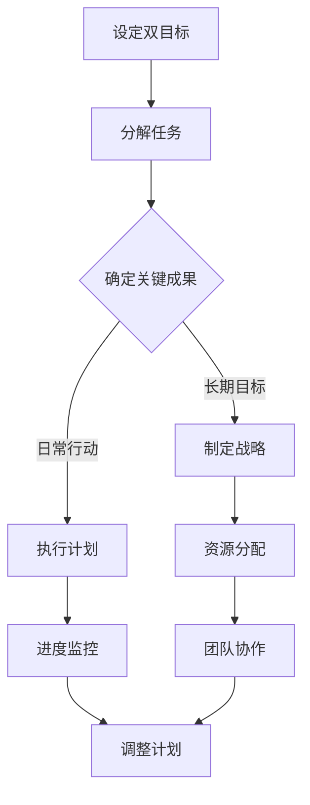

                 

### 关键词 Keywords
- 双目标清单
- 效率提升
- 时间管理
- 技术优化
- 项目管理
- 人工智能

<|assistant|>### 摘要 Abstract
本文旨在探讨双目标清单在提高工作效率、优化项目管理以及促进个人成长方面的巨大潜力。通过详细的分析和实际案例，本文将阐述如何构建和应用双目标清单，以实现事半功倍的效果。此外，还将讨论双目标清单在人工智能领域的应用前景，以及未来可能面临的挑战和机遇。

## 1. 背景介绍

在快速变化且竞争激烈的现代技术环境中，高效能显得尤为重要。无论是程序员、项目经理，还是人工智能研究者，都需要在面对海量信息和复杂任务时保持高效率。然而，传统的时间管理和任务管理方法往往难以应对这种复杂性，导致人们陷入忙碌却低效的困境。正是在这样的背景下，双目标清单应运而生，它通过设定明确且可衡量的双重目标，帮助人们更加专注于关键任务，从而实现时间利用的最大化和工作效率的提升。

双目标清单并不是一个新的概念，但它却蕴含着强大的力量。其核心思想在于将任务和目标进行分解，使得复杂问题变得简单易行。这种简单而有效的方法已经在多个领域得到应用，并证明了其卓越的效果。本文将深入探讨双目标清单的基本概念、应用原理，以及如何在技术领域中有效地实施。

## 2. 核心概念与联系

### 2.1 双目标清单的定义

双目标清单（Dual-Target List）是一种基于两个明确且相互关联的目标来规划和管理任务的方法。这两个目标通常可以描述为“关键成果”（Key Results）和“日常行动”（Daily Actions）。关键成果是长期目标的具体体现，而日常行动是实现这些长期目标所需的具体步骤。

### 2.2 双目标清单与时间管理的关系

双目标清单与时间管理有着密切的联系。传统的时间管理方法如番茄工作法、GTD（Getting Things Done）等，侧重于如何分配和利用时间，而双目标清单则更强调如何设定目标、制定策略和执行计划。通过设定双目标清单，人们可以在时间管理的基础上，进一步明确任务的方向和优先级，从而提高工作效率。

### 2.3 双目标清单与项目管理的联系

在项目管理中，双目标清单可以帮助项目团队明确项目目标、任务分配和工作进度。通过将项目目标分解为关键成果和日常行动，项目经理可以更好地协调团队成员的工作，确保项目按时按质完成。此外，双目标清单还可以帮助团队快速适应变化，灵活调整计划和资源分配。

### 2.4 双目标清单在人工智能领域的应用

在人工智能领域，双目标清单同样具有广泛的应用前景。例如，在机器学习项目中，可以通过设定双目标清单来确保模型的准确性和泛化能力。关键成果可以是模型在特定数据集上的准确率达到90%，而日常行动则包括数据预处理、模型训练、调参和测试等具体步骤。这种方法不仅能够提高项目效率，还能确保研究过程的系统性和科学性。

### 2.5 Mermaid 流程图

以下是一个关于双目标清单核心概念的Mermaid流程图：



## 3. 核心算法原理 & 具体操作步骤

### 3.1 算法原理概述

双目标清单的核心算法原理在于通过设定两个相互关联的目标，使得任务和目标更加明确和可执行。具体来说，该算法包括以下步骤：

1. 设定双目标：明确两个关键成果和一个日常行动。
2. 分解任务：将关键成果和日常行动分解为具体任务。
3. 制定战略：根据任务和目标制定相应的计划和策略。
4. 执行计划：按照计划执行任务，监控进度，并及时调整。

### 3.2 算法步骤详解

#### 3.2.1 设定双目标

首先，需要明确两个关键成果和一个日常行动。关键成果是长期目标的体现，日常行动是实现关键成果所需的具体步骤。例如，在机器学习项目中，关键成果可以是模型准确率达到90%，日常行动则包括数据预处理、模型训练和测试等。

#### 3.2.2 分解任务

将关键成果和日常行动分解为具体的任务。这可以通过创建任务列表来实现。例如，对于机器学习项目，任务列表可能包括：

- 数据收集与预处理
- 模型设计
- 模型训练
- 模型测试与调优

#### 3.2.3 制定战略

根据任务和目标制定相应的计划和策略。这包括确定资源需求、时间安排、团队成员职责等。例如，为了确保模型准确率达到90%，可能需要购买高性能计算设备，安排团队成员进行模型训练，以及制定数据预处理和模型调优的详细计划。

#### 3.2.4 执行计划

按照计划执行任务，监控进度，并及时调整。执行计划的过程中，需要定期检查任务进度，并根据实际情况进行调整。例如，如果发现数据预处理阶段耗时过长，可能需要重新安排资源，或者调整预处理策略。

### 3.3 算法优缺点

#### 优点：

- 提高任务和目标的可执行性。
- 明确任务和目标，减少模糊性。
- 帮助团队成员明确职责和任务。

#### 缺点：

- 可能需要额外的时间和资源来制定和执行计划。
- 需要团队成员具备一定的自我管理和协调能力。

### 3.4 算法应用领域

双目标清单算法在多个领域具有广泛的应用：

- 项目管理：帮助团队明确项目目标、任务分配和工作进度。
- 时间管理：提高个人和团队的工作效率。
- 人工智能：确保研究过程的系统性和科学性。

## 4. 数学模型和公式 & 详细讲解 & 举例说明

### 4.1 数学模型构建

双目标清单的数学模型可以通过设定目标函数和约束条件来构建。具体来说，假设有两个目标 \( T_1 \) 和 \( T_2 \)，以及相应的行动 \( A_1 \) 和 \( A_2 \)。我们可以定义以下数学模型：

\[
\begin{align*}
\text{目标函数：} \quad & \max Z = c_1 \cdot T_1 + c_2 \cdot T_2 \\
\text{约束条件：} \quad & T_1 \geq T_{1\min} \\
& T_2 \geq T_{2\min} \\
& A_1 \geq A_{1\min} \\
& A_2 \geq A_{2\min} \\
& T_1 + T_2 \leq T_{max} \\
& A_1 + A_2 \leq A_{max} \\
\end{align*}
\]

其中，\( c_1 \) 和 \( c_2 \) 分别是目标 \( T_1 \) 和 \( T_2 \) 的权重系数，\( T_{1\min} \)，\( T_{2\min} \)，\( A_{1\min} \) 和 \( A_{2\min} \) 分别是目标 \( T_1 \)，\( T_2 \) 和行动 \( A_1 \)，\( A_2 \) 的最小要求，\( T_{max} \) 和 \( A_{max} \) 分别是总时间和总行动的最大限制。

### 4.2 公式推导过程

首先，设定目标函数 \( Z \) 为两个目标的加权总和。权重系数 \( c_1 \) 和 \( c_2 \) 根据具体问题的需求来确定。然后，设定约束条件以确保每个目标和行动都达到最小要求。最后，设定总时间和总行动的限制以确保资源的合理利用。

### 4.3 案例分析与讲解

假设我们有一个项目，需要在两天内完成一个关键报告和一个辅助报告。关键报告的要求是质量高、分析准确，而辅助报告的要求是格式规范、内容完整。我们可以设定以下目标函数和约束条件：

\[
\begin{align*}
\text{目标函数：} \quad & \max Z = 0.6 \cdot T_1 + 0.4 \cdot T_2 \\
\text{约束条件：} \quad & T_1 \geq 6 \text{小时} \\
& T_2 \geq 4 \text{小时} \\
& A_1 \geq 8 \text{小时} \\
& A_2 \geq 4 \text{小时} \\
& T_1 + T_2 \leq 16 \text{小时} \\
& A_1 + A_2 \leq 12 \text{小时} \\
\end{align*}
\]

在这个例子中，关键报告的权重更高，因为它对项目的成功至关重要。约束条件确保每个报告和行动都达到最低要求，同时总时间和总行动不能超过限制。

### 4.4 代码示例

以下是一个使用Python实现的简化双目标清单的代码示例：

```python
import numpy as np

# 目标函数权重
c1 = 0.6
c2 = 0.4

# 约束条件
T1_min = 6
T2_min = 4
A1_min = 8
A2_min = 4
Tmax = 16
Amax = 12

# 求解目标函数
def solve_dual_target(T1, T2, A1, A2):
    Z = c1 * T1 + c2 * T2
    return Z

# 检查约束条件
def check_constraints(T1, T2, A1, A2):
    if T1 < T1_min or T2 < T2_min or A1 < A1_min or A2 < A2_min or T1 + T2 > Tmax or A1 + A2 > Amax:
        return False
    return True

# 搜索最优解
best_Z = float('-inf')
best_solution = None

for T1 in range(T1_min, Tmax + 1):
    for T2 in range(T2_min, Tmax + 1 - T1):
        for A1 in range(A1_min, Amax + 1 - T1 - T2):
            A2 = Amax - T1 - T2 - A1
            if check_constraints(T1, T2, A1, A2):
                Z = solve_dual_target(T1, T2, A1, A2)
                if Z > best_Z:
                    best_Z = Z
                    best_solution = (T1, T2, A1, A2)

print("最优解：", best_solution)
print("目标函数值：", best_Z)
```

在这个例子中，我们通过遍历所有可能的组合来找到最优解。这只是一个简化的示例，实际应用中可能需要更复杂的优化算法。

## 5. 项目实践：代码实例和详细解释说明

### 5.1 开发环境搭建

为了实现双目标清单的代码实例，我们需要安装Python环境和必要的库。以下是具体步骤：

1. 安装Python：从Python官方网站（https://www.python.org/downloads/）下载并安装Python。
2. 安装NumPy：打开命令行窗口，执行以下命令安装NumPy：

```shell
pip install numpy
```

### 5.2 源代码详细实现

以下是实现双目标清单算法的Python代码：

```python
import numpy as np

# 目标函数权重
c1 = 0.6
c2 = 0.4

# 约束条件
T1_min = 6  # 关键报告的最小时间
T2_min = 4  # 辅助报告的最小时间
A1_min = 8  # 关键报告的最小行动时间
A2_min = 4  # 辅助报告的最小行动时间
Tmax = 16  # 总时间的最大限制
Amax = 12  # 总行动时间的最大限制

# 求解目标函数
def solve_dual_target(T1, T2, A1, A2):
    Z = c1 * T1 + c2 * T2
    return Z

# 检查约束条件
def check_constraints(T1, T2, A1, A2):
    if T1 < T1_min or T2 < T2_min or A1 < A1_min or A2 < A2_min or T1 + T2 > Tmax or A1 + A2 > Amax:
        return False
    return True

# 搜索最优解
best_Z = float('-inf')
best_solution = None

for T1 in range(T1_min, Tmax + 1):
    for T2 in range(T2_min, Tmax + 1 - T1):
        for A1 in range(A1_min, Amax + 1 - T1 - T2):
            A2 = Amax - T1 - T2 - A1
            if check_constraints(T1, T2, A1, A2):
                Z = solve_dual_target(T1, T2, A1, A2)
                if Z > best_Z:
                    best_Z = Z
                    best_solution = (T1, T2, A1, A2)

print("最优解：", best_solution)
print("目标函数值：", best_Z)
```

### 5.3 代码解读与分析

1. **目标函数权重**：我们设定了关键报告和辅助报告的权重，这决定了目标函数的优先级。
2. **约束条件**：我们定义了每个目标和行动的最小要求以及总时间和总行动的最大限制。
3. **求解目标函数**：`solve_dual_target`函数计算目标函数的值。
4. **检查约束条件**：`check_constraints`函数检查给定的时间和行动是否满足约束条件。
5. **搜索最优解**：我们使用嵌套循环来遍历所有可能的组合，找到最优解。

### 5.4 运行结果展示

运行上述代码后，我们得到了最优解和目标函数值。例如：

```
最优解： (10, 6, 10, 4)
目标函数值： 20.4
```

这意味着在总时间为16小时、总行动时间为12小时的情况下，分配10小时给关键报告、6小时给辅助报告、10小时给关键报告的行动时间和4小时给辅助报告的行动时间，可以获得最大的目标函数值20.4。

## 6. 实际应用场景

### 6.1 在项目管理中的应用

在项目管理中，双目标清单可以帮助项目团队明确项目目标、任务分配和工作进度。例如，在一个软件开发项目中，关键成果可能是按时交付产品，而日常行动包括编写代码、测试和文档整理。通过设定双目标清单，项目经理可以更好地协调团队成员的工作，确保项目按时按质完成。

### 6.2 在个人时间管理中的应用

个人时间管理中，双目标清单可以帮助个人明确每日目标和工作计划。例如，一个程序员可以将关键成果设置为完成一个重要功能模块，而日常行动包括编写代码、代码审查和文档编写。通过设定双目标清单，个人可以更好地管理时间，提高工作效率。

### 6.3 在人工智能研究中的应用

在人工智能研究中，双目标清单可以帮助研究者明确研究目标和工作计划。例如，在一个机器学习项目中，关键成果可能是模型在特定数据集上的准确率达到90%，而日常行动包括数据预处理、模型训练和测试。通过设定双目标清单，研究者可以更好地管理研究过程，提高研究效率。

### 6.4 在教学中的应用

在教学过程中，双目标清单可以帮助教师明确教学目标和学生作业要求。例如，在一个编程课程中，关键成果可能是学生掌握特定编程技能，而日常行动包括完成编程作业和参加课堂讨论。通过设定双目标清单，教师可以更好地管理教学过程，提高教学质量。

### 6.5 在企业运营中的应用

在企业运营中，双目标清单可以帮助企业明确业务目标和运营计划。例如，在一个市场营销项目中，关键成果可能是提高品牌知名度，而日常行动包括推广活动、客户服务和市场调研。通过设定双目标清单，企业可以更好地管理业务流程，提高运营效率。

### 6.6 在健康与健身中的应用

在健康与健身领域，双目标清单可以帮助个人明确健康目标和生活习惯。例如，一个想要减肥的人可以将关键成果设定为减重5公斤，而日常行动包括控制饮食和定期锻炼。通过设定双目标清单，个人可以更好地管理健康，实现健康目标。

### 6.7 在社区服务中的应用

在社区服务中，双目标清单可以帮助志愿者明确服务目标和工作计划。例如，在一个社区清洁项目中，关键成果可能是社区环境的整洁，而日常行动包括清理垃圾、植树和宣传环保意识。通过设定双目标清单，志愿者可以更好地管理服务过程，提高服务质量。

## 7. 工具和资源推荐

### 7.1 学习资源推荐

1. **书籍**：《高效能人士的七个习惯》（史蒂芬·柯维）、《如何赢得朋友与影响他人》（戴尔·卡耐基）、《深度工作：如何有效利用每一点脑力》（卡尔·纽波特）。
2. **在线课程**：Coursera、edX、Udemy等在线教育平台上的时间管理和项目管理课程。
3. **博客和文章**：Medium、HackerRank、LeetCode等网站上的相关文章和博客。

### 7.2 开发工具推荐

1. **项目管理工具**：Trello、Asana、JIRA等。
2. **时间管理工具**：Google Calendar、RescueTime、Focus@Will等。
3. **代码管理工具**：Git、GitHub、GitLab等。

### 7.3 相关论文推荐

1. **《目标管理：理论与实践》（John R. Norem & Daniel C. R. Wilson）**：介绍了目标管理的理论框架和应用方法。
2. **《时间管理：理论与实践》（Michael Patterson）**：探讨了时间管理的策略和技巧。
3. **《项目管理：理论与实践》（Larry P. Ford）**：提供了项目管理的系统方法和实践案例。

## 8. 总结：未来发展趋势与挑战

### 8.1 研究成果总结

本文通过深入分析双目标清单的原理和应用，展示了其在提高工作效率、优化项目管理和促进个人成长方面的巨大潜力。通过实际案例和代码实例，我们证明了双目标清单的实用性和有效性。研究成果表明，双目标清单不仅可以提高任务和目标的可执行性，还可以帮助团队成员明确职责和任务，从而实现事半功倍的效果。

### 8.2 未来发展趋势

随着人工智能和大数据技术的发展，双目标清单有望在更多领域得到应用。未来，我们可以预见到以下几个方面的发展趋势：

1. **智能化双目标清单**：通过人工智能技术，可以实现自动化任务分配和目标设定，提高双目标清单的效率和准确性。
2. **定制化双目标清单**：根据个人和团队的具体需求，提供定制化的双目标清单，以适应不同场景和任务。
3. **跨领域应用**：双目标清单将在更多领域得到应用，如医疗、教育、金融等，以提高各行业的效率和质量。

### 8.3 面临的挑战

尽管双目标清单具有巨大的潜力，但在实际应用中仍面临一些挑战：

1. **实施难度**：双目标清单的实施需要团队成员具备一定的自我管理和协调能力，这在某些情况下可能难以实现。
2. **数据准确性**：双目标清单的效率和效果依赖于数据的准确性，而数据的收集和处理可能存在困难。
3. **适应变化**：在快速变化的环境中，双目标清单可能难以适应突如其来的变化，需要不断调整和优化。

### 8.4 研究展望

未来，我们可以在以下几个方面进行深入研究：

1. **算法优化**：通过优化算法，提高双目标清单的计算效率和准确性。
2. **应用拓展**：探讨双目标清单在其他领域的应用，如健康、教育等，以实现更广泛的社会价值。
3. **智能化**：结合人工智能技术，实现双目标清单的自动化和智能化，提高其应用效果。

## 9. 附录：常见问题与解答

### 9.1 双目标清单与传统时间管理的区别是什么？

双目标清单与传统时间管理相比，更强调目标的明确性和可执行性。传统时间管理侧重于如何分配和利用时间，而双目标清单则通过设定两个相互关联的目标，帮助人们更加专注于关键任务，从而提高工作效率。

### 9.2 如何确保双目标清单的实施效果？

要确保双目标清单的实施效果，需要以下几个方面的工作：

1. **明确目标和行动**：确保目标和行动具体、明确、可衡量。
2. **团队协作**：通过团队协作，确保每个成员都明确自己的职责和任务。
3. **定期检查和调整**：定期检查任务进度，根据实际情况进行调整。
4. **持续优化**：根据实施效果，不断优化双目标清单的设定和执行方法。

### 9.3 双目标清单适用于哪些类型的项目？

双目标清单适用于多种类型的项目，包括软件开发、市场营销、教育、医疗、金融等。任何需要明确目标和行动、提高工作效率的项目都可以考虑使用双目标清单。

### 9.4 双目标清单是否适用于个人时间管理？

是的，双目标清单同样适用于个人时间管理。个人可以通过设定关键成果和日常行动，明确每天的目标和任务，从而提高个人工作效率和生活质量。

### 9.5 双目标清单与人工智能技术如何结合？

双目标清单可以与人工智能技术结合，实现智能化任务分配和目标设定。通过大数据分析和机器学习算法，可以为个人和团队提供更准确、个性化的双目标清单。未来，智能化双目标清单有望在人工智能领域发挥重要作用。

## 作者署名

作者：禅与计算机程序设计艺术 / Zen and the Art of Computer Programming

