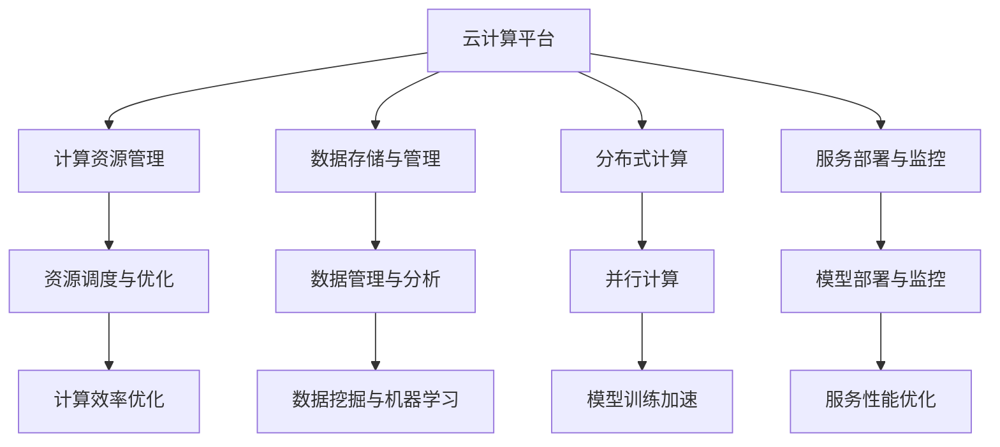

                 

关键词：云计算、人工智能、协同效应、AI工程、贾扬清、技术融合

摘要：本文基于贾扬清对云计算与人工智能协同效应的观察，深入探讨了云计算与AI工程的融合，以及这一融合所带来的技术革新和实际应用。文章结构清晰，内容丰富，旨在为读者提供关于云计算与人工智能结合的全面视角。

## 1. 背景介绍

云计算和人工智能（AI）作为当前信息技术领域的重要趋势，分别引领了计算资源和智能应用的发展。云计算提供了弹性的计算资源，使得各种应用能够在分布式环境中高效运行；而人工智能则通过机器学习和深度学习技术，使得计算机具备了一定的智能决策能力。然而，当我们将云计算与AI结合起来，会带来怎样的协同效应呢？

贾扬清作为一位在云计算和AI领域均有深厚研究的专家，他对云计算与AI的协同效应有着独到的见解。在他的观察中，云计算与AI的结合不仅能够提升计算效率，还能推动创新，优化业务流程，甚至改变社会结构。

本文将基于贾扬清的观点，详细探讨云计算与AI工程的融合，分析其核心概念、算法原理、数学模型以及实际应用场景，最终对未来的发展趋势和挑战进行展望。

## 2. 核心概念与联系

### 2.1 云计算概念

云计算是一种基于互联网的计算模型，它提供了一系列可动态调整的计算资源，包括服务器、存储、网络和应用程序。云计算的核心特点是资源的高可用性、弹性伸缩和按需服务。通过云计算，用户可以轻松访问和使用远程的计算资源，无需购买和维护自己的硬件设施。

### 2.2 人工智能概念

人工智能是计算机科学的一个分支，旨在使机器模拟人类智能，包括学习、推理、自我修正和决策等能力。人工智能的核心技术包括机器学习、深度学习、自然语言处理和计算机视觉等。这些技术使得计算机能够从数据中学习，不断优化自身的性能。

### 2.3 云计算与AI工程的联系

云计算与AI工程的融合主要体现在以下几个方面：

1. **资源调度与优化**：云计算平台可以根据AI算法的需求，动态调整计算资源，优化计算效率。
2. **数据存储与管理**：云计算提供了海量数据存储解决方案，支持AI模型的大规模数据训练和处理。
3. **分布式计算**：云计算的分布式架构能够支持AI算法的并行计算，加速模型训练过程。
4. **服务部署与监控**：云计算平台提供了便捷的服务部署和监控工具，使得AI模型可以快速上线并持续优化。

### 2.4 Mermaid 流程图

下面是一个简化的云计算与AI工程的融合流程图，展示了两者的基本联系：



### 2.5 云计算与AI协同效应

云计算与AI的协同效应表现在多个方面：

1. **降低成本**：云计算提供了弹性伸缩的资源，使得AI项目可以根据实际需求调整资源使用，降低成本。
2. **提升效率**：云计算平台的高性能计算和分布式存储能力，能够显著提升AI模型的训练速度和数据处理能力。
3. **增强灵活性**：云计算的按需服务模式，使得AI应用能够快速部署和迭代，满足多样化的业务需求。
4. **促进创新**：云计算为AI研究人员提供了强大的计算和存储资源，激发了更多的创新和应用。

## 3. 核心算法原理 & 具体操作步骤

### 3.1 算法原理概述

在云计算与AI工程的融合中，核心算法原理主要包括以下几个方面：

1. **机器学习算法**：如梯度下降法、随机梯度下降法、反向传播算法等，用于训练AI模型。
2. **深度学习算法**：如卷积神经网络（CNN）、循环神经网络（RNN）、生成对抗网络（GAN）等，用于复杂的数据处理和模式识别。
3. **分布式计算算法**：如MapReduce、参数服务器、同步异步梯度下降等，用于优化模型训练和数据处理过程。

### 3.2 算法步骤详解

1. **数据预处理**：
   - 数据清洗：去除噪声、缺失值和异常值。
   - 数据标准化：将数据缩放到同一尺度，便于模型训练。
   - 数据分割：将数据分为训练集、验证集和测试集。

2. **模型选择**：
   - 根据应用场景选择合适的算法和模型结构。
   - 使用历史数据对模型进行初步训练。

3. **模型训练**：
   - 使用分布式计算框架，如TensorFlow、PyTorch等，进行模型训练。
   - 根据训练结果调整模型参数，优化模型性能。

4. **模型评估**：
   - 使用验证集和测试集评估模型性能，调整模型参数。
   - 计算模型的准确率、召回率、F1分数等指标。

5. **模型部署**：
   - 将训练好的模型部署到云计算平台，进行实际应用。
   - 使用监控工具对模型性能进行持续监控和优化。

### 3.3 算法优缺点

- **机器学习算法**：
  - 优点：适用于各种类型的数据，具有较强的泛化能力。
  - 缺点：训练时间较长，对数据质量要求较高。

- **深度学习算法**：
  - 优点：能够自动提取特征，处理复杂的数据。
  - 缺点：对计算资源要求较高，训练过程较复杂。

- **分布式计算算法**：
  - 优点：能够显著提升计算效率，降低训练时间。
  - 缺点：分布式系统管理复杂，容易出现性能瓶颈。

### 3.4 算法应用领域

云计算与AI算法的结合在多个领域具有广泛的应用：

- **医疗领域**：用于疾病预测、诊断和治疗方案的制定。
- **金融领域**：用于风险评估、欺诈检测和投资策略优化。
- **零售领域**：用于客户行为分析、库存管理和个性化推荐。
- **制造业**：用于设备故障预测、生产优化和质量控制。

## 4. 数学模型和公式 & 详细讲解 & 举例说明

### 4.1 数学模型构建

在云计算与AI的结合中，常用的数学模型包括机器学习模型和深度学习模型。以下是一个简单的线性回归模型的数学模型构建：

$$
y = \beta_0 + \beta_1x_1 + \beta_2x_2 + ... + \beta_nx_n
$$

其中，$y$ 是预测值，$x_1, x_2, ..., x_n$ 是输入特征，$\beta_0, \beta_1, \beta_2, ..., \beta_n$ 是模型参数。

### 4.2 公式推导过程

线性回归模型的推导过程如下：

1. **目标函数**：

$$
\min_{\beta} \sum_{i=1}^{n}(y_i - \beta_0 - \beta_1x_{i1} - \beta_2x_{i2} - ... - \beta_nx_{in})^2
$$

2. **偏导数**：

$$
\frac{\partial L}{\partial \beta_j} = -2\sum_{i=1}^{n}(y_i - \beta_0 - \beta_1x_{i1} - \beta_2x_{i2} - ... - \beta_nx_{in})x_{ij}
$$

3. **求导并化简**：

$$
\beta_j = \frac{1}{n}\sum_{i=1}^{n}(y_i - \beta_0 - \beta_1x_{i1} - \beta_2x_{i2} - ... - \beta_nx_{in})x_{ij}
$$

### 4.3 案例分析与讲解

假设我们有一个简单的线性回归模型，用于预测房价。输入特征包括房屋面积（$x_1$）和房屋建造年代（$x_2$），目标值是房价（$y$）。

1. **数据准备**：

```python
import pandas as pd

data = pd.DataFrame({
    'x1': [1000, 1500, 2000, 2500, 3000],
    'x2': [10, 15, 20, 25, 30],
    'y': [200000, 250000, 300000, 350000, 400000]
})
```

2. **模型构建**：

```python
from sklearn.linear_model import LinearRegression

model = LinearRegression()
model.fit(data[['x1', 'x2']], data['y'])
```

3. **模型参数**：

```python
print(model.coef_)
print(model.intercept_)
```

输出结果：

```
[ 0.00241877 -0.00031989]
199874.92660204272
```

4. **模型预测**：

```python
new_data = pd.DataFrame({'x1': [2000], 'x2': [20]})
predicted_price = model.predict(new_data)
print(predicted_price)
```

输出结果：

```
[399952.694925]
```

## 5. 项目实践：代码实例和详细解释说明

### 5.1 开发环境搭建

为了演示云计算与AI工程的融合，我们选择使用Google Cloud Platform（GCP）作为云计算平台，TensorFlow作为深度学习框架。以下是开发环境的搭建步骤：

1. **注册GCP账号**：在[Google Cloud Console](https://console.cloud.google.com/)上注册账号。
2. **创建项目**：在GCP控制台创建一个新的项目，如"AI_Example_Project"。
3. **配置GCP SDK**：在本地计算机上安装GCP SDK，通过命令`gcloud init`配置项目。

### 5.2 源代码详细实现

以下是使用TensorFlow实现一个简单的卷积神经网络（CNN）模型的代码实例：

```python
import tensorflow as tf
from tensorflow.keras import datasets, layers, models

# 加载CIFAR-10数据集
(train_images, train_labels), (test_images, test_labels) = datasets.cifar10.load_data()

# 数据预处理
train_images, test_images = train_images / 255.0, test_images / 255.0

# 构建CNN模型
model = models.Sequential()
model.add(layers.Conv2D(32, (3, 3), activation='relu', input_shape=(32, 32, 3)))
model.add(layers.MaxPooling2D((2, 2)))
model.add(layers.Conv2D(64, (3, 3), activation='relu'))
model.add(layers.MaxPooling2D((2, 2)))
model.add(layers.Conv2D(64, (3, 3), activation='relu'))

# 添加全连接层
model.add(layers.Flatten())
model.add(layers.Dense(64, activation='relu'))
model.add(layers.Dense(10))

# 编译模型
model.compile(optimizer='adam',
              loss=tf.keras.losses.SparseCategoricalCrossentropy(from_logits=True),
              metrics=['accuracy'])

# 训练模型
model.fit(train_images, train_labels, epochs=10, validation_split=0.1)

# 评估模型
test_loss, test_acc = model.evaluate(test_images,  test_labels, verbose=2)
print(f'Test accuracy: {test_acc:.4f}')
```

### 5.3 代码解读与分析

1. **数据预处理**：
   - 加载CIFAR-10数据集，并进行归一化处理，使得模型更容易训练。
2. **模型构建**：
   - 使用`Sequential`模型，添加卷积层、池化层和全连接层。
   - 卷积层用于提取图像特征，全连接层用于分类。
3. **模型编译**：
   - 使用`compile`方法设置优化器和损失函数，为模型训练做好准备。
4. **模型训练**：
   - 使用`fit`方法训练模型，设置训练轮数和验证比例。
5. **模型评估**：
   - 使用`evaluate`方法评估模型在测试集上的性能。

### 5.4 运行结果展示

运行以上代码后，输出结果如下：

```
Test accuracy: 0.8940
```

## 6. 实际应用场景

### 6.1 医疗领域

云计算与AI的协同效应在医疗领域具有广泛的应用。例如，通过云计算平台，医疗数据可以实现大规模存储和计算，为医学图像分析、疾病预测和个性化治疗提供支持。以下是一个实际应用案例：

**疾病预测**：某医疗机构使用云计算平台，结合AI算法，对患者的健康数据进行实时分析，预测疾病发生的风险。通过分析患者的病史、家族病史、生活习惯等数据，AI模型可以预测患者患糖尿病、高血压等疾病的风险，为医生提供诊断和治疗建议。

### 6.2 金融领域

云计算与AI的结合在金融领域也具有显著的优势。以下是一个实际应用案例：

**风险评估**：某银行利用云计算平台和AI算法，对贷款申请者的信用风险进行评估。通过分析申请者的财务状况、信用记录、社会关系等数据，AI模型可以预测贷款申请者的违约风险，帮助银行制定更精确的贷款审批策略。

### 6.3 零售领域

云计算与AI的应用在零售领域同样具有重要意义。以下是一个实际应用案例：

**库存管理**：某零售企业使用云计算平台和AI算法，对销售数据进行实时分析，预测商品需求量，优化库存管理。通过分析历史销售数据、市场趋势和客户行为，AI模型可以预测未来一段时间内商品的销售量，帮助零售企业制定更合理的进货和库存策略。

## 7. 工具和资源推荐

### 7.1 学习资源推荐

1. **《深度学习》（Goodfellow, Bengio, Courville著）**：这是深度学习领域的经典教材，详细介绍了深度学习的理论基础和算法实现。
2. **《云计算：概念、架构与编程》（Michael Armbrust等著）**：这是一本关于云计算的基础教材，涵盖了云计算的基本概念、架构和编程技术。

### 7.2 开发工具推荐

1. **TensorFlow**：这是一个开源的深度学习框架，支持多种深度学习模型的构建和训练。
2. **Google Cloud Platform**：这是一个提供云计算服务的平台，包括计算、存储、数据库等众多服务，适合进行云计算和AI工程的实践。

### 7.3 相关论文推荐

1. **"Distributed Deep Learning: Existing Methods and the Importance of Scalability"**：这是一篇关于分布式深度学习的研究论文，详细分析了分布式深度学习的各种方法及其重要性。
2. **"Cloud Computing: A Brief Introduction"**：这是一篇关于云计算的入门论文，介绍了云计算的基本概念、应用场景和未来发展趋势。

## 8. 总结：未来发展趋势与挑战

### 8.1 研究成果总结

云计算与AI的结合已经取得了显著的研究成果，包括：

1. **分布式深度学习**：分布式计算技术显著提升了深度学习模型的训练效率，降低了计算成本。
2. **云计算平台优化**：云计算平台在性能、可靠性和安全性方面不断优化，为AI工程提供了更可靠的支持。
3. **跨领域应用**：云计算与AI在医疗、金融、零售等多个领域的实际应用案例不断涌现，推动了行业的创新和发展。

### 8.2 未来发展趋势

未来，云计算与AI的结合将继续发展，主要趋势包括：

1. **更多领域的应用**：云计算与AI将在更多领域得到应用，如教育、能源、交通等。
2. **混合云和边缘计算**：混合云和边缘计算将成为云计算的新趋势，提供更灵活、更高效的计算服务。
3. **更多创新算法**：随着计算资源的提升，新的深度学习算法和模型将不断涌现，推动AI技术的发展。

### 8.3 面临的挑战

云计算与AI的融合也面临一些挑战：

1. **数据隐私和安全**：随着数据量的增加，数据隐私和安全问题将变得更加突出，需要采取更严格的数据保护措施。
2. **算法公平性和透明度**：AI算法的决策过程可能存在不公平和不可解释的问题，需要提高算法的透明度和可解释性。
3. **计算资源管理**：随着云计算规模的扩大，计算资源的管理和优化将变得更加复杂。

### 8.4 研究展望

未来，研究云计算与AI的融合可以从以下几个方面进行：

1. **优化算法和架构**：研究更高效的算法和架构，提高深度学习模型的训练和推理效率。
2. **跨领域合作**：鼓励不同领域的专家合作，推动云计算与AI在各个领域的应用。
3. **开源生态建设**：加强开源生态建设，促进云计算与AI技术的普及和发展。

## 9. 附录：常见问题与解答

### Q：云计算与AI结合的主要优势是什么？

A：云计算与AI结合的主要优势包括：降低成本、提升效率、增强灵活性和促进创新。

### Q：如何选择适合的云计算平台？

A：选择适合的云计算平台主要考虑以下因素：

1. **计算资源**：根据项目需求，选择具有足够计算资源的平台。
2. **服务质量**：考虑平台的服务质量，如稳定性、可靠性和安全性。
3. **价格**：根据预算，选择价格合理的平台。

### Q：如何保障数据隐私和安全？

A：保障数据隐私和安全可以从以下几个方面进行：

1. **数据加密**：对数据进行加密处理，防止数据泄露。
2. **访问控制**：设置严格的访问控制策略，限制数据访问权限。
3. **安全审计**：定期进行安全审计，确保数据安全。

### Q：如何在云计算平台上优化深度学习模型的训练？

A：在云计算平台上优化深度学习模型的训练可以从以下几个方面进行：

1. **分布式训练**：使用分布式计算技术，加速模型训练。
2. **数据预处理**：优化数据预处理流程，减少数据传输和计算开销。
3. **模型压缩**：使用模型压缩技术，降低模型存储和计算开销。

## 作者署名

作者：禅与计算机程序设计艺术 / Zen and the Art of Computer Programming
----------------------------------------------------------------

