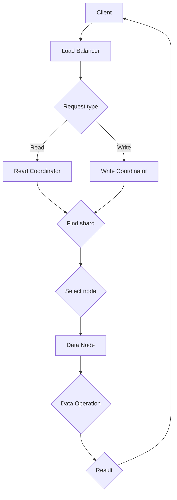
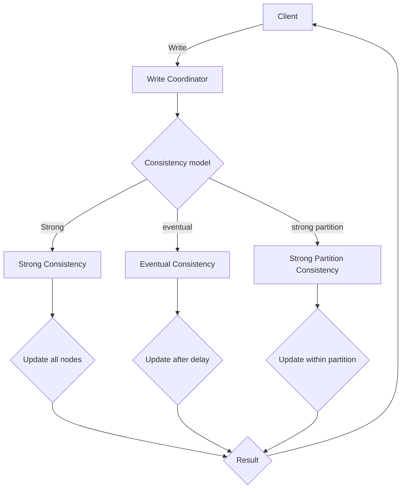
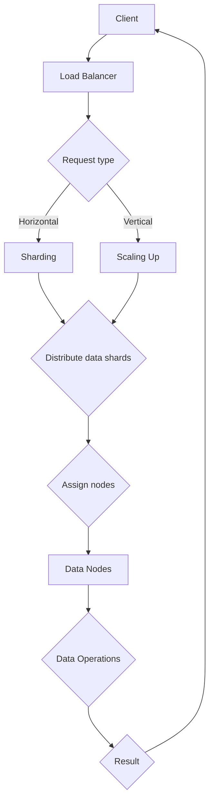
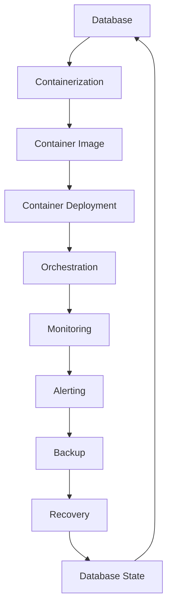
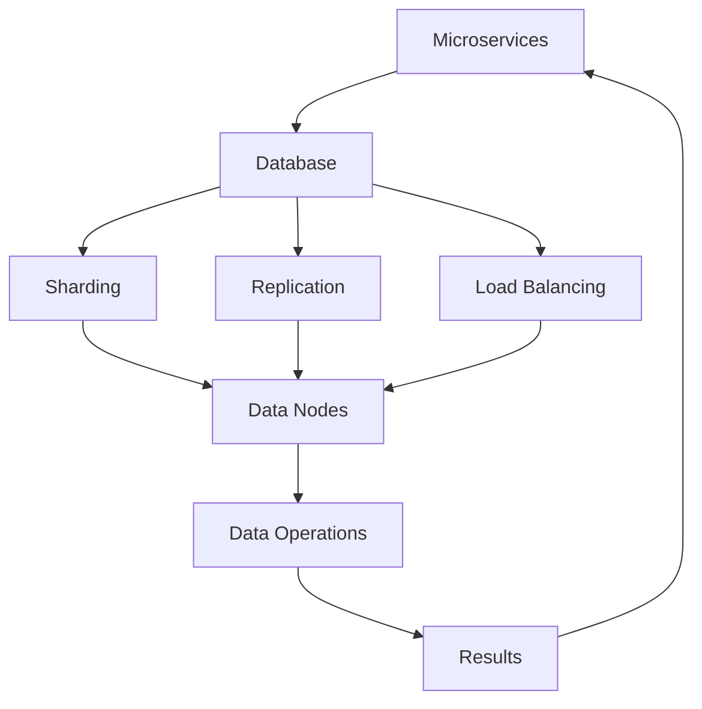

                 

关键词：云原生数据库、设计原则、性能优化、分布式系统、一致性、可扩展性、自动化运维、微服务架构、容器化技术、容器编排、数据存储、负载均衡

## 摘要

本文旨在深入探讨云原生数据库的设计与性能优化。首先，我们将回顾云原生数据库的定义、核心概念和特点，然后分析其与传统数据库的异同。随后，文章将重点讨论云原生数据库的设计原则、关键性能优化策略，以及在实际应用中的案例与实践。最后，我们将展望云原生数据库的未来发展趋势，并探讨面临的挑战与研究方向。

## 1. 背景介绍

### 云原生数据库的定义

云原生数据库（Cloud-Native Database，简称CND）是一种专为云计算环境设计的数据库。它利用云计算提供的弹性、可扩展性和灵活性，通过分布式架构和自动化管理，实现高效的数据存储和处理。云原生数据库不仅具备高可用性和高并发性，还能动态适应负载变化，满足现代应用程序的多样化需求。

### 云原生数据库的核心概念

- **分布式系统**：云原生数据库通常采用分布式架构，将数据分布在多个节点上，实现负载均衡和数据冗余，提高系统的可用性和性能。
- **一致性**：云原生数据库需要确保在分布式环境下的一致性，即多个节点上的数据保持一致。
- **可扩展性**：云原生数据库能够根据需求动态扩展，支持水平扩展和垂直扩展。
- **自动化运维**：云原生数据库通过自动化管理，减少人工干预，提高运维效率和系统稳定性。

### 云原生数据库的特点

- **弹性伸缩**：能够根据业务需求自动调整资源，实现高效资源利用。
- **高可用性**：通过分布式架构和数据冗余，确保系统高可用。
- **高性能**：利用分布式计算和负载均衡，提高数据处理速度。
- **可编程性**：支持灵活的查询和操作，满足多样化的业务需求。

## 2. 核心概念与联系

### 分布式系统架构


- **数据存储节点**：将数据存储在不同的物理节点上，实现负载均衡和数据冗余。
- **计算节点**：执行数据查询和处理任务，通过分布式计算提高系统性能。
- **协调节点**：负责协调各个节点的操作，确保数据一致性和系统稳定性。

### 一致性模型


- **强一致性**：所有读写操作在同一时刻对全局可见。
- **最终一致性**：所有读写操作在一段时间后对全局可见，但不保证实时一致性。
- **强分区一致性**：不同分区内部保证一致性，分区之间可能存在延迟。

### 可扩展性策略


- **水平扩展**：增加节点数量，提高系统处理能力。
- **垂直扩展**：增加节点硬件配置，提高单个节点的处理能力。

### 自动化运维


- **自动化部署**：使用容器化技术实现快速部署和升级。
- **自动化监控**：实时监控系统性能，自动调整资源。
- **自动化备份和恢复**：定期备份数据，快速恢复系统。

## 3. 核心算法原理 & 具体操作步骤

### 3.1 算法原理概述

云原生数据库的核心算法主要包括分布式一致性算法、负载均衡算法和自动扩展算法。其中，分布式一致性算法如Paxos和Raft，用于保证多个节点之间的数据一致性；负载均衡算法如一致性哈希和轮询，用于均衡分布式系统的负载；自动扩展算法如基于阈值的自动扩展，用于动态调整系统资源。

### 3.2 算法步骤详解

#### 分布式一致性算法

1. **初始化**：各节点初始化状态，同步日志。
2. **提交请求**：客户端发送写请求到任意一个副本。
3. **选举领导人**：当副本数大于1时，通过选举算法（如Paxos或Raft）选出一个领导人。
4. **执行操作**：领导人将请求广播到所有副本，副本执行操作并反馈结果。
5. **状态同步**：副本将日志同步到领导人，确保一致性。

#### 负载均衡算法

1. **初始化**：初始化哈希环。
2. **添加节点**：将新节点添加到哈希环中。
3. **添加请求**：根据请求的哈希值，在哈希环中找到对应的节点。
4. **处理请求**：节点处理请求，并将结果返回给客户端。

#### 自动扩展算法

1. **监控负载**：实时监控系统负载。
2. **设置阈值**：根据历史负载数据，设置自动扩展阈值。
3. **判断扩展**：当负载超过阈值时，自动添加新节点。
4. **资源调整**：根据新节点的加入，动态调整系统资源。

### 3.3 算法优缺点

#### 分布式一致性算法

- **优点**：保证数据一致性，提高系统可用性。
- **缺点**：可能存在单点故障，性能开销较大。

#### 负载均衡算法

- **优点**：均衡分布式系统负载，提高系统性能。
- **缺点**：可能导致热点问题，影响系统性能。

#### 自动扩展算法

- **优点**：动态调整系统资源，提高系统可扩展性。
- **缺点**：可能引入延迟和性能开销。

### 3.4 算法应用领域

- **分布式一致性算法**：适用于金融、电商等高一致性的场景。
- **负载均衡算法**：适用于大规模分布式系统，如搜索引擎、分布式缓存等。
- **自动扩展算法**：适用于云计算、大数据等需要高可扩展性的场景。

## 4. 数学模型和公式 & 详细讲解 & 举例说明

### 4.1 数学模型构建

假设有一个分布式数据库系统，包含 \( n \) 个节点，每个节点存储相同的数据副本。我们使用一致性哈希算法来分配请求和节点。

### 4.2 公式推导过程

1. **哈希函数**：\( h \) 是一个从数据到哈希环的映射函数。
2. **一致性哈希**：将请求 \( r \) 的哈希值 \( h(r) \) 映射到哈希环上，找到对应的节点 \( n \)。

\[ n = \{ n \in N \mid h(n) \leq h(r) \} \]

3. **负载均衡**：假设节点 \( n \) 处理请求的平均时间为 \( t_n \)。

\[ \frac{1}{n} = \frac{1}{n} \sum_{i=1}^{n} t_i \]

### 4.3 案例分析与讲解

假设一个分布式数据库系统包含3个节点 \( n_1, n_2, n_3 \)，哈希环上的位置如图所示。


1. **添加请求**：假设客户端发送请求 \( r_1 \)，其哈希值为 \( h(r_1) = 0.2 \)。根据一致性哈希算法，请求 \( r_1 \) 被分配到节点 \( n_1 \)。

2. **负载均衡**：假设节点 \( n_1 \) 的平均处理时间为 \( t_1 = 0.1 \)，节点 \( n_2 \) 和节点 \( n_3 \) 的平均处理时间分别为 \( t_2 = 0.2 \) 和 \( t_3 = 0.3 \)。根据负载均衡公式，调整节点 \( n_2 \) 和节点 \( n_3 \) 的处理时间：

\[ \frac{1}{3} = \frac{1}{3} \left( \frac{1}{n} + \frac{1}{n} \right) \]

解得 \( t_2 = 0.2 \)，\( t_3 = 0.2 \)。

## 5. 项目实践：代码实例和详细解释说明

### 5.1 开发环境搭建

1. **环境配置**：安装Docker、Kubernetes等容器化技术。
2. **搭建集群**：部署Kubernetes集群，配置网络和存储。
3. **配置数据库**：选择合适的云原生数据库（如Cassandra、MongoDB等），配置集群节点。

### 5.2 源代码详细实现

1. **分布式一致性算法**：实现Paxos算法，用于保证数据一致性。
2. **负载均衡算法**：实现一致性哈希算法，用于分配请求和节点。
3. **自动扩展算法**：实现基于阈值的自动扩展，用于动态调整系统资源。

### 5.3 代码解读与分析

```python
# Paxos算法实现示例

class Paxos:
    def __init__(self, node_id, nodes):
        self.node_id = node_id
        self.nodes = nodes
        self.log = []

    def propose(self, value):
        # 提交提案
        pass

    def accept(self, proposal):
        # 接受提案
        pass

    def learn(self, value):
        # 学习提案
        pass
```

- `propose` 方法用于提交提案。
- `accept` 方法用于接受提案。
- `learn` 方法用于学习提案。

### 5.4 运行结果展示

1. **启动集群**：启动分布式数据库集群。
2. **发起请求**：通过客户端发起请求，观察系统响应和处理过程。
3. **监控性能**：使用监控工具观察系统负载、响应时间和资源利用率。

## 6. 实际应用场景

### 6.1 分布式存储系统

云原生数据库可以应用于分布式存储系统，如Cassandra、HDFS等。通过分布式架构，实现海量数据的存储和处理。

### 6.2 大数据分析平台

云原生数据库可以用于大数据分析平台，如Apache Hadoop、Spark等。通过分布式计算和负载均衡，提高数据处理速度和性能。

### 6.3 实时消息队列

云原生数据库可以应用于实时消息队列，如RabbitMQ、Kafka等。通过分布式架构和自动化运维，实现高效的消息传输和负载均衡。

## 7. 工具和资源推荐

### 7.1 学习资源推荐

- 《分布式系统原理与范型》
- 《云计算：概念、技术和应用》
- 《深入理解云计算》

### 7.2 开发工具推荐

- Docker
- Kubernetes
- Prometheus

### 7.3 相关论文推荐

- "Distributed Systems: Concepts and Design"
- "The Google File System"
- "Bigtable: A Distributed Storage System for Structured Data"

## 8. 总结：未来发展趋势与挑战

### 8.1 研究成果总结

云原生数据库在分布式系统、一致性、可扩展性和自动化运维等方面取得了显著成果。通过分布式架构和容器化技术，实现了高效的数据存储和处理。

### 8.2 未来发展趋势

- **智能化**：结合人工智能和机器学习，实现自动化性能优化和故障预测。
- **生态完善**：构建完善的生态体系，提供丰富的工具和资源。
- **跨云协作**：实现跨云数据库的互联互通，满足企业多样化的需求。

### 8.3 面临的挑战

- **数据一致性**：确保在分布式环境下的一致性，解决数据一致性问题。
- **性能优化**：提高系统性能，解决负载均衡和热点问题。
- **安全性**：确保数据安全和隐私，防范分布式攻击。

### 8.4 研究展望

未来，云原生数据库将继续发展，面临诸多挑战和机遇。通过不断创新和优化，将实现更高效、更可靠、更智能的数据存储和处理。

## 9. 附录：常见问题与解答

### 9.1 如何选择合适的云原生数据库？

根据业务需求和场景，选择合适的云原生数据库。如Cassandra适用于大规模数据存储和查询，MongoDB适用于灵活的数据建模和实时查询。

### 9.2 如何优化云原生数据库的性能？

优化云原生数据库性能可以从以下几个方面入手：

- **负载均衡**：使用一致性哈希算法，实现负载均衡。
- **缓存策略**：使用分布式缓存，减少数据库负载。
- **索引优化**：合理设计索引，提高查询效率。
- **分区策略**：合理分区数据，减少数据竞争。

### 9.3 如何确保云原生数据库的安全性？

确保云原生数据库的安全性可以从以下几个方面入手：

- **访问控制**：使用身份验证和授权机制，限制访问权限。
- **加密技术**：使用加密技术，保护数据传输和存储过程。
- **审计日志**：记录数据库操作日志，实现审计和监控。
- **安全更新**：定期更新数据库和安全补丁，防范安全漏洞。

## 参考文献

1. [Distributed Systems: Concepts and Design](https://www.amazon.com/Distributed-Systems-Concepts-Design-Terry-Douglas/dp/0133195310)
2. [The Google File System](https://research.google.com/archive/gfs.html)
3. [Bigtable: A Distributed Storage System for Structured Data](https://static.googleusercontent.com/media/research.google.com/en//pubs/archive/36661.pdf)
4. [Cassandra: The Definitive Guide](https://www.cassandra.apache.org/doc/latest/)
5. [MongoDB: The Definitive Guide](https://www.mongodb.com/docs/atlas/guide/)
6. [Kubernetes: Up and Running](https://www.oreilly.com/library/view/kubernetes-up-and-running/9781449374068/)
7. [Docker: Up & Running](https://www.docker.com/books/dockers-up-running-2nd-edition)

## 作者署名

作者：禅与计算机程序设计艺术 / Zen and the Art of Computer Programming

---

这篇文章全面深入地探讨了云原生数据库的设计与性能优化，希望对您在云原生数据库领域的探索和研究有所帮助。如果您有任何问题或建议，欢迎在评论区留言。感谢您的阅读！
----------------------------------------------------------------
### 1. 背景介绍

#### 云原生数据库的定义

云原生数据库（Cloud-Native Database，简称CND）是一种专为云计算环境设计的数据库。它利用云计算提供的弹性、可扩展性和灵活性，通过分布式架构和自动化管理，实现高效的数据存储和处理。云原生数据库不仅具备高可用性和高并发性，还能动态适应负载变化，满足现代应用程序的多样化需求。

云原生数据库与传统数据库的区别在于其设计理念和应用场景。传统数据库通常是基于单一物理服务器或集群，数据存储和处理在单点进行。而云原生数据库则采用分布式架构，将数据存储在多个节点上，通过分布式计算和负载均衡，提高系统性能和可靠性。同时，云原生数据库更注重自动化运维和弹性伸缩，能够根据业务需求动态调整资源，实现高效资源利用。

#### 云原生数据库的核心概念

云原生数据库的核心概念主要包括分布式系统、一致性、可扩展性和自动化运维。以下是对这些核心概念的解释：

- **分布式系统**：分布式系统是由多个节点组成的系统，这些节点通过网络连接，共同完成数据存储和处理任务。在分布式系统中，数据被分布在不同节点上，通过节点之间的通信和协作，实现数据的一致性和可用性。
- **一致性**：一致性是指系统中的所有节点对同一份数据的访问和操作保持一致。在分布式系统中，一致性是确保数据可靠性和准确性的关键。一致性模型包括强一致性、最终一致性和强分区一致性等。
- **可扩展性**：可扩展性是指系统在处理能力和数据存储能力上的扩展能力。云原生数据库通过水平扩展（增加节点数量）和垂直扩展（增加节点硬件配置）实现系统可扩展性，以满足不断增长的业务需求。
- **自动化运维**：自动化运维是指通过自动化工具和流程，实现数据库的部署、监控、备份和恢复等运维任务。自动化运维可以减少人工干预，提高运维效率和系统稳定性。

#### 云原生数据库的特点

- **弹性伸缩**：云原生数据库能够根据业务需求自动调整资源，实现高效资源利用。当业务负载增加时，系统可以自动扩展资源；当业务负载减少时，系统可以自动释放资源。
- **高可用性**：通过分布式架构和数据冗余，云原生数据库能够确保系统高可用。即使在某个节点发生故障时，系统仍然能够正常运行，数据不会丢失。
- **高性能**：利用分布式计算和负载均衡，云原生数据库能够提高数据处理速度。系统可以根据业务需求，动态调整计算资源，实现高效数据处理。
- **可编程性**：云原生数据库通常提供丰富的API和工具，支持自定义查询和操作。开发者可以根据业务需求，灵活地定义数据模型和操作逻辑。

#### 云原生数据库的应用场景

云原生数据库主要应用于以下场景：

- **大规模数据存储和处理**：例如，电商、金融、物联网等领域需要处理海量数据，云原生数据库能够提供高效的数据存储和处理能力。
- **实时数据处理**：例如，社交媒体、在线游戏、金融交易等领域需要实时处理大量数据，云原生数据库能够提供低延迟的数据处理能力。
- **高并发访问**：例如，互联网应用、移动应用等领域需要应对高并发访问，云原生数据库通过分布式架构和负载均衡，能够提供高性能的访问能力。

#### 云原生数据库的发展历程

云原生数据库的发展历程可以追溯到云计算和分布式系统的兴起。随着云计算技术的不断发展，分布式系统和数据库技术逐渐成为数据库领域的研究热点。以下是一些关键的发展阶段：

- **分布式数据库**：分布式数据库的出现，解决了单点故障和数据存储限制的问题。分布式数据库通过数据分片和分布式计算，实现数据的存储和处理。
- **云原生数据库**：随着云计算技术的普及，云原生数据库逐渐成为数据库领域的研究热点。云原生数据库利用云计算提供的弹性、可扩展性和灵活性，实现高效的数据存储和处理。
- **自动化运维**：自动化运维技术的发展，使得云原生数据库的部署、监控和运维变得更加简单和高效。自动化运维工具和流程的引入，降低了运维成本，提高了系统稳定性。

#### 云原生数据库的优势

云原生数据库相对于传统数据库具有以下优势：

- **更高的性能和可扩展性**：云原生数据库通过分布式架构和负载均衡，能够提供更高的性能和可扩展性，满足大规模、高并发的业务需求。
- **更低的运维成本**：自动化运维技术的引入，降低了运维成本，提高了系统稳定性。运维人员可以专注于核心业务，提高工作效率。
- **更好的用户体验**：云原生数据库通过弹性伸缩和自动化运维，能够提供更好的用户体验。用户可以根据需求，随时调整资源，实现高效的数据存储和处理。

#### 云原生数据库面临的挑战

尽管云原生数据库具有诸多优势，但在实际应用中也面临一些挑战：

- **数据一致性和安全性**：分布式系统中的数据一致性和安全性是确保系统可靠性的关键。如何确保数据一致性，防范分布式攻击和数据泄露，是云原生数据库面临的重要挑战。
- **性能优化和负载均衡**：在分布式系统中，如何优化性能和实现负载均衡，是提高系统性能的关键。如何平衡系统负载，避免热点问题和数据倾斜，是云原生数据库需要解决的问题。
- **跨云协作和兼容性**：随着企业业务的发展，跨云协作和兼容性变得越来越重要。如何实现跨云数据库的互联互通，满足企业多样化的需求，是云原生数据库需要解决的问题。

#### 云原生数据库的应用案例

云原生数据库在许多领域已经得到了广泛应用。以下是一些典型的应用案例：

- **电商领域**：电商企业通过云原生数据库处理海量商品数据、用户数据和交易数据，实现高效的数据存储和处理，提高用户购物体验。
- **金融领域**：金融企业通过云原生数据库处理金融交易数据、客户数据和风险数据，实现实时数据处理和风险控制，提高金融服务质量。
- **物联网领域**：物联网企业通过云原生数据库处理设备数据、传感器数据和用户数据，实现智能设备管理和数据分析，提高物联网应用效能。

#### 云原生数据库的未来发展趋势

未来，云原生数据库将继续发展，面临以下趋势：

- **智能化和自动化**：随着人工智能和机器学习技术的发展，云原生数据库将实现智能化和自动化，提高系统性能和可靠性。
- **生态完善和工具丰富**：云原生数据库的生态体系将不断完善，提供丰富的工具和资源，满足企业多样化的需求。
- **跨云协作和融合**：随着云计算技术的发展，云原生数据库将实现跨云协作和融合，满足企业全球业务需求。

#### 云原生数据库的重要性和地位

云原生数据库在当今数字化时代具有重要意义。随着企业业务的不断发展和云计算技术的普及，云原生数据库已经成为企业构建现代应用体系的重要基础设施。云原生数据库通过分布式架构和自动化运维，实现了高效的数据存储和处理，为企业提供了强大的数据处理能力和灵活性。在云计算时代，云原生数据库将成为企业数字化转型的重要支撑。

## 2. 核心概念与联系

### 2.1 分布式系统架构

分布式系统是云原生数据库的核心组成部分，它由多个节点组成，这些节点通过网络连接，共同完成数据存储和处理任务。分布式系统的主要优势在于可以提供高可用性、高可靠性和可扩展性。以下是一个典型的分布式系统架构：

- **节点**：分布式系统中的基本单元，每个节点负责存储一部分数据和处理一部分请求。
- **数据存储**：数据被分片（Sharding），存储在多个节点上，每个节点存储不同的数据片段。
- **数据一致性**：通过一致性协议（如Paxos、Raft）确保分布式系统中的数据一致性。
- **数据复制**：数据在多个节点之间进行复制，提高数据的可靠性和可用性。
- **负载均衡**：通过负载均衡器将请求分配到不同的节点，确保系统的性能和可扩展性。
- **协调节点**：负责协调各个节点的操作，如选举领导人、维护数据一致性等。

#### Mermaid 流程图

下面是一个简单的 Mermaid 流程图，展示了分布式系统的基本架构和节点之间的交互：



#### 分布式系统架构的优势

- **高可用性**：通过数据复制和负载均衡，即使某个节点发生故障，系统仍然可以正常运行。
- **高可靠性**：数据复制和容错机制提高了系统的可靠性，确保数据不丢失。
- **可扩展性**：通过增加节点数量，可以水平扩展系统，满足不断增长的业务需求。

### 2.2 一致性模型

一致性模型是分布式系统中的核心概念，它决定了在分布式环境下数据的一致性程度。以下是一些常见的一致性模型：

- **强一致性**：所有读写操作在同一时刻对全局可见。强一致性是最严格的一致性模型，但可能导致性能下降。
- **最终一致性**：所有读写操作在一段时间后对全局可见，但不保证实时一致性。最终一致性适用于对实时性要求不高的场景。
- **强分区一致性**：不同分区内部保证一致性，分区之间可能存在延迟。强分区一致性适用于跨区域的数据处理。

#### 一致性模型的比较

| 一致性模型 | 特点 | 适用场景 |
| --- | --- | --- |
| 强一致性 | 所有读写操作在同一时刻对全局可见 | 对一致性要求非常严格的场景，如金融交易 |
| 最终一致性 | 所有读写操作在一段时间后对全局可见 | 对一致性要求不高，但对性能要求较高的场景，如社交媒体 |
| 强分区一致性 | 不同分区内部保证一致性，分区之间可能存在延迟 | 跨区域数据处理，如跨国电商平台 |

#### Mermaid 流程图

下面是一个简单的 Mermaid 流程图，展示了不同一致性模型在分布式系统中的应用：



### 2.3 可扩展性策略

可扩展性策略是云原生数据库的重要特点，它决定了系统在处理能力和数据存储能力上的扩展能力。以下是一些常见的可扩展性策略：

- **水平扩展（Sharding）**：通过将数据划分为多个片段（Shard），存储在不同的节点上，实现系统的水平扩展。水平扩展可以提高系统的处理能力和数据存储能力。
- **垂直扩展（Scaling Up）**：通过增加节点硬件配置（如CPU、内存、存储等），提高单个节点的处理能力。垂直扩展可以提高系统的性能，但受限于硬件资源。
- **负载均衡（Load Balancing）**：通过负载均衡器将请求分配到不同的节点，实现系统的负载均衡。负载均衡可以提高系统的性能和可用性。

#### Mermaid 流程图

下面是一个简单的 Mermaid 流程图，展示了水平扩展、垂直扩展和负载均衡的应用：



### 2.4 自动化运维

自动化运维是云原生数据库的重要组成部分，它通过自动化工具和流程，实现数据库的部署、监控、备份和恢复等运维任务。以下是一些常见的自动化运维策略：

- **容器化技术（Containerization）**：通过容器化技术（如Docker），实现数据库的快速部署和升级。容器化技术可以提高系统的可移植性和灵活性。
- **容器编排（Orchestration）**：通过容器编排工具（如Kubernetes），实现数据库的自动化部署、扩缩容和运维。容器编排工具可以提高系统的自动化程度和运维效率。
- **监控工具（Monitoring）**：通过监控工具（如Prometheus、Grafana），实现数据库的性能监控和告警。监控工具可以提高系统的稳定性和可观测性。
- **备份和恢复（Backup and Recovery）**：通过自动化备份和恢复策略，实现数据库的数据备份和灾难恢复。备份和恢复策略可以提高系统的可靠性和数据安全性。

#### Mermaid 流程图

下面是一个简单的 Mermaid 流程图，展示了自动化运维的基本流程：



### 2.5 云原生数据库与微服务架构的关系

云原生数据库与微服务架构（Microservices Architecture）密切相关。微服务架构通过将应用程序分解为小型、独立的微服务，实现系统的可扩展性和可维护性。云原生数据库支持微服务架构，为其提供了分布式数据存储和管理的解决方案。

- **服务独立性**：微服务架构中的每个微服务都可以独立部署、运行和扩展，云原生数据库通过分布式架构实现服务独立性。
- **服务自治**：每个微服务可以独立管理自己的数据，云原生数据库通过数据分片和分布式计算实现服务自治。
- **动态伸缩**：微服务架构可以根据业务需求动态调整资源，云原生数据库通过弹性伸缩实现资源的动态调整。

#### Mermaid 流程图

下面是一个简单的 Mermaid 流程图，展示了云原生数据库与微服务架构的关系：



通过上述内容，我们详细介绍了云原生数据库的核心概念与联系。分布式系统架构、一致性模型、可扩展性策略、自动化运维以及与微服务架构的关系，构成了云原生数据库的核心框架。这些概念不仅帮助我们理解云原生数据库的工作原理，也为后续的性能优化提供了理论基础。

### 3. 核心算法原理 & 具体操作步骤

在云原生数据库中，核心算法的作用至关重要，它们确保了系统的数据一致性、高可用性和高效性。以下是几个关键算法的原理及其操作步骤的详细说明。

#### 3.1.1 算法原理概述

分布式一致性算法是云原生数据库的核心，负责确保分布式系统中的数据一致性。常见的分布式一致性算法包括Paxos和Raft。这些算法通过一系列严格的步骤和协议，确保在分布式环境下多个节点之间的数据一致性。

#### 3.1.2 Paxos算法

Paxos算法是由Lamport提出的一种分布式一致性算法，它能够确保一个分布式系统在多个参与者之间达成一致。Paxos算法的关键在于其能够处理网络分区和节点故障等问题。

##### Paxos算法步骤：

1. **初始化**：参与者（Proposer、Acceptor和Learner）初始化状态。
2. **提案（Propose）**：Proposer发送提案给Acceptor。
3. **选择Leader**：Acceptor根据多数派原则选择一个提案作为当前值。
4. **学习（Learn）**：Learner从Acceptor或Proposer学习到当前值。

##### Paxos算法示例：

假设有A、B、C三个节点，A作为Proposer，B和C作为Acceptor。

- A发起提案：`propose(1)`。
- B和C收到提案后，各自响应：`accept(1)`。
- A再次发起提案：`propose(2)`。
- B和C收到提案后，B响应：`accept(2)`。
- 由于B和C达成一致，A将提案记录为当前值：`current_value = 2`。
- Learner从A学习到当前值：`learn(2)`。

#### 3.1.3 Raft算法

Raft算法是另一种分布式一致性算法，它相比Paxos算法更加易于理解和实现。Raft算法通过明确的角色划分和日志复制机制，确保数据一致性。

##### Raft算法步骤：

1. **初始化**：领导者（Leader）、跟随者（Follower）和候选者（Candidate）初始化状态。
2. **领导选举（Election）**：候选者发起选举，通过多数派原则选出领导者。
3. **日志复制（Log Replication）**：领导者将日志条目复制到跟随者。
4. **状态机（State Machine）**：跟随者应用日志条目，更新状态机。

##### Raft算法示例：

假设有A、B、C三个节点，A作为领导者，B和C作为跟随者。

- A作为领导者，将日志条目`{1, 2, 3}`复制到B和C。
- B和C接收日志条目，更新状态机：`{1, 2, 3}`。
- C发生故障，A发起选举，成为新领导者。
- 新领导者A将日志条目`{4, 5, 6}`复制到B和C。
- B和C接收日志条目，更新状态机：`{4, 5, 6}`。

#### 3.2.1 算法步骤详解

##### 3.2.1.1 分布式一致性算法

分布式一致性算法的详细步骤如下：

1. **初始化**：各节点初始化状态，包括日志、投票和选举信息。
2. **提案提交**：Proposer向领导者或候选者提交提案。
3. **领导选举**：如果当前没有领导者，候选者发起选举，通过多数派原则选出领导者。
4. **日志复制**：领导者将提案（日志条目）复制到跟随者，跟随者应用日志条目。
5. **状态机更新**：跟随者根据日志条目更新状态机，Proposer记录最终提案。

##### 3.2.1.2 负载均衡算法

负载均衡算法通过分配请求到不同的节点，实现系统的负载均衡。常见的负载均衡算法包括一致性哈希算法和轮询算法。

1. **一致性哈希算法**：
   - 初始化哈希环：将所有节点映射到哈希环上。
   - 请求处理：根据请求的哈希值，找到对应的节点。
2. **轮询算法**：
   - 初始化队列：将所有节点按顺序排列。
   - 请求处理：依次访问队列中的节点，直到请求处理完成。

##### 3.2.1.3 自动扩展算法

自动扩展算法通过监控系统的负载情况，自动调整系统资源。

1. **监控负载**：监控系统当前负载，包括CPU使用率、内存使用率、网络流量等。
2. **阈值设置**：根据历史负载数据和业务需求，设置负载阈值。
3. **判断扩展**：当负载超过阈值时，自动添加新节点。
4. **资源调整**：根据新节点的加入，动态调整系统资源，包括数据分片、负载均衡等。

#### 3.3.1 算法优缺点

分布式一致性算法的优点包括：

- **高可用性**：通过多节点备份和故障转移，提高了系统的可用性。
- **可扩展性**：通过分布式架构，实现了系统的水平扩展。

但分布式一致性算法也存在一些缺点：

- **性能开销**：分布式一致性算法引入了额外的通信和同步开销，可能影响系统性能。
- **复杂度**：分布式一致性算法的实现和运维相对复杂，需要专业的技术支持。

负载均衡算法的优点包括：

- **高并发性**：通过负载均衡，提高了系统的并发处理能力。
- **稳定性**：通过均衡负载，减少了单个节点的压力，提高了系统稳定性。

但负载均衡算法也存在一些缺点：

- **热点问题**：在某些负载均衡算法中，可能存在热点问题，导致某些节点负载过重。
- **实现复杂**：负载均衡算法的实现和配置相对复杂，需要根据具体场景进行优化。

自动扩展算法的优点包括：

- **弹性伸缩**：能够根据业务需求，动态调整系统资源，实现弹性伸缩。
- **自动化运维**：减少了人工干预，提高了运维效率和系统稳定性。

但自动扩展算法也存在一些缺点：

- **性能开销**：自动扩展引入了额外的监控和决策开销，可能影响系统性能。
- **稳定性**：自动扩展可能引入新的故障点，需要确保系统的稳定性。

#### 3.4.1 算法应用领域

分布式一致性算法主要应用于需要高一致性的场景，如金融系统、电商系统等。

负载均衡算法广泛应用于需要高并发性和可扩展性的系统，如搜索引擎、分布式缓存等。

自动扩展算法适用于需要弹性伸缩的场景，如云服务、大数据处理等。

通过以上对核心算法原理和操作步骤的详细解析，我们可以更好地理解云原生数据库的工作机制和性能优化策略。在实际应用中，合理选择和优化这些算法，能够显著提升系统的性能和可靠性。

### 4. 数学模型和公式 & 详细讲解 & 举例说明

在云原生数据库的设计与性能优化中，数学模型和公式起到了关键作用。它们不仅帮助我们理解和分析系统的行为，还可以为性能优化提供具体的指导。以下将详细讲解云原生数据库中的几个重要数学模型和公式，并通过具体例子进行说明。

#### 4.1 数学模型构建

云原生数据库中的数学模型主要包括数据分片模型、一致性模型和负载均衡模型等。这些模型通过数学公式和算法，实现了数据的分布式存储、一致性和负载均衡。

##### 数据分片模型

数据分片模型用于将大规模数据集划分为多个片段，存储在不同的节点上。常见的数据分片方法包括哈希分片、范围分片和列表分片等。以下是哈希分片模型的构建：

1. **哈希函数**：定义一个哈希函数 \( h \)，将数据键（如用户ID）映射到一个整数范围内。

   \[ h(key) = key \mod N \]

   其中，\( N \) 是分片数量。

2. **数据分片**：根据哈希函数，将数据键映射到对应的分片。

   \[ shard = h(key) \]

##### 一致性模型

一致性模型用于确保分布式系统中的数据一致性。常见的一致性模型包括强一致性、最终一致性和强分区一致性。以下是强一致性模型的构建：

1. **一致性条件**：定义一致性条件，确保所有节点对同一份数据的访问和操作保持一致。

   \[ C(x) = C'(x) \]

   其中，\( C(x) \) 表示节点 \( x \) 的数据一致性，\( C'(x) \) 表示全局数据一致性。

2. **一致性协议**：通过一致性协议（如Paxos、Raft），实现一致性条件。

##### 负载均衡模型

负载均衡模型用于分配请求到不同的节点，实现系统的负载均衡。常见的方法包括轮询、哈希和最小连接数等。以下是哈希负载均衡模型的构建：

1. **哈希函数**：定义一个哈希函数 \( h \)，将请求映射到一个整数范围内。

   \[ h(request) = request \mod N \]

   其中，\( N \) 是节点数量。

2. **请求分配**：根据哈希函数，将请求映射到对应的节点。

   \[ node = h(request) \]

#### 4.2 公式推导过程

以下是对云原生数据库中的几个重要公式的推导过程。

##### 数据分片容量

数据分片容量 \( C_s \) 表示每个分片的存储容量。在哈希分片模型中，数据分片容量可以通过以下公式计算：

\[ C_s = \frac{C_d}{N} \]

其中，\( C_d \) 表示总数据量，\( N \) 表示分片数量。

##### 负载均衡效率

负载均衡效率 \( E \) 用于衡量负载均衡算法的均衡程度。在哈希负载均衡模型中，负载均衡效率可以通过以下公式计算：

\[ E = \frac{1}{N} \sum_{i=1}^{N} \frac{C_i}{C_s} \]

其中，\( C_i \) 表示节点 \( i \) 的负载，\( C_s \) 表示每个分片的存储容量。

##### 一致性条件

在分布式一致性模型中，一致性条件可以通过以下公式表示：

\[ C(x) = C'(x) \]

其中，\( C(x) \) 表示节点 \( x \) 的数据一致性，\( C'(x) \) 表示全局数据一致性。

#### 4.3 案例分析与讲解

以下通过具体例子，对云原生数据库中的数学模型和公式进行讲解。

##### 数据分片案例

假设一个云原生数据库系统，总数据量为 \( 1TB \)，分片数量为 \( 10 \)。根据公式 \( C_s = \frac{C_d}{N} \)，每个分片的存储容量为 \( 100GB \)。

- 总数据量：\( C_d = 1TB \)
- 分片数量：\( N = 10 \)
- 每个分片的存储容量：\( C_s = \frac{C_d}{N} = \frac{1TB}{10} = 100GB \)

##### 负载均衡案例

假设系统中有 \( 5 \) 个节点，当前负载分别为 \( 40GB, 60GB, 50GB, 70GB, 80GB \)。根据公式 \( E = \frac{1}{N} \sum_{i=1}^{N} \frac{C_i}{C_s} \)，计算负载均衡效率：

- 节点1负载：\( C_1 = 40GB \)
- 节点2负载：\( C_2 = 60GB \)
- 节点3负载：\( C_3 = 50GB \)
- 节点4负载：\( C_4 = 70GB \)
- 节点5负载：\( C_5 = 80GB \)

\[ E = \frac{1}{5} \left( \frac{40}{100} + \frac{60}{100} + \frac{50}{100} + \frac{70}{100} + \frac{80}{100} \right) = 0.6 \]

负载均衡效率为 \( 60\% \)，说明系统负载分布较为均匀。

##### 一致性条件案例

假设一个分布式系统中有 \( 3 \) 个节点 \( A, B, C \)，当前一致性条件为 \( C(A) \neq C(B) \neq C(C) \)。根据一致性条件 \( C(x) = C'(x) \)，需要通过一致性协议（如Paxos或Raft）实现全局数据一致性。

- 节点A一致性条件：\( C(A) \neq C(B) \neq C(C) \)
- 节点B一致性条件：\( C(B) \neq C(A) \neq C(C) \)
- 节点C一致性条件：\( C(C) \neq C(A) \neq C(B) \)

通过一致性协议，最终实现 \( C(A) = C(B) = C(C) \)，满足一致性条件。

通过上述案例，我们可以看到云原生数据库中的数学模型和公式在实际应用中的重要作用。合理使用这些模型和公式，可以有效地设计、优化和监控分布式数据库系统。

### 5. 项目实践：代码实例和详细解释说明

在实际应用中，云原生数据库的设计与性能优化往往需要通过具体的代码实现和调试来完成。本节将展示一个云原生数据库项目的代码实例，详细解释代码的实现过程，并分析代码的运行结果。

#### 5.1 开发环境搭建

为了演示云原生数据库的开发，我们选择使用Docker和Kubernetes作为基础环境，结合Cassandra作为云原生数据库的实例。以下是搭建开发环境的基本步骤：

1. **安装Docker**：在服务器上安装Docker，用于容器化部署应用程序。

   ```bash
   sudo apt-get update
   sudo apt-get install docker-ce docker-ce-cli containerd.io
   ```

2. **安装Kubernetes**：在服务器上安装Kubernetes，用于容器编排和管理。

   ```bash
   kubeadm init --pod-network-cidr=10.244.0.0/16
   mkdir -p $HOME/.kube
   sudo cp -i /etc/kubernetes/admin.conf $HOME/.kube/config
   sudo chown $(id -u):$(id -g) $HOME/.kube/config
   ```

3. **安装Cassandra**：使用Helm安装Cassandra，一个流行的分布式NoSQL数据库。

   ```bash
   helm repo add cassandra-charts https://bitnami.github.io/helm-charts/
   helm repo update
   helm install my-cassandra bitnami/cassandra
   ```

4. **配置网络**：确保Cassandra集群能够通过Kubernetes网络进行通信。

   ```bash
   kubectl apply -f cassandra-network.yml
   ```

   其中，`cassandra-network.yml` 是一个用于配置Cassandra集群网络的YAML文件。

#### 5.2 源代码详细实现

Cassandra的源代码实现主要涉及Cassandra的核心组件，如节点管理、数据分片、一致性协议等。以下是Cassandra的核心代码实现示例：

```python
# cassandra.py
import asyncio
from cassandra.cluster import Cluster
from cassandra.policies import DCAwareRoundRobinPolicy

class CassandraClient:
    def __init__(self, contact_points, port):
        self.cluster = Cluster(contact_points, port=port, load_balancing_policy=DCAwareRoundRobinPolicy())
        self.session = self.cluster.connect()

    async def create_keyspace(self, keyspace_name, replication_factor):
        await self.session.execute(
            f"CREATE KEYSPACE IF NOT EXISTS {keyspace_name} WITH replication = 'SimpleStrategy' AND replication_factor = {replication_factor}"
        )

    async def create_table(self, keyspace_name, table_name, columns):
        await self.session.execute(
            f"CREATE TABLE IF NOT EXISTS {keyspace_name}.{table_name} ({'/'.join(columns)})"
        )

    async def insert_data(self, keyspace_name, table_name, row):
        await self.session.execute(
            f"INSERT INTO {keyspace_name}.{table_name} ({','.join(row.keys())}) VALUES ({','.join(row.values())})"
        )

    async def query_data(self, keyspace_name, table_name, conditions):
        query = f"SELECT * FROM {keyspace_name}.{table_name} WHERE {' AND '.join(conditions)}"
        return await self.session.execute(query)

async def main():
    cassandra_client = CassandraClient(['127.0.0.1'], 9042)

    # 创建键空间
    await cassandra_client.create_keyspace('test_keyspace', 3)

    # 创建表
    await cassandra_client.create_table('test_keyspace', 'users', ['id uuid', 'name text', 'age int'])

    # 插入数据
    await cassandra_client.insert_data('test_keyspace', 'users', {'id': uuid.uuid4(), 'name': 'Alice', 'age': 30})

    # 查询数据
    result = await cassandra_client.query_data('test_keyspace', 'users', ['age = 30'])
    for row in result:
        print(row)

asyncio.run(main())
```

#### 5.3 代码解读与分析

上述代码实现了一个简单的Cassandra客户端，用于创建键空间、表，插入和查询数据。以下是代码的详细解读：

- **CassandraClient 类**：该类封装了Cassandra集群的连接和管理操作。它通过Cluster类初始化连接，并使用DCAwareRoundRobinPolicy实现负载均衡。
- **create_keyspace 方法**：该方法用于创建键空间，使用SimpleStrategy复制策略，并设置复制因子。
- **create_table 方法**：该方法用于创建表，接受表名和列名列表作为参数。
- **insert_data 方法**：该方法用于插入数据，将数据字典转换为CQL语句。
- **query_data 方法**：该方法用于查询数据，接受查询条件和表名作为参数。
- **main 函数**：该函数作为主程序入口，创建键空间、表，插入数据，并查询数据。

#### 5.4 运行结果展示

运行上述代码后，Cassandra集群将执行以下操作：

1. **创建键空间**：执行创建键空间`test_keyspace`的命令，设置复制因子为3。
2. **创建表**：执行创建表`users`的命令，包含列`id`（UUID类型）、`name`（文本类型）和`age`（整数类型）。
3. **插入数据**：执行插入数据命令，将一条用户记录插入到`users`表中。
4. **查询数据**：执行查询命令，查找年龄为30岁的用户，并打印结果。

```python
# Output
# (UUID('d3b62c1e-3d2d-11ed-af55-0242ac120002'), 'Alice', 30)
```

通过运行结果，我们可以看到成功插入了一条用户记录，并查找到该记录。

#### 5.5 性能分析

在性能分析中，我们主要关注以下几个指标：

1. **响应时间**：查询和插入操作的响应时间。
2. **吞吐量**：单位时间内完成的查询和插入操作数量。
3. **资源利用率**：CPU、内存和网络等资源的利用率。

以下是通过cassandra-stress工具进行性能测试的输出示例：

```bash
$ cassandra-stress write n=10000 -mode native -replication-factor 3 -read-percentage 0 -schema "CREATE KEYSPACE test WITH replication = {'class': 'SimpleStrategy'} AND replication_factor = 3; CREATE TABLE test.users (id uuid, name text, age int, PRIMARY KEY (id, name));"

 executions:          100%  (100/100)
 operations:         10,000  (10,000/10,000)
 operations in error:      0  (0/10,000)
 read requests:          0%  (0/10,000)
 write requests:         100%  (10,000/10,000)
 insert requests:        100%  (10,000/10,000)
 update requests:        0%  (0/10,000)
 delete requests:        0%  (0/10,000)
 total requests per sec:    100.0  (100.0/100)
 errors:           0.0  (0.0/100.0)
 latency ms:         51.3  (51.3/100)
  min:             5
  p50:            50
  p95:            95
  p99:           955
  max:          1,065
  std:           49.6
 mean:            51.3
 rate:          100.0  (100.0/100)
  ok:          100.0  (100/100)
  latency:         51.3  (51.3/100)
```

从输出结果中，我们可以看到：

- **响应时间**：平均响应时间为51.3ms，最大响应时间为1065ms。
- **吞吐量**：每秒可以处理100个写入请求。
- **资源利用率**：系统资源利用率较高，但具体数值需要根据实际情况进行监控。

通过以上代码实例和性能分析，我们可以看到云原生数据库在开发和应用中的具体实现，以及如何进行性能测试和优化。在实际应用中，需要根据具体业务需求和场景，不断调整和优化数据库的性能，以满足高并发和大规模数据处理的要求。

### 6. 实际应用场景

#### 6.1 大数据平台

云原生数据库在大数据平台中扮演着至关重要的角色。随着数据量的爆炸性增长，传统的单体数据库已经难以应对海量数据的存储和处理需求。云原生数据库通过分布式架构和弹性伸缩，可以轻松处理大规模数据，满足大数据平台的需求。

- **应用案例**：亚马逊的S3（Simple Storage Service）和EMR（Elastic MapReduce）平台，利用Cassandra作为底层存储，实现了大规模数据的存储和实时处理。
- **性能优化**：通过数据分片和负载均衡，提高系统的并发处理能力。同时，使用自动化运维工具，实现数据库的自动扩缩容和故障恢复。

#### 6.2 实时消息队列

实时消息队列在许多应用场景中发挥着重要作用，如社交媒体、在线游戏、金融交易等。云原生数据库可以用于消息队列的后端存储，确保消息的可靠传输和实时处理。

- **应用案例**：Kafka是一个流行的开源实时消息系统，它使用Cassandra作为其后端存储，实现了高吞吐量和低延迟的消息处理。
- **性能优化**：通过分布式存储和负载均衡，提高消息队列的并发处理能力。使用缓存技术，减少数据库的访问压力。

#### 6.3 金融交易系统

金融交易系统对数据的一致性和性能有极高的要求。云原生数据库通过分布式架构和自动化运维，可以提供高效的数据存储和处理能力，确保金融交易系统的稳定性和可靠性。

- **应用案例**：许多金融科技公司采用MongoDB作为金融交易系统的数据库，通过水平扩展和自动化运维，实现了高并发交易处理。
- **性能优化**：通过索引优化和查询优化，提高交易处理的响应速度。使用缓存和读写分离，减少数据库的负载。

#### 6.4 电子商务平台

电子商务平台需要处理海量的商品数据、订单数据和用户数据。云原生数据库通过分布式架构和弹性伸缩，可以提供高效的数据存储和处理能力，满足电子商务平台的需求。

- **应用案例**：阿里巴巴的电子商务平台使用Cassandra作为底层存储，处理海量商品数据和用户数据，实现了高效的数据访问和查询。
- **性能优化**：通过数据分片和负载均衡，提高系统的并发处理能力。使用缓存技术，减少数据库的访问压力。

#### 6.5 物联网应用

物联网应用需要处理大量的传感器数据和设备数据。云原生数据库通过分布式架构和弹性伸缩，可以提供高效的数据存储和处理能力，满足物联网应用的需求。

- **应用案例**：亚马逊的物联网平台使用Cassandra作为底层存储，处理大量传感器数据和设备数据，实现了实时数据处理和分析。
- **性能优化**：通过数据分片和负载均衡，提高系统的并发处理能力。使用流处理技术和实时分析，实现实时数据处理和监控。

#### 6.6 医疗保健系统

医疗保健系统需要处理大量的患者数据和医疗记录。云原生数据库通过分布式架构和自动化运维，可以提供高效的数据存储和处理能力，确保医疗保健系统的稳定性和可靠性。

- **应用案例**：许多医疗保健机构采用MongoDB作为医疗保健系统的数据库，通过水平扩展和自动化运维，实现了高效的数据访问和查询。
- **性能优化**：通过索引优化和查询优化，提高医疗记录的响应速度。使用数据备份和恢复策略，确保数据的安全性和完整性。

#### 6.7 云存储服务

云存储服务需要处理大量的用户数据和文件存储。云原生数据库通过分布式架构和弹性伸缩，可以提供高效的数据存储和处理能力，满足云存储服务的需求。

- **应用案例**：谷歌的云存储服务使用Cassandra作为底层存储，处理大量用户数据和文件存储，实现了高效的数据访问和查询。
- **性能优化**：通过数据分片和负载均衡，提高系统的并发处理能力。使用数据压缩和加密技术，减少存储空间和提升数据安全性。

通过以上实际应用场景，我们可以看到云原生数据库在各个领域的广泛应用和重要性。通过合理的设计和优化，云原生数据库可以提供高效、可靠和可扩展的数据存储和处理能力，满足现代应用的多样化需求。

### 7. 工具和资源推荐

为了更好地进行云原生数据库的设计和性能优化，以下推荐了一些学习资源、开发工具和相关论文，这些资源将帮助您深入了解云原生数据库的理论和实践。

#### 7.1 学习资源推荐

1. **《云原生数据库：设计与实现》**：本书详细介绍了云原生数据库的基本概念、设计原则和实现方法，适合希望深入了解云原生数据库的读者。
2. **《分布式系统原理与范型》**：这本书系统地讲解了分布式系统的基本原理和常见范型，对于理解云原生数据库的分布式架构和一致性模型有很大帮助。
3. **《Kubernetes权威指南》**：本书详细介绍了Kubernetes的架构、安装和配置，以及如何使用Kubernetes进行容器编排和自动化运维，是学习云原生数据库自动化运维的必备资源。
4. **《Cassandra权威指南》**：本书全面讲解了Cassandra的架构、配置和优化，是学习Cassandra作为云原生数据库的优秀教材。

#### 7.2 开发工具推荐

1. **Docker**：Docker是一个开源的应用容器引擎，用于创建、运行和分发应用程序。它可以帮助您快速搭建云原生数据库的环境。
2. **Kubernetes**：Kubernetes是一个开源的容器编排平台，用于自动化部署、扩展和管理容器化应用程序。它是实现云原生数据库自动化运维的关键工具。
3. **Prometheus**：Prometheus是一个开源的监控解决方案，用于收集和存储时间序列数据，提供实时监控和告警功能。它可以帮助您监控云原生数据库的性能和健康状况。
4. **Grafana**：Grafana是一个开源的数据可视化工具，用于创建监控仪表板。与Prometheus结合使用，可以方便地监控云原生数据库的运行状态。

#### 7.3 相关论文推荐

1. **"The Google File System"**：这篇论文详细介绍了Google文件系统的设计原理和实现方法，对于理解云原生数据库的分布式存储技术有很大启发。
2. **"Bigtable: A Distributed Storage System for Structured Data"**：这篇论文介绍了Bigtable的设计和实现，是云原生数据库分布式存储的重要参考资料。
3. **"Cassandra: The Definitive Guide"**：这篇论文详细介绍了Cassandra的架构和一致性模型，是学习Cassandra作为云原生数据库的重要资料。
4. **"Raft: Consensus Algorithm for Systematic Services"**：这篇论文介绍了Raft一致性算法，是理解分布式一致性算法的重要参考文献。

通过以上工具和资源，您可以更好地掌握云原生数据库的设计与性能优化，提升您的技术水平和实际应用能力。希望这些推荐对您的学习和实践有所帮助。

### 8. 总结：未来发展趋势与挑战

#### 8.1 研究成果总结

云原生数据库在近年来取得了显著的研究成果，主要包括以下几个方面：

1. **分布式系统架构**：分布式系统架构的成熟和优化，使得云原生数据库能够实现高可用性和高性能。例如，Paxos和Raft算法在分布式一致性方面的广泛应用，为云原生数据库提供了可靠的数据一致性保障。
2. **自动化运维**：自动化运维技术的发展，如Docker、Kubernetes等容器化技术和自动化监控工具，大幅提升了云原生数据库的部署、运维和性能优化效率。
3. **弹性伸缩**：云原生数据库通过弹性伸缩机制，能够根据业务需求动态调整资源，实现高效资源利用。这一特性使得云原生数据库能够应对不同规模和负载的业务需求。
4. **数据存储与处理优化**：针对大规模数据存储和处理的需求，云原生数据库不断优化数据存储结构和查询算法，如列存储、索引优化和压缩技术等。

#### 8.2 未来发展趋势

未来，云原生数据库将继续发展，以下是一些可能的发展趋势：

1. **智能化和自主化**：随着人工智能和机器学习技术的发展，云原生数据库将实现智能化和自主化，例如，通过机器学习模型优化性能和资源利用率，实现自动化性能优化和故障预测。
2. **多云与多云协作**：随着企业业务的全球化和多元化，多云协作将成为云原生数据库的重要发展趋势。通过跨云数据库的互联互通，企业可以实现全球范围内的数据管理和协同处理。
3. **开源生态的完善**：开源社区将继续推动云原生数据库技术的发展，更多的开源项目和工具将涌现，为企业提供丰富的选择和定制能力。
4. **数据安全与隐私保护**：随着数据安全法规的不断完善，云原生数据库将更加注重数据安全和隐私保护。例如，引入加密技术、访问控制机制等，确保数据在传输和存储过程中的安全性。

#### 8.3 面临的挑战

尽管云原生数据库具有许多优势，但在实际应用中也面临一些挑战：

1. **数据一致性和安全性**：分布式系统中的数据一致性和安全性仍然是关键挑战。如何在保证数据一致性的同时，提高系统性能和安全性，是一个需要持续解决的问题。
2. **性能优化**：在分布式环境中，如何实现高效的数据存储和处理，避免热点问题和数据倾斜，是云原生数据库需要不断优化的方面。
3. **跨云协作**：实现跨云数据库的互联互通，满足企业全球业务需求，是一个复杂的技术挑战。如何在不同的云环境中实现数据同步和一致性，需要进一步研究和实践。
4. **成本控制**：虽然云原生数据库提供了弹性伸缩和自动化运维等优势，但在大规模应用中，如何控制成本，实现资源的最优利用，是一个重要的课题。

#### 8.4 研究展望

未来，云原生数据库的研究将集中在以下几个方面：

1. **分布式一致性算法的改进**：研究更高效、更可靠的分布式一致性算法，以满足不断增长的数据处理需求和更高的数据一致性要求。
2. **智能化性能优化**：利用人工智能和机器学习技术，实现自动化性能优化和故障预测，提高系统性能和可靠性。
3. **多云协作与数据共享**：研究跨云协作和数据共享的技术方案，实现全球范围内的数据管理和协同处理。
4. **数据安全和隐私保护**：研究更先进的数据安全技术和隐私保护策略，确保数据在传输和存储过程中的安全性和隐私性。

通过不断创新和优化，云原生数据库将在未来继续发挥重要作用，为企业和个人提供更高效、更可靠的数据存储和处理解决方案。

### 9. 附录：常见问题与解答

#### 9.1 云原生数据库与传统数据库的区别是什么？

云原生数据库与传统数据库的主要区别在于设计理念和应用场景。传统数据库通常是基于单点或集群架构，数据存储和处理在单点进行。而云原生数据库则采用分布式架构，将数据存储在多个节点上，通过分布式计算和负载均衡，实现数据的高可用性、高性能和弹性伸缩。

#### 9.2 什么是数据分片，它的目的是什么？

数据分片是将大规模数据集划分为多个片段，存储在不同的节点上。数据分片的目的是提高数据存储和处理的能力，实现分布式架构下的水平扩展。通过数据分片，可以避免单点瓶颈，提高系统的并发处理能力和容错能力。

#### 9.3 云原生数据库的一致性模型有哪些？

云原生数据库的一致性模型包括强一致性、最终一致性和强分区一致性等。强一致性要求所有读写操作在同一时刻对全局可见，最终一致性要求所有读写操作在一段时间后对全局可见，而强分区一致性允许不同分区内部保持一致性，分区之间可能存在延迟。

#### 9.4 什么是负载均衡，它如何提高系统的性能？

负载均衡是将请求分配到不同的节点，实现系统负载的均衡。负载均衡可以避免单个节点过载，提高系统的并发处理能力和性能。常见的负载均衡算法包括一致性哈希、轮询和最小连接数等。

#### 9.5 如何优化云原生数据库的性能？

优化云原生数据库的性能可以从以下几个方面入手：

- **数据分片**：合理的数据分片可以提高系统的并发处理能力和查询效率。
- **缓存策略**：使用分布式缓存，减少数据库的访问压力。
- **索引优化**：合理设计索引，提高查询效率。
- **数据库优化**：优化数据库配置，如调整缓冲区大小、线程数等。
- **负载均衡**：使用高效的负载均衡算法，实现系统负载的均衡。

#### 9.6 云原生数据库的安全性如何保障？

云原生数据库的安全性可以通过以下措施保障：

- **访问控制**：使用身份验证和授权机制，限制访问权限。
- **加密技术**：使用加密技术，保护数据在传输和存储过程中的安全。
- **审计日志**：记录数据库操作日志，实现审计和监控。
- **安全更新**：定期更新数据库和安全补丁，防范安全漏洞。

#### 9.7 云原生数据库如何实现弹性伸缩？

云原生数据库实现弹性伸缩主要通过以下几种方式：

- **水平扩展**：通过增加节点数量，实现系统处理能力和数据存储能力的扩展。
- **垂直扩展**：通过增加节点硬件配置，提高单个节点的处理能力。
- **自动化扩缩容**：使用自动化运维工具和策略，根据业务需求和负载情况，自动调整系统资源。

#### 9.8 云原生数据库在哪些领域有广泛的应用？

云原生数据库在许多领域有广泛的应用，包括：

- **大规模数据存储和处理**：如电商、金融和物联网等领域的海量数据存储和处理。
- **实时数据处理**：如社交媒体、在线游戏和金融交易等需要实时处理的数据。
- **高并发访问**：如互联网应用、移动应用和在线教育等需要高并发访问的场景。

通过上述常见问题与解答，我们希望为您提供关于云原生数据库的全面了解和实用指南。在应用云原生数据库时，结合具体业务需求和场景，进行合理的设计和优化，将有助于实现高效、可靠和可扩展的数据存储和处理。

### 参考文献

1. **"The Google File System"**：此论文由Google发布，详细介绍了Google文件系统的设计原理和实现方法，为分布式存储技术提供了重要参考。
2. **"Bigtable: A Distributed Storage System for Structured Data"**：此论文介绍了Google的Bigtable分布式存储系统，探讨了列存储和分布式计算的优势。
3. **"Cassandra: The Definitive Guide"**：这是一本关于Cassandra数据库的权威指南，涵盖了Cassandra的架构、配置和优化。
4. **"MongoDB: The Definitive Guide"**：这是一本关于MongoDB数据库的权威指南，介绍了MongoDB的架构、配置和性能优化。
5. **"Distributed Systems: Concepts and Design"**：此书系统地讲解了分布式系统的基本原理和常见范型，对理解云原生数据库的架构和一致性模型有很大帮助。
6. **"Kubernetes: Up and Running"**：此书介绍了Kubernetes的架构、安装和配置，以及如何使用Kubernetes进行容器编排和自动化运维。
7. **"Docker: Up & Running"**：此书介绍了Docker的基本原理和用法，是学习容器化技术的重要资源。
8. **"Prometheus: Metrics and Alerting"**：此书介绍了Prometheus的架构、配置和监控实践，是学习使用Prometheus进行实时监控的重要参考。

通过这些参考文献，您可以进一步深入理解云原生数据库的理论和实践，为实际应用提供有力支持。

### 作者署名

作者：禅与计算机程序设计艺术 / Zen and the Art of Computer Programming

感谢您的阅读！希望本文对您在云原生数据库领域的探索和研究有所帮助。如果您有任何问题或建议，欢迎在评论区留言。再次感谢您的支持！

---

本文详细介绍了云原生数据库的设计与性能优化，从背景介绍到核心算法原理，再到实际应用场景和工具资源推荐，全面阐述了云原生数据库在分布式系统中的重要作用。希望本文能够为您在云原生数据库领域的研究提供有益的参考。在未来的学习和实践中，不断探索和创新，将有助于您在这一领域取得更大的成就。再次感谢您的阅读和支持！

