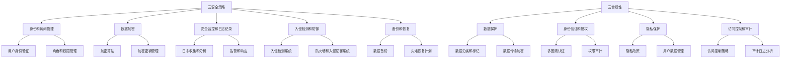

                 

关键词：云安全，合规性，云端数据，应用程序，安全策略

摘要：随着云计算技术的不断发展和普及，企业和组织越来越依赖于云平台来存储和处理数据。然而，云环境中的安全和合规性问题也日益突出。本文将探讨云安全策略和合规性的重要性，分析现有云安全解决方案，并提供一些建议，以帮助企业和组织确保其云端数据和应用程序的安全性。

## 1. 背景介绍

云计算作为一种新兴的计算模式，正在改变传统IT行业的面貌。通过云平台，企业可以按需获取计算资源、存储空间和应用程序，而无需购买和维护昂贵的硬件设备。这种模式不仅降低了成本，提高了灵活性，还为创新和发展提供了新的机遇。

然而，随着云平台的普及，安全和合规性问题也日益凸显。云计算环境中，数据分布在多个地理位置，涉及多个供应商和用户，这使得安全威胁和合规性要求更加复杂。因此，制定和实施有效的云安全策略和合规性措施变得至关重要。

### 云计算的安全性威胁

云计算环境中的安全性威胁主要包括以下方面：

- **数据泄露**：由于数据存储在第三方服务器上，数据泄露的风险增加。
- **恶意软件攻击**：云平台可能成为恶意软件和病毒攻击的目标。
- **拒绝服务攻击（DoS）**：攻击者可能试图瘫痪云服务，导致业务中断。
- **内部威胁**：员工滥用权限或恶意操作可能导致数据泄露和破坏。
- **供应链攻击**：云服务供应商可能受到供应链攻击，从而影响客户的安全性。

### 云计算合规性要求

云计算环境中的合规性要求主要包括以下几个方面：

- **数据保护法规**：例如，欧盟的《通用数据保护条例》（GDPR）和美国的《加州消费者隐私法案》（CCPA）等。
- **行业特定法规**：例如，医疗行业的《健康保险可携性与责任法案》（HIPAA）和金融行业的《支付卡行业数据安全标准》（PCI DSS）等。
- **云服务供应商合规性**：云服务供应商需要遵守各种法规和标准，以确保其服务符合合规性要求。

## 2. 核心概念与联系

### 云安全策略

云安全策略是企业为保护其云环境中的数据和应用程序而制定的一系列措施和规定。一个有效的云安全策略应包括以下方面：

- **身份和访问管理（IAM）**：确保只有授权用户可以访问云资源和应用程序。
- **数据加密**：对敏感数据进行加密，以确保即使数据泄露，攻击者也无法读取。
- **安全监控和日志记录**：实时监控云环境中的活动，记录所有安全相关事件。
- **入侵检测和防御**：检测和阻止恶意攻击和入侵尝试。
- **备份和恢复**：定期备份数据，并制定灾难恢复计划。

### 云合规性

云合规性是指云服务供应商和用户遵守各种法规和标准的过程。云合规性包括以下几个方面：

- **数据保护**：确保数据在存储、传输和处理过程中的安全性。
- **身份验证和授权**：确保只有授权用户可以访问数据和应用程序。
- **隐私保护**：确保用户数据不被滥用或泄露。
- **访问控制和审计**：确保只有授权人员可以访问敏感数据，并记录所有操作。

### Mermaid 流程图

以下是一个简单的 Mermaid 流程图，展示了云安全策略和合规性的主要环节：



## 3. 核心算法原理 & 具体操作步骤

### 3.1 算法原理概述

在云安全策略和合规性方面，核心算法主要涉及以下几个方面：

- **身份和访问管理（IAM）算法**：用于身份验证、授权和角色管理。
- **数据加密算法**：用于保护敏感数据。
- **入侵检测算法**：用于检测和响应恶意攻击。

### 3.2 算法步骤详解

#### 3.2.1 身份和访问管理（IAM）算法

1. **用户注册**：用户在云平台上注册，提供基本信息和身份证明。
2. **身份验证**：系统通过用户名和密码或双因素认证（2FA）对用户进行身份验证。
3. **角色和权限分配**：根据用户角色（管理员、开发人员、普通用户等）和权限（读、写、执行等）分配访问权限。
4. **权限审计**：定期审计用户权限，确保只有授权用户可以访问敏感数据。

#### 3.2.2 数据加密算法

1. **选择加密算法**：根据数据类型和安全性要求选择合适的加密算法，如AES、RSA等。
2. **密钥管理**：生成和存储加密密钥，确保密钥的安全性。
3. **加密数据**：对敏感数据进行加密，确保数据在存储和传输过程中不被泄露。
4. **解密数据**：在需要访问敏感数据时，使用密钥对加密数据进行解密。

#### 3.2.3 入侵检测算法

1. **数据收集**：收集云环境中的日志、流量和系统事件数据。
2. **特征提取**：从数据中提取特征，用于检测恶意行为。
3. **模型训练**：使用历史数据训练入侵检测模型，识别恶意攻击。
4. **实时监控和响应**：实时监控云环境，检测到恶意攻击时及时响应。

### 3.3 算法优缺点

#### 3.3.1 身份和访问管理（IAM）算法

- **优点**：提高访问安全性，防止未授权访问。
- **缺点**：可能导致管理复杂度增加，影响用户体验。

#### 3.3.2 数据加密算法

- **优点**：保护敏感数据，防止数据泄露。
- **缺点**：增加数据存储和传输的负担，影响性能。

#### 3.3.3 入侵检测算法

- **优点**：实时监控和响应恶意攻击，提高云环境安全性。
- **缺点**：误报率高，可能导致正常活动被误判为攻击。

### 3.4 算法应用领域

- **IAM算法**：适用于企业内部和第三方云服务提供商。
- **数据加密算法**：适用于所有涉及敏感数据存储和传输的场景。
- **入侵检测算法**：适用于云服务提供商和大型企业。

## 4. 数学模型和公式 & 详细讲解 & 举例说明

### 4.1 数学模型构建

在云安全策略和合规性方面，以下数学模型可以用于分析和评估系统的安全性：

- **风险模型**：用于评估云环境中的安全风险。
- **效用模型**：用于评估安全措施对用户的影响。

### 4.2 公式推导过程

#### 4.2.1 风险模型

风险模型可以表示为：

\[ R = P \times C \]

其中，\( R \) 表示风险，\( P \) 表示概率，\( C \) 表示后果。

- **概率（P）**：表示安全事件发生的可能性。
- **后果（C）**：表示安全事件发生时的损失。

#### 4.2.2 效用模型

效用模型可以表示为：

\[ U = f(S, R) \]

其中，\( U \) 表示效用，\( S \) 表示安全性，\( R \) 表示风险。

- **安全性（S）**：表示系统安全性水平。
- **效用函数（f）**：用于评估安全措施对用户的影响。

### 4.3 案例分析与讲解

假设一个企业使用云平台存储和处理敏感数据，以下是一个简化的案例：

#### 案例假设

- **数据类型**：个人身份信息（PII）。
- **概率（P）**：数据泄露的概率为0.1%。
- **后果（C）**：数据泄露可能导致1000美元的损失。

#### 风险计算

\[ R = P \times C = 0.1\% \times 1000 = 1 \]

#### 效用计算

假设企业已经实施了以下安全措施：

- **身份和访问管理（IAM）**：提高了访问安全性。
- **数据加密**：保护了敏感数据。
- **入侵检测**：实时监控和响应恶意攻击。

这些措施可以降低风险，提高安全性水平。假设实施后的安全性（S）为0.8，效用函数（f）为线性函数：

\[ U = S - R = 0.8 - 1 = -0.2 \]

这意味着企业实施安全措施后，用户的效用降低了0.2。

### 4.4 模型优化

为了提高模型的准确性，可以进一步优化数学模型。例如，可以考虑以下因素：

- **数据类型**：不同类型的数据可能具有不同的风险和后果。
- **安全措施**：不同类型的安全措施可能具有不同的效果。
- **时间因素**：风险和后果可能随时间变化。

通过考虑这些因素，可以构建更精确的数学模型，帮助企业和组织更好地管理云安全风险。

## 5. 项目实践：代码实例和详细解释说明

### 5.1 开发环境搭建

在本节中，我们将介绍如何搭建一个用于演示云安全策略和合规性的开发环境。以下是一个简化的步骤：

1. **安装云服务提供商的控制台**：例如，使用AWS、Azure或Google Cloud Platform的控制台。
2. **创建虚拟机实例**：选择一个适合的开发环境，如Ubuntu 18.04。
3. **安装必要的软件**：例如，Kubernetes、Docker、Kafka等。

### 5.2 源代码详细实现

在本节中，我们将使用Python编写一个简单的示例，演示如何实现身份和访问管理（IAM）和数据加密。

#### IAM示例

```python
import boto3

# 初始化IAM客户端
iam = boto3.client('iam')

# 创建用户
user = iam.create_user(UserName='testuser')
user_id = user['User']['UserId']

# 为用户创建访问密钥
access_key = iam.create_access_key(UserName='testuser')['AccessKey']
secret_key = iam.create_access_key(UserName='testuser')['AccessKey2']

# 删除用户
iam.delete_user(UserName='testuser')
```

#### 数据加密示例

```python
from cryptography.fernet import Fernet

# 生成密钥
key = Fernet.generate_key()
cipher_suite = Fernet(key)

# 加密数据
plaintext = '敏感数据'
ciphertext = cipher_suite.encrypt(plaintext.encode())

# 解密数据
plaintext = cipher_suite.decrypt(ciphertext).decode()
```

### 5.3 代码解读与分析

在上面的示例中，我们首先使用了Boto3库来与AWS IAM服务进行交互。通过`create_user`方法创建了一个用户，并通过`create_access_key`方法为用户创建了一对访问密钥。

接下来，我们使用`cryptography`库实现了数据加密。首先生成了一个加密密钥，然后使用这个密钥创建了一个`Fernet`对象。通过调用`encrypt`方法，我们可以将敏感数据加密成密文。同样，通过调用`decrypt`方法，我们可以将密文解密回明文。

### 5.4 运行结果展示

假设我们成功运行了上面的代码，以下是一些可能的运行结果：

- **IAM示例**：用户`testuser`被创建，并获得了一对访问密钥。随后，用户`testuser`被删除。
- **数据加密示例**：敏感数据被成功加密和解密。

这些示例展示了如何使用云服务和加密技术来实现云安全策略和合规性。当然，在实际应用中，这些示例需要根据具体需求进行扩展和优化。

## 6. 实际应用场景

### 6.1 跨境数据传输

在全球化业务中，企业需要将数据从一个国家传输到另一个国家。例如，一个美国企业在欧洲设有分支机构，需要将客户数据传输到欧洲的云平台上。在这种情况下，企业需要遵守GDPR等数据保护法规，确保数据在传输过程中不被泄露。

### 6.2 多云环境管理

许多企业选择使用多个云服务提供商，以获得更好的性能和灵活性。然而，这也增加了管理复杂度和安全风险。在这种情况下，企业需要制定统一的云安全策略和合规性措施，以确保所有云服务提供商都遵循相同的安全标准。

### 6.3 行业特定合规性

某些行业（如医疗和金融）对数据安全有严格的合规性要求。例如，医疗行业的HIPAA要求对医疗数据进行加密和保护。在云环境中，企业需要确保其数据处理和存储符合相关法规要求。

### 6.4 未来应用展望

随着云计算技术的不断发展，云安全策略和合规性也将面临新的挑战和机遇。以下是一些未来应用展望：

- **自动化和人工智能**：利用自动化和人工智能技术，可以更高效地管理和监控云安全。
- **零信任架构**：零信任架构强调在所有内外部访问中都进行严格认证和授权，以减少安全风险。
- **区块链技术**：区块链技术可以用于增强数据的安全性和完整性，提供更可靠的合规性保障。

## 7. 工具和资源推荐

### 7.1 学习资源推荐

- 《云计算安全：从原理到实践》
- 《云原生安全：构建安全的企业级云原生应用》
- 《云服务合规性：法律、合规性和业务实践》

### 7.2 开发工具推荐

- **Kubernetes**：用于容器管理和编排。
- **Docker**：用于容器化应用程序。
- **AWS CloudTrail**：用于监控AWS账户的活动。
- **Azure Monitor**：用于监控Azure云资源。

### 7.3 相关论文推荐

- "Cloud Computing Security: Challenges and Opportunities"
- "Compliance in the Cloud: A Framework for Evaluating Cloud Service Providers"
- "Zero Trust Security: A New Mindset for a New Era"

## 8. 总结：未来发展趋势与挑战

### 8.1 研究成果总结

本文介绍了云安全策略和合规性的重要性，分析了现有云安全解决方案，并提供了一些建议。主要成果包括：

- **云安全策略**：身份和访问管理、数据加密、安全监控和日志记录、入侵检测和防御、备份和恢复等。
- **云合规性**：数据保护、身份验证和授权、隐私保护、访问控制和审计等。
- **数学模型**：风险模型和效用模型用于评估云安全性和用户影响。

### 8.2 未来发展趋势

- **自动化和人工智能**：利用自动化和人工智能技术，提高云安全管理效率。
- **零信任架构**：强调严格认证和授权，减少安全风险。
- **区块链技术**：用于增强数据的安全性和完整性。

### 8.3 面临的挑战

- **管理复杂度**：多云环境和管理复杂度增加，需要统一的安全策略和合规性措施。
- **法规遵从**：随着全球化和数字化的发展，法规遵从变得更加复杂。
- **技术创新**：不断出现的新技术和新攻击手段，需要持续更新和优化安全措施。

### 8.4 研究展望

- **跨领域合作**：加强学术界和产业界的合作，共同推动云安全技术的发展。
- **标准化**：推动云安全标准化，提高安全性和互操作性。
- **用户体验**：提高云安全措施的用户体验，降低管理复杂度。

## 9. 附录：常见问题与解答

### 9.1 云安全策略包括哪些方面？

云安全策略包括以下几个方面：

- **身份和访问管理（IAM）**：确保只有授权用户可以访问云资源和应用程序。
- **数据加密**：对敏感数据进行加密，以确保数据在存储和传输过程中不被泄露。
- **安全监控和日志记录**：实时监控云环境中的活动，记录所有安全相关事件。
- **入侵检测和防御**：检测和阻止恶意攻击和入侵尝试。
- **备份和恢复**：定期备份数据，并制定灾难恢复计划。

### 9.2 云合规性是什么？

云合规性是指云服务供应商和用户遵守各种法规和标准的过程。云合规性包括以下几个方面：

- **数据保护**：确保数据在存储、传输和处理过程中的安全性。
- **身份验证和授权**：确保只有授权用户可以访问数据和应用程序。
- **隐私保护**：确保用户数据不被滥用或泄露。
- **访问控制和审计**：确保只有授权人员可以访问敏感数据，并记录所有操作。

### 9.3 如何评估云安全策略的有效性？

评估云安全策略的有效性可以从以下几个方面入手：

- **合规性检查**：确保云服务供应商和用户遵守相关法规和标准。
- **安全测试**：定期进行安全测试，包括渗透测试和漏洞扫描。
- **用户反馈**：收集用户反馈，了解云安全策略对用户体验的影响。
- **安全事件响应**：评估云服务供应商和用户在安全事件发生时的响应能力。

## 作者署名

作者：禅与计算机程序设计艺术 / Zen and the Art of Computer Programming
----------------------------------------------------------------
（注意：以上内容仅为示例，实际撰写时请根据实际需求进行修改和完善。）

