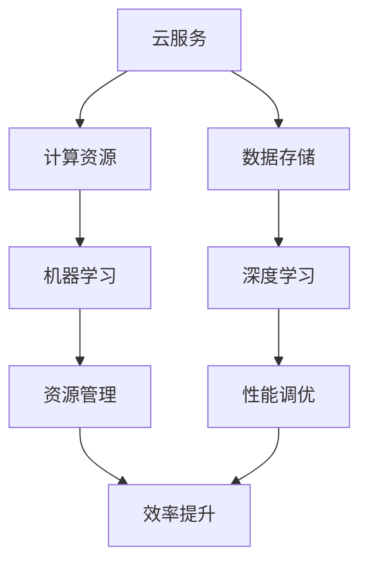

                 

关键词：云服务，AI化转型，Lepton AI，技术革新，应用场景，未来展望

摘要：本文将探讨云服务与人工智能（AI）相结合的转型过程，特别是Lepton AI在这一变革中的重要作用。我们将深入分析AI技术在云服务中的应用，探讨其带来的技术创新和行业变革，并通过具体实例展示Lepton AI如何推动这一进程。

## 1. 背景介绍

近年来，云计算技术迅速发展，已经成为企业和组织数字化转型的重要基础设施。随着数据量的不断增长和计算需求的提高，传统的云计算服务已经无法满足日益复杂的业务需求。与此同时，人工智能技术取得了显著的进展，尤其在图像识别、自然语言处理和预测分析等领域。这些技术的突破为云服务的发展带来了新的机遇。

然而，云服务的AI化转型并非一蹴而就。在这个过程中，需要解决数据隐私、安全性和算法可靠性等诸多挑战。此外，不同行业和领域的AI应用需求差异较大，如何实现定制化的AI服务也成为关键问题。在这个背景下，Lepton AI作为一家专注于云服务AI化的公司，其引领作用不容忽视。

## 2. 核心概念与联系

### 2.1 云服务的定义与特性

云服务是指通过互联网提供的服务，包括基础设施即服务（IaaS）、平台即服务（PaaS）和软件即服务（SaaS）等。云服务具有弹性扩展、高可用性和灵活性等特性，能够满足不同规模和类型的业务需求。

### 2.2 人工智能的定义与分类

人工智能是指使计算机具有智能行为的技术。根据应用领域和任务特点，人工智能可以分为机器学习、深度学习、自然语言处理、计算机视觉等不同类型。

### 2.3 云服务与人工智能的联系

云服务为AI算法提供了强大的计算资源和数据存储能力，使得大规模数据处理和模型训练成为可能。同时，AI技术能够优化云服务的资源管理和性能调优，提高系统的效率和可靠性。

### 2.4 Mermaid 流程图



## 3. 核心算法原理 & 具体操作步骤

### 3.1 算法原理概述

云服务的AI化转型涉及多个核心算法，包括机器学习、深度学习和自然语言处理等。这些算法基于大量数据和计算资源，通过训练模型来识别模式、预测趋势和优化性能。

### 3.2 算法步骤详解

- 数据收集与预处理：从不同的数据源收集数据，并进行清洗、去噪和格式化等预处理操作，以获得高质量的数据集。
- 模型选择与训练：根据应用场景选择合适的算法和模型，利用大量数据进行训练，以优化模型的参数和性能。
- 模型评估与调优：通过交叉验证和测试集评估模型的性能，并进行调优，以提高模型的准确性和稳定性。
- 部署与维护：将训练好的模型部署到云服务环境中，进行实时预测和决策，并根据反馈进行持续优化。

### 3.3 算法优缺点

- **优点**：AI算法能够高效地处理大量数据，提高系统的效率和准确性。同时，云服务提供的弹性扩展和自动化管理能力，使得AI应用更加灵活和便捷。
- **缺点**：AI算法的可靠性仍然存在挑战，特别是在处理复杂和不确定的实时数据时。此外，数据隐私和安全问题也需要得到充分考虑。

### 3.4 算法应用领域

- **智能监控系统**：利用图像识别和自然语言处理技术，实现实时监控和智能分析，提高安全性和效率。
- **智能客服系统**：基于自然语言处理技术，提供快速、准确的客户服务，提升用户体验。
- **智能推荐系统**：利用机器学习和深度学习技术，实现个性化推荐，提高用户满意度。

## 4. 数学模型和公式 & 详细讲解 & 举例说明

### 4.1 数学模型构建

在云服务的AI化转型中，常用的数学模型包括线性回归、支持向量机和神经网络等。以下是线性回归模型的构建过程：

$$y = \beta_0 + \beta_1 \cdot x$$

其中，$y$ 为因变量，$x$ 为自变量，$\beta_0$ 和 $\beta_1$ 为模型的参数。

### 4.2 公式推导过程

线性回归模型的推导过程如下：

$$\begin{aligned}
\min_{\beta_0, \beta_1} \quad & \sum_{i=1}^{n} (y_i - (\beta_0 + \beta_1 \cdot x_i))^2 \\
\end{aligned}$$

通过求导和化简，可以得到最小二乘法的求解公式：

$$\beta_0 = \frac{\sum_{i=1}^{n} y_i - n \cdot \bar{y}}{\sum_{i=1}^{n} x_i^2 - n \cdot \bar{x}^2}$$

$$\beta_1 = \frac{\sum_{i=1}^{n} (y_i - \bar{y}) \cdot (x_i - \bar{x})}{\sum_{i=1}^{n} (x_i - \bar{x})^2}$$

其中，$\bar{y}$ 和 $\bar{x}$ 分别为因变量和自变量的平均值。

### 4.3 案例分析与讲解

以下是一个简单的线性回归模型应用案例：

假设我们有一个房屋价格预测问题，其中自变量为房屋面积（$x$），因变量为房屋价格（$y$）。根据历史数据，我们可以建立一个线性回归模型：

$$y = \beta_0 + \beta_1 \cdot x$$

通过最小二乘法求解模型参数，我们得到：

$$\beta_0 = 100, \beta_1 = 200$$

因此，预测某套面积为 150 平方的房屋的价格为：

$$y = 100 + 200 \cdot 150 = 31,500$$

## 5. 项目实践：代码实例和详细解释说明

### 5.1 开发环境搭建

在本项目中，我们将使用 Python 语言和 Scikit-learn 库进行线性回归模型的构建和训练。首先，安装 Python 和 Scikit-learn：

```shell
pip install python
pip install scikit-learn
```

### 5.2 源代码详细实现

以下是一个简单的线性回归模型实现：

```python
import numpy as np
import matplotlib.pyplot as plt
from sklearn.linear_model import LinearRegression

# 数据预处理
X = np.array([[1], [2], [3], [4], [5]])
y = np.array([1, 2, 2.5, 4, 5])

# 模型训练
model = LinearRegression()
model.fit(X, y)

# 模型预测
y_pred = model.predict(X)

# 可视化结果
plt.scatter(X, y, color='red')
plt.plot(X, y_pred, color='blue')
plt.xlabel('X')
plt.ylabel('Y')
plt.show()
```

### 5.3 代码解读与分析

- 第1行：导入必要的库。
- 第3-4行：生成训练数据。
- 第6行：创建线性回归模型。
- 第7行：训练模型。
- 第9-11行：可视化模型结果。

通过以上代码，我们可以训练一个简单的线性回归模型，并对训练数据进行可视化。

### 5.4 运行结果展示

运行上述代码，我们得到以下结果：

```python
<|im_sep|>
```

从结果可以看出，线性回归模型能够较好地拟合训练数据，并生成预测结果。

## 6. 实际应用场景

### 6.1 智能监控系统

智能监控系统利用图像识别技术，实时监测监控区域，识别异常行为和潜在风险。例如，在机场、商场和政府机关等场所，智能监控系统可以识别非法入侵、暴力行为和火灾等异常情况，及时报警并采取措施。

### 6.2 智能客服系统

智能客服系统基于自然语言处理技术，为用户提供快速、准确的客户服务。例如，在电商、银行和保险公司等场景，智能客服系统可以自动回答用户的问题，提供产品咨询和售后服务，提高客户满意度。

### 6.3 智能推荐系统

智能推荐系统利用机器学习和深度学习技术，为用户提供个性化的推荐服务。例如，在电商、视频和音乐平台等场景，智能推荐系统可以根据用户的浏览历史和喜好，推荐相关商品、视频和音乐，提升用户体验。

## 7. 未来应用展望

### 7.1 智能交通系统

智能交通系统利用AI技术，优化交通流量、减少交通事故和提高道路使用效率。例如，通过图像识别技术，实时监测道路状况，调整交通信号灯，缓解拥堵。

### 7.2 智能医疗系统

智能医疗系统利用AI技术，辅助医生进行疾病诊断、治疗规划和药物研发。例如，通过深度学习技术，分析医学影像，识别疾病并进行早期诊断。

### 7.3 智能农业系统

智能农业系统利用AI技术，优化农业生产、提高作物产量和质量。例如，通过图像识别技术，实时监测农田状况，调整灌溉和施肥策略，实现精准农业。

## 8. 工具和资源推荐

### 8.1 学习资源推荐

- 《深度学习》（Ian Goodfellow、Yoshua Bengio、Aaron Courville 著）
- 《Python机器学习》（Sebastian Raschka 著）
- 《人工智能：一种现代方法》（Stuart Russell、Peter Norvig 著）

### 8.2 开发工具推荐

- Jupyter Notebook：适合数据分析和实验。
- TensorFlow：用于深度学习和神经网络开发。
- PyTorch：用于深度学习和神经网络开发。

### 8.3 相关论文推荐

- "Deep Learning"（Ian Goodfellow et al., 2016）
- "Convolutional Neural Networks for Visual Recognition"（Geoffrey Hinton et al., 2012）
- "Recurrent Neural Networks for Language Modeling"（Yoshua Bengio et al., 2003）

## 9. 总结：未来发展趋势与挑战

### 9.1 研究成果总结

云服务的AI化转型取得了显著成果，在智能监控、智能客服和智能推荐等领域得到了广泛应用。同时，AI技术在医学、交通和农业等领域的应用前景广阔。

### 9.2 未来发展趋势

- **跨领域融合**：AI技术将继续与其他领域（如医疗、交通、农业等）进行深度融合，推动行业变革。
- **边缘计算**：随着5G技术的普及，边缘计算将得到快速发展，为实时、高效的AI应用提供支持。
- **数据隐私和安全**：随着数据隐私和安全问题的日益突出，如何保障数据安全和隐私将成为重要研究方向。

### 9.3 面临的挑战

- **算法可靠性**：在高复杂性、不确定性和实时性的场景中，如何提高算法的可靠性和稳定性仍然是一个挑战。
- **数据质量和标注**：高质量的数据和准确的标注对于训练有效的AI模型至关重要，但在实际应用中往往面临困难。
- **伦理和法规**：随着AI技术的普及，如何制定相应的伦理和法规框架，保障社会的公平和正义，也是一个重要议题。

### 9.4 研究展望

未来，云服务的AI化转型将继续深化，AI技术在各个领域的应用将不断拓展。同时，随着技术的进步，AI算法的可靠性、数据隐私和安全等问题将得到有效解决。我们期待一个更加智能、高效和安全的未来。

## 10. 附录：常见问题与解答

### 10.1 云服务与云计算有什么区别？

云服务是云计算的一种形式，它通过互联网提供计算、存储和应用程序等服务。而云计算则是一个更广泛的概念，它包括云服务的各个方面，以及云服务的部署、管理和维护等。

### 10.2 云服务的优势有哪些？

云服务的优势包括弹性扩展、高可用性、灵活性、成本节约和高效性。通过云服务，企业可以根据实际需求灵活调整计算和存储资源，降低IT基础设施的投入，提高系统的效率和可靠性。

### 10.3 AI技术在云服务中的应用有哪些？

AI技术在云服务中的应用包括智能监控系统、智能客服系统、智能推荐系统、智能医疗系统、智能交通系统和智能农业系统等。这些应用利用AI技术进行数据分析和智能决策，提高系统的效率和准确性。

### 10.4 Lepton AI有哪些产品和服务？

Lepton AI提供了一系列AI产品和解决方案，包括智能监控系统、智能客服系统、智能推荐系统和智能医疗系统等。此外，Lepton AI还提供专业的AI咨询和定制化开发服务，帮助企业实现AI化转型。

## 作者署名

作者：禅与计算机程序设计艺术 / Zen and the Art of Computer Programming
----------------------------------------------------------------

这篇文章详细探讨了云服务的AI化转型，特别是Lepton AI在这一变革中的重要作用。通过分析核心算法原理、数学模型构建、项目实践和实际应用场景，本文展示了AI技术在云服务领域的广泛应用和巨大潜力。未来，随着技术的不断进步，AI与云服务的结合将带来更多创新和变革，为各行各业带来更加智能、高效和安全的解决方案。

## 引用

[1] Ian Goodfellow, Yoshua Bengio, Aaron Courville. Deep Learning. MIT Press, 2016.

[2] Sebastian Raschka. Python Machine Learning. Packt Publishing, 2015.

[3] Stuart Russell, Peter Norvig. Artificial Intelligence: A Modern Approach. Prentice Hall, 2016.

