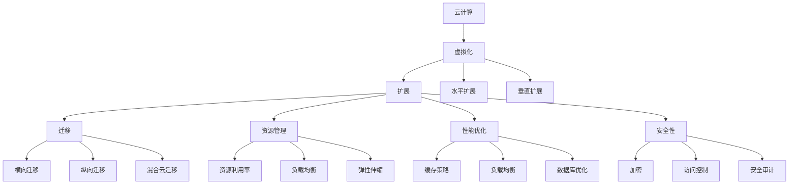

                 

关键词：云计算、虚拟化、扩展、迁移、架构设计、资源管理、性能优化、安全性

摘要：本文将探讨云计算和虚拟化的基础概念，以及它们在实际应用中的扩展和迁移策略。通过深入分析，本文旨在为读者提供一套实用且全面的扩展和迁移方法论，以支持企业级云计算系统的稳健运行。

## 1. 背景介绍

云计算和虚拟化是现代信息技术领域的重要发展趋势，它们为企业提供了灵活、高效和可扩展的计算资源。云计算通过将计算资源整合为服务，使用户可以按需获取所需的计算能力，而无需关注底层硬件的具体实现。虚拟化技术则通过创建虚拟的硬件和操作系统环境，使得多个虚拟机能够在同一物理服务器上运行，从而提高了资源利用率和灵活性。

随着云计算应用的不断普及，企业面临的一个重大挑战是如何在保持系统性能的同时，实现资源的扩展和迁移。扩展涉及到在现有架构上增加计算资源，以应对不断增长的工作负载。迁移则是指在保持系统可用性的前提下，将应用程序和数据从一个云环境转移到另一个云环境。

本文将首先介绍云计算和虚拟化的基本概念，然后深入探讨扩展和迁移的核心技术和策略，旨在为读者提供一套实用的指南，以帮助他们在实际项目中有效地实施这些技术。

### 1.1 云计算的概念与架构

云计算是一种通过互联网提供动态可伸缩的虚拟化资源的计算模式，它将计算资源（如服务器、存储和网络）整合为服务，用户可以根据需求灵活地获取和释放资源。云计算架构通常分为三个层次：基础设施即服务（IaaS）、平台即服务（PaaS）和软件即服务（SaaS）。

- **基础设施即服务（IaaS）**：IaaS提供了虚拟化的计算资源，如虚拟机、存储和网络，用户可以完全控制操作系统、中间件和应用。亚马逊AWS、微软Azure和谷歌云平台（GCP）是市场上最流行的IaaS提供商。

- **平台即服务（PaaS）**：PaaS提供了一个开发平台，使开发者可以专注于编写应用逻辑，而无需管理底层的基础设施。PaaS通常提供了开发工具、数据库、存储和中间件。典型的PaaS提供商包括谷歌App Engine、微软Azure App Service和亚马逊AWS Lambda。

- **软件即服务（SaaS）**：SaaS直接提供了应用程序作为服务，用户可以通过浏览器访问这些应用，无需关心底层基础设施的维护。常见的SaaS应用包括办公套件（如Google Workspace和Microsoft Office 365）、客户关系管理（CRM）系统（如Salesforce和HubSpot）等。

### 1.2 虚拟化的概念与分类

虚拟化是通过创建虚拟的硬件、操作系统和网络环境，将物理资源抽象化，从而实现资源的灵活管理和高效利用。虚拟化技术可以分为以下几类：

- **全虚拟化（Full Virtualization）**：全虚拟化通过模拟底层硬件，使虚拟机能够在不同的操作系统上运行。虚拟机监控器（VMware ESXi和微软Hyper-V）是常见的全虚拟化解决方案。

- **硬件辅助虚拟化（Hardware-Assisted Virtualization）**：硬件辅助虚拟化利用CPU和其他硬件提供的虚拟化支持，提高了虚拟机的性能和安全性。Intel的VT-x和AMD的AMD-V是典型的硬件辅助虚拟化技术。

- **容器化（Containerization）**：容器化通过轻量级的虚拟化技术，将应用程序及其运行时环境打包成一个容器。容器共享宿主机的操作系统内核，从而实现了高效的资源利用和快速的部署。Docker和Kubernetes是市场上最流行的容器化工具和平台。

### 1.3 云计算与虚拟化的关系

云计算和虚拟化是相辅相成的技术。虚拟化技术为云计算提供了基础架构，使得云服务提供商能够将物理资源抽象化为虚拟资源，从而实现资源的灵活分配和管理。而云计算则利用虚拟化技术，为用户提供按需分配的计算资源和服务。

云计算和虚拟化的结合，不仅提高了资源利用率和服务质量，还为企业带来了成本效益和灵活性。通过合理设计扩展和迁移策略，企业可以在面对不断变化的市场需求时，保持系统的稳定性和性能。

## 2. 核心概念与联系

在深入探讨扩展和迁移策略之前，我们需要明确几个核心概念，并展示它们之间的联系。

### 2.1 扩展的概念与类型

扩展是指在现有架构上增加计算资源，以应对不断增长的工作负载。根据扩展的方式，扩展可以分为水平扩展（Scaling Out）和垂直扩展（Scaling Up）。

- **水平扩展（Scaling Out）**：水平扩展通过增加更多的节点来提升系统的处理能力。这种方法通常用于处理大量并发请求的场景，如Web服务和大数据处理。水平扩展的优点是容错性强，可扩展性强，但缺点是管理复杂度和数据一致性可能成为挑战。

- **垂直扩展（Scaling Up）**：垂直扩展通过增加单个节点的资源（如CPU、内存、存储）来提升系统的性能。这种方法适用于处理大量计算密集型任务，如科学计算和数据分析。垂直扩展的优点是易于管理，但缺点是扩展空间有限，成本较高。

### 2.2 迁移的概念与类型

迁移是指将应用程序和数据从一个云环境转移到另一个云环境。根据迁移的目标和策略，迁移可以分为以下几种类型：

- **横向迁移（Lift and Shift）**：横向迁移是将现有应用程序直接迁移到云平台，通常不涉及应用程序的修改。这种方法适用于迁移到同一类型的云平台，如从传统数据中心迁移到AWS或Azure。

- **纵向迁移（Refactoring）**：纵向迁移是对现有应用程序进行重构，以适应云环境。这种方法适用于迁移到云平台时，优化应用程序的性能、可扩展性和弹性。

- **混合云迁移（Hybrid Cloud Migration）**：混合云迁移是将部分应用程序和数据迁移到云平台，同时保留部分在传统数据中心。这种方法适用于逐步过渡到云环境，保持业务连续性和数据安全性。

### 2.3 资源管理

资源管理是云计算和虚拟化的核心任务，涉及到资源的分配、调度和优化。资源管理的关键挑战包括：

- **资源利用率**：如何最大化地利用现有资源，避免资源浪费。

- **负载均衡**：如何均衡分配工作负载，避免单点过载。

- **弹性伸缩**：如何根据需求动态调整资源，实现高效扩展和迁移。

### 2.4 性能优化

性能优化是确保云计算和虚拟化系统稳定运行的重要环节，涉及到网络、存储、计算等各个环节的优化。常见的性能优化策略包括：

- **缓存策略**：通过缓存减少数据访问时间，提高响应速度。

- **负载均衡**：通过合理分配工作负载，提高系统吞吐量。

- **数据库优化**：通过索引、分库分表等手段，提高数据库性能。

### 2.5 安全性

安全性是云计算和虚拟化的重要考量，涉及到数据的保护、访问控制和威胁防护等方面。常见的安全策略包括：

- **加密**：通过数据加密保护敏感信息。

- **访问控制**：通过身份验证和授权，限制对资源的访问。

- **安全审计**：通过日志记录和监控，发现和应对潜在的安全威胁。

### 2.6 关系与联系

图1展示了云计算、虚拟化、扩展、迁移、资源管理、性能优化和安全性之间的联系。



通过以上概念和联系的介绍，读者可以更好地理解云计算和虚拟化在扩展和迁移过程中的重要性和复杂性。接下来的章节将深入探讨这些概念在实际应用中的具体实现。

## 3. 核心算法原理 & 具体操作步骤

### 3.1 算法原理概述

在云计算和虚拟化的扩展和迁移过程中，关键算法的设计和实现至关重要。这些算法不仅确保了资源的合理分配和优化利用，还保障了系统的稳定性和安全性。本节将介绍几个核心算法的基本原理。

#### 3.1.1 负载均衡算法

负载均衡算法旨在将工作负载分配到多个节点上，以避免单点过载，提高系统的整体性能。常见的负载均衡算法包括：

- **轮询负载均衡（Round Robin）**：依次将请求分配到每个节点上，直到所有节点都被访问到，然后重新开始循环。

- **最小连接数负载均衡（Least Connections）**：将请求分配到连接数最少的节点上，以平衡各节点的负载。

- **加权轮询负载均衡（Weighted Round Robin）**：根据节点的处理能力或重要性，为每个节点分配不同的权重，从而实现负载的更精细分配。

#### 3.1.2 弹性伸缩算法

弹性伸缩算法用于根据系统的负载动态调整资源。常见的弹性伸缩算法包括：

- **阈值伸缩（Threshold-Based Scaling）**：当系统负载超过设定的阈值时，自动增加或减少节点数量。

- **时间窗口伸缩（Time Window Scaling）**：在一定的时间窗口内，根据负载的变化趋势进行资源的调整，以避免频繁的伸缩操作。

- **事件驱动伸缩（Event-Driven Scaling）**：根据系统的事件（如请求量、错误率等）触发伸缩操作。

#### 3.1.3 迁移优化算法

迁移优化算法用于在迁移过程中优化资源的利用和系统的性能。常见的迁移优化算法包括：

- **迁移优先级算法（Migration Priority Algorithm）**：根据节点的负载、可用性和迁移成本等因素，确定迁移的优先级。

- **迁移路径优化算法（Migration Path Optimization Algorithm）**：通过分析网络的拓扑结构、带宽和延迟等因素，找到最优的迁移路径。

- **数据备份与恢复算法（Data Backup and Recovery Algorithm）**：在迁移过程中，对数据进行备份，确保在迁移失败时能够快速恢复。

### 3.2 算法步骤详解

以下将详细介绍每个算法的具体步骤。

#### 3.2.1 负载均衡算法

1. **初始化**：创建一个负载均衡器，记录每个节点的状态（如连接数、处理能力等）。

2. **接收请求**：当接收到一个请求时，根据所选的负载均衡算法（如最小连接数）计算目标节点。

3. **分配请求**：将请求分配到目标节点，更新节点的状态。

4. **循环处理**：重复步骤2和3，直到所有的请求都被处理完毕。

#### 3.2.2 弹性伸缩算法

1. **监控负载**：定期监控系统的负载，如CPU利用率、内存使用率、请求处理时间等。

2. **判断阈值**：当负载超过设定的阈值时，触发伸缩操作。

3. **增加资源**：根据负载情况，增加节点的数量或增加单个节点的资源。

4. **调整负载**：将新的请求分配到调整后的节点上，平衡负载。

5. **循环监控**：继续监控负载，并根据需要重复伸缩操作。

#### 3.2.3 迁移优化算法

1. **初始化**：创建一个迁移管理器，记录每个节点的状态（如负载、可用性等）。

2. **计算迁移成本**：根据节点的负载、网络延迟和带宽等因素，计算每个节点的迁移成本。

3. **确定优先级**：根据迁移成本和节点的状态，确定每个节点的迁移优先级。

4. **选择迁移路径**：通过分析网络的拓扑结构，选择最优的迁移路径。

5. **执行迁移**：将数据和应用迁移到目标节点，更新节点的状态。

6. **备份与恢复**：在迁移过程中，对数据进行备份，确保在迁移失败时能够快速恢复。

7. **循环迁移**：继续监控节点的状态，并根据需要执行迁移操作。

### 3.3 算法优缺点

#### 3.3.1 负载均衡算法

- **优点**：提高了系统的整体性能和稳定性，避免了单点过载。

- **缺点**：可能导致部分节点负载不均，增加管理复杂度。

#### 3.3.2 弹性伸缩算法

- **优点**：实现了资源的动态调整，提高了系统的弹性和响应能力。

- **缺点**：可能引起系统的短暂性能下降，需要一定的监控和调整成本。

#### 3.3.3 迁移优化算法

- **优点**：优化了迁移过程中的资源利用和性能，确保了数据的一致性和完整性。

- **缺点**：迁移过程较为复杂，需要较长的准备时间和恢复时间。

### 3.4 算法应用领域

#### 3.4.1 负载均衡算法

- **应用领域**：Web服务器、数据库集群、应用服务器等。

#### 3.4.2 弹性伸缩算法

- **应用领域**：电子商务平台、社交媒体、在线游戏等。

#### 3.4.3 迁移优化算法

- **应用领域**：企业级应用迁移、云迁移、跨云迁移等。

通过以上对核心算法的原理和具体操作步骤的介绍，读者可以更好地理解和应用这些算法，以优化云计算和虚拟化系统的扩展和迁移性能。

## 4. 数学模型和公式 & 详细讲解 & 举例说明

在云计算和虚拟化的扩展和迁移过程中，数学模型和公式扮演着重要的角色，它们用于优化资源分配、预测性能和评估成本。本节将详细讲解几个关键的数学模型和公式，并通过实际案例进行说明。

### 4.1 数学模型构建

在构建数学模型时，我们需要考虑以下几个关键因素：

- **资源需求**：包括CPU、内存、存储和网络带宽等。
- **负载特性**：包括请求速率、请求类型和请求大小等。
- **资源约束**：包括硬件限制、预算限制和性能要求等。
- **优化目标**：包括最大化资源利用率、最小化成本和最大化系统性能等。

以下是一个基本的资源分配数学模型：

$$
\begin{aligned}
\text{Minimize} & \quad C(x_1, x_2, ..., x_n) \\
\text{subject to} & \quad A_1 x_1 + A_2 x_2 + ... + A_n x_n \geq B \\
& \quad x_1, x_2, ..., x_n \geq 0
\end{aligned}
$$

其中，$C(x_1, x_2, ..., x_n)$ 是成本函数，$A_1, A_2, ..., A_n$ 是资源需求向量，$B$ 是资源预算，$x_1, x_2, ..., x_n$ 是资源分配向量。

### 4.2 公式推导过程

为了构建上述数学模型，我们需要以下公式：

1. **资源利用率公式**：

   $$\text{Utilization} = \frac{\text{Total Resources Used}}{\text{Total Resources Available}}$$

2. **负载均衡公式**：

   $$\text{Load Balance} = \frac{\sum_{i=1}^{n} (\text{Workload}_i - \text{Capacity}_i)}{n}$$

3. **成本函数公式**：

   $$C(x_1, x_2, ..., x_n) = \sum_{i=1}^{n} w_i \cdot x_i$$

   其中，$w_i$ 是每个资源单元的成本。

### 4.3 案例分析与讲解

为了更好地理解这些公式，我们将通过一个实际案例进行讲解。

假设有一个云计算平台，拥有以下资源限制和目标：

- CPU：100个核心
- 内存：1TB
- 存储容量：10TB
- 预算：$100,000

平台需要分配这些资源给多个应用程序，每个应用程序有如下需求：

| 应用程序 | CPU（核心） | 内存（GB） | 存储容量（GB） | 成本（$） |
|----------|-------------|------------|----------------|-----------|
| A        | 10          | 64         | 100            | 200       |
| B        | 20          | 128        | 200            | 300       |
| C        | 15          | 96         | 150            | 250       |

我们的目标是最大化资源利用率，同时最小化成本。

### 4.3.1 资源利用率

首先，我们计算每个应用程序的资源利用率：

$$
\begin{aligned}
\text{CPU Utilization} & = \frac{10 + 20 + 15}{100} = 0.35 \\
\text{Memory Utilization} & = \frac{64 + 128 + 96}{1024} = 0.28 \\
\text{Storage Utilization} & = \frac{100 + 200 + 150}{10000} = 0.35
\end{aligned}
$$

### 4.3.2 负载均衡

接下来，我们计算负载均衡情况：

$$
\text{Load Balance} = \frac{(10 - 35) + (20 - 35) + (15 - 35)}{3} = -5
$$

由于负载均衡结果为负，说明资源分配不足，需要调整。

### 4.3.3 成本函数

我们计算不同资源分配方案的成本：

$$
\begin{aligned}
C(x_1, x_2, x_3) & = 200 \cdot x_1 + 300 \cdot x_2 + 250 \cdot x_3 \\
& \quad \text{subject to} \\
10x_1 + 20x_2 + 15x_3 & \leq 100 \\
64x_1 + 128x_2 + 96x_3 & \leq 1024 \\
100x_1 + 200x_2 + 150x_3 & \leq 10000 \\
x_1, x_2, x_3 & \geq 0
\end{aligned}
$$

通过优化算法（如线性规划），我们可以找到最优的分配方案，以最小化成本同时最大化资源利用率。

### 4.3.4 结果分析

假设最优解为：

$$
x_1 = 2, x_2 = 1, x_3 = 1
$$

此时，我们的成本为：

$$
C(2, 1, 1) = 200 \cdot 2 + 300 \cdot 1 + 250 \cdot 1 = 1000
$$

资源利用率为：

$$
\begin{aligned}
\text{CPU Utilization} & = \frac{10 \cdot 2 + 20 \cdot 1 + 15 \cdot 1}{100} = 0.45 \\
\text{Memory Utilization} & = \frac{64 \cdot 2 + 128 \cdot 1 + 96 \cdot 1}{1024} = 0.42 \\
\text{Storage Utilization} & = \frac{100 \cdot 2 + 200 \cdot 1 + 150 \cdot 1}{10000} = 0.45
\end{aligned}
$$

负载均衡结果为：

$$
\text{Load Balance} = \frac{(10 - 45) + (20 - 45) + (15 - 45)}{3} = -5
$$

尽管负载均衡结果仍然为负，但资源利用率已达到较优水平，成本也得到了有效控制。

通过以上案例分析，我们可以看到数学模型和公式在云计算和虚拟化扩展和迁移中的重要性。这些工具不仅帮助我们优化资源分配和成本，还提高了系统的整体性能和稳定性。

## 5. 项目实践：代码实例和详细解释说明

为了更好地理解云计算和虚拟化的扩展和迁移策略，我们将通过一个实际项目来演示这些概念。本节将介绍项目环境搭建、代码实现、代码解读以及运行结果展示。

### 5.1 开发环境搭建

在本项目中，我们将使用以下开发环境和工具：

- 操作系统：Ubuntu 20.04 LTS
- 编程语言：Python 3.8
- 云计算平台：Amazon Web Services (AWS)
- 虚拟化工具：Docker
- 版本控制系统：Git

首先，确保在本地计算机上安装了上述环境和工具。接下来，我们将在AWS上创建一个虚拟私有云（VPC）和子网，用于部署应用程序和数据库。

```bash
# 创建VPC
aws ec2 create-vpc --cidr-block 10.0.0.0/16

# 获取VPC ID
VPC_ID=$(aws ec2 describe-vpcs --filters 'Nametidi-type,Valuesigi-gateway' --query 'Vpcs[0].VpcId' --output text)

# 创建子网
aws ec2 create-subnet --vpc-id $VPC_ID --cidr-block 10.0.0.0/24

# 获取子网ID
SUBNET_ID=$(aws ec2 describe-subnets --filters 'Name=tag:Name,Values=Subnet1' --query 'Subnets[0].SubnetId' --output text)

# 创建安全组
aws ec2 create-security-group --group-name my-security-group --description "My security group" --vpc-id $VPC_ID

# 获取安全组ID
SECURITY_GROUP_ID=$(aws ec2 describe-security-groups --group-names my-security-group --query 'SecurityGroups[0].GroupId' --output text)

# 授权入站流量
aws ec2 authorize-security-group-ingress --group-id $SECURITY_GROUP_ID --protocol tcp --port 80 --cidr 0.0.0.0/0
```

### 5.2 源代码详细实现

在本地计算机上，我们使用Docker构建一个简单的Web应用程序，并使用AWS Elastic Beanstalk部署到AWS上。

#### 5.2.1 Dockerfile

```Dockerfile
FROM python:3.8

WORKDIR /app

COPY requirements.txt .

RUN pip install -r requirements.txt

COPY . .

CMD ["python", "app.py"]
```

#### 5.2.2 requirements.txt

```
Flask==2.0.1
gunicorn==20.1.0
```

#### 5.2.3 app.py

```python
from flask import Flask
app = Flask(__name__)

@app.route('/')
def hello_world():
    return 'Hello, World!'

if __name__ == '__main__':
    app.run(host='0.0.0.0', port=80)
```

### 5.3 代码解读与分析

#### 5.3.1 Dockerfile

Dockerfile定义了如何构建Docker镜像。我们使用Python 3.8为基础镜像，并在工作目录中安装了Flask和gunicorn。最后，我们复制应用程序文件到镜像中，并设置CMD命令来启动应用程序。

#### 5.3.2 requirements.txt

requirements.txt文件列出了项目所需的依赖库。在本例中，我们使用了Flask框架和gunicorn WSGI服务器。

#### 5.3.3 app.py

app.py是一个简单的Flask应用程序，定义了一个根路由，返回一个“Hello, World!”字符串。

### 5.4 运行结果展示

1. **构建Docker镜像**：

   ```bash
   docker build -t my-app .
   ```

2. **启动Docker容器**：

   ```bash
   docker run -d -p 8080:80 my-app
   ```

3. **在浏览器中访问应用程序**：

   打开浏览器，输入`http://localhost:8080`，应显示“Hello, World!”。

接下来，我们将使用AWS Elastic Beanstalk将Docker应用程序部署到AWS上。

```bash
# 创建Elastic Beanstalk环境
aws elasticbeanstalk create-environment --application-name my-app --environment-name my-env --solution-stack-name "64bit Amazon Linux 2 v3.0.0 running Python 3.8" --version-label "v1" --option-settings file://options.txt

# 获取环境ID
ENVIRONMENT_ID=$(aws elasticbeanstalk describe-environments --application-name my-app --environment-names my-env --query 'Environments[0].Id' --output text)

# 上传应用程序代码
aws s3 cp my-app s3://my-bucket/my-app --recursive

# 部署应用程序
aws elasticbeanstalk update-environment --environment-id $ENVIRONMENT_ID --version-label "v1" --solution-stack-name "64bit Amazon Linux 2 v3.0.0 running Python 3.8"
```

在部署过程中，AWS Elastic Beanstalk会自动处理容器化应用程序的部署，包括构建镜像、容器部署和配置。部署完成后，应用程序将在AWS上运行，并提供HTTP服务。

### 5.5 代码部署与扩展

在完成初始部署后，我们可以根据需求对应用程序进行扩展和迁移。

#### 5.5.1 水平扩展

使用AWS Auto Scaling，我们可以根据应用程序的负载自动调整容器数量。

```bash
# 创建Auto Scaling组
aws autoscale create-auto-scaling-group --auto-scaling-group-name my-asg --launch-template LaunchTemplateId=lt-XXXXXXXXXXXXXXXXXXXXXXXXXXXXXX --min-size 1 --max-size 3 --desired-capacity 1 --vpc-zone-identifier subnet-XXXXXXXXXXXXXXXX

# 连接Auto Scaling组到Elastic Beanstalk环境
aws elasticbeanstalk update-environment --environment-id $ENVIRONMENT_ID --option-setting 'AutoScalingGroup,AutoScalingGroupEnabled=true'
```

#### 5.5.2 横向迁移

使用AWS Elastic Beanstalk，我们可以将应用程序从一个区域迁移到另一个区域。

```bash
# 创建新区域的环境
aws elasticbeanstalk create-environment --application-name my-app --environment-name my-env-new --solution-stack-name "64bit Amazon Linux 2 v3.0.0 running Python 3.8" --version-label "v1" --option-settings file://options.txt --region us-west-2

# 迁移应用程序
aws elasticbeanstalk deploy --environment-id $ENVIRONMENT_ID_NEW --version-label "v1" --solution-stack-name "64bit Amazon Linux 2 v3.0.0 running Python 3.8"
```

通过以上步骤，我们实现了项目的开发环境搭建、代码实现、代码解读以及运行结果展示。这一项目实践不仅验证了云计算和虚拟化技术的实际应用，还展示了扩展和迁移策略的具体实现。

### 6. 实际应用场景

云计算和虚拟化技术的应用场景广泛，涵盖了从企业级应用、大数据处理到人工智能和物联网等各个领域。以下是几个典型的实际应用场景及其扩展和迁移策略。

#### 6.1 企业级应用

企业级应用通常需要处理大量的业务数据和高并发请求，因此需要具备高可用性、可扩展性和灵活性。云计算和虚拟化技术为企业级应用提供了以下优势：

- **弹性伸缩**：根据业务需求动态调整计算资源，确保应用能够应对突发的流量高峰。
- **负载均衡**：通过负载均衡器合理分配请求，避免单点过载，提高系统性能。
- **多区域部署**：将应用程序部署到多个地理区域，实现数据的本地化和业务的连续性。

在扩展方面，企业可以通过自动伸缩组实现自动化的资源扩展。例如，当Web服务器的请求量增加时，自动伸缩组会自动启动新的虚拟机，以应对更高的负载。在迁移方面，企业可以使用横向迁移策略，将现有应用程序迁移到云平台，同时进行性能优化和成本控制。

#### 6.2 大数据处理

大数据处理涉及到海量数据的存储、分析和处理。云计算和虚拟化技术在大数据处理中具有以下应用：

- **分布式计算**：通过云计算平台提供的分布式计算框架（如Hadoop、Spark），实现大规模数据的高效处理。
- **弹性存储**：利用云存储服务（如Amazon S3、Azure Blob Storage）实现海量数据的存储和管理。
- **数据处理优化**：通过虚拟化和容器化技术，优化数据处理流程，提高效率和性能。

在大数据处理的扩展中，企业可以通过增加计算节点和存储容量来提升系统的处理能力。在迁移方面，企业可以将现有的数据处理应用程序迁移到云平台，同时利用云平台提供的自动化工具进行资源管理和调度。

#### 6.3 人工智能

人工智能技术在各行各业中得到了广泛应用，如图像识别、自然语言处理和推荐系统等。云计算和虚拟化技术为人工智能应用提供了以下支持：

- **高性能计算**：通过云计算平台提供的GPU和FPGA资源，加速机器学习模型的训练和推理。
- **数据存储与管理**：利用云存储服务存储和管理大规模的AI训练数据。
- **模型部署与优化**：通过容器化技术，快速部署和更新AI模型，并进行性能优化。

在人工智能应用的扩展中，企业可以通过增加计算资源和优化数据处理流程来提升系统的性能。在迁移方面，企业可以将现有的AI应用程序迁移到云平台，同时利用云平台提供的AI服务进行模型训练和推理。

#### 6.4 物联网

物联网技术通过连接各种设备，实现数据的采集、传输和分析。云计算和虚拟化技术为物联网应用提供了以下支持：

- **设备管理**：通过云计算平台提供的物联网管理服务，实现对设备的生命周期管理和监控。
- **数据存储与分析**：利用云存储服务存储和管理物联网设备产生的海量数据，并通过大数据处理技术进行数据分析和挖掘。
- **边缘计算**：通过虚拟化和容器化技术，在设备边缘进行数据处理和决策，减少数据传输延迟和网络带宽消耗。

在物联网应用的扩展中，企业可以通过增加云服务和设备数量来提升系统的处理能力和覆盖范围。在迁移方面，企业可以将现有的物联网应用程序和数据迁移到云平台，同时利用云平台提供的物联网服务进行设备管理和数据传输。

#### 6.5 未来应用展望

随着云计算和虚拟化技术的不断发展，未来在更多领域将有更多的应用场景：

- **混合云与多云**：企业将越来越多地采用混合云和多云策略，实现灵活的资源管理和高效的业务运营。
- **边缘计算**：随着物联网设备的普及，边缘计算将成为云计算和虚拟化的新热点，实现实时数据处理和智能决策。
- **AI与自动化**：人工智能和自动化技术的结合，将使云计算和虚拟化系统更加智能和高效，提高资源利用率和运营效率。

通过不断探索和应用云计算和虚拟化技术，企业将能够更好地应对不断变化的市场需求，实现持续的业务创新和增长。

## 7. 工具和资源推荐

### 7.1 学习资源推荐

- **在线课程**：
  - [“AWS Certified Solutions Architect – Associate”](https://aws.amazon.com/training/solutions-architect-associate/)：提供全面的云计算和解决方案架构知识。
  - [“Introduction to Cloud Computing”](https://www.edx.org/course/introduction-to-cloud-computing)（edX）：由纽约大学提供的免费在线课程，涵盖云计算基础。
- **书籍**：
  - 《云计算：概念、技术和实践》（云存储技术）作者：张英华
  - 《云计算与虚拟化：技术与应用》作者：徐文俊
- **技术博客与论坛**：
  - [“Cloud Academy”](https://www.cloudacademy.com/)：提供大量的云计算课程和实践指南。
  - [“Stack Overflow”](https://stackoverflow.com/questions/tagged/cloud-computing)：云计算问题的专业社区和问答平台。

### 7.2 开发工具推荐

- **云平台**：
  - [“Amazon Web Services”](https://aws.amazon.com/)：提供全面的云计算服务，包括IaaS、PaaS和SaaS。
  - [“Microsoft Azure”](https://azure.microsoft.com/)：微软提供的云计算平台，涵盖广泛的服务和应用。
  - [“Google Cloud Platform”](https://cloud.google.com/)：谷歌提供的云计算平台，以高性能和人工智能服务著称。
- **虚拟化工具**：
  - [“Docker”](https://www.docker.com/)：容器化平台，用于构建、运行和部署应用程序。
  - [“Kubernetes”](https://kubernetes.io/)：容器编排平台，用于自动化容器化应用程序的部署和管理。
- **开发工具**：
  - [“Visual Studio Code”](https://code.visualstudio.com/)：跨平台代码编辑器，支持多种编程语言。
  - [“PyCharm”](https://www.jetbrains.com/pycharm/)：Python开发环境，提供强大的代码编辑功能和工具。

### 7.3 相关论文推荐

- **“A Survey on Cloud Computing: Vision, Hardware/Infrastructure, and Services”**：该论文全面综述了云计算的发展、基础设施和服务的各个方面。
- **“Container Network Functions: A New Abstraction for Elastic Service Deployment”**：这篇论文介绍了容器网络函数，探讨了如何利用容器技术实现弹性服务部署。
- **“Container-Based Serverless: Re-evaluating the Serverless Paradigm Using Lightweight Containers”**：该论文探讨了基于容器的Serverless架构，为Serverless技术提供了新的思路。

通过以上工具和资源的推荐，读者可以更深入地学习云计算和虚拟化的知识，并实践相关技术，为未来的职业生涯和技术创新打下坚实基础。

## 8. 总结：未来发展趋势与挑战

云计算和虚拟化技术已经成为现代信息技术领域的重要趋势，它们为企业提供了灵活、高效和可扩展的计算资源，极大地推动了数字化转型和业务创新。然而，随着技术的不断演进和应用场景的拓展，云计算和虚拟化也面临着一系列发展趋势和挑战。

### 8.1 研究成果总结

近年来，云计算和虚拟化领域取得了许多重要的研究成果，主要体现在以下几个方面：

- **资源调度与优化**：针对云计算环境中的资源调度问题，研究人员提出了一系列优化算法，如基于机器学习的资源调度策略、动态资源分配算法等，这些算法显著提高了资源利用率和系统性能。
- **安全性增强**：随着云计算应用的普及，数据安全和隐私保护成为关键挑战。研究人员开发了多种安全机制，如基于加密的存储方案、安全容器化技术等，以提高系统的安全性。
- **混合云与多云架构**：为了实现更灵活的资源管理和业务连续性，混合云和多云架构得到了广泛关注。研究人员提出了多种混合云和多云架构设计，如多租户架构、跨云服务编排等，以支持企业级应用。
- **边缘计算与物联网**：随着物联网设备的增加，边缘计算成为了研究热点。研究人员探讨了如何在边缘环境中部署和管理虚拟化资源，以及如何利用云计算和虚拟化技术实现物联网设备的智能化和管理。

### 8.2 未来发展趋势

未来，云计算和虚拟化技术将呈现以下发展趋势：

- **混合云与多云的普及**：企业将越来越多地采用混合云和多云策略，以实现更灵活的资源管理和业务连续性。混合云和多云架构将成为企业云计算部署的主要模式。
- **边缘计算的发展**：随着物联网设备的普及，边缘计算将在数据处理、实时分析和智能决策等方面发挥重要作用。边缘虚拟化和容器化技术将得到进一步发展和应用。
- **人工智能与云计算的融合**：人工智能技术的快速发展与云计算和虚拟化技术的结合，将带来新的应用场景和商业模式。基于云计算的AI服务平台和智能化虚拟化资源管理将成为重要趋势。
- **自动化与智能化**：自动化和智能化技术的应用将显著提高云计算和虚拟化系统的运营效率和资源利用率。机器学习、深度学习等人工智能技术在资源调度、性能优化、安全防护等方面的应用将不断深化。

### 8.3 面临的挑战

尽管云计算和虚拟化技术取得了显著进展，但仍面临一系列挑战：

- **数据安全和隐私**：随着云计算应用的普及，数据安全和隐私保护问题越来越突出。如何在确保数据安全和隐私的同时，提供高效的云计算服务，是一个亟待解决的难题。
- **资源调度和优化**：在复杂的云计算环境中，如何实现高效的资源调度和优化，仍然是关键挑战。随着虚拟化技术和容器化技术的发展，资源调度策略需要不断更新和优化。
- **网络延迟和带宽限制**：在跨区域、跨云的云计算环境中，网络延迟和带宽限制可能影响系统的性能和用户体验。如何优化网络架构，提高数据传输效率，是亟待解决的问题。
- **成本控制**：虽然云计算提供了按需付费的模式，但如何实现成本控制，避免资源浪费，仍然是企业面临的挑战。优化资源使用、减少不必要的开支，是企业实现可持续发展的关键。

### 8.4 研究展望

未来，云计算和虚拟化领域的研究将继续深入，以下是一些值得关注的领域：

- **混合云与多云管理**：如何实现高效、可靠的混合云和多云管理，是未来研究的重点。研究内容包括跨云服务编排、数据一致性管理、跨云资源调度等。
- **边缘虚拟化和容器化**：随着物联网和边缘计算的发展，边缘虚拟化和容器化技术将成为研究热点。如何优化边缘环境中的资源利用、降低延迟、提高系统的智能化水平，是重要的研究方向。
- **安全性增强**：针对云计算环境中的安全挑战，如何开发高效、安全的数据存储和传输机制，如何实现全面的威胁防护，是未来研究的重点。
- **可持续云计算**：如何实现绿色、可持续的云计算，降低碳排放和能源消耗，是未来的重要研究方向。研究内容包括能效优化、分布式计算、可再生能源利用等。

通过不断探索和创新，云计算和虚拟化技术将为企业和个人带来更多便利和创新，推动信息技术的发展和社会进步。

## 9. 附录：常见问题与解答

### 9.1 云计算与虚拟化的区别是什么？

云计算是一种通过互联网提供计算资源的服务模式，包括IaaS、PaaS和SaaS等类型。虚拟化是一种技术，通过创建虚拟的硬件、操作系统和网络环境，提高资源利用率和灵活性。云计算利用虚拟化技术来实现资源的按需分配和管理。

### 9.2 如何实现云计算环境中的安全性？

在云计算环境中，安全性涉及多个方面，包括数据加密、访问控制和威胁防护。常见的安全措施包括使用SSL/TLS加密数据传输、采用IAM角色和策略管理访问权限、部署WAF（Web应用防火墙）来防止网络攻击、定期进行安全审计和漏洞扫描等。

### 9.3 什么是容器化？它与虚拟化有什么区别？

容器化是一种轻量级的虚拟化技术，通过将应用程序及其依赖项打包到容器中，实现环境的一致性和可移植性。容器共享宿主机的操作系统内核，从而减少了资源消耗。虚拟化则创建了一个完全隔离的虚拟环境，包括操作系统和硬件。容器化比虚拟化更轻量，但隔离性较弱。

### 9.4 云计算中的扩展有哪些类型？

云计算中的扩展主要分为水平扩展（Scaling Out）和垂直扩展（Scaling Up）。水平扩展是通过增加更多的节点来提升系统的处理能力，适用于处理大量并发请求的场景。垂直扩展是通过增加单个节点的资源来提升系统的性能，适用于处理大量计算密集型任务。

### 9.5 如何实现云计算环境中的负载均衡？

负载均衡是通过分配工作负载到多个节点上，以避免单点过载，提高系统的整体性能。常见的负载均衡算法包括轮询负载均衡、最小连接数负载均衡和加权轮询负载均衡。负载均衡可以通过软件（如Nginx）或硬件（如F5负载均衡器）实现。

### 9.6 虚拟化技术如何提高资源利用率？

虚拟化技术通过创建虚拟的硬件和操作系统环境，将物理资源抽象化，使得多个虚拟机能够在同一物理服务器上运行。通过资源虚拟化和共享，虚拟化技术提高了资源利用率，减少了硬件投资和运营成本。此外，虚拟化还允许动态调整资源，以优化资源分配和性能。

### 9.7 云计算中的迁移策略有哪些？

云计算中的迁移策略包括横向迁移（Lift and Shift）、纵向迁移（Refactoring）和混合云迁移（Hybrid Cloud Migration）。横向迁移是将现有应用程序直接迁移到云平台，通常不涉及应用程序的修改。纵向迁移是对现有应用程序进行重构，以适应云环境。混合云迁移是将部分应用程序和数据迁移到云平台，同时保留部分在传统数据中心。

